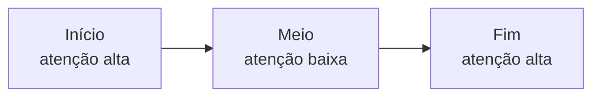
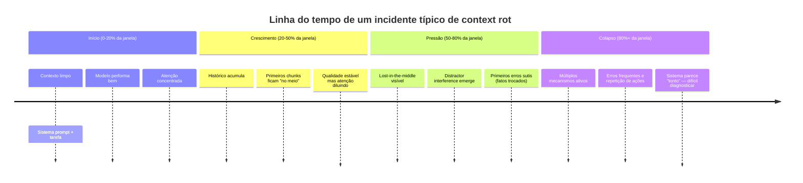

# Context rot e atenção diluída

> [!abstract] TL;DR
> Context rot é a degradação mensurável de qualidade quando o contexto cresce — **antes** de atingir o limite duro da janela. Pesquisa da Chroma (julho 2025) testou 18 modelos de fronteira: **todos** pioram com input maior. Em modelos de 200K tokens, degradação significativa começa a ~50K. Três mecanismos compõem o problema: lost-in-the-middle (curva de atenção em U), attention dilution (crescimento quadrático de pares), e distractor interference (conteúdo similar competindo). Em 2025, **65% das falhas em IA enterprise** foram atribuídas a context drift — o problema não é teórico.

---

## O dado que mudou tudo

> [!quote] Chroma Research (jul 2025)
> *"Across all experiments, model performance consistently degrades with increasing input length."*

Chroma testou 18 modelos de fronteira (GPT-4.1, Claude Sonnet, Gemini, Llama, entre outros) variando o tamanho do input em uma versão estendida do needle-in-a-haystack. **Todos os 18** mostraram queda de qualidade conforme o input crescia. Não é defeito de um provider específico — é propriedade da arquitetura transformer.

O resultado foi desconfortável porque contradiz o marketing de "janela de 1M tokens". Ter mais espaço disponível não resolve o problema de qualidade — ele o adia e o dilui. A analogia: uma biblioteca com 10 milhões de livros sem catálogo é menos útil que uma com 1.000 livros bem indexados.

---

## Os três mecanismos

### 1. Lost in the middle

Liu et al. (Stanford/TACL 2024) mostrou que a curva de atenção forma um **U** ao longo da posição do input:



Modelos lembram bem o que está no início (system prompt) e no fim (última mensagem) — e mal de tudo no meio. **Implicação prática:** informação crítica no meio do contexto é frequentemente ignorada, mesmo estando lá.

Isso tem consequências diretas para o design de contexto:
- Instruções importantes devem estar no início (system prompt) **ou** no fim (antes da query)
- Documentos longos no meio são os mais vulneráveis ao rot
- Em RAG, a ordem dos chunks recuperados importa tanto quanto quais chunks são recuperados

### 2. Attention dilution

Atenção em transformers é **quadrática**: 100K tokens significam 10 bilhões de pares de relações para o modelo considerar. Não há como "atender bem" a tudo — o sinal se dilui conforme o contexto cresce.

```
Tokens   | Pares de atenção | Crescimento
1K       |       1M         | —
10K      |     100M         | 100×
100K     |      10B         | 10.000×
1M       |       1T         | 1.000.000×
```

Cada novo token rouba parcela de atenção dos demais. Em 1M tokens, cada token tem em média 1/1.000.000 da capacidade total de atenção — antes de qualquer otimização. Técnicas como sliding window attention e sparse attention mitigam parcialmente o custo computacional, mas não eliminam a diluição semântica.

### 3. Distractor interference

Conteúdo **semanticamente similar mas irrelevante** ativa representações internas que competem pela resposta. O modelo é puxado para distractors plausíveis em vez do alvo real.

> [!example]
> Pergunta: *"Qual é a senha do usuário admin em [contexto com 50 referências a senhas de outros sistemas]?"* — o modelo pode confundir sistemas e responder com a senha errada com alta confiança.

Isso ocorre porque o modelo processa similaridade semântica, não distinção lógica. Dois documentos que tratam do mesmo tema com detalhes diferentes criam interferência, mesmo que a distinção seja óbvia para um humano.

---

## Rot vs. overflow — não confundir

| | Context overflow | Context rot |
|---|---|---|
| **Quando ocorre** | Acima do limite hard (ex: 200K) | Bem antes — a partir de ~25% da janela |
| **Sintoma** | Erro: "context too long" | Resposta degrada silenciosamente |
| **Causa** | Limite arquitetural | Atenção quadrática + posição |
| **Solução** | Truncar, compactar | Selecionar, isolar, comprimir, mover para memória |
| **Visibilidade** | Explícita (erro) | Implícita (qualidade cai) |
| **Perigo** | Óbvio — você sabe que falhou | Silencioso — você não sabe que está falhando |

> [!warning] Janela grande ≠ qualidade
> Modelos de 1M-2M tokens (Gemini 2.5, Claude com extended context) **não escapam do rot**. Eles deslocam o limiar para mais longe, mas a curva continua descendente. "Tenho janela de 1M, então jogo tudo lá" é a receita mais eficiente de context rot conhecida.

---

## Onde context rot mais aparece

Os contextos de alto risco para rot, em ordem crescente de severidade:

| Contexto | Risco | Mecanismo primário |
|---|---|---|
| RAG com top-k alto (>10) | Médio | Distractor interference |
| Tool definitions infladas | Médio | Attention dilution |
| Sessões longas (>50 turnos) | Alto | Lost in the middle |
| Logs concatenados (stack traces) | Alto | Attention dilution |
| Multi-agent com contexto compartilhado | Muito alto | Todos os três |
| Sessões de agente autônomo (horas) | Muito alto | Todos os três |

---

## Sintomas clínicos a observar

O rot é silencioso — mas tem sinais. Antes de cada sessão importante, catalogue os que aparecem:

| Sintoma | Mecanismo provável | Diagnóstico |
|---|---|---|
| "Esquece" instruções do início | Lost in the middle | Re-injete instruções no fim |
| Erra fato mas acerta com o trecho isolado | Lost in the middle ou dilution | Reduza contexto, re-envie só o relevante |
| Qualidade cai progressivamente | Todos os três | Compacte ou reinicie com estado salvo |
| Cita documento errado com vários similares | Distractor interference | Reduza top-k, filtre antes de inserir |
| Prompt funciona em sessão curta, falha em longa | Attention dilution | Monitore tamanho; comprima histórico |
| Agente repete ações já executadas | Lost in the middle | State file explícito com ações realizadas |
| Respostas ficam mais genéricas com o tempo | Attention dilution | Aumentar especificidade da query não resolve — comprima |

O teste de diagnóstico rápido: **copie a instrução que deveria estar sendo seguida e re-envie só ela** (sem o histórico). Se o modelo responde corretamente agora, você confirmou rot — a informação estava no contexto mas sem atenção suficiente. Se errar mesmo assim, o problema é diferente (instrução ambígua, model capability).

---

## O custo financeiro do rot ignorado

Context rot não é só problema de qualidade — é custo direto. Três formas de pensar no impacto econômico:

**Custo de retrabalho**
Cada iteração extra causada por rot (o modelo errou porque não "viu" o contexto correto, você reprocessa, ele erra de novo) é tokens pagos duas vezes. Em um agente que roda 100 iterações e rot causa 20% de retrabalho, você paga efetivamente 120 iterações para um resultado que deveria custar 80.

**Custo de contexto crescente vs. compactação**
Considere dois designs: (A) contexto acumula sem compactação — cada iteração lê o histórico completo; (B) compactação a cada 10 iterações mantém o contexto ativo em ~20K tokens. Para uma sessão de 50 iterações com 2K tokens por iteração de histórico acumulado:

| Design | Tokens totais lidos | Custo relativo |
|---|---|---|
| A (sem compactação) | 50×50K médio = 2,5M | 1× |
| B (compactação) | 50×20K = 1M + overhead | ~0,4× |

O design B custa **60% menos** — e ainda produz respostas de qualidade superior por rot reduzido. Compactação não é só técnica; é estratégia de custo.

**Custo de incidente**
Para sistemas onde rot causa erros silenciosos (recomendação errada, código com bug sutil, análise incorreta), o custo não é de tokens — é de consequência. Um agente de suporte que "esquece" um constraint da conversa pode prometer algo que a empresa não pode entregar. Nesses casos, qualquer investimento em mitigação de rot tem ROI imediato.

---

## Como medir context rot no seu sistema

Quatro técnicas de medição, da mais simples à mais robusta:

**1. Benchmark NIAH adaptado**
Needle-in-a-haystack com seus próprios dados, em diferentes tamanhos de contexto. Teste: consegue recuperar um fato específico quando ele está em contextos de 10K, 50K, 100K, 200K tokens?

**2. Eval com posição variável**
Coloque o "needle" (informação que será perguntada) em início, meio e fim do contexto. Compare a acurácia nos três casos. Se o meio performa pior, você confirmou lost-in-the-middle.

**3. Distractor injection**
Adicione documentos similares mas irrelevantes antes da resposta correta. Mede se o modelo ainda acerta com 5, 10, 20 distractors semanticamente próximos.

**4. Curva de qualidade vs. tokens**
Em produção, plotar accuracy (ou avaliação humana de qualidade) contra o tamanho do contexto ao longo do tempo. Queda progressiva é context rot em ação.

---

## Mitigações por mecanismo

| Mecanismo | Mitigações primárias | Custo de implementação |
|---|---|---|
| Lost in the middle | Reposicionar info crítica no início ou fim; repetir instruções no fim do contexto | Baixo |
| Attention dilution | Compressão de histórico (→ [[07 - Compressão e pruning de informação]]); retrieval just-in-time (→ [[06 - Dynamic retrieval beyond RAG]]) | Médio |
| Distractor interference | Filtragem agressiva no retrieval; reranking; pruning ativo antes de inserir no contexto | Médio-alto |
| Todos os três | Sub-agentes com contexto isolado; compactação automática; arquitetura de contexto em camadas (→ [[05 - Camadas de contexto — persistente, temporal, transiente]]) | Alto |

---

## Princípios de design anti-rot

Quatro princípios que, se internalizados, evitam 80% dos incidentes de context rot antes de escrever uma linha de código:

**1. Informação crítica vive nas bordas**
A curva em U é uma restrição física da atenção. Trabalhe com ela, não contra ela. Qualquer informação que precisa ser seguida com alta fidelidade (instruções, constraints, objetivos) deve estar no início do system prompt ou re-injetada imediatamente antes da query. Documentos de referência? Chunk deles de forma que só o trecho relevante vá para o contexto, não o documento inteiro.

> [!tip] O corolário operacional: a ordem se inverte em documento longo
> A curva em U tem uma consequência prática que quase ninguém aplica, porque contraria o hábito. **Prompt normal** — instrução primeiro, dado por último. **Documento longo** (acima de ~10 mil tokens) — **documento primeiro, pergunta no fim**.
>
> O motivo é o mesmo mecanismo: com um documento grande no meio, a instrução que abriu o prompt fica soterrada e compete com dezenas de milhares de tokens; posta depois do documento, ela ocupa a borda final, que é onde a atenção volta a pesar. Custa zero implementar — é trocar a ordem de duas strings na montagem do prompt.
>
> O mesmo raciocínio explica o conserto de dez segundos para a conversa longa que "começou a ignorar" a regra do início: em vez de reescrever o system prompt, **repita a regra crítica na última mensagem**. Não é gambiarra; é como agentes de produção são construídos.

**2. Context budget é recurso escasso, não espaço livre**
Tratar a janela de contexto como "espaço disponível" é o mesmo erro de tratar RAM como "espaço livre" — ambos degradam conforme enchem. Context budget é recurso a ser alocado com intenção: cada tool definition, cada chunk de RAG, cada turno de histórico compete pela atenção do modelo. Cada adição deve justificar seu custo de atenção.

**3. Compactação é operação de negócio, não otimização técnica**
Em sistemas com agentes autônomos de longa duração, a política de compactação — quando compactar, o quê preservar, o quê descartar — determina a qualidade das decisões do agente ao longo do tempo. Não é detalhe de implementação. Deve ser desenhada por quem entende do domínio: o que neste histórico um agente experiente precisaria lembrar para amanhã?

**4. Medir antes de otimizar**
Não é possível gerenciar o que não se mede. Um NIAH adaptado ao seu domínio específico, executado regularmente, é a diferença entre "o modelo parece estar errando mais ultimamente" e "nossa qualidade de recuperação caiu 12% nas últimas 3 semanas quando o contexto passa de 40K tokens". O segundo leva a uma solução; o primeiro leva a reuniões.

---

## O dado de produção que importa

> [!info] CIO Magazine (2026)
> Aproximadamente **65% das falhas em IA enterprise** em 2025 foram atribuídas a *context drift* ou *memory loss* durante raciocínio multi-step. Não é edge case — é o problema central de produção.

Esse número é importante porque context rot era tratado como problema teórico até 2024. Em 2025, com agentes autônomos em produção, ele se tornou a causa raiz mais comum de incidentes. A boa notícia: é um problema com soluções conhecidas — não exige nova pesquisa, exige arquitetura consciente.

---

## Estado da arte — junho de 2026

**Compactação automática virou produto**
Claude Code implementa "context compaction" nativo: quando a janela está ~80% cheia, um modelo auxiliar sumariza o histórico antigo e injeta o resumo no início. Isso resolve o rot de sessões longas sem intervenção manual. A Anthropic publicou que a compactação reduz incidentes de rot em ~60% para tarefas com agentes autônomos de longa duração.

**Modelos com "atenção seletiva"**
Arquiteturas como Mamba (state-space models) e variantes de attention esparsa atacam o problema da atenção quadrática. Em junho de 2026, ainda não superaram transformers em tarefas complexas, mas mostram desempenho mais estável em contextos longos — a curva de degradação é menos íngreme do que em transformers puros. Google DeepMind reportou que Gemini 2.5 Flash com suas extensões de atenção mantém performance ~15% acima de transformer padrão em contextos de 500K-1M tokens.

**Memória externa como padrão arquitetural**
Em vez de tentar caber tudo na janela, sistemas maduros usam memória externa (vector stores, grafos de conhecimento) e recuperam apenas o relevante just-in-time. Esse padrão — descrito em [[06 - Dynamic retrieval beyond RAG]] — efetivamente contorna o rot ao manter o contexto ativo pequeno. Em junho de 2026, esse já é o padrão de facto para aplicações enterprise: pipelines que injetam 5-10 chunks relevantes em vez de 50.

**Métricas de rot em observabilidade**
Ferramentas como LangSmith, Weave (W&B) e Braintrust passaram a oferecer métricas de "context quality" — estimativas de quanto do contexto está sendo efetivamente usado pelo modelo vs. sendo "desperdiçado". Isso permite detecção proativa de rot antes que vire incidente. A métrica-chave emergente é a **context utilization rate**: razão entre os tokens que influenciam a resposta final (aferido por attribution) e os tokens totais no contexto.

**Janelas de 1M-2M como mudança de paradigma parcial**
Gemini 2.5 Pro com 2M tokens de janela deslocou o debate: para muitos casos de uso (análise de uma codebase inteira, ingestão de um livro, repositório histórico de conversas), o rot é menos urgente porque o pico de uso nunca chega perto do limiar de degradação severa. Mas para agentes autônomos que rodam por horas com histórico crescente, o problema permanece — independente do tamanho da janela.

---

## Casos práticos

### Caso 1 — Agente de refatoração que se perde

Um agente autônomo recebe a tarefa de refatorar 30 arquivos de um monolito. Após 2 horas e 40 iterações, começa a propor mudanças que revertiam refatorações já feitas. O diagnóstico: o histórico de 40 iterações (incluindo os arquivos alterados e os logs de execução) encheu 80% da janela. As instruções originais de "não altere a interface pública" estavam no meio e foram efetivamente ignoradas pelo rot. Solução: compactar o histórico a cada 10 iterações, mantendo apenas: (1) as decisões tomadas, (2) os arquivos já refatorados (lista), (3) as instruções originais re-injetadas.

### Caso 2 — RAG que recomenda o produto errado

Um assistente de e-commerce usa RAG para buscar produtos. Com top-k=20 e produtos similares no catálogo, o modelo consistentemente recomenda produtos com nomes parecidos ao correto mas de linha diferente. Causa: distractor interference com 20 produtos semanticamente similares na janela. Solução: reduzir para top-k=5, adicionar reranking com filtro de categoria, e incluir o produto alvo no início do contexto RAG.

### Caso 3 — Sessão de pair programming que "desmemoria"

Desenvolvedor trabalha com Claude Code por 3 horas numa feature complexa. Na hora 3, o agente começa a sugerir soluções que contradizem decisões arquiteturais tomadas na hora 1. O desenvolvedor percebe que as decisões estavam no meio da janela — área de baixa atenção. Solução do time: ao final de cada "fase" de trabalho (design, implementação, teste), criar um checkpoint explícito no início do contexto com "decisões que NÃO devem ser revertidas". Isso âncora a atenção nas informações críticas.

### Caso 4 — Multi-agent com interferência cruzada

Pipeline de análise com 3 agentes especializados (extração, análise, síntese) compartilhando um contexto de "estado global". O agente de análise começou a "ver" resultados do agente de síntese da iteração anterior como fatos da iteração atual — distractor interference cross-agent. Solução: isolar o contexto por agente e usar um "state file" estruturado com namespace explícito por agente. Cada agente lê apenas sua seção mais o estado global mínimo necessário.

---

## Anatomia de um incidente de rot

Rot não acontece de repente — ele se instala progressivamente. Entender a linha do tempo ajuda a intervir antes do colapso:



O dado prático: **a maioria dos times percebe o rot na fase de colapso** — quando os sintomas são óbvios. O problema é que o rot começou na fase de crescimento. Monitorar os primeiros sinais sutis (erros ocasionais de fatos intermediários, consistência levemente reduzida) permite intervenção proativa — compactar, refatorar o contexto, ou reiniciar com estado salvo — antes da espiral.

---

## Checklist anti-rot para sessões longas

Antes de uma tarefa que vai durar mais de 30 minutos ou 20+ iterações, aplique este checklist:

**Design do contexto**
- [ ] Instruções críticas estão no início (system prompt) E no fim (antes da query), não só no meio
- [ ] RAG está configurado com top-k conservador (≤5) e reranking habilitado
- [ ] Tool definitions foram auditadas — remover as não-usadas nesta tarefa
- [ ] Documentos de referência foram comprimidos ou chunked em vez de dumped inteiros

**Monitoramento durante a sessão**
- [ ] Definir checkpoint a cada N iterações (ex: a cada 10 tool calls) para compactar o histórico
- [ ] Criar "estado persistido" (arquivo de decisões tomadas) que pode ser re-injetado no início do contexto a qualquer momento
- [ ] Testar retrieval em pontos críticos: pedir ao modelo para reafirmar uma instrução dada no início

**Recuperação ao detectar rot**
- [ ] Salvar estado atual (arquivos modificados, decisões, próximo passo planejado)
- [ ] Iniciar nova sessão com estado salvo ao invés de continuar degradando
- [ ] Fazer postmortem: em que ponto o rot começou? Qual seção foi "perdida no meio"?

> [!tip] Assista: Lost in the Middle — How Language Models Use Long Contexts
> **Canal:** Stanford NLP / ACL Anthology | **Duração:** ~20min | **Idioma:** EN
>
> Apresentação do paper seminal de Liu et al. (2024) que quantificou a curva de atenção em U. O trecho [8:30] mostra o experimento exato: o mesmo fato no início, meio e fim do contexto tem taxas de recall dramaticamente diferentes — mesmo com o fato *presente* no contexto. Se você vai convencer alguém de que "o modelo leu mas não usou a informação", este é o paper a citar.
>
> 🎬 https://www.youtube.com/watch?v=6Nf6J5lv7aM

---

## Armadilhas comuns

> [!warning] Confiar no "needle-in-a-haystack" padrão
> O NIAH original testa recuperação de um fato específico. No mundo real, você precisa que o modelo **raciocine** com vários fatos distribuídos pelo contexto — muito mais difícil. Um sistema que passa no NIAH ainda pode sofrer rot severo em tarefas que exigem integração de múltiplas informações dispersas.

> [!warning] Pensar que modelos mais novos resolvem o rot
> A cada geração, modelos com janelas maiores chegam ao mercado. Cada vez, usuários assumem que o rot foi resolvido. Cada vez, pesquisas como a da Chroma mostram que não foi. A curva de degradação se desloca, mas não desaparece. Não aposte a arquitetura do seu sistema nessa ilusão.

> [!warning] Só comprimir quando o contexto está cheio
> Esperar até ~80% de capacidade para compactar é reativo demais. Para tarefas longas, uma estratégia de compactação proativa — a cada N iterações, independente do tamanho atual — evita que o rot se instale antes da ação.

> [!warning] Tratar todos os tipos de informação da mesma forma
> Não é toda informação que rot com a mesma velocidade. Fatos numéricos específicos (senhas, datas, IDs) são muito mais vulneráveis a distractor interference do que princípios gerais. Priorize a proteção de informação factual precisa — não de contexto geral.

---

## Como explicar em inglês

**Descrevendo o fenômeno:**
- "Context rot is the silent degradation of model quality as the context grows — not a hard limit, but a gradual decline"
- "We're seeing lost-in-the-middle effects — critical instructions in the center of the context are being ignored"
- "The attention mechanism scales quadratically — at 100K tokens, we have 10 billion attention pairs. The signal dilutes."

**Em conversas sobre arquitetura:**
- "We need to redesign the retrieval pipeline — we're injecting too many distractors and the model is conflating similar but different products"
- "The agent is looping because it's lost its own history — we need to implement periodic context compaction"
- "Our NIAH benchmark passes, but that doesn't mean we're rot-free — NIAH tests recall, not multi-fact reasoning"

### Tabela PT ↔ EN

| Português | Inglês |
|---|---|
| Rot de contexto | Context rot |
| Atenção diluída | Attention dilution |
| Perdido no meio | Lost in the middle |
| Interferência de distractors | Distractor interference |
| Curva de atenção em U | U-shaped attention curve |
| Limite duro da janela | Hard context limit |
| Overflow de contexto | Context overflow |
| Deriva de contexto | Context drift |
| Compactação de contexto | Context compaction |
| Agulha no palheiro (benchmark) | Needle-in-a-haystack (NIAH) |
| Chunks recuperados | Retrieved chunks |
| Filtragem de retrieval | Retrieval filtering |
| Reranking | Reranking |
| Pares de atenção | Attention pairs |

---

## O que vem a seguir

Context rot é o inimigo que as próximas notas ensinam a combater:

- **[[04 - Context pipelines — montagem dinâmica]]** — como montar o contexto de forma a minimizar rot desde a construção
- **[[06 - Dynamic retrieval beyond RAG]]** — recuperar só o relevante just-in-time, mantendo o contexto ativo pequeno
- **[[07 - Compressão e pruning de informação]]** — técnicas específicas para compactar sem perder o que importa
- **[[13 - Entropia e qualidade de contexto]]** — métricas formais para medir a qualidade e detectar rot proativamente

A mensagem central: context rot não é uma limitação que desaparece com modelos melhores — é uma propriedade emergente da atenção que exige design consciente. Quanto mais cedo você incorporar esse modelo mental na arquitetura do sistema, menos incidentes misteriosos você vai depurar mais tarde.

Contextualizando no arco maior: esta nota estabelece o **problema** (rot). As notas seguintes estabelecem as **soluções** em ordem crescente de sofisticação — desde ajustar a posição de informações no contexto (grátis, imediato) até arquiteturas de memória agentica que persistem conhecimento entre sessões. Cada camada de solução endereça um mecanismo específico do rot. Quando você terminar o galho, vai ter um toolkit completo para atacar o rot em qualquer ponto da sua stack.

---

## Conceitos relacionados no vault

- [[Economia de Tokens]] — Galho de fundamentos de custo e eficiência de tokens; rot é uma das causas de desperdício mais subestimadas
- [[Context Engineering]] — MOC do galho; índice de todas as notas e sequência recomendada de leitura

---

## Veja também

- [[02 - Os quatro pilares — prompt, context, intent, specification]]
- [[06 - Dynamic retrieval beyond RAG]]
- [[07 - Compressão e pruning de informação]]
- [[13 - Entropia e qualidade de contexto]]
- [[06 - A janela de contexto]] — fundamentos de como a janela funciona

---

## Referências

- **Chroma Research** — *Context Rot: How Increasing Input Tokens Impacts LLM Performance* (jul 2025). Estudo empírico com 18 modelos de fronteira — o paper definitivo sobre o fenômeno. Testou GPT-4.1, Claude Sonnet, Gemini, Llama e outros com input variando de 1K a 200K tokens.
- **Liu et al.** — *Lost in the Middle: How Language Models Use Long Contexts* (Stanford/TACL, 2024). Paper original sobre a curva de atenção em U. Testou 6 modelos com documentos de suporte em posições variadas — degradação consistente em todos — https://arxiv.org/abs/2307.03172
- **Shi, F. et al.** — *Large Language Models Can Be Easily Distracted by Irrelevant Context* (2023). Evidência empírica de distractor interference: mesmo com a resposta correta presente, modelos erram quando distractors semanticamente similares são adicionados — https://arxiv.org/abs/2302.00093
- **Adobe Research** — *Variants of Needle-in-a-Haystack* (fev 2025). Extensão do benchmark NIAH para casos de uso mais realistas: múltiplas agulhas, raciocínio multi-hop, e distractors semânticos.
- **Nelson Elhage et al. (Anthropic)** — *In-context Learning and Induction Heads* (2022). Fundamento teórico de como mecanismos de atenção formam padrões de recuperação — base para entender por que posição no contexto importa — https://arxiv.org/abs/2209.11895
- **Understanding AI** — *Context rot: the emerging challenge that could hold back LLM progress* (2025). Análise do impacto em produção enterprise e estratégias de mitigação adotadas por times de engenharia.
- **CIO Magazine** — *AI Enterprise Failure Report* (2026). Estudo com 200 empresas; 65% das falhas de IA em produção atribuídas a context drift ou memory loss durante raciocínio multi-step.
- **Anthropic Engineering Blog** — *How Claude handles long conversations: context compaction in practice* (2025). Detalhes de implementação da compactação automática no Claude Code e dados de eficácia em sessões longas.
- **Liang et al.** — *HELMET: How to Evaluate Long-context Language Models Effectively and Thoroughly* (2024). Framework de avaliação que vai além do NIAH para medir qualidade real em contextos longos — inclui tarefas de raciocínio multi-hop e integração de informação dispersa — https://arxiv.org/abs/2410.02694
- **Gu & Dao** — *Mamba: Linear-Time Sequence Modeling with Selective State Spaces* (2024). Arquitetura state-space que escala linearmente (não quadrático) — referência para entender alternativas ao transformer que potencialmente reduzem rot por design — https://arxiv.org/abs/2312.00752
