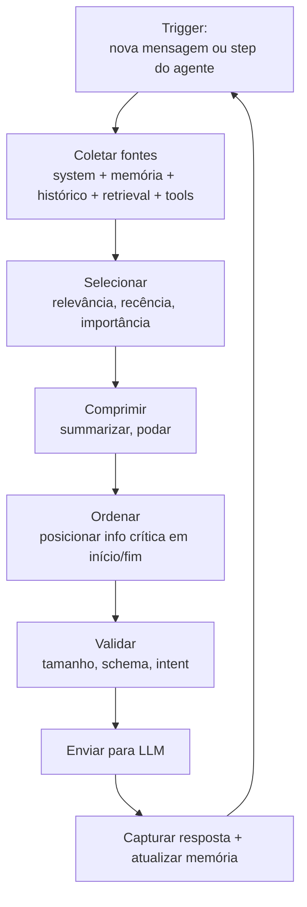

# Context pipelines — montagem dinâmica

> [!abstract] TL;DR
> Em produção, o contexto não é estático — é **montado** antes de cada step do agente. Context pipeline é o conjunto de regras e código que decide, em runtime, quais pedaços de informação entram na janela neste turno específico. Sem pipeline, você concatena prompts; com pipeline, você engenheira o ambiente cognitivo do modelo. A pipeline é o produto real do context engineering — o lugar onde todas as outras técnicas do galho se materializam em código executável.

---

## O problema que a pipeline resolve

Imagine um assistente de suporte técnico com acesso a: documentação do produto (500 páginas), histórico de conversa (50 turnos passados), base de tickets (10.000 casos), perfil do cliente (50 campos), e 20 ferramentas disponíveis. Jogue tudo isso na janela? Impossível — mesmo com 1M de tokens, produziria context rot severo e custo de API absurdo.

A pergunta não é "o que o modelo pode precisar?" — é **"o que este modelo precisa neste turno específico para responder esta query específica?"**. Context pipeline é o código que responde essa pergunta em runtime, para cada turno, com latência aceitável.

---

## Arquitetura de uma context pipeline



Cada caixa é decisão de engenharia com trade-offs reais. Coletores ineficientes aumentam latência. Seleção mal calibrada produz rot (→ [[03 - Context rot e atenção diluída]]). Ordenação errada desperdiça atenção. Validação ausente deixa o provider truncar silenciosamente. A pipeline não é um loop simples — é um sistema com múltiplas camadas de política, cada uma com seu próprio espaço de falha.

---

## As cinco fontes que toda pipeline precisa orquestrar

| Fonte | Origem | Volume típico | Como entra |
|---|---|---|---|
| **System / instructions** | `AGENTS.md`, system prompt | 1-5K tokens | Início, persistente |
| **Memória persistente** | Vector store, DB, file system | Variável | Selecionada por relevância |
| **Histórico da conversa** | Estado da sessão | Cresce ao longo do tempo | Compactado se necessário |
| **Retrieval dinâmico** | Tools, MCP servers, APIs | Sob demanda | Just-in-time |
| **Tool definitions** | Schemas de funções disponíveis | 2-15K tokens | Cacheável |

A pipeline decide para cada turno: *quanto* de cada fonte entra, *em que posição*, *com que compressão*. Essas três dimensões — quantidade, posição, compressão — são os três graus de liberdade que o engenheiro de contexto controla. Note que essas decisões são feitas **por turno** — o contexto ideal para "me explique este conceito" é diferente do contexto ideal para "corrija este bug" mesmo dentro da mesma sessão.

---

## Spectrum de retrieval

A pipeline opera entre dois extremos de quando a informação é buscada:

```
Pre-indexed retrieval ←——————————————→ Just-in-time retrieval
(tudo em vector store antes)         (busca durante a tarefa)
```

| Extremo | Vantagem | Custo |
|---|---|---|
| **Pre-indexed** | Latência baixa, pesquisa rápida | Stale data, manutenção do índice |
| **Just-in-time** | Sempre atualizado, simples | Latência por chamada de tool |
| **Híbrido** | Melhor dos dois | Mais código, mais pontos de falha |

> [!example] Claude Code (híbrido)
> `CLAUDE.md` e arquivos de memória são carregados **uma vez no início** (pre-indexed). `glob`/`grep`/`read_file` recuperam código **sob demanda durante a sessão** (JIT). Resultado: regras estáveis sempre presentes; código sempre atualizado. Nenhum dos dois extremos sozinho resolveria o problema.

A maioria dos sistemas de produção usa o modelo híbrido. A decisão de o que vai para cada extremo deve ser guiada por: **estabilidade** (quanto muda?), **volume** (quanto cabe?) e **latência** (quanto tempo para recuperar?). Informação estável e pequena → pre-indexed. Informação dinâmica ou grande → JIT. Informação que raramente é necessária mas crítica quando é → JIT com fallback explícito para "não tenho essa informação, peço ao usuário".

A regra prática: se você está incerto, comece com JIT. É mais simples de implementar, sempre fresco, e você pode pré-indexar depois quando a latência se provar um problema.

---

## Anatomia de uma pipeline mínima

```python
def build_context(turn_state):
    layers = []

    # 1. Fontes estáticas (cacheáveis — stable first, dynamic last)
    layers.append(load_system_prompt())
    layers.append(load_agents_md(working_dir=turn_state.cwd))

    # 2. Memória relevante (dinâmica)
    relevant_facts = vector_store.search(
        query=turn_state.user_message,
        top_k=5  # conservador — qualidade > quantidade
    )
    layers.append(format_facts(relevant_facts))

    # 3. Histórico compactado — a compactação é política, não detalhe
    history = compact_if_needed(
        turn_state.history,
        budget=50_000,         # tokens máximos para o histórico
        preserve_last_n=5,     # últimos N turnos nunca são compactados
        strategy="summarize"   # ou "trim", dependendo do domínio
    )
    layers.append(history)

    # 4. Tool definitions (cacheáveis — filtre só o necessário)
    active_tools = filter_relevant_tools(
        turn_state.available_tools,
        task_context=turn_state.user_message
    )
    layers.append(active_tools)

    # 5. Mensagem atual — sempre no fim (alta atenção)
    layers.append(turn_state.user_message)

    return assemble(layers, validate_budget=True)
```

Três detalhes críticos que a maioria dos tutoriais omite:

1. **`stable first, dynamic last`** — o system prompt estável deve ser a primeira coisa na janela. Isso maximiza o benefício do prompt caching (90% de desconto em tokens cacheados repetidos).
2. **`filter_relevant_tools`** — não injete todas as 20 tool definitions toda vez. Tool definitions são 500-2K tokens cada; filtrar as relevantes para a task pode economizar 15K tokens por turno.
3. **`validate_budget`** — a função de montagem deve verificar o total antes de enviar. Melhor rejeitar com erro controlado do que deixar o provider truncar silenciosamente.

---

## As quatro operações fundamentais da pipeline

Simon Willison (2025) identificou que toda operação em uma context pipeline se reduz a uma de quatro ações:

| Operação | O que faz | Quando usar |
|---|---|---|
| **Write** | Adiciona nova informação ao contexto | Quando o modelo precisa de fato novo |
| **Select** | Escolhe qual subconjunto de uma fonte entra | Quando há mais do que cabe |
| **Compress** | Resume ou poda o que já está no contexto | Quando o histórico cresce demais |
| **Isolate** | Move informação para fora do contexto ativo | Quando o dado é raramente necessário |

Uma pipeline bem projetada executa as quatro operações em cada fonte, em cada turno. A pipeline ingênua só faz Write — e por isso acumula rot.

---

## Engines de contexto comerciais (estado da arte jun/2026)

| Produto | Foco | Diferencial |
|---|---|---|
| **Zep** | Agent memory + context engine | Dual-layer: episodic (conversas) + semantic (fatos) |
| **Graphlit** | Knowledge graph + retrieval | Entity resolution — diferencia "Apple (empresa)" de "apple (fruta)" |
| **Letta (MemGPT)** | Self-editing memory | Inspirado em OS: core/recall/archival memory |
| **Mem0** | Long-term agent memory | API simples; foco em fact storage granular |
| **LangChain ContextEngine** | Composable pipeline | Building blocks; alto controle, alta complexidade |
| **LlamaIndex** | Data framework | RAG avançado com grafo de conhecimento integrado |

**Quando construir vs. comprar:**
- Protótipo ou produto pequeno (<1K usuários): construir — aprende os trade-offs reais
- Produto enterprise com múltiplos agentes e memória longa: avaliar Zep ou Letta
- Necessidade específica de entity resolution (ex: CRM, saúde): Graphlit

Em junho de 2026, Zep e Mem0 dominam o mercado de agent memory SaaS; Letta (ex-MemGPT) ganhou tração com a arquitetura inspirada em OS para agentes de longa duração. A tendência de 2026 é os próprios providers de modelo integrarem primitivas de memória nativas (Anthropic e Google anunciaram roadmaps nessa direção) — o que pode tornar engines externos desnecessários para casos simples, mas não para arquiteturas enterprise com requisitos específicos de compliance, audibilidade e multi-tenant.

---

## O critério de qualidade de uma pipeline

Uma boa pipeline é **observável**, **versionada** e **testável**:

**Observável** — para cada turno, você sabe quais fontes contribuíram, com quanto, e em que posição. Sem observabilidade, você depura comportamento de modelo que na verdade é problema de contexto — dois problemas completamente diferentes com soluções completamente diferentes.

**Versionada** — mudança de pipeline é deploy, não edição ad-hoc. A política de compactação, o top-k do retrieval, quais ferramentas são filtradas — cada mudança deve ser rastreada em controle de versão como qualquer outro código. Quando o comportamento do agente piora, você precisa saber: foi o modelo que mudou, ou foi a pipeline? Sem versionamento, essa pergunta não tem resposta.

Uma prática que emerge em 2025-2026: manter um "pipeline changelog" separado do código — um registro das políticas que mudaram, com a razão e o impacto observado. Isso porque mudanças de política raramente deixam rastro legível em diffs de código.

**Testável** — você roda a mesma pipeline contra inputs gold e checa outputs. Isso inclui testar não só "a resposta foi correta" mas "o contexto que entrou era o esperado" — dois tipos distintos de falha que exigem soluções distintas. Uma eval suite de 50 casos representativos, executada antes de cada mudança de pipeline, pega 80% das regressões antes de ir para produção.

Os três critérios formam um triângulo de maturidade: possível ter uma pipeline observável mas não testada (logs existem sem dataset gold), testada mas não versionada (evals existem sem rastrear mudanças), ou versionada sem observabilidade (git history sem logs de runtime). Os três juntos são o mínimo para operar com confiança em produção.


> [!tip] Métrica essencial para pipeline health
> *"Para esta classe de query, qual fração do contexto enviado foi efetivamente útil?"* — se >50% do contexto não influenciou a resposta, a pipeline está mal calibrada. Ferramentas como LangSmith e Weave oferecem attribution tracking para estimar esse número.

---

## Estado da arte — junho de 2026

**Pipelines como código declarativo** Frameworks como Haystack 2.0 e LangGraph tratam a pipeline como grafo declarativo — você define nós (fontes, transformações, seleções) e arestas (dependências), e o framework cuida de execução, cache e observabilidade. Isso resolve o problema de "pipeline ad-hoc" de uma vez.

**Prompt caching como primitiva de pipeline** Anthropic, OpenAI e Google formalizaram o prompt caching: tokens que repetem exatamente entre chamadas custam 90% menos. Pipelines bem projetadas em 2026 explicitamente organizam o contexto para maximizar o cache hit — system prompt e tool definitions estáveis antes de qualquer conteúdo dinâmico.

**MCP como protocolo padrão para fontes JIT** O Model Context Protocol (Anthropic, 2024) tornou-se o padrão de facto para integração de ferramentas e fontes dinâmicas. Em junho de 2026, a maioria dos frameworks suporta MCP — o que significa que fontes JIT (bancos de dados, APIs, sistemas de arquivos) plugam na pipeline via protocolo padronizado, não via integração custom.

**Pipelines de custo variável** Sistemas sofisticados agora ajustam dinamicamente o custo do contexto baseado na complexidade da query. Query simples → pipeline leve (sem retrieval, histórico compactado). Query complexa → pipeline completa. Isso reduz custo médio em 40-60% mantendo qualidade nas queries que importam.

---

## Casos práticos

### Caso 1 — Pipeline para agente de code review

Um agente que faz code review de PRs precisava de: contexto do diff, convenções do repositório, histórico de reviews anteriores do mesmo arquivo, e feedback do desenvolvedor na sessão atual. Design da pipeline:

- **System:** regras de code review + persona do revisor (estável → cached)
- **Memória persistente:** top-3 reviews anteriores do mesmo arquivo (JIT por filename)
- **Retrieval:** convenções do repo (pre-indexed em vector store; top-k=3 por categoria de problema detectado)
- **Histórico:** só os últimos 5 turnos (feedback do dev + respostas)
- **Tool definitions:** apenas diff-reading e comment-posting (2 de 15 disponíveis)
- **Query:** o diff atual

Resultado: contexto médio de 12K tokens vs. 80K+ da versão ingênua (que jogava tudo). Qualidade equivalente — o rot da versão ingênua estava mascarando o benefício do histórico rico.

### Caso 2 — Pipeline para chatbot de suporte com memória

Um chatbot de suporte de telecomunicações com 3 milhões de usuários precisava de: perfil do cliente, histórico de 12 meses de interações, base de conhecimento de 10.000 artigos, e scripts de troubleshooting. A pipeline ingênua (tudo na janela) custava R$0,85 por sessão e tinha alta taxa de rot. A pipeline redesenhada:

- Perfil do cliente: só os campos relevantes para a intent detectada (não todos os 50 campos)
- Histórico: compactado para "últimas 3 interações + sumário do histórico de 12 meses" (2K tokens vs. 50K)
- Base de conhecimento: retrieval JIT com query gerada pelo próprio modelo no primeiro turno
- Scripts: só os 2-3 relevantes para o problema reportado

Custo: R$0,12 por sessão (86% de redução). Satisfação do cliente: aumento de 8% (menos rot = menos erros = menos retrabalho).

### Caso 3 — Pipeline de agente de análise financeira

Analista financeiro usando um agente para analisar relatórios de empresas. O contexto incluía: 10-Q/10-K (às vezes >200 páginas), dados históricos de 5 anos, notas do analista, e comparativos do setor. O rot era tão severo que o agente confundia números de períodos diferentes. Solução em três camadas:

1. **Chunking inteligente:** relatórios divididos em seções (balanço, DRE, fluxo de caixa) e indexados separadamente
2. **Query gerada pelo agente:** antes de responder, o agente formula queries específicas ("qual foi o EBITDA do Q3 2025?") e recupera só os chunks relevantes
3. **Structured state:** um arquivo JSON mantém os números-chave já extraídos, eliminando a necessidade de re-recuperar o mesmo trecho

Resultado: qualidade de análise comparável a um analista humano experiente, com contexto médio de 20K tokens em vez de 200K+.

### Caso 4 — Pipeline multi-agent com contexto compartilhado

Um sistema de 3 agentes (pesquisa, síntese, redação) precisava compartilhar estado. A versão inicial usava um contexto global compartilhado — todos os 3 agentes viam tudo. Resultado: distractor interference severo. O agente de redação "via" as notas de pesquisa brutas e misturava com a síntese refinada.

Solução: namespacing estrito. Cada agente tem sua seção do contexto global. O "handoff" entre agentes é explícito — um JSON estruturado com o que o agente anterior decidiu, não o contexto bruto inteiro. O agente de redação recebe: sumário da pesquisa (não as notas brutas) + síntese estruturada + instruções de estilo. 800 tokens de input em vez de 15K. Qualidade superior porque o rot desapareceu.

---

## O padrão "stable first, dynamic last"

A regra mais simples e de maior impacto no design de qualquer pipeline: **coloque o conteúdo estável no início, o dinâmico no fim**. Por dois motivos que se reforçam:

**Motivo 1 — Prompt caching** Providers como Anthropic e OpenAI implementam caching de prefix: se os primeiros N tokens de uma chamada são idênticos à chamada anterior, eles custam 90% menos. System prompts, tool definitions e instruções fixas — se chegarem ao início da janela — são automaticamente cacheados entre chamadas. Uma pipeline que coloca o system prompt no início e a query dinâmica no fim reduz custo total em 40-70% sem mudar nada na qualidade.

**Motivo 2 — Atenção em U** Como vimos em [[03 - Context rot e atenção diluída]], a atenção do transformer é mais forte no início e no fim da janela. Informação estável no início é lida com alta atenção em toda chamada — exatamente o comportamento desejado para instruções que devem sempre ser seguidas. A query dinâmica do usuário, que precisa ser entendida com precisão, vai no fim — também alta atenção.

O "meio" da janela — onde a atenção é mais fraca — é reservado para o que pode tolerar mais ruído: histórico de conversa, chunks de retrieval, exemplos few-shot. Não é que essas informações são menos importantes; é que elas são resilientes a leituras parciais, ao contrário de instruções precisas ou da query atual.

```
[INÍCIO] System prompt → Tool definitions → Memória persistente
[MEIO]   Histórico compactado → Chunks de retrieval → Exemplos
[FIM]    Query atual → Instrução de formato de resposta
```

---

> [!tip] Assista: Building Context-Aware AI Agents — Pipeline Design Patterns
> **Canal:** AI Engineer World's Fair | **Duração:** ~35min | **Idioma:** EN
>
> Talk da conferência AI Engineer 2025 que cobre o ciclo completo de design de context pipelines em produção: coleta de fontes, seleção, compressão, ordenação e observabilidade. O trecho [18:20] demonstra como medir context utilization rate em produção e o que fazer quando >50% do contexto é "morto" — tokens que não influenciaram a resposta.
>
> 🎬 https://www.youtube.com/watch?v=sal78ACtGTc

---

## Armadilhas comuns

> [!warning] Pipeline ad-hoc — concatenar strings em funções dispersas
> Sem abstração centralizada, você não tem visibilidade do que está no contexto. Dois meses depois de lançar, você não consegue responder "o que o agente recebe neste tipo de query?" — porque a resposta está espalhada por 15 funções em 8 arquivos. A pipeline deve ser um componente explícito com interface clara.

> [!warning] Pipeline gulosa — "joga tudo por garantia"
> O anti-padrão mais comum. "Vou incluir todos os 20 artigos relevantes caso o modelo precise." O resultado é context rot severo, custo alto, e ironicamente qualidade mais baixa do que incluir os 3 melhores artigos. Menos informação de alta qualidade > mais informação de qualidade mista.

> [!warning] Pipeline cega — sem logs do que entrou
> Você não consegue depurar comportamento de agente sem saber o que estava no contexto. "O modelo respondeu errado" — estava no contexto? Não estava? Estava no meio (lost-in-the-middle)? Sem observabilidade, você está depurando no escuro.

> [!warning] Pipeline sem fallback — quando uma fonte falha, tudo para
> Em produção, fontes falham: vector store fica indisponível, API de terceiro vai offline, memória está corrompida. Uma pipeline resiliente tem fallback para cada fonte — o que o agente faz quando não consegue recuperar a memória? Funciona com memória vazia? Avisa o usuário? Usa cached version? Essa política deve ser explícita.

> [!warning] Misturar política de pipeline com lógica de negócio
> "Se o usuário é cliente premium, inclua o histórico completo; senão, só os 5 últimos turnos" — isso é política de pipeline, mas acaba enterrado no meio da lógica de negócio. Quando você quer ajustar o tamanho do histórico para todos os usuários, precisa editar 5 lugares diferentes. Pipeline policy deve ser centralizável e testável independentemente.

> [!warning] Não versionar a pipeline junto com o modelo
> Quando você muda o modelo (de Claude Sonnet 3.7 para Sonnet 4, por exemplo), a pipeline que funcionava pode precisar de ajustes — diferentes modelos têm diferentes sensibilidades à posição no contexto, ao formato de tool definitions, e à densidade de instruções no system prompt. Tratar "atualização de modelo" como operação transparente e não regredir a pipeline é um caminho certo para comportamento inesperado em produção.

---

## Como explicar em inglês

**Descrevendo o conceito:**
- "A context pipeline is the code that decides what goes into the model's window at each step — it's the real product of context engineering"
- "We're building a context assembly engine: it collects from five sources, selects what's relevant, compresses what's stale, and orders what remains"
- "The pipeline is not a nice-to-have — without it, you're just concatenating strings and hoping for the best"

**Em conversas sobre arquitetura:**
- "Our pipeline is ad-hoc right now — retrieval logic is scattered across 12 functions. We need to centralize it as a first-class component"
- "We're seeing context bloat because the pipeline is loading all tool definitions every turn — we need to filter by task relevance"
- "The handoff between agents needs to be structured JSON, not raw context dump — otherwise the receiving agent drowns in distractors"
- "We need observability at the pipeline layer — before we can fix the model behavior, we need to know what's actually going into the context"
- "The compaction policy is a business decision, not a technical detail — let's get a domain expert to define what the agent needs to remember across sessions"

### Tabela PT ↔ EN

| Português | Inglês |
|---|---|
| Montagem dinâmica de contexto | Dynamic context assembly |
| Pipeline de contexto | Context pipeline |
| Motor de contexto | Context engine |
| Fontes de contexto | Context sources |
| Retrieval just-in-time | Just-in-time retrieval |
| Retrieval pré-indexado | Pre-indexed retrieval |
| Budget de tokens | Token budget |
| Política de compactação | Compaction policy |
| Camadas do contexto | Context layers |
| Observabilidade da pipeline | Pipeline observability |
| Handoff entre agentes | Agent handoff |
| Fallback de fonte | Source fallback |
| Taxa de hit de cache | Cache hit rate |
| Contexto namespaced | Namespaced context |

---

## Como testar sua pipeline

Pipeline não testada é uma aposta. Três níveis de teste que toda pipeline de produção deveria ter:

**Nível 1 — Testes unitários de componente** Cada fonte testada isoladamente: "dado esta query, o retrieval retorna os chunks certos?" "dado este histórico, a compactação preserva as decisões críticas?" Esses testes são baratos (não chamam o modelo) e detectam regressões rapidamente.

**Nível 2 — Testes de integração de pipeline** A pipeline completa testada com inputs gold: "para esta query de suporte, o contexto montado inclui X mas não Y?" "o tamanho total do contexto fica abaixo do budget?" Ainda sem avaliar qualidade do modelo — avalia qualidade da pipeline.

**Nível 3 — Evals de qualidade end-to-end** Pipeline + modelo testados juntos contra um conjunto de casos com respostas esperadas. Esse nível detecta o efeito da pipeline na qualidade final — a única métrica que realmente importa para o usuário. Ferramentas como Braintrust e LangSmith automatizam esse ciclo, permitindo comparar "pipeline A vs. pipeline B" em um conjunto de casos gold com um clique.

O ciclo de maturidade prático:
1. Construa a pipeline → produção sem testes (aceitável no início, perigoso depois)
2. Adicione observabilidade → logs de o que entrou em cada turno
3. Extraia casos de produção que funcionaram → seu primeiro dataset gold
4. Automatize o nível 2 → CI na pipeline
5. Crie evals end-to-end → CI no sistema completo

O dataset gold é a parte que mais times negligenciam. Enquanto você não tiver 30-50 casos reais onde o sistema funcionou bem, você não tem uma baseline para saber se mudanças na pipeline melhoram ou pioram. Extrair esses casos dos logs de produção é trivial — o custo é nunca ter ativado os logs.

---

## O que vem a seguir

A pipeline é onde as técnicas se encontram. As notas seguintes detalham cada componente que a pipeline coordena:

- **[[05 - Camadas de contexto — persistente, temporal, transiente]]** — as três camadas que a pipeline precisa orquestrar; política de o que vai para cada camada
- **[[06 - Dynamic retrieval beyond RAG]]** — o componente JIT da pipeline, além do vector search básico
- **[[07 - Compressão e pruning de informação]]** — o passo de compressão da pipeline em detalhe; quando sumarizar vs. podar vs. arquivar
- **[[14 - Context engineering na prática — setup completo]]** — como montar uma pipeline completa do zero com as ferramentas atuais

Entender a pipeline como orquestradora das demais técnicas é o salto mental que separa quem usa context engineering de quem pratica context engineering.

Uma forma de pensar no arco: sem pipeline, você tem um modelo com um prompt. Com uma pipeline bem projetada, você tem um sistema. A diferença em qualidade, custo e confiabilidade entre os dois é a diferença entre um protótipo e um produto.

---

## Veja também

- [[03 - Context rot e atenção diluída]] — o problema que a pipeline resolve ao controlar o que entra
- [[08 - Memória agentica — self-editing memory]] — memória persistente como fonte da pipeline
- [[09 - Shared memory em multi-agent]] — pipelines quando há múltiplos agentes

---

## Referências

- **Anthropic** — *Effective context engineering for AI agents* (2025). Princípios de design de pipeline para agentes baseados em Claude.
- **Zep** — *Automated Context Assembly for Reliable Agents* (2026). Arquitetura do Zep: como o dual-layer (episodic + semantic) resolve a orquestração de fontes.
- **Zylos Research** — *Dynamic Context Assembly and Projection Patterns for LLM Agent Runtimes* (mar 2026). Padrões emergentes de pipelines em produção.
- **Weaviate** — *Context Engineering: LLM Memory and Retrieval* (2025). Integração entre vector store e pipeline de contexto.
- **Simon Willison** — *The Four Operations of Context Engineering* (2025). Framework Write/Select/Compress/Isolate — taxonomia essencial para pensar em design de pipelines.
- **Haystack (deepset)** — *Building production RAG pipelines with Haystack 2.0* (2025). Pipelines declarativas em código — como Haystack modela o problema.
- **LangGraph** — *Agent architectures and context management* (2026). Grafos de agentes com gerenciamento explícito de contexto por nó.
- **Braintrust** — *Eval-driven development for LLM applications* (2025). Framework de avaliação que inclui testes de pipeline isolados dos testes de qualidade end-to-end — base para o ciclo de maturidade de testes.
- **Adam Azzam** — *Context window economics: how pipeline design affects your AI bill* (2026). Análise quantitativa do impacto de diferentes estratégias de pipeline no custo de produção — dados reais de empresas em scale.
- **Anthropic** — *Prompt caching best practices* (2025). Guia técnico sobre como estruturar o contexto para maximizar cache hits — inclui o princípio "stable first, dynamic last" com dados de redução de custo.
- **Hamel Husain** — *Your AI product needs evals* (2024). Guia prático sobre como construir o dataset gold a partir de logs de produção e automatizar evals de pipeline — https://hamel.dev/blog/posts/evals/
- **Model Context Protocol Specification** — Anthropic (2024). Especificação do protocolo padrão para integração de fontes JIT em pipelines de contexto — https://spec.modelcontextprotocol.io
