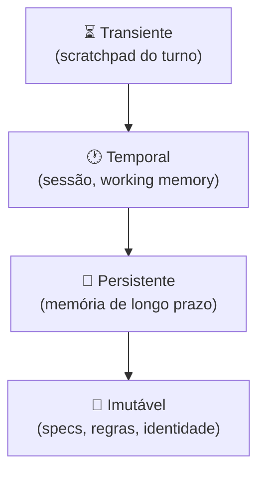

# Camadas de contexto — persistente, temporal, transiente

> [!abstract] TL;DR
> Nem todo contexto vive no mesmo lugar nem tem o mesmo tempo de vida. Arquiteturas modernas (Letta, Zep, Claude Code) separam contexto em quatro camadas: **imutável** (specs e identidade, dias a meses), **persistente** (memória de longo prazo do usuário/projeto, semanas a anos), **temporal** (working memory da sessão, horas a dias), **transiente** (scratchpad do turno atual, segundos). Misturar tudo numa pilha única é a causa raiz de context rot em projetos amadores — o equivalente a usar uma única variável global para armazenar tudo no código.

---

## O problema da pilha única

Imagine um assistente pessoal de IA que usa um só "contexto" para tudo: as regras de comportamento, o histórico de 6 meses de conversas, os resultados das tools do turno atual, e as instruções para este turno específico. Com o tempo, essa pilha cresce, o que mais importa se perde no meio, e o agente começa a "esquecer" regras que nunca deveriam ter sido esquecíveis.

É como misturar código-fonte, logs de produção, variáveis de sessão e stack traces em um único arquivo gigante — tecnicamente funciona, mas o custo de manutenção e a taxa de bugs crescem de forma que nenhuma adição de capacidade resolve.

A solução é o mesmo princípio que resolve o problema no código: **separação de responsabilidades** com escopos e ciclos de vida explícitos.

---

## A hierarquia das quatro camadas



Quanto mais alto na pirâmide, **mais volátil** — muda turno a turno. Quanto mais baixo, **mais estável** — muda raramente e com intenção. A regra de ouro: informação desce raramente (persistir o que foi aprendido), nunca sobe (não deixar regras imutáveis contaminarem a working memory).

---

## Camada 1 — Imutável (specs, regras, identidade)

**Vida útil:** dias a meses. Mudança = deploy deliberado.

**Conteúdo:**
- System prompt do agente ("você é um assistente de…")
- `AGENTS.md` / `CLAUDE.md` / `SKILL.md` (→ [[11 - Skills e instructions como contexto]])
- Specs executáveis, regras de negócio, compliance, políticas
- Persona, tom, restrições de comportamento

**Onde mora:** repositório de código, versionado em git.

**Inserção no contexto:** **sempre no início, todos os turnos**. Excelente candidato a prompt caching — tokens idênticos entre chamadas custam 90% menos. Com 1000 chamadas/dia, o prompt imutável amortiza seu custo de forma agressiva.

**Erro clássico:** tratar specs como configuração mutável em banco de dados. Quando specs mudam sem deploy (sem revisão, sem log), o comportamento do agente muda de forma não rastreável. Specs são código — devem viver em git.

---

## Camada 2 — Persistente (memória de longo prazo)

**Vida útil:** semanas a anos. Cresce com o uso.

**Conteúdo:**
- Fatos sobre o usuário ("trabalha em Python", "prefere respostas curtas")
- Preferências aprendidas ao longo de múltiplas sessões
- Histórico cumulativo de interações importantes
- Knowledge base do domínio (documentação, casos de referência)
- Entidades nomeadas e suas relações (grafos de conhecimento)

**Onde mora:** vector store, banco de dados, arquivos `.md` indexados. O ponto central: fora da janela de contexto — recuperado sob demanda.

**Inserção no contexto:** **selecionada por relevância** a cada turno. Vector search + filtros temporais (fatos recentes tendem a ser mais relevantes). Top-k pequeno e conservador (3-10 itens), não "todo o histórico disponível".

| Sistema | Implementação da camada persistente |
|---|---|
| **Letta** | `archival_memory` (vector store) |
| **Mem0** | Long-term facts (vector + graph) |
| **Zep** | Episodic + semantic memory (dual-layer) |
| **Claude.ai** | Memory feature ("Claude lembra que…") |
| **Self-hosted** | Markdown + embeddings + retrieval |

**TTL é obrigatório.** Fato de 2024 ("o usuário usa React") pode ser falso em 2026. Memória persistente sem expiração ou revisão periódica se torna fonte de desinformação — tão perigosa quanto memória ausente, porque o modelo a cita com confiança.

---

## Camada 3 — Temporal (working memory / sessão)

**Vida útil:** horas a dias. Resetada quando a sessão termina — ou compactada antes de expirar.

**Conteúdo:**
- Histórico de mensagens da sessão atual
- Estado intermediário do agente (tarefas iniciadas, decisões tomadas)
- Notas estruturadas que o próprio agente escreve (→ [[10 - Structured state tracking]])
- Resultados de tools recentes ainda relevantes

**Onde mora:** estado do runtime (memória RAM ou DB de sessão), arquivos temporários (`NOTES.md`, `TODO.md`).

**Inserção no contexto:** maior parte direta, mas **compactada quando passa de threshold** (→ [[07 - Compressão e pruning de informação]]). A regra prática: manter os últimos 5-10 turnos intactos, compactar o resto em um "summary of decisions made so far".

> [!tip] Working memory ≠ histórico bruto
> O melhor design não envia o histórico bruto turno após turno — mantém uma **versão destilada** (decisões + estado atual + 5-10 últimas mensagens) e descarta o resto. O histórico bruto é para auditoria, não para o modelo processar em cada turno.

A analogia com programação: working memory é como uma pilha de chamadas. Você não quer uma pilha de 10.000 frames — quando fica grande demais, você simplifica (tail call optimization, batch processing) antes de estourar.

---

## Camada 4 — Transiente (scratchpad)

**Vida útil:** segundos a minutos. Vive um único turno — ou menos.

**Conteúdo:**
- Chain-of-thought interno (reasoning passo-a-passo)
- Resultados de tools úteis para uma decisão específica que perdem valor depois
- Hipóteses que o agente está testando
- Rascunhos de resposta antes da versão final

**Onde mora:** dentro do próprio prompt de resposta, ou em buffer separado descartado após uso.

**Inserção no contexto:** **temporária e descartável**. Modelos com extended thinking (Claude Sonnet, o3) têm scratchpad separado que **não vai para o histórico** — o raciocínio acontece "na cabeça" do modelo, não na janela de contexto da conversa.

Por que isso importa: sem scratchpad isolado, o chain-of-thought de um turno vaza para o próximo — ocupando espaço de atenção com raciocínio sobre um problema já resolvido. É literalmente deixar os rascunhos rabiscados na mesa depois de terminar o documento.

---

## Tabela de decisão — onde guardar?

> [!question] "Onde guardo essa informação?"
>
> | Pergunta | Resposta → "Sim" | Camada |
> |---|---|---|
> | "Vale para todos os usuários, sempre?" | | **Imutável** |
> | "Vale para este usuário, por muito tempo?" | | **Persistente** |
> | "Vale só nesta sessão / projeto?" | | **Temporal** |
> | "Vale só pra resolver este turno?" | | **Transiente** |

Quando a resposta não é clara, use o critério de custo de mudança: se errar a camada (colocar algo muito permanente no transiente, ou algo muito temporário no persistente), qual é o impacto? Esse raciocínio ajuda a calibrar a decisão quando o tempo de vida não é óbvio.

---

## Exemplo concreto — agente de coding

```
Imutável:    AGENTS.md + identidade do agente
             "Você é um agente de coding em Python;
              sempre rode testes após editar;
              prefira type hints a docstrings"

Persistente: Memória do projeto + preferências do dev
             "Este projeto usa pytest, não unittest"
             "O usuário prefere commits atômicos, não big bang"
             "A arquitetura usa hexagonal — não misture lógica em controllers"

Temporal:    Estado desta sessão
             "Editei arquivos X e Y, commit ainda não feito"
             "Tarefa atual: refatorar módulo Z; blocker: await resposta do usuário sobre API"
             "Testes rodaram 3x; últimas 2 falharam em integration suite"

Transiente:  Reasoning do turno atual
             "Vou primeiro ler X.py para entender deps,
              depois verificar se Y é chamado por algum subscriber
              antes de decidir se movo ou apenas aliaso..."
```

Cada camada responde uma pergunta diferente: *"Quem sou eu?"* (imutável), *"O que eu sei sobre você?"* (persistente), *"O que estamos fazendo?"* (temporal), *"O que estou pensando agora?"* (transiente).

---

## Métricas de saúde por camada

Cada camada tem seus próprios sinais de alerta. Um sistema de agentes em produção deve monitorar:

| Camada | Métricas-chave | Sinal de alerta |
|---|---|---|
| **Imutável** | Tamanho em tokens; cache hit rate | Cache hit <80%: specs trocando entre calls; Tamanho >10K: refatorar em seções carregadas por contexto |
| **Persistente** | Volume total de fatos; idade média; taxa de retrieval nulo | Fatos >5 anos sem acesso: TTL vencido; Retrieval nulo >20%: memória irrelevante acumulando |
| **Temporal** | Tokens por turno; número de turnos antes de compactar | Tokens >50K/turno: compactar mais agressivamente; Compactação nunca acionada em sessões longas: bug |
| **Transiente** | Vaza para o histórico? | Chain-of-thought no histórico: scratchpad mal configurado |

O monitoramento dessas métricas em produção é o que distingue um sistema que "parece funcionar" de um sistema que você entende. Sem métricas, rot e degradação de memória são invisíveis até virarem incidente.

> [!tip] Assista: Memory in AI Agents — Persistent, Working, and Ephemeral Contexts
> **Canal:** AI Explained | **Duração:** ~22min | **Idioma:** EN
>
> Cobre a analogia entre as camadas de memória de agentes e a hierarquia de memória em sistemas operacionais — L1/L2/RAM/disco vs. transiente/temporal/persistente/imutável. O trecho [9:45] é particularmente útil: demonstra como o Letta (MemGPT) implementa as quatro camadas em código real, com exemplos de o que vai para cada camada e por quê. Se você trabalha com agentes autônomos, este é o contexto teórico que conecta a arquitetura de memória de SO ao design de LLM agents.
>
> 🎬 https://www.youtube.com/watch?v=peIF6_tBzS8

---

## Estado da arte — junho de 2026

**Memória nativa nos providers** Em 2026, Anthropic e Google anunciaram roadmaps para memória nativa nos modelos — sem precisar de ferramentas externas como Mem0 ou Zep para casos simples. Claude.ai já implementou a "Memory feature" que persiste fatos entre conversas. Para APIs, a tendência é um campo `memory_context` nativo na chamada.

**Grafos de conhecimento como camada persistente** A limitação do vector store puro (que encontra items similares mas não entende relações entre eles) levou à adoção de grafos de conhecimento como camada persistente para domínios ricos em entidades. Mem0 e Graphlit adotaram arquiteturas híbridas (vector + graph) em 2025. Um grafo sabe que "João é gerente de Maria" e "Maria trabalha no projeto X" — um vector store não.

**Compactação automática da camada temporal** Claude Code implementou compactação automática da working memory em 2025. Quando a sessão atinge ~80% da janela, um modelo auxiliar sumariza o histórico antigo e injeta o resumo no início. Isso efetivamente gerencia a camada temporal sem intervenção manual — o que antes era tarefa do engenheiro de contexto.

**TTL como primitiva de negócio** Em sistemas de produção maduros em 2026, TTL (time-to-live) na memória persistente deixou de ser detalhe técnico e virou requisito de negócio — especialmente em domínios regulados (saúde, financeiro). "Memorias com expiração auditável" virou feature de produto.

---

## Padrão de implementação mínimo (quatro camadas sem framework externo)

Para quem está começando sem Letta ou Zep, uma implementação minimalista das quatro camadas:

```python
class ContextManager:
    """Quatro camadas em uma interface unificada."""

    def __init__(self, agent_id: str):
        # Imutável — carregado uma vez, nunca muda em runtime
        self.immutable = self._load_system_prompt()

        # Persistente — vector store (ou JSON simples para MVP)
        self.persistent = PersistentStore(agent_id)

        # Temporal — estado da sessão atual
        self.temporal = SessionState()

    def build_context(self, query: str, turn_budget: int = 80_000) -> list:
        layers = []

        # 1. Imutável sempre no início
        layers.append({"role": "system", "content": self.immutable})

        # 2. Persistente — top-3 mais relevantes para a query
        facts = self.persistent.search(query, top_k=3)
        if facts:
            layers.append({"role": "system", "content": format_facts(facts)})

        # 3. Temporal — histórico compactado
        history = self.temporal.get_compacted(max_tokens=turn_budget // 2)
        layers.extend(history)

        # 4. Transiente — só a query atual (scratchpad vai implícito no thinking)
        layers.append({"role": "user", "content": query})

        return layers

    def after_turn(self, response: str, extracted_facts: list):
        # Promover fatos para persistente quando relevantes
        for fact in extracted_facts:
            self.persistent.store(fact, ttl_days=180)
        # Atualizar temporal
        self.temporal.append_turn(response)
        # Transiente é descartado automaticamente (não foi persistido)
```

Esse padrão é suficiente para 80% dos casos de uso. A complexidade adicional de frameworks como Letta justifica-se quando você precisa de: retrieval semântico avançado, multi-agent com memória compartilhada, ou auditoria de proveniência de fatos.

A ausência de P1 (código com falha) neste padrão é intencional — a falha mais comum é não ter esse padrão de forma alguma. O "código com falha" aqui é o sistema sem `ContextManager`: strings concatenadas ad-hoc, sem compactação, sem persistência, sem TTL.

O `turn_budget` como parâmetro explícito é o detalhe que separa implementações amadoras de profissionais: a pipeline sabe o orçamento de tokens antes de montar, e distribui o budget entre as camadas de forma consciente — não descobre que estourou só quando o provider rejeita a chamada.

---

## Casos práticos

### Caso 1 — Assistente de RH com memória por colaborador

Um assistente de RH precisava lembrar preferências de cada colaborador (idioma preferido, área de interesse, histórico de candidaturas) através de sessões separadas. Design das camadas:

- **Imutável:** políticas de privacidade e condutas do assistente (nunca revelar dados de outros colaboradores)
- **Persistente:** perfil de cada colaborador — atualizado após cada interação relevante, com TTL de 12 meses
- **Temporal:** contexto da conversa atual (qual vaga está sendo discutida, dúvidas levantadas)
- **Transiente:** raciocínio para formular a resposta personalizada

Resultado: o assistente "lembrava" do histórico de cada candidato sem precisar que eles se reintroduzissem a cada sessão, mas sem vazar dados entre candidatos. O isolamento por camada foi a chave.

### Caso 2 — Agente de análise financeira com sessões longas

Analistas financeiros usavam um agente para sessões de 6-8 horas analisando relatórios de portfólio. O problema: após 3 horas, o agente começava a "esquecer" insights da primeira hora.

Solução via camadas:
- **Temporal estruturada:** o agente mantinha um `ANALYSIS_STATE.md` atualizado a cada descoberta importante — não o histórico bruto, mas as conclusões organizadas por empresa/setor
- **Compactação por fase:** ao encerrar análise de uma empresa, o agente compactava o debate sobre ela num parágrafo de "conclusões" e descartava o histórico bruto
- **Persistente:** padrões identificados ao longo de múltiplas sessões ("esta empresa consistentemente subestima custos operacionais nos Q1s")

Resultado: sessões de 8h com qualidade constante — o agente operava com contexto de ~15K tokens em vez de 200K+ da versão ingênua.

### Caso 3 — Chatbot de e-commerce com memória do cliente

Um chatbot de e-commerce precisava lembrar preferências de clientes (tamanho de roupa, marcas preferidas, histórico de devoluções) entre sessões. A versão inicial usava vector search sobre o histórico bruto de pedidos — caro e impreciso.

Redesign com camadas:
- **Persistente (facts):** extração explícita de preferências do cliente em formato estruturado, atualizada após cada pedido
- **Persistente (episodic):** os últimos 5 pedidos como referência
- **Temporal:** contexto da sessão atual (o que está no carrinho, dúvidas levantadas)
- **Transiente:** raciocínio para personalizar a recomendação

Redução de custo: 78% menos tokens por sessão. Satisfação do cliente: +12% (respostas mais personalizadas por usar memória estruturada em vez de busca no caos do histórico bruto).

### Caso 4 — Agente de code review com memória de código base

Uma equipe usava um agente de code review que precisava "conhecer" as convenções do projeto (não documentadas em AGENTS.md) e lembrar de padrões discutidos em PRs anteriores.

Solução:
- **Imutável:** regras gerais de estilo e segurança
- **Persistente:** convenções emergentes do projeto ("esta equipe usa o padrão Repository, não ActiveRecord", "os testes de integração usam fixtures compartilhadas em conftest.py") — extraídas de PRs anteriores pelo próprio agente
- **Temporal:** o contexto do PR atual (diff, comments anteriores, contexto do ticket)
- **Transiente:** raciocínio sobre cada hunk do diff

O agente aprendia com o repositório e aplicava conhecimento acumulado em novos PRs. A camada persistente era a diferença entre um revisor genérico e um que conhece o projeto.

---

## Armadilhas comuns

> [!warning] Achatar tudo em uma pilha única
> O anti-padrão mais prevalente: um único "messages array" que acumula tudo — system prompt, histórico, tool results, raciocínio, specs. Com o tempo, tudo vira goulash. Sem camadas separadas, você não pode compactar só o histórico sem afetar as specs, não pode persistir só os fatos aprendidos sem persistir os tool results temporários. Camadas não são burocracia — são a estrutura de dados correta para o problema.

> [!warning] Persistir o transiente — encher a memória com chain-of-thoughts
> Chain-of-thought é scratchpad — raciocínio de trabalho descartável. Persistir CoT na memória de longo prazo é como salvar todos os seus rascunhos em arquivo permanente: o volume cresce indefinidamente, a relação sinal/ruído cai, e o que realmente importa (as conclusões) se perde no meio. Persistir só conclusões e fatos aprendidos, não o processo.

> [!warning] Não implementar TTL na camada persistente
> Memória persistente sem expiração vira fonte de desinformação. O usuário mudou de linguagem favorita. O projeto mudou de framework. A API externa mudou de contrato. Fatos de 2024 servidos em 2026 com alta confiança causam erros difíceis de diagnosticar — o modelo está "certo" segundo sua memória, mas errado segundo a realidade. TTL não é detalhe — é higiene de dados.

> [!warning] Tornar persistente o que é imutável
> Colocar specs e regras de negócio no vector store em vez de no `AGENTS.md` cria um anti-padrão sutil: as specs são agora recuperadas por similaridade semântica, não garantidas a todo turno. Se a query do usuário não "ativa" a spec relevante no retrieval, o agente opera sem ela — violando uma regra que deveria ser universal. Imutável = sempre presente, não "presente quando relevante".

> [!warning] Não compactar a camada temporal
> Uma sessão de 8 horas sem compactação envia 800K+ tokens em cada turno. Além do custo, a atenção se dilui tão severamente que o modelo "esquece" coisas da primeira hora — exatamente o comportamento que você queria evitar. Compactação da working memory não é otimização — é requisito de operação para sessões longas.

---

## Como explicar em inglês

**Descrevendo o conceito:**
- "We're not using a flat context anymore — we have four distinct memory layers with different scopes and lifetimes"
- "The problem was we were treating everything the same: system instructions, session history, tool outputs, and ephemeral reasoning all in one pile"
- "Think of it like memory hierarchy in hardware: L1 cache (transient), RAM (temporal), disk (persistent), ROM (immutable) — each with different speed, size, and durability tradeoffs"

**Em conversas sobre arquitetura:**
- "We need to add TTL to our persistent memory layer — facts from last year are still being served with full confidence"
- "The compaction policy for the temporal layer needs to be business-defined — what should the agent remember across phases of a long session?"
- "Chain-of-thought should never be persisted — it's scratchpad, not knowledge"

### Tabela PT ↔ EN

| Português | Inglês |
|---|---|
| Camadas de contexto | Context layers |
| Memória persistente | Persistent memory / long-term memory |
| Memória de trabalho | Working memory |
| Memória transiente | Transient memory / scratchpad |
| Camada imutável | Immutable layer |
| Tempo de vida | Lifetime / time-to-live (TTL) |
| Ciclo de vida do contexto | Context lifecycle |
| Compactação de sessão | Session compaction |
| Retrieval por relevância | Relevance-based retrieval |
| Fatos persistidos | Persisted facts |
| Contexto de sessão | Session context |
| Extração de fatos | Fact extraction |
| Memória episódica | Episodic memory |
| Memória semântica | Semantic memory |

---

## O que vem a seguir

As camadas definem *onde* a informação vive. As notas seguintes detalham *como* gerenciar cada camada:

- **[[06 - Dynamic retrieval beyond RAG]]** — como recuperar a camada persistente de forma inteligente: não só similaridade vetorial, mas grafos, filtros temporais e retrieval multi-hop
- **[[07 - Compressão e pruning de informação]]** — como compactar a camada temporal quando ela cresce demais
- **[[08 - Memória agentica — self-editing memory]]** — como agentes gerenciam sua própria camada persistente, aprendendo e esquecendo ativamente

O arco: entendendo as camadas como abstração, você consegue raciocinar sobre qualquer sistema de agente — seja Letta, Claude Code, ou um pipeline custom — nos mesmos termos. A linguagem das camadas é o vocabulário compartilhado.

---

## Veja também

- [[03 - Context rot e atenção diluída]] — como misturar camadas produz rot
- [[04 - Context pipelines — montagem dinâmica]] — como a pipeline orquestra as quatro camadas em cada turno
- [[10 - Structured state tracking]] — técnicas específicas para gerenciar a camada temporal
- [[Memória de Agentes]] — fundamentos de memória no domínio de agentes

---

## Referências

- **Letta** — *Memory Blocks: The Key to Agentic Context Management* (2025). Arquitetura de memória inspirada em OS — core/recall/archival como as camadas temporal/persistente/imutável.
- **Hermes OS** — *AI agent memory systems in 2026: Zep, Mem0, Letta, and dual-layer architectures* (2026). Comparativo de implementações das camadas em sistemas de produção.
- **Anthropic** — *Effective context engineering for AI agents* (2025). Princípios de design das camadas no contexto de agentes baseados em Claude.
- **Towards Data Science** — *A Practical Guide to Memory for Autonomous LLM Agents* (2025). Guia prático com exemplos de implementação de cada camada em Python.
- **Mem0** — *Dual-layer memory architecture: combining vector and graph* (2025). Detalhes da arquitetura híbrida para a camada persistente.
- **Liu, B. et al.** — *AgentBench: Evaluating LLMs as Agents* (2023). Benchmark que usa múltiplas camadas de memória — referência para entender como agentes de produção gerenciam estado — https://arxiv.org/abs/2308.03688
