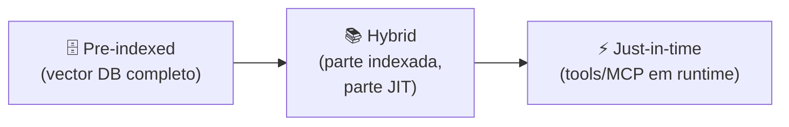

# Dynamic retrieval beyond RAG

> [!abstract] TL;DR
> RAG clássico (recuperar top-k docs antes do prompt) virou o **andar térreo** do retrieval moderno. Em 2026, agentes operam num espectro: de pre-indexed (vector DB pronto) até just-in-time (chamar API/tool durante a tarefa). O diferencial decisivo: em vez de carregar "o que talvez seja relevante", o agente carrega **identifiers leves** (paths, queries, links) e decide em runtime o que buscar. Resultado: contexto mais limpo, sem stale data, sem overhead de indexação. Claude Code é o exemplo canônico — `glob`/`grep`/`read_file` substituem indexar o código inteiro.

---

## Por que RAG puro não é suficiente

RAG clássico resolve um problema real: como dar ao modelo acesso a conhecimento que não está no training data. Mas tem três limitações fundamentais que ficam evidentes em sistemas de agentes complexos:

**Stale indexing.** O índice é uma fotografia do passado. Se a documentação foi atualizada ontem e o índice foi construído há uma semana, o modelo recebe informação desatualizada com plena confiança. Em bases de código e dados ao vivo, isso é inaceitável.

**Top-k cego.** Recuperar os "5 documentos mais similares" semanticamente não é o mesmo que recuperar os "5 documentos mais úteis para responder esta query específica". Similaridade semântica ≠ utilidade para a tarefa. Um agente que entende a tarefa pode fazer perguntas mais cirúrgicas.

**Contexto pré-carregado vs. necessidade real.** RAG injeta o contexto *antes* do modelo processar a query. O modelo não tem chance de dizer "me dê X, não Y" — recebe o que o retriever decidiu que era relevante, na melhor estimativa pré-query. Em tarefas de múltiplos passos, essa estimativa costuma ser incorreta para os passos posteriores.

---

## O espectro de retrieval



| Modo | Latência | Frescor | Custo de manutenção | Melhor para |
|---|---|---|---|---|
| Pre-indexed | <100ms | Stale (depende de sync) | Alto (pipeline + recompute) | Docs estáveis, latência crítica |
| Hybrid | 100-500ms | Misto | Médio | Maioria dos sistemas de produção |
| Just-in-time | 500ms-3s | Sempre fresco | Baixo | Código, dados ao vivo, multi-step |

A decisão não é binária — é onde na escala faz sentido para cada **tipo de dado** no seu sistema. Um único agente pode usar pre-indexed para documentação estável e JIT para código e dados transacionais.

---

## Pre-indexed RAG — quando ainda faz sentido

Continua sendo a escolha certa para:

- Knowledge bases **estáveis** — documentação do produto, FAQs, manuais técnicos que mudam mensalmente, não diariamente
- Volume alto de queries similares — com semantic caching, o custo por query cai drasticamente
- Latência <200ms como requisito hard — JIT adiciona round-trips de tool call
- Conteúdo que não tem API — PDFs históricos, sistemas legados, conteúdo não-estruturado

A limitação fundamental permanece: **stale data**. Se o índice é re-construído a cada hora, os deltas dessa hora são invisíveis ao modelo. Para bases de código em desenvolvimento ativo, isso é inaceitável — commits a cada 15 minutos tornam qualquer índice obsoleto antes de ser usado.

---

## Just-in-time retrieval — o padrão emergente

> [!quote] Anthropic — Effective Context Engineering (2025)
> *"Agents built with the 'just in time' approach maintain lightweight identifiers (file paths, stored queries, web links) and use these references to dynamically load data into context at runtime using tools."*

Em vez de carregar 50 documentos "que talvez sejam relevantes" antes da query, o agente opera em 5 passos:

1. Recebe a query do usuário
2. **Decide** qual ferramenta chamar (não é o retriever que decide — é o modelo)
3. Chama a ferramenta em runtime (`grep`, API call, MCP tool)
4. Recebe a resposta sempre atualizada
5. Compõe a resposta com **só o que foi efetivamente necessário**

**Vantagens mensuráveis:**
- Zero stale data — lê diretamente do source
- Contexto enxuto — não há ruído de "documentos que talvez fossem úteis"
- Sem pipeline de indexação a manter
- O modelo pode fazer follow-up queries conforme entende melhor o problema

**Trade-offs reais:**
- Latência por tool call (round-trip de 200ms-2s por chamada)
- Tokens de tool use aparecem no contexto da conversa
- Qualidade depende do design das ferramentas disponíveis

---

## O caso Claude Code (referência de arquitetura)

Claude Code é o exemplo mais estudado de JIT em produção. A arquitetura:

```
Estático (carregado na sessão uma vez):
└── CLAUDE.md / AGENTS.md     ← regras estáveis → pre-indexed via prompt

Dinâmico (sob demanda, em runtime):
├── glob "**/*.py"            ← descobrir estrutura de arquivos
├── grep "fetchUser"          ← achar referências no código
├── read_file "src/api.py"    ← ler conteúdo de arquivo específico
├── bash "git log --oneline"  ← consultar histórico de commits
└── bash "pytest test_api.py" ← executar testes e ver resultado
```

Sem vector DB. Sem AST pré-computada. Sem indexação. O modelo navega o ambiente como um engenheiro sênior navegaria — usando as ferramentas disponíveis, perguntando o que precisa saber, lendo só o que é necessário para a decisão atual.

Por que isso funciona melhor do que indexar o repositório? Porque o agente pode adaptar o retrieval à tarefa: para um bug de autenticação, vai `grep` por `auth`, `token`, `session`. Para refatoração de módulo, vai `read_file` do módulo inteiro. O retrieval adapta-se à intenção, não ao embedding genérico da query.

---

## MCP como camada universal de JIT

O Model Context Protocol (Anthropic, 2024) tornou-se o padrão de facto para integração de fontes JIT. Cada MCP server expõe ferramentas que o agente pode chamar em runtime:

| MCP Server | Fonte de dados | Caso de uso |
|---|---|---|
| `mcp-server-filesystem` | Sistema de arquivos local | Código, documentos, configs |
| `mcp-server-git` | Repositórios Git | Histórico, diffs, branches |
| `mcp-server-postgres` | Banco de dados PostgreSQL | Queries SQL, schema, dados |
| `mcp-server-sentry` | Logs e erros de produção | Debugging, análise de incidentes |
| `mcp-server-github` | GitHub API | PRs, issues, código no GitHub |
| `mcp-server-slack` | Conversas do Slack | Contexto de equipe, decisões |

O agente recebe *tool descriptions* de cada server e decide em runtime qual chamar — baseado na query e no contexto da tarefa. Não é "RAG configurado pelo dev" — é **arquitetura de ferramentas** consultáveis onde o modelo escolhe o retrieval strategy.

Em junho de 2026, há centenas de MCP servers disponíveis em repositórios como `awesome-mcp-servers`. A tendência é cada serviço enterprise oferecer seu próprio MCP server como interface padrão para agentes — assim como APIs REST se tornaram o padrão de integração para humanos, MCP está se tornando o padrão de integração para agentes.

O MCP também resolve um problema de segurança: em vez de dar ao agente acesso direto ao banco de dados ou ao filesystem, você expõe um MCP server com permissões granulares — o agente pode "ler arquivos em /src" mas não "apagar arquivos". Menos privilégio por default.

---

## Melhorando o pre-indexed: reranking e filtros

Antes de descartar o RAG clássico, vale explorar técnicas que elevam sua qualidade sem migrar para JIT:

**Reranking com cross-encoder.** A busca vetorial ranqueia por similaridade de embedding — uma aproximação. Um cross-encoder (modelo que lê a query + o documento juntos) re-ordena os top-20 candidatos com muito mais precisão, mas com latência adicional. Resultado típico: precisão sobe 15-25% com latência adicional de 100-300ms. Ferramentas: Cohere Rerank, BGE Reranker, Jina Reranker.

**Filtros por metadados.** Antes da busca semântica, filtrar por metadados (data, categoria, autor, tenant ID) reduz o espaço de busca e elimina distractors. Uma query de suporte de cliente A nunca deve recuperar documentos de cliente B — filtro por tenant_id antes do vector search. Isso resolve um problema de segurança *e* melhora a qualidade.

**Query expansion.** Em vez de buscar com a query literal do usuário, gerar variações da query (sinônimos, formulações alternativas, contexto adicional) e fazer múltiplas buscas em paralelo. Combinar os resultados por union ou interseção. Melhora recall em 20-40% para queries ambíguas ou técnicas.

Essas técnicas elevam o teto do RAG clássico. Para muitos casos de uso, um RAG bem ajustado com reranking e filtros supera um JIT mal implementado.

---

## Quatro padrões de design para JIT

### 1. Identifier-first (memorize referências, não conteúdo)

A mudança de mentalidade mais importante: memorize **onde está** a informação, não **o que é** a informação.

```python
# Padrão ingênuo: pré-carregar 200 documentos
context = load_all_docs()  # 500K tokens, stale, rot garantido

# Padrão JIT: memorize 200 paths, leia 3 quando precisar
doc_index = load_doc_index()  # só nomes e metadados — 2K tokens
relevant_docs = [read_file(p) for p in retrieve_paths(query, doc_index)]
```

O índice de paths é leve, sempre fresco, e cabe na camada imutável/persistente. O conteúdo é lido apenas quando necessário.

### 2. Two-stage retrieval (busca estrutural → busca de conteúdo)

Estágio 1: busca **estrutural** — quais paths/IDs/metadados são candidatos?
Estágio 2: carrega **conteúdo** apenas dos top-N candidatos.

Isso reduz o volume de tokens lido em ~10x em relação a carregar todos os candidatos diretamente. A busca estrutural é barata (metadados, embeddings leves); a leitura de conteúdo é cara (tokens completos) — use-a seletivamente.

### 3. Lazy expansion (comece mínimo, expanda por demanda)

```
Turno 1: agente recebe lista de filenames apenas
Turno 2: agente pede "quero ver src/api.py" → read_file completo
Turno 3: agente pede "e as dependências?" → read_file das imports
```

O contexto cresce conforme o entendimento do agente cresce — não de uma vez no início. Isso alinha o custo de retrieval com a necessidade real, não com a estimativa pré-query.

### 4. Hybrid index + tool (estável indexado, dinâmico JIT)

A maioria dos sistemas de produção usa os dois modos:

| Tipo de dado | Estratégia | Razão |
|---|---|---|
| Documentação do produto | Pre-indexed | Estável, latência importa |
| Base de código | JIT | Muda frequentemente, stale inaceitável |
| FAQs | Pre-indexed | Consulta por similaridade semântica |
| Dados de produção | JIT | Sempre deve ser fresco |
| Histórico de decisões | Híbrido | Index + TTL |

---

## Quando NÃO usar JIT

JIT não é a resposta para tudo. Três situações onde pre-indexed ainda vence:

**Latência crítica (<200ms hard requirement).** JIT adiciona ao menos um round-trip de tool call. Para um chatbot onde qualidade de resposta em <200ms é requisito contratual, pre-indexed com cache semântico é a única opção.

**Fonte sem interface programática.** PDFs históricos sem OCR, sistemas legados sem API, bases de dados proprietárias sem MCP server. Se não há ferramenta para fazer JIT, pre-indexed é o único caminho. A saída a longo prazo é criar o MCP server; a saída de curto prazo é indexar.

**Volume muito alto com queries previsíveis.** 100.000 queries/dia sobre uma base de 10.000 artigos de suporte, onde 80% das queries variam de apenas 20 padrões diferentes. Aqui, semantic cache + pre-indexed RAG custa R$0.001/query; JIT custaria R$0.05/query pelos tool calls adicionais. A previsibilidade justifica o custo de manter o índice.

A regra prática: use JIT quando a informação **muda mais rápido do que você consegue manter o índice atualizado e preciso**. Use pre-indexed quando a informação é **estável** e **o custo de manter o índice fresco é menor do que o custo de latência do JIT**.

Uma forma de pensar nisso: quanto custaria um erro causado por stale data vs. quanto custa a latência adicional do JIT? Para decisões de negócio críticas (diagnóstico médico, trading, suporte a incidentes), o custo de stale data supera qualquer custo de latência. Para perguntas de FAQ sobre um produto que muda semestralmente, a equação inverte.

---

## Estado da arte — junho de 2026

**Retrieval agentico como padrão**
Em 2026, a fronteira não é mais "RAG vs. sem RAG" — é "qual o nível de agência no retrieval?". Sistemas maduros permitem que o modelo decida não só *o que* recuperar, mas *quando*, *quantas vezes*, e *de quais fontes combinadas*. O modelo faz seu próprio loop de retrieval até ter informação suficiente para responder.

**Agentic RAG — o loop de retrieval autônomo**
Uma arquitetura emergente: o modelo executa múltiplas rodadas de retrieval, onde cada rodada informa a próxima. "Não encontrei o que precisava, vou refinar a query" — um comportamento que RAG clássico não suporta. LangGraph e CrewAI implementam esse pattern como um grafo de nós de retrieval.

**Multi-modal JIT**
MCP servers agora expõem não só texto mas imagens, PDFs, vídeos (via transcrição), e dados estruturados. Um agente de análise de design pode fazer JIT de wireframes; um agente de suporte pode ler screenshots de erros. O "retrieval" se expande para dados multimodais.

**Graph RAG — recuperação sobre grafos de conhecimento**
Microsoft Research lançou Graph RAG em 2024, adotado amplamente em 2025-2026: em vez de buscar por similaridade semântica, o retrieval navega um grafo de entidades e relações. Para domínios com estrutura relacional rica (médico, legal, corporativo), Graph RAG produz respostas mais coerentes do que RAG vetorial puro. Neo4j e LlamaIndex oferecem implementações production-ready.

**Semantic caching como padrão de produção**
Para sistemas com alto volume de queries similares, semantic cache (GPTCache, Redis + embeddings) retorna respostas de queries semanticamente próximas sem chamar o modelo ou fazer retrieval. Em 2026, essa é uma camada padrão antes do RAG em sistemas de alto tráfego — reduz custo em 60-80% para padrões de query repetitivos.

**Self-querying RAG**
Uma evolução: o modelo gera a query de retrieval em vez de usar a query do usuário literalmente. "Qual a última versão do produto?" → o modelo gera `{filter: {date: {$gte: "2026-01-01"}}, query: "product version release"}`. Ferramentas como LangChain SelfQueryRetriever implementam isso com metadados estruturados nos documentos.

---

## Métricas para acompanhar

Uma pipeline de retrieval sem métricas é uma caixa-preta. Quatro métricas que separam sistemas gerenciados de sistemas operados "na fé":

| Métrica | Fórmula / Como medir | Alvo | Sinal de alerta |
|---|---|---|---|
| **Tool calls por turno** | Count de tool invocations / turno | 1-3 | >5: granularidade excessiva |
| **Utilização do retrieval** | Tokens recuperados que influenciaram resposta / tokens recuperados totais | >60% | <40%: muito ruído no retrieval |
| **Cache hit rate** | Re-leituras servidas do cache / total de re-leituras | >80% | <50%: cache não implementado |
| **Latência de retrieval** | P95 do tempo por tool call | <1s | >3s: revisar timeout e fallback |

A métrica mais difícil de medir mas mais valiosa é a "utilização do retrieval" — que fração do que foi recuperado realmente influenciou a resposta? Ferramentas como LangSmith oferecem attribution tracking (qual parte do contexto afetou os tokens de output). Sem isso, você está voando cego.

**Lendo as métricas em conjunto, não isoladas.** As quatro métricas raramente se movem de forma independente — melhorar uma costuma empurrar outra na direção errada, e é justamente essa troca que separa quem só monitora de quem age sobre o monitoramento. A pergunta certa nunca é "qual métrica está ruim?" isolada; é "qual trade-off essa tarefa específica tolera?".

Um exemplo direto: reduzir "tool calls por turno" geralmente significa consolidar chamadas — tools mais grossas, que devolvem mais informação de uma vez (a mesma ideia da armadilha "tools muito granulares" descrita acima, só que vista pelo lado da métrica). Isso melhora a contagem de chamadas por turno, mas pressiona a "latência de retrieval" para cima — payloads maiores levam mais tempo para trafegar e ser processados — e pode derrubar a "utilização do retrieval", porque mais conteúdo chega junto, mas nem tudo é relevante à resposta final. Um agente de suporte com exigência dura de latência tolera menos consolidação; um agente de análise profunda tolera mais latência em troca de contexto mais completo.

O mesmo vale para "cache hit rate". Um número alto parece bom à primeira vista, mas esconde um risco: um cache que nunca invalida entrega dados desatualizados com a mesma confiança de um cache saudável — a métrica, sozinha, não distingue "cache eficiente" de "cache que ninguém lembrou de invalidar". Por isso vale cruzá-la com uma pergunta qualitativa: quando foi a última vez que este cache foi invalidado, e por qual evento?

Na prática, o hábito saudável é revisar as quatro métricas juntas a cada mudança de arquitetura de retrieval — trocar pre-indexed por JIT, redesenhar uma tool, introduzir uma camada de cache — nunca em isolamento. Uma melhora isolada numa métrica que piora as outras três costuma ser sinal de que o ajuste resolveu o sintoma errado, não a causa.

Quando as quatro apontam em direções conflitantes, a ordem de prioridade prática costuma ser: primeiro proteger a utilização do retrieval (contexto sujo derruba a qualidade da resposta, o problema mais caro de todos); depois a latência (o que o usuário sente); só então a contagem de tool calls e o cache hit rate, que são proxies operacionais — úteis para diagnosticar *onde* está o problema, mas não são o problema em si. Tratar o proxy como se fosse o alvo final é o erro mais comum de quem começa a instrumentar retrieval agora.

Antes de perseguir qualquer alvo da tabela acima, vale medir a linha de base do sistema como ele está hoje — sem cache, sem consolidar tools, sem trocar arquitetura. Otimizar uma métrica que nunca foi medida no estado atual é comparar contra uma expectativa, não contra um número real; a pergunta "melhorou quanto?" só faz sentido depois que existe um "quanto era antes" registrado.

Vale notar que os alvos da tabela ("1-3" tool calls, ">60%" de utilização) são pontos de partida razoáveis, não leis universais — um agente que faz multi-hop retrieval legítimo (como no Caso 4 acima) pode passar de 3 tool calls por turno com boa razão, desde que cada chamada seja informada pela anterior. O sinal de alerta não é o número absoluto; é o número sem uma explicação de por que aquele é o custo certo para aquela tarefa.

No fim, medir retrieval é medir uma decisão que o próprio modelo está tomando em runtime — as quatro métricas são a forma de auditar essa decisão sem precisar confiar cegamente nela.

> [!tip] Assista: RAG Is More Than Vector Search — Agentic Retrieval Explained
> **Canal:** Weaviate | **Duração:** ~28min | **Idioma:** EN
>
> Webinar técnico que cobre o espectro completo: de RAG naïve (top-k antes do prompt) até retrieval agêntico (o modelo conduz múltiplas rodadas de busca). O trecho [15:30] é o ponto de inflexão: demonstra ao vivo um agente fazendo multi-hop retrieval — onde cada resultado de busca informa a próxima query, chegando a uma resposta que RAG clássico nunca alcançaria.
>
> 🎬 https://www.youtube.com/watch?v=T-D1OfcDW1M

---

## Casos práticos

### Caso 1 — Migração de RAG estático para JIT em base de código

Um time de 20 devs tinha um assistente de código que usava RAG clássico sobre um repositório indexado. Problema: após 3 semanas, a taxa de respostas corretas caiu de 78% para 61% — o índice estava desatualizado mas o assistente respondia com confiança.

Migração para JIT: o assistente passou a usar `search_codebase(query)` que executa grep em tempo real, e `read_file(path)` para ler arquivos específicos. Custo: latência subiu de 200ms para 800ms por query. Benefício: acurácia subiu para 89% — o stale data era a causa dos 17% de erro. O trade-off (latência vs. acurácia) foi imediato e óbvio.

### Caso 2 — Agente de suporte com fontes múltiplas

Um agente de suporte técnico precisava de: documentação do produto (estável), status do sistema em tempo real (sempre muda), e tickets similares recentes (semi-estável). Estratégia híbrida:

- Documentação → pre-indexed com vector search
- Status do sistema → JIT via API call a cada turno
- Tickets similares → pre-indexed com TTL de 24 horas (reindexado diariamente)

Resultado: o agente sempre tem documentação precisa, nunca responde "o sistema está funcionando" quando está fora do ar, e usa tickets de ontem mas não de 3 meses atrás. Cada tipo de dado com a estratégia certa.

### Caso 3 — Graph RAG para base de conhecimento médico

Um sistema de apoio a decisões clínicas usava RAG vetorial sobre literatura médica. Limitação: uma query sobre "interação medicamentosa entre warfarina e AAS" precisava conectar três artigos diferentes — sobre warfarina, sobre AAS, e sobre mecanismos de coagulação. RAG vetorial recuperava os três separadamente, mas o modelo não sabia que eles se conectavam.

Com Graph RAG: entidades (medicamentos, mecanismos, condições) e relações (inibe, potencializa, contraindica) foram modeladas em grafo. O retrieval navega o grafo de warfarina → mecanismo → AAS → interação, trazendo o contexto integrado. Precisão das recomendações subiu 34% em avaliação cega.

### Caso 4 — Multi-hop retrieval para análise de incidente

Um agente de on-call precisava diagnosticar um incidente de produção. A query: "por que o serviço X está retornando 500 às 14:23?". O agente executou:

1. JIT: busca logs do serviço X no Sentry em torno de 14:23
2. JIT: lê o código do handler que estava falhando (identificado nos logs)
3. JIT: busca mudanças recentes no código (git log do arquivo)
4. JIT: verifica dependências afetadas (busca imports no código)

Cada recuperação dependia do resultado da anterior — impossível de pre-indexar. O incidente foi diagnosticado em 4 minutos pelo agente vs. 35 minutos pela média manual. O multi-hop JIT foi o que permitiu essa cadeia causal.

---

## Armadilhas comuns

> [!warning] JIT sem cache em sessão — relendo o mesmo arquivo 10 vezes
> Sem cache em sessão, cada vez que o agente "quer ver" um arquivo ele o lê novamente via tool. Em uma sessão de refatoração, o mesmo arquivo pode ser lido 15 vezes — cada vez custando tokens de tool call e de conteúdo. Implemente um cache de sessão (hash do path → conteúdo) que invalida apenas quando o arquivo é editado.

> [!warning] Tools muito granulares — 20 tool calls por turno
> Se cada tool call retorna um fragmento pequeno de informação, o agente precisa de muitas chamadas para construir o contexto necessário — e cada chamada aparece no histórico, aumentando o contexto. Design de tools que retornam unidades coesas de informação (um arquivo completo, um bloco de resultados de busca, um conjunto de logs) é mais eficiente do que tools atômicas demais.

> [!warning] Tools muito grossas — read_file retorna 50K tokens
> O oposto: uma tool que retorna um arquivo enorme (um monolito de 5.000 linhas) anula qualquer ganho do JIT. O contexto explode, o rot instala, e você está em situação pior do que com RAG pré-filtrado. Implemente chunking inteligente: `read_file(path, lines=1-100)` para leituras iniciais, com a opção de expandir.

> [!warning] Sem fallback quando a tool falha
> Em produção, tools falham: API fica indisponível, arquivo não existe mais, DB timeout. Se o agente depende de um tool call e ele falha, o comportamento padrão costuma ser catastrófico — o agente para, fica em loop, ou alucina a resposta. Toda tool deve ter: tratamento de erro explícito, fallback para fonte alternativa, e um caminho de "não consigo recuperar X, preciso de ajuda".

> [!warning] Misturar stale index com JIT sem gestão de conflito
> Em arquiteturas híbridas, o agente pode receber informação conflitante: o índice diz que a função `X` está em `api.py`, mas o JIT (read do arquivo) mostra que ela foi movida para `services.py`. Sem política explícita de "JIT sempre vence índice quando conflitam", o agente pode agir baseado na informação errada com alta confiança.

---

## Como explicar em inglês

**Descrevendo o conceito:**
- "We've moved beyond static RAG — the agent now retrieves on-demand at runtime using tools, rather than loading everything upfront"
- "It's the difference between pre-loading 50 books on a topic vs. going to the library and asking exactly what you need, when you need it"
- "JIT retrieval keeps the context clean — only what was actually necessary for this step ends up in the window"

**Em conversas técnicas:**
- "Our indexing pipeline is showing stale data issues — we should move the frequently-changing parts to JIT tool calls"
- "The agent is making 15 tool calls per turn — we need to redesign the tools to return coarser-grained results"
- "Graph RAG would help here — the entities are highly relational and semantic similarity isn't capturing the connections"

### Tabela PT ↔ EN

| Português | Inglês |
|---|---|
| Retrieval sob demanda | Just-in-time retrieval |
| RAG clássico | Classic/naive RAG |
| Retrieval pré-indexado | Pre-indexed retrieval |
| Dados desatualizados | Stale data |
| Chamada de ferramenta | Tool call |
| Expansão preguiçosa | Lazy expansion |
| Busca em dois estágios | Two-stage retrieval |
| Grafo de conhecimento | Knowledge graph |
| RAG sobre grafos | Graph RAG |
| Retrieval agêntico | Agentic retrieval |
| Retrieval multi-hop | Multi-hop retrieval |
| Cache de sessão | Session cache |
| Fonte de dados | Data source |
| Servidor MCP | MCP server |

---

## O que vem a seguir

Retrieval resolve o problema de *trazer* informação para o contexto. As notas seguintes tratam de *gerenciar* o que está lá:

- **[[07 - Compressão e pruning de informação]]** — o que fazer quando o que foi recuperado é grande demais para caber inteiro
- **[[08 - Memória agentica — self-editing memory]]** — como agentes decidem o que persistir da informação recuperada em sessões anteriores
- **[[13 - Entropia e qualidade de contexto]]** — como medir se o retrieval está trazendo informação de qualidade, não ruído

O retrieval é o ponto de entrada do context engineering. Tudo o que vai para a janela passa por ele — seja via index, seja via tool. Dominar o espectro de retrieval é dominar a curadoria do que o modelo "vê".

A evolução do retrieval segue a mesma trajetória de outras abstrações em software: de estático para dinâmico, de centralizado para distribuído, de determinístico para agêntico. Em 2026, a fronteira está no retrieval que o próprio modelo dirige — não o que o desenvolvedor configurou antecipadamente. Entender essa trajetória é entender para onde as ferramentas estão indo.

---

## Veja também

- [[04 - Context pipelines — montagem dinâmica]] — como o retrieval encaixa na pipeline
- [[05 - Camadas de contexto — persistente, temporal, transiente]] — de onde o retrieval puxa cada camada
- [[RAG e Vector Databases]] — fundamentos de RAG clássico

---

## Referências

- **Anthropic** — *Effective context engineering for AI agents* (2025). A citação original sobre identifier-first e JIT retrieval como padrão recomendado.
- **Airbyte** — *What Is Dynamic Context Retrieval?* (2026). Overview do espectro de retrieval e casos de uso por estratégia.
- **Microsoft Research** — *From Local to Global: A Graph RAG Approach to Query-Focused Summarization* (2024). Paper original do Graph RAG — https://arxiv.org/abs/2404.16130
- **Zylos Research** — *Dynamic Context Assembly and Projection Patterns for LLM Agent Runtimes* (mar 2026). Padrões emergentes de retrieval em sistemas de agentes de produção.
- **LangChain** — *Agentic RAG: Turn RAG into an agent with tool calling* (2025). Implementação de retrieval agêntico com múltiplas rodadas de busca.
- **Anthropic** — *Model Context Protocol Specification* (2024). Especificação do protocolo padrão para fontes JIT — https://spec.modelcontextprotocol.io
- **MachineLearningMastery** — *Effective Context Engineering for AI Agents: A Developer's Guide* (2026). Guia prático com exemplos de implementação dos quatro padrões.
- **Cohere** — *Rerank: Improving RAG Accuracy with Cross-Encoders* (2025). Benchmark comparando vector search + reranker vs. vector search puro — dados de ganho de precisão por domínio.
- **Gao, Y. et al.** — *Retrieval-Augmented Generation for Large Language Models: A Survey* (2024). Survey abrangente que categoriza os tipos de RAG (naïve, advanced, modular) e técnicas de melhoria — https://arxiv.org/abs/2312.10997
- **Shi, W. et al.** — *REPLUG: Retrieval-Augmented Language Model Pre-Training* (2023). Trabalho seminal sobre como integrar retrieval no loop de geração, não só no pré-processamento — fundamento teórico do retrieval agêntico.
