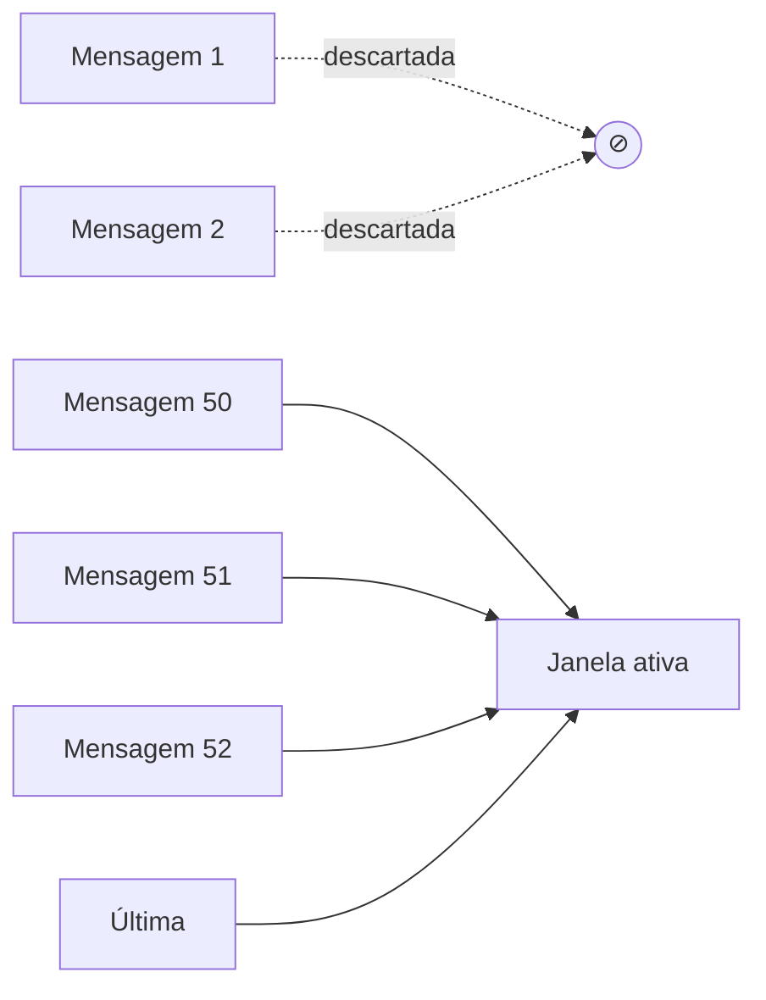

# Compressão e pruning de informação

> [!abstract] TL;DR
> Em sessões longas, a janela de contexto satura — não pelo limite hard, mas pela atenção diluída (→ [[03 - Context rot e atenção diluída]]). As duas técnicas centrais: **compressão** (resumir o que ainda é relevante, em forma menor) e **pruning** (remover ativamente o que não importa mais). Anthropic implementou compaction nativa no Claude Code — preserva decisões arquiteturais e bugs em aberto, descarta tool outputs redundantes. Para agentes de longa duração que cruzam várias janelas, compaction sozinha não basta: é preciso um estado durável **fora** do contexto — arquivos de progresso, checklists em JSON, git como undo durável. Bônus: as técnicas são as mesmas que reduzem custo. Qualidade *e* dinheiro juntos.

---

## O problema que compressão resolve

Imagine uma sessão de agente autônomo de 3 horas refatorando um módulo crítico. Na hora 1, o agente decidiu "não alterar a interface pública". Na hora 3, com 90K tokens de histórico na janela, essa decisão está enterrada no meio — zona de baixa atenção, invisible para efeitos práticos. O agente começa a sugerir mudanças de interface.

Não é bug do modelo. É context rot: a janela ficou grande demais, a atenção se diluiu, e a informação crítica foi "esquecida" mesmo estando presente. A solução não é uma janela maior — é compactar o histórico de forma que o que importa sempre esteja acessível com alta atenção.

Compressão e pruning são as duas ferramentas complementares para isso. Compressão reduz o tamanho preservando a semântica; pruning remove o que não tem mais relevância. Em conjunto, mantêm o contexto denso e acessível — não gigante e diluído. O custo de não usar nenhuma das duas não é apenas qualidade degradada: é literalmente pagar 10-50x mais em tokens por sessão do que o necessário.

---

## Compressão vs pruning vs eviction

Três técnicas complementares, frequentemente confundidas:

| Técnica | O que faz | Quando ativar |
|---|---|---|
| **Compressão** | Mantém a informação, em forma reduzida (resumo) | Threshold de tokens ou de turnos |
| **Pruning** | Remove informação considerada irrelevante | Filtro contínuo ou pré-LLM |
| **Eviction** | Remove a informação mais antiga (FIFO ou LRU) | Limite hard da janela |

A maioria dos sistemas robustos combina os três: comprime o histórico médio, poda tool outputs redundantes, e evicta em último caso quando a janela ameaça estourar.

A distinção mais importante: compressão **preserva semântica** (você ainda pode reconstruir as decisões originais a partir do resumo), enquanto pruning e eviction **descartam** (o que foi removido está perdido). Use pruning e eviction para o que você tem certeza que não vai mais precisar; compressão para o que pode ser necessário mas em forma compacta. Em caso de dúvida, comprima — o custo de uma compressão desnecessária é baixo; o custo de uma evicção indevida é irreversível.

---

## Compressão (compaction) — como funciona

> [!quote] Anthropic — Effective Context Engineering (2025)
> *"Compaction is the practice of taking a conversation nearing the context window limit, summarizing its contents, and reinitiating a new context window with the summary."*

### Como Claude Code implementa

1. Quando a janela aproxima do limite (~80%), dispara compactação automática
2. Envia o histórico para o próprio modelo com prompt de sumarização específico
3. Modelo gera resumo preservando:
   - Decisões arquiteturais tomadas
   - Bugs em aberto identificados
   - Detalhes de implementação importantes para continuar
   - Estado atual da tarefa
4. Modelo descarta:
   - Tool outputs que já foram processados e integrados
   - Mensagens já resolvidas e sem relevância futura
   - Reasoning intermediário não conclusivo
5. Continua a sessão com **resumo + últimas mensagens + arquivos mais recentemente acessados**

### Tipos de compressão

| Tipo | Como funciona | Melhor para |
|---|---|---|
| **Sumarização LLM** | Modelo resume o próprio histórico | Sessões conversacionais; preserva nuance |
| **Sumarização extractiva** | Seleciona spans importantes literalmente | Quando fidelidade exata importa |
| **Compactação estrutural** | Converte para formato denso (tabela, JSON) | Dados estruturados, checklists, decisões |
| **Hierárquica** | Resumo de resumos em múltiplas camadas | Sessões muito longas (dias) |

Uma distinção importante sobre compressão hierárquica: à medida que resumos são re-sumarizados em sessões de múltiplos dias, ocorre perda progressiva de precisão — como copiar fotocópia de fotocópia. Para agentes de longa duração, a compressão hierárquica *dentro* da janela deve ser combinada com artefatos duráveis *fora* da janela (→ seção de harness abaixo), evitando que a N-ésima sumarização se torne inutilizável.

### Quando comprimir

Quatro gatilhos, em ordem de sofisticação:

- **Threshold absoluto** — ao atingir 70-80% da janela (mais simples, reativo)
- **Threshold de turno** — a cada N turnos (ex: a cada 30 turnos, independente do tamanho)
- **Trigger explícito** — usuário ou agente pede `/compact` ao fim de uma fase
- **Mudança de fase** — ao terminar uma sub-tarefa ("analisei o código, agora vou refatorar")

Os dois primeiros gatilhos são **reativos** — disparam quando o problema já existe. Os dois últimos são **proativos** — disparam em momentos naturais da sessão, antes do rot se instalar. Para agentes sérios, a progressão natural é começar com threshold e evoluir para trigger de fase.

A compactação por mudança de fase é a mais poderosa: o natural de uma sessão longa é ter fases com objetivos diferentes. Compactar na transição entre fases garante que o contexto sempre reflete a fase atual, não a acumulação de todas as fases anteriores.

> [!warning] Compactação custa tokens — mas vale
> Compactar 100K tokens tipicamente envia 100K input + recebe 5-10K output. Não é grátis. Mas o custo de *não* compactar é maior: cada turno subsequente paga o custo de 100K tokens em vez de 10K, mais o custo de rot em qualidade. O break-even acontece em 2-3 turnos pós-compactação.

---

## Pruning (poda ativa)

Diferente de compressão (que **mantém** em forma reduzida), pruning **remove** informação julgada irrelevante. É mais agressivo e irreversível — use com clareza sobre o que está descartando.

### Critérios comuns de pruning

- **Idade** — descartar mensagens com mais de N turnos (simples, pode descartar contexto relevante)
- **Relevância semântica** — TF-IDF ou embeddings comparando cada mensagem com a query atual: remove o que não combina
- **Marcação explícita** — agente decide "isso já não importa" e marca para remoção
- **Filtros estáticos** — `.cursorignore`, `.claudeignore`, regex de paths que nunca devem ser incluídos

### Pruning de tool outputs — o caso mais valioso

Tool outputs são o maior contribuinte de bloat em contextos de agentes. O padrão:

```
Turno 1: read_file("src/api.py")  → 12K tokens de output
Turno 2: read_file("src/db.py")   → 8K tokens de output
Turno 3: read_file("src/api.py")  → MESMO conteúdo — 12K tokens redundantes

Sem pruning: histórico contém 32K tokens de file contents
Com pruning: substitui leituras antigas por referência ("já lido no turno 1, conteúdo não mudou")
```

Para agentes que fazem muitas tool calls, implementar deduplicação de tool outputs pode reduzir o tamanho do histórico em 40-60%.

### Pruning de imagens e outputs grandes

Imagens consomem 1-2K tokens cada. Após o agente descrever ou usar uma imagem, **substitua a imagem pela descrição** no histórico. Mesmo padrão para PDFs, planilhas grandes, screenshots, respostas JSON extensas que já foram processadas. O conteúdo semântico permanece (a descrição); o custo de tokens cai.

---

## Sliding window — o caso especial



Mantém os **últimos N turnos** + system prompt + memória persistente. Simples e eficiente, mas perde contexto antigo **sem sumarização** — decisões da primeira hora simplesmente desaparecem. Bom para chats casuais e assistentes de sessão curta; **insuficiente** para agentes que precisam recordar decisões tomadas no início da tarefa.

---

## Padrão híbrido recomendado

A maioria dos sistemas de agentes maduros usa uma combinação:

```python
def compact_history(history, budget=50_000):
    # Âncoras — nunca compactadas
    static = history[:2]              # primeiros 2 turnos = "setup" e objetivos
    recent = history[-10:]            # últimos 10 turnos = "memória curta"
    middle = history[2:-10]           # tudo entre = candidato à compactação

    # Se mesmo com compactação do meio ainda estoura, comprima o recente também
    if total_tokens(static + recent) > budget:
        recent = sliding_window(recent, max_tokens=budget * 0.6)

    # Compacta o meio com LLM — preserva decisões, descarta ruído
    middle_summary = summarize_with_llm(
        middle,
        target=2_000,
        preserve=["architectural decisions", "open bugs", "implementation details"]
    )

    return static + [middle_summary] + recent
```

Por que preservar os primeiros 2 turnos? Porque eles tipicamente contêm os objetivos e constraints da sessão — o que o agente precisa lembrar durante toda a tarefa. Por que os últimos 10? Para continuidade imediata — o agente precisa de contexto recente para não perder o fio.

O número exato de âncoras (2) e da janela recente (10) deve ser calibrado para cada tipo de sessão. Sessões de análise de dados podem precisar de 5 turnos âncora; chats de suporte podem funcionar com 5 recentes. O que nunca muda é o princípio: sempre há algo que deve ser preservado intacto e algo que é apenas contexto de continuidade imediata.

---

## Onde compaction não basta — agentes de longa duração

Tudo acima resolve uma sessão que satura dentro de uma janela. Mas e um agente que cruza **várias** janelas — um coding agent rodando em loop por horas, ou um agente de análise que trabalha por dias?

A própria Anthropic é direta sobre o limite:

> [!quote] Anthropic — Effective harnesses for long-running agents (nov/2025)
> *"compaction isn't sufficient. Out of the box, even a frontier coding model like Opus 4.5 running on the Claude Agent SDK in a loop across multiple context windows will fall short."*

O problema é de **continuidade entre janelas**, não de tamanho dentro de uma janela. Comprimir converte 100K em 10K, mas o resumo ainda vive *dentro* da conversa — e a cada nova janela, ele é re-resumido, perdendo nuance progressivamente. O que falta é um estado que sobreviva *fora* do contexto, intacto, que a próxima instância possa reler do zero.

A receita prescrita é uma tríade de artefatos **estruturados e duráveis** que fazem a ponte entre janelas:

1. **Lista de features/requisitos em JSON** — o backlog do que precisa existir, como dado estruturado, não como prosa narrativa
2. **Arquivo de progresso** (`claude-progress.txt`) — o "onde eu parei", para reconstruir o estado de trabalho ao iniciar com uma janela fresca
3. **Histórico git** — para rastrear e poder reverter mudanças; o undo durável do agente

Por que JSON em vez de Markdown para os requisitos? Porque o modelo **tem menos probabilidade de modificar o JSON indevidamente** — a rigidez do schema vira uma trava contra a tentação de "melhorar" o checklist no meio do caminho. Markdown convida edição; JSON resiste a ela.

### O que um bom progress file contém

Um `claude-progress.txt` eficaz não é um log — é um briefing para uma instância que nunca viu a sessão anterior. Estrutura mínima:

```
OBJETIVO: refatorar módulo de pagamentos para remover acoplamento com banco legado
STATUS: fase 3/4 completa — análise e testes prontos, refatoração em andamento

DECISÕES IRREVERSÍVEIS:
- Mantemos interface pública PaymentService.process() intacta (compatibilidade com SDK v2)
- Usamos repository pattern; não adaptar com DTO intermediário

PRÓXIMO PASSO: completar PaymentRepository.findByTransactionId() — veja src/payments/repo.py linha 87
OPEN BUGS: PaymentService.refund() retorna 200 mesmo quando banco responde erro 503 (investigar após refatoração principal)
ARQUIVOS MODIFICADOS NESTA SESSÃO: src/payments/service.py, src/payments/repo.py, tests/test_payment.py
```

Esse formato garante que a próxima instância possa passar de "zero" para "completamente contextualizada" lendo 20 linhas — sem depender de sumarização de histórico, sem rot, sem context anxiety.

> [!info] A analogia do turno de plantão
> Pense num hospital trocando de turno. A compaction é o médico que sai resumindo de cabeça o que aconteceu — útil, mas some quando ele vai embora. A tríade durável é o **prontuário**: a lista de problemas (JSON), a evolução do dia (`claude-progress.txt`) e o registro do que foi feito e pode ser desfeito (git). O próximo plantonista não depende da memória de ninguém — ele lê o prontuário. Anthropic observou uma *"context anxiety"* no Sonnet 4.5: o agente, sem âncora durável, gasta atenção se preocupando com o que pode ter esquecido.

Onde compaction acaba — na borda da janela — começa o **harness engineering**: não é mais o que cabe no contexto, é o andaime que persiste *entre* contextos.

---

> [!tip] Assista: Claude's Context Engineering Secrets — Bojie Li
> **Fonte:** análise do comportamento do Claude Code publicada no blog de Bojie Li (dez 2025) | **Idioma:** EN
>
> Bojie Li dissecou como o Claude Code implementa compaction internamente — incluindo o prompt exato de sumarização, as políticas de retenção por tipo de conteúdo (decisões arquiteturais são preservadas literalmente; tool outputs processados são descartados), e o threshold de 80% de janela que dispara compactação automática. É o melhor "under the hood" disponível publicamente sobre compactação em produção.
>
> 📖 [Claude's Context Engineering Secrets — Bojie Li (2025)](https://bojieh.me/)

---

## Estado da arte — junho de 2026

**Compactação como primitiva de produto**
Em 2025-2026, Claude Code, Cursor, Devin e outros coding agents implementaram compactação automática como feature de produto — não como configuração avançada. O usuário não precisa saber quando compactar; o sistema decide. Isso democratizou sessões longas de agentes que antes quebravam silenciosamente por rot.

**Compactação seletiva por tipo de conteúdo**
Sistemas sofisticados em 2026 usam políticas de compactação diferenciadas por tipo de conteúdo: código-fonte é compactado para assinaturas de funções; conversação é sumarizada; decisões arquiteturais são preservadas literalmente. Um único algoritmo de sumarização aplicado uniformemente é inferior a políticas por tipo.

**Compactação com verificação de qualidade**
Sistemas maduros em 2026 verificam a qualidade da compactação antes de continuar: executam um conjunto de perguntas-gold sobre o resumo ("o agente ainda sabe qual era o objetivo principal?", "o agente ainda sabe qual arquivo está editando?") e rejeitam compactações que falham. Isso evita o problema de compactações que parecem pequenas mas perderam informação crítica.

**Modelos auxiliares pequenos para compactação**
Uma tendência emergente: usar um modelo menor e mais barato (Haiku, flash) para fazer a sumarização de compactação, reservando o modelo principal para a tarefa. Reduz o custo de compactação em 80% mantendo qualidade suficiente para a maioria dos casos.

---

## Casos práticos

### Caso 1 — Refatoração de módulo em sessão longa

Um agente de refatoração recebia a tarefa de modernizar um módulo de 2.000 linhas. Sessão esperada: 4 horas. Sem compactação, o agente começava a sugerir mudanças que contradiziam decisões tomadas na primeira hora a partir da marca de 2 horas.

Solução: compactação por fase. Ao final de cada sub-fase ("análise completa", "testes escritos", "refatoração de módulo X"), o agente executava `/compact` explícito, gerando um resumo estruturado das decisões tomadas naquela fase. O resumo era adicionado ao início do contexto da próxima fase. Resultado: sessões de 4 horas sem degradação — o agente chegava ao final com o mesmo nível de consistência da primeira hora.

### Caso 2 — Agente de análise de dados com sessões de múltiplos dias

Um agente de análise financeira trabalhava na mesma análise por 3 dias — sessões de 6 horas por dia. A compactação dentro de cada sessão funcionava; o problema era na retomada do dia seguinte. O agente "esquecia" o que havia descoberto no dia anterior.

Solução com tríade durável:
- `analysis-requirements.json` com a estrutura da análise e o que ainda faltava investigar
- `analysis-progress.md` com "último update: [data] — concluí X, descobri Y, próximo passo Z"
- Git com commits atômicos por descoberta

No início de cada sessão, o agente lia os três artefatos e retomava exatamente de onde parou — sem sumarização, sem rot, sem "context anxiety".

### Caso 3 — Pruning de tool outputs em pipeline de RAG

Um pipeline de RAG fazia 10-15 web searches por sessão. Cada resultado de busca chegava como 3-5K tokens de HTML processado. Após 5 buscas, o contexto estava 50% cheio de resultados de RAG — a maioria já processados e irrelevantes para a query atual.

Implementação de pruning: após cada uso de um resultado de busca, o agente substituía o resultado bruto por um sumário de 1-2 frases ("resultado de busca X: [conclusão extraída]"). Redução de contexto: 70%. A qualidade das respostas não degradou — as conclusões já estavam integradas no raciocínio, e o resultado bruto não adicionava valor ao ser relido.

### Caso 4 — Sliding window para chatbot de suporte

Um chatbot de suporte técnico com sessões de até 30 turnos usava sliding window de 10 turnos. A maioria das queries de suporte era autocontida dentro de 10 turnos. Problema: quando um cliente descrevia um problema complexo nos primeiros turnos e a solução estava no turno 12-15, as mensagens iniciais eram evictadas exatamente quando eram mais necessárias.

Solução: sliding window com âncoras. Os primeiros 3 turnos (descrição do problema) eram sempre preservados, independente do tamanho da janela. Os 10 turnos subsequentes eram a sliding window normal. Custo adicional: ~3K tokens por sessão. Benefício: redução de 23% em escalações para humanos (o agente conseguia lembrar o contexto original do problema).

---

## Armadilhas comuns

> [!warning] Compactar cedo demais — perdendo nuance ainda ativa
> Compactar antes de uma sub-tarefa estar completa pode descartar informação que o agente ainda precisa ativamente. Se o agente está no meio de debugar um erro e a compactação é disparada por threshold de tokens, a stack trace completa pode ser sumarizada para "um erro de null pointer" — perdendo o contexto exato necessário para o próximo passo. A política de "compactar por mudança de fase" é mais segura do que "compactar por threshold absoluto".

> [!warning] Compactar tool outputs ativos
> Tool outputs de leituras que o agente **ainda está usando** não devem ser prunados. Se o agente está no meio de editar `src/api.py` e o conteúdo do arquivo foi prunado do histórico, o agente pode introduzir bugs ao fazer edições parciais sem o contexto completo do arquivo. Implemente marcação de "tool outputs ativos" que ficam protegidos de pruning enquanto o agente os referencia.

> [!warning] Sem teste de qualidade pós-compactação
> Como saber se a compactação preservou o que precisava? Sem um conjunto de perguntas-gold executadas após a compactação, você está voando cego. Um agente pode continuar a sessão convicto que "sabe" as decisões tomadas, mas o resumo pode ter perdido um detalhe crítico. Teste de qualidade mínimo: após compactar, pergunte ao agente "qual é o objetivo principal desta sessão?" e "quais são as decisões que não podem ser revertidas?".

> [!warning] Compactação sem preservação explícita de constraints
> A sumarização LLM é boa em preservar "o que aconteceu" mas ruim em preservar "o que está proibido". "Não altere a interface pública" é um constraint que pode desaparecer numa sumarização focada em progresso. Inclua na instrução de sumarização: "preserve todos os constraints explicitados pelo usuário, mesmo que pareçam não relevantes para o progresso imediato".

> [!warning] Re-sumarizar resumos sem âncora no original
> Em sessões muito longas com múltiplas rodadas de compactação, resumos são resumidos de resumos — perda progressiva de precisão (como copiar fotocópia de fotocópia). A âncora durável fora do contexto (o `progress.txt`, o JSON de requisitos) resolve exatamente isso: a próxima instância pode reler o artefato original, não o N-ésimo resumo de resumo.

---

## Como explicar em inglês

**Descrevendo o conceito:**
- "Context compaction is like summarizing meeting notes before starting a new meeting — you preserve the decisions and open questions, discard the discussion that led there"
- "Pruning removes content we know is no longer needed; compression keeps it but in a smaller form — different tools for different situations"
- "For long-running agents, compaction alone isn't enough — you need durable state outside the context window that the next instance can read fresh"

**Em conversas técnicas:**
- "We're hitting context rot at the 3-hour mark — we need to implement phase-based compaction, not just token-threshold compaction"
- "Tool output pruning is the fastest win here — we're burning 60% of our context budget on processed search results we'll never look at again"
- "The agent needs a progress file that survives context resets — right now it's losing state between windows and backtracking on work already done"

### Tabela PT ↔ EN

| Português | Inglês |
|---|---|
| Compressão de contexto | Context compression |
| Compactação | Compaction |
| Poda de informação | Information pruning |
| Evicção (remoção por limite) | Eviction |
| Janela deslizante | Sliding window |
| Sumarização | Summarization |
| Resumo do histórico | History summary |
| Saída de ferramenta | Tool output |
| Estado durável | Durable state |
| Arquivo de progresso | Progress file |
| Âncora de contexto | Context anchor |
| Limiar de compactação | Compaction threshold |
| Sumarização hierárquica | Hierarchical summarization |
| Ansiedade de contexto | Context anxiety |

---

## Métricas de eficácia

Como saber se a estratégia de compressão está funcionando? Três métricas complementares:

| Métrica | Como medir | Sinal de alerta |
|---|---|---|
| **Context utilization rate** | tokens_no_contexto / limite_da_janela por turno | >70% em sessões rotineiras — comprimir ou podar antes |
| **Compression ratio** | tokens_antes / tokens_após compactação | <3x → a compactação não está reduzindo suficientemente |
| **Semantic preservation score** | questões-gold respondidas corretamente antes e depois | <85% correto → compactação perdeu informação relevante |
| **Cost per session** | custo total em USD por sessão completa | benchmarke para detectar inflação de sessões |

> [!tip] Monitore as métricas juntas
> Context utilization rate alta + compression ratio baixo = você compacta mas o histórico cresce mesmo assim. Possivelmente pruning de tool outputs é o problema real — cada compactação passa a incluir outputs que crescem mais rápido do que o resumo reduz.

A armadilha clássica: medir só tamanho em tokens, sem medir **qualidade semântica** do que restou. Um resumo pode ter 5K tokens em vez de 100K e ainda assim ter perdido a informação crítica. A semantic preservation score fecha esse gap — mas exige questões-gold específicas para cada tipo de sessão.

### Custo comparado — sessão com e sem compactação

Para uma sessão de 50 turnos com 4K tokens médios por turno:

| Configuração | Tokens de input total | Custo estimado (Sonnet 4.6) |
|---|---|---|
| Sem compactação (acumulação linear) | ~5M tokens | ~$15 |
| Com compactação a cada 30 turnos | ~500K tokens | ~$1.50 |
| Com pruning de tool outputs + compactação | ~250K tokens | ~$0.75 |

A redução de custo em 90% com qualidade equivalente é o argumento mais forte para implementar compressão — mais forte do que o argumento de qualidade para a maioria dos stakeholders não-técnicos.

---

## O que vem a seguir

Compressão e pruning tratam do que está *dentro* do contexto. As notas seguintes estendem a discussão para o que vive *fora*:

- **[[08 - Memória agentica — self-editing memory]]** — agentes que gerenciam ativamente o que persistir entre sessões, o que atualizar, e o que esquecer
- **[[10 - Structured state tracking]]** — o padrão de artefatos estruturados (JSON, progress files) que permite continuidade entre janelas sem sumarização
- **[[13 - Entropia e qualidade de contexto]]** — como medir se a compactação está preservando a qualidade semântica necessária

A compactação é a técnica mais tangível de context engineering — seus efeitos em custo e qualidade são imediatos e mensuráveis. Dominar quando e como compactar é o primeiro passo prático para quem quer ir além de "joga tudo no contexto e espera".

Existe uma progressão natural de maturidade aqui. O iniciante usa sliding window porque é simples. O adepto implementa compactação por threshold e pruning de tool outputs. O sênior projeta uma estratégia de compressão integrada à arquitetura de agente — com políticas por tipo de conteúdo, testes de preservação semântica, e artefatos duráveis que sobrevivem à fronteira da janela. Cada nível resolve um problema que o anterior não consegue resolver: janelas que ficam cheias, sessões longas que degradam, e agentes que cruzam múltiplas janelas sem perder continuidade.

---

## Veja também

- [[03 - Context rot e atenção diluída]] — o problema que compressão resolve
- [[04 - Context pipelines — montagem dinâmica]] — o pipeline que chama compact_history()
- [[05 - Camadas de contexto — persistente, temporal, transiente]] — a camada temporal é a que mais precisa de compactação
- [[10 - Structured state tracking]] — como o estado estruturado compensa onde a compactação falha

---

## Referências

- **Anthropic** — *Effective context engineering for AI agents* (2025). Base teórica para compaction como técnica central de CE.
- **Anthropic** — *Effective harnesses for long-running agents* (nov/2025). A citação sobre os limites da compaction em agentes multi-janela e a tríade de artefatos duráveis — https://www.anthropic.com/engineering/effective-harnesses-for-long-running-agents
- **Claude Cookbook** — *Context engineering: memory, compaction, and tool clearing* (2026). Implementação prática das técnicas com exemplos de código.
- **Bojie Li** — *Claude's Context Engineering Secrets* (dez 2025). Análise das políticas de compactação implementadas no Claude Code.
- **Sebastian Raschka** — *Components of A Coding Agent* (2025). Contexto mais amplo de como compressão encaixa na arquitetura de agentes de codificação.
- **GPTCache** — *Semantic caching for LLM applications* (2024). Framework de cache semântico que complementa compressão em sistemas de alto volume.
- **Simon Willison** — *Things we learned about LLMs in 2025* (2025). Inclui análise de compactação automática e seu impacto em sessões longas de coding agents.
- **LangSmith** — *Context tracing and session analytics* (2025). Ferramentas para medir context utilization rate e custo por sessão — base para métricas de eficácia de compressão.
- **Anthropic Claude Code docs** — *Managing long conversations* (2026). Documentação oficial do comportamento de compactação automática no Claude Code, incluindo o threshold de 80% e o comportamento pós-compactação.
