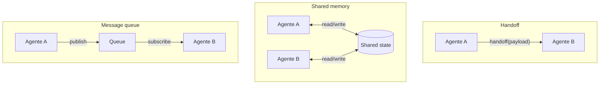

# Shared memory em multi-agent

> [!abstract] TL;DR
> Quando múltiplos agentes colaboram, o estado precisa **viajar** entre eles — sem inflar o contexto de cada um. Três padrões dominam em 2026: **handoff** (passa contexto serializado, modelo OpenAI Swarm), **shared memory** (estrutura mutável compartilhada, modelo LangGraph), e **message queue** (eventos publicados, modelo enterprise). Cada um faz trade-off diferente entre coordenação, latência e fidelidade. A regra que une todos: **resumir** o estado no handoff, não passar histórico bruto. Multi-agent é o passo natural depois de dominar single-agent — mas a maioria dos problemas ainda é resolvível com um único agente bem-prompteado. Antes de orquestrar, questionar se a orquestração vale.

---

## O problema

Single-agent: contexto cresce dentro de uma sessão. Isso é gerenciável com compressão e pruning (→ [[07 - Compressão e pruning de informação]]).

**Multi-agent:** contexto precisa cruzar fronteiras de agentes — cada um com sua janela, suas tools, seus prompts. E cada cruzamento de fronteira é uma oportunidade de perda de informação.

Sem boa engenharia de shared memory:

- **Agente B não sabe o que A já decidiu** → repete trabalho, chega a conclusões diferentes
- **Agente B vê o histórico inteiro de A** → context rot multiplicado — o problema do single-agent mas pior
- **Agente B recebe resumo incompleto** → resultado pior que single-agent

Existe um ponto interessante aqui: multi-agent pode criar um sistema **mais fraco** que single-agent se o estado não for gerenciado adequadamente. Cada agente reinterpreta o contexto recebido — sem o fio condutor de uma única sessão, incoerências acumulam. Por isso a pergunta "vale mesmo orquestrar?" deve sempre preceder a decisão de ir multi-agent.

---

## Os três padrões dominantes



---

### Padrão 1 — Handoff (OpenAI Swarm, Anthropic patterns)

Um agente termina sua parte e **transfere** explicitamente para outro com payload bem definido. O modelo mental é uma corrida de revezamento: o bastão (payload) passa de mão em mão.

```python
# OpenAI Swarm — handoff = tool call que retorna outro agent
def transfer_to_billing():
    return billing_agent  # runner switches active agent

triage_agent = Agent(
    name="Triage",
    instructions="Classifica o problema e transfere para o agente adequado",
    functions=[transfer_to_billing, transfer_to_support]
)
```

**Quando usar:** cadeia linear de especialistas com fases bem definidas. Suporte técnico (triagem → diagnóstico → solução), workflows sequenciais onde agente B só age depois que agente A termina.

**Trade-offs:**

| Vantagem | Limitação |
|---|---|
| Simples mentalmente (linear, fácil de debugar) | Estado não-trivial precisa ser serializado explicitamente |
| Cada agente tem contexto enxuto | Agentes não "conversam" — apenas se sucedem |
| Handoff é um evento discreto (auditável) | Cadeia de N agentes acumula latência sequencial |

---

### Padrão 2 — Shared memory (LangGraph, CrewAI)

Os agentes compartilham uma estrutura mutável — state graph, dict, key-value store. Cada agente lê e escreve partes do estado compartilhado conforme progride.

```python
# LangGraph — state como TypedDict atualizado por cada nó
class AgentState(TypedDict):
    user_query: str
    research_findings: list[str]
    draft: str
    review_notes: str
    approved: bool

graph = StateGraph(AgentState)
graph.add_node("researcher", researcher_fn)   # lê user_query, escreve research_findings
graph.add_node("writer", writer_fn)           # lê findings, escreve draft
graph.add_node("reviewer", reviewer_fn)       # lê draft, escreve review_notes + approved
graph.add_edge("researcher", "writer")
graph.add_conditional_edges(
    "reviewer",
    lambda s: "writer" if not s["approved"] else END  # loop até aprovação
)
```

**Quando usar:** workflows com loops e revisões (o reviewer envia de volta para o writer até aprovação). Sistemas onde todos os agentes precisam de visibilidade do estado global.

**Trade-offs:**

| Vantagem | Limitação |
|---|---|
| Coordenação natural (todos veem o mesmo estado) | Estado pode crescer e virar problema próprio |
| Suporta loops (reviewer → writer → reviewer) | Cada agente potencialmente vê informação demais |
| Fácil snapshot e replay para debugging | Race conditions se agentes escrevem concorrentemente sem locking |

---

### Padrão 3 — Message queue (enterprise, distributed)

Agentes publicam eventos numa fila; outros se inscrevem. Desacoplamento total: o publicador não precisa saber quem vai consumir o evento.

```python
# Pseudocode com pubsub — Kafka, NATS, Redis Streams
agent_a.publish("research.complete", {
    "findings": [...],
    "confidence": 0.87,
    "timestamp": now()
})

# Outros agentes, possivelmente em servidores diferentes:
agent_b.subscribe("research.complete", lambda evt: process(evt))
agent_c.subscribe("research.complete", lambda evt: audit(evt))
```

**Quando usar:** sistemas de múltiplos agentes de larga escala onde cada agente pode ter múltiplas instâncias. Pipelines de dados onde auditabilidade é crítica.

**Trade-offs:**

| Vantagem | Limitação |
|---|---|
| Desacoplamento total (publish sem saber quem consome) | Complexidade operacional alta (Kafka, NATS, RBAC) |
| Escala horizontal — múltiplas instâncias por agente | Latência maior por natureza assíncrona |
| Audit trail natural (eventos persistidos na fila) | Garantias de entrega exigem infra dedicada |

---

## A regra de ouro: handoff com resumo

Independente do padrão, **passar histórico bruto é anti-pattern**. O histórico de uma conversa de 50 turnos é context rot esperando acontecer quando enviado para outro agente — que vai interpretá-lo parcialmente e provavelmente perder o ponto central.

Padrão recomendado para qualquer handoff:

```python
def handoff_to_next_agent(current_state):
    # Anti-padrão: passar todo o histórico
    # next_agent.run(history=current_state.full_history)  # ← não faça isso

    # Padrão correto: resumir + intent + dados estruturados
    return next_agent.run(
        summary=summarize_phase(current_state.full_history),  # 500 tokens no máximo
        intent="Validar compliance da proposta gerada",
        structured_data={
            "decision": current_state.decision,
            "open_questions": current_state.open_questions,
            "constraints": current_state.constraints,
            "outputs": current_state.outputs,
        }
    )
```

O resumo dá contexto narrativo; `structured_data` garante que os dados críticos chegam sem perda de fidelidade — não dependendo da qualidade da sumarização para preservar números, datas, decisões exatas.

A distinção "resumo vs. dados estruturados" no payload é crucial: resumo é para o modelo entender o que aconteceu (linguagem natural, contexto narrativo); dados estruturados são para o modelo usar sem interpretar (números, IDs, listas de itens). Misturar os dois — colocar números críticos no texto do resumo — é um anti-pattern que causa erros de interpretação em modelos que trabalham com floating point ou grandes números.

Vale também definir um contrato de handoff explícito: qual é o schema esperado, quais campos são obrigatórios, quais são opcionais. Isso funciona como interface entre agentes — e permite validação antes de passar o payload, prevenindo que o agente B falhe silenciosamente por um campo ausente.

---

## Comparativo de frameworks (jun/2026)

| Framework | Padrão | Estado | Comunicação | Forte em |
|---|---|---|---|---|
| **OpenAI Swarm** | Handoff | Ephemeral (por sessão) | Tool calls | Rapidez de prototipagem; educacional |
| **LangGraph** | Shared graph | Checkpointed (persistent) | Mutable dict | Workflows complexos com loops |
| **CrewAI** | Role-based | Shared task context | Crew context | Mental model "equipe com papéis" |
| **AutoGen** | Conversational | Persistent | Messages | Conversação multi-agente natural |
| **Strands Agents** | Swarm pattern | Shared context | Multi-mode | AWS-native, enterprise scale |
| **Anthropic Agents SDK** | Flexible | Durable (git+JSON) | Tool results + files | Harness engineering, longa duração |

---

## Quando NÃO usar multi-agent

> [!warning] Single-agent costuma vencer
> Multi-agent **só compensa** quando os ganhos arquiteturais (especialização, paralelismo, isolamento de contexto) superam o overhead de coordenação. Se um único agente bem-prompteado resolve o problema, **use o single**. Coordenação adiciona latência, custo de tokens, e complexidade de debug.

Sinais de que multi-agent vale:
- Tarefa tem fases claras com habilidades muito diferentes (research → write → fact-check)
- Paralelismo acelera significativamente (3 agentes verificando aspectos distintos ao mesmo tempo)
- Isolamento de contexto é requisito de segurança (cada agente sem ver dados sensíveis dos outros)
- Tarefa excede o limite prático de uma janela, mesmo com compressão

Sinais de que **não** vale:
- "Vou dividir em vários agentes para ficar mais robusto" sem evidência de ganho real
- A tarefa é fluida — decompor artificialmente adiciona pontos de falha sem benefício
- O time não tem expertise para debugar pipelines distribuídos

### Um teste rápido antes de orquestrar

Antes de dividir uma tarefa em múltiplos agentes, vale rodar um teste mental simples: dá pra descrever a divisão de trabalho numa frase, sem "e também"?

- "O researcher busca fontes, o writer escreve, o editor revisa" → fases nítidas, cada verbo é um papel diferente. Multi-agent provavelmente compensa.
- "O agente processa a query e também organiza o resultado e também formata a resposta" → isso é um único fluxo sequencial disfarçado de arquitetura. Um agente com um prompt bem estruturado resolve sem o overhead de coordenação.

O sintoma mais comum de multi-agent desnecessário: a equipe desenha o diagrama de agentes **antes** de tentar resolver o problema com um agente só. A ordem mais barata é a inversa:

1. Comece com single-agent e um prompt bem estruturado.
2. Meça onde ele realmente falha — contexto estourando, tarefas conflitantes competindo por atenção, necessidade concreta de paralelismo.
3. Só então decomponha, exatamente nesses pontos de fratura — não em qualquer fronteira que "pareça" natural no papel.

Decompor sem esse diagnóstico prévio tende a criar fronteiras artificiais. E cada fronteira artificial é mais uma chance de handoff com payload inchado, shared state mal desenhado, ou estado sobrescrito por escrita concorrente sem locking — os mesmos problemas catalogados logo abaixo, na seção Armadilhas comuns.

---

## Armadilhas comuns

> [!warning] Handoff de histórico bruto
> Passar o histórico completo de uma sessão para o próximo agente é o erro mais comum — e o mais custoso. O agente B recebe 50K tokens de contexto onde a informação relevante está diluída, faz interpretação própria, e pode chegar a conclusões diferentes de A. A regra: nunca passe mais de 2K tokens no handoff; a informação que não cabe num resumo de 2K não é necessária para o próximo agente.

> [!warning] Estado mutável sem controle de concorrência
> Em frameworks como LangGraph, múltiplos agentes rodando em paralelo podem escrever no estado compartilhado simultaneamente. Sem locking ou operações imutáveis (cada nó retorna delta, não substitui o estado inteiro), o resultado é não-determinístico — agente B sobrescreve o trabalho de A. Use redutores imutáveis no LangGraph (`operator.add` para listas, merge explícito para dicts) em vez de substituição direta. O problema de fundo é o mesmo de duas threads escrevendo a mesma variável sem sincronização — ver [[03 - Estado compartilhado e race conditions]], no galho de Concorrência e Paralelismo.

> [!warning] Sem audit trail — debug de handoffs é tragédia
> Em sistemas multi-agent, um erro no resultado final pode ter vindo de qualquer agente na cadeia. Sem rastreabilidade de qual agente produziu cada peça do estado, debug é investigação às cegas. Cada handoff deve logar: qual agente enviou, o que enviou, quando, e qual agente recebeu. Com frameworks como LangGraph, os checkpoints fazem isso automaticamente — aproveite.

> [!warning] Acoplamento implícito via shared state
> Quando agentes dependem de campos específicos do estado compartilhado sem que essa dependência seja explícita no código, qualquer mudança no campo quebra agentes que nem parecem relacionados. Em LangGraph, prefira `TypedDict` com campos bem nomeados e documentados a dicts genéricos — a tipagem explícita documenta quem usa o quê.

---

## Estado da arte — junho de 2026

**Swarm patterns como mainstream** Em 2025-2026, o padrão "orquestrador + sub-agentes especializados" passou de experimental para mainstream. Claude Code, Cursor, Devin e sistemas similares usam multi-agent internamente — o usuário não vê, mas um agente de pesquisa, um agente de codificação e um agente de revisão colaboram em cada tarefa complexa.

**Anthropic Agents SDK como referência de harness** O Anthropic Agents SDK (2025-2026) popularizou o padrão de harness engineering para sistemas multi-agent: shared state durável via arquivos + git, progress tracking por agente, e compactação de contexto coordenada entre agentes. A abordagem prioriza legibilidade e debugabilidade sobre sofisticação técnica.

**Roteamento inteligente de handoffs** Sistemas maduros em 2026 implementam roteamento dinâmico: o orquestrador decide qual sub-agente acionar baseado no conteúdo da task, não apenas numa sequência fixa. Isso requer embeddings de task description e busca por similaridade contra um registry de sub-agentes com suas capacidades descritas.

**Memória compartilhada com controle de acesso** Uma evolução de 2025-2026: shared memory com RBAC por agente. O agente de pesquisa pode escrever findings mas não pode escrever no estado de billing. O agente de billing pode ler findings mas não pode reescrever a query original. Controle de acesso em nível de campo no estado compartilhado virou prática recomendada em sistemas com dados sensíveis.

---

## Casos práticos

### Caso 1 — Pipeline de geração de conteúdo (handoff)

Um sistema para geração de artigos técnicos usa 3 agentes em cadeia: **researcher** (busca fontes, produz findings estruturado), **writer** (transforma findings em rascunho), **editor** (revisa e ajusta estilo).

O handoff do researcher para o writer inclui:
- Resumo de 300 tokens do que foi pesquisado
- Lista estruturada de findings com fonte e relevância score
- 3 claims mais importantes que o artigo deve incluir

Resultado: writer não precisa ver as 20 fontes pesquisadas — recebe um briefing denso. O artigo final tem qualidade superior ao que um único agente produziria (pesquisa profunda + redação focada + edição especializada), com contexto de cada etapa bem controlado.

### Caso 2 — Code review multi-agente (shared memory + parallelismo)

Um pipeline de review de PR usa 3 agentes em paralelo com shared state:
- **security_agent**: verifica vulnerabilidades, escreve `state.security_issues`
- **perf_agent**: verifica performance, escreve `state.perf_issues`
- **style_agent**: verifica convenções de código, escreve `state.style_issues`

Depois de todos terminarem, um **synthesizer** lê os três campos e gera o comentário de review consolidado. O shared state evita que cada agente veja o trabalho dos outros durante a análise (prevenindo âncoras), e o synthesizer tem o quadro completo para priorizar e consolidar.

### Caso 3 — Suporte técnico com handoff de triagem (handoff)

Um sistema de suporte em e-commerce usa handoff entre triage_agent → specialized_agent. O triage classifica o problema (billing, shipping, technical) e cria um payload de handoff estruturado:

```python
handoff_payload = {
    "category": "billing",
    "summary": "Cliente alega cobrança dupla em 2026-06-15, pedido #98765",
    "sentiment": "frustrated",
    "customer_tier": "premium",
    "previous_tickets": ["#72341 (resolvido, similar)", "#65432 (cobrança errada)"],
    "context": "Cliente mencionou considerar cancelamento"
}
```

O billing_agent recebe o handoff e responde sem precisar do histórico completo da conversa — só o que importa para resolver o problema.

### Caso 4 — Research agent com memory compartilhada entre instâncias

Um agente de pesquisa financeira roda em múltiplas instâncias paralelas (uma por empresa monitorada). Cada instância publica em shared memory:

```json
{
  "company": "XPTO Corp",
  "event": "earnings_miss",
  "severity": "high",
  "timestamp": "2026-06-25T14:00:00Z",
  "analysis": "..."
}
```

Um agente orquestrador assina todos os eventos e, quando detecta correlação entre múltiplas empresas no mesmo setor, dispara um agente de análise de tendência. O pubsub desacopla: as instâncias de pesquisa não sabem nem que o orquestrador existe.

---

## Como explicar em inglês

**Descrevendo o conceito:**
- "In multi-agent systems, the key challenge isn't the individual agents — it's the context that flows between them. Handoff design is what separates a well-coordinated system from one where agents repeat work or contradict each other"
- "The golden rule: summarize before handoff. Never pass raw conversation history to the next agent — it inherits all the rot from the previous session"
- "Think of shared state like a whiteboard that all agents can read and write — the design challenge is deciding who can write what, and when"

**Em conversas técnicas:**
- "The handoff payload is under 2K tokens — researcher summarizes findings before passing to writer, not the full 50-turn research session"
- "We're using LangGraph for this because the reviewer needs to loop back to writer — handoff patterns only support sequential flow"
- "The race condition in state was from two agents writing the same field in parallel — we added reducers to merge instead of replace"

### Tabela PT ↔ EN

| Português | Inglês |
|---|---|
| Memória compartilhada | Shared memory |
| Transferência de controle | Handoff |
| Agente orquestrador | Orchestrator agent |
| Sub-agente especializado | Specialized sub-agent |
| Estado compartilhado | Shared state |
| Payload de transferência | Handoff payload |
| Fila de mensagens | Message queue |
| Grafo de estado | State graph |
| Bloqueio de concorrência | Concurrency locking |
| Trilha de auditoria | Audit trail |
| Roteamento de agentes | Agent routing |
| Padrão enxame | Swarm pattern |

---

> [!tip] Assista: Multi-Agent Systems with LangGraph — LangChain (2025)
> **Fonte:** LangChain YouTube channel | **Idioma:** EN | **Duração:** ~45 min
>
> Tutorial completo sobre como implementar sistemas multi-agent com LangGraph — desde um único agente até orquestrador com sub-agentes especializados. O ponto mais valioso: a demonstração de como TypedDict + redutores imutáveis previnem race conditions em execução paralela, e como os checkpoints do LangGraph substituem um audit trail manual.
>
> 🎬 [Buscar no YouTube: "LangGraph multi-agent tutorial LangChain 2025"](https://www.youtube.com/results?search_query=LangGraph+multi-agent+tutorial+LangChain+2025)

---

## Métricas de saúde

| Métrica | Alvo | Sinal de alerta |
|---|---|---|
| **Tokens no handoff payload** | <2K tokens | >5K → passando histórico bruto |
| **Latência total vs single-agent** | <2x | >3x → coordenação não compensa |
| **Loop count em coordenação** | <3 por task | >5 → rabbit hole sem convergência |
| **State size growth** | Sublinear em nº de agentes | Linear/exponencial → estado não controlado |
| **Taxa de re-trabalho** | <10% (agente B refaz o que A fez) | >20% → handoff perdendo contexto crítico |

---

## O que vem a seguir

Shared memory resolve como o estado viaja entre agentes. Mas como o estado é *estruturado* — qual schema usar, como versionar, como garantir consistência — é o tema da próxima nota.

- **[[10 - Structured state tracking]]** — como definir o schema do estado de forma que seja legível por agentes, humanos e ferramentas de observabilidade
- **[[12 - Guardrails determinísticos]]** — como garantir que nenhum agente na cadeia ultrapasse limites de segurança ou compliance
- **[[13 - Entropia e qualidade de contexto]]** — como medir se o contexto que flui entre agentes ainda tem qualidade suficiente para tomada de decisão

A progressão natural: dominar single-agent context engineering → experimentar handoff simples → identificar onde shared state ou message queue resolvem melhor → monitorar com métricas de saúde.

---

## Veja também

- [[08 - Memória agentica — self-editing memory]] — memória para um único agente
- [[07 - Compressão e pruning de informação]] — compressão dentro de cada agente no sistema
- [[10 - Structured state tracking]] — como estruturar o estado que flui entre agentes

---

## Referências

- **OpenAI** — *github.com/openai/swarm* (2024+). Framework educacional de referência para o padrão handoff.
- **LangChain** — *LangGraph Multi-Agent Swarm* (2025). Documentação de workflows multi-agente com checkpointing e redutores.
- **AWS** — *Strands Agents: Swarm Multi-Agent Pattern* (2026). Implementação AWS-native do swarm pattern para escala enterprise.
- **Anthropic** — *Multi-agent frameworks* (2025). Guia oficial de como coordenar sub-agentes com harness durável.
- **GuruSup** — *Best Multi-Agent Frameworks in 2026* (2026). Comparativo atualizado com benchmarks de latência e throughput.
- **Galileo** — *OpenAI Swarm Framework Guide for Reliable Multi-Agents* (2026). Análise detalhada de quando handoff supera shared memory.
