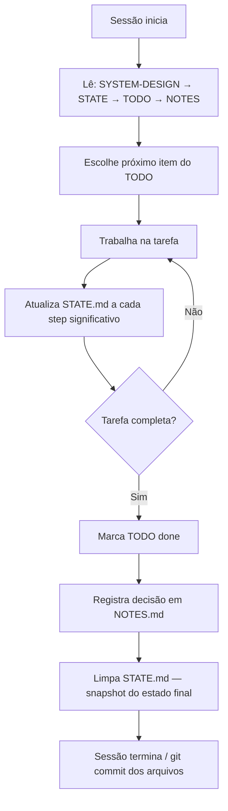

# Structured state tracking

> [!abstract] TL;DR
> Antes de comprar Letta ou Zep, considere arquivos `.md`. Para muitos agentes, o estado de trabalho cabe em três a cinco arquivos versionáveis: `NOTES.md` (decisões), `TODO.md` (próximos passos), `SYSTEM-DESIGN.md` (arquitetura), `STATE.md` (estado atual da tarefa). O agente **edita** esses arquivos durante a sessão como um humano editaria. Diff legível, git-friendly, debug trivial. Funciona surpreendentemente bem em codebases porque arquivos são o ambiente nativo do agente de coding. Structured state tracking é a ponte entre o que vive no contexto (efêmero) e o que precisa sobreviver entre sessões (durável) — sem a complexidade de um sistema de memória especializado.

---

## O problema

Você tem um agente de coding que trabalha em sprints de 2-3 horas. No final da primeira hora, ele analisou o codebase, identificou 5 problemas, decidiu por uma abordagem. Na segunda hora, com o contexto crescendo, começa a "esquecer" as decisões da primeira hora. Na terceira hora, pode estar contradizendo o que decidiu no início.

A solução intuitiva é "janela maior" ou "compressão mais agressiva". Mas existe uma solução mais elegante: **exteriorizar o estado**. Em vez de confiar que as decisões sobrevivam na janela de contexto, o agente as **escreve em arquivos** — e os lê de volta no início de cada ciclo de trabalho. O estado durável fica fora do contexto; o que fica dentro é o trabalho atual.

---

## A premissa

Memory layer não precisa ser banco de dados. Pode ser **arquivos em disco** que o agente lê e escreve via tools normais (`read_file`, `write_file`) — as mesmas tools que já usa para editar código.

```
projeto/
├── src/
├── tests/
└── .agent/
    ├── NOTES.md          ← decisões e observações (append-only)
    ├── TODO.md           ← próximos passos (diff)
    ├── SYSTEM-DESIGN.md  ← arquitetura (quase imutável)
    ├── STATE.md          ← estado atual da tarefa (replace por turno)
    └── DECISIONS.md      ← log de decisões com data e razão
```

> [!quote] Sebastian Raschka — Components of A Coding Agent (2025)
> *"The runtime keeps a fuller transcript as a durable state, alongside a lighter memory layer that is smaller and gets modified and compacted rather than just appended to."*

A chave é que cada arquivo tem uma **política de atualização diferente**: NOTES cresce (append), STATE é substituído (replace), TODO é editado (diff), SYSTEM-DESIGN raramente muda. Misturar essas políticas em um único arquivo é o principal anti-pattern.

---

## Os quatro arquivos canônicos

### `NOTES.md` — observações vivas (append-only)

```markdown
## 2026-06-27 — investigação de latência

- Endpoint /pay tem p95 de 2.3s
- Causa parece ser o N+1 query em fetch de transactions
- Alternativa A: eager loading (mais simples, menos infra)
- Alternativa B: cache em Redis (mais performance, mais complexidade)
- Decisão: tentar A primeiro, B se A não resolver em 24h

## 2026-06-28 — resultado de eager loading

- Implementado em src/transactions.py linha 87-102
- p95 caiu de 2.3s para 340ms — resolvido
- Redis desnecessário por ora
```

Cada entrada é datada. O agente **nunca edita** entradas antigas — só adiciona ao final. No início de cada sessão, lê NOTES para se "atualizar" com o histórico de decisões.

### `TODO.md` — próximos passos (editável)

```markdown
## In progress
- [ ] Implementar testes de regressão para /pay latência

## Up next
- [ ] Atualizar README com novas dependências
- [ ] Verificar se N+1 existe em outros endpoints (/transfer, /refund)

## Done (recent)
- [x] Investigar causa do p95 — era N+1 em fetch_transactions (2026-06-27)
- [x] Implementar eager loading — p95 = 340ms (2026-06-28)
```

O agente marca `[x]` quando completa, move para Done, adiciona novos itens conforme aparecem. Estado da execução **explícito e rastreável**.

### `SYSTEM-DESIGN.md` — arquitetura (quase imutável)

```markdown
## Componentes
- API (FastAPI) → DB (Postgres) → Cache (Redis — não ativo ainda)

## Fluxos críticos
- Pagamento: API → validate → debit → publish event → respond

## Constraints que não podem mudar
- p95 latência < 1s (SLA com cliente enterprise)
- 0 perda de event (compliance financeiro)
- Interface pública PaymentService.process() intocável (SDK v2 em produção)
```

Funciona como **âncora de contexto** — o agente lê antes de qualquer trabalho arquitetural para garantir que as constraints estão presentes.

### `STATE.md` — onde estamos agora (replace por turno)

```markdown
## Tarefa atual
Refatorar fetch_transactions para eager loading

## Arquivos modificados nesta sessão
- src/transactions.py (eager loading aplicado, linha 87-102)

## Próximo step imediato
Rodar pytest tests/test_transactions.py para verificar regressão

## Bloqueios ativos
- Nenhum

## Decisões tomadas nesta sessão
- Usar joinedload em vez de subqueryload (mais limpo para este caso)
```

**Curto** — máximo 1-2KB. Re-escrito a cada turno (não append). É o espelho do contexto de trabalho imediato, não o histórico (isso vai para NOTES).

---

## Por que markdown e não JSON ou banco de dados?

| Critério | Markdown | JSON | DB (Postgres/Redis) |
|---|---|---|---|
| Diff legível | ✅ git diff funciona | ⚠️ difícil de ler | ❌ sem suporte nativo |
| Git-friendly | ✅ | ✅ | ❌ |
| LLM lê bem | ✅ nativo do formato | ✅ | ❌ requer ferramenta |
| LLM escreve bem | ✅ sem problemas de escape | ⚠️ erros de escape comuns | ❌ requer tool call + query |
| Custo de setup | 0 | 0 | Alto (infra, migração, manutenção) |
| Debug humano | ✅ abre no editor | ⚠️ precisa formatador | ❌ precisa query tool |
| Schema rígido | ❌ (pode ser problema) | ✅ | ✅ |
| Escala de volume | ❌ (arquivos crescem) | ⚠️ | ✅ |

Para a maioria dos agentes de coding, **markdown ganha**. JSON faz sentido quando schema rígido é requisito (ex: dados que outros sistemas consomem). DB faz sentido para escala e multi-usuário.

---

## Fluxo de operação



A ordem de leitura — mais imutável primeiro, mais volátil por último — garante que o agente carregue as constraints arquiteturais antes de ler o estado efêmero da sessão. Se ler STATE antes de SYSTEM-DESIGN, pode interpretar o estado da sessão sem o contexto das constraints que não podem mudar.

---

## Skills + structured state — o combo canônico

Convenção popular em 2026 (incluindo este Codex):

```
.agent/
├── skills/                 ← conhecimento reutilizável (cross-projeto)
│   ├── debugging.md
│   └── refactoring.md
├── NOTES.md                ← memória deste projeto
├── TODO.md                 ← backlog deste projeto
└── STATE.md                ← estado desta sessão específica
```

A distinção é importante: **skills são conhecimento** (como fazer X), **structured state é memória** (o que foi feito e o que falta). Skills não mudam entre projetos; state é sempre específico do projeto e da sessão.

---

## Padrões de governança

- **Append vs. replace vs. diff** — NOTES é append-only, STATE é replace por turno, TODO é diff (edição cirúrgica)
- **Tamanho máximo** — STATE <2KB; NOTES <50KB (compactar quando exceder, gerando `NOTES-archive-YYYY-MM.md`)
- **Versionamento** — git tracking de tudo em `.agent/`, *exceto* STATE.md (volátil, não vale versionar commit a commit)
- **Read order** — agente lê na ordem de imutabilidade: SYSTEM-DESIGN → STATE → TODO → NOTES
- **Commit de estado** — ao final de cada fase significativa, commitar o `.agent/` junto com o código — o histórico de decisões fica junto com o histórico de mudanças

---

## Prompt de sistema para state tracking

O agente não usa os arquivos automaticamente — precisa de instruções explícitas. Template mínimo:

```
AT THE START OF EACH SESSION:
1. Read SYSTEM-DESIGN.md (constraints and architecture — never override)
2. Read STATE.md (what was in progress)
3. Read TODO.md (what's next)
4. Read NOTES.md if you need historical context

DURING THE SESSION:
- Update STATE.md at each significant step (replace, not append)
- Add to TODO.md when you identify new tasks
- Mark [x] in TODO.md when tasks are complete

AT THE END OF EACH SESSION OR TASK:
- Record decisions in NOTES.md (append with today's date)
- Clean STATE.md to reflect the final state (what's done, what's next)
- Never leave STATE.md with stale information
```

O detalhe mais importante: "replace, not append" em STATE.md. Sem essa instrução explícita, o comportamento padrão do modelo é adicionar ao arquivo, e STATE.md vira um log não estruturado em 2-3 sessões.

---

## Quando structured state é insuficiente

Structured state em arquivos é o começo. Há cenários onde ele não resolve:

- **Múltiplos usuários compartilhando o mesmo agente** — arquivos não têm controle de acesso por usuário; precisa de DB com isolamento
- **Volume alto de queries semânticas** — leitura sequencial de arquivos é lenta para buscas "o que decidimos sobre X no mês passado?"; precisa de vector store
- **Multi-agent com agentes rodando em paralelo** — race conditions em arquivos sem locking; precisa de shared state com controle de concorrência (→ [[09 - Shared memory em multi-agent]])
- **Compliance/auditoria regulatória** — DB com log estruturado e auditabilidade certificada é mais defensável que arquivos markdown

---

## Armadilhas comuns

> [!warning] Estado em comentários no código
> Guardar observações do agente em comentários no próprio código (`// TODO: agente decidiu usar redis aqui`) é um anti-pattern comum. O problema: comments são removidos por linters, pelo próprio agente em iterações futuras, e por PRs de outros desenvolvedores. A informação desaparece sem aviso. Estado vai em `.agent/NOTES.md`, não em comentários no código.

> [!warning] Um único arquivo MEMORY.md para tudo
> Agentes iniciantes frequentemente criam um único `MEMORY.md` que mistura decisões arquiteturais, estado da sessão, próximos passos e observações avulsas. Depois de 3 semanas, o arquivo tem 200 linhas de informações sem estrutura de acesso — o agente perde mais tempo lendo do que o arquivo economiza. A separação em NOTES/TODO/STATE/SYSTEM-DESIGN não é burocracia; é indexação.

> [!warning] STATE.md crescendo sem controle
> STATE.md deve ser um snapshot do estado *atual*, não um log. Se o agente está apenas adicionando ao STATE.md sem nunca limpar, ele vira um segundo NOTES.md — mas sem a organização por data. Defina explicitamente no prompt do agente: "STATE.md deve ter no máximo 1KB; substitua completamente ao final de cada tarefa".

> [!warning] Sem rotina de compactação de NOTES
> NOTES.md com append-only cresce indefinidamente. Depois de meses, o agente leva 10 turnos só para ler NOTES. Defina uma rotina de compactação: a cada N entradas ou quando passar de 50KB, o agente gera `NOTES-archive-YYYY-MM.md` com o histórico antigo e um resumo em `NOTES.md` com os highlights dos últimos 3 meses.

---

## Estado da arte — junho de 2026

**File-based state como padrão em coding agents**
Em 2025-2026, o padrão de arquivos de estado tornou-se standard em coding agents comerciais. Claude Code usa `CLAUDE.md` como anchor de contexto de projeto. Cursor usa `.cursor/rules`. Copilot usa `.github/copilot-instructions.md`. Todos são variações do mesmo princípio: estado configurável e durável em arquivos de texto que o agente lê no início de cada sessão.

**Structured compaction via state files**
Uma evolução de 2026: em vez de compactar o histórico de conversa (que pode perder informação), compactar em NOTES.md — o agente decide o que preservar em formato estruturado, e o histórico bruto é descartado. A compactação é semântica, não automática.

**Git como sistema de memória**
Um insight que ganhou tração em 2026: o histórico git é memória de agente gratuita. Commit messages bem escritos ("refatorou fetch_transactions para eager loading — resolveu p95=2.3s → 340ms") são NOTES.md implícito. Agentes que fazem commits atômicos por decisão (não por sessão) têm melhor "memória" do que agentes que compactam em arquivo separado.

**TypeSpec e JSON Schema para state validation**
Para agentes que precisam de state mais estruturado, 2026 viu adoção de schemas para validar os arquivos de estado antes de persistir. O agente gera `STATE.json` validado por um schema — garantindo que campos críticos nunca estão ausentes sem depender de boa vontade do modelo.

---

## Casos práticos

### Caso 1 — Coding agent de longa duração

Um agente refatora um módulo de pagamentos em 5 sessões de 2 horas ao longo de uma semana. Sem state tracking, cada sessão começa do zero — o agente relê o codebase, reanalisa, pode tomar decisões diferentes das sessões anteriores.

Com structured state:
- SYSTEM-DESIGN.md contém constraints imutáveis (interface pública, SLA de latência)
- NOTES.md tem o histórico de decisões das 4 sessões anteriores
- STATE.md tem o estado preciso de onde parou

A quinta sessão começa com o agente lendo 3 arquivos em 2 minutos e continuando exatamente de onde parou. Sem re-análise, sem decisões contraditórias.

### Caso 2 — Agente de pesquisa acumulativa

Um agente monitora novidades em segurança de IA ao longo de semanas. A cada sessão, pesquisa e filtra; ao final, registra em NOTES.md:

```markdown
## 2026-06-20 — CVE-2026-XXXX (prompt injection em LLM API gateway)
- Severidade: Alta
- Afeta: versões < 2.3.1 do xyz-gateway
- Mitigação: input sanitization antes do encode
- Status: investigando se afeta nosso stack
```

Na próxima sessão, lê NOTES e não repesquisa o que já foi catalogado. A coleção cresce de forma controlada e pesquisável.

### Caso 3 — Handoff humano → agente

Um desenvolvedor trabalha num feature até o fim do dia e quer que um agente continue na manhã seguinte. Antes de terminar, atualiza STATE.md com o estado exato:

```markdown
## Tarefa atual
Implementar validação de CPF em UserService.create()

## Onde parei
Lógica de validação em src/services/user_service.py linha 145.
Falta: unit test + integração com o endpoint POST /users

## Decisão pendente
Validar CPF no domínio (atual plano) ou na camada de API?
Discutir com equipe amanhã antes de continuar.
```

Na manhã seguinte, o agente lê STATE.md e continua do ponto exato — inclusive com a decisão pendente sinalizada. O handoff humano → agente tem fidelidade total.

### Caso 4 — Debugging agent com scratchpad

Durante uma sessão de debugging, o agente usa STATE.md como scratchpad temporário:

```markdown
## Hipóteses testadas
- [x] Race condition em thread pool — DESCARTADO (sem concorrência no path)
- [x] Timeout de DB — DESCARTADO (logs mostram <50ms)
- [ ] N+1 query em fetch_related — INVESTIGANDO

## Evidências coletadas
- Log linha 2847: query fetch_related chamada 127x em 1 segundo
- Stack trace: api.py:89 → service.py:234 → repo.py:67
```

O STATE.md como scratchpad é mais eficiente que manter as hipóteses apenas no contexto — se o agente precisar de compactação durante a sessão de debugging, o scratchpad sobrevive à compactação.

---

## Como explicar em inglês

**Descrevendo o conceito:**
- "Structured state tracking is like giving the agent a workbook — NOTES for decisions, TODO for next steps, STATE for current focus. It reads at the start, writes throughout, and picks up exactly where it left off next session"
- "Instead of relying on context compression to preserve decisions, the agent externalizes them to files — same tools it uses for code, zero extra infrastructure"
- "The read order matters: invariants first (SYSTEM-DESIGN), then current state, then backlog, then history. Loading constraints before state prevents the agent from reinterpreting state without the architectural guardrails"

**Em conversas técnicas:**
- "STATE.md is a snapshot, not a log — if it's growing, the agent is appending instead of replacing"
- "We use NOTES for append-only decisions and STATE for the current working snapshot — they serve different policies so they can't be merged into one file"
- "The agent committed STATE.md alongside the code — the git history tells you exactly what the agent knew at each decision point"

### Tabela PT ↔ EN

| Português | Inglês |
|---|---|
| Rastreamento de estado estruturado | Structured state tracking |
| Arquivo de estado | State file |
| Notas de decisão | Decision notes |
| Bloco de rascunho | Scratchpad |
| Memória baseada em arquivo | File-based memory |
| Estado da sessão | Session state |
| Política de atualização | Update policy |
| Snapshot de estado | State snapshot |
| Âncora de contexto | Context anchor |
| Compactação semântica | Semantic compaction |
| Caderno de bordo | Agent workbook |
| Rotina de arquivamento | Archival routine |

---

> [!tip] Leia: AI Agent Memory Management — When Markdown Files Are All You Need? (DEV Community, 2026)
> **Fonte:** DEV Community (dev.to) | **Idioma:** EN
>
> Artigo que compara pragmaticamente file-based memory vs. sistemas especializados (Mem0, Letta) em diferentes cenários. O achado mais contra-intuitivo: para agentes de coding com sessões de 1-4 horas, markdown simples com boas políticas de atualização supera sistemas sofisticados em facilidade de debug, custo e previsibilidade. O artigo inclui template de `.agent/` pronto para copiar.
>
> 📖 [Buscar: "AI Agent Memory Management Markdown files DEV 2026"](https://dev.to/search?q=agent+memory+management+markdown)

---

## O que vem a seguir

Structured state tracking é o nível mais básico de context engineering durável — funciona para agentes solo com sessões de horas a dias. Para casos mais complexos:

- **[[11 - Skills e instructions como contexto]]** — como skills e instruções reutilizáveis complementam o state tracking, adicionando conhecimento de "como fazer" que o state não carrega
- **[[09 - Shared memory em multi-agent]]** — quando múltiplos agentes precisam de state compartilhado; file-based state com git pode servir como medium de compartilhamento simples
- **[[14 - Context engineering na prática — setup completo]]** — como integrar structured state numa arquitetura completa de context engineering

O ponto de transição entre state tracking e sistemas de memória especializados (Letta, Mem0) é quando: há múltiplos usuários, busca semântica é necessária, ou o volume de state excede o que é prático em arquivos. Para a maioria dos projetos solo, estrutured state em markdown é suficiente e deveria ser o ponto de partida.

---

## Veja também

- [[05 - Camadas de contexto — persistente, temporal, transiente]] — o state tracking implementa a camada persistente
- [[07 - Compressão e pruning de informação]] — compactação é o complemento do state tracking para sessões que crescem
- [[08 - Memória agentica — self-editing memory]] — a alternativa com sistema especializado quando o markdown não basta
- [[11 - Skills e instructions como contexto]] — o parceiro natural do state tracking

---

## Referências

- **Sebastian Raschka** — *Components of A Coding Agent* (2025). A citação sobre durable state layer + memory layer como arquitetura complementar.
- **DEV Community** — *AI Agent Memory Management - When Markdown Files Are All You Need?* (2026). Comparativo pragmático file-based vs. sistemas especializados.
- **Fountain City** — *Agent Memory Architecture: 5 Layers From Scratch Pad to Shared Knowledge* (2026). Taxonomia de camadas de memória onde structured state tracking se encaixa.
- **MachineLearningMastery** — *7 Steps to Mastering Memory in Agentic AI Systems* (2026). Guia progressivo de implementação de memória agêntica.
- **Anthropic** — *Effective harnesses for long-running agents* (2025). O `claude-progress.txt` e JSON features como exemplos canônicos de structured state tracking.
