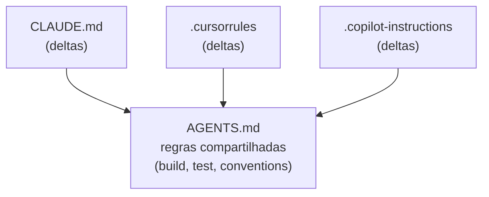
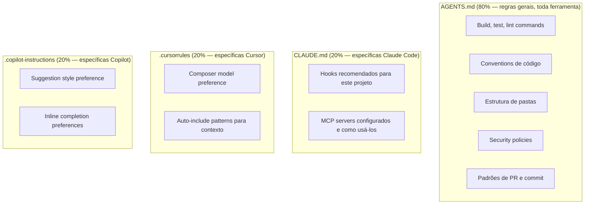
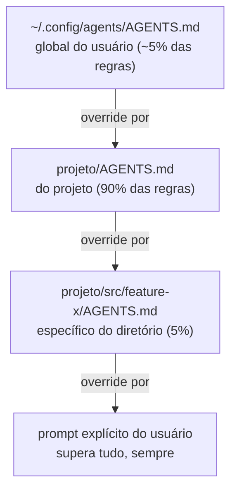

# Skills e instructions como contexto

> [!abstract] TL;DR
> Skills e instruction files (`AGENTS.md`, `CLAUDE.md`, `.cursorrules`) **são contexto** — só que persistente, versionado, e compartilhado entre sessões. Em 2026, `AGENTS.md` virou padrão de facto: especificação aberta sob a Linux Foundation, suportada nativamente por Cursor, Copilot, Gemini CLI, Windsurf, Aider, Zed, Warp, RooCode. Claude Code usa `CLAUDE.md`, mas o workaround é trivial (`ln -s AGENTS.md CLAUDE.md`). A regra de ouro: 80% das regras comuns vão em `AGENTS.md`, 20% específico vai em arquivo da ferramenta. O resultado: o agente começa cada sessão já sabendo como trabalhar no projeto — sem você repetir as mesmas convenções toda vez.

---

## O problema

Você abre uma nova sessão com seu coding agent e começa a trabalhar. Na quinta sugestão, ele usa `default export` quando seu projeto usa exclusivamente `named exports`. Na décima, esquece de rodar `pnpm lint` antes de sugerir o commit. Na vigésima, cria um arquivo no lugar errado porque não sabe a estrutura de pastas do projeto.

Sem instruction files, cada sessão começa do zero — o agente não tem memória de como trabalhar no *seu* projeto. A solução não é escrever um prompt enorme toda vez: é **versionizar as regras do projeto** em arquivos que o agente carrega automaticamente.

O insight central: instruction files não são documentação do projeto — são **contexto persistente e compartilhado** que define o ambiente de trabalho do agente. Bem escritos, eles transformam a primeira sugestão da sessão de genérica para já-contextualizada.

---

## A separação que importa



Cada ferramenta lê o seu arquivo específico + (se configurado) o `AGENTS.md`. Single source of truth → menos drift entre ferramentas, menos retrabalho quando as regras mudam.

O erro clássico: copiar-colar as mesmas regras nos três arquivos. Em 3 meses, as três cópias estão desincronizadas e nenhuma delas reflete como o projeto realmente funciona hoje.

---

## AGENTS.md — a especificação

> [!info] Stewardship
> `AGENTS.md` é uma especificação aberta, mantida pela **Agentic AI Foundation** sob a **Linux Foundation**. Surgiu de colaboração entre OpenAI Codex, Amp, Jules (Google), Cursor, Factory — uma rara situação onde concorrentes definiram um padrão comum antes que cada um criasse o seu.

**Regras fundamentais da especificação:**

- Markdown padrão, sem schema proprietário, sem YAML frontmatter obrigatório
- Suportado nativamente por: Cursor, Copilot, Gemini CLI, Windsurf, Aider, Zed, Warp, RooCode
- O arquivo mais próximo do arquivo sendo editado tem precedência (resolução hierárquica)
- Prompt explícito do usuário sempre supera o conteúdo do arquivo

**Não suportado nativamente (em jun/2026):**

- Claude Code → usa `CLAUDE.md`. Workaround: `ln -s AGENTS.md CLAUDE.md`
- Ferramentas legadas com seus próprios formatos — workaround similar por symlink ou inclusão

---

## Estrutura típica de AGENTS.md

```markdown
# Nome do Projeto

Descrição breve do que é o projeto e o que o agente deve ajudar.

## Build & Test
- Install: `pnpm install`
- Test: `pnpm test`
- Build: `pnpm build`
- Lint: `pnpm lint` (sempre rodar antes de commitar)

## Conventions
- Use functional React components com hooks
- Named exports em todos os módulos — nunca default export
- Todas as funções públicas devem ter JSDoc
- Erros: throw typed errors, nunca strings

## Project Structure
- `src/components/` — UI components apenas
- `src/lib/` — lógica pura, sem React
- `src/api/` — wrappers de API client — nunca chamar fetch diretamente

## Security Policies
- Nunca commitar secrets — nem em .env.example com valores reais
- Todas as chamadas de API passam por src/api/ — sem fetch direto nos componentes

## Common Tasks
- Novo endpoint: seguir padrão em src/api/README.md
- Novo componente UI: seguir padrão de src/components/Button.tsx
```

O formato ideal é **regras acionáveis**, não documentação. "Use named exports" é acionável. "Este projeto usa React" é documentação — desnecessária porque o agente vê pelo código.

---

## Skills vs instructions — a distinção

| | Instructions (`AGENTS.md`) | Skills (`skill.md`) |
|---|---|---|
| **Escopo** | Projeto inteiro | Tarefa específica |
| **Tamanho** | 1-3K tokens | 200 tokens a 5K cada |
| **Quando carregado** | Sempre, como contexto base | Quando a tarefa ativa — sob demanda |
| **Exemplo** | "Use TypeScript strict mode" | "Como debugar regressão de latência" |
| **Atualização** | Raro, mudança importante | Iterativa, conforme o agente aprende |
| **Quem usa** | Toda sessão, toda ferramenta | Agentes que suportam skill loading |

A distinção é de **granularidade e ativação**: instructions definem o ambiente permanente de trabalho; skills definem playbooks para tarefas específicas que só fazem sentido quando aquela tarefa está ativa. Carregar todas as skills o tempo todo seria context rot por instruções (→ [[03 - Context rot e atenção diluída]]).

> [!tip] Skills emergiram como padrão em 2025-2026
> Skills são "playbooks reusáveis" que o agente carrega só quando relevante. Anthropic, OpenAI e outros padronizaram via `SKILL.md` e diretórios `.agent/skills/`. A diferença chave: skills **não** entram no contexto até o agente julgar que precisa — diferente de instructions que entram sempre. O marketplace de skills é o próximo passo (→ [[16 - Agent skills marketplace e SKILL.md]]).

---

## Cross-tool config — a estratégia 80/20



O anti-pattern: duplicar todo o conteúdo de AGENTS.md no CLAUDE.md. Isso parece "garantir que funciona" mas garante drift — quando AGENTS.md muda, CLAUDE.md fica desatualizado, e o agente recebe regras conflitantes.

---

## Hierarquia e resolução de precedência



A resolução hierárquica — mais próximo do arquivo editado ganha — é universal em 2026. É análoga ao `package.json` mais próximo vencendo no Node.js, ou ao `.gitignore` mais específico prevalecendo.

Isso permite um padrão poderoso: regras gerais do projeto em `/AGENTS.md`, regras específicas de uma camada (ex: API) em `/src/api/AGENTS.md`, sem precisar repetir o que já está no nível pai.

---

## O que NÃO colocar em AGENTS.md

- **Segredos, credenciais, tokens** — o arquivo vai para o git; segredos vão para variáveis de ambiente ou secret manager
- **PII de usuários** — mesma razão de segurança
- **Coisas que mudam por sessão** — decisões momentâneas vão em `STATE.md` (→ [[10 - Structured state tracking]])
- **Histórico de decisões longas** — vira ruído; histórico vai em `NOTES.md`
- **Documentação completa** — link para README; AGENTS.md é resumo acionável, não wiki
- **Regras contraditórias** — se há conflito interno, o agente escolhe aleatoriamente; resolva antes de commitar

---

## Armadilhas comuns

> [!warning] AGENTS.md como documentação em vez de regras
> O erro mais frequente: transformar AGENTS.md numa documentação verbosa do projeto ("Este projeto usa React 18 com TypeScript e foi iniciado em 2024 por..."). Isso é inútil para o agente — ele vê o código. AGENTS.md deve ter exclusivamente **regras que o agente não pode inferir do código** — convenções, comandos de build, políticas de segurança, padrões de PR. Se você pode remover uma linha e o agente não vai errar por isso, remova.

> [!warning] Regras duplicadas entre AGENTS.md e arquivos de ferramenta
> Manter as mesmas regras em AGENTS.md, CLAUDE.md e .cursorrules é drift garantido. Em 3 meses, as três cópias estão desincronizadas — e quando o agente recebe instruções conflitantes (AGENTS.md diz "named exports", CLAUDE.md ainda tem a regra antiga "default exports"), o comportamento é não-determinístico. Um symlink garante single source of truth com zero custo.

**Exemplo concreto do drift — o mesmo dev, dois resultados diferentes:**

```markdown
# AGENTS.md (atualizado na migração para named exports)
## Conventions
- Named exports em todos os módulos — nunca default export
```

```markdown
# CLAUDE.md (arquivo antigo, esquecido depois da migração)
## Conventions
- Use default export nos componentes React
```

Um dev abre o projeto no Cursor: recebe a regra de `named exports` (Cursor lê `AGENTS.md`). O mesmo dev, na mesma tarde, abre o projeto no Claude Code: recebe a regra de `default export` (Claude Code lê só `CLAUDE.md`, que ninguém atualizou). O resultado não é "o agente erra sempre da mesma forma" — é pior: **o comportamento correto depende de qual ferramenta abriu a sessão**. Dois PRs do mesmo dev, no mesmo dia, chegam com convenções opostas — e nenhum dos dois está "errado" do ponto de vista do agente que o gerou, porque cada um seguiu à risca o arquivo que leu.

> [!warning] AGENTS.md gigante — context rot por instrução
> Um AGENTS.md de 10K tokens consome 10% de uma janela de 100K antes da sessão começar — e o conteúdo no meio do arquivo fica na zona de baixa atenção (→ [[03 - Context rot e atenção diluída]]). Regras enterradas no meio de um arquivo grande são ignoradas na prática. Mantenha em 1-3K tokens. O que não cabe em 3K tokens provavelmente é documentação disfarçada de instrução.

> [!warning] Instructions stale — regra de 2024 ainda no arquivo em 2026
> AGENTS.md sem rotina de revisão acumula regras obsoletas. "Use React 17 patterns" ainda no arquivo 2 anos depois da migração para React 18. O agente pode seguir a regra stale, gerando código legado sem perceber. Defina revisão de AGENTS.md como parte do processo de onboarding de novas versões de framework.

---

## Estado da arte — junho de 2026

**AGENTS.md como padrão de indústria**
O processo de padronização em torno do AGENTS.md acelerou em 2025-2026. A maioria das ferramentas de AI coding lançou suporte nativo, e a especificação tornou-se o equivalente de `.editorconfig` para agentes — um arquivo que todos os tools leem sem configuração adicional.

**Skills como primeiro cidadão em tooling**
Em 2026, ferramentas como Cursor e Claude Code implementaram suporte a skills como primitiva nativa — não apenas como arquivos markdown, mas com descoberta automática, versionamento e compartilhamento. O diretório `.agent/skills/` tornou-se convensão de facto, e marketplaces de skills começaram a emergir (→ [[16 - Agent skills marketplace e SKILL.md]]).

**Instructions geradas por análise de padrões**
Uma tendência emergente: ferramentas analisam o histórico de correções do desenvolvedor e geram sugestões de novas regras para AGENTS.md. Se o desenvolvedor corrigiu o agente 5 vezes pela mesma convenção, o tool sugere "adicionar isso ao AGENTS.md". Reduz o problema de instructions stale por omissão.

**Hierarquia de instructions em monorepos**
Para monorepos com dezenas de pacotes, a hierarquia de resolução (mais próximo ganha) virou essencial. Em 2026, ferramentas avançadas suportam regras condicionais ("esta regra se aplica apenas a pacotes com `"type": "module"` no package.json"), tornando AGENTS.md mais preciso sem aumentar o tamanho.

---

## Casos práticos

### Caso 1 — AGENTS.md como onboarding de agente

Um time de 5 devs usa Claude Code, Cursor e Copilot ao mesmo tempo. Sem AGENTS.md, cada desenvolvedor configura as preferências individualmente — 5 versões diferentes do mesmo projeto. Com AGENTS.md no repositório:

```markdown
## Conventions
- Imports: absolute paths via `@/` alias — nunca relativos
- Error handling: throw typed errors from src/errors/ — nunca throw strings
- Testing: unit tests devem ter coverage >80% — rodar `pnpm test:coverage` para checar
```

Qualquer dev, em qualquer ferramenta, recebe o mesmo contexto. Quando um novo dev entra no time, seu agente já sabe as convenções — sem ninguém precisar explicar.

### Caso 2 — Skills para debugging recorrente

Um time de data engineering tem um padrão de debugging de pipelines Spark que é especializado — não é conhecimento geral do domínio Spark, mas conhecimento específico de como *eles* monitoram, onde *eles* logam, quais são as causas comuns de falha no *seu* cluster.

Em vez de explicar isso toda vez para o agente, criaram uma skill:

```
.agent/skills/debug-spark-pipeline.md:

# Debug Spark Pipeline — this team's patterns

1. Check partition skew: `SELECT partition_id, count(*) FROM logs GROUP BY 1 ORDER BY 2 DESC`
2. Look for OOM in specific log: s3://our-logs/spark-executor-*.log
3. Common causes in our cluster: [...]
4. Escalation: if memory > 80%, ping #data-ops channel
```

O agente carrega a skill quando a tarefa é "debugar um pipeline Spark" — sem isso estar no AGENTS.md (que ficaria gigante) nem precisar ser explicado toda sessão.

### Caso 3 — Hierarquia em monorepo

Um monorepo com um pacote de API e um pacote de frontend. As convenções são diferentes:

```
/AGENTS.md              ← convenções gerais (build, test, git)
/packages/api/AGENTS.md ← Python/FastAPI: type hints obrigatórios, pydantic models
/packages/web/AGENTS.md ← TypeScript/Next: named exports, RSC, app router
```

O agente editando `/packages/api/src/users.py` recebe as regras do AGENTS.md raiz + as regras de `/packages/api/AGENTS.md` — sem as regras de frontend, que seriam ruído e potencialmente contraditórias.

### Caso 4 — Instructions como spec técnica

Uma empresa com equipe de segurança mandatou regras de segurança para todos os serviços. Em vez de code review manual para verificar conformidade, adicionaram ao AGENTS.md:

```markdown
## Security Requirements (mandatory — non-negotiable)
- All database queries must use parameterized queries — no string concatenation
- User input must be validated via pydantic before any processing
- Never log user PII — use obfuscation via src/logging/safe_log.py
- All API endpoints require authentication via JWT — no public endpoints in /api/
```

O agente segue essas regras sem que o desenvolvedor precise lembrá-las. Violações identificadas em code review caíram 80% em 6 meses.

---

## Métricas de eficácia

| Métrica | Alvo | Sinal de alerta |
|---|---|---|
| **Tamanho de AGENTS.md** | 1-3K tokens | >5K tokens → virando documentação |
| **% de convenções seguidas em PRs gerados por IA** | >85% | <70% → regras não são claras ou foram stale |
| **Drift entre AGENTS.md e código real** | <10% | >20% → instrução desatualizada |
| **Frequência de atualização** | Mensal a trimestral | >1 ano sem revisão → certamente stale |
| **Tempo de "onboarding" de novo agente** | <5 min de leitura | >15 min → arquivo muito verboso |

---

## Como explicar em inglês

**Descrevendo o conceito:**
- "AGENTS.md is like a contract between the project and the AI tool — it tells the agent how to behave in this codebase, without you having to repeat it every session"
- "The difference between instructions and skills: instructions are always loaded, they define the environment; skills are loaded on demand, they define how to do specific tasks"
- "Think of AGENTS.md as `.editorconfig` for AI agents — it's project configuration that travels with the repository"

**Em conversas técnicas:**
- "We need to add the named-export convention to AGENTS.md — the agent is generating default exports again"
- "That debugging playbook is too specialized for AGENTS.md, it'll pollute every session. Let's make it a skill that loads only for debugging tasks"
- "AGENTS.md is at 8K tokens — it's going to cause context rot for every session. Let's prune it to the rules that actually matter"

### Tabela PT ↔ EN

| Português | Inglês |
|---|---|
| Arquivo de instruções | Instruction file |
| Regras de projeto | Project rules |
| Habilidades de agente | Agent skills |
| Convenções de código | Code conventions |
| Hierarquia de resolução | Resolution hierarchy |
| Contexto persistente | Persistent context |
| Drift de instruções | Instructions drift |
| Regra obsoleta | Stale rule |
| Ponto único de verdade | Single source of truth |
| Contexto base | Base context |
| Playbook reutilizável | Reusable playbook |
| Descoberta automática | Auto-discovery |

---

> [!tip] Leia: How to Build Your AGENTS.md — Augment Code (2026)
> **Fonte:** Augment Code blog | **Idioma:** EN
>
> Guia prático com exemplos reais de AGENTS.md em projetos diferentes — monorepo TypeScript, API Python, e aplicação full-stack. O ponto mais valioso: a análise de quais seções têm mais impacto na qualidade das sugestões (build commands e security policies batem convenções de estilo em ROI de atenção do modelo).
>
> 📖 [Buscar: "How to Build Your AGENTS.md Augment Code 2026"](https://www.augmentcode.com/blog/)

---

## O que vem a seguir

Skills e instructions definem o "como trabalhar" do agente. A próxima dimensão é "o que não pode fazer" — as restrições que protegem usuários, dados e infraestrutura.

- **[[12 - Guardrails determinísticos]]** — como adicionar camadas de segurança que complementam as instructions, garantindo que certos comportamentos são impossíveis independente do contexto
- **[[16 - Agent skills marketplace e SKILL.md]]** — a evolução de skills individuais para um ecossistema de skills distribuídas e versionadas
- **[[14 - Context engineering na prática — setup completo]]** — como AGENTS.md, skills, structured state e guardrails se integram num setup completo

A nota [[10 - Structured state tracking]] é o complemento natural desta: instructions definem as regras permanentes; structured state define a memória de execução da sessão. Os dois juntos cobrem o que uma sessão precisa saber antes de começar a trabalhar.

---

## Veja também

- [[10 - Structured state tracking]] — o complemento: estado da sessão vs. regras permanentes
- [[15 - Técnicas de prompting — zero-shot, few-shot, CoT, ToT]] — instructions como few-shot permanente
- [[16 - Agent skills marketplace e SKILL.md]] — a próxima evolução das skills
- [[14 - Context engineering na prática — setup completo]]

---

## Referências

- **AGENTS.md spec** — *agents.md* (2026, Linux Foundation). Especificação oficial do padrão.
- **Augment Code** — *How to Build Your AGENTS.md (2026)* (2026). Guia prático com exemplos reais.
- **DeployHQ** — *CLAUDE.md, AGENTS.md & Copilot Instructions* (2026). Como usar os três em conjunto sem drift.
- **Hivetrail** — *AGENTS.md vs CLAUDE.md: The AI Developer's Guide to Context Standards* (2026). Análise do ecossistema de instruction files.
- **SmartScope** — *AGENTS.md Cross-Tool Unified Management Guide* (fev 2026). Estratégias de gestão cross-tool com single source of truth.
