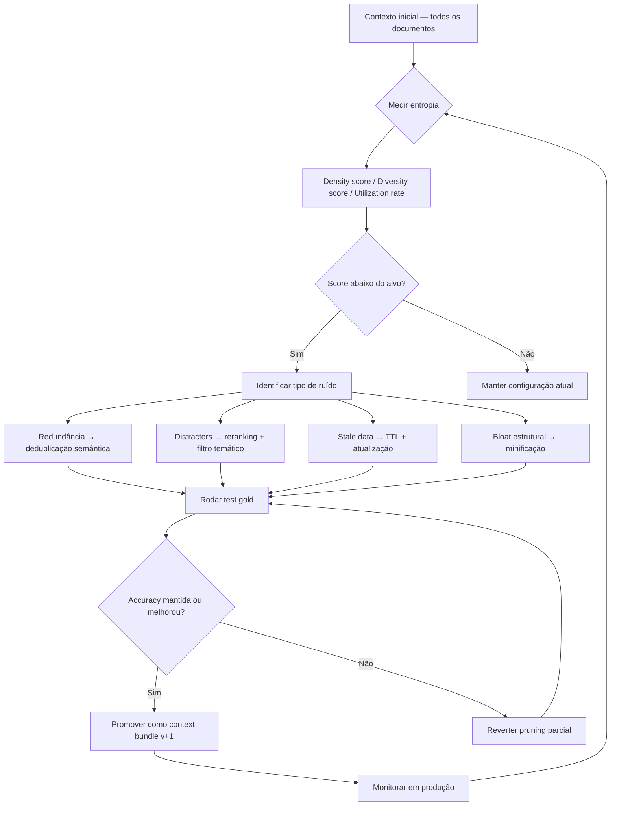

# Entropia e qualidade de contexto

> [!abstract] TL;DR
> Mais contexto **não é** melhor contexto. A pergunta certa: *quanto sinal por token?* Contexto de **alta entropia** é denso em informação útil; contexto de **baixa entropia** é diluído com redundância, ruído e distractors. A pesquisa de context rot mostrou: cada token de baixa entropia rouba atenção dos tokens de alta entropia (→ [[03 - Context rot e atenção diluída]]). Engenharia de qualidade de contexto = maximizar a densidade de sinal por unidade de janela, não maximizar a quantidade de informação inserida. Times maduros tratam contexto como **produto** — versionado, testado, governado — e medem qualidade com test gold antes de cada mudança.

---

## O problema

Um time tem um chatbot de suporte que responde perguntas sobre o produto. Para "garantir cobertura completa", cola toda a documentação no sistema prompt — 50 páginas em 80K tokens. A taxa de respostas corretas é 71%.

Um engenheiro cético seleciona manualmente os 20 parágrafos mais relevantes por query type — 8K tokens. A taxa de respostas corretas sobe para 84%. Com 10x menos tokens.

O paradoxo: **mais informação piorou o resultado**. O modelo não falhou por falta de dados — falhou por excesso de ruído. Cada parágrafo irrelevante era um distractor que desviava atenção dos parágrafos que importavam.

Esse é o problema central de entropia de contexto: não é um problema de quantidade, é um problema de **densidade de sinal**.

---

## O ciclo de melhoria de qualidade



O ciclo não termina. A base de conhecimento muda, o domínio evolui, e um contexto de alta entropia ontem acumula stale data com o tempo. Quality engineering de contexto é contínuo — não é setup único.

---

## A reformulação que muda tudo

```
Pergunta antiga: "Como caibo mais informação no contexto?"
Pergunta nova:   "Como aumento o sinal por token?"
```

A primeira pergunta levou ao crescimento de janelas (1M, 2M tokens). A segunda levou a context engineering como disciplina. A janela maior resolve o limite de capacidade; só a densidade de sinal resolve o problema de qualidade.

> [!quote] Atlan — Context Engineering Framework (2026)
> *"Context engineering is not a content problem — it is an architecture problem."*

Isso significa: o problema de qualidade de contexto não se resolve adicionando mais conteúdo nem editando frases. Resolve-se com arquitetura — pipeline (→ [[04 - Context pipelines — montagem dinâmica]]), camadas (→ [[05 - Camadas de contexto — persistente, temporal, transiente]]), retrieval (→ [[06 - Dynamic retrieval beyond RAG]]), compressão (→ [[07 - Compressão e pruning de informação]]).

---

## High-entropy vs low-entropy

| | Alta entropia | Baixa entropia |
|---|---|---|
| **Sinal por token** | Alto — cada token contribui informação nova | Baixo — muito token para pouca informação nova |
| **Redundância** | Mínima | Alta — mesma informação de formas diferentes |
| **Distractors** | Filtrados | Presentes — informação plausível mas irrelevante |
| **Atenção do modelo** | Concentrada no que importa | Diluída entre sinal e ruído |
| **Custo** | Eficiente | Desperdício de tokens e latência |

> [!example] Mesma pergunta, dois contextos
>
> **Baixa entropia (3K tokens):** Documentação inteira do produto colada — 10 seções de features não relacionadas, 5 exemplos de código tangenciais, 2 release notes históricas, repetição de conceitos em formas diferentes.
>
> **Alta entropia (300 tokens):** Os 3 parágrafos diretamente relevantes à pergunta + 1 exemplo de código que demonstra a feature específica.
>
> O modelo responde **melhor** ao segundo. Custa **10x menos**. A atenção dilui 10x menos. Se você pode manter a qualidade da resposta com 10% dos tokens, os outros 90% eram ruído.

---

## Os quatro tipos de "lixo" em contexto

### 1. Redundância

A mesma informação em múltiplas formas: documentação + comentário no código + system prompt repetindo o mesmo conceito. O modelo não ganha nada com a terceira repetição — mas perde atenção que poderia estar nos tokens únicos.

**Mitigação:** deduplicar antes de injetar. Hash de chunks para detectar duplicatas exatas; similarity threshold (cosine > 0.85) para detectar quase-duplicatas semânticas.

### 2. Distractors

Informação **plausível** mas irrelevante — semanticamente próxima da query mas factualmente diferente. O modelo é puxado por similaridade semântica, não por relevância real.

> **Pergunta:** "Qual é a configuração de timeout do servidor de produção?" **Distractor no contexto:** documentação de timeout do servidor de staging, do ambiente de CI, do ambiente de desenvolvimento local.
>
> O modelo pode responder com a configuração de staging em vez de produção, com alta confiança.

**Mitigação:** filtragem agressiva no retrieval (não top-k cego); reranking com cross-encoder para queries de alto risco; validação de output contra ground truth.

### 3. Stale data

Informação que era verdade há 6 meses mas não é hoje. "O endpoint /pay aceita método GET" era verdade antes da migração para POST-only. O modelo responde com confiança uma informação obsoleta.

**Mitigação:** TTL em memória persistente (→ [[08 - Memória agentica — self-editing memory]]); preferir JIT retrieval em domínios voláteis (→ [[06 - Dynamic retrieval beyond RAG]]); auditoria periódica da base de conhecimento com data de última verificação.

### 4. Bloat estrutural

O conteúdo pode ser denso, mas o formato é diluído. JSON pretty-printed com 4 espaços de indentação usa 3x mais tokens que JSON minificado com os mesmos dados. XML verboso, comentários redundantes em código, headers repetitivos em cada chunk — tudo isso é tokens pagos sem informação nova.

**Mitigação:** minificação antes de injetar no contexto. JSON sem whitespace. YAML em vez de XML quando aplicável. CSV em vez de tabela markdown para dados tabulares. Headers de chunk apenas quando necessário para orientação.

---

## Métricas de entropia

Não existe métrica única, mas combinar três dimensões funciona na prática:

| Métrica | Como medir | Alvo |
|---|---|---|
| **Tokens efetivos** | Remove 50% do contexto aleatoriamente; resposta mantém qualidade? | Drop de accuracy <10% |
| **Diversity score** | Embeddings de chunks com cosine similarity media < 0.7 → contexto diverso | Score médio <0.7 (mais diverso) |
| **Information per token** | Fatos únicos extraídos / tokens totais (medido com fact extraction automatizado) | Maior que baseline do projeto |
| **Context utilization rate** | tokens usados / janela disponível por turno | Manter em 40-70% — acima de 80% vira rot |

O teste mais simples: se você pode remover 30% do contexto aleatoriamente e a qualidade da resposta não cai, o contexto tem 30% de ruído. Esse é um experimento que todo time deveria rodar na base de conhecimento periodicamente.

```python
# Implementação do teste de remoção aleatória
import random

def noise_floor_test(context_chunks, query, expected_answer, runs=10):
    """Estima o noise floor: % de chunks que podem ser removidos sem degradação."""
    baseline = evaluate(query, context_chunks, expected_answer)
    results = []
    for _ in range(runs):
        reduced = random.sample(context_chunks, k=int(len(context_chunks) * 0.7))  # remove 30%
        score = evaluate(query, reduced, expected_answer)
        results.append(score)
    avg_reduced = sum(results) / len(results)
    drop = baseline - avg_reduced
    return {"baseline": baseline, "avg_reduced": avg_reduced, "drop": drop,
            "noise_floor_estimate": "~30%" if drop < 0.05 else "< 30%"}
```

Times que rodam esse teste mensalmente descobrem que bases de conhecimento acumulam 20-40% de ruído por ano apenas com adições não curadas — sem nenhuma deleção deliberada.

---

## O custo invisível da baixa entropia

Baixa entropia tem um custo triplo que raramente é medido junto:

1. **Custo direto de tokens** — mais tokens no contexto = mais custo por chamada. Com GPT-4o a $2.50/M input tokens e 80K tokens de contexto de baixa entropia (vs 8K de alta entropia), o custo por query é 10x maior.

2. **Custo de latência** — modelos levam mais tempo para processar janelas maiores (time-to-first-token escala com o tamanho do contexto). 80K tokens pode significar 3-5s extras de latência por query — perceptível para o usuário final.

3. **Custo de qualidade** — o menos óbvio. Cada token de ruído compete pela atenção do modelo com tokens de sinal. Em 80K tokens com 10% de sinal real, o modelo divide atenção entre 8K tokens úteis e 72K tokens de ruído. A probabilidade de errar aumenta proporcionalmente.

O paradoxo: times que investem em context quality engineering reportam **custos menores, latência menor e qualidade maior** simultaneamente — porque os três problemas têm a mesma raiz.

Esse paradoxo é contraintuitivo. A intuição de "colocar mais informação = mais seguro" está errada porque confunde *cobertura de informação* com *utilização de informação*. O modelo não "lê" o contexto como um humano folheia uma enciclopédia — ele distribui atenção simultaneamente por todo o contexto, e essa atenção é finita e disputada entre sinal e ruído. Cuidar da qualidade não é curar o que você coloca: é cuidar da relação sinal/ruído de tudo que está lá.

---

## A "máxima da sala"

Se contexto é o **ambiente** onde o modelo raciocina, a analogia com espaço físico é precisa:

| Sala bagunçada (baixa entropia) | Sala bem arrumada (alta entropia) |
|---|---|
| Tudo "está lá" se você procurar | Tudo importante está visível |
| A atenção fica distraída por itens irrelevantes | A atenção vai naturalmente para o que importa |
| Adicionar mais itens piora | Curar o que existe melhora |
| Difícil de auditar o que está lá | Fácil de raciocinar sobre o que está lá |

A chave: "se você procurar, encontra" não é o mesmo que "o modelo encontra quando precisa". O modelo não "procura" — ele distribui atenção por todo o contexto. O que está presente mas irrelevante não é neutro — é ativo na diminuição de atenção para o que importa.

---

## Context products — versionamento de qualidade

Times maduros tratam contexto como **produto** — não como configuração:

> [!info] Atlan — Enterprise framework (2026)
> *"Context products: versioned, tested, governed bundles aimed at specific query patterns."*

O padrão de versionamento:

- **Context bundle v1.0** → test gold mostra accuracy 82% em 200 queries representativas
- **v1.1** → reduz tokens em 30% com pruning mais agressivo, accuracy 81% (aceito — tradeoff positivo)
- **v1.2** → adiciona retrieval JIT para queries sobre data recente, accuracy 89% (promovido)

Mudança no contexto = PR com metrics + review + comparação contra baseline. Não é configuração — é engenharia.

---

## Test gold — o instrumento de medição

Para medir qualidade de contexto rigorosamente, a base é um test gold:

```python
# Estrutura de test gold
test_suite = [
    {
        "query": "Qual é o timeout padrão de conexão?",
        "expected_answer": "30 segundos",
        "context_version": "v1.1"
    },
    # ... 50-200 queries representativas
]

# Variação sistemática para encontrar o pareto front
for config in [full_context, pruned_30, compressed, jit_only, hybrid]:
    results = run_test_suite(test_suite, context_config=config)
    print(f"{config.name}: accuracy={results.accuracy}, tokens={results.avg_tokens}, cost={results.cost}")
```

```
full_context:  accuracy=82%, tokens=45K, cost=$0.45/query
pruned_30:     accuracy=81%, tokens=32K, cost=$0.32/query  ← aceito (quase mesmo com 30% menos custo)
compressed:    accuracy=79%, tokens=20K, cost=$0.20/query  ← rejeitado (drop de 3% inaceitável)
jit_only:      accuracy=85%, tokens=15K, cost=$0.15/query  ← promovido (melhor accuracy E menor custo)
hybrid:        accuracy=87%, tokens=22K, cost=$0.22/query  ← melhor qualidade geral
```

Sem test gold, "melhorar o contexto" é intuição. Com test gold, é engenharia com pareto front mensurável.

---

## Estado da arte — junho de 2026

**Context quality como métrica de produto** Em 2025-2026, times de AI produto começaram a incluir métricas de qualidade de contexto em dashboards de produto — ao lado de latência e custo. "Context utilization rate" (quão eficientemente o modelo usa a janela) e "signal density score" são KPIs citados em relatórios de engenharia de empresas como Anthropic, Cohere e Mistral.

**Avaliação automática de entropia** Ferramentas como LangSmith e Weave implementaram análise automática de diversidade semântica de chunks de contexto — identificam redundância e recomendando pruning antes de cada sessão. Em 2026, essas ferramentas são parte standard do toolchain de debugging de sistemas RAG.

**Synthetic test generation para context quality** Em vez de construir test gold manualmente (caro), times em 2026 usam LLMs para gerar queries sintéticas representativas a partir de amostras da base de conhecimento — e validam a geração contra um conjunto gold menor. Reduz o custo de construção de test gold em 60-80%.

**"Context architecture reviews" como prática de engineering** Da mesma forma que architecture reviews existem para sistemas de software, "context architecture reviews" emergem em 2026 — avaliações estruturadas de como o contexto é montado, quais são as fontes de ruído, e como a qualidade é monitorada. Ainda informal, mas já documentado como prática recomendada por Anthropic.

---

## Armadilhas comuns

> [!warning] "Mais contexto sempre é mais seguro"
> O instinto é colocar tudo no contexto para "não perder nada". O resultado é diluição: o modelo passa a não confiar no que está enfatizado porque há muito ruído de mesma relevância aparente. Mais contexto é melhor apenas se o contexto adicional tem entropia real — informação nova e relevante. Se é uma variação do que já está lá, piora.

> [!warning] Pretty-print em JSON como "formato legível"
> JSON formatado com indentação de 4 espaços usa 2-3x mais tokens que o mesmo conteúdo minificado. Argumentar que "o modelo entende melhor formatado" é empírico — e os testes mostram que não é consistente. Para contextos de dados, sempre minificar antes de injetar. Legibilidade humana não deve ditar o formato do contexto.

> [!warning] Top-k retrieval cego sem reranking
> Recuperar os top-20 chunks por similaridade de embedding e injetar todos é distractors em massa. Os chunks de rank 8-20 frequentemente são superficialmente similares mas factualmente irrelevantes para a query. Reranking com cross-encoder (Cohere Rerank, BGE) sobre os top-20 e injetando apenas top-5 pode melhorar accuracy em 15-25% com tokens menores.

> [!warning] Janela cheia "porque dá"
> Usar 90% da janela disponível parece eficiente. Na prática, a performance do modelo degrada próximo ao limite — atenção é mais dispersa, a qualidade do raciocínio cai, e o risco de context rot aumenta. Context utilization rate de 40-70% é o sweet spot para a maioria dos modelos. Reserve headroom para raciocínio.

---

## Casos práticos

### Caso 1 — Chatbot de suporte: menos é mais

A situação descrita na abertura. A solução foi implementar um pipeline com:

1. **Classificação de query** — identifica categoria (billing, technical, shipping)
2. **Retrieval seletivo** — busca apenas nos documentos da categoria relevante (não em toda a base)
3. **Reranking** — cross-encoder seleciona top-3 chunks dos resultados recuperados
4. **Deduplicação** — verifica cosine similarity entre chunks selecionados — remove se > 0.85

Resultado: de 80K tokens de contexto com 71% accuracy para 8K tokens com 84% accuracy. O custo por query caiu 90%.

### Caso 2 — RAG para documentação técnica extensa

Uma empresa com 5.000 páginas de documentação técnica implementou context quality como pipeline:

- **Pre-índice**: cada chunk é avaliado por "information density score" — chunks com densidade < 0.3 (muito boilerplate, muito repetição) são excluídos do índice
- **Metadata filtering**: chunks têm timestamp de última verificação; chunks com data > 180 dias são marcados como "possivelmente stale" e injetados com disclaimer
- **Test gold**: 300 queries representativas rodadas semanalmente; accuracy abaixo de 80% dispara revisão da base de conhecimento

A combinação reduziu alucinações de 18% para 4% em 6 meses — sem mudar o modelo.

### Caso 3 — Agent de análise com context budget

Um agente de análise financeira tem um orçamento rígido de 20K tokens de contexto por análise. Para respeitar o budget enquanto maximiza qualidade:

1. **Budget allocation por layer**: 5K para instruções e regras (imutável), 5K para dados da empresa (persistente), 8K para dados de mercado (dinâmico), 2K para buffer de raciocínio
2. **Dynamic pruning**: se a camada de dados de mercado excede 8K, comprime eliminando data points redundantes (pontos muito próximos no tempo com variação < 0.5%)
3. **Priority queue**: se budget estourar, remove primeiro os dados de mercado mais antigos (não os mais recentes)

A análise com budget gerenciado tem qualidade equivalente à análise sem budget — porque a seleção forçada elimina o ruído que estava sendo incluído por padrão.

### Caso 4 — Test gold como gate de deploy

Uma plataforma de AI para educação implementou test gold como gate automático de CI/CD para mudanças de contexto:

```yaml
# .github/workflows/context-quality.yml
- name: Run context quality tests
  run: python run_gold_tests.py --min-accuracy 0.82 --max-tokens 25000
  # Falha o deploy se accuracy < 82% ou contexto > 25K tokens médios
```

Resultado: 3 mudanças de contexto foram bloqueadas automaticamente em 2 meses — todas teriam causado degradação em produção sem o gate.

---

## Como explicar em inglês

**Descrevendo o conceito:**
- "Context entropy is about signal density — how much useful information per token. Low-entropy context isn't empty, it's full of noise that competes with the signal for the model's attention"
- "The best context isn't the most complete — it's the most curated. Like a well-edited article versus a transcript: same information, radically different attention distribution"
- "We treat context like a product: versioned, tested against a gold set, deployed with quality gates. A change in context is a change in product behavior"

**Em conversas técnicas:**
- "The recall went down because we added context — classic distractors problem. Run the test gold with and without the new chunks"
- "That JSON is pretty-printed in the context, burning 3x more tokens. Minify before injecting"
- "Top-k=20 without reranking is asking for distractor issues — add cross-encoder reranking and bring it down to top-5"

### Tabela PT ↔ EN

| Português | Inglês |
|---|---|
| Entropia de contexto | Context entropy |
| Densidade de sinal | Signal density |
| Contexto de alta entropia | High-entropy context |
| Distractor | Distractor |
| Redundância semântica | Semantic redundancy |
| Dado obsoleto | Stale data |
| Inchaço estrutural | Structural bloat |
| Produto de contexto | Context product |
| Test gold | Gold test suite |
| Frente de Pareto | Pareto front |
| Orçamento de contexto | Context budget |
| Taxa de utilização | Context utilization rate |

---

> [!tip] Leia: Context Engineering: The Definitive Guide — FlowHunt (2025)
> **Fonte:** FlowHunt blog | **Idioma:** EN
>
> Guia que inclui a seção mais prática disponível publicamente sobre medição de qualidade de contexto — com metodologia de test gold, como calcular information density score, e exemplos reais de improvement loops (antes/depois de pruning com métricas). A seção sobre "context as product" com versionamento é diretamente aplicável.
>
> 📖 [Buscar: "Context Engineering Definitive Guide FlowHunt 2025"](https://www.flowhunt.io/blog/)

---

## O que vem a seguir

Entropia e qualidade de contexto são o fundamento teórico que conecta todas as técnicas práticas. Com esse conceito em mente:

- **[[14 - Context engineering na prática — setup completo]]** — como implementar um sistema completo que aplica esses princípios de qualidade desde o primeiro design
- **[[15 - Técnicas de prompting — zero-shot, few-shot, CoT, ToT]]** — como o prompting interage com a qualidade do contexto; few-shot examples são contexto de alta entropia quando bem escolhidos

A nota [[03 - Context rot e atenção diluída]] e esta nota são complementares: a primeira descreve o *sintoma* (qualidade degradando com janela grande), esta descreve a *causa* (baixa entropia) e os *instrumentos de medição* (test gold, signal density score). Com ambas, você tem o diagnóstico completo.

---

## Veja também

- [[03 - Context rot e atenção diluída]] — o fenômeno que baixa entropia amplifica
- [[04 - Context pipelines — montagem dinâmica]] — arquitetura que controla o que entra no contexto
- [[06 - Dynamic retrieval beyond RAG]] — retrieval como mecanismo de seleção de alta entropia
- [[07 - Compressão e pruning de informação]] — técnicas que elevam a entropia ao remover ruído

---

## Referências

- **Atlan** — *Context Engineering Framework for Enterprise AI* (2026). A definição de "context as architecture" e "context products".
- **Anthropic** — *Effective context engineering for AI agents* (2025). Base teórica para qualidade de contexto em agentes.
- **Chroma Research** — *Context Rot: How Increasing Input Tokens Impacts LLM Performance* (jul 2025). Evidência empírica de que baixa entropia degrada performance.
- **FlowHunt** — *Context Engineering: The Definitive Guide to Mastering AI System Design* (2025). Metodologia de test gold e information density score.
- **Cohere** — *Reranking for precision: from top-k to top-5* (2025). Cross-encoder reranking como mecanismo de filtragem de distractors.
- **Chroma Research** — *Context Utilization Rate and LLM Performance* (2026). Dados sobre o sweet spot de 40-70% de utilização de janela e a degradação além de 80%.
