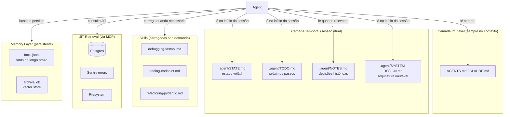

# Context engineering na prática — setup completo

> [!abstract] TL;DR
> Esta nota fecha a trilha com um exemplo end-to-end: como configurar context engineering num projeto real, do zero. Stack: `AGENTS.md` + `.agent/` (skills + state) + memory layer + JIT retrieval + guardrails. O alvo é um agente de coding em projeto Python — mas o padrão se traduz para qualquer domínio. Cada peça encaixa nas anteriores: fundamentos → camadas → retrieval → memória → guardrails. **Sem teoria — só checklist e arquivos**.

---

## O problema

Um time começa a usar Claude Code ou Cursor. A primeira semana é mágica — o agente entende o projeto, sugere código idiomático, evita armadilhas. Na segunda semana, o contexto começa a engordar. O agente mistura convenções novas com antigas. Na quarta semana, o agente está "esquecido" — não sabe o estado da última sessão, repete erros já resolvidos, ignora padrões do projeto.

O diagnóstico: o time não configurou context engineering. Deixou o agente trabalhar no modo padrão — sem instrução persistente, sem state tracking, sem skills reutilizáveis, sem retrieval sob demanda. O resultado é um agente poderoso operando às cegas.

A solução não é um prompt melhor. É uma **arquitetura** — um conjunto de artefatos que o agente sempre consulta, outros que carrega quando precisa, e um protocolo de atualização de estado que mantém a memória viva entre sessões.

---

## Arquitetura do sistema



O ponto central: cada camada serve uma janela temporal diferente. `AGENTS.md` é o que nunca muda. `STATE.md` é o que mudou nessa sessão. Skills são conhecimento especializado que não precisa estar sempre no contexto. MCP é acesso a sistemas externos sem indexação prévia. Memory é o que o agente aprende sobre usuários e decisões ao longo de semanas.

---

## O cenário

```
Projeto: API Python com FastAPI + Postgres
Time: 3 devs
Ferramenta principal: Claude Code (mas funciona com Cursor, Aider)
Modelo: Sonnet 4.6 com prompt caching
```

## Estrutura final

```
projeto/
├── AGENTS.md                    ← regras compartilhadas (simbólico para CLAUDE.md)
├── CLAUDE.md → AGENTS.md        ← symlink
├── .cursorrules                 ← deltas Cursor (se aplicável)
├── .agent/
│   ├── skills/
│   │   ├── debugging-fastapi.md
│   │   ├── refactoring-pydantic.md
│   │   └── adding-endpoint.md
│   ├── NOTES.md                 ← decisões e observações
│   ├── TODO.md                  ← próximos passos
│   ├── SYSTEM-DESIGN.md         ← arquitetura
│   ├── STATE.md                 ← estado da sessão (volátil, .gitignore)
│   └── DECISIONS.md             ← log de decisões importantes
├── .agent-memory/
│   ├── facts.jsonl              ← fatos persistidos (long-term)
│   └── archival.db              ← vector store de eventos
├── src/
├── tests/
└── .mcp/
    └── servers.json             ← MCP servers configurados (postgres, sentry, etc.)
```

---

## Passo 1 — AGENTS.md (camada imutável)

Ver [[11 - Skills e instructions como contexto]] para spec completa.

```markdown
# Projeto Pagamentos API

API REST para processar pagamentos. Stack: FastAPI + Postgres + Redis.

## Build & Test
- Install: `uv sync`
- Test: `pytest`
- Lint: `ruff check`
- Type check: `mypy src/`

## Conventions
- Pydantic v2 para todos os schemas
- Async/await em endpoints; sync em utility code
- Sempre type hints; sempre docstrings em funções públicas

## Structure
- `src/api/` — endpoints FastAPI
- `src/services/` — lógica de negócio
- `src/repositories/` — DB access (SQLAlchemy)
- `src/schemas/` — Pydantic models

## Security
- Nunca log de PII (CPF, cartão); usar redact_pii() de src/utils
- Validação de input em camada de schema, não service
- Secrets via env, nunca em código

## Workflow
1. Antes de editar: ler .agent/STATE.md e TODO.md
2. Após mudança significativa: atualizar .agent/NOTES.md
3. Antes de commit: rodar pytest + ruff
```

> [!tip] Symlink Claude Code
> ```bash
> ln -s AGENTS.md CLAUDE.md
> ```

O symlink garante que `CLAUDE.md` (carregado automaticamente pelo Claude Code) e `AGENTS.md` (carregado por outras ferramentas) são sempre o mesmo arquivo — uma cópia só, nunca espelhar (→ [[11 - Skills e instructions como contexto]]).

---

## Passo 2 — Skills (camada de conhecimento reusável)

Cada skill resolve **um padrão recorrente**:

```markdown
# .agent/skills/adding-endpoint.md

## When to use
Quando o usuário pedir "adicione endpoint para X".

## Pattern
1. Criar schema em src/schemas/{feature}.py (Pydantic)
2. Criar service em src/services/{feature}.py
3. Criar repository se for novo recurso
4. Criar router em src/api/{feature}.py
5. Adicionar testes em tests/api/test_{feature}.py
6. Atualizar src/api/__init__.py para incluir router

## Example
Ver src/api/payments.py como template.

## Checklist
- [ ] Schema com validators (não só types)
- [ ] Service tem teste unitário
- [ ] Endpoint tem teste de integração
- [ ] Tipos estritos (no `Any`)
```

Skills carregam **só quando o agente decide que é relevante** — não inflam o contexto base. Um projeto típico tem 5-10 skills; se uma skill nunca é carregada, é candidata a remoção.

---

## Passo 3 — Structured state (camada temporal)

Ver [[10 - Structured state tracking]].

```markdown
# .agent/STATE.md (volátil, gitignored)

## Tarefa atual
Adicionar endpoint POST /refunds

## Arquivos modificados
- src/schemas/refunds.py (criado, OK)
- src/services/refunds.py (em progresso)

## Próximo step
Implementar refund_payment() em service

## Bloqueios
Nenhum
```

```markdown
# .agent/TODO.md

## In progress
- [ ] Endpoint POST /refunds (responsável: agent + Maria)

## Up next
- [ ] Webhook de retry em pagamentos falhados
- [ ] Migração de coluna currency
```

`STATE.md` é substituído a cada passo significativo — não é um log, é um snapshot do momento atual. `NOTES.md` é append-only com data — é o log. A distinção é importante: `STATE.md` no `.gitignore`; `NOTES.md` versionado.

---

## Passo 4 — Memory layer (camada persistente)

Para projeto solo, arquivos `.md` bastam (ver [[10 - Structured state tracking]]).

Para projeto com vários usuários ou sessões cruzadas, integrar Letta/Mem0/Zep:

```python
# .agent-memory/setup.py
from mem0 import Memory

memory = Memory.from_config({
    "vector_store": {"provider": "qdrant", "config": {...}},
    "llm": {"provider": "anthropic", "config": {"model": "claude-sonnet-4-6"}},
})

# Durante sessão, agente chama:
# memory.add("Maria prefere logs em INGLÊS", user_id="maria")
# memory.search("preferência de logs", user_id="maria")
```

---

## Passo 5 — JIT retrieval via MCP

Ver [[06 - Dynamic retrieval beyond RAG]] e [[15 - Técnicas de prompting — zero-shot, few-shot, CoT, ToT]].

```json
// .mcp/servers.json
{
  "mcpServers": {
    "postgres": {
      "command": "npx",
      "args": ["-y", "@modelcontextprotocol/server-postgres", "postgresql://..."]
    },
    "sentry": {
      "command": "npx",
      "args": ["-y", "@modelcontextprotocol/server-sentry"],
      "env": {"SENTRY_TOKEN": "..."}
    },
    "filesystem": {
      "command": "npx",
      "args": ["-y", "@modelcontextprotocol/server-filesystem", "."]
    }
  }
}
```

Resultado: agente pode consultar logs, schema do DB, errors em produção, **sem indexar**. O MCP transforma acesso a sistemas externos em JIT retrieval — sem pipeline de embeddings, sem sincronização, sem stale data de índice.

---

## Passo 6 — Pipeline de montagem

Ver [[04 - Context pipelines — montagem dinâmica]].

Em Claude Code / Cursor, a pipeline é parcialmente automática (simbólico carrega `AGENTS.md`, glob/grep são tools nativas). Em código próprio:

```python
def build_context(turn):
    return [
        load_agents_md(turn.cwd),                     # imutável
        relevant_skills(turn.intent, top_k=2),         # skills sob demanda
        load_state_md(),                               # temporal
        load_relevant_memories(turn.user_id, top_k=5), # persistente
        compact_history(turn.history, budget=50_000),  # temporal compactado
        turn.tool_definitions,                         # cacheável
        turn.user_message,                             # transiente
    ]
```

---

## Passo 7 — Guardrails determinísticos

Ver [[12 - Guardrails determinísticos]].

```python
# Pre-LLM
def pre_llm_guardrail(user_input):
    if contains_pii(user_input):
        return blocked("PII detected")
    if len(user_input) > 50_000:
        return blocked("Input too long")
    return ok()

# Post-LLM
def post_llm_guardrail(model_output):
    if not match_schema(model_output, expected_schema):
        return retry_with_correction()
    if requires_human_approval(model_output):
        return route_to_human()
    return ok()
```

---

## Checklist de implementação (por ordem)

> [!example] Roteiro de adoção
>
> ### Semana 1 — Fundamentos
> - [ ] Criar `AGENTS.md` (camada imutável) com 80% das regras
> - [ ] Symlink CLAUDE.md → AGENTS.md (se usa Claude Code)
> - [ ] Configurar prompt caching
>
> ### Semana 2 — Estado
> - [ ] Criar `.agent/SYSTEM-DESIGN.md`, `NOTES.md`, `TODO.md`
> - [ ] Adicionar `STATE.md` ao `.gitignore`
> - [ ] Adicionar workflow de leitura desses arquivos no AGENTS.md
>
> ### Semana 3 — Retrieval
> - [ ] Configurar 2-3 MCP servers relevantes
> - [ ] Validar que agente usa JIT em vez de pedir paste
>
> ### Semana 4 — Skills
> - [ ] Criar 3-5 skills para padrões mais recorrentes
> - [ ] Estabelecer convenção de naming
>
> ### Mês 2 — Memória persistente (se necessário)
> - [ ] Avaliar se markdown basta ou precisa Mem0/Letta
> - [ ] Integrar memory layer
>
> ### Mês 3 — Governança
> - [ ] Adicionar pre-LLM e post-LLM guardrails básicos
> - [ ] Definir métricas (entropy, hit rate, latência)
> - [ ] Versionar mudanças em AGENTS.md como PRs

---

## O que medir

| Métrica | Antes | Depois esperado |
|---|---|---|
| Tokens médios por turno | Baseline | -40% a -60% |
| Sessões que precisam restart | Baseline | -70% |
| % de PRs gerados que precisam refactor | Baseline | -30% |
| Cache hit rate | <20% | >70% |
| Tempo médio de tarefa | Baseline | -25% (após 3 meses de uso) |

---

## Casos práticos

### Caso 1 — Onboarding de novo dev no projeto

Maria entra no time. Sem context engineering, ela passa 2 dias descobrindo convenções perguntando para colegas. Com context engineering:

1. Clone do repositório — `AGENTS.md` já explica conventions, build commands, estrutura
2. Claude Code lê `AGENTS.md` automaticamente — Maria pede "crie um endpoint para listar usuários" e o agente segue o padrão do projeto sem instrução adicional
3. `.agent/skills/adding-endpoint.md` é carregada automaticamente quando relevante
4. Maria não precisa descobrir o padrão — o agente já sabe

Resultado: onboarding de 2 dias para 4 horas.

### Caso 2 — Sessão longa com múltiplas tarefas

Um agente trabalha em um refactor de 3 dias. Sem state tracking:
- Dia 2: o agente "esquece" decisões do dia 1 quando a sessão é reiniciada
- O dev precisa re-explicar o contexto a cada sessão

Com structured state:
- `STATE.md` é atualizado ao final de cada trabalho significativo
- `NOTES.md` registra decisões com data
- Início de cada sessão: agente lê `STATE.md` → continua de onde parou
- Resultado: sem regressões, sem repetição de contexto verbal

### Caso 3 — Debug de erro em produção

Erro no Sentry: `PaymentService.refund() retorna 200 quando banco responde 503`.

Sem JIT retrieval: dev copia stack trace, cola no chat, espera o agente analisar.

Com MCP configurado:
- Agente acessa Sentry diretamente via MCP server
- Acessa o schema do Postgres para ver estado da coluna `refund_status`
- Lê o código do `PaymentService` via filesystem MCP
- Propõe fix sem que o dev precise copiar nada

Tempo de diagnóstico: 15 min → 3 min.

### Caso 4 — Context engineering em API própria (não CLI)

Um produto que usa a API da Anthropic diretamente implementa o mesmo padrão em código:

```python
class ContextEngineeringPipeline:
    def build_turn_context(self, user_id: str, intent: str, history: list) -> list:
        layers = []
        # Imutável — cacheable
        layers.append({"role": "system", "content": self.agents_md})
        # Skills — seletiva
        if skill := self.skill_router.select(intent):
            layers.append({"role": "user", "content": f"<skill>{skill}</skill>"})
        # Persistente — top-k memória
        memories = self.memory.search(intent, user_id=user_id, limit=3)
        if memories:
            layers.append({"role": "user", "content": format_memories(memories)})
        # Temporal compactado
        layers.extend(self.compact_history(history, budget=40_000))
        return layers
```

O resultado é um sistema que escala sem aumentar custo de forma linear — porque o contexto é gerenciado, não acumulado.

---

## Estado da arte — junho de 2026

**AGENTS.md como padrão de mercado** A spec `AGENTS.md` sob a Linux Foundation está em adoção rápida — a maioria das ferramentas de AI coding (Claude Code, Cursor, Aider, Copilot) suporta ou está implementando suporte nativo em 2026. Times que adotam `AGENTS.md` em vez de arquivos tool-específicos ganham portabilidade entre ferramentas.

**Context engineering teams em empresas grandes** Em 2025-2026, grandes empresas como Shopify, Stripe e Linear formalizaram "context engineering" como responsabilidade de um time dedicado — não dos devs individuais. Esses times são responsáveis por manter `AGENTS.md`, skills, e medir context quality (→ [[13 - Entropia e qualidade de contexto]]) como KPI de produto.

**MCP como infraestrutura padrão** O Model Context Protocol deixou de ser experimental em 2026 — virou infraestrutura. Times de plataforma mantêm MCP servers como APIs internas, e os agentes os consomem sem configuração adicional por projeto. A expectativa é que, até 2027, JIT retrieval via MCP seja o padrão dominante substituindo pipelines de RAG offline.

**Skills como tooling de primeira classe** Ferramentas como Claude Code adicionaram UI para gerenciar skills — listar, ativar, testar. Não é mais só um arquivo markdown num diretório; é um artefato gerenciado com versão, teste e analytics de uso (quantas vezes foi carregada, com que accuracy).

---

## Armadilhas comuns

> [!warning] AGENTS.md vira enciclopédia
> Times adicionam regras ao `AGENTS.md` sem nunca remover. Em 6 meses, o arquivo tem 500 linhas — metade contradizendo a outra metade, e o agente segue regras antigas que deveriam ter sido removidas. A regra: toda regra em `AGENTS.md` deve ter um "owner" e uma data de revisão. Regras não usadas em 3 meses são candidatas a remoção.

> [!warning] Skills nunca carregadas = contexto morto
> Se uma skill existe mas nunca é carregada pelo agente (porque o agente não reconhece quando é relevante), ela é contexto morto. Skills precisam de "when to use" claro e específico. Skills com trigger vago ("use quando trabalhar com APIs") raramente são carregadas; skills com trigger específico ("use quando adicionar endpoint POST") funcionam.

> [!warning] STATE.md como log em vez de snapshot
> O erro clássico: desenvolver o hábito de adicionar ao `STATE.md` em vez de substituir. Em 3 sessões, o arquivo tem 200 linhas de histórico e o agente não sabe qual é o estado atual. `STATE.md` = substituição a cada passo. `NOTES.md` = append com data. Confundir os dois quebra o pattern inteiro.

> [!warning] Memory layer sem TTL
> Mem0 e Zep persistem memórias indefinidamente por padrão. Sem TTL, o agente vai usar memórias de 18 meses atrás que já não são verdadeiras. Para domínios mutáveis (preferências, padrões de projeto), configurar TTL explícito (30-90 dias) e validação periódica.

---

## Quando expandir

| Sinal | Próximo passo |
|---|---|
| Skills viram redundantes | Refatorar / consolidar |
| `NOTES.md` fica enorme | Compactação periódica + arquivamento |
| Múltiplas pessoas usam o mesmo agente | Integrar memory layer compartilhada |
| Compliance pesa | Adicionar audit log + guardrails formais |
| Custos crescem desproporcionalmente | Auditoria de consumo + context quality review |

---

## Como explicar em inglês

**Descrevendo o setup:**
- "We treat the agent's context as an architecture, not a prompt. `AGENTS.md` is the static layer — always loaded. Skills are loaded on demand. State files bridge sessions. MCP gives the agent live access to systems without prior indexing"
- "The key insight is that context layers have different time horizons: instructions don't change, session state resets daily, memories persist for weeks. Managing each layer separately gives you control"

**Em conversas técnicas:**
- "The agent's 'memory' between sessions is `STATE.md` — the agent reads it at the start and rewrites it at the end. It's durable state without a database"
- "We didn't build a RAG pipeline for the docs — we just set up a filesystem MCP server. The agent reads files JIT instead of from a prebuilt index"
- "Context quality review is like a code review for the `AGENTS.md` — we diff it before merging changes, run the gold test suite, check that accuracy didn't drop"

### Tabela PT ↔ EN

| Português | Inglês |
|---|---|
| Camada imutável | Static/immutable layer |
| Camada temporal | Session layer / temporal layer |
| Rastreamento de estado | State tracking |
| Skill carregada sob demanda | On-demand skill loading |
| Memória persistente | Persistent memory |
| Retrieval JIT | JIT retrieval / just-in-time retrieval |
| Guardrail determinístico | Deterministic guardrail |
| Prompt caching | Prompt caching |
| Arquivo de instrução | Instruction file |
| Resumo de handoff | Handoff summary |
| Orçamento de tokens | Token budget |
| Simbólico / symlink | Symlink |

---

> [!tip] Assista: Building Production AI Agents with Context Engineering
> **Canal:** Anthropic Engineering | **Idioma:** EN
>
> Apresentação técnica mostrando como times de produto constroem stacks de context engineering em produção — com exemplos reais de `AGENTS.md`, pipelines de montagem de contexto, e métricas de qualidade. O padrão de camadas (imutável/temporal/persistente) é demonstrado com código real.
>
> 📖 [Buscar: "Anthropic building production AI agents context engineering 2025"](https://www.anthropic.com/research)

---

## O que vem a seguir

Esta nota completou a sequência de context engineering do ponto de vista de **arquitetura e implementação**. As notas seguintes tratam das **técnicas de prompting** que se encaixam nessa arquitetura:

- **[[15 - Técnicas de prompting — zero-shot, few-shot, CoT, ToT]]** — as técnicas de prompting que você coloca dentro das skills e do `AGENTS.md`; few-shot examples são contexto de alta entropia quando bem escolhidos
- **[[16 - Agent skills marketplace e SKILL.md]]** — como o ecossistema de skills evolui; skills como produto reutilizável compartilhado entre times

A lógica da trilha: você constrói a arquitetura (notas 1-14), depois cuida das técnicas que vivem dentro dessa arquitetura (notas 15-16).

---

## Veja também

- [[01 - De prompt engineering a context engineering]]
- [[04 - Context pipelines — montagem dinâmica]]
- [[10 - Structured state tracking]]
- [[11 - Skills e instructions como contexto]]
- [[12 - Guardrails determinísticos]]
- [[13 - Entropia e qualidade de contexto]]

---

## Referências

- **Anthropic** — *Best Practices for Claude Code* (2026).
- **AGENTS.md spec** — *agents.md* (2026, Linux Foundation). Spec aberta para instruction files cross-tool.
- **Anthropic** — *Effective context engineering for AI agents* (2025).
- **Augment Code** — *How to Build Your AGENTS.md* (2026). Guia prático com exemplos de projetos reais.
- **Mem0** — *Persistent Memory for AI Agents* (2025). Documentação da memory layer.
