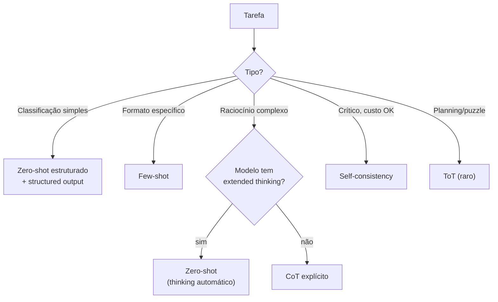

# Técnicas de prompting — zero-shot, few-shot, CoT, ToT

> [!abstract] TL;DR
> Prompt engineering virou subset de context engineering em 2026, mas as **técnicas básicas continuam fundamentais**: **zero-shot** (instrução direta sem exemplos), **few-shot** (instrução + 2-5 exemplos), **chain-of-thought** (CoT — peça raciocínio passo-a-passo), **self-consistency** (gera N respostas, vota), **tree of thoughts** (ToT — explora múltiplos caminhos), **role prompting** (você é X). Cada técnica tem caso de uso específico. **Default sensato em 2026:** zero-shot estruturado para tarefas simples; few-shot quando formato importa; CoT quando precisa raciocínio complexo (em modelos sem extended thinking). Técnicas não são alternativas — são peças que se combinam, especialmente dentro de skills (→ [[16 - Agent skills marketplace e SKILL.md]]).

---

## O problema

Você pede para um LLM classificar um ticket de suporte. O modelo retorna "bug" — sem explicação, sem confiança, e às vezes errado. Você experimenta adicionar "seja mais cuidadoso" — não muda nada. Adiciona "pense antes de responder" — a accuracy sobe 15%. Por quê?

O que você mudou não foi o que o modelo *sabe* — mudou a *forma* como ele processa o problema. Cada técnica de prompting é um mecanismo diferente de eliciar o raciocínio do modelo: exemplos mostram o padrão que você quer, CoT força linearização do raciocínio, self-consistency reduz variância. Sem entender o mecanismo, você está calibrando às cegas.

A pergunta certa não é "qual técnica é melhor" — é "qual mecanismo resolve a minha falha específica de accuracy?"

---

## Zero-shot — direto ao ponto

```
Classifique este ticket como bug, feature ou question:
"App crashou ao abrir."
```

Zero-shot é a linha de base. Não injeta exemplos — confia que o modelo já tem o padrão internalizado do pré-treinamento. Com modelos fortes (Sonnet 4.6, GPT-5, Gemini 2.5), zero-shot com descrição clara resolve a maioria das tarefas comuns.

**Quando funciona:** tarefa comum no domínio do modelo, descrição clara do output esperado.

**Quando falha:** tarefa nicho onde o modelo não tem calibração suficiente; formato específico não-padrão; output que requer conhecimento que o modelo não tem.

A adição mais simples que frequentemente melhora zero-shot: **descrever o formato de output**. Em vez de "classifique este ticket", "classifique este ticket. Retorne só uma palavra: bug, feature ou question." A especificidade do formato reduz variância sem custo de tokens.

---

## Few-shot — exemplos no prompt

```
Classifique tickets:

"App crashou ao abrir." → bug
"Pode adicionar dark mode?" → feature
"Como faço backup?" → question

Classifique:
"Não consigo logar com Google" →
```

Few-shot injeta exemplos que demonstram o padrão sem explicar o mecanismo. O modelo aprende por analogia — não precisa de definição, aprende da demonstração. É alto-entropia: cada exemplo carrega muito sinal por token (ver → [[13 - Entropia e qualidade de contexto]]).

**Regras práticas:**

- **2-5 exemplos** é o sweet spot — mais do que 5 raramente ajuda e aumenta custo
- **Diversidade > quantidade** — 3 exemplos de classes diferentes valem mais que 5 exemplos da mesma classe
- **Ordem importa** — o exemplo mais próximo da query tem mais peso na distribuição; cuide do último exemplo
- **Custo**: tokens extras em todo prompt → caro em volume; em produção, balancear gain de accuracy vs custo de tokens

**O erro mais comum na prática: few-shot homogêneo.**

```
Classifique tickets:

"App crashou ao abrir." → bug
"Login trava na tela de carregamento." → bug
"Erro 500 ao salvar o perfil." → bug

Classifique:
"Pode adicionar modo escuro?" →
```

→ Saída do modelo: `bug` (**errado** — devia ser `feature`)

Os 3 exemplos são da mesma classe. O modelo não aprendeu "o que distingue bug de feature de question" — aprendeu "o padrão observado nesta demonstração é bug", e generaliza a query nova para a única classe que viu. Corrigindo com exemplos diversificados:

```
Classifique tickets:

"App crashou ao abrir." → bug
"Pode adicionar dark mode?" → feature
"Como faço backup?" → question

Classifique:
"Pode adicionar modo escuro?" →
```

→ Saída do modelo: `feature` (correto)

A diferença não é a quantidade de exemplos — é a cobertura das classes que a query pode assumir. Três exemplos homogêneos carregam menos sinal útil que três exemplos diversos, porque cada exemplo adicional da mesma classe é quase-redundante com o anterior (ver → [[13 - Entropia e qualidade de contexto]]).

A situação em que few-shot é claramente superior: formatos de output não-padrão. Se o modelo precisa retornar um JSON com estrutura específica que não é padrão de mercado, 3 exemplos do formato são mais eficientes que 500 tokens de descrição verbal.

---

## Chain-of-Thought (CoT) — pense antes de responder

```
Pergunta: João tem 5 maçãs. Comeu 2 e comprou mais 3. Quantas tem agora?

Pense passo a passo antes de responder.
```

O modelo gera raciocínio explícito antes da resposta. A descoberta de Wei et al. (2022): forçar essa linearização melhora accuracy em 20-50% em problemas matemáticos e de raciocínio lógico. Por quê? O modelo está gerando tokens autoregressivamente — cada token depende dos anteriores. Ao forçar o raciocínio primeiro, você cria "scaffolding" que guia os tokens da resposta final.

**Variantes:**

- **Zero-shot CoT:** "Let's think step by step" (Kojima et al., 2022 — descoberta acidental que CoT funciona sem exemplos)
- **Few-shot CoT:** mostra exemplos com raciocínio explícito completo — mais poderoso, mais caro
- **Auto-CoT:** modelo decide internamente quando usar raciocínio estendido

> [!tip] CoT em 2026
> Modelos com **extended thinking** (Claude 4+, o1, Gemini 2.5) fazem CoT internamente, sem você pedir. O reasoning não aparece no output. É mais barato, mais consistente, e produz raciocínio mais profundo que CoT via prompt. **CoT explícito ainda é útil** em modelos sem extended thinking ou quando você precisa do raciocínio no output para auditoria.

---

## Self-consistency — vote em N respostas

```python
def self_consistent(prompt, n=5):
    responses = [llm.generate(prompt, temp=0.7) for _ in range(n)]
    return majority_vote(responses)
```

Gera N respostas com temperatura alta, escolhe a mais frequente. A intuição: em temperatura alta, o modelo explora variações de raciocínio. Se a maioria converge para a mesma resposta, é o sinal mais forte que é a resposta correta. Wang et al. (2022) reportam +5-15% em benchmarks de raciocínio matemático.

**Quando vale:** tarefa factual/objetiva onde há uma resposta correta; custo ×N é aceitável no orçamento.

**Quando não vale:** tarefa criativa (não existe "majority" em estilos de escrita); tarefas de latência crítica (N chamadas sequenciais); casos onde o modelo tem viés sistemático (N cópias do mesmo viés não ajudam).

---

## Tree of Thoughts (ToT)

O modelo explora múltiplos caminhos de raciocínio em paralelo, avaliando cada branch antes de decidir qual continuar:

```
Branch A: "Se eu tentar X..."     → avalia → score 0.7
Branch B: "Mas se eu tentar Y..." → avalia → score 0.4
Best so far: Branch A
Continue A → "Sub-branch A1..." → avalia → ...
```

Yao et al. (2023) reportam resultados dramáticos em problemas de planning e puzzles (Game of 24, miniature crossword). O mecanismo: algoritmo de busca (BFS ou DFS) sobre o espaço de raciocínio, usando o LLM como tanto o explorador quanto o avaliador de estados.

**Custo alto** (10-20 chamadas por problema). **Em produção, raro** — o custo raramente justifica o ganho versus CoT simples exceto em problemas genuinamente de planning com espaço de busca explícito.

---

## Role prompting

```
Você é um senior backend engineer reviewing Java code.
Foque em: concurrency bugs, resource leaks, security issues.
```

Define **persona + domínio de atenção**. O modelo "recalibra" seu prior — não sobre o que ele *sabe*, mas sobre o que ele *enfatiza* e o *tom* que usa. A instrução de role informa: qual vocabulário usar, que tipo de detalhe é relevante, e que nível de rigor é esperado.

**Padrões funcionais:**

- `"You are an expert {domain} {role}"` — mais comum, calibra domínio e expertise
- `"Act as a {role} for {audience}"` — calibra *para quem* além de quem você é
- `"You are a {role} reviewing {artifact}"` — específico para tarefas de review

Funciona bem em todos os modelos. Combina com todas as outras técnicas — role + CoT, role + few-shot, role + structured output. É a peça mais "gratuita" do toolkit: custo baixíssimo, melhora consistente.

---

## Structured output — formato como contrato

```
Responda em JSON:
{
  "category": "bug" | "feature" | "question",
  "confidence": 0-1,
  "reasoning": "..."
}
```

Em 2026, prefira **structured outputs nativos** em vez de descrever o JSON no prompt:

```python
# Anthropic / OpenAI structured outputs
response = client.messages.create(
    model="claude-sonnet-4-6",
    tools=[{
        "name": "classify_ticket",
        "input_schema": {
            "type": "object",
            "properties": {
                "category": {"enum": ["bug", "feature", "question"]},
                "confidence": {"type": "number", "minimum": 0, "maximum": 1},
                "reasoning": {"type": "string"}
            }
        }
    }]
)
```

A diferença: descrição verbal do JSON tem ~10% de taxa de formato inválido mesmo em bons modelos. Structured outputs nativos têm taxa de formato inválido de 0% — é garantia hard via sampling constrained. Isso elimina a necessidade de retry-on-parse-error em produção.

---

## Heurística para escolher



O fluxo captura a decisão mais frequente. Mas não é mutuamente exclusivo: role prompting **sempre** pode ser combinado com qualquer folha da árvore, e structured output vai junto com zero-shot/few-shot em >80% dos casos de produção.

---

## Comparação rápida

| Técnica | Quando usar | Custo | Ganho típico |
|---|---|---|---|
| **Zero-shot** | Tarefa comum, modelo forte | $ | Baseline |
| **Few-shot** | Formato/estilo nicho | $$ | +5-15% |
| **CoT** | Raciocínio complexo (sem thinking) | $$ | +10-30% |
| **Self-consistency** | Resposta objetiva, custo OK | $$$$$ | +5-15% |
| **ToT** | Planning/puzzles | $$$$$$$$ | Variável |
| **Role prompting** | Sempre (combina com tudo) | $ | Modulação útil |
| **Structured output** | JSON, classificação | $ | Garantia de formato |

---

## System prompt — onde a mágica acontece

O system prompt é a alavanca **mais poderosa** de prompting porque é persistente — todos os turnos da sessão são influenciados por ele. Tem peso desproporcional na atenção do modelo porque fica no início do contexto.

```
[Role + persona]
You are a senior backend engineer.

[Behavior rules]
- Focus on: concurrency bugs, security issues
- Be direct; skip pleasantries
- Cite line numbers in feedback

[Output format]
- Markdown with ## sections
- One issue per section
- Confidence rating

[Constraints]
- If code is good, say so briefly
- Don't suggest stylistic changes unless asked
```

**Boas práticas:**

- **Específico sobre formato** > vago — "retorne uma lista markdown com 3-5 bullets" é melhor que "seja conciso"
- **Listas** > parágrafos — mais fácil de seguir e verificar para o modelo
- **Diga o que fazer** + **o que NÃO fazer** — as restrições negativas são frequentemente mais eficazes que as positivas
- **Restrições críticas no início e no fim** — atenção favorece bordas do contexto; informação crucial no meio do system prompt tem maior chance de ser "esquecida"

---

## Skills — empacotando técnicas

Toda técnica acima é uma instrução escrita no prompt. O problema surge quando a **mesma** combinação — role, few-shot, CoT, formato de output, restrições — se repete em toda sessão. Copy-paste a cada vez é prompting **ad-hoc**: funciona, mas não escala e tem drift entre usos.

Uma **skill** é essa combinação **formalizada**: instruções + exemplos + formato + ferramentas, empacotados numa unidade versionada que o agente carrega **sob demanda**. É prompting estruturado e reutilizável — um prompt template com discovery e versionamento.

| | Prompt ad-hoc | Skill formalizada |
|---|---|---|
| **Onde vive** | Digitado na hora / colado no system prompt | Arquivo `SKILL.md` versionado |
| **Reúso** | Copy-paste | Carregada por nome, cross-project |
| **O que empacota** | Uma técnica isolada | Role + few-shot + CoT + output format juntos |
| **Quando entra no contexto** | Sempre que você cola | Só quando a tarefa ativa (lazy) |

> [!tip] A skill é o "como", as técnicas são as "peças"
> Uma skill `code-review-security` não inventa nada novo: ela embala **role prompting** ("você é um auditor de segurança"), **few-shot** (exemplos de findings), e um **structured output** (formato do relatório) numa receita só. Dominar as técnicas desta nota é pré-requisito para escrever boas skills.

**Quando formalizar:**

- **Ad-hoc** — uso único ou exploratório. Não vale formalizar.
- **System prompt** — a regra vale para **toda** interação daquela sessão/persona (tom, formato padrão). Persistente, mas preso ao projeto.
- **Skill** — o padrão é uma **tarefa específica e recorrente**, reutilizável entre projetos, carregada só quando relevante.

---

## Casos práticos

### Caso 1 — Zero-shot vs few-shot em classificação

Um time de suporte tem 10K tickets por mês para classificar. Zero-shot com prompt estruturado → 87% de accuracy. Few-shot com 5 exemplos → 94% de accuracy. O ganho de 7% em 10K tickets significa 700 tickets classificados corretamente por mês. O custo dos 5 exemplos: +~150 tokens por query × 10K = 1.5M tokens extras. Trade-off claro — calculável.

### Caso 2 — CoT em auditoria de contrato

Um agente de auditoria contratual precisa identificar cláusulas problemáticas em contratos de 50 páginas. Zero-shot: accuracy 62% (model "pula" raciocínio e responde por heurísticas). Zero-shot CoT com "analise cada cláusula passo a passo, identifique o risco, depois julgue a severidade": accuracy 81%. Few-shot CoT com 3 exemplos de análise completa: accuracy 89%.

A pergunta que CoT responde: "por que o modelo errava?" — porque estava fazendo pattern matching superficial. Forçar o raciocínio linear fez o modelo realmente processar o contrato em vez de "lembrar" de contratos similares.

### Caso 3 — Self-consistency em resposta crítica de saúde

Uma plataforma de saúde usa LLM para triagem de sintomas. Acerto incorreto de "procure emergência" em casos leves ou "aguarde em casa" em casos graves tem consequências sérias. Self-consistency com n=7 (7 chamadas, voto majoritário): o sistema não usa a resposta a menos que ≥5/7 concordem. Quando há divergência (< 5/7), roteia para profissional humano automaticamente. A combinação elimina os erros de alta confiança que eram o problema principal.

### Caso 4 — Skill de code review combinando três técnicas

```markdown
# .agent/skills/security-review.md

## When to use
Quando revisar código para vulnerabilidades de segurança.

## Role
Você é um security engineer sênior com foco em OWASP Top 10.

## Examples (few-shot)
Input: `query = "SELECT * FROM users WHERE id = " + user_id`
Output: {"severity": "critical", "type": "SQL injection", "fix": "use parameterized queries"}

Input: `password = request.form.get('password')`
Output: {"severity": "high", "type": "missing hashing", "fix": "use bcrypt.hashpw() before storing"}

## Output format (structured)
{"severity": "critical|high|medium|low", "type": "string", "fix": "string"}

## Reasoning (CoT)
Antes de cada finding, pense: qual é o attack vector? Qual é o impacto? É exploitable?
```

Três técnicas em uma skill: role (auditor de segurança) + few-shot (exemplos de findings) + CoT implícito (instruções de raciocínio antes da resposta). Quando o agente carrega essa skill, ele resolve security reviews com estrutura consistente, sem precisar reescrever o prompt a cada vez.

---

## Estado da arte — junho de 2026

**Extended thinking como default** Em 2026, modelos como Claude 4 (claude-opus-4-8), o1, Gemini 2.5 Pro e Grok 3 têm extended thinking habilitado por padrão em tarefas complexas. O efeito prático: CoT explícito via prompt perdeu importância para tarefas de raciocínio — o modelo faz CoT internamente com qualidade superior. CoT explícito ainda vale quando você quer o raciocínio no output (auditoria, explicabilidade).

**Few-shot automático (in-context learning retrieval)** Uma tendência de 2025-2026: em vez de selecionar exemplos few-shot manualmente, sistemas automaticamente recuperam os exemplos mais similares à query atual de um banco de exemplos curados (retrieval-augmented few-shot). Os exemplos são sempre relevantes, e o banco pode ser atualizado sem reescrever prompts. Combina com → [[06 - Dynamic retrieval beyond RAG]].

**Structured outputs como expectativa padrão** Structured outputs nativos (tools, response_format com JSON Schema) são agora a expectativa de mercado para qualquer LLM em produção — não um diferencial. Times que ainda fazem regex-parsing de JSON gerado no prompt estão em débito técnico. Anthropic, OpenAI, Mistral e Gemini todos suportam structured outputs com zero-failure-rate de formato.

**Prompting virou skill engineering** A prática de "escrever bons prompts" está se profissionalizando: em 2026, times de AI produto têm "prompt engineers" que mantêm libraries de skills, escrevem testes de accuracy para cada prompt, e versionam mudanças com métricas. O prompting ad-hoc individual está sendo substituído por skills governadas como código.

---

## Armadilhas comuns

> [!warning] Few-shot com exemplos homogêneos
> Três exemplos da mesma classe não calibram o modelo para as outras — ele aprende que "o padrão é essa classe". Few-shot precisa de diversidade real: um exemplo de cada classe principal, variando dificuldade e formulação. O erro mais comum: copiar os 3 exemplos "mais fáceis" do seu dataset porque são os mais óbvios, e o modelo never vê exemplos de borda.

> [!warning] CoT em tarefas simples
> "Pense passo a passo" numa classificação trivial não melhora accuracy — aumenta tokens e latência sem ganho. CoT tem custo real: mais tokens de output (= mais dinheiro), mais latência (= pior UX). Reserve CoT para tarefas de raciocínio genuinamente complexo. Para classificação com zero-shot funcional, CoT é premature optimization.

> [!warning] Self-consistency em tarefa criativa
> Majority vote não faz sentido quando não existe "resposta mais correta". Em geração de texto criativo, código com múltiplas soluções válidas, ou análises subjetivas, self-consistency com n=5 vai te dar a resposta mais segura e menos criativa, não a melhor. Use self-consistency só onde existe ground truth.

> [!warning] System prompt enciclopédico
> A tentação de colocar *tudo* no system prompt — 100 regras, 30 exemplos, 50 restrições — resulta em contexto de baixa entropia (→ [[13 - Entropia e qualidade de contexto]]): o modelo não sabe o que é prioritário, ignora regras em meio à lista, e a qualidade degrada. System prompts de >1K linhas consistentemente pioram performance em relação a prompts focados de 200-300 linhas. Prefira skills para conhecimento especializado.

---

## Métricas

| Métrica | Alvo |
|---|---|
| **Accuracy em golden set (zero-shot)** | Baseline |
| **Accuracy ganho com few-shot** | +5-15% |
| **% prompts com structured output** | >80% em produção |
| **Tokens médios por prompt (system + user)** | <2K para tarefas simples |
| **Eval coverage** (% prompts com golden set) | >80% |

---

## Como explicar em inglês

**Descrevendo as técnicas:**
- "Zero-shot works when the model already has the pattern from pretraining — you're eliciting, not teaching"
- "Few-shot is show-don't-tell: instead of describing the format you want, you demonstrate it. 3-5 examples are almost always enough"
- "CoT isn't magic — it forces the model to lay out its reasoning sequentially. Since each token depends on previous ones, explicit reasoning scaffolds the final answer"
- "With extended thinking models, you get CoT quality without explicit prompting — the model reasons internally at a depth no manual prompt can match"

**Em conversas técnicas:**
- "We're getting format errors on the JSON output — switch to native structured outputs, that's a 0% failure rate versus ~10% with prompt-described JSON"
- "The model is failing on edge cases that zero-shot misses — add few-shot with 3 diverse examples of the edge cases, not the easy ones"
- "Self-consistency with n=5 adds 5x cost — only worth it if the accuracy gain justifies it for this specific use case. What's the business cost of a wrong answer?"

### Tabela PT ↔ EN

| Português | Inglês |
|---|---|
| Zero-shot | Zero-shot |
| Few-shot | Few-shot |
| Cadeia de raciocínio | Chain-of-Thought (CoT) |
| Autoconsistência | Self-consistency |
| Árvore de pensamentos | Tree of Thoughts (ToT) |
| Prompting por papel | Role prompting |
| Saída estruturada | Structured output |
| Raciocínio estendido | Extended thinking |
| Prompt de sistema | System prompt |
| Exemplo de demonstração | Demonstration example |
| Temperatura | Temperature |
| Voto majoritário | Majority vote |

---

> [!tip] Leia: Prompt Engineering Guide — Anthropic
> **Fonte:** Anthropic Docs | **Idioma:** EN
>
> Documentação oficial das técnicas de prompting para Claude — com benchmarks de quando cada técnica ajuda, exemplos de código, e orientações específicas para modelos com extended thinking. Inclui a seção de "cuando não usar CoT" que é particularmente valiosa: a recomendação é explícita que CoT piora performance em classificações simples. Atualizada com Claude 4+.
>
> 📖 [Buscar: "Anthropic prompt engineering guide docs.anthropic.com"](https://docs.anthropic.com/en/docs/build-with-claude/prompt-engineering)

---

## O que vem a seguir

Técnicas de prompting são o **vocabulário** de context engineering — as peças básicas de construção. Mas o vocabulário sem estrutura é improvisação. A próxima nota formaliza esse vocabulário em **skills** — como empacotar essas técnicas em unidades reutilizáveis, versionadas e governadas:

- **[[16 - Agent skills marketplace e SKILL.md]]** — anatomia de uma skill, o arquivo `SKILL.md`, quando formalizar em skill vs AGENTS.md vs prompt inline, e como o ecossistema de skills evolui em 2026

O fluxo completo: você aprende as técnicas desta nota → as empacota em skills (nota 16) → as configura como parte do setup completo (→ [[14 - Context engineering na prática — setup completo]]).

---

## Veja também

- [[01 - De prompt engineering a context engineering]]
- [[02 - Os quatro pilares — prompt, context, intent, specification]]
- [[11 - Skills e instructions como contexto]]
- [[13 - Entropia e qualidade de contexto]]
- [[16 - Agent skills marketplace e SKILL.md]]
- [[Prompt Engineering]] — trilha dedicada às técnicas desta nota em profundidade (especificidade, roles, iteration patterns, anti-patterns)

---

## Referências

- **Wei et al.** — *Chain-of-Thought Prompting Elicits Reasoning in Large Language Models* (paper, 2022)
- **Kojima et al.** — *Large Language Models are Zero-Shot Reasoners* (CoT zero-shot, 2022)
- **Wang et al.** — *Self-Consistency Improves Chain of Thought Reasoning in Language Models* (2022)
- **Yao et al.** — *Tree of Thoughts: Deliberate Problem Solving with Large Language Models* (paper, 2023)
- **Anthropic** — *Prompt Engineering Guide* (docs.anthropic.com, atualizado 2026)
- **promptingguide.ai** — community guide com benchmarks atualizados
