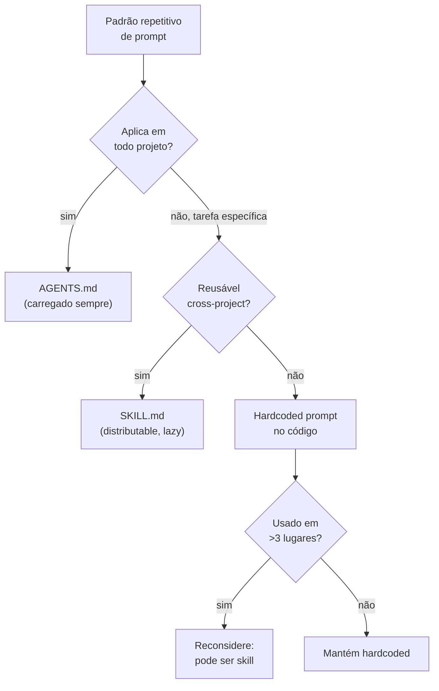

# Agent skills marketplace e SKILL.md

> [!abstract] TL;DR
> **Agent skills** evoluíram de "instruções no prompt" para **artefatos versionáveis e distribuíveis**. Em 2026, padrão de facto: arquivos `SKILL.md` com frontmatter (metadata) + conteúdo (instruções). Anthropic, OpenAI, Cursor convergiram em formato similar. Marketplace cresce — agentskills.io, skill.sh, repos de comunidade. Skills carregadas **sob demanda** (não inflando contexto base) — o agente decide quando usar baseado na tarefa. **Diferença chave para `AGENTS.md`:** skills são por tarefa específica, `AGENTS.md` é por projeto inteiro.

---

## O problema

Você escreve um prompt de security review que funciona bem. Você usa ele hoje, copiarei ele amanhã, e em uma semana você tem três variantes ligeiramente diferentes circulando no time — cada uma com refinamentos que as outras não têm. Em um mês, ninguém sabe qual é a versão "oficial".

Ou pior: você coloca esse prompt no sistema prompt do agente para "garantir que ele está sempre disponível". Resultado: 2K tokens de instruções de security review no contexto de *toda* interação — incluindo quando o usuário está só adicionando um endpoint simples ou formatando um README.

O problema não é o prompt em si — é a **falta de empacotamento**. Um bom prompt precisa de: local canônico para viver, versionamento, mecanismo de discovery, e carregamento seletivo (não inflar contexto base). Esses são os problemas que `SKILL.md` resolve.

---

## A diferença essencial

| | AGENTS.md / CLAUDE.md | SKILL.md (skill individual) |
|---|---|---|
| **Escopo** | Projeto inteiro | Tarefa específica |
| **Carregamento** | Sempre, no contexto base | Sob demanda |
| **Tamanho** | 1-3K tokens | 200 tokens a 5K cada |
| **Conteúdo** | Convenções, build, security | Como fazer X específico |
| **Reutilização** | Por projeto | Cross-project |

Regra simples: se a instrução é relevante **sempre** que o agente trabalha no projeto, vai em `AGENTS.md`. Se é relevante apenas para **tarefas específicas**, vai em `SKILL.md`. Misturar os dois derrota o propósito de ambos — instrução de tarefa no `AGENTS.md` infla contexto base; regra de projeto em `SKILL.md` nem sempre é carregada.

Detalhes em [[11 - Skills e instructions como contexto]].

---

## Anatomia de um SKILL.md

```markdown
---
name: code-review-security
description: Code review focado em vulnerabilidades de segurança
trigger: when user asks for security review or mentions security audit
tags: [security, code-review]
version: 1.2.0
author: anthropic
---

# Code Review — Security Focus

## When to use

Quando user pede:
- "review this PR for security"
- "audit code for vulnerabilities"
- "is this secure?"

## Process

1. Identifique todos os points de input externo
2. Para cada input, verifique:
   - Validation (Pydantic, Zod)
   - Sanitization
   - SQL/command/HTML injection
3. Verifique secrets em código
4. Verifique error messages que vazam info
5. Reporte findings com OWASP CWE numbers

## Output format

## Security Review

### Critical (must fix)
- [CWE-89: SQL Injection] line 42 em users.py
  Risk: ...
  Fix: use parameterized query

### Warning (should fix)
- ...
```

Frontmatter é parsed pelo client para discovery. O conteúdo markdown é injetado no contexto apenas quando a skill é ativada.

---

## Os 4 elementos canônicos

### 1. `name` — identificador único

```yaml
name: code-review-security  # kebab-case
```

Único no namespace do projeto ou marketplace. Referenciado pelo usuário ou pelo matching automático.

### 2. `description` — quando usar

```yaml
description: Code review focado em vulnerabilidades de segurança (OWASP, CWE)
```

Frase curta. **O cliente usa para decidir quando ativar** — matching contra a intenção do usuário. Uma description vaga ("review code") ativa errado; uma description específica ("security audit com OWASP") ativa no momento certo.

### 3. `trigger` (opcional) — match patterns

```yaml
trigger: when user asks for security review or mentions security audit
```

Hint para o cliente. Em alguns clients, é regex contra a mensagem do usuário. Em outros, é descrição em natural language que o LLM usa para matchear. O campo é opcional — sem ele, o agente usa `description` para decidir.

### 4. Conteúdo (markdown)

Instruções, exemplos, checklists — qualquer markdown. O agente recebe exatamente isso no contexto quando a skill é carregada. Isso significa: as técnicas de prompting da nota anterior (role, few-shot, CoT, structured output) entram aqui como conteúdo da skill.

---

## Loading patterns

### Eager loading (raro)

O cliente carrega **todas** as skills no contexto base. Útil quando há <5 skills pequenas e o custo de tokens não importa. Destrói o benefício de lazy loading se as skills forem grandes.

### Lazy loading (default)

O cliente lista skills por `name + description`, mas só carrega o **conteúdo completo** quando ativa.

```
[turno 1]
Usuário: "review this PR for security"
LLM (com metadata de skills): "Ativando skill code-review-security..."
[carrega conteúdo completo de SKILL.md]
LLM: [procede com as instruções da skill]
```

Vantagem: 50+ skills disponíveis sem inflar contexto. O agente "sabe" que as skills existem via metadata (~100 tokens por skill), mas só paga o custo completo quando relevante.

### Smart matching

O cliente usa LLM ou similarity matching para decidir qual skill ativar quando a intenção é ambígua:

```python
def match_skill(user_msg, skills):
    candidates = [s for s in skills if any(kw in user_msg.lower() for kw in s.keywords)]
    if not candidates:
        return None
    if len(candidates) == 1:
        return candidates[0]
    # Múltiplas candidatas — pede ao LLM para escolher
    return llm_choose(user_msg, candidates)
```

---

## Decisão: skill vs AGENTS.md vs hardcoded prompt



O critério mais importante: *frequência de reutilização*. Um prompt que você usa uma vez por mês em um projeto específico não justifica o overhead de criar e manter uma skill. Um prompt que toda a empresa usa em 5 projetos diferentes justifica não só uma skill, mas a publicação no marketplace.

---

## Como criar uma skill

### 1. Identifique padrão recorrente

> *"Toda vez que faço X, repito as mesmas instruções — e tenho drift entre sessões."*

Sinais de que precisa virar skill: você se pega copiando o mesmo bloco de texto em prompts diferentes, ou o agente faz X de formas ligeiramente diferentes a cada sessão.

### 2. Estrutura mínima

```
my-skill/
├── SKILL.md           # conteúdo principal
└── examples/          # opcional
    ├── input1.md
    └── output1.md
```

### 3. Escreva com as técnicas de prompting

Um bom `SKILL.md` empacota:
- **Role**: quem o agente "é" nessa tarefa
- **Few-shot**: exemplos de input/output
- **Process**: passos do CoT
- **Output format**: structured output esperado

### 4. Test

Em Claude Code: copia para `.claude/skills/my-skill/SKILL.md`. Inicia conversa que deveria ativar a skill. Observe se foi ativada corretamente e se o output tem a qualidade esperada. Iterate no `description` e `trigger` se o matching estiver errado.

### 5. Distribuir (opcional)

Push para repo público. Submit ao agentskills.io. Outros instalam via clone ou CLI:

```bash
# Hipotético
skill install code-review-security
# OU
cp -r code-review-security ~/.claude/skills/
```

---

## Skills por categoria (popular em 2026)

### Coding skills

- `code-review-security` — security audit com OWASP CWE
- `code-review-performance` — perf bottlenecks (profiling, O(n))
- `refactor-extract-method` — refactoring específico com diff
- `add-test-coverage` — gerar testes unitários e de integração
- `migrate-to-typescript` — JS → TS com migração incremental

### Workflow skills

- `create-pr-with-template` — PR formatado com summary, test plan, checklist
- `triage-bug-report` — categorizar issues por severity e effort
- `write-changelog` — generate from commits com semver

### Domain skills

- `glosa` (este Codex!) — fichamento de artigos e livros
- `medical-record-summary` — resumo clínico estruturado
- `legal-contract-review` — análise de cláusulas com risk rating

### Meta skills

- `find-similar-code` — busca de padrões similares no codebase
- `explain-architecture` — high-level overview de um módulo ou repo

---

## SKILL.md vs prompt template

| | SKILL.md | Prompt template |
|---|---|---|
| Carregado | Sob demanda | Manualmente |
| Versionado | Git, semver | Geralmente em código hardcoded |
| Distribuído | Marketplace | Privado / copy-paste |
| Acessado | Por nome via discovery | Por copy-paste ou ref no código |
| Triggered | Auto pelo client | Manual pelo usuário |

Skills são **prompt templates evoluídos** — com discovery, versioning e distribuição.

---

## O ecossistema (2026)

| Source | Tipo |
|---|---|
| **agentskills.io** | Marketplace web, browse + install |
| **skill.sh** | CLI tool, pip-style install |
| **github.com/anthropics/skills** | Anthropic official skills |
| **github.com/github/awesome-copilot/tree/main/skills** | Copilot skills curated |
| **Cursor Skills directory** | Built-in catalog com UI |
| **Antigravity Kit** | OSS skills collection |

---

## Versioning de skills

```yaml
---
name: code-review-security
version: 1.2.0
---
```

Semver:
- **Major** — breaking change na estrutura/output (users precisam adaptar)
- **Minor** — novo comportamento compatível (backward-compatible)
- **Patch** — fix interno sem mudança de interface

`CHANGELOG.md` no repo da skill documenta cada versão. Permite rollback se nova versão regride.

---

## Casos práticos

### Caso 1 — Skill de glosa para o Codex

O workflow de glosa deste vault é um exemplo real de skill formalizada. Em vez de copiar a instrução de glosa em cada sessão, existe uma skill `.claude/skills/glosa/SKILL.md` que:

- Define o **role**: pesquisador que faz fichamento crítico
- Tem **process**: 8 passos de leitura e síntese
- Define **output format**: structure específica do frontmatter e corpo
- Inclui **examples**: uma glosa de exemplo

A skill é carregada automaticamente quando o agente detecta "fazer glosa", "fichar artigo" ou similar. Sem ela, o agente teria que reinventar o formato a cada sessão.

### Caso 2 — Skill de security review cross-project

Um time de segurança de uma empresa de fintech tem 8 projetos em linguagens diferentes. Em vez de manter 8 cópias de instruções de security review (que invariavelmente divergem), eles criam uma skill `security-review-fintech`:

```markdown
---
name: security-review-fintech
version: 2.0.0
description: Security audit para sistemas financeiros — PCI DSS, OWASP Top 10, LGPD
---
```

A skill é instalada em todos os projetos via link simbólico para um repo central. Quando alguém atualiza a skill no repo central, todos os projetos recebem a atualização. Uma versão canônica, sem drift.

### Caso 3 — Skill marketplace para onboarding

Uma empresa usa skills como instrumento de **onboarding técnico**. O processo:

1. Novo dev faz clone do repositório
2. `AGENTS.md` já está lá com as convenções do projeto
3. Skills em `.claude/skills/` cobrem padrões específicos: `create-api-endpoint`, `write-migration`, `debug-celery-task`
4. Na primeira semana, o novo dev pede ajuda em tarefas — o agente carrega a skill relevante e executa com o padrão do time

Resultado: sem "regras não documentadas" que o novo dev descobre após errar. As skills documentam o conhecimento tácito do time de forma acionável.

### Caso 4 — Skill com versioning e rollback

A skill `code-review-security` v1.3.0 é atualizada para incluir verificação de OWASP Top 10:2025. Na semana seguinte, o time percebe que a nova versão está gerando false positives excessivos em um padrão específico do framework. Solução:

```bash
# Rollback para versão anterior
git checkout v1.2.0 -- .claude/skills/code-review-security/SKILL.md
```

O semver e o git history tornam o rollback trivial. Sem versioning, "voltar para como estava antes" seria reconstruir de memória.

---

## Estado da arte — junho de 2026

**Skills como tooling de primeira classe** Em 2026, Claude Code adicionou interface para gerenciar skills — listar, ativar, testar, ver analytics de uso. Skills deixaram de ser arquivos markdown em diretório e viraram artefatos gerenciados com versão, teste e métricas de uso (quantas vezes foi carregada, com que accuracy). O conceito de "skill store" por projeto/empresa está emergindo.

**Marketplace crescendo** Agentskills.io e skill.sh reportam crescimento de 10x em skills publicadas em 2025-2026. O padrão convergiu o suficiente para que skills escritas para Claude Code funcionem com pequenas adaptações em Cursor e Copilot. A portabilidade cross-tool é o driver principal de adoção.

**Skills com ferramentas** Skills evoluíram de "só instruções" para "instruções + ferramentas". Em 2026, uma skill pode declarar no frontmatter quais MCP servers ou tools ela precisa — e o client provisiona automaticamente quando a skill é ativada. Uma skill `database-migration` pode declarar dependência no server Postgres do MCP e o agente já tem acesso ao DB quando a skill é carregada.

**Governance de skills como compliance** Em empresas reguladas (saúde, fintech), skills viraram artefatos de compliance — auditados, aprovados por security team, e versionados com evidência de teste. A mudança de "prompt no chat" para "skill versionada" é parte do processo de responsável AI governance.

---

## Armadilhas comuns

> [!warning] Skill com 10K+ tokens — mata o benefício de lazy loading
> O propósito de lazy loading é não inflar o contexto base. Uma skill de 10K tokens injetada carrega todo o orçamento de contexto só para si. Skills devem ser concisas: process + exemplos essenciais + output format. Se precisa de mais de 3K tokens, a skill está tentando fazer duas coisas — divida em duas skills.

> [!warning] Instalar skill third-party sem auditoria
> Quando você instala uma skill de terceiro, o conteúdo dela **entra no contexto do seu agente**. Uma skill maliciosa pode conter prompt injection, instruções de exfiltração de dados, ou comandos de execução. Audite antes de instalar: leia o `SKILL.md` completo, verifique a fonte (oficial > comunidade conhecida > random GitHub), e teste em ambiente isolado antes de produção.

> [!warning] SKILL.md sem `description` clara
> O `description` é o que o cliente usa para decidir quando ativar a skill. Uma description vaga ("útil para revisão de código") ativa na hora errada — ou nunca ativa quando deveria. Teste a description perguntando: "se eu lesse só isso, saberia exatamente quando usar essa skill?" Se a resposta é "mais ou menos", refine.

> [!warning] Misturar skill com AGENTS.md
> Times frequentemente colocam instruções de tarefa específica no `AGENTS.md` para "garantir" que o agente sempre segue. O resultado: `AGENTS.md` com 2K tokens de instruções que só valem para 10% das interações, mas inflam o contexto de 100% delas. A distinção é estrita: `AGENTS.md` = regras universais do projeto; `SKILL.md` = especialização por tarefa.

---

## Métricas

| Métrica | Alvo |
|---|---|
| **Skills por projeto** | 5-20 |
| **Tokens por SKILL.md** | <3K |
| **% triggers corretos pelo client** | >80% |
| **Update cadence** | Mensal a trimestral |
| **Cobertura de padrões recorrentes** | >80% dos padrões repetitivos têm skill |

---

## Como explicar em inglês

**Descrevendo o conceito:**
- "A skill is a versioned, distributable prompt template. Instead of copy-pasting instructions every session, you define them once in a SKILL.md file and the agent loads it on demand when it detects the task is relevant"
- "The key difference from just putting everything in the system prompt: skills are lazy-loaded — the agent has metadata for 50+ skills at low cost, and only loads the full content of a skill when it's actually needed"
- "We use skills for cross-project reuse — security review, migration patterns, PR templates. One canonical version, installed everywhere via symlink, instead of 8 teams maintaining 8 diverging copies"

**Em conversas técnicas:**
- "The agent isn't loading the security review skill — check the `description` field, it's probably too vague for the trigger to match"
- "That instruction goes in `AGENTS.md`, not a skill — it applies to every interaction in this project, not just security audits"
- "Before installing that community skill, read the SKILL.md first — anything that goes into the agent's context is a potential injection vector"

### Tabela PT ↔ EN

| Português | Inglês |
|---|---|
| Skill de agente | Agent skill |
| Carregamento sob demanda | Lazy loading |
| Carregamento antecipado | Eager loading |
| Correspondência de gatilho | Trigger matching |
| Marketplace de skills | Skills marketplace |
| Versionamento semântico | Semantic versioning |
| Derivação de versões | Version drift |
| Injeção de prompt | Prompt injection |
| Instrução embutida | Hardcoded prompt |
| Template de prompt | Prompt template |
| Auditoria de skill | Skill audit |
| Metadados de descoberta | Discovery metadata |

---

> [!tip] Leia: Claude Agent Skills — documentação oficial
> **Fonte:** Anthropic Platform Docs | **Idioma:** EN
>
> Documentação que cobre a anatomia completa de uma skill para Claude Code — frontmatter spec, loading behavior, trigger patterns, e boas práticas de escrita. Inclui exemplos de skills reais da biblioteca oficial da Anthropic com análise de por que funcionam. Atualizada com as mudanças de 2026 (skills com MCP dependencies, analytics de uso).
>
> 📖 [Buscar: "Claude agent skills docs anthropic platform skills marketplace"](https://docs.anthropic.com/en/docs/claude-code/skills)

---

## O que vem a seguir

Esta é a nota final do galho de Context Engineering. O galho cobriu a trilha completa:

1. **Fundamentos** (notas 1-3): o que é context engineering, os quatro pilares, context rot
2. **Arquitetura** (notas 4-7): pipelines, camadas, retrieval, compressão
3. **Memória** (notas 8-10): memória agêntica, multi-agent, structured state
4. **Configuração** (notas 11-14): instructions, guardrails, entropia, setup completo
5. **Técnicas** (notas 15-16): prompting e skills

O próximo passo natural é aplicar esses princípios em dois domínios adjacentes:

- **[[Agentes de Codificação]]** — context engineering em agentes de código especificamente; como os padrões desta trilha se manifestam em ferramentas como Claude Code, Cursor, e Aider
- **[[Anatomia dos LLMs]]** — os fundamentos do modelo que explicam *por que* as técnicas funcionam (attention, tokenização, context window limits) — o "por baixo" do que esta trilha cobre

---

## Veja também

- [[11 - Skills e instructions como contexto]]
- [[14 - Context engineering na prática — setup completo]]
- [[15 - Técnicas de prompting — zero-shot, few-shot, CoT, ToT]]

---

## Referências

- **agentskills.io** — marketplace + spec de formato (2026)
- **skill.sh** — CLI tool para instalação de skills
- **Anthropic** — *Equipping Agents with Skills* (claude.com/blog, 2025)
- **Cursor** — *Skills documentation* (cursor.com/docs/context/skills, 2026)
- **GitHub** — *awesome-copilot/skills* — curated skills para GitHub Copilot
- **Anthropic Platform Docs** — *Agent Skills* (platform.claude.com/docs, 2026)
