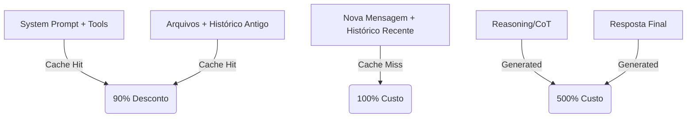

# Anatomia do gasto — input, output e reasoning

> [!abstract] TL;DR
> Uma chamada de LLM não gera uma fatura — gera **três**: **input** (o que você manda, incluindo cache read, que costuma ser a maior parcela em volume), **output** (o texto visível que o modelo escreve) e **reasoning** (tokens invisíveis de "pensamento", cobrados pelo preço de output). São faturas com preços muito diferentes — em modelos Claude atuais, cache read custa 10% do input normal, e output custa 5× o input — então a mesma quantidade de tokens pode gerar contas radicalmente distintas dependendo de qual fatura ela engorda. A maior alavanca de economia quase nunca está onde o desenvolvedor olha primeiro: comprimir o prompt visível quando 94% dele já é cache hit por um décimo do preço não move a agulha; um `thinking_budget` mal configurado gerando 50k tokens de reasoning por resposta, sim. Um caso real ilustra a proporção: num dia de uso pesado de agente de código, cache read respondeu por ~55% da conta, cache creation por ~30% (escrever no cache custa 1,25× o input normal) e output por apenas ~15% — o oposto do que a intuição "output é caro" sugere quando o cache está bem configurado.

Cada categoria tem preço, comportamento de cache e armadilha próprios. Ignorar essa anatomia é o caminho mais curto para otimizar o lugar errado — comprimir o prompt quando o problema real está no reasoning, ou tentar reduzir output quando 94% do input já está sendo servido do cache por 10% do preço.

## As Três Dimensões do Custo

### 1. Input Tokens: O "Prefill"
Input é cobrado pelo processamento inicial de todos os tokens enviados. Em 2026, o custo de input é altamente dependente da **[[Dicionário de IA#Prompt caching|estratégia de caching]]**.

- **Static Input (Cache Hit):** Instruções de sistema, schemas de tools e documentação de referência. Custam ~10% do preço base se estiverem no início do prompt.
- **Dynamic Input (Cache Miss):** Histórico de conversa recente e arquivos recém-modificados. Custam 100% do preço e "esquentam" o cache para a próxima chamada.
- **Cache Creation (Cache Write):** A primeira vez que um trecho é processado com `cache_control`, ele não é gratuito — custa **1,25×** o preço normal do input (janela de 5 minutos) ou 2× (janela de 1 hora). É o "investimento" que só se paga se houver leituras subsequentes.
- **A Ordem Importa:** O cache de prefixo funciona em cascata. Qualquer mudança no meio do prompt invalida todos os tokens que vêm *depois* dele no cache.

> [!example] Números reais (preços Anthropic, jul/2026, verificados em platform.claude.com/docs)
> Claude Sonnet 4.6: input $3/Mtok, cache write (5 min) $3.75/Mtok, cache read $0.30/Mtok, output $15/Mtok. Claude Opus 4.8: input $5/Mtok, cache write $6.25/Mtok, cache read $0.50/Mtok, output $25/Mtok. Claude Haiku 4.5: input $1/Mtok, cache write $1.25/Mtok, cache read $0.10/Mtok, output $5/Mtok. Repare no padrão: em qualquer um dos três modelos, cache read = 10% do input, cache write = 125% do input, output = 5× o input. A proporção se mantém — só a escala muda.

> [!warning] Correção de mito comum
> "Opus custa 5× o Sonnet" é uma simplificação errada que circula bastante. Comparando os preços acima, Opus 4.8 ($5/$25) é **~1,67×** Sonnet 4.6 ($3/$15) — tanto no input quanto no output. O fator 5× existe, mas é a distância entre **Opus e Haiku** ($1/$5), não entre Opus e Sonnet. Confundir essas duas razões leva a decisões de model routing (ver [[09 - Model routing — modelo certo para a tarefa]]) baseadas num número errado — trocar Opus por Sonnet numa tarefa que só ele resolve bem, achando que a economia seria 5×, quando na prática é 1,67×. O efeito prático: superestimar a diferença tende a produzir o viés oposto ao esperado — times evitam Opus até para as tarefas em que ele é claramente o modelo certo.

### 2. Output Tokens: O "Decode"
Output é o custo de geração token-a-token. É a parte mais cara porque exige passagens sequenciais pela GPU e consome banda de memória ([[Dicionário de IA#memory bandwidth bottleneck|memory bandwidth bottleneck]]). Nos preços verificados acima, output é **5×** o preço do input em cada um dos três modelos Claude — não o "3-10×" citado genericamente por alguns guias de 2025, que hoje varia por família de modelo (na Claude, é consistentemente 5×; em outros providers, a razão pode diferir).

- **Texto Visível:** A resposta final que o usuário lê.
- **[[Dicionário de IA#tool call|Tool Calls]]:** Estruturas JSON invisíveis para o usuário mas processadas como output.

### 3. Reasoning Tokens: O "Pensamento Invisível"
Introduzidos em modelos como o1, o3, o4 e a família Claude "Thinking", são tokens gerados internamente para [[Dicionário de IA#Chain-of-Thought (CoT)|Chain-of-Thought (CoT)]], auto-correção e planejamento.

- **Faturamento:** Quase todos os provedores cobram [[Dicionário de IA#Reasoning tokens|reasoning tokens]] pelo **preço de output** — o mais caro das três faturas — mesmo que eles não apareçam na resposta final.
- **Amplificação:** Um modelo pode gerar 50k reasoning tokens para produzir uma resposta de 200 tokens. Sem um [[Dicionário de IA#Thinking budget|`thinking_budget`]] configurado, uma tarefa simples pode custar $2.00 em vez de $0.02.
- **Dedução de Limites:** Reasoning tokens contam para o seu `max_completion_tokens`. Se o modelo "pensar" demais, ele pode ficar sem espaço para a resposta final (o erro de "Thinking limit reached").
- **Risco em Agentes:** Em fluxos multi-turno, reasoning ocorre em *cada* iteração do loop. Com 10 turnos e 50k tokens de reasoning por turno, o custo de reasoning sozinho pode ultrapassar 500k tokens — mais do que o contexto inteiro de um modelo de geração anterior.

---

## Métricas de Eficiência (2026 Standard)

Para uma engenharia de custos madura, não basta olhar o total. Use estas métricas:

| Métrica                         | Fórmula                                     | Meta (Target)              |
| :------------------------------ | :------------------------------------------ | :-------------------------- |
| **Cache Hit Ratio (CHR)**       | `cache_read_tokens / total_input_tokens`    | > 85%                      |
| **Signal-to-Noise Ratio (SNR)** | `final_output / (reasoning + tool_calls)`   | > 0.2 (Depende da tarefa)  |
| **Token-to-Action (TTA)**       | `total_tokens / número_de_tasks_concluídas` | Diminuir ao longo do tempo |
| **Reasoning Overhead**          | `reasoning_tokens / final_output_tokens`    | < 10x para tarefas simples |

### Aplicando as métricas ao exemplo real

> [!question] Essas fórmulas fazem sentido só na teoria, ou dá pra calcular na prática?
> Dá — e o exemplo da seção seguinte (o JSON com `prompt_tokens: 125000`, `reasoning_tokens: 14200`, resposta de 800 tokens visíveis) serve de base direta. Aplicando as quatro métricas:

| Métrica              | Cálculo                        | Resultado | Avaliação                                   |
| --------------------- | -------------------------------- | ---------- | --------------------------------------------- |
| Cache Hit Ratio        | 118.000 / 125.000                | 94,4%      | Excelente — acima da meta de 85%              |
| Signal-to-Noise Ratio  | 800 / (14.200 + 0)               | 0,056      | Ruim — abaixo da meta de 0,2                  |
| Reasoning Overhead     | 14.200 / 800                     | 17,75×     | Ruim — acima do teto de 10× para tarefas simples |

O diagnóstico que essas três métricas revelam juntas: o cache está funcionando muito bem (CHR alto), mas o *reasoning* está desproporcional ao valor entregue (SNR baixo, Reasoning Overhead quase o dobro do teto recomendado). Sem olhar as métricas separadamente, um dashboard que só mostra "custo total" esconderia esse desequilíbrio atrás de um número aparentemente razoável — porque o cache barato compensa, na soma, o reasoning caro.

---

## Anatomia de uma Chamada Moderna (Exemplo)

```json
{
  "usage": {
    "prompt_tokens": 125000,           // Total de input
    "prompt_cache_hit_tokens": 118000, // 94% de economia no input!
    "completion_tokens": 15000,        // Total gerado
    "completion_tokens_details": {
       "reasoning_tokens": 14200,      // O modelo pensou MUITO
       "accepted_prediction_tokens": 0 // Speculative decoding (se usado)
    }
  }
}
```

Neste cenário:
- O **Input** foi quase grátis devido ao cache.
- O **Custo Real** foi dominado pelo **Reasoning**.
- **Ação:** Otimizar o sistema de "Thinking" (ex: reduzir `/effort`) traria mais ROI do que diminuir o prompt.

### Fazendo a conta: quanto isso custa de verdade?

Pegue os números do exemplo acima e aplique-os aos preços de um Sonnet 4.6 (input $3/Mtok, cache read $0.30/Mtok, output $15/Mtok):

| Fatura              | Tokens  | Preço/Mtok | Custo      |
| -------------------- | ------- | ---------- | ---------- |
| Input (cache miss)   | 7.000   | $3.00      | $0.021     |
| Input (cache hit)    | 118.000 | $0.30      | $0.035     |
| Output visível       | 800     | $15.00     | $0.012     |
| Reasoning            | 14.200  | $15.00     | $0.213     |
| **Total**            | 140.000 | —          | **$0.281** |

O reasoning sozinho ($0.213) é **76% da conta** — mais que input e output visível somados. Se esse mesmo reasoning fosse cortado pela metade com um `thinking_budget` bem calibrado, a chamada cairia para ~$0.174 — uma economia de 38% sem tocar em uma linha do prompt.

Agora compare com um cenário de agente rodando 10 turnos, sem cache (pior caso, histórico sempre mudando) e com o mesmo padrão de reasoning por turno:

| Cenário                              | Custo por turno | Custo em 10 turnos |
| ------------------------------------- | ---------------- | -------------------- |
| Com cache hit de 94% no input         | $0.281            | $2.81                |
| Sem cache (100% do input a preço cheio) | $0.386            | $3.86                |

A diferença de $1.05 em 10 turnos parece pequena isoladamente — mas multiplicada por centenas de sessões por dia, é a diferença entre uma conta de agente sustentável e uma que estoura o orçamento mensal.

---

## Um dia real: dissecando uma conta de $245

Números de um dia de uso pesado de agente de codificação (ver "Domando o Opala: a dieta de tokens", relato de campo do autor deste vault) mostram a proporção das três faturas quando o cache está ativo mas o volume de trabalho é alto:

| Fatura           | Valor  | % da conta |
| ----------------- | ------ | ---------- |
| Cache read         | ~$135  | 55%        |
| Cache creation     | ~$74   | 30%        |
| Output visível     | ~$36   | 15%        |
| **Total**          | **$245** | **100%**   |

> [!question] Cache read é a MAIOR fatia mesmo custando só 10% do preço do input?
> Sim — e é isso que confunde a intuição de quem está começando. O preço por token do cache read é baixo, mas o *volume* de tokens lidos do cache num dia de agente rodando em loop (sistema + tools + histórico acumulado, relidos a cada iteração) é enorme. Preço baixo × volume gigante ainda pode superar preço alto × volume pequeno. É a mesma lógica de "morte por mil cortes": nenhuma leitura de cache individual é cara, mas a soma de milhares delas domina a conta.

Reparem que **output visível é só 15%** dessa conta — a fatura que mais chama atenção (porque é o que o usuário vê sendo gerado, e o preço por token é 5× o input) é, na prática, a menor parcela quando o sistema de cache está bem configurado. O verdadeiro vilão nesse cenário não é nem o output nem o reasoning isolados — é o **volume de cache creation** (30%, a 1,25× o preço do input): cada vez que uma parte do prompt muda no meio da sessão, o cache seguinte precisa ser reescrito do zero a partir daquele ponto, e essa reescrita não é gratuita.

Isso reforça o ponto central da nota: **a alavanca de maior impacto depende do formato específico da sua carga de trabalho** — não existe "a fatura mais cara" universal. Num agente de code review de sessão longa, cache read domina. Num pipeline que gera relatórios com reasoning pesado e pouco histórico, reasoning domina. Medir antes de otimizar (ver [[04 - Monitoramento — ccusage, Langfuse, dashboards]]) é o que evita otimizar a fatura errada.

## Estrutura de Gasto em Agentes (Ciclo de Vida)



## Um exemplo de falha: o JSON sem `thinking_budget`

O jeito mais rápido de sentir na pele a "fatura invisível" do reasoning é *não* configurar limite nenhum. Veja esta chamada de API real (simplificada) para uma tarefa simples — resumir um parágrafo de 3 linhas:

```json
{
  "model": "claude-opus-4-8",
  "max_tokens": 1024,
  "messages": [
    { "role": "user", "content": "Resuma este parágrafo em uma frase: ..." }
  ],
  "thinking": {
    "type": "enabled"
  }
}
```

> [!warning] O bug está no que falta, não no que está escrito
> Repare: `thinking.type` está `enabled`, mas não há **`budget_tokens`** (o parâmetro que limita quantos tokens de reasoning o modelo pode gastar antes de responder). Sem esse teto, o modelo decide sozinho quanto "pensar" — e para uma tarefa trivial como resumir 3 linhas, ele pode gerar milhares de tokens de reasoning por excesso de cautela, checando e re-checando um raciocínio que não precisava existir.

O resultado típico desse erro:

| Configuração                          | Reasoning tokens (típico) | Custo do reasoning (Opus 4.8, $25/Mtok) |
| --------------------------------------- | ---------------------------- | ------------------------------------------- |
| Sem `budget_tokens` (tarefa trivial)    | 3.000–8.000                  | $0.075–$0.20                                |
| Com `budget_tokens: 1024` (teto explícito) | ≤1.024                     | ≤$0.026                                     |

A correção é adicionar o teto explicitamente:

```json
{
  "model": "claude-opus-4-8",
  "max_tokens": 1024,
  "messages": [
    { "role": "user", "content": "Resuma este parágrafo em uma frase: ..." }
  ],
  "thinking": {
    "type": "enabled",
    "budget_tokens": 1024
  }
}
```

> [!question]- Por que o modelo não "sabe" que a tarefa é trivial?
> Porque o modelo não tem acesso a um orçamento de custo — só ao que você configurou. `budget_tokens` é o único sinal explícito de "não vale a pena pensar mais que isso" que a API aceita. Sem ele, o comportamento default varia por modelo e por prompt, e tende a favorecer mais reasoning, não menos — o provedor não tem incentivo para subestimar o "pensamento" do próprio modelo.

Detalhamento de como calibrar esse orçamento por tipo de tarefa: [[14 - Thinking budget — controlar reasoning tokens]].

> [!tip] Checklist rápido antes de configurar `thinking`
> - Definiu `budget_tokens` explicitamente? (nunca deixe o default decidir por você)
> - O budget é proporcional à complexidade real da tarefa, não um valor único copiado de outro projeto?
> - Está monitorando `reasoning_tokens` por chamada, não só o custo total agregado? (ver [[04 - Monitoramento — ccusage, Langfuse, dashboards]])
> - Testou o mesmo prompt com budgets diferentes para achar o ponto de queda de qualidade — não só o de economia?

## Os mesmos três conceitos, nomes diferentes por provider

Um efeito colateral irritante de "cada provider fatura as mesmas três coisas" é que cada um usa um vocabulário diferente no JSON de resposta — o que dificulta escrever um dashboard de custo que funcione para múltiplos providers sem tradução:

| Conceito                     | Anthropic (`usage`)                          | OpenAI (`usage`)                              |
| ------------------------------ | ----------------------------------------------- | ------------------------------------------------ |
| Input total                    | `input_tokens`                                   | `prompt_tokens`                                   |
| Input servido do cache         | `cache_read_input_tokens`                        | `prompt_tokens_details.cached_tokens`             |
| Input escrito no cache (novo)  | `cache_creation_input_tokens`                    | não exposto como campo separado                  |
| Output total                   | `output_tokens`                                  | `completion_tokens`                               |
| Reasoning (dentro do output)   | tokens de `thinking` (contam no `output_tokens`) | `completion_tokens_details.reasoning_tokens`       |

> [!info] Por que isso importa pra quem monta observabilidade
> Uma ferramenta de monitoramento de custo (ver [[04 - Monitoramento — ccusage, Langfuse, dashboards]]) precisa normalizar esses nomes antes de somar qualquer coisa entre providers. Somar `prompt_tokens` da OpenAI com `input_tokens` da Anthropic sem separar cache hit de cache miss primeiro produz um número tecnicamente correto, mas inútil para decidir onde cortar custo.

## Isso não é peculiaridade da Anthropic

> [!question] Será que só o Claude fatura reasoning assim, escondido dentro do output?
> Não — é o padrão da indústria. A [documentação da OpenAI](https://developers.openai.com/api/docs/guides/reasoning) confirma que reasoning tokens dos modelos da série o (o3, o4-mini) "não são visíveis via API, mas ainda ocupam espaço na janela de contexto e são cobrados como tokens de output". A diferença entre providers não é *se* cobram reasoning como output — é *quanto* reasoning cada modelo tende a gerar por tarefa, e quanta visibilidade/controle a API expõe sobre esse volume (o `thinking_budget`/`budget_tokens` da Anthropic é justamente esse controle).

Um relato recorrente na comunidade de desenvolvedores OpenAI: uma chamada ao o3 cotada a um preço de output aparentemente baixo pode, na prática, faturar como um modelo 3-10× mais caro — porque o volume de reasoning tokens gerados por resposta visível costuma superar em muito o texto final. A lição vale para qualquer provider com "thinking" ou "reasoning" ligado: **o preço por token de output nunca conta a história inteira sem saber quantos desses tokens são invisíveis.**

> [!question]- E se o provider não expõe `reasoning_tokens` na resposta?
> Alguns providers e alguns modos de API não devolvem esse campo de forma granular — só o total de output. Nesse caso, a única forma de estimar o overhead de reasoning é comparar o custo real cobrado com uma estimativa manual do tamanho esperado da resposta visível: se a conta vier muito acima do previsto pelo texto que voltou, o excedente quase certamente é reasoning não-exposto. É um sinal indireto, mas funciona como alarme.

## Armadilhas Técnicas

> [!warning] A Maldição do Histórico
> Em sessões longas, o custo de *prefill* (input) do histórico cresce de forma quadrática se não for compactado. O cache mitiga o preço, mas não a latência.

> [!warning] Context Density vs Retrieval
> Encher o contexto de arquivos "só por garantia" degrada o SNR. O modelo gera mais tokens de reasoning tentando separar o sinal do ruído.

> [!warning] [[Dicionário de IA#Speculative decoding|Speculative Decoding]]
> Alguns provedores usam modelos menores para prever tokens comuns (como `if`, `else`). Isso acelera a resposta, mas nem sempre reduz o custo (verifique a política do provedor).

> [!warning] [[Dicionário de IA#tool definition|Tool Definition]] Inflation
> Schemas JSON verbosos são "veneno" de contexto. Cada campo desnecessário é cobrado em cada turno da conversa.

## Como explicar em inglês

A single LLM call is not one bill — it is three, and they don't share a price tag. **Input** is what you send, split into cache misses (charged at the full rate) and cache hits (charged at roughly a tenth of that rate). **Output** is the visible text the model writes, charged at a premium — on current Claude pricing, five times the input rate. **Reasoning** is the invisible "thinking" the model does before answering, and virtually every provider bills it at the *output* rate, even though the user never sees it.

The practical trap: developers instinctively optimize the bill they can see — the prompt — when the runaway cost is usually in the bill they can't see — reasoning. A model can silently burn 50,000 reasoning tokens to produce a 200-token answer. Without an explicit `thinking_budget` (or `budget_tokens` in the Anthropic API), that "invisible pensiveness" is unbounded, and a trivial task can cost 100x what it should.

**In a technical interview**, you might say:

> "We track token cost as three separate line items, not one number — input, output, and reasoning — because they have different price multipliers and different failure modes. Our biggest cost leak wasn't verbose prompts, it was uncapped reasoning tokens on simple tool calls. Setting an explicit thinking budget per task type cut that bill by roughly 60% without touching prompt size."

| PT | EN |
|----|-----|
| fatura | bill / line item |
| leitura de cache | cache read (hit) |
| escrita de cache | cache write (cache creation) |
| tokens de raciocínio | reasoning tokens |
| orçamento de pensamento | thinking budget |
| taxa de acerto de cache | cache hit ratio |
| geração token a token | token-by-token decoding |
| alavanca de custo | cost lever |
| teto explícito | explicit cap / budget |
| morte por mil cortes | death by a thousand cuts |
| carga de trabalho | workload |
| alavanca de maior impacto | highest-leverage lever |
| correção de mito | myth correction |
| viés de estimativa | estimation bias |

> [!summary] Em uma frase
> Três faturas, três preços, três comportamentos de falha — meça qual delas domina a *sua* carga de trabalho antes de decidir onde cortar, porque a resposta muda de agente para agente.

## O que vem a seguir

Saber que existem três faturas com preços diferentes é o primeiro passo — mas isso não explica por que sistemas de **agentes** (que fazem múltiplas chamadas em loop, cada uma reprocessando parte do histórico e do raciocínio anterior) inflam o gasto muito mais rápido do que uma chamada única de chat. É exatamente essa multiplicação — cache que esfria a cada iteração, reasoning que se repete turno a turno, ferramentas que engordam o prompt a cada rodada — que a próxima nota destrincha: [[03 - Por que agentes gastam tanto]].

## Referências

- **Anthropic** — [*Pricing*](https://platform.claude.com/docs/en/about-claude/pricing) (2026). Tabela oficial de preços por modelo (input, cache write 5m/1h, cache read, output) e das multiplicadoras de prompt caching (0,1× para leitura, 1,25× para escrita de 5 min) usadas nos exemplos numéricos desta nota.
- **OpenAI** — [*Reasoning models*](https://developers.openai.com/api/docs/guides/reasoning) (2026). Confirma que reasoning tokens dos modelos da série o são cobrados ao preço de output, mesmo não aparecendo na resposta — o mesmo padrão de faturamento usado como referência nesta nota.

## Veja também

- [[05 - Prompt caching na prática]] — detalhamento técnico do prefill caching
- [[13 - Respostas concisas — controlar output tokens]] — estratégias para SNR alto
- [[14 - Thinking budget — controlar reasoning tokens]] — como domar o custo de CoT
- [[03 - Por que agentes gastam tanto]] — como as três faturas se multiplicam em loops de agente
