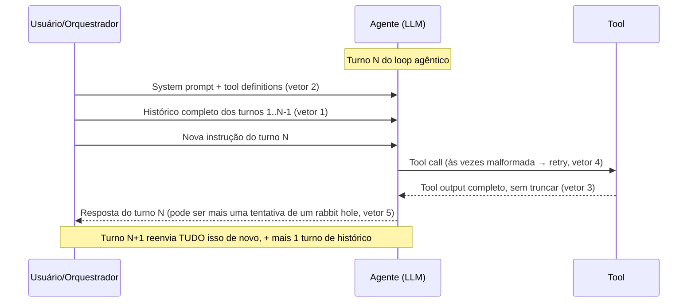
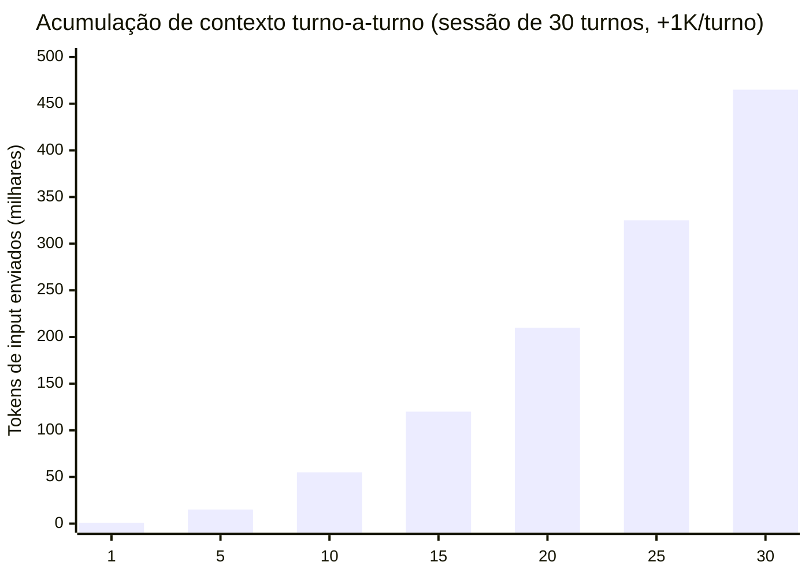

# Por que agentes gastam tanto

> [!abstract] TL;DR
> Uma chamada single-shot de LLM custa centavos. Uma sessão de agente custa dólares. A diferença é estrutural, não acidental: o [[Dicionário de IA#agentic loop|loop agêntico]] re-envia contexto a cada turno (acumulação quadrática), [[Dicionário de IA#tool definition|tool definitions]] ficam infladas no [[Dicionário de IA#system prompt|system prompt]], retries silenciosos consomem [[Dicionário de IA#Token|tokens]] sem feedback visível, e o agente pode entrar em rabbit holes iterando sem progresso. Entender essa dinâmica é pré-requisito para qualquer otimização real.

A diferença de custo entre um chat simples e uma sessão de agente não é acidental — é arquitetural. Entender por que ajuda a fazer escolhas melhores sobre quando usar (e quando evitar) o modo agentic.

Por que o modelo não pode simplesmente "lembrar" o que já viu, em vez de reler tudo de novo? Porque um LLM não tem memória entre chamadas — cada requisição é *stateless*. O que parece uma "conversa contínua" é, por baixo do capô, uma sequência de chamadas independentes onde o cliente (o agente) reenvia manualmente todo o histórico relevante a cada vez. Essa é a peça que faz o resto da nota fazer sentido: se não há memória persistente, todo turno tem que reconstruir o contexto do zero — e é aí que os cinco vetores abaixo entram.

## Os cinco vetores de gasto

Antes de detalhar cada vetor, vale ver onde eles se encaixam dentro de um único turno do loop. O diagrama abaixo mostra uma chamada típica de agente: o que é reenviado do zero, o que idealmente vem do cache, e onde cada vetor injeta custo extra.



Cada seta de "reenvio" nesse diagrama é um custo que se repete a cada turno subsequente — é por isso que a acumulação é quadrática, não linear: o turno 30 não paga só pelo seu próprio conteúdo, paga também por carregar os 29 turnos anteriores de novo.

### 1. Acumulação de contexto turno-a-turno

Cada turno do [[Dicionário de IA#agentic loop|loop agentic]] envia **todo o histórico** mais a nova mensagem. Sessão de 30 turnos onde cada turno acrescenta 1K tokens:

| Turno | Tokens enviados (input) | Acumulado |
| ----- | ----------------------- | --------- |
| 1     | 1K                      | 1K        |
| 5     | 5K                      | 15K       |
| 15    | 15K                     | 120K      |
| 30    | 30K                     | 465K      |



O gráfico mostra a curva quadrática: o turno 30 sozinho reenvia 30K tokens, mas o **acumulado** da sessão já passou de 465K — quase metade de uma janela de contexto de 1M. É a imagem certa para o problema: "o agente relendo o caminhão de mudança inteiro a cada passo". Numa auditoria real de uso do Claude Code sem `/clear`, esse padrão apareceu na prática — sessões longas empurraram o contexto médio por requisição de ~47-73K tokens (saudável) para 163-181K tokens, e as duas maiores sessões acumularam mais de 1 bilhão de tokens cada uma ao longo da sessão.

Sem [[05 - Prompt caching na prática]], cada token desse histórico é cobrado como input fresco.

A matemática por trás é simples de derivar: se cada turno acrescenta *k* tokens novos ao histórico, o turno *n* reenvia *n·k* tokens, e o total acumulado da sessão até o turno *n* é a soma de uma progressão aritmética: **n·(n+1)/2 · k**. Dobrar o número de turnos não dobra o custo total — ele **quadruplica** (porque *n* aparece ao quadrado na fórmula). É essa curvatura, não o custo por turno isolado, que faz sessões longas serem desproporcionalmente caras. Uma chamada single-shot não tem esse termo: ela é *n=1*, sem histórico a carregar — daí a diferença de ordem de grandeza vista na comparação mais abaixo.

Equipes costumam subestimar o custo de workflows multi-step por 3 a 5× quando não contabilizam acumulação de contexto, payloads de tool calls e repetição de system prompt.

### 2. Tool definitions infladas


Tool descriptions são re-enviadas no system prompt **a cada turno**. Um conjunto típico de 15 ferramentas com schemas detalhados consome 5-15K tokens. Em pipelines com [[Dicionário de IA#MCP (Model Context Protocol)|MCP]], metadados de ferramentas chegam a consumir 40-50% da [[Dicionário de IA#Context window|context window]]. Multiplicado por 30 turnos: 150-450K tokens só em definição de tools — antes de o agente fazer qualquer coisa útil.

Por que isso acontece? O modelo não guarda "lembrete" de quais ferramentas existem entre turnos — cada requisição é uma folha em branco que precisa ser re-instruída sobre o que o agente pode fazer, com que parâmetros, e em que formato. Um servidor MCP conectado a Slack, GitHub e um banco de dados facilmente expõe 20-40 ferramentas; cada uma carrega nome, descrição, schema JSON de parâmetros e exemplos — e tudo isso é texto que entra no orçamento de tokens do system prompt antes mesmo da primeira palavra do usuário. Quanto mais servidores MCP conectados "por via das dúvidas", maior essa fatia fixa que se repete em todo turno, ativa ou não naquela sessão específica.

Uma única definição de ferramenta já ilustra o tamanho do problema:

```json
{
  "name": "search_jira_issues",
  "description": "Search for issues in Jira using JQL (Jira Query Language) syntax. Supports filtering by project, status, assignee, priority, labels, and custom fields. Returns paginated results with full issue metadata including comments, attachments, and history when requested.",
  "parameters": {
    "jql": { "type": "string", "description": "..." },
    "max_results": { "type": "integer", "description": "..." },
    "fields": { "type": "array", "description": "..." },
    "expand": { "type": "array", "description": "..." }
  }
}
```

Isso sozinho já passa de 100 tokens. Multiplique por 20-40 ferramentas desse tamanho, mais exemplos de uso que alguns frameworks injetam automaticamente, e a conta de 5-15K tokens só para descrever o que o agente *pode* fazer — antes de fazer qualquer coisa — deixa de ser abstrata.

Ver [[07 - Compressão de tool definitions]].

### 3. Tool outputs verbosos

O modelo lê *toda* a saída de cada tool. Casos comuns:

- `bash: npm install` → 2-5K tokens de log
- `read_file` em arquivo grande → 10-50K tokens
- `grep` sem filtro → centenas de matches
- Stack traces e erros completos quando bastaria a primeira linha

Cada output verboso vira input do próximo turno. O modelo já leu — mas o histórico acumula igual.

> [!warning] Armadilha — tool output verboso é dívida silenciosa
> Um `read_file` de 50K tokens custa uma vez para o modelo processar, mas custa **de novo em todo turno seguinte**, porque ele volta inteiro no histórico. O dano não é o output em si — é ele virar peso morto carregado pelo resto da sessão.

### 4. Retries silenciosos

Quando o modelo erra a sintaxe de uma [[Dicionário de IA#tool call|tool call]], frameworks geralmente tentam de novo automaticamente. Cada retry custa um turno completo (input acumulado + nova geração). Em logs típicos do Claude Code ou Cursor agent, **5-15% dos turnos são retries** — invisíveis para o usuário.

> [!warning] Armadilha — retry silencioso não aparece na tela, mas aparece na fatura
> O usuário vê um turno; o billing vê dois (ou três). Retry reenvia o contexto acumulado inteiro + gera de novo — é a pior combinação possível: turno "invisível" com o custo cheio de um turno normal. Se 5-15% dos turnos de uma sessão são retries e você não está olhando os logs brutos, essa fatia inteira do gasto fica invisível até você somar.

Na interface do usuário, um retry costuma aparecer só como uma pequena pausa antes da resposta — não como "tentativa 1 falhou, tentando de novo". É por isso que o vetor é chamado de silencioso: o custo é real, mas o sinal visual de que ele aconteceu é quase nulo. A única forma confiável de enxergar retries é olhar os logs brutos da sessão (ou uma ferramenta de tracing como as descritas em [[04 - Monitoramento — ccusage, Langfuse, dashboards]]) e contar quantas chamadas de tool tiveram uma segunda tentativa imediatamente após uma primeira malformada.

### 5. Rabbit holes

Agentes podem iterar sem fazer progresso real:

- Tentar 4 abordagens diferentes antes de admitir que precisa do humano
- Investigar recursivamente sem encontrar a causa raiz
- Reescrever o mesmo arquivo várias vezes
- Loops de "verificar → ajustar → verificar" sem critério de parada

O ciclo é autorreforçante: mais contexto → qualidade de raciocínio cai ([[03 - Context rot e atenção diluída|context rot]]) → mais tentativas falhas → mais tokens no histórico.

O padrão típico de um rabbit hole tem uma assinatura reconhecível no log da sessão: turno 1 tenta a abordagem A e falha; turno 2 tenta B, ainda sem admitir que A falhou por uma razão estrutural; turno 3 volta a uma variação de A; turno 4 tenta C. Em nenhum desses turnos o agente para para perguntar "isso é um problema que eu não tenho informação suficiente pra resolver?" — e cada turno carrega o histórico inteiro dos turnos anteriores, incluindo as abordagens que já falharam. O rabbit hole não é caro só pelos tokens gerados nos turnos extras; é caro porque cada turno extra também paga o pedágio da acumulação de contexto do vetor 1.

> [!warning] Armadilha — rabbit hole é fan-out sem freio
> Numa auditoria real de uso do Claude Code, um fan-out de subagentes sem limite fez o volume de requisições saltar de ~68 por bloco de 5h para **~1.900 por bloco** — cada subagente relendo seu próprio contexto e, no caso analisado, herdando o modelo mais caro (Opus) por padrão. A taxa de queima no pico chegou a ~124 mil tokens/minuto, o suficiente para esgotar uma janela de 5h em 2-3× a velocidade normal. Sem [[15 - Orçamento e hard limits|kill switches]] — teto de fan-out, `/clear` agressivo, roteamento de modelo por papel —, um rabbit hole recursivo pode queimar 200K+ tokens numa única sessão sem que ninguém perceba até o extrato chegar.

### Tabela-resumo dos cinco vetores

Antes de seguir para a fórmula de custo, um resumo rápido de referência — o vetor, o mecanismo por trás, e onde a mitigação primária mora na trilha:

| # | Vetor | Mecanismo | Mitigação primária |
| --- | --- | --- | --- |
| 1 | Acumulação de contexto | Histórico inteiro reenviado a cada turno (custo quadrático) | [[05 - Prompt caching na prática]], [[08 - Compactação de histórico em agentes]] |
| 2 | Tool definitions infladas | Schemas de todas as ferramentas conectadas reenviados no system prompt, usadas ou não | [[07 - Compressão de tool definitions]] |
| 3 | Tool outputs verbosos | Saída bruta de cada tool vira input do turno seguinte, sem truncar | Filtrar/truncar saída antes de devolver ao modelo (`--limit`, `--include`, paginação) |
| 4 | Retries silenciosos | Tool call malformada gera novo turno completo automaticamente, sem sinal visível | Validação de schema antes de executar; observabilidade de taxa de retry |
| 5 | Rabbit holes | Iteração sem critério de parada, autorreforçada pela degradação de context rot | [[15 - Orçamento e hard limits|Kill switches]], teto de fan-out |

## A fórmula por trás do custo

Os cinco vetores acima não são independentes — eles se multiplicam através de uma fórmula simples:

> **custo ≈ contexto × requisições × modelo**

- **Contexto**: quanto cada requisição carrega (histórico + tool definitions + outputs). É o vetor 1, 2 e 3 combinados.
- **Requisições**: quantas chamadas a sessão faz. É onde retries (vetor 4) e rabbit holes (vetor 5) entram — cada um é uma requisição extra que não existiria numa execução limpa.
- **Modelo**: o preço por token do modelo escolhido para cada requisição — inclusive as de subagentes, que por padrão costumam herdar o modelo da conversa principal (ou o mais caro disponível), não o mais barato que a tarefa exigiria.

O termo que mais escapa da atenção é **cache read**: numa sessão longa de agente, boa parte do contexto reenviado a cada turno é *idêntico* ao turno anterior (system prompt, tool definitions, histórico já visto). Com [[05 - Prompt caching na prática|prompt caching]] ativo, esse trecho repetido é cobrado a uma fração do preço de input fresco — e em auditorias reais de uso agentic, cache read chega a representar **cerca de 85% da fatura total**. É o motivo de duas sessões com o mesmo número de turnos poderem ter custos muito diferentes: uma reaproveita cache agressivamente, a outra reconstrói contexto do zero a cada `/clear` mal posicionado ou a cada subagente que não herda cache.

> [!tip] Mitigação que ataca os três termos ao mesmo tempo
> Forçar subagentes a rodar num modelo mais barato por padrão (ex: variável de ambiente `CLAUDE_CODE_SUBAGENT_MODEL` no Claude Code, setada para um modelo de custo menor) reduz o termo **modelo** sem tocar em contexto ou requisições. Combinado com `/clear` agressivo entre tarefas independentes (reduz **contexto**) e um teto explícito de fan-out — lookup pontual resolvido inline, busca com poucos agentes baratos, auditoria com teto de ~5, workflow massivo só com opt-in — (reduz **requisições**), os três termos da fórmula caem juntos em vez de um compensar o outro.

### Antes e depois de aplicar as mitigações

Numa auditoria real de uso agentic do Claude Code, os três termos da fórmula foram medidos em três momentos: o baseline saudável, o pico do problema (fan-out sem freio), e depois de aplicar as mitigações:

| Métrica | Baseline saudável | Pico do problema (sem mitigação) | Mitigação aplicada |
| --- | --- | --- | --- |
| Requisições por bloco de 5h | ~68 | ~1.900 no pico (fan-out de subagentes sem teto) | Teto de fan-out por tipo de tarefa (lookup inline; busca com 2-3 agentes; auditoria com teto ~5; workflow massivo só com opt-in) |
| Contexto médio por requisição | ~47-73K tokens | 163-181K tokens (sessão longa sem `/clear`) | `/clear` agressivo entre tarefas independentes + checkpoint em disco antes do `/clear` |
| Modelo do subagente | — | Herdava o modelo caro (Opus) da conversa principal | `CLAUDE_CODE_SUBAGENT_MODEL=sonnet` como default barato |
| Taxa de queima | — | ~124 mil tokens/minuto no pico (esgotava a janela de 5h em 2-3× a velocidade normal) | Combinação das três mitigações acima |

A tabela deixa visível por que atacar só um vetor não resolve: reduzir contexto sem tocar no fan-out ainda deixa o número de requisições explodindo; trocar o modelo do subagente sem `/clear` ainda deixa cada requisição carregando um contexto inflado. O ganho real veio de mexer nos três termos da fórmula ao mesmo tempo.

### Por que fan-out de subagentes é o multiplicador mais perigoso

Dos três termos da fórmula, **requisições** é o que mais surpreende quem está acostumado a pensar em custo de LLM só em termos de tamanho de prompt. Um subagente não é "grátis" só porque ele roda "em paralelo" ou "em background" — cada subagente é uma sessão inteira própria, com seu próprio system prompt, suas próprias tool definitions, e (se não configurado explicitamente) potencialmente o modelo mais caro disponível.

Um fan-out de 3 subagentes fazendo a mesma pergunta de formas ligeiramente diferentes não custa 3x o de uma chamada — custa 3x o de uma chamada *que já é mais cara que uma chamada direta*, porque cada subagente também paga o custo fixo do seu próprio system prompt e tool definitions. É por isso que a regra prática mais eficaz não é "nunca use subagentes", é "dimensione o fan-out ao tamanho real da tarefa": lookup pontual resolve inline, busca de código usa 2-3 agentes baratos, auditoria ampla tem teto de ~5, e fan-out massivo (dezenas de agentes) só acontece com decisão explícita — nunca como default de um workflow automatizado.

## Single-shot vs agente — comparação concreta

> [!example] "Adicione validação de email a este formulário"
> | Modo | Tokens input | Tokens output | Custo (Sonnet 4.6) |
> |---|---|---|---|
> | Single-shot (paste do código) | 2K | 800 | ~$0.02 |
> | Agente sem otimização | 180K | 4K | ~$0.65 |
> | Agente otimizado (caching + pruning) | 45K efetivos | 4K | ~$0.12 |
> | Agente com fan-out descontrolado (subagentes redundantes, sem `/clear`) | 800K+ efetivos | 8K+ | ~$3+ |
>
> Diferença de **30x** entre single-shot e agente cru. Diferença de **5x** entre agente cru e agente otimizado. E a última linha mostra o outro extremo: a mesma tarefa, mal orquestrada, pode custar mais que 100x o single-shot — não porque o problema exigiu mais raciocínio, mas porque a orquestração multiplicou requisições e contexto sem necessidade.

### Perguntas que todo leitor faz nesse ponto

> [!question] "Isso significa que eu nunca devo usar modo agentic?"
> Não. Significa que o modo agentic tem um custo estrutural que precisa ser justificado pela tarefa (ver seção seguinte), e que esse custo pode ser reduzido — não é uma taxa fixa inevitável. A trilha inteira de [[01 - O problema — por que tokens custam dinheiro|Economia de Tokens]] existe porque a maior parte do desperdício é evitável, não intrínseco.

> [!question] "Prompt caching não resolve isso automaticamente?"
> Resolve parte — [[05 - Prompt caching na prática|prompt caching]] reduz drasticamente o custo do trecho de contexto que se repete idêntico entre turnos (system prompt, tool definitions, histórico já visto). Mas cache não elimina o vetor 4 (retries) nem o vetor 5 (rabbit holes) — esses continuam gerando turnos e tokens novos que o cache, por definição, ainda não viu.

> [!question] "Um subagente não deveria ser mais barato que fazer tudo numa sessão só?"
> Só se ele herdar um modelo mais barato e não duplicar trabalho. Por padrão, muitos frameworks (inclusive o Claude Code sem configuração explícita) deixam o subagente herdar o mesmo modelo da conversa principal — e cada subagente relê seu próprio contexto do zero. Fan-out sem essas duas correções (modelo barato + escopo bem definido) multiplica custo em vez de dividir.

> [!question] "Se o modelo mais caro (Opus) é melhor, por que não usar sempre ele?"
> Porque "melhor" depende da tarefa. Para lookup, busca de código, formatação e geração de conteúdo com padrão claro, um modelo menor (Sonnet) entrega qualidade equivalente por uma fração do custo — o raciocínio extra do modelo maior não muda o resultado. Reservar o modelo mais caro para decisão arquitetural, refactor cross-layer e debugging genuinamente complexo é o que faz o termo **modelo** da fórmula cair sem sacrificar qualidade onde ela importa. Ver [[09 - Model routing — modelo certo para a tarefa]] para o critério completo de quando escalar.

## Quando o gasto é justificado

Agente custa mais — mas pode entregar mais. A pergunta certa não é "isso é caro?", é "o que eu pagaria em tempo humano se não fosse o agente fazendo?". Vale o gasto extra quando:

- Tarefa exige **múltiplos arquivos** — o custo alternativo é copiar e colar manualmente entre editor e chat, turno a turno; o agente elimina essa fricção lendo e editando direto.
- Tarefa exige **execução** — rodar testes, ler logs, iterar sobre o resultado real. Um chat single-shot só pode *sugerir* código; não pode confirmar que ele funciona.
- Especificação está **incompleta** e precisa de exploração — o valor do agente aqui não é escrever a mudança final, é mapear o terreno (que arquivos, que dependências, que testes existem) antes de decidir a mudança.

Não vale quando:

- Tarefa cabe em uma única caixa de chat — pagar pelo loop agêntico (acumulação de contexto, tool definitions) sem nunca precisar de uma segunda chamada é desperdício puro.
- Você já sabe exatamente o que mudar e onde — não há exploração a fazer, então o único papel do agente seria formatar a edição, e isso não paga o overhead.
- O custo de erro é alto e validação humana é necessária por turno — se cada ação do agente precisa de revisão humana antes de prosseguir, o ganho de velocidade do agente desaparece e só sobra o custo de tokens mais alto.

Ver também [[17 - ROI de IA — quando o agente vale o custo]] para o cálculo formal de ROI por tarefa.

## Como explicar em inglês

Em entrevista técnica ou code review em inglês, o vocabulário certo evita ambiguidade — "it got slow" não distingue *acumulação de contexto* de *rabbit hole*, e são problemas com correções diferentes.

Uma frase-modelo para explicar o fenômeno central desta nota:

> "The cost isn't linear because the **agentic loop** resends the entire conversation **history** on every turn — that's quadratic accumulation, not a bug. Add inflated **tool definitions** and silent **retries**, and a 30-turn session can burn ten times what a single-shot call would."

Para descrever uma sessão que travou sem produzir valor:

> "The agent went down a **rabbit hole** — four failed approaches, no root cause, and the **context window** kept growing with every retry."

Para explicar a mitigação de custo com fan-out de subagentes numa conversa técnica:

> "Sub-agent fan-out looked cheap because each call seemed small, but every sub-agent re-reads its own context and, by default, can inherit the same expensive model as the main session. Capping fan-out and routing sub-agents to a cheaper model by default cut our request volume and per-request model cost at the same time."

Um detalhe de vocabulário que confunde não-nativos: **cache read** não se traduz literalmente como "leitura de cache" no sentido comum de "ler algo do cache" — no contexto de billing de LLM, é a métrica que mede a fração do input que foi servida a partir do cache do provider (mais barata) em vez de processada como token novo (input fresco). Em inglês, os termos correlatos são **cache hit** (o evento de encontrar o dado em cache) e **cache read tokens** (a métrica de billing específica).

### Tabela PT↔EN

| Português | English | Nota de uso |
| --- | --- | --- |
| Loop agêntico | Agentic loop | O ciclo turno-a-turno de pensar → chamar tool → ler output → repetir |
| Janela de contexto | Context window | Limite de tokens que o modelo consegue "ver" numa chamada |
| Definição de ferramenta | Tool definition | Schema (nome, parâmetros, descrição) que o modelo lê a cada turno |
| Buraco de coelho / iteração sem progresso | Rabbit hole | Ciclo de tentativas que não converge pra solução |
| Nova tentativa | Retry | Reenvio automático de uma tool call malformada; custa um turno inteiro |
| Leitura de cache | Cache read | Fração do input servida do cache do provider, cobrada mais barato que input fresco |
| Ramificação de subagentes | Sub-agent fan-out | Disparar múltiplos subagentes em paralelo a partir de uma tarefa |

## Checklist — sinais de que você está pagando o preço cheio

Antes de abrir uma ferramenta de monitoramento, dá para suspeitar dos cinco vetores só prestando atenção ao comportamento da sessão:

- [ ] A sessão já passou de 20-30 turnos sem nenhum `/clear` ou `/compact`? → suspeite do vetor 1 (acumulação).
- [ ] O agente está conectado a múltiplos servidores MCP, a maioria não usados na tarefa atual? → suspeite do vetor 2 (tool definitions infladas).
- [ ] Alguma tool chamada recentemente devolveu uma saída que você nem leu inteira? → suspeite do vetor 3 (tool output verboso).
- [ ] O agente "tentou de novo" uma ação sem avisar explicitamente que a primeira tentativa falhou? → suspeite do vetor 4 (retry silencioso).
- [ ] Você perdeu a conta de quantas abordagens diferentes o agente já tentou pro mesmo problema? → suspeite do vetor 5 (rabbit hole).

Dois ou mais itens marcados numa mesma sessão é sinal de que vale interromper e aplicar uma mitigação (`/clear`, `/compact`, ou simplesmente parar e reformular a instrução) antes de deixar o agente continuar.

**Em uma frase:** um agente gasta mais que um chat porque ele reenvia o passado inteiro a cada turno (contexto), multiplica esse reenvio por quantas chamadas a orquestração dispara (requisições), e cada chamada pode estar rodando num modelo mais caro do que a tarefa exige (modelo) — atacar só um desses três termos deixa os outros dois compensando o ganho.

## O que vem a seguir

Entender *por que* o custo explode é diagnóstico — o próximo passo é medir. [[04 - Monitoramento — ccusage, Langfuse, dashboards|Monitoramento]] cobre as ferramentas que tornam esses cinco vetores visíveis na prática: **ccusage** para ver o padrão de acumulação de contexto por sessão do Claude Code, e stacks como **Langfuse**/**Arize Phoenix** para tracing granular por turno em produção. Sem esse instrumento, os sinais desta nota — retries de 5-15%, contexto médio subindo de ~50K para ~180K, fan-out de subagentes multiplicando requisições — ficam invisíveis até o extrato de billing chegar.

Depois de medir, o próximo passo natural é agir vetor a vetor: [[05 - Prompt caching na prática]] ataca o vetor 1, [[07 - Compressão de tool definitions]] ataca o vetor 2, [[08 - Compactação de histórico em agentes]] ataca a acumulação de forma mais agressiva, e [[15 - Orçamento e hard limits]] cobre os kill switches que limitam o dano de retries e rabbit holes descontrolados.

## Veja também

- [[02 - Anatomia do gasto — input, output e reasoning]]
- [[05 - Prompt caching na prática]]
- [[07 - Compressão de tool definitions]]
- [[08 - Compactação de histórico em agentes]]
- [[15 - Orçamento e hard limits]]
- [[10 - Sub-agentes especializados]]
- [[17 - ROI de IA — quando o agente vale o custo]]
- [[22 - Caso real — Auditoria de 47M tokens em maio 2026]]
- [How are AI agents spending your tokens? (Stanford Digital Economy Lab)](https://digitaleconomy.stanford.edu/news/how-are-ai-agents-spending-your-tokens/)
- [How Do Coding Agents Spend Your Money? (OpenReview, 2025)](https://openreview.net/forum?id=1bUeVB3fov)
- [Improving token efficiency in GitHub Agentic Workflows (GitHub Blog)](https://github.blog/ai-and-ml/github-copilot/improving-token-efficiency-in-github-agentic-workflows/)

## Referências

- **Anthropic** — *Building effective agents* (2025). Fonte primária sobre por que loops agênticos existem e quando um workflow determinístico é preferível a um agente livre — relevante pra seção "Quando o gasto é justificado".
- **Latent Space Pod** — *The economics of agent loops* (2025). Discussão de por que o custo de agentes escala de forma diferente do custo de chat simples, incluindo o papel de retries e tool calls malformadas.
- **Stanford Digital Economy Lab** — *How are AI agents spending your tokens?* — dados empíricos sobre a distribuição de gasto entre os cinco vetores em uso real de agentes de coding.
- **OpenReview (2025)** — *How Do Coding Agents Spend Your Money?* — estudo acadêmico com metodologia de instrumentação de custo por chamada em agentes de código.
