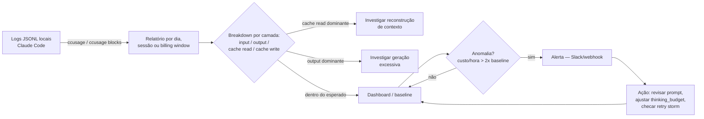

# Monitoramento — ccusage, Langfuse, dashboards

> [!abstract] TL;DR
> Monitorar tokens é o passo zero da economia — sem dados, otimização é adivinhação. Em 2026, o ecossistema de [[Dicionário de IA#Observability|observability]] de LLMs cobre desde o terminal do dev até produção enterprise: **ccusage** (CLI local para Claude Code, 4800+ stars), **Helicone** (proxy fácil, em maintenance mode após aquisição pela Mintlify), **[[Dicionário de IA#Langfuse|Langfuse]]** (observability open-source com tracing profundo, evals e prompt management), **[[Dicionário de IA#Arize Phoenix|Arize Phoenix]]** (alternativa OSS construída sobre OpenTelemetry), e **[[Dicionário de IA#OpenTelemetry GenAI|OpenTelemetry GenAI]]** (padrão emergente para portabilidade cross-vendor). O mínimo viável é logar `usage.input_tokens` + `usage.output_tokens` de cada chamada e somar por dia/projeto.

Um dia de trabalho fechou em $245. A reação instintiva é reclamar do preço do modelo — mas reclamar não conserta nada, porque "caro" não diz *onde* o dinheiro foi. A resposta certa é abrir o `ccusage` e ir atrás dos números: naquele dia específico, a decomposição foi 55% cache read, 30% cache creation e só 15% output. Ou seja, o gasto não era de geração de texto — era de reconstrução de contexto, chamada após chamada. Sem esse detalhe por camada, a única ação possível seria "usar menos a IA". Com ele, a ação vira cirúrgica: revisar por que o cache estava sendo recriado com tanta frequência. Esse é o valor central do monitoramento — ele transforma "está caro" (sentimento) em "está caro *aqui*, por *este* motivo" (diagnóstico acionável).

## O que é

Monitoramento de tokens é o processo de coletar, agregar e visualizar dados de consumo de tokens para identificar desperdícios e medir o impacto de otimizações.

## Como funciona

### Camada 1: Dashboard do provider (nativo)

| Provider  | Onde                      | O que mostra                            |
| --------- | ------------------------- | --------------------------------------- |
| Anthropic | console.anthropic.com     | Gasto diário, por modelo, por workspace |
| OpenAI    | platform.openai.com/usage | Gasto por dia, por modelo, API keys     |
| Google    | Cloud Console / Vertex AI | Gasto por projeto, por modelo           |

**Limitação:** visão agregada, sem detalhes por sessão ou por tarefa. Útil para billing geral, inútil para debugging de custo.

### Camada 2: ccusage (para Claude Code)

ccusage é uma CLI com 4800+ stars no GitHub que analisa os logs JSONL locais do Claude Code — funciona offline, sem proxy. A versão mais recente publicada no npm registry é **20.0.14** (verificado em `registry.npmjs.org/ccusage/latest`), que já traz MCP server embutido, suporte a billing windows de 5 horas e breakdown por modelo.

> [!info] Caducidade — versão do ccusage
> A versão exata muda rápido (é uma CLI ativa, com releases frequentes). O número acima (20.0.14) foi confirmado via npm registry na data desta edição — trate como "última verificada", não como constante. Antes de citar em outro contexto, rode `npm view ccusage version` ou confira `registry.npmjs.org/ccusage/latest`.

É a ferramenta que o dono deste vault usa no dia a dia — inclusive `ccusage blocks` (janelas de 5h) foi o comando usado para decompor o dia de $245 do exemplo acima em cache read/creation/output.

```bash
# Instalar globalmente ou usar sem instalar
npm install -g ccusage
npx ccusage               # alternativa sem instalação permanente

# Relatório diário (padrão)
ccusage
# Date       | Input    | Output   | Cache Read | Cache Write | Cost
# 2026-05-01 | 450,000  | 85,000   | 320,000    | 12,000      | $3.42
# 2026-05-02 | 680,000  | 120,000  | 510,000    | 18,000      | $4.85
# Total      | 1,130,000| 205,000  | 830,000    | 30,000      | $8.27

# Por sessão de conversa
ccusage session

# Por janelas de billing de 5 horas (Claude Pro/Max)
ccusage blocks

# Filtrar por projeto e período
ccusage --project ~/repos/estudeme --since 2026-05-01 --until 2026-05-07

# Filtrar por modelo específico
ccusage --model claude-opus-4-7
```

**Diferenciais:**
- Breakdown por modelo (Opus, Sonnet, Haiku) com custo separado por tier
- Relatório `blocks` alinhado às janelas de billing de 5h do Claude Pro/Max
- MCP server nativo: expõe dados de uso como ferramenta para outros agentes
- Inclui `cache_creation_input_tokens` (write) além de `cache_read_input_tokens`
- Timezone e locale configuráveis para grouping de datas

### Camada 3: Helicone (proxy — setup rápido)

> [!warning] Status 2026
> Helicone foi adquirida pela Mintlify em 3 de março de 2026 e entrou em **maintenance mode**. Suporte a modelos existentes continua, mas novos recursos não serão adicionados. Para novos projetos, avalie Langfuse ou Arize Phoenix.

> [!info] Caducidade — Helicone maintenance mode
> Confirmado via busca em julho/2026: a Mintlify mantém o Helicone rodando (atualizações de segurança, novos modelos, correções de bugs) mas sem features novas, e está ajudando clientes a migrar quando fizer sentido. "Maintenance mode" aqui não é sinônimo de "desligado" — é sinônimo de "sem roadmap". Reconfirme antes de recomendar Helicone para um projeto novo.

```python
import anthropic

client = anthropic.Anthropic(
    base_url="https://anthropic.helicone.ai/v1",
    default_headers={
        "Helicone-Auth": f"Bearer {HELICONE_API_KEY}",
        # opcional: agrupa chamadas em sessões no dashboard
        "Helicone-Session-Id": session_id,
        "Helicone-User-Id": user_id,
    }
)

response = client.messages.create(...)
```

**Funcionalidades:**
- **[[Dicionário de IA#Prompt caching|Prompt caching]] semântico**: armazena respostas completas no edge (Cloudflare), não só o KV-cache do provider — pode reduzir custos em 20-30% em workloads repetitivos
- **AI Gateway**: load balancing entre providers, failover automático, rate limiting configurável
- **Análise por sessão**: `Helicone-Session-Id` agrupa chamadas de uma conversa para análise end-to-end
- **Dashboard**: [[Dicionário de IA#Cache hit rate|cache hit rate]], latência por request, custo acumulado, taxa de erros

**Vantagem original:** setup em 5 minutos, sem mudança de lógica além da base URL.

### Camada 4: Langfuse (observability profunda)

Langfuse é uma plataforma open-source (MIT) usada por 2300+ empresas que processa bilhões de observações por mês. Vai além de logar tokens: rastreia a hierarquia completa de chamadas, gerencia versões de prompts e integra avaliações de qualidade.

**Modelo de dados: Trace → Span → Generation**

```
Trace (representa uma "tarefa" do usuário)
├── Span (etapa de recuperação RAG)
│   └── Generation (chamada ao embedding model)
└── Span (etapa de resposta)
    ├── Generation (chamada ao LLM principal) ← tokens + custo aqui
    └── Span (formatação e pós-processamento)
```

- **[[Dicionário de IA#trace|Trace]]**: representa a solicitação completa, do início ao fim
- **[[Dicionário de IA#span|Span]]**: qualquer operação intermediária (busca, transformação, preparação de prompt)
- **Generation**: subclasse de Span que rastreia especificamente chamadas a LLMs — inclui tokens de input/output e custo calculado automaticamente (OpenAI e Anthropic out-of-the-box)

```python
from langfuse import Langfuse
from langfuse.decorators import observe, langfuse_context

langfuse = Langfuse()

@observe(name="fix-bug")
def fix_bug(issue_description: str):
    # Rastreia automaticamente: tokens input/output/cache,
    # latência por etapa, custo calculado, trace completo
    langfuse_context.update_current_observation(
        input=issue_description,
        metadata={"source": "github"}
    )
    response = client.messages.create(
        model="claude-sonnet-4-6",
        messages=[{"role": "user", "content": issue_description}],
        max_tokens=1024,
    )
    return response.content[0].text
```

**Funcionalidades além do tracing:**
- **Prompt Management**: versionamento central com cache server+client side, rollback imediato, sem redeploy
- **Evals (LLM-as-judge)**: avalie respostas automaticamente por relevância, precisão, tom
- **Datasets e experimentos**: compare variações de prompt usando inputs reais de produção
- **Integração OpenTelemetry**: exporta traces em padrão OTel — compatível com Grafana, Datadog, Phoenix
- **Self-hosting**: Docker Compose em 5 minutos; Kubernetes (Helm) para produção

### Camada 5: Arize Phoenix (open-source + evals)

Phoenix (Arize AI) é uma alternativa open-source ao LangSmith, construída sobre OpenTelemetry. Destaca-se pelo foco em avaliação de qualidade das respostas, não apenas em custos.

```python
import phoenix as px
from phoenix.otel import register

# Inicializa tracer OTel apontando pro Phoenix local (ou cloud)
tracer_provider = register(
    project_name="my-llm-project",
    endpoint="http://localhost:6006/v1/traces"
)

# A partir daqui, qualquer chamada à API é automaticamente instrumentada
# — sem mais nenhuma mudança de código
```

**Diferenciais:**
- Baseado em OpenTelemetry — sem vendor lock-in, exporta para qualquer backend compatível
- Evals nativos: LLM-as-judge, checagens de código, anotações humanas, avaliações personalizadas
- Integra com OpenAI Agents SDK, Claude Agent SDK, LangGraph, CrewAI, LlamaIndex, DSPy
- Roda localmente, em container Docker ou na nuvem (mesmo API)
- Experimentos: compare variações de prompt em datasets de produção reais, com métricas side-by-side

### OpenTelemetry GenAI Semantic Conventions

OpenTelemetry (OTel) está definindo convenções semânticas padronizadas para sistemas de IA generativa. O objetivo é portabilidade: instrumentar uma vez e exportar para qualquer backend (Grafana, Datadog, Langfuse, Phoenix).

**Atributos-chave para spans de LLM:**

```python
# Atributos definidos pelas GenAI Semantic Conventions
span.set_attribute("gen_ai.system", "anthropic")
span.set_attribute("gen_ai.request.model", "claude-sonnet-4-6")
span.set_attribute("gen_ai.usage.input_tokens", 1500)
span.set_attribute("gen_ai.usage.output_tokens", 380)
span.set_attribute("gen_ai.usage.cache_read_input_tokens", 900)
span.set_attribute("gen_ai.response.finish_reasons", ["end_turn"])
```

**Status em 2026:** misto, e é importante não simplificar demais. Os spans de cliente (`gen_ai.client` — uma chamada round-trip ao LLM) já saíram de `experimental` e estão **estáveis**. Já os spans de agente e de framework seguem em status `Development` (o termo que substituiu "experimental" nas convenções mais recentes), sem cronograma público de estabilização. Datadog (nativo desde OTel v1.37) e Grafana já suportam. Langfuse e Phoenix exportam no formato OTel. O SDK da Anthropic é instrumentado via bibliotecas da comunidade (OpenLLMetry).

> [!info] Caducidade — status das convenções OTel GenAI
> Confirmado em julho/2026: spans de cliente LLM = estável; spans de agente/framework = `Development`, evoluindo com breaking changes ocasionais. Times que adotam cedo devem fixar a versão da instrumentação e usar `OTEL_SEMCONV_STABILITY_OPT_IN` para emitir os dois formatos (antigo + novo) durante a transição. Reconfirme em `opentelemetry.io/docs/specs/semconv/gen-ai/` antes de tratar qualquer atributo como definitivo.

> [!tip] Boas práticas de segurança
> Prefira armazenar prompts como **span events**, não como atributos de span — prompts podem conter PII e dados sensíveis que não devem ir para backends de observabilidade sem sanitização prévia.

### Alertas e Detecção de Anomalias

Monitorar sem alertas é como ter um dashboard que ninguém olha. Para produção, configure pelo menos estes sinais:

| Sinal                               | Quando alertar               | Ação típica                              |                                       |
| ----------------------------------- | ---------------------------- | ---------------------------------------- | ------------------------------------- |
| Custo/hora                          | >2× baseline das últimas 24h | Investigar loop de agente ou retry storm |                                       |
| Latência p95                        | >2× baseline ou >30s         | Checar sobrecarga do provider            |                                       |
| [[Dicionário de IA#Cache hit rate\|Cache hit rate]]                 | Cai abaixo de 40%                        | Revisar estrutura e posição do prompt |
| Taxa de erro                        | >5% em janela de 5 minutos   | Checar rate limits ou outage             |                                       |
| [[Dicionário de IA#Reasoning tokens\|Reasoning tokens]] por call    | >50k em tarefas simples                  | Ajustar `thinking_budget`             |

**Anomaly detection vs threshold fixo:** ferramentas como Braintrust e Langfuse usam baseline dinâmico — aprendem o padrão normal e alertam desvios. Mais eficaz que thresholds estáticos para detectar gradual cost creep (aumento lento e contínuo de custos que nenhum threshold fixo captura).

**Webhook simples para alertas de custo diário:**

```python
import json, datetime, requests

def check_daily_cost(log_path="llm_usage.jsonl", threshold_usd=50):
    today = datetime.date.today().isoformat()
    total = sum(
        entry["cost_usd"]
        for line in open(log_path)
        for entry in [json.loads(line)]
        if entry["timestamp"].startswith(today)
    )
    if total > threshold_usd:
        requests.post(SLACK_WEBHOOK, json={
            "text": f"⚠️ LLM cost: ${total:.2f} today (limit ${threshold_usd})"
        })
```

### O ciclo de monitoramento, do terminal ao alerta

O fluxo abaixo é o que separa "eu olhei uma vez" de "meu sistema me avisa": dado bruto vira relatório, relatório vira decisão, decisão vira ação — e o loop realimenta o baseline.



Note que o loop não termina no alerta — ele volta pro baseline (`F`), porque a "normalidade" de ontem pode não ser a de hoje. É esse retorno que captura o *cost creep* (aumento lento e contínuo) que um threshold fixo nunca pegaria.

### Comparativo de ferramentas

| Ferramenta               | Setup  | Custo              | Granularidade     | Melhor para                          |
| ------------------------ | ------ | ------------------ | ----------------- | ------------------------------------ |
| **Provider dashboard**   | Zero   | Grátis             | Diário/modelo     | Visão geral de billing               |
| **ccusage**              | 1 min  | Grátis             | Sessão/projeto    | Usuários de Claude Code              |
| **Helicone** ⚠️          | 5 min  | Freemium           | Request/sessão    | Projetos legados (maintenance mode)  |
| **Langfuse**             | 30 min | Grátis (self-host) | Trace/span/eval   | Times, observability profunda        |
| **Arize Phoenix**        | 15 min | Grátis (self-host) | Trace/eval        | Foco em qualidade + padrão OTel      |
| **Braintrust**           | 20 min | Freemium           | Request/eval      | Evals + CI/CD gates                  |
| **OpenTelemetry**        | Varia  | Grátis             | Span/evento       | Portabilidade multi-backend          |

### Métricas a monitorar

| Métrica                 | O que indica                               | Meta                         |
| ----------------------- | ------------------------------------------ | ---------------------------- |
| **Custo por sessão**    | Eficiência geral                           | <$5 por feature              |
| **Custo por turn**      | Se o contexto está explodindo              | Estável (não crescente)      |
| **[[Dicionário de IA#Cache hit rate\|Cache hit rate]]** | Eficácia do [[Dicionário de IA#Prompt caching\|prompt caching]] | >60%    |
| **Input/output ratio**  | Se o input está inflado                    | <10:1                        |
| **Retries por sessão**  | Quantas vezes o agente erra                | <20%                         |
| **[[Dicionário de IA#Reasoning tokens\|Reasoning tokens]]** | Se thinking budget está calibrado | Proporcional à complexidade |
| **Latência p95**        | Gargalo de desempenho                      | Estabelecer baseline         |
| **Taxa de erro**        | Saúde da integração com o provider         | <1% em produção              |

### Setup mínimo viável

Se não quer instalar nada, apenas adicione logging:

```python
import json, datetime

def log_usage(response, task_name):
    usage = response.usage
    log = {
        "timestamp": datetime.datetime.now().isoformat(),
        "task": task_name,
        "model": response.model,
        "input_tokens": usage.input_tokens,
        "output_tokens": usage.output_tokens,
        "cache_read": getattr(usage, 'cache_read_input_tokens', 0),
        "cache_write": getattr(usage, 'cache_creation_input_tokens', 0),
        "cost_usd": (
            usage.input_tokens * 3 +
            usage.output_tokens * 15 +
            getattr(usage, 'cache_read_input_tokens', 0) * 0.3
        ) / 1_000_000
    }
    with open("llm_usage.jsonl", "a") as f:
        f.write(json.dumps(log) + "\n")
    return log
```

> Para analisar o JSONL gerado: `ccusage` aceita paths customizados com `--dir`; ou use `jq` para queries ad-hoc: `jq -r '[.task, .cost_usd] | @csv' llm_usage.jsonl`.

## Armadilhas

> [!warning] Monitorar só o total
> Saber que gastou $50/dia é quase inútil sozinho — é o mesmo erro do exemplo de abertura, só que sem abrir o `ccusage` pra decompor. O total te diz *que* há um problema; só o breakdown por camada (input/output/cache read/cache write) te diz *qual* problema. Sem isso, toda decisão vira "usar menos", que não é otimização — é desistência.

> [!warning] Não monitorar
> O erro mais caro de todos, porque nem sequer gera o sintoma "gastei $50" — o custo só aparece na fatura no fim do mês, tarde demais para agir. Sem dados, otimização é adivinhação.

> [!warning] Ignorar o cache hit rate
> Se configurou [[Dicionário de IA#Prompt caching|prompt caching]] mas o [[Dicionário de IA#Cache hit rate|cache hit rate]] está em 10%, o cache está ligado mas não está funcionando — e ninguém percebe porque olhou só pro total, não pra essa métrica específica.

> [!warning] Setup over-engineered
> Para dev solo, `ccusage` ou uma planilha bastam. Langfuse com trace/span/eval é ferramenta de time — implantar isso sozinho é otimizar a ferramenta de observabilidade, não o custo real.

> [!warning] Sem alertas em produção
> Dashboard que ninguém olha não evita surpresa na fatura. Alerta transforma "alguém teria visto se tivesse olhado" em "o sistema avisou sozinho".

> [!warning] Helicone em projetos novos
> Em maintenance mode desde março/2026 (adquirida pela Mintlify) — recebe correções e segurança, mas não recursos novos. Para um projeto que só está começando, prefira Langfuse ou Arize Phoenix, que têm roadmap ativo.

> [!warning] PII em spans OTel
> Ao instrumentar com OpenTelemetry, é tentador jogar o prompt inteiro como atributo de span — mas atributos ficam indexados e pesquisáveis no backend de observabilidade. Prompts carregam PII e dados sensíveis. Prefira span *events* (não atributos) e sanitize antes de exportar.

## Como explicar em inglês

Em entrevista técnica ou em reunião com um time internacional, o vocabulário de monitoramento de LLM é quase todo emprestado de observability tradicional (de infra/backend), com alguns termos específicos de IA generativa por cima. A frase que costuma render bem: *"We instrument every LLM call as a trace, with generations as the leaf spans — that's what lets us break cost down by layer instead of just staring at a total."*

| PT-BR                        | EN                        | Nota de uso                                                          |
| ----------------------------- | -------------------------- | --------------------------------------------------------------------- |
| Observabilidade                | observability               | Termo guarda-chuva: logs + métricas + traces                        |
| Rastro / trace completo        | trace                      | A "tarefa" inteira, do início ao fim, em Langfuse/Phoenix/OTel        |
| Etapa intermediária            | span                       | Qualquer operação dentro de um trace (busca, formatação etc.)        |
| Chamada ao LLM (dentro do span)| generation                 | Subclasse de span específica pra chamadas de modelo — carrega tokens/custo |
| Taxa de acerto do cache         | cache hit rate             | % de tokens servidos do cache em vez de reprocessados                |
| Detecção de anomalias           | anomaly detection          | Baseline dinâmico vs. threshold fixo                                  |
| Aumento lento e contínuo de custo | cost creep               | O que anomaly detection pega e threshold fixo não pega                |
| Janela de faturamento           | billing window             | Ex.: janela de 5h do Claude Pro/Max (`ccusage blocks`)                |

## O que vem a seguir

Monitorar mostra *onde* o dinheiro vai — mas ver que 55% do gasto é cache read não é o fim da história, é o início de uma pergunta: esse cache está sendo bem aproveitado, ou está sendo recriado toda hora à toa? Essa é exatamente a pergunta que [[05 - Prompt caching na prática]] responde: como estruturar prompts para que o cache realmente "pegue", em vez de expirar ou ser invalidado a cada chamada.

## Veja também

- [[02 - Anatomia do gasto — input, output e reasoning]] — o que monitorar
- [[05 - Prompt caching na prática]] — a primeira otimização a medir
- [[15 - Orçamento e hard limits]] — como definir metas

## Referências

- **ccusage** — [GitHub ryoppippi/ccusage](https://github.com/ryoppippi/ccusage). CLI com 4800+ stars para análise de uso do Claude Code.
- **Langfuse** — [Documentação oficial](https://langfuse.com/docs) · [Token & Cost Tracking](https://langfuse.com/docs/observability/features/token-and-cost-tracking) · [Get Started with Tracing](https://langfuse.com/docs/observability/get-started).
- **Helicone** — [Documentação](https://docs.helicone.ai) · [LLM Observability Blog](https://www.helicone.ai/blog/llm-observability). Proxy em maintenance mode desde 2026 (adquirido pela Mintlify).
- **Arize Phoenix** — [phoenix.arize.com](https://phoenix.arize.com) · [GitHub](https://github.com/Arize-ai/phoenix). OSS LLM observability & evaluation construído sobre OpenTelemetry.
- **OpenTelemetry GenAI** — [Semantic Conventions](https://opentelemetry.io/docs/specs/semconv/gen-ai/) · [AI Agent Observability 2025](https://opentelemetry.io/blog/2025/ai-agent-observability/). Padrão emergente para observabilidade de sistemas de IA generativa.
- **Braintrust** — [Top 10 LLM Observability Tools 2025](https://www.braintrust.dev/articles/top-10-llm-observability-tools-2025). Comparativo de plataformas de observabilidade e evals.
