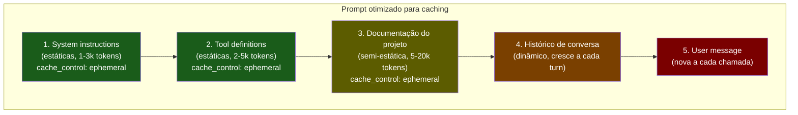

# Prompt caching na prática

> [!abstract] TL;DR
> Prompt caching armazena a computação (KV cache) de partes estáticas do prompt — system, docs, tools — entre chamadas, cobrando 10-50% do preço normal na releitura. É a otimização com **melhor retorno por esforço** na economia de tokens: desconto de 50-90% na parte estática do input com mudança mínima de código. Para maximizar: mova conteúdo estático para o início do prompt, use `cache_control` (Anthropic), e monitore o cache hit rate. Um sistema com 3K tokens de system + 10K de docs, chamado 100x/dia, passa de $5/dia para $0.57/dia com caching — 89% de economia.

---

## O problema

Você tem um agente de análise de código. Cada chamada inclui: 2K tokens de instruções de sistema, 5K tokens de definições de ferramentas, 8K tokens de documentação do projeto, e 1K tokens da pergunta do usuário. Total: 16K tokens por chamada.

O problema: 15K tokens (93%) são idênticos em toda chamada. Mudam só os 1K da pergunta. Você está pagando o preço cheio de prefill para 15K tokens repetidos a cada vez — o mesmo trabalho de computação feito 100 vezes por dia.

Isso é dinheiro desperdiçado em computação redundante. Prompt caching resolve exatamente isso: processa os 15K tokens uma vez, armazena o resultado (o KV cache), e reutiliza nas próximas 99 chamadas pagando uma fração do preço.

---

## Como funciona

### A mecânica do KV cache

Quando o modelo processa o input na fase de prefill, ele computa representações intermediárias (key-value pairs do mecanismo de atenção) para cada token. Esse KV cache é o que permite o modelo gerar os tokens de output sem reprocessar o input do zero.

Prompt caching permite **persistir esse KV cache** entre chamadas. Se o prefixo do próximo prompt for idêntico ao que foi processado antes, o modelo pula a fase de prefill para esses tokens — simplesmente relê o cache já computado.

### Regra fundamental: prefixo idêntico

```
Chamada 1: [system + tools + docs] + [user message A]
Chamada 2: [system + tools + docs] + [user message B]
                ↑ PREFIXO IDÊNTICO ↑    ↑ DIFERENTE ↑
                Lido do cache            Processado normalmente
```

O caching funciona **por prefixo**: tudo idêntico desde o início é cacheável. Se qualquer token muda no meio, o cache é invalidado daquele ponto em diante. Consequência prática: conteúdo mais estável deve ir **antes** do conteúdo que muda a cada chamada.

---

## Implementação por provider

### Anthropic — controle explícito

Anthropic exige marcação explícita com `cache_control` nos blocos que devem ser cacheados:

```json
{
  "model": "claude-sonnet-4-6",
  "system": [
    {
      "type": "text",
      "text": "Instruções de sistema extensas... (2000 tokens)",
      "cache_control": {"type": "ephemeral"}
    }
  ],
  "messages": [
    {
      "role": "user",
      "content": [
        {
          "type": "text",
          "text": "Documentação do projeto... (10000 tokens)",
          "cache_control": {"type": "ephemeral"}
        },
        {
          "type": "text",
          "text": "Minha pergunta nova"
        }
      ]
    }
  ]
}
```

| Aspecto | Valor |
|---|---|
| Desconto de leitura | ~90% (Sonnet: $0.30/MTok vs $3.00/MTok) |
| Custo de escrita | 25% a mais que normal (1ª vez) |
| TTL | 5 min (renova com cada uso) |
| Mínimo cacheável | 1.024 tokens (Sonnet/Opus) |

**Verificação:** a resposta da API inclui `cache_read_input_tokens` e `cache_creation_input_tokens`. Se `cache_read_input_tokens > 0`, o cache foi usado.

### OpenAI — automático

OpenAI cacheia automaticamente prefixos comuns sem configuração adicional:

| Aspecto | Valor |
|---|---|
| Desconto de leitura | ~50% |
| Custo de escrita | Nenhum (transparente) |
| TTL | Automático (minutos a horas) |
| Mínimo cacheável | ~128 tokens |

A desvantagem do automático: menos controle. Você não sabe exatamente o que foi cacheado. Monitore `cached_tokens` na resposta para verificar.

### Google Gemini — Context Caching API

Gemini tem uma API separada para cache de longa duração (até 24h):

```python
import google.generativeai as genai
import datetime

cached = genai.caching.CachedContent.create(
    model='gemini-2.5-flash',
    contents=[large_document],
    ttl=datetime.timedelta(hours=1)
)

# Chamadas subsequentes referenciam o cache
model = genai.GenerativeModel.from_cached_content(cached_content=cached)
response = model.generate_content("Minha pergunta sobre o documento")
```

| Aspecto | Valor |
|---|---|
| Desconto de leitura | ~75% |
| TTL | Configurável (até 24h) |
| Custo adicional | Storage por hora do cache |

---

## Estratégia de organização do prompt



**Princípio:** conteúdo mais estático no início → mais dinâmico no final. O ponto de `cache_control` é o ponto de quebra — tudo antes é cacheado; tudo depois é processado normalmente a cada chamada.

---

## Cálculo de economia

Cenário: 100 chamadas/dia, system prompt 3K tokens, tools 4K tokens, docs 10K tokens.

| | Sem caching | Com caching |
|---|---|---|
| Custo | 100 × 17K × $3/MTok = **$5.10/dia** | 1 × 17K × $3.75/MTok + 99 × 17K × $0.30/MTok = **$0.57/dia** |
| **Economia** | — | **89%** |

A lógica: a primeira chamada paga 25% a mais (escrita do cache). As 99 seguintes pagam 10% do preço normal (leitura do cache). O break-even é na segunda chamada — a partir daí, tudo é economia.

Em um mês: $5.10 × 30 = $153 sem caching → $0.57 × 30 = $17.10 com caching. **$135 economizados por mês** em um cenário simples de 100 chamadas/dia.

### Comparação de providers por perfil de uso

| Perfil | Melhor provider | Por quê |
|---|---|---|
| Alta frequência, intervalos curtos (<5 min) | Anthropic | Melhor desconto (90%), controle explícito |
| Workflows assíncronos (espera > 5 min) | Gemini | TTL de até 24h, não esfria entre etapas longas |
| Sem overhead de configuração | OpenAI | Caching automático, zero código extra |
| Volume extremo com doc fixa | Gemini | Context Caching API com TTL longo + custo de storage baixo |

A escolha do provider para caching deve levar em conta o padrão temporal do seu workflow — não só o preço por token. Um desconto de 90% com TTL de 5 min pode ser pior que um desconto de 75% com TTL de 1h se o seu fluxo tem pausas frequentes.

O truque para calcular o break-even de TTL: `tempo_médio_entre_chamadas < TTL / 2`. Se o intervalo médio entre duas chamadas consecutivas ao mesmo agente é 8 minutos, o TTL de 5 minutos da Anthropic vai ter hit rate < 50% — e o Gemini com TTL de 1h seria muito melhor, mesmo com desconto menor por leitura.

---

## Estado da arte — junho de 2026

**TTL estendido na Anthropic** Em 2026, a Anthropic lançou cache de longa duração (beta) com TTL de até 1 hora para projetos de alto volume — antes limitado a 5 minutos. Isso resolve o problema de workflows com espera longa (CI/CD, análises overnight) onde o cache esfriava.

**Caching automático como default** OpenAI e Gemini moveram para caching automático de prefixo como comportamento padrão para todos os modelos. Em 2026, a expectativa de mercado é que caching seja transparente — o desenvolvedor não deveria precisar pensar nisso para se beneficiar. Anthropic mantém o modelo explícito para dar mais controle, mas simplificou a API.

**Prompt caching com ferramentas** Tool definitions eram frequentemente reprocessadas a cada chamada porque ficavam no meio do prompt. Em 2026, todos os providers suportam caching de tool definitions de forma nativa — sem workaround de serializar tools como texto no system prompt.

**Cache hit rate como SLO** Times maduros em 2026 definem cache hit rate como SLO interno — tipicamente ≥70% para sistemas de alto volume. Um hit rate abaixo de 50% é sinal de organização subótima do prompt ou TTL mal configurado. Times que tratam caching como produto (não como feature) monitoram o hit rate em dashboards ao lado de latência e custo por chamada — e disparam alertas quando cai abaixo do threshold configurado.

**Caching de imagens e documentos** Em 2026, a Anthropic passou a suportar caching de blocos de imagem e PDF embutidos no prompt — não só texto. Para sistemas que analisam o mesmo conjunto de diagramas ou documentos visuais a cada sessão, o desconto se aplica da mesma forma: marca o bloco de imagem com `cache_control` e a representação vetorial da imagem é cacheada junto com o texto.

---

## Armadilhas comuns

> [!warning] Conteúdo dinâmico no início do prompt
> O erro mais comum: colocar a mensagem do usuário ou o histórico antes do system prompt porque "parece mais natural". O cache é invalidado no primeiro token que muda — se a primeira coisa do prompt muda a cada chamada, o cache nunca é usado. A ordem rígida é: estático → semi-estático → dinâmico, sempre.

> [!warning] TTL de 5 min em workflows com espera
> Se o seu agente para para esperar aprovação humana, CI, ou qualquer evento que leva mais de 5 minutos, o cache esfria. Quando a próxima chamada chega, paga custo de escrita de novo. Em workflows com espera, o caching tem eficiência menor que o esperado — calcule o hit rate real antes de assumir 89% de economia.

> [!warning] Blocos menores que 1024 tokens na Anthropic
> Blocos com `cache_control` mas menos de 1024 tokens não são cacheados pela Anthropic — a API simplesmente ignora o `cache_control` sem erro. Se você tem um system prompt de 500 tokens, não vale marcar. Agrupe conteúdo pequeno (system + poucas tools) em um bloco maior.

> [!warning] Não monitorar o cache hit rate
> Implementar `cache_control` sem verificar `cache_read_input_tokens` na resposta é otimizar às cegas. O hit rate pode ser 0% por um bug de ordenação do prompt e você nunca saberá. Logue sempre `cache_read_input_tokens / total_input_tokens` e configure alerta se cair abaixo de 50%.

---

## Casos práticos

### Caso 1 — Agente de code review com base de regras

Um time de plataforma tem um agente de code review com 12K tokens de regras de estilo e segurança. Sem caching: $0.036 por review (100 chamadas/dia = $3.60/dia). Com caching nas regras:

```python
system_with_cache = [
    {
        "type": "text",
        "text": style_rules,        # 12K tokens de regras
        "cache_control": {"type": "ephemeral"}
    }
]
```

Hit rate obtido: 94% (as regras raramente mudam). Custo por review: $0.004. De $3.60/dia para $0.40/dia. Em 6 meses, $936 economizados.

### Caso 2 — RAG com documentação grande fixada

Um sistema de Q&A sobre documentação técnica de 50 páginas. Sem caching: cada pergunta reprocessa o documento inteiro. Com Context Caching do Gemini (TTL 1h):

```python
# Criação única por hora
doc_cache = genai.caching.CachedContent.create(
    model='gemini-2.5-flash',
    contents=[full_documentation_50_pages],
    ttl=datetime.timedelta(hours=1)
)

# Cada pergunta usa o cache
model = genai.GenerativeModel.from_cached_content(doc_cache)
```

De 50K tokens pagos por pergunta para ~5K tokens (só a pergunta). Para 200 perguntas/dia sobre a mesma documentação, economia de 85% no custo de input.

### Caso 3 — Multi-agent com system prompt compartilhado

Um orquestrador spawna 10 sub-agentes por tarefa, todos com o mesmo system prompt de 5K tokens. Sem caching: 10 × 5K = 50K tokens de system prompt pagos por tarefa. Com caching compartilhado:

```python
SHARED_SYSTEM = [
    {
        "type": "text",
        "text": shared_instructions,   # 5K tokens
        "cache_control": {"type": "ephemeral"}
    }
]

# Sub-agente 1: escreve o cache (paga 5K × 125%)
# Sub-agentes 2-10: leem do cache (pagam 5K × 10% cada)
```

Economia: de 50K tokens para ~50K × (1.25 + 9 × 0.10) / 10 ≈ média de 7.25K por agente — 85% menos.

### Caso 4 — Debugging de baixo hit rate

Um time nota que o cache hit rate caiu de 80% para 12% após um deploy. Diagnóstico:

```python
# Antes (hit rate 80%): ordem correta
messages = [system_with_cache, user_message]

# Após deploy (hit rate 12%): developer adicionou timestamp
messages = [
    {"role": "user", "content": f"[{datetime.now()}] " + user_message},  # dinâmico no início!
    system_with_cache
]
```

O timestamp no início da mensagem do usuário — adicionado para debugging — invalidava o cache porque mudava a cada chamada. Corrigido movendo o timestamp para os metadados da chamada (não para o conteúdo do prompt).

---

## Checklist de implementação

- [ ] Conteúdo estático movido para o início do prompt (antes do histórico e user message)
- [ ] `cache_control: ephemeral` nos blocos estáticos com >1024 tokens (Anthropic)
- [ ] `cache_read_input_tokens` logado por chamada
- [ ] Cache hit rate calculado e monitorado (alvo: >60%)
- [ ] TTL alinhado com frequência de uso (intervalo entre chamadas < TTL)
- [ ] Blocos pequenos agrupados para atingir mínimo de 1024 tokens
- [ ] Provider escolhido considerando TTL vs padrão temporal do workflow
- [ ] Caching de imagens/PDFs habilitado se o prompt inclui documentos visuais recorrentes
- [ ] Alerta configurado para cache hit rate abaixo de 50%
- [ ] Break-even calculado: tempo médio entre chamadas < TTL / 2
- [ ] Caching testado em staging com carga real antes de produção (hit rate esperado vs observado)
- [ ] Sistema de logging capaz de agregar hit rate por período (hora, dia) para detectar degradação gradual
- [ ] Revisão periódica do conteúdo cacheado — conteúdo que mudou frequentemente é candidato a sair do bloco cacheado
- [ ] Documentação interna explicando a estrutura de ordenação do prompt para novos devs (evitar o bug do "timestamp no início" do Caso 4)
- [ ] Conteúdo cacheado com alta entropia (→ [[13 - Entropia e qualidade de contexto]]) — não cachear ruído
- [ ] Custo de escrita do cache (125% na 1ª chamada) incluso no cálculo de ROI — não só o custo de leitura
- [ ] Teste de invalidação: verificar que mudanças no system prompt realmente invalidam o cache corretamente

---

## Como explicar em inglês

**Descrevendo o mecanismo:**
- "Prompt caching persists the KV cache between API calls. Instead of recomputing the prefill for your static system prompt every time, the model reads the cached intermediate representations — at 10% of the normal cost for Anthropic"
- "The rule is: identical prefix from the start. Anything that changes, even a single token, invalidates the cache from that point forward. So static content must come first"
- "We went from $5/day to $0.57/day just by adding `cache_control: ephemeral` to our system prompt and documentation blocks. It's the highest ROI optimization in our stack"

**Em conversas técnicas:**
- "Check `cache_read_input_tokens` in the response — if it's 0, the cache isn't being hit. Most likely your dynamic content is before the cached block"
- "The 5-minute TTL is the gotcha for async workflows. If your agent waits for human approval between steps, you're paying cache write cost on every step"
- "For Gemini, use Context Caching API instead of `cache_control` — it supports up to 24-hour TTL which is much better for document-heavy use cases"

### Tabela PT ↔ EN

| Português | Inglês |
|---|---|
| Cache de prompt | Prompt caching |
| Cache KV / KV cache | KV cache |
| Taxa de acerto de cache | Cache hit rate |
| Prefixo idêntico | Identical prefix |
| Tempo de vida do cache | Cache TTL (time-to-live) |
| Tokens de escrita de cache | Cache creation tokens |
| Tokens de leitura de cache | Cache read tokens |
| Custo de escrita | Cache write cost |
| Conteúdo estático | Static content |
| Conteúdo dinâmico | Dynamic content |
| Fase de prefill | Prefill phase |
| Economia por chamada | Per-call savings |

---

> [!tip] Leia: Prompt Caching — Anthropic Docs
> **Fonte:** Anthropic Documentation | **Idioma:** EN
>
> Documentação oficial que cobre a especificação completa do `cache_control`, os breakpoints de TTL, as regras de mínimo de tokens por modelo (Haiku vs Sonnet vs Opus), e exemplos de resposta com `cache_read_input_tokens`. Inclui a seção sobre caching de imagens e PDFs — não só texto. Atualizada com as mudanças de 2026 (TTL estendido, caching de tool results).
>
> 📖 [Buscar: "Anthropic prompt caching docs.anthropic.com cache_control"](https://docs.anthropic.com/en/docs/build-with-claude/prompt-caching)

---

## O que vem a seguir

Prompt caching ataca o custo da **parte estática** do input. Mas o que fazer com o conteúdo que deve estar no prompt e ainda assim é redundante ou desnecessário? As próximas duas notas cobrem isso:

- **[[06 - Context pruning — o que remover do prompt]]** — identificar e remover tokens desnecessários do prompt antes de cachear; caching + pruning juntos são o combo mais eficiente
- **[[07 - Compressão de tool definitions]]** — tool definitions são frequentemente cacheadas mas verbosas; comprimi-las antes de cachear multiplica o efeito

A ordem lógica de otimização: primeiro pruneia (remove o desnecessário), depois comprime (reduz o necessário), depois cacheia (reutiliza o que sobrou). Fazer na ordem inversa é cachear ruído.

Por que a ordem importa: se você cacheia um system prompt de 12K tokens que tem 30% de redundância, está pagando cache write cost em 3.6K tokens inúteis a cada vez que o cache expira — e esses 3.6K continuam poluindo a atenção do modelo em cada chamada. Prunear primeiro elimina o problema antes de ele entrar no ciclo de caching.

Há um corolário importante: caching funciona melhor em prompts de **alta entropia** (→ [[13 - Entropia e qualidade de contexto]]). Um prompt de 10K tokens com 90% de sinal útil e cacheado a 90% de desconto é economicamente muito mais eficiente que um prompt de 10K tokens com 40% de sinal cacheado ao mesmo desconto — porque o segundo também está pagando pelo ruído nas 10% de chamadas que reprocessam.

---

## Veja também

- [[01 - O problema — por que tokens custam dinheiro]] — o problema que caching resolve
- [[06 - Context pruning — o que remover do prompt]] — reduzir antes de cachear
- [[07 - Compressão de tool definitions]] — otimizar as tools que são cacheadas
- [[13 - Entropia e qualidade de contexto]] — por que cachear conteúdo de alta entropia é mais valioso

---

## Referências

- **Anthropic** — *Prompt Caching* (docs.anthropic.com, 2026). Documentação oficial com especificação de `cache_control` e TTL.
- **OpenAI** — *Prompt Caching* (platform.openai.com, 2026). Caching automático de prefixo.
- **Google** — *Context Caching* (ai.google.dev, 2026). API separada com TTL configurável.
- **Anthropic Engineering** — *How We Built Prompt Caching* (2025). Post técnico sobre o mecanismo de KV cache persistente.
- **Varun Mohan (Codeium)** — *Prompt Caching in Production: Lessons from 1B+ API calls* (2025). Análise empírica de cache hit rates por tipo de aplicação, com dados reais de otimização de TTL e ordenação de prompt em escala.
- **Latent Space** — *The Economics of LLM APIs* (podcast, 2026). Discussão sobre caching como componente crítico da economia de AI em produção, com dados de custo real de empresas que passaram por otimização.
- **Simon Willison** — *Notes on prompt caching* (simonwillison.net, 2025). Análise prática com exemplos de código Python para Anthropic, OpenAI e Gemini; inclui reprodução de benchmarks de economia em aplicações reais com código aberto.
- **LlamaIndex** — *Prompt Caching Evaluation: A Comprehensive Guide* (2026). Framework de avaliação de cache hit rate com métricas de referência por categoria de aplicação (agentes, RAG, chatbots).
- **Hamel Husain** — *The Hidden Cost of Context* (hamel.ai, 2025). Análise quantitativa de como o tamanho do contexto afeta latência e custo; argumenta por caching como primeira linha de defesa antes de RAG.
