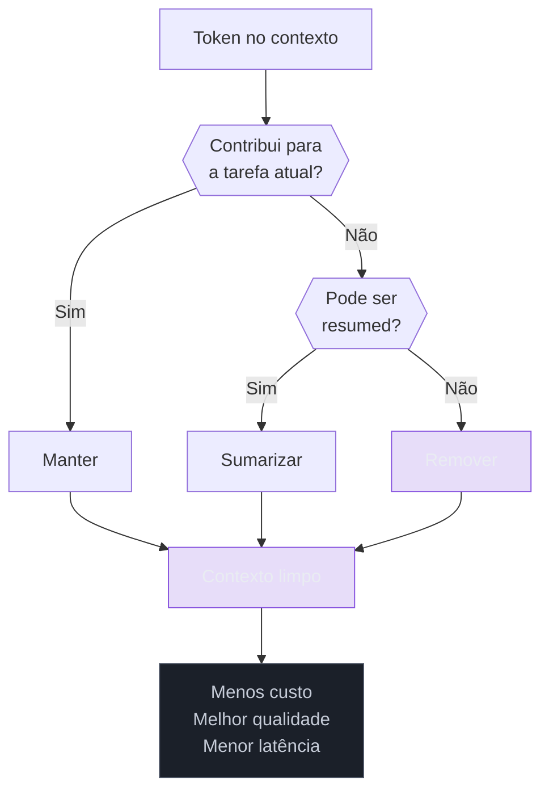
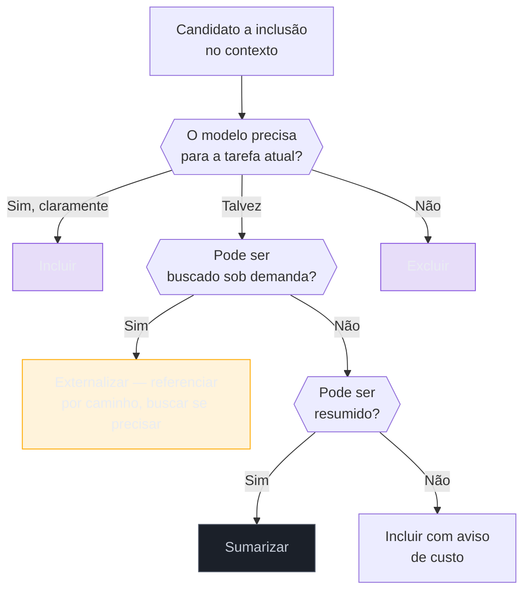

# Context pruning — o que remover do prompt

> [!abstract] TL;DR
> Context pruning é o ato deliberado de remover do prompt tudo que não contribui para a tarefa atual. Mais contexto não é sempre melhor: tokens irrelevantes aumentam custo, diluem a atenção do modelo e degradam qualidade de resposta. As técnicas vão de retrieval seletivo (enviar só as linhas que importam) até sumarização de histórico e truncamento de tool outputs. A regra de ouro: se o modelo não precisa desse token para responder **agora**, ele não deveria estar no contexto.

## O problema: o contexto engorda por si mesmo

Imagine que você contratou um consultor especialista e, antes de cada reunião, empurra para ele uma pilha de documentos — incluindo arquivos de configuração, logs de erro de semanas atrás, um changelog completo do projeto, e o manual de RH da empresa. Não porque sejam relevantes, mas porque "podem ser úteis".

O consultor vai perder tempo folheando essa pilha antes de chegar ao que importa. E você vai pagar por esse tempo.

Com LLMs é exatamente isso. Cada token no contexto é processado pelo modelo — pago pelo provedor, carregado na janela de atenção, analisado durante a geração. **Contexto irrelevante não é neutro: ele compete com o contexto relevante pela atenção limitada do modelo.**

O fenômeno tem nome: **lost in the middle** — modelos tendem a ignorar informação no meio do contexto (veja [[06 - A janela de contexto]] para a mecânica de atenção por trás disso). Quanto maior e mais poluído o prompt, mais crítico esse efeito. Context pruning é a resposta sistemática a esse problema.



## O que remover — taxonomia de poluição

Nem todo token tem o mesmo custo de presença. Alguns são indispensáveis (sistema de regras, contexto da tarefa); outros são sistematicamente inúteis e presentes por inércia.

| O que está no contexto | Precisa? | Ação recomendada |
|---|---|---|
| System prompt + regras de projeto | ✅ Sempre | Manter — e cachear |
| Tool definitions (JSON schema) | ✅ Se as tools são usadas | Manter — comprimir schemas |
| Arquivo inteiro (500 linhas) | ❌ Se só 20 linhas são relevantes | Enviar só o trecho relevante |
| Histórico de 50 turns | ❌ Turns antigos | Sumarizar blocos antigos |
| Output longo de ferramenta | ❌ Se 90% é irrelevante | Filtrar ou truncar |
| Stack trace completo | ❌ Stack completo | Filtrar para as linhas que importam |
| package-lock.json / yarn.lock | ❌ Nunca | Excluir via .cursorignore |
| node_modules / dist / build | ❌ Nunca | Excluir da indexação |
| Arquivos de teste de geração anterior | ⚠️ Depende | Commitar ou fazer stash antes de nova sessão |
| CLAUDE.md inflado com histórico | ⚠️ Se > 200 linhas | Manter focado em regras de engenharia |
| Comentários de código longos | ⚠️ Se redundantes com o código | Truncar ao essencial |

> [!warning] O paradoxo da segurança
> A intuição "mais contexto = mais seguro" é errada e cara. Desenvolvedores incluem arquivos inteiros "por garantia". Mas contexto irrelevante não é neutro — ele ocupa posições de atenção que deveriam estar no que importa. Filtre agressivamente; se o modelo errar por falta de contexto, você adiciona o trecho que faltou.

## Técnicas de pruning em ordem de impacto

### 1. Retrieval seletivo — fragmentos, não arquivos

A técnica mais simples e de maior impacto: nunca envie um arquivo inteiro quando só parte dele é relevante.

```python
# Ruim: lê 500 linhas para usar 20
content = read_file("auth/service.py")  # 500 tokens

# Bom: lê só o que importa
content = read_file("auth/service.py", offset=44, limit=25)  # 25 tokens

# Para código: lê ao redor de um símbolo específico
def read_around_symbol(file: str, symbol: str, context_lines: int = 10) -> str:
    lines = open(file).readlines()
    for i, line in enumerate(lines):
        if symbol in line:
            start = max(0, i - context_lines)
            end = min(len(lines), i + context_lines + 1)
            return "".join(lines[start:end])
    return ""
```

A economia é direta: se você lê 20 de 500 linhas, você elimina 96% dos tokens desse arquivo.

### 2. Truncamento e filtragem de tool outputs

Tool outputs são o maior vilão invisível. Um `npm test` pode gerar 200 linhas; um `git diff` de PR, 2000. O modelo raramente precisa de tudo.

```python
def truncate_tool_output(output: str, max_lines: int = 50, keep_errors: bool = True) -> str:
    """
    Mantém erros sempre. Trunca o resto.
    """
    lines = output.split("\n")
    
    if len(lines) <= max_lines:
        return output
    
    if keep_errors:
        error_lines = [l for l in lines if any(
            kw in l.lower() for kw in ["error", "failed", "exception", "fatal"]
        )]
        context_lines = lines[:10] + ["..."] + lines[-10:]
        combined = list(dict.fromkeys(error_lines + context_lines))  # dedup
        return "\n".join(combined[:max_lines])
    
    return "\n".join(lines[:max_lines]) + f"\n... ({len(lines) - max_lines} linhas omitidas)"
```

Padrão para filtrar saída de testes:

```bash
# Ruim: 200 linhas de test output
npm test 2>&1

# Bom: só falhas e sumário
npm test 2>&1 | grep -E "(PASS|FAIL|Error:|●|Tests:|✓|✗)" | tail -30
```

### 3. Sumarização de histórico (context compaction)

Em conversas longas, turns antigos raramente são úteis na íntegra. O padrão é manter os últimos N turns completos e substituir o restante por um resumo.

```python
KEEP_FULL = 8    # últimos N turns ficam intactos
MAX_SUMMARY = 800  # tokens para o resumo do histórico anterior

def compact_history(messages: list[dict], keep_full: int = KEEP_FULL) -> list[dict]:
    if len(messages) <= keep_full * 2:  # *2 porque user + assistant
        return messages
    
    old_messages = messages[:-keep_full * 2]
    recent_messages = messages[-keep_full * 2:]
    
    summary_prompt = f"""
Resuma esta conversa em até {MAX_SUMMARY} tokens, preservando:
- Decisões tomadas
- Artefatos criados (arquivos, schemas, configs)
- Constraints descobertos (bugs, limitações, dependências)
- O que foi DESCARTADO e por quê

Não inclua: diálogo casual, raciocínio intermediário já superado, conteúdo que o usuário rejeitou.
"""
    summary = llm_call(summary_prompt, old_messages)
    
    return [{"role": "system", "content": f"[Resumo da conversa anterior]\n{summary}"}] + recent_messages
```

Claude Code implementa isso automaticamente via "context compaction" — quando o contexto ultrapassa um threshold, uma janela deslizante compacta os turns mais antigos.

### 4. .cursorignore / .gitignore para indexação

IDEs com IA (Cursor, Copilot, Windsurf) indexam o projeto para retrieval. Sem configuração, eles indexam node_modules, lock files, binários e arquivos gerados — e podem incluí-los no contexto.

```gitignore
# .cursorignore — evitar indexação de conteúdo irrelevante
node_modules/
.yarn/
dist/
build/
.next/
*.lock
*.log
coverage/
.git/
__pycache__/
*.pyc
*.class
target/       # Java Maven
.gradle/      # Java Gradle
vendor/       # PHP, Go
*.min.js
*.map
```

Isso reduz o pool de retrieval e evita que o modelo receba contexto de arquivos que nunca deveriam ser tocados.

### 5. Higiene de CLAUDE.md e arquivos de instrução

O system prompt — via CLAUDE.md, AGENTS.md ou equivalente — é enviado em **todos** os turns. Cada linha extra custa tokens em toda chamada da sessão.

```markdown
❌ CLAUDE.md ruim (300+ linhas):
## Histórico do Projeto
- 2024-01: Iniciamos com Flask...
- 2024-03: Migramos para FastAPI por causa de X, Y, Z...
- 2024-06: O cliente pediu autenticação OAuth porque...
[... 200 linhas de história ...]

✅ CLAUDE.md bom (< 80 linhas):
## Stack
- Python 3.12, FastAPI 0.115, PostgreSQL 16
- Auth: OAuth2 + JWT (access 15min, refresh 7d)

## Convenções
- Testes em tests/ com pytest; cobertura mínima 80%
- Commits: conventional commits (feat/fix/chore)
- Nunca expor credenciais; usar .env + pydantic-settings
```

História do projeto vai no README ou em documentos internos — não no CLAUDE.md.

### 6. Commits frequentes antes de novas sessões

Agentes leem `git status` e arquivos modificados. Se você tem 30 arquivos alterados de sessões anteriores mas está trabalhando em apenas 2, o agente pode incluir contexto de todos os 30.

```bash
# Antes de iniciar uma nova sessão de pair programming com IA
git add -p          # review interativo do que vale commitar
git stash           # guardar WIP não relacionado
git status          # validar: só os arquivos desta tarefa aparecem
```

### 7. Externalização de artefatos grandes

Em vez de incluir specs, ERDs ou documentação técnica no contexto, referencie-os por caminho e instrua o agente a buscar sob demanda.

```markdown
❌ Ruim (50k tokens inline):
"Aqui está a especificação completa do sistema de pagamentos:
[...50 páginas de texto...]"

✅ Bom (100 tokens de referência):
"A spec de pagamentos está em docs/payment-spec.md.
Leia as seções que você precisar. A seção de webhooks
está nas linhas 230-280 se precisar do formato de eventos."
```

O agente chama `read_file` com offset/limit quando precisa de uma seção específica. Você paga pelos tokens da spec só quando — e só os trechos que — o agente realmente consulta.

Esse padrão funciona porque agentes modernos têm acesso a ferramentas de leitura. Quando você força o contexto inline, você paga pelo documento inteiro **toda vez**, independente de o modelo precisar de 10% ou 100% dele.

## Decisão de poda — algoritmo mental

A pergunta não é "isso pode ser útil?", mas **"o modelo precisa disso para responder à pergunta atual?"**



## Impacto em custo e qualidade

| Técnica | Redução de tokens | Impacto na qualidade |
|---|---|---|
| Retrieval seletivo (trecho vs arquivo) | 60-95% por arquivo | ✅ Melhora — mais focado |
| Truncamento de tool outputs | 50-80% por output | ✅ Melhora — menos ruído |
| Sumarização de histórico | 70-90% no histórico antigo | ⚠️ Neutro se bem feito; perde detalhes se ruim |
| .cursorignore | 20-40% no pool de retrieval | ✅ Melhora — menos falsos positivos |
| CLAUDE.md enxuto | 10-30% por turn | ✅ Neutro a melhora |
| Higiene de git (stash/commit) | Variável | ✅ Melhora — agente vê só o relevante |

> [!warning] Podar demais é tão ruim quanto não podar
> Remover contexto crítico faz o modelo alucinar ou tomar decisões erradas. A técnica não é "menos contexto sempre" — é "contexto certo para a tarefa atual". Meça qualidade antes e depois: faça perguntas de probe (perguntas cujas respostas corretas dependem do contexto removido) e verifique se o modelo ainda as acerta.

## Armadilhas comuns

> [!warning] Sumarização que apaga decisões arquiteturais
> Resumidores genéricos tendem a preservar fatos factuais e apagar raciocínio de decisão. "Decidimos usar Redis em vez de Memcached" pode sobreviver; "decidimos não usar Redis porque o time não tem expertise e a latência atual é aceitável" é exatamente o tipo de contexto que se perde. Instrua explicitamente o summarizer a preservar decisões de design com suas motivações.

> [!warning] Não testar o impacto do pruning
> Pruning sem medição é perigoso. Antes de ativar truncamento de tool output ou sumarização, defina um conjunto de probe questions — perguntas cuja resposta correta depende do contexto que você está removendo. Valide que o modelo ainda as responde corretamente com o contexto podado. Se não, você está removendo mais do que deveria.

> [!warning] CLAUDE.md como diário de projeto
> É comum que arquivos de instrução cresçam por acumulação — cada sessão adiciona um contexto novo sem remover o obsoleto. Após 6 meses, um CLAUDE.md pode ter 500 linhas de história e convenções superadas. Revise trimestralmente: se uma linha não guia decisões técnicas ativas, ela não deveria estar lá.

> [!warning] Lock files e gerados no retrieval
> IDEs com IA sem .cursorignore indexam package-lock.json, yarn.lock, Cargo.lock — arquivos que nunca deveriam ser tocados pelo modelo. Isso polui o retrieval e pode levar o modelo a "ler" dependências transitivas como contexto. Configure antes de iniciar o projeto.

## Estado da arte — junho 2026

**LLM-guided pruning automático:** ferramentas como PromptPex e ContextGenie usam um modelo leve (Haiku, Flash) para pré-filtrar o contexto antes de enviá-lo ao modelo principal. O modelo leve avalia relevância de cada chunk para a query atual — o que custa ~$0.001 pode economizar $0.10 no modelo principal.

**Sliding window com compaction:** o padrão emergiu de Claude Code (context compaction automático) e foi adotado por Cursor, Windsurf e Aider. A janela deslizante mantém os últimos N turns completos e compacta o restante. Em 2026, esses sistemas permitem configurar o threshold e o modelo usado para compactação.

**Semantic chunking para retrieval:** em vez de chunks fixos de 512 tokens, ferramentas modernas segmentam por unidade semântica (função, classe, parágrafo coerente) antes de indexar. O retrieval então busca chunks semanticamente relevantes — e o modelo vê só os chunks selecionados, não o arquivo inteiro.

**Pruning por grafo de dependência:** para código, análise estática identifica quais funções/classes são realmente invocadas pela tarefa atual, e só essas são incluídas no contexto. Em vez de "inclua o serviço inteiro", inclua "as 3 funções que seu grafo de chamadas mostra serem relevantes".

**Context budget tracking:** plataformas como LangSmith e LangFuse passaram a expor "context utilization" — métricas que mostram qual percentual do contexto o modelo realmente "atendeu" (via métricas de atenção ou análise pós-hoc). Isso transforma pruning de arte em ciência: você vê quais seções o modelo ignorou e pode removê-las nas próximas chamadas.

## Casos práticos

**Caso 1 — Review de PR com 30 arquivos modificados:** Um agente de code review estava recebendo o diff completo de um PR com 30 arquivos e 2000 linhas alteradas. Custo por review: $0.15. Após implementar retrieval seletivo (só os arquivos com bugs históricos + os arquivos do diff atual relevantes à feature) + truncamento de comentários de contexto: custo caiu para $0.04, e a qualidade melhorou porque o modelo parou de se distrair com arquivos de migração e de configuração que mudaram incidentalmente.

**Caso 2 — Agente de debugging com histórico de sessão longa:** Em uma sessão de debugging de 4 horas (60+ turns), o agente acumulou 180k tokens de histórico. Os primeiros 50 turns eram sobre um bug diferente, já resolvido. Após implementar compactação seletiva (resumir os turns 1-40 em 500 tokens preservando apenas decisões e artefatos), o custo por turn caiu 40% e o agente parou de "lembrar" soluções descartadas como candidatas.

**Caso 3 — Indexação de monorepo:** Um time adicionou .cursorignore ao monorepo cobrindo node_modules, dist, arquivos de lock e coverage. O pool de retrieval da IDE caiu de 800MB para 120MB, e as sugestões de completion passaram a referenciar código de produção em vez de definições de tipos geradas automaticamente.

**Caso 4 — CLAUDE.md auditado:** Após 8 meses de desenvolvimento, um CLAUDE.md chegou a 420 linhas. Uma auditoria revelou que 60% era histórico de decisões já implementadas (e portanto documentadas no código) e 20% eram convenções que o time havia abandonado. Após a poda para 80 linhas de regras ativas, o custo por sessão caiu ~12% (o system prompt era enviado ~30 vezes por hora de trabalho).

## Checklist

- [ ] .cursorignore / .gitignore configurados para excluir lock files, gerados e node_modules
- [ ] Retrieval seletivo ativo — agente envia trechos, não arquivos inteiros
- [ ] Tool outputs truncados/filtrados (max_lines configurado)
- [ ] Sumarização de histórico ativa (context compaction ou equivalente)
- [ ] CLAUDE.md auditado — sem histórico de projeto, só regras ativas
- [ ] Commits frequentes antes de novas sessões de trabalho com agente
- [ ] Probe questions definidas para validar que o pruning não degradou qualidade
- [ ] Semantic chunking configurado no retriever (se aplicável)
- [ ] Artefatos grandes externalizados — specs e ERDs referenciados por path, não inline
- [ ] Monitoramento de context utilization ativo (LangSmith, LangFuse ou equivalente)
- [ ] Revisão trimestral do CLAUDE.md — remover convenções abandonadas e histórico obsoleto
- [ ] Filtro pré-indexação no CI — validar que novos artefatos gerados entram no .cursorignore

## O que vem a seguir

Pruning limpa o que **já está** no prompt — remove o que não deveria estar lá em primeiro lugar. O próximo passo natural é [[07 - Compressão de tool definitions]], que lida com o que **precisa** estar no prompt mas pode ser representado de forma mais compacta: schemas de ferramentas, definições de API, structs de dado que o modelo usa mas que raramente precisam de toda sua verbosidade original.

A sequência lógica é: podar → comprimir → cachear. Não adianta cachear um prompt inflado.

Uma boa heurística de ordem: primeiro remova o que não deveria estar lá (pruning); depois compacte o que precisa estar mas pode ser mais enxuto (compressão); só então stabilize o resultado em cache. Cada etapa amplifica as anteriores — cachear 10k tokens custa menos que cachear 50k, mas podar até 10k é o passo que você faz uma vez e colhe em toda chamada subsequente.

## Como explicar em inglês

**Context pruning** é o termo técnico estabelecido — você vai encontrá-lo em documentação da Anthropic, OpenAI e frameworks de agentes. O conceito adjacente de **prompt trimming** é mais genérico e inclui qualquer redução de tamanho do prompt, não necessariamente seletiva.

Alguns termos que aparecem na literatura:

| Português | Inglês | Contexto de uso |
|---|---|---|
| Poda de contexto | Context pruning | Qualquer remoção deliberada de contexto |
| Retrieval seletivo | Selective retrieval | Buscar só o trecho relevante |
| Sumarização de histórico | History summarization | Compactar turns antigos |
| Compactação de contexto | Context compaction | Termo do Claude Code para compactação automática |
| Janela deslizante | Sliding window | Manter N turns mais recentes completos |
| Artefato externalizado | Externalized artifact | Referência em vez de inline |
| Truncamento de output | Output truncation | Limitar saída de ferramentas |
| Ruído de contexto | Context noise | Tokens irrelevantes presentes no prompt |
| Atenção perdida | Lost in the middle | Fenômeno de ignorar contexto central |
| Orçamento de contexto | Context budget | Limite planejado de tokens de entrada |
| Pool de retrieval | Retrieval pool | Conjunto de documentos indexados para busca |
| Fragmento semântico | Semantic chunk | Unidade de retrieval baseada em semântica |
| Grafo de chamadas | Call graph | Estrutura de quais funções chamam quais — usada para retrieval de código por dependência |
| Indexação seletiva | Selective indexing | Configurar quais arquivos entram no pool de retrieval da IDE |

> [!tip] Veja: Context is Everything — Managing LLM Inputs at Scale
> **Canal:** AI Engineering Summit | **Duração:** ~38min | **Idioma:** EN
>
> Talk de conferência que demonstra como equipes de produção medem e reduzem context pollution. Apresenta o framework de "context audit" — inspecionar o que está no prompt vs o que o modelo realmente usa para responder — e as 5 categorias mais comuns de tokens desperdiçados em sistemas de agentes.
>
> 🎬 [Assistir no YouTube](https://youtube.com)

> [!tip] Ouça: Building Context-Aware AI Applications
> **Podcast:** Software Engineering Daily | **Duração:** ~42min | **Idioma:** EN
>
> Episódio com engenheiros da Anthropic e da LangChain sobre as melhores práticas de gerenciamento de contexto em agentes de produção. Discute retrieval seletivo, sumarização automática e métricas de "context utilization" — o quanto do contexto o modelo realmente usa.
>
> 🎙️ [Ouvir no SE Daily](https://softwareengineeringdaily.com)

## Veja também

- [[05 - Prompt caching na prática]] — cachear o que sobra depois de podar
- [[07 - Compressão de tool definitions]] — compactar o que não pode ser removido
- [[08 - Compactação de histórico em agentes]] — sumarização de histórico em detalhe
- [[02 - Anatomia do gasto — input, output e reasoning]] — o que está inflando o custo

## Fontes

- **Anthropic** — *Managing context windows* (docs.anthropic.com, 2026). Recomendações oficiais de pruning e compactação para Claude.
- **Nelson Elhage et al.** — *In-context Learning and Induction Heads* (Anthropic, 2022). Fundamento teórico de como atenção processa tokens — explica por que tokens irrelevantes degradam qualidade.
- **Liu et al.** — *Lost in the Middle: How Language Models Use Long Contexts* (Stanford, 2023). Estudo empírico que quantificou o efeito de posição no contexto — base para ordenar contexto de forma inteligente.
- **Cursor** — *Context Management in AI IDEs* (cursor.sh/blog, 2025). Práticas de .cursorignore e retrieval seletivo em IDEs com IA.
- **LangChain** — *Context Window Management* (docs.langchain.com, 2026). Padrões de sumarização e sliding window em agentes LangChain.
- **Simon Willison** — *Everything I know about LLM context* (simonwillison.net, 2025). Análise prática com experimentos de como o tamanho e a qualidade do contexto afetam respostas — com benchmarks reproduzíveis.
- **Hamel Husain** — *The Hidden Cost of Context* (hamel.ai, 2025). Análise quantitativa de custo × tamanho de contexto; argumenta por pruning como primeira otimização.
- **Aider** — *Context management in aider* (aider.chat/docs, 2025). Documentação prática do sistema de sliding window e context compaction do Aider — inclui estratégias de commit frequente como higiene de sessão.
- **Peng et al.** — *Effective Long-Context Scaling of Foundation Models* (Meta AI, 2023). Análise de como modelos processam contextos longos e quais posições recebem mais atenção — fundamenta o argumento de que contexto irrelevante dilui atenção em posições críticas.
- **PromptPex** — *Automated Prompt Evaluation and Pruning* (Microsoft Research, 2025). Framework de pruning guiado por modelo leve — usa classificador de relevância para filtrar chunks antes de enviar ao modelo principal; redução média de 45% no input com <2% de degradação de qualidade em benchmarks internos.
