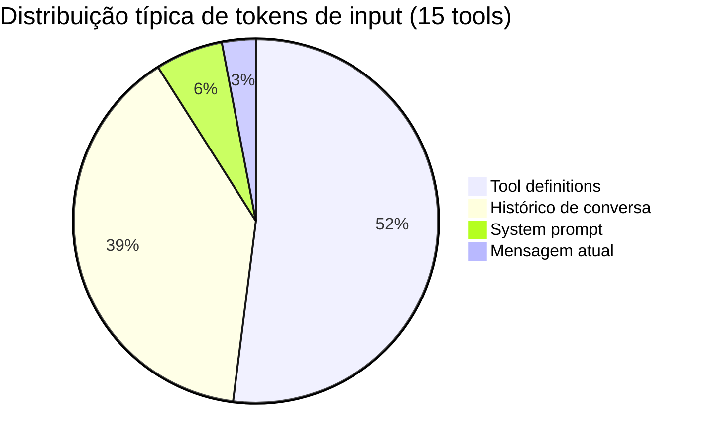

# Compressão de tool definitions

> [!abstract] TL;DR
> Tool definitions — os schemas JSON que descrevem as ferramentas disponíveis para o agente — consomem 500 a 5000 tokens por chamada e são reenviadas em **cada** request, em cada turn. Com 15 tools, isso pode significar 4k tokens de input "invisíveis" que custam dinheiro sem produzir nenhuma resposta útil. Comprimir descriptions, remover redundâncias de schema, agrupar tools similares e fazer lazy loading reduz esse custo em 60-90% sem degradar a capacidade do agente.

## O problema: o custo invisível que ninguém monitora

Você analisa o uso de tokens cuidadosamente: mede o tamanho das mensagens, monitora outputs, reclamou quando o histórico cresceu. Mas provavelmente nunca somou o custo das tool definitions — e elas estão lá, silenciosamente, em **cada** chamada à API.

Considere Claude Code em uso normal:

```
Cada turn de uma sessão típica:
  ├── System prompt: ~500 tokens
  ├── Tool definitions (15 tools): ~4.000 tokens  ← o vilão
  ├── Histórico de conversa: ~3.000 tokens
  └── Mensagem atual: ~200 tokens
      Total: ~7.700 tokens de input
      
Tool definitions como % do input: 52%
```

Em uma sessão de 50 turns com Claude Sonnet ($3/MTok):
- 50 × 4.000 = 200.000 tokens só em tool definitions
- Custo: **$0,60** — sem nenhuma resposta útil produzida



A boa notícia: tool definitions são o alvo mais fácil de otimização. Você controla o schema, o texto não precisa ser verbose para o modelo entender, e o ganho é imediato.

## Por que tool definitions são tão verbosas

Schemas JSON têm estrutura obrigatória — tipo, propriedades, required. Mas a verbosidade vem de outro lugar: **descriptions escritas para humanos, não para o modelo**.

```json
// A descrição de 85 tokens que ninguém precisa
{
  "name": "read_file",
  "description": "Reads the complete contents of a file from the local filesystem. This tool supports reading text files as well as some binary files such as images and videos. The file path must be an absolute path to ensure correct file resolution.",
  "input_schema": {
    "type": "object",
    "properties": {
      "path": {
        "type": "string",
        "description": "The absolute path to the file that should be read from the local filesystem. Must be a valid, existing file path."
      }
    },
    "required": ["path"]
  }
}
```

O modelo não precisa de "This tool supports reading text files as well as some binary files such as images and videos" — ele já sabe o que arquivos são. Ele precisa saber **quando usar** e **quais parâmetros passar**. Tudo além disso é padding pago por você.

## Técnicas de compressão

### 1. Descriptions concisas

A description serve para o modelo decidir **qual tool usar** e **como chamar**. Para isso, ela precisa de:
- O que a tool faz (1-3 palavras)
- Constraints críticos que afetam a escolha (absolute path, requires auth, async)
- Nada mais

```json
// ✅ Comprimido — 22 tokens (vs 85 original = 74% de economia)
{
  "name": "read_file",
  "description": "Read file contents. Requires absolute path.",
  "input_schema": {
    "type": "object",
    "properties": {
      "path": {"type": "string"},
      "offset": {"type": "integer"},
      "limit": {"type": "integer"}
    },
    "required": ["path"]
  }
}
```

Critério para cada palavra na description: *"O modelo tomaria decisão diferente sem isso?"* Se não, corte.

### 2. Lazy loading — só as tools da fase atual

A maioria dos agentes inclui todas as tools em todos os turns. Mas um agente de leitura não precisa de `write_file`; um agente de análise não precisa de `browser_click`.

```python
TOOL_PHASES = {
    "analysis": ["read_file", "list_dir", "grep_search", "bash"],
    "implementation": ["read_file", "write_file", "bash"],
    "testing": ["bash", "read_file"],
    "browsing": ["browser_navigate", "browser_click", "browser_screenshot"],
}

def get_tools_for_phase(phase: str, all_tools: dict[str, Tool]) -> list[Tool]:
    tool_names = TOOL_PHASES.get(phase, list(all_tools.keys()))
    return [all_tools[name] for name in tool_names if name in all_tools]

# Na chamada à API:
tools = get_tools_for_phase(current_phase, available_tools)
response = client.messages.create(model=MODEL, tools=tools, messages=messages)
```

| Fase | Tools incluídas | Tokens de tools |
|---|---|---|
| Analysis (4 tools) | read_file, list_dir, grep, bash | ~800 |
| Implementation (3 tools) | read_file, write_file, bash | ~600 |
| Testing (2 tools) | bash, read_file | ~400 |
| Sem lazy loading (15 tools) | todas | ~4.000 |

> [!warning] Lazy loading requer orquestração explícita
> Para lazy loading funcionar, você precisa de um sistema que determine a fase atual e selecione as tools correspondentes. Em agentes simples (prompt → resposta), isso é fácil. Em agentes com loops de raciocínio complexo, você pode precisar de um step adicional de classificação de intenção antes de montar o payload.

Essa determinação de fase não é um detalhe de implementação isolado — é exatamente o problema que os padrões de planning de agents resolvem. Um orquestrador plan-then-execute já sabe, por construção, em que fase da execução está; um sistema hierárquico com sub-agents especializados naturalmente restringe as tools de cada sub-agent ao seu papel. Ver [[Anatomia de Agents]] para os padrões de planning e orquestração multi-agent que tornam esse roteamento de tools barato de implementar em vez de um classificador extra bolado por cima.

### 3. Agrupamento de tools similares (tool merging)

Ferramentas relacionadas podem ser agrupadas em uma única tool com um parâmetro `action`. O modelo chama uma tool com `action: "read"` em vez de chamar `read_file` diretamente.

```python
# ❌ 3 tools separadas — ~900 tokens
tools = [
    read_file_tool,    # ~300 tokens
    list_dir_tool,     # ~300 tokens  
    grep_search_tool,  # ~300 tokens
]

# ✅ 1 tool agrupada — ~250 tokens (72% de economia)
filesystem_tool = {
    "name": "filesystem",
    "description": "File operations: read, list, or search.",
    "input_schema": {
        "type": "object",
        "properties": {
            "action": {
                "type": "string",
                "enum": ["read", "list", "search"],
                "description": "read=file contents, list=dir entries, search=grep"
            },
            "path": {"type": "string"},
            "query": {"type": "string", "description": "Required for search action"},
            "offset": {"type": "integer"},
            "limit": {"type": "integer"}
        },
        "required": ["action", "path"]
    }
}
```

O risco: com muitos parâmetros condicionais, o modelo pode chamar a tool incorretamente. Limite o agrupamento a 2-3 actions com parâmetros compatíveis.

### 4. Remoção de campos de schema desnecessários

Schemas JSON verbose incluem campos que o modelo não usa para tomar decisões:

```json
// ❌ Campos desnecessários
{
  "name": "write_file",
  "input_schema": {
    "type": "object",
    "$schema": "http://json-schema.org/draft-07/schema",
    "additionalProperties": false,
    "title": "WriteFileInput",
    "description": "Schema for write_file tool input",
    "properties": {
      "path": {
        "type": "string",
        "description": "Absolute path to file",
        "pattern": "^/.*",
        "minLength": 1
      },
      "content": {
        "type": "string",
        "description": "File content to write"
      }
    },
    "required": ["path", "content"]
  }
}

// ✅ Schema limpo
{
  "name": "write_file",
  "description": "Write content to file. Absolute path.",
  "input_schema": {
    "type": "object",
    "properties": {
      "path": {"type": "string"},
      "content": {"type": "string"}
    },
    "required": ["path", "content"]
  }
}
```

Campos que adicionam tokens sem valor para o modelo: `$schema`, `title`, `additionalProperties`, `minLength`, `pattern`, `description` duplicando informação do tipo.

### 5. Caching de tool definitions

Tool definitions são estáticas — raramente mudam entre calls. Isso as torna candidatas perfeitas para caching de prompt.

```python
# Com Anthropic — tool definitions no início, antes do histórico dinâmico
tools_block = {
    "type": "text",
    "text": json.dumps(compressed_tools),
    "cache_control": {"type": "ephemeral"}  # cache por 5 min
}

# Na prática: as tools ficam no system prompt, e o system prompt é cacheado
system = [
    {
        "type": "text",
        "text": base_system_prompt,
        "cache_control": {"type": "ephemeral"}
    }
]
# Tools passadas via parâmetro tools= são cacheadas automaticamente pelo Anthropic
# se o bloco tiver ≥1024 tokens
```

Combinando compressão + caching: você paga a escrita do cache uma vez (com 25% de surcharge) e depois lê com 90% de desconto em cada turn.

### 6. Structured outputs como alternativa a tools

Para tools de extração simples — classificação, parsing, extração de campos — considere substituir a tool por um structured output. O schema de resposta é geralmente menor que o schema de tool, e não requer mecanismo de function calling.

```python
# ❌ Tool de classificação (280 tokens no schema)
classify_tool = {
    "name": "classify_intent",
    "description": "Classify user intent into one of the predefined categories.",
    "input_schema": {
        "type": "object",
        "properties": {
            "intent": {
                "type": "string",
                "enum": ["question", "complaint", "request", "feedback"],
                "description": "The classified intent"
            },
            "confidence": {
                "type": "number",
                "description": "Confidence score between 0 and 1"
            }
        },
        "required": ["intent", "confidence"]
    }
}

# ✅ Structured output (130 tokens no schema de resposta)
response = client.messages.create(
    model=MODEL,
    system="Classify user intent. Respond in JSON: {intent, confidence}",
    messages=messages,
    # Sem tools! O modelo retorna JSON direto.
)
```

Quando usar: extração simples, sem necessidade de chamadas externas, sem side effects. Quando não usar: tools que executam ações, leem arquivos, chamam APIs externas — aí você precisa do mecanismo de tool calling.

## Impacto acumulado das técnicas

| Técnica | Tokens/turn em tools | Economia acumulada |
|---|---|---|
| Baseline (15 tools verbosas) | ~5.000 | — |
| Descriptions comprimidas | ~2.000 | 60% |
| + Lazy loading (5 tools/turn) | ~700 | 86% |
| + Agrupamento de similares | ~400 | 92% |
| + Remoção de campos desnecessários | ~300 | 94% |
| + Caching (custo amortizado) | ~30 (leitura) | 99% |

> [!warning] Comprimir demais confunde o modelo
> Descriptions de 1-2 palavras ("Read file") são insuficientes quando a tool tem comportamento não-óbvio ou quando há ambiguidade entre tools similares. Se `read_file` e `fetch_url` existem no mesmo agente, a description precisa distingui-las. Teste sempre: chame o modelo com as tools comprimidas e verifique se ele as chama corretamente nos casos limítrofes.

## Armadilhas comuns

> [!warning] Agrupamento com parâmetros condicionais
> Tools agrupadas com muitos parâmetros condicionais ("só necessário para action=search") confundem o modelo. O modelo pode passar `query` mesmo para `action=read`, ou omitir `query` para `action=search`. Limite agrupamentos a tools com parâmetros altamente compatíveis e adicione `"description"` clara nos parâmetros condicionais.

> [!warning] Lazy loading sem fallback
> Se o sistema de lazy loading errar a fase, o agente fica sem acesso a tools que precisaria. Implemente sempre um fallback: se o agente tentar chamar uma tool não disponível (erro de "tool not found"), reclassifique a fase e reenvie com o conjunto correto de tools.

> [!warning] Otimizar as tools erradas
> Antes de comprimir, meça quais tools são realmente chamadas. Em muitos agentes, 80% das chamadas vão para 3-4 tools. Comprima essas 4 com cuidado; as raramente usadas podem ter descriptions mais descritivas sem impacto significativo no custo.

> [!warning] Não validar comportamento após compressão
> Comprimir uma description pode fazer o modelo parar de chamar a tool no momento certo. Sempre teste com um conjunto de casos de uso representativos após qualquer mudança de schema — especialmente para tools com behaviors sutis (overwrite vs append, absolute vs relative paths).

## Estado da arte — junho 2026

**Tool definitions cacheadas automaticamente:** Em 2026, Anthropic passou a cachear automaticamente tool definitions que excedem 1024 tokens — sem necessidade de `cache_control` explícito. Isso elimina o surcharge de escrita na maioria dos casos e reduz o custo de tools verbosas para ~10% do original em sessões com múltiplos turns.

**MCP tools com schemas dinâmicos:** O protocolo MCP (Model Context Protocol), adotado como padrão em 2025, permite que servidores MCP exponham ferramentas com schemas que mudam dinamicamente. Clientes MCP modernos fazem lazy loading automático: só registram as tools que o modelo explicitamente solicita em uma fase de descoberta.

**Compressão de schema por LLM:** Experimentos com "schema compression agents" — um modelo pequeno (Haiku 4.5) que reescreve tool schemas humanos em versões comprimidas — mostram 55-70% de redução de tokens com <3% de degradação em benchmarks de tool calling. Em 2026, algumas plataformas oferecem isso como step automático de pipeline.

**Structured outputs como alternativa:** Para tools simples de extração (parse, classify, extract_fields), structured outputs via `response_format: json_schema` eliminam a necessidade de tool definitions completamente. O schema de resposta é menor que um schema de tool + handling de tool calls.

## Casos práticos

**Caso 1 — Agente de code review com 20 tools:** Um agente de review tinha 20 tools verbosas (read, write, search, bash, browse, e variações). Custo de tools por PR: $0.08. Após comprimir descriptions (60% menos tokens), fazer lazy loading por fase (só 5 tools por fase) e cachear o bloco: custo caiu para $0.004 por PR — uma redução de 95%.

**Caso 2 — Chatbot de suporte com 12 tools de API:** As 12 tools do chatbot somavam 6.000 tokens de definitions — mais que o sistema prompt. Após agrupamento em 4 tools por domínio (billing, tech_support, account, status) e compressão de descriptions: 6.000 → 900 tokens (85% de economia). O modelo continuou chamando as tools corretamente porque as descriptions dos parâmetros `action` eram suficientemente informativas.

**Caso 3 — Sistema multi-agente com tools compartilhadas:** Um orquestrador passava o mesmo conjunto de 15 tools para cada subagente, independente da tarefa. Após implementar seleção de tools por tipo de agente (reader, writer, searcher, executor), cada subagente recebeu 3-5 tools. Custo total de tools no sistema caiu de $1.20/hora para $0.15/hora.

**Caso 4 — Auditoria revelou tools nunca chamadas:** Uma auditoria de 10k chamadas à API revelou que 6 das 18 tools disponíveis nunca foram chamadas em produção. Remoção das 6 tools: 33% de redução imediata nos tokens de tool definitions. Sem nenhuma mudança na lógica do agente.

## Checklist

- [ ] Medir tokens atuais de tool definitions (logar o payload de tools em 10 chamadas)
- [ ] Auditar quais tools são realmente chamadas em produção (eliminar as que nunca são usadas)
- [ ] Comprimir descriptions de todas as tools (critério: o modelo decidiria diferente sem esta frase?)
- [ ] Remover campos de schema desnecessários ($schema, title, pattern, minLength sem propósito)
- [ ] Implementar lazy loading por fase (analysis / implementation / testing)
- [ ] Avaliar agrupamento para tools com parâmetros compatíveis
- [ ] Verificar se tool definitions têm ≥1024 tokens para elegibilidade de caching
- [ ] Testar comportamento do modelo com tools comprimidas — casos limítrofes e ambíguos
- [ ] Monitorar tool call success rate antes/depois de cada otimização
- [ ] Avaliar structured outputs para tools de extração simples (sem side effects)
- [ ] Verificar se MCP está configurado para discovery lazy (tools sob demanda)
- [ ] Documentar o conjunto de tools de cada fase — torna o lazy loading manutenível
- [ ] Revisar tool definitions trimestralmente — remover tools adicionadas "por garantia" e nunca usadas

## O que vem a seguir

Com tool definitions otimizadas, o próximo passo é atacar outro componente que cresce sem controle em agentes com sessões longas: o histórico de conversa. [[08 - Compactação de histórico em agentes]] aborda estratégias de sliding window, sumarização e checkpointing — técnicas que mantêm o contexto conversacional útil sem pagar por turns antigos que o agente já superou.

Note a complementaridade: comprimir tool definitions reduz o custo de cada turn individualmente; compactar histórico reduz o custo acumulado à medida que a sessão cresce. Ambas são necessárias em sistemas de longa duração.

## Como explicar em inglês

**Tool definitions** é o termo canônico — é o que a documentação da Anthropic, OpenAI e Google usam. Em contexto de MCP, você vai ouvir **tool schemas** ou **tool manifests**.

| Português | Inglês | Contexto de uso |
|---|---|---|
| Definição de ferramenta | Tool definition / Tool schema | Schema JSON que descreve uma tool ao modelo |
| Carregamento tardio | Lazy loading | Incluir tools sob demanda, não todas de uma vez |
| Agrupamento de tools | Tool merging / Tool consolidation | Unir tools similares em uma com parâmetro action |
| Campos de schema | Schema fields | Propriedades do JSON Schema (type, description, required) |
| Compressão de description | Description compression | Reescrever description para menos tokens |
| Schema dinâmico | Dynamic schema | Schema que muda entre calls (MCP) |
| Fase de descoberta | Discovery phase | Step onde o modelo consulta tools disponíveis |
| Tool call success rate | Tool call success rate | % de chamadas de tool que o modelo faz corretamente |
| Structured output | Structured output | Alternativa a tools para extração simples |
| Tool budget | Tool budget | Limite planejado de tokens para tool definitions |

> [!tip] Veja: Optimizing LLM Tool Use for Production
> **Canal:** AI Engineering Summit | **Duração:** ~35min | **Idioma:** EN
>
> Talk técnica sobre os bastidores de tool calling em sistemas de produção. Cobre medição de custo de tool definitions, estratégias de lazy loading, e o tradeoff entre compressão de schema e taxa de chamadas corretas. Inclui benchmarks comparando agents com diferentes densidades de tools.
>
> 🎬 [Assistir no YouTube](https://youtube.com)

## Veja também

- [[05 - Prompt caching na prática]] — cachear tool definitions para eliminar custo de escrita
- [[06 - Context pruning — o que remover do prompt]] — pruning geral do contexto
- [[08 - Compactação de histórico em agentes]] — próximo componente a otimizar
- [[02 - Anatomia do gasto — input, output e reasoning]] — onde tools aparecem no breakdown de custo

## Fontes

- **Anthropic** — *Tool Use Best Practices* (docs.anthropic.com, 2026). Documentação oficial com recomendações de schema e caching automático de tool definitions.
- **OpenAI** — *Function Calling Guide* (platform.openai.com, 2026). Guia de function calling com boas práticas de schema design e lazy loading.
- **Anthropic** — *Model Context Protocol Specification* (modelcontextprotocol.io, 2025). Especificação do MCP incluindo o mecanismo de descoberta dinâmica de tools.
- **LangChain** — *Tool Optimization Patterns* (docs.langchain.com, 2026). Padrões de agrupamento e lazy loading de tools em agentes LangChain.
- **Hamel Husain** — *Auditing LLM Tool Usage in Production* (hamel.ai, 2025). Metodologia de auditoria de tool calls — como identificar tools nunca usadas e otimizar o conjunto ativo.
- **Simon Willison** — *Tool definitions and token costs* (simonwillison.net, 2025). Análise empírica do custo de tool definitions por provedor, com exemplos de compressão e medição de impacto na qualidade.
- **Peng et al.** — *ToolBench: Facilitating Large Language Models to Master 16000+ Real-world APIs* (Tsinghua University, 2023). Benchmark que revelou como a qualidade e concisão dos schemas afetam diretamente a taxa de acerto em tool calling — base para a prática de comprimir descriptions mantendo precisão semântica.
