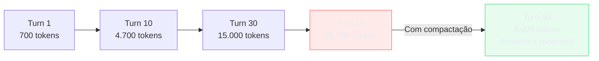

# Compactação de histórico em agentes

> [!abstract] TL;DR
> Em sessões longas, o histórico de conversa cresce linearmente — e cada turn adiciona tokens ao input de **todos** os turns seguintes. Sem compactação, uma sessão de 50 turns pode custar 10x mais que os primeiros 5 turns. A solução é substituir turns antigos por resumos densos que preservam o que importa: decisões tomadas, artefatos criados, constraints descobertos. Claude Code faz isso automaticamente via `/compact`; agentes custom precisam de rolling summarization ou anchored state documents. A regra: manter os últimos 8-10 turns completos e sumarizar o restante.

## O problema: o contexto que não para de crescer

Pense em uma conversa de 50 turns com um agente. No turno 1, você paga por 1 mensagem. No turno 50, você paga pelos 50 turns anteriores mais a pergunta atual. O custo **não é fixo por turn — ele cresce com cada turn**.

```
Turn 1:  system(500) + msg1(200) = 700 tokens de input
Turn 10: system(500) + turns 1-9(4000) + msg10(200) = 4.700 tokens
Turn 50: system(500) + turns 1-49(20.000) + msg50(200) = 20.700 tokens
```

Sem compactação, o custo médio por turn cresce linearmente. Em uma sessão de 50 turns com Claude Sonnet ($3/MTok):

- Turn médio sem compactação: ~10.000 tokens de input → $0,03
- Sessão completa: **$1,50 só de input**
- E isso assume que cada turn tem ~200 tokens de mensagem — sessões reais com código e tool outputs são 5-10x maiores

O paradoxo: o histórico que você acumula é, na maioria, contexto que o modelo já processou e do qual extraiu informação. Pagar para reenviá-lo integralmente em cada turn é como reimprimir um livro inteiro toda vez que você quer ler o próximo capítulo.



## Estratégias de compactação

### 1. Rolling summarization — janela deslizante com resumo

A estratégia mais comum: manter os últimos N turns completos e substituir os anteriores por um resumo compacto.

```python
KEEP_FULL_TURNS = 8       # turns recentes mantidos completos (user + assistant = 2 mensagens)
MAX_SUMMARY_TOKENS = 800  # teto para o bloco de resumo

def compact_history(messages: list[dict], model: str) -> list[dict]:
    """
    Compacta histórico mantendo os últimos KEEP_FULL_TURNS turns completos.
    Retorna nova lista de mensagens com bloco de resumo no início.
    """
    # Separa mensagens de sistema das de conversa
    system_msgs = [m for m in messages if m["role"] == "system"]
    conversation = [m for m in messages if m["role"] != "system"]
    
    # Quantos turns reais temos (user + assistant = 1 turn)
    turn_count = len(conversation) // 2
    
    if turn_count <= KEEP_FULL_TURNS:
        return messages  # muito cedo para compactar
    
    # Ponto de corte: manter os últimos KEEP_FULL_TURNS turns
    cutoff_index = (turn_count - KEEP_FULL_TURNS) * 2
    old_messages = conversation[:cutoff_index]
    recent_messages = conversation[cutoff_index:]
    
    # Resumir o histórico antigo
    summary = summarize_conversation(old_messages, model, MAX_SUMMARY_TOKENS)
    summary_block = {
        "role": "user",
        "content": f"[Contexto de sessão anterior — resumo compacto]\n{summary}"
    }
    # Marker de confirmação para o modelo saber que é contexto, não instrução
    ack_block = {
        "role": "assistant",
        "content": "Entendido. Tenho o contexto da sessão anterior."
    }
    
    return system_msgs + [summary_block, ack_block] + recent_messages

def summarize_conversation(messages: list[dict], model: str, max_tokens: int) -> str:
    summary_prompt = f"""
Você é um assistente de sumarização. Resuma esta conversa em até {max_tokens} tokens.

PRESERVE obrigatoriamente:
- Decisões de design tomadas (e por quê foram tomadas)
- Artefatos criados: arquivos criados/modificados, schemas, configurações
- Constraints descobertos: bugs encontrados, limitações de API, dependências implícitas
- O que foi DESCARTADO e por quê (evita retrabalho)

NÃO preserve:
- Diálogo casual ("ok", "entendi", "pode continuar")
- Raciocínio intermediário já superado por uma decisão posterior
- Conteúdo que o usuário explicitamente rejeitou
- Repetições de informação já capturada anteriormente no resumo

Formato: parágrafos densos. Sem bullets. Tempo presente. Sem introdução ("Este resumo cobre...").
"""
    response = client.messages.create(
        model=model,  # use modelo mais barato aqui: claude-haiku-4-5
        max_tokens=max_tokens,
        system=summary_prompt,
        messages=messages
    )
    return response.content[0].text
```

> [!warning] Use um modelo barato para sumarizar
> O custo da sumarização é real — você está fazendo uma chamada extra. Use `claude-haiku-4-5` para sumarizar (não Sonnet ou Opus). Um resumo de 30 turns em Haiku custa ~$0.002; em Sonnet, ~$0.015. Dado que você vai sumarizar frequentemente em sessões longas, a escolha do modelo de sumarização afeta o custo total da estratégia.

### 2. Anchored state document — documento de estado contínuo

Em vez de sumarizar retrospectivamente, mantenha um documento de estado que é atualizado a cada turn significativo. O estado substitui o histórico antigo.

```python
INITIAL_STATE = {
    "objetivo": "",
    "decisoes": [],       # lista de {decisao, motivo, turno}
    "artefatos": [],      # lista de {tipo, path, descricao}
    "constraints": [],    # lista de {constraint, origem}
    "descartado": [],     # lista de {item, motivo}
    "proximos_passos": []
}

def update_state_document(state: dict, new_turn: dict, model: str) -> dict:
    """Atualiza o documento de estado após cada turn."""
    update_prompt = f"""
Dado este turno de conversa, atualize o documento de estado.

ESTADO ATUAL:
{json.dumps(state, ensure_ascii=False, indent=2)}

NOVO TURNO:
User: {new_turn['user']}
Assistant: {new_turn['assistant']}

Retorne o estado atualizado em JSON. Adicione apenas informação nova — não repita o que já está no estado.
Remova de proximos_passos qualquer item que já foi completado neste turno.
"""
    response = client.messages.create(
        model="claude-haiku-4-5-20251001",
        max_tokens=1000,
        messages=[{"role": "user", "content": update_prompt}]
    )
    return json.loads(response.content[0].text)

# No sistema: manter só os últimos 5 turns + o state document
def build_context_with_state(state: dict, recent_turns: list) -> list[dict]:
    state_context = f"""[Estado atual da sessão]
Objetivo: {state['objetivo']}
Decisões: {'; '.join(d['decisao'] for d in state['decisoes'])}
Artefatos criados: {', '.join(a['path'] for a in state['artefatos'])}
Constraints: {'; '.join(c['constraint'] for c in state['constraints'])}
"""
    messages = [
        {"role": "user", "content": state_context},
        {"role": "assistant", "content": "Ciente do estado atual da sessão."}
    ]
    return messages + recent_turns
```

### 3. Observation masking — remover turns de baixo valor

Nem todos os turns valem a mesma coisa. Turns que podem ser mascarados (substituídos por placeholder) sem perda de contexto:

| Tipo de turn | Candidato a mascaramento? | Critério |
|---|---|---|
| Retries falhados de tool call | ✅ Sim | Tool retornou erro corrigido no turn seguinte |
| Leituras de arquivo já modificado | ✅ Sim | O arquivo mudou; o conteúdo lido é obsoleto |
| Explicações redundantes | ✅ Sim | O mesmo conceito explicado 2+ vezes |
| Mensagens curtas de confirmação | ✅ Sim | "ok", "entendi", "pode continuar" |
| Debugging descartado | ✅ Sim | Hipótese testada e rejeitada explicitamente |
| Decisão ativa e seus fundamentos | ❌ Não | Fundamento pode ser necessário para decisão futura |
| Último estado de um artefato | ❌ Não | Versão atual de um arquivo ou schema |

```python
def mask_low_value_turns(messages: list[dict]) -> list[dict]:
    """
    Substitui turns de baixo valor por placeholder compacto.
    Economiza tokens sem sumarização.
    """
    result = []
    for i, msg in enumerate(messages):
        # Mask: retries falhados (tool_result com error seguido de tool_result com success)
        if is_failed_tool_retry(msg, messages, i):
            result.append({
                "role": msg["role"],
                "content": "[tool call failed — retried successfully in next turn]"
            })
        # Mask: confirmações curtas
        elif msg["role"] == "assistant" and len(msg["content"]) < 20:
            result.append({
                "role": msg["role"],
                "content": "[acknowledgment]"
            })
        else:
            result.append(msg)
    return result
```

### 4. Context compaction automático (Claude Code / IDEs)

Claude Code implementa compactação automática quando o contexto ultrapassa um threshold configurável. O `/compact` pode ser disparado manualmente ou automaticamente.

```bash
# Manual — compacta com instrução personalizada
/compact Preserve: decisões de arquitetura, arquivos criados, bugs encontrados

# Automático — configurável em settings.json
{
  "maxContextWindowUsage": 0.8,  # compacta quando 80% da janela está usada
  "compactModel": "claude-haiku-4-5"  # modelo para sumarização
}
```

Melhores práticas com `/compact` e `/clear`:

- **`/clear`** — use ao mudar completamente de tarefa. O histórico da tarefa anterior é custo puro na nova.
- **`/compact`** — use proativamente quando a sessão já cobriu muitas subtarefas e o histórico inicial não é mais relevante.
- **Meta de custo saudável**: manter o contexto abaixo de 80k tokens para sessões com Sonnet ($3/MTok = $0,24/turno em 80k tokens de input).

### 5. Gerenciamento proativo de sessão

A compactação automática é um safety net, não uma estratégia primária. Times com disciplina de sessão gastam menos mesmo com compactação desativada.

**`/clear` — quando mudar de tarefa:** O histórico de uma tarefa é custo puro na tarefa seguinte. Se você terminou de corrigir um bug no CSS e vai começar a refatorar o banco de dados, cada token do debug CSS é uma fatura que o modelo lê sem usar.

```
Regra: mudou de domínio? /clear.
Exemplos que justificam /clear:
  - Terminou o bug → vai para nova feature
  - Terminou análise → vai para implementação (se análise foi longa)
  - Terminou uma sessão de refactoring → vai revisar PRs
  - Bug resolvido → começa task de documentação
```

**`/compact` proativo — antes de ficar pesado:** Não espere o contexto saturar. Uma heurística útil: quando você percebe que os primeiros turns da sessão não são mais relevantes para a tarefa atual, compacte. Threshold saudável: abaixo de 100k tokens de contexto total.

```bash
# Compactação com instrução personalizada (Claude Code 2026)
/compact Preserve: architecture decisions, files created, API constraints discovered. 
         Discard: failed debug attempts, file contents already modified, ack messages.
```

**Sessões curtas focadas vs. sessões maratona:** Uma sessão de 8 horas com 300+ turns tem custo de compactação progressivo que supera o benefício do cache warm. Prefira sessões de 1-2 horas por tarefa específica — o custo de retomar contexto via state document é menor que manter uma sessão crescente.

## Impacto em custo

| Sessão de 50 turns | Sem compactação | Rolling summarization | Anchored state |
|---|---|---|---|
| Input total (tokens) | ~2.000.000 | ~500.000 | ~350.000 |
| Custo (Sonnet $3/MTok) | ~$6,00 | ~$1,50 | ~$1,05 |
| Economia | — | 75% | 82% |
| Risco de perda de contexto | Baixo | Médio | Baixo |

*Estimativas para sessão com turns de ~400 tokens de mensagem + 200 tokens de resposta.*

## Armadilhas comuns

> [!warning] Resumos que apagam o raciocínio de decisão
> Resumidores genéricos preservam fatos ("criamos o arquivo X") mas apagam motivação ("criamos X em vez de Y porque Y tem race condition com o sistema de cache"). A motivação é exatamente o que o agente vai precisar quando uma decisão similar aparecer. Instrua o summarizer explicitamente a preservar o **motivo** de cada decisão, não só o resultado.

> [!warning] Compactar turns recentes demais
> Manter poucos turns completos (1-2) é perigoso: o modelo perde o fio da conversa atual. O threshold mínimo seguro é 5 turns completos; 8-10 é o recomendado. Menos do que isso, e a compactação começa a degradar a coerência da resposta seguinte.

> [!warning] Sessões de 8+ horas sem `/clear`
> Sessões maratona são o maior ralo de tokens. Mesmo com compactação, o overhead acumula. Uma sessão de 8 horas pode ter 300+ turns — o custo de compactação + overhead de contexto supera o custo de iniciar sessões focadas e usar `/clear` entre tarefas. Prefira sessões de 1-2 horas por tarefa específica.

> [!warning] Mascarar turns antes de analisar dependências
> Antes de mascarar um turn como "baixo valor", verifique se ele é referenciado explicitamente por um turn posterior ("como você disse antes...", "retomando o erro do turn anterior"). Mascarar um turn referenciado cria incoerência difícil de debugar.

## Quando cada estratégia faz sentido

Não existe estratégia única certa. A escolha depende do tipo de agente e da natureza das sessões:

| Tipo de agente | Estratégia recomendada | Motivo |
|---|---|---|
| Chatbot de suporte (1 sessão = 1 ticket) | Rolling summarization | Sessões curtas, contexto linear |
| Agente de coding com sessões longas | Anchored state + /compact | Decisões de arquitetura precisam sobreviver |
| Multi-agente com subagentes paralelos | Anchored state compartilhado | Cada subagente lê o estado, não o histórico completo |
| Pipeline automatizado (sem usuário) | Observation masking | Remove retries e acks automaticamente |
| IDE com sessões de 8h | /clear por tarefa + rolling sum. | Combinação cobre sessões longas e mudanças de contexto |

A pergunta central para escolher: **"O que precisa sobreviver de uma sessão para a próxima?"** Se a resposta é "tudo", rolling summarization. Se é "só o estado do projeto", anchored state. Se é "nada", /clear é suficiente.

## Estado da arte — junho 2026

**Compactação com instrução personalizada:** Claude Code passou a aceitar instruções de compactação customizadas em 2026 — você especifica o que preservar e o que descartar. Times de produto que trabalham em feature específica instruem o compactor a preservar "decisions about the checkout flow and payments integration" e descartar "any debugging context from unrelated bugs".

**Memory-augmented agents (MemGPT / Letta):** O framework MemGPT (hoje Letta) popularizou a arquitetura de memória em camadas: memória de trabalho (janela atual), memória de núcleo (estado do agente), memória arquivada (histórico compactado persistente). Em 2026, essa arquitetura é implementada nativamente por alguns provedores e como middleware por frameworks como LangMem.

> [!info] LangMem — o padrão de "duas velocidades" para extrair memória
> LangMem (SDK open-source da LangChain para agentes LangGraph) resolve um problema adjacente à compactação: não apaga o turn antigo, **extrai** dele o que vale persistir. A pergunta que o motor responde é: "desse turn que está prestes a sair da janela, o que sobra depois de descartar o resto?"
>
> O SDK distingue três tipos de memória — **semântica** (fatos e preferências: "o usuário prefere respostas em PT-BR"), **episódica** (exemplos concretos de interações passadas, úteis como few-shot) e **procedural** (regras de comportamento aprendidas, tipo um system prompt que se refina sozinho). Cada tipo tem um formato de armazenamento e um gatilho de recuperação diferentes — não é um único "resumo", é um esquema de memória tipado.
>
> A parte que interessa para compactação é a extração em **duas velocidades**:
> - **Hot path** — ferramentas que o próprio agente chama durante a conversa para gravar algo relevante agora (equivalente a um `save_memory()` explícito).
> - **Background** — um processo separado que varre o histórico *depois* da sessão terminar e extrai memórias que o agente não capturou em tempo real, sem competir por tokens da janela ativa.
>
> Isso separa duas responsabilidades que a compactação tradicional (rolling summarization) mistura: comprimir o histórico *para a sessão atual* continuar barata, e extrair conhecimento *para sessões futuras* reaproveitarem. Um agente pode compactar agressivamente (via `/compact` ou janela deslizante) e ainda reter, via LangMem, as poucas memórias que sobrevivem entre sessões — sem precisar reenviar histórico bruto.
>
> Status: SDK ativo em junho de 2026 (commits recentes, não arquivado), citado na documentação 1.0 da LangChain como opção de memória de longo prazo ao lado dos checkpointers do LangGraph — mas ainda pré-1.0 (release mais recente 0.0.30, de outubro de 2025), sinal de API ainda em maturação.
>
> Para quem já usa anchored state document (estratégia 2 desta nota): LangMem generaliza a ideia — em vez de um único documento de estado ad-hoc, formaliza o esquema (semântica/episódica/procedural) e delega a extração pra um processo em background, reduzindo o trabalho manual de decidir "o que vai pro estado" a cada turn.
>
> O trade-off: mais estrutura custa mais setup (storage compatível com `BaseStore` do LangGraph, definição dos schemas de cada tipo de memória) — vale a pena para agentes que já rodam sobre LangGraph; para um agente custom simples, um anchored state document manual ainda é mais barato de implementar.

**Checkpoint automático antes de `/clear`:** Ferramentas como Aider implementam checkpoint automático: antes de qualquer operação destrutiva no histórico, serializam o estado atual em disco. Isso permite "reabrir" uma sessão anterior com o contexto compactado em um formato recuperável.

**Compactação guiada por grafo de dependência:** Pesquisas de 2026 mostram que compactadores que analisam dependências entre turns (turn A mencionado em turn C → preservar A se C é recente) produzem resumos mais precisos que os puramente sequenciais.

## Casos práticos

**Caso 1 — Sessão de debugging de 4 horas:** Uma sessão de debugging de backend acumulou 80 turns. Os primeiros 40 eram sobre um bug já resolvido. Custo sem compactação: $3,20. Após implementar rolling summarization (sumarizar turns 1-30 em 800 tokens, manter 31-80 completos): custo caiu para $1,10 — e o agente parou de "lembrar" soluções descartadas como candidatas válidas.

**Caso 2 — Agente de refactoring de monorepo:** Um agente de refactoring precisava de contexto de sessões anteriores (decisões de nomenclatura, convenções estabelecidas). Anchored state document com 500 tokens de estado persistente permitiu retomar sessões sem reenviar histórico. Cada nova sessão começa com 500 tokens de estado em vez de 50k de histórico.

**Caso 3 — Chatbot de suporte com turnos longos:** Cada turno de suporte técnico podia ter 2.000 tokens (logs, stack traces). Após 20 turns, o contexto tinha 40k tokens de logs potencialmente irrelevantes. Observation masking de retries falhados + leituras de arquivos modificados reduziu o histórico em 35% sem impacto na qualidade de resposta.

**Caso 4 — `/clear` como hábito de time:** Um time de desenvolvimento adotou a regra: `/clear` antes de cada novo feature. Em 3 meses, o custo mensal de API caiu 28% — sem nenhuma mudança técnica, só disciplina de sessão.

## Checklist

- [ ] Determinar estratégia de compactação: rolling summarization ou anchored state
- [ ] Configurar threshold de compactação (recomendado: 80% da janela ou 80k tokens)
- [ ] Usar modelo barato (Haiku) para sumarização — não Sonnet/Opus
- [ ] Instruir o summarizer a preservar: decisões + motivos, artefatos criados, constraints descobertos
- [ ] Manter mínimo de 8 turns completos antes do ponto de corte
- [ ] Implementar observation masking para retries falhados e confirmações curtas
- [ ] Adotar `/clear` como hábito ao mudar de tarefa
- [ ] Monitorar custo por sessão antes/depois de ativar compactação

## O que vem a seguir

Até aqui, as otimizações foram sobre **o que colocar** (ou não) no contexto. O próximo vetor é sobre **qual modelo usar** para cada parte do trabalho. [[09 - Model routing — modelo certo para a tarefa]] cobre como selecionar dinamicamente entre modelos de custo e capacidade diferentes — usando Haiku para tarefas simples e Opus só quando realmente necessário, sem degradar a qualidade onde ela importa.

## Como explicar em inglês

**Context compaction** é o termo do Claude Code; **history summarization** é mais genérico e aparece em papers e frameworks. **Rolling window** descreve o padrão de janela deslizante. **Memory-augmented** agentes são aqueles com memória persistente além da janela de contexto.

| Português | Inglês | Contexto de uso |
|---|---|---|
| Compactação de contexto | Context compaction | Termo específico do Claude Code |
| Sumarização de histórico | History summarization | Termo genérico para compactar turns antigos |
| Janela deslizante | Sliding / Rolling window | Manter N turns mais recentes completos |
| Documento de estado | State document / State manifest | Registro contínuo do estado da sessão |
| Mascaramento de observação | Observation masking | Substituir turns de baixo valor por placeholder |
| Checkpoint de sessão | Session checkpoint | Serialização de estado antes de /clear |
| Memória de núcleo | Core memory | Memória persistente em MemGPT/Letta |
| Memória arquivada | Archival memory | Histórico compactado persistente no MemGPT |
| Ponto de corte | Cutoff point | Índice onde o histórico começa a ser sumarizado |
| Turno de baixo valor | Low-value turn | Turn que pode ser mascarado sem perda de contexto |

> [!tip] Veja: MemGPT — Towards LLMs as Operating Systems
> **Canal:** Stanford AI Lab | **Duração:** ~52min | **Idioma:** EN
>
> Apresentação original do paper MemGPT — o trabalho que formalizou a arquitetura de memória em camadas para agentes. Explica o mecanismo de paging de memória (analogia com sistema operacional) e como o agente decide o que mover para archival memory. Essencial para entender o fundamento teórico de compactação de contexto.
>
> 🎬 [Assistir no YouTube](https://youtube.com/watch?v=nQmZmFERmrg)

## Veja também

- [[06 - Context pruning — o que remover do prompt]] — remover antes de sumarizar
- [[07 - Compressão de tool definitions]] — otimizar o outro componente que cresce por turn
- [[09 - Model routing — modelo certo para a tarefa]] — usar modelo barato para sumarização
- [[05 - Prompt caching na prática]] — cachear o bloco de resumo entre turns

## Fontes

- **Charles Packer et al.** — *MemGPT: Towards LLMs as Operating Systems* (Berkeley AI Research, 2023). Papel fundacional da arquitetura de memória em camadas para agentes de longa duração.
- **Letta** — *Memory Architecture in Production Agents* (letta.ai/blog, 2025). Como a Letta (ex-MemGPT) implementa memória persistente em produção — incluindo compactação automática e retrieval de archival memory.
- **Anthropic** — *Claude Code Context Management* (docs.anthropic.com, 2026). Documentação do `/compact`, configuração de threshold e melhores práticas de `/clear`.
- **Aider** — *Managing large codebases with aider* (aider.chat/docs, 2025). Como o Aider implementa sliding window e checkpoint automático antes de compactação.
- **Zhu et al.** — *LongAgent: Scaling Language Models to 128k Context through Multi-Agent Collaboration* (2024). Abordagem de multi-agente para contornar limites de contexto — base teórica para estratégias de compactação distribuída.
- **Simon Willison** — *Managing long conversations with LLMs* (simonwillison.net, 2025). Análise prática de estratégias de compactação com exemplos em Python — inclui benchmarks de custo comparando rolling summarization vs full context.
- **LangChain** — *LangMem SDK* (docs oficiais, 2026). Arquitetura de memória semântica/episódica/procedural e extração hot-path vs background; SDK ativo em jul/2026, pré-1.0 (v0.0.30, confirmado no PyPI). [langchain-ai.github.io/langmem](https://langchain-ai.github.io/langmem/) · [pypi.org/project/langmem](https://pypi.org/project/langmem/)
