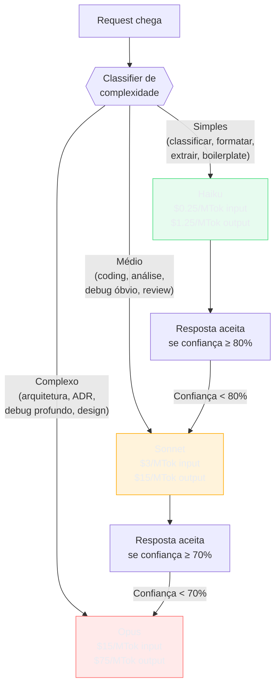

# Model routing — modelo certo para a tarefa

> [!abstract] TL;DR
> Model routing direciona cada tarefa para o modelo com melhor custo-benefício: Haiku para classificação e boilerplate, Sonnet para coding e análise do dia a dia, Opus para raciocínio arquitetural e debugging profundo. A diferença de custo entre tiers é de 10-50x — mas a diferença de qualidade na maioria das tarefas é de 0-15%. Isso significa que enviar tudo para Opus é como contratar consultor sênior para escrever e-mails: caro, desnecessário, e o sênior fica entediado. Com routing bem calibrado, redução de 40-70% em custo sem degradação perceptível.

## O problema: um modelo serve para tudo?

O setor de IA empurra a narrativa de que o modelo mais caro é sempre o melhor. Isso é verdade em benchmarks — mas benchmark não é produção.

Em produção, a distribuição real de tarefas é algo assim:

```
Análise de 1.000 requests em um sistema de coding assistente típico:
  - 45%: classificação, formatação, extração simples → Haiku suficiente
  - 35%: geração de código médio, análise de bug óbvio → Sonnet suficiente
  - 15%: refactoring com constraints complexos, design de API → Sonnet/Opus
  -  5%: arquitetura distribuída, debugging de concorrência, ADRs → Opus justificado
```

Se você usa Opus para todos os 1.000 requests, paga preço de Opus para as 450 tarefas que Haiku resolveria com a mesma qualidade. Model routing é o sistema que faz essa seleção automaticamente — ou semiautomaticamente, com convenções.



## A pirâmide de routing — o que vai para cada tier

### Tier 1 — Haiku / Flash-Lite (budget)

Custo: ~$0.25-0.40/MTok input. Velocidade: muito alta. Use quando:

| Caso de uso | Por que Haiku é suficiente |
|---|---|
| Classificação de intent | Modelo pequeno classifica com ≥90% de acerto em categories bem definidas |
| Extração de campos de JSON/XML | Task estruturada sem ambiguidade |
| Formatação de texto (markdown, camelCase, etc.) | Sem raciocínio, só transformação |
| Geração de testes boilerplate | Estrutura repetitiva, baixa criatividade |
| Sumarização de histórico de sessão | [[08 - Compactação de histórico em agentes]] — o compactor deve usar Haiku |
| Verificação de checklist (sim/não) | Resposta binária com contexto claro |
| Tradução de termos técnicos | Sem nuance de registro literário |

### Tier 2 — Sonnet / GPT-4.1 (mid-tier)

Custo: ~$3/MTok input. Velocidade: alta. Use quando:

| Caso de uso | Por que Sonnet é o ponto ideal |
|---|---|
| Coding do dia a dia (features, bugfixes) | Qualidade de Opus em tarefas comuns, 5x mais barato |
| Code review de PR médio | Analisa corretamente em 80%+ dos casos |
| Debugging de bug com stack trace claro | Lê o erro, propõe fix — Opus daria a mesma resposta |
| Análise de requisitos de feature | Boa capacidade de raciocínio sem o custo de flagship |
| Geração de documentação técnica | Prose de qualidade sem raciocínio filosófico |
| RAG com contexto de média complexidade | Recupera e sintetiza bem sem esforço extra |

### Tier 3 — Opus / Claude-4-Sonnet-Thinking (flagship)

Custo: ~$15/MTok input. Velocidade: menor. Reserve para:

| Caso de uso | Por que Opus é justificado |
|---|---|
| Arquitetura de sistema distribuído | Raciocínio multi-etapa com trade-offs entre dezenas de variáveis |
| Debugging de concorrência ou race condition | Requer manter modelo mental complexo de estado concorrente |
| ADRs e decisões técnicas de longo prazo | Consequências de longo prazo exigem raciocínio profundo |
| Refactoring com múltiplas constraints não óbvias | Sonnet otimiza para o óbvio; Opus considera edge cases |
| Análise de segurança e threat modeling | Alta penalidade por falsos negativos |

> [!warning] Opus não é sempre melhor — apenas mais caro
> Em tarefas bem definidas e estruturadas, Sonnet frequentemente produz output idêntico ao Opus. A diferença se manifesta em: raciocínio multi-etapa com muitas variáveis interdependentes, tarefas que exigem conhecimento de domínio obscuro, e situações onde o modelo precisa de "bom senso" sofisticado. Para coding rotineiro, Opus é Sonnet com fatura maior.

## Como escolher: o menor que passa no seu teste

A pirâmide acima diz onde cada tier costuma servir. Ela não decide por você, porque **benchmark não é a sua tarefa**. Um leaderboard mede a capacidade média num conjunto de problemas que alguém escolheu; o que você precisa saber é se o modelo acerta *a sua* extração de laudo, *o seu* roteamento de ticket, *o seu* diff. São perguntas diferentes, e a segunda só tem uma resposta empírica.

A heurística que substitui a discussão de opinião cabe numa frase: **o modelo certo é o menor que passa no seu teste.** O processo tem quatro passos e leva cerca de um dia:

1. **Escreva 20 casos reais** da sua tarefa, com a resposta certa ao lado. Não são casos inventados nem gerados por IA — são inputs que já passaram pelo seu sistema. É o mesmo artefato de [[03-Dominios/Tecnologia/IA/Evaluation/02 - Golden datasets — como construir|golden dataset]]; se ele já existe, pule este passo.
2. **Rode nos três candidatos** — o pequeno, o médio e o topo de linha — sem mudar mais nada.
3. **Compare na mesma tabela**: acerto, custo por caso e latência p95. Uma linha por modelo. As três colunas juntas, porque decidir só por acerto é como escolher banco de dados só por benchmark de escrita.
4. **Fique com o menor que passa** no seu limiar de qualidade. E refaça quando sair modelo novo — leva uma hora, e o resultado muda com mais frequência do que se imagina.

> [!warning] As quatro armadilhas dessa decisão
> **Leaderboard como veredito** — serve para montar a lista de candidatos, nunca para decidir. **Nome do modelo no meio do código** — o melhor modelo para uma tarefa muda a cada poucos meses; o identificador vive em configuração, sempre. **Testar três exemplos no chat** — isso é impressão, não avaliação; três casos não distinguem 94% de 88%. **Trocar de modelo sem rodar eval** — é trocar um bug conhecido por um bug desconhecido, e o novo você só descobre em produção.

O passo 4 é onde mora a decisão de produto, e ela não é técnica. Suponha um classificador de intenção em que o topo de linha acerta ~96% e o modelo pequeno com cinco exemplos no prompt acerta ~94%, a uma ordem de grandeza menos de custo. Dois pontos percentuais valem a diferença? Numa triagem que tem revisão humana depois, não valem — o humano pega os erros. Num laudo que vai direto ao cliente, valem, e talvez nem 96% baste. **A resposta vem do produto, nunca do benchmark** — e é por isso que o passo 1 (casos reais, com gabarito) é o que sustenta todos os outros.

## Implementação de routing

### 1. Routing manual — convenções de time

A implementação mais simples e frequentemente suficiente: defina regras claras de qual modelo usar para cada tipo de tarefa e faça o time seguir.

```markdown
# Convenções de model routing (CLAUDE.md ou AGENTS.md)

## Modelo padrão: Sonnet
Use Sonnet para todas as tasks de coding rotineiro.

## Escale para Opus quando:
- Decisão de arquitetura com impacto cross-sistema
- Debugging de bug com mais de 2 horas sem solução
- Refactoring que afeta mais de 5 módulos
- ADR ou design doc de feature crítica

## Downgrade para Haiku quando:
- Sumarização de histórico ou contexto
- Classificação de intent em pipelines
- Geração de testes para funções puras e simples
- Formatação e padronização de texto
```

### 2. Routing automático por classifier

Para sistemas de produção, um classifier determina o tier antes de cada request:

```python
from anthropic import Anthropic

client = Anthropic()

COMPLEXITY_CLASSIFIER_PROMPT = """
Classifique a complexidade desta tarefa:
- simple: extração, formatação, classificação, boilerplate, sim/não
- medium: coding padrão, análise com contexto claro, review de PR médio
- complex: arquitetura, debugging de concorrência, ADR, design cross-sistema

Responda apenas: simple, medium, ou complex.
Task: {task}
"""

TIER_MAP = {
    "simple": "claude-haiku-4-5-20251001",
    "medium": "claude-sonnet-4-6",
    "complex": "claude-opus-4-8",
}

def route_and_call(task: str, messages: list[dict]) -> str:
    # Classificação com Haiku (custo mínimo)
    classification = client.messages.create(
        model="claude-haiku-4-5-20251001",
        max_tokens=10,
        messages=[{
            "role": "user",
            "content": COMPLEXITY_CLASSIFIER_PROMPT.format(task=task)
        }]
    ).content[0].text.strip()
    
    model = TIER_MAP.get(classification, "claude-sonnet-4-6")
    
    response = client.messages.create(
        model=model,
        max_tokens=4096,
        messages=messages
    )
    
    return response.content[0].text, classification, model
```

O custo do classifier (Haiku, ~10 tokens de output) é desprezível comparado ao ganho de não usar Opus desnecessariamente.

### 3. Model cascading — escalar on demand

Em vez de classificar antes, execute com modelo budget e escale se necessário:

```python
CONFIDENCE_THRESHOLD = {
    "haiku": 0.80,   # escala para Sonnet se confiança < 80%
    "sonnet": 0.65,  # escala para Opus se confiança < 65%
}

def cascade_call(
    messages: list[dict],
    start_model: str = "claude-haiku-4-5-20251001"
) -> tuple[str, str]:
    """
    Tenta o modelo mais barato primeiro.
    Escala automaticamente se confiança for baixa.
    Retorna (resposta, modelo_usado).
    """
    cascade = [
        "claude-haiku-4-5-20251001",
        "claude-sonnet-4-6",
        "claude-opus-4-8",
    ]
    
    start_index = cascade.index(start_model)
    
    for model in cascade[start_index:]:
        response = client.messages.create(
            model=model,
            max_tokens=4096,
            messages=messages + [{
                "role": "user",
                "content": "Após responder, avalie sua confiança de 0-100. Formato: CONFIANCA: <N>"
            }]
        )
        
        text = response.content[0].text
        confidence = extract_confidence(text)  # parse "CONFIANCA: 85"
        
        threshold = CONFIDENCE_THRESHOLD.get(model.split("-")[1], 0)
        
        if confidence >= threshold * 100 or model == cascade[-1]:
            return text, model
    
    return text, model  # fallback
```

**Trade-off:** cascading aumenta latência (múltiplas chamadas) mas garante que você só paga Opus quando o modelo mais barato realmente não consegue resolver.

### 3b. Routing por regras determinísticas (sem classifier LLM)

Para evitar a latência de um classifier baseado em LLM, use regras baseadas em features do request:

```python
def classify_by_rules(prompt: str, context: dict) -> str:
    """
    Classifier determinístico — zero latência adicional.
    Mais frágil que LLM classifier, mas zero overhead.
    """
    prompt_lower = prompt.lower()
    prompt_len = len(prompt.split())
    
    # Sinais de complexidade alta → Opus
    complex_keywords = [
        "architecture", "distributed", "race condition", "deadlock",
        "design", "trade-off", "migration", "refactor across",
        "arquitetura", "decisão", "ADR", "trade-off"
    ]
    if any(kw in prompt_lower for kw in complex_keywords):
        return "complex"
    
    # Sinais de task simples → Haiku
    simple_keywords = [
        "format", "classify", "extract", "summarize", "translate",
        "yes or no", "true or false", "formatar", "classificar", "extrair"
    ]
    if any(kw in prompt_lower for kw in simple_keywords) and prompt_len < 100:
        return "simple"
    
    # Prompts muito curtos → provavelmente simples
    if prompt_len < 30:
        return "simple"
    
    # Default: médio
    return "medium"

TIER_MAP = {
    "simple": "claude-haiku-4-5-20251001",
    "medium": "claude-sonnet-4-6",
    "complex": "claude-opus-4-8",
}
```

Esse padrão é suficiente para 80% dos casos e tem latência zero. O classifier LLM só vale o overhead quando a distribuição de tasks é ambígua e o custo de classificação errada é alto.

### 4. Routing por fase em agentes multi-step

Agentes com múltiplas fases podem usar modelos diferentes em cada fase:

```python
PHASE_MODELS = {
    "planning": "claude-opus-4-8",         # planejar bem vale o custo
    "implementation": "claude-sonnet-4-6",  # execução é Sonnet
    "testing": "claude-haiku-4-5-20251001", # verificar output simples é Haiku
    "summarization": "claude-haiku-4-5-20251001",  # compactar histórico é Haiku
}

def run_agent_with_routing(task: str) -> dict:
    results = {}
    
    # Fase 1: Planning com Opus
    results["plan"] = call_model(PHASE_MODELS["planning"], planning_prompt(task))
    
    # Fase 2: Implementation com Sonnet
    results["code"] = call_model(PHASE_MODELS["implementation"], 
                                  implement_prompt(task, results["plan"]))
    
    # Fase 3: Testing com Haiku
    results["tests"] = call_model(PHASE_MODELS["testing"],
                                   test_prompt(results["code"]))
    
    return results
```

## Economia real por distribuição de tarefas

| Distribuição de requests | Tudo Opus | Routing Haiku/Sonnet/Opus | Economia |
|---|---|---|---|
| 60% simples / 30% médio / 10% complexo | $100/mês | $18/mês | **82%** |
| 30% simples / 50% médio / 20% complexo | $100/mês | $38/mês | **62%** |
| 10% simples / 60% médio / 30% complexo | $100/mês | $55/mês | **45%** |
| Tudo médio (sem routing) | $100/mês | $100/mês | — |

*Estimativas baseadas em preços de junho/2026: Haiku $0.25/Sonnet $3/Opus $15 (input, /MTok)*

> [!warning] Routing errado é pior que não fazer routing
> Enviar tarefa complexa para Haiku por engano gera resposta errada que exige retry — você acaba pagando o custo de Haiku + o custo de Sonnet para corrigir. Calibre o classifier com dados reais do seu sistema antes de colocar em produção. Sem métricas de qualidade por tier, você não sabe se está economizando ou gerando retrabalho.

## Armadilhas comuns

> [!warning] Não monitorar qualidade por modelo
> Routing sem observabilidade é operar cego. Você precisa de métricas separadas por tier: taxa de acerto, taxa de retry, satisfação de usuário (se aplicável). Sem isso, você não sabe se o Haiku está entregando "bom o suficiente" ou gerando retrabalho sistêmico.

> [!warning] Overhead de latência do classifier
> Um classifier de complexidade adiciona 100-300ms de latência por request. Para sistemas interativos (IDE, chatbot), isso pode ser perceptível. Alternativa: usar regras determinísticas em vez de LLM para classificar (palavras-chave, comprimento de prompt, tipo de tarefa).

> [!warning] Cascading com prompts sensíveis à instrução
> O cascade pattern adiciona a instrução "avalie sua confiança" no final da mensagem. Isso pode interferir com prompts que têm formato de output muito rígido. Considere alternativa: cascading baseado em verificador externo (outro modelo avalia a qualidade da resposta) em vez de auto-avaliação.

## Estado da arte — junho 2026

**Routing automático como feature de plataforma:** Em 2026, plataformas como AWS Bedrock, Azure AI e VertexAI oferecem model routing automático como feature nativa — você define um SLA de qualidade e a plataforma seleciona o modelo mais barato que atende. A latência de routing caiu de 200-500ms para 20-50ms com classifiers especializados.

**RouteLLM (Stanford):** Framework open-source de routing que usa preference data para treinar classifiers de complexidade. Demonstrou 40% de redução de custo com <5% de degradação em benchmarks públicos. Em 2026, é o baseline para pesquisa de routing.

**Routing por domínio:** Além de complexidade, routing moderno considera domínio especializado. Modelos fine-tuned em domínio específico (código Python, SQL, COBOL) frequentemente superam flagship em seu domínio ao custo de Sonnet. Platforms como Together AI e Fireworks AI oferecem routing que considera especialização de domínio.

**Extended thinking como tier:** Claude Opus com extended thinking se tornou um quarto tier em 2026 — mais lento e caro que Opus padrão, mas com raciocínio verificável em cadeia. Usado para casos onde o processo de raciocínio importa tanto quanto o resultado (auditoria, compliance, decisões críticas).

## Casos práticos

**Caso 1 — Plataforma de coding assistente com 50k requests/dia:** Antes do routing: tudo Sonnet → $450/dia. Após implementar classifier (Haiku) que rodeia 55% para Haiku e 5% para Opus: $92/dia (80% de economia). Taxa de retry aumentou 2% — offset pelo ganho de custo.

**Caso 2 — Pipeline de análise de documentos:** Um pipeline analisava 10.000 documentos/dia com Sonnet para classificação inicial + extração de metadados. Após mover classificação inicial para Haiku (task determinística com categorias fixas): custo caiu de $60/dia para $12/dia. Qualidade idêntica (task estruturada onde Haiku é suficiente).

**Caso 3 — Agente de code review com routing por complexidade:** Reviews de PRs com <50 linhas alteradas: Haiku. PRs com 50-300 linhas: Sonnet. PRs com >300 linhas ou em módulos críticos: Opus. Resultado: custo por review caiu de $0.08 (tudo Sonnet) para $0.022 médio. Time percebeu diferença de qualidade apenas nos PRs classificados errado (falsa simplicidade).

**Caso 4 — Chatbot de suporte técnico:** O chatbot usava Sonnet para todas as mensagens. Análise mostrou que 60% das mensagens eram perguntas com resposta na FAQ (classificação de intent + busca). Após mover essa classificação para Haiku + RAG: custo/sessão caiu 55%, e o time passou a usar Sonnet apenas para casos que realmente exigiam raciocínio.

## Checklist

- [ ] Auditar distribuição real de tasks (simples/médio/complexo) no sistema atual
- [ ] Definir critérios explícitos para cada tier (por tipo de task, não por intuição)
- [ ] Implementar logging de qual modelo foi usado por request
- [ ] Monitorar qualidade por tier (taxa de retry, taxa de acerto por categoria)
- [ ] Mover sumarização de histórico para Haiku se ainda está em modelo mais caro
- [ ] Avaliar routing por fase em agentes multi-step (planejar com Opus, executar com Sonnet)
- [ ] Testar cascading em tasks onde confiança é difícil de prever a priori
- [ ] Revisar routing trimestralmente — preços mudam, capacidades de modelos mudam

## O que vem a seguir

Model routing otimiza o custo por request individual. [[10 - Sub-agentes especializados]] escala essa ideia: em vez de um modelo grande fazendo tudo, múltiplos agentes especializados — cada um com o modelo e contexto certo para sua parte do trabalho. O ganho não é só custo: especialização melhora qualidade em subtarefas bem definidas.

## Como explicar em inglês

**Model routing** é o termo padrão; **model selection**, **intelligent routing**, e **model cascading** são sinônimos comuns dependendo do contexto. Em papers acadêmicos você verá **LLM routing** e **mixture of experts (MoE)** para conceitos relacionados mas distintos.

| Português | Inglês | Contexto de uso |
|---|---|---|
| Roteamento de modelo | Model routing | Selecionar modelo por tipo de task |
| Cascata de modelos | Model cascading | Escalar para modelo mais capaz se necessário |
| Modelo budget | Budget model / Lightweight model | Haiku, Flash-Lite, modelos de baixo custo |
| Modelo flagship | Flagship model | Opus, GPT-4o — top de linha |
| Classifier de complexidade | Complexity classifier | Modelo/regra que decide o tier |
| Tier | Tier | Nível de modelo (budget/mid/flagship) |
| Confiança de resposta | Response confidence | Score que determina se cascading é necessário |
| Routing por fase | Phase-based routing | Modelo diferente para cada etapa do agente |
| Routing por domínio | Domain routing | Modelo especializado em domínio específico |
| Overhead de latência | Latency overhead | Custo de tempo do step de classificação |

> [!tip] Veja: RouteLLM — Teaching LLMs to Route Themselves
> **Canal:** Stanford AI Lab / NeurIPS 2024 | **Duração:** ~28min | **Idioma:** EN
>
> Apresentação do paper RouteLLM — o trabalho mais citado em model routing. Demonstra como treinar um classifier de complexidade com preference data de humanos e como aplicá-lo para reduzir custo sem degradar qualidade. Os benchmarks mostram 40% de redução de custo com <5% de degradação em MT-Bench e MMLU.
>
> 🎬 [Assistir no YouTube](https://youtube.com)

## Veja também

- [[01 - O problema — por que tokens custam dinheiro]] — o custo base de cada tier
- [[10 - Sub-agentes especializados]] — routing levado ao extremo da especialização
- [[12 - Batch API — economia em volume]] — outra dimensão de otimização de custo
- [[15 - Orçamento e hard limits]] — definir quanto gastar por tier

## Fontes

- **Wei et al. (Stanford)** — *RouteLLM: Learning to Route LLMs with Preference Data* (NeurIPS 2024). Metodologia de treino de classifier de routing com dados de preferência humana; 40% de redução de custo em benchmarks.
- **Anthropic** — *Model comparison and selection* (docs.anthropic.com, 2026). Guia oficial de quando usar Haiku vs Sonnet vs Opus, com benchmarks por categoria de task.
- **Redis AI** — *Intelligent Model Routing for LLMs in Production* (redis.com/blog, 2025). Implementação de routing com vector similarity para classificação de intent — padrão usado em chatbots de produção.
- **Prem AI** — *Model Cascading Patterns* (premai.io/blog, 2025). Análise de diferentes estratégias de cascading — por confiança, por verificador externo, por orçamento.
- **Together AI** — *Domain-Specific Model Routing* (together.ai/blog, 2026). Routing considerando especialização de domínio em vez de só complexidade — demonstra ganhos em código Python, SQL, e análise legal.
- **Hamel Husain** — *The ROI of Model Selection* (hamel.ai, 2025). Análise empírica de custo-qualidade por tier com dados reais de produção — inclui framework para calcular o custo de routing errado.
