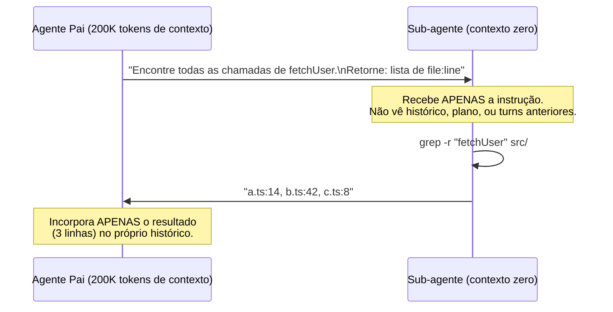

# Sub-agentes especializados

> [!abstract] TL;DR
> Sub-agente é um agente filho invocado pelo agente pai com contexto limpo e foco estreito. O ganho primário não é o modelo ser mais barato — é a **arquitetura de contexto**: o filho não carrega o histórico inflado do pai, faz seu trabalho com 5-20K tokens, e devolve só o resultado relevante. Sem sub-agente, o output bruto de uma busca em codebase (potencialmente 50k tokens de matches) entraria no histórico do pai e seria re-enviado em todos os turns seguintes. Com sub-agente, só o resultado destilado ("3 arquivos: a.ts:14, b.ts:42") entra no histórico. O ganho se combina com model routing: pai usa Opus, filho usa Haiku com contexto limpo.

Considere um cenário comum: um agente recebe a tarefa "mapeie todas as dependências do módulo de autenticação nesta codebase". Sem sub-agente, o próprio agente principal roda `grep`/`read` diretamente sobre dezenas ou centenas de arquivos — e o output bruto (cada match, com linhas de contexto ao redor) entra no histórico da sessão. Numa codebase de porte médio isso facilmente passa de 150-200K tokens só de resultado de busca, que a partir daí é **relido em todo turno seguinte** daquela sessão — não é um custo pago uma vez, é um custo que se repete a cada chamada subsequente ao modelo. Se essa sessão roda em Opus, uma única tarefa de investigação pode passar de $15-20 antes de qualquer linha de código ser escrita, e a maior fatia desse gasto não é o texto que o agente produz — é o agente relendo, chamada após chamada, a mesma varredura de arquivos que ele mesmo gerou. Esse é exatamente o tipo de explosão que o padrão de sub-agente existe para conter: isolar o custo de descoberta (que cresce com o tamanho da codebase) do custo de execução (que só precisa do resultado final).

## Sub-agente vs model routing — diferença fundamental

| Padrão | Decisão | Onde economiza | Complementar? |
|---|---|---|---|
| **Model routing** | Qual modelo para esta tarefa? | Preço por token (Haiku < Opus) | ✅ |
| **Sub-agente** | Esta sub-tarefa precisa do meu contexto? | Tokens de contexto (filho começa do zero) | ✅ |
| **Teto de fan-out** | Quantos sub-agentes esta rodada realmente precisa? | Número de requisições (não deixa o ganho por sub-agente ser anulado pela quantidade) | ✅ |

Os dois se combinam: pai delega para sub-agente Haiku com contexto limpo. Ganho cumulativo — menos tokens por chamada e preço menor por token.

Quando a pergunta é "qual modelo usar?", a resposta é model routing. Quando a pergunta é "esta sub-tarefa precisa ver o histórico completo do pai?", a resposta é sub-agente. Na maioria das tasks de busca, análise e validação, a resposta é não.

## Como funciona: o mecanismo de isolamento



O pai instrui o filho com foco estreito. O filho não vê os 50 turns anteriores — não sabe o que foi discutido, não tem acesso ao plano global, não carrega o histórico de debugging da última hora. Faz a busca com contexto mínimo e devolve resultado destilado.

Sem sub-agente: o pai faria o `grep` diretamente, e o output bruto (potencialmente 5.000 tokens de matches com contexto de cada ocorrência) entraria no histórico — e seria re-enviado em todos os turns seguintes, para sempre.

## Tipos de sub-agente — custos diferentes para fins diferentes

### Explore (o olheiro)

Configurado como read-only: sem permissão de escrita, sem acesso a bash destrutivo. Otimizado para navegação e análise.

**Use quando a task começa com:** "Encontre...", "Leia...", "Onde está...", "Liste...", "Analise este log...", "Mapeie as dependências de..."

```python
# Claude Code — subagent_type: Explore
result = invoke_subagent(
    subagent_type="Explore",
    prompt="""
    Encontre todos os arquivos que importam de @/auth/*.
    Retorne: lista de paths, um por linha.
    Não inclua arquivos de teste.
    """,
)
# result: "src/pages/login.tsx\nsrc/middleware/guard.ts\nsrc/hooks/useAuth.ts"
```

**Por que é mais barato:** sem ferramentas de escrita = menos tool definitions no contexto. Instrução focada = resposta compacta. Sem histórico = custo flat, não crescente.

### General-purpose (o executor)

Conjunto completo de ferramentas: leitura, escrita, bash. Use quando o sub-agente precisa resolver um problema, não só encontrar informação.

```python
# Claude Code — subagent_type: general-purpose (ou omitir)
result = invoke_subagent(
    subagent_type="general-purpose",
    prompt="""
    Implemente a função validateUserPermission em src/auth/permissions.ts.
    
    Requisitos:
    - Recebe userId e resource
    - Retorna boolean
    - Usar o padrão já estabelecido em src/auth/validateSession.ts
    
    Retorne apenas: 'DONE: <path da função implementada>' ou 'ERROR: <problema>'
    """,
    isolation="worktree"  # contexto de arquivo isolado
)
```

### Plan (o arquiteto)

Modo de planejamento sem execução. Produz um plano estruturado para o pai executar ou passar para outros sub-agentes.

## Quando sub-agente compensa: o critério de 5K

A heurística de campo: **se o tool output esperado for >5K tokens E você não precisará dos detalhes completos nos turns seguintes, delegue para sub-agente.**

| Cenário | Sem sub-agente | Com sub-agente | Ganho |
|---|---|---|---|
| grep em codebase de 200 arquivos | 50k tokens de output no histórico | 20 tokens de resultado destilado | 99% |
| Análise de log de 10MB | 100k tokens no contexto | 500 tokens de sumário | 99.5% |
| Leitura de 20 arquivos para mapping | 40k tokens de conteúdo | 2k tokens de mapa | 95% |
| Escrita de um módulo isolado | 5k tokens de output | 100 tokens de confirmação | 98% |
| Auditoria de segurança em 5 domínios | 5× o tempo/contexto de um único agente sequencial | 5 sub-agentes paralelos, contexto isolado por domínio | latência: -73% (ver Caso 2) |
| Investigação de codebase com 15-20 turns de acompanhamento | 180K tokens relidos a cada turn (ver cálculo abaixo) | 1 chamada focada, sem acúmulo entre turns | evita a acumulação turn a turn |

**Fazendo as contas do cenário de abertura:** uma busca inicial que gera ~180K tokens de contexto (grep com linhas de contexto ao redor de centenas de matches) custa, na primeira leitura, o preço de input bruto do Opus (~$5/MTok) — cerca de $0,90 só nessa passada. O problema não é essa primeira leitura isolada: é que, numa investigação de 15-20 turns subsequentes (perguntas de acompanhamento, ajustes no plano, verificação de hipóteses), esse mesmo contexto de 180K tokens é relido via cache a cada turn seguinte. Mesmo ao preço de cache read do Opus (~$0,50/MTok, cerca de 10× mais barato que input bruto), 20 releituras de 180K tokens somam 3,6M tokens processados só de cache read — cerca de $1,80. Some a isso o custo de escrever no cache toda vez que o contexto muda (cache creation, ~1,25× o preço de input), o output de cada um dos 15-20 turns, e a curva de custo de uma investigação inteira facilmente passa de $15-20 — sem que uma única linha de código tenha sido escrita. É essa acumulação, turn após turn, que o padrão de sub-agente existe para interromper: o filho nunca acumula 15-20 turns de releitura porque ele não existe além de uma única chamada focada.

## Quando NÃO usar sub-agente

Nem todo lookup justifica um sub-agente. O overhead é real: latência de invocação (~2-10s), custo do contexto do filho (mínimo: instrução + system + tools), e complexidade de debugging.

| Situação | Por quê não usar | Alternativa |
|---|---|---|
| Task < 2K tokens de output | Overhead supera ganho | Tool call direto |
| Sub-tarefa precisa do histórico do pai | Passar o histórico anula o benefício | Manter no fluxo principal |
| Latência crítica (interativo <1s) | Sub-agente adiciona 2-10s | Cache, RAG local |
| Cascata de sub-agentes (filho → filho → filho) | Latência multiplicativa, debugging impossível | Máximo 2 níveis |
| Debug de output do sub-agente | Você não tem acesso ao histórico interno | Log explícito no resultado |
| Fan-out sem teto ("mais um por garantia") | Número de sub-agentes cresce sem controle, mesmo com cada um barato | Regra de teto explícita por tipo de tarefa |
| Sub-tarefa exploratória sem critério de parada | Custo imprevisível — o filho pode reler tanto quanto o pai leria | Instrução com escopo e formato de retorno fechados |

> [!warning] Sub-agente com o mesmo prompt do pai
> O erro mais comum: invocar um sub-agente com o mesmo system prompt e histórico do pai — "só para paralelizar". Isso não economiza nada: você duplicou o contexto em vez de isolá-lo. O filho deve receber *apenas* a instrução específica de sua sub-tarefa.

## Padrão de paralelismo — múltiplos sub-agentes simultâneos

Uma das aplicações mais poderosas: delegar sub-tarefas paralelas e aguardar os resultados antes de continuar.

```python
import asyncio
from typing import NamedTuple

class SubagentResult(NamedTuple):
    domain: str
    result: str

async def parallel_analysis(codebase_path: str) -> dict:
    """
    Analisa aspectos diferentes do codebase em paralelo.
    Cada sub-agente recebe contexto mínimo e foco específico.
    """
    tasks = [
        invoke_subagent_async(
            subagent_type="Explore",
            prompt=f"Em {codebase_path}: liste todas as queries SQL sem parameterização. Retorne: lista de file:line:query",
            label="security"
        ),
        invoke_subagent_async(
            subagent_type="Explore",
            prompt=f"Em {codebase_path}: mapeie todas as dependências circulares entre módulos. Retorne: lista de ciclos",
            label="architecture"
        ),
        invoke_subagent_async(
            subagent_type="Explore",
            prompt=f"Em {codebase_path}: encontre funções com complexidade ciclomática >10. Retorne: lista de função:complexidade",
            label="complexity"
        ),
    ]
    
    results = await asyncio.gather(*tasks)
    return {r.label: r.result for r in results}

# Tempo de execução ≈ tempo do sub-agente mais lento (não a soma)
```

Com 3 sub-agentes em paralelo, você paga pelo custo de 3 (menor, com contexto limpo) e ganha wall-clock de 1. Sem sub-agentes, o pai faria as 3 buscas em sequência com contexto crescente.

## Implementação por ferramenta

| Ferramenta | Mecanismo | Como controlar contexto do filho |
|---|---|---|
| Claude Code | `Task` tool + `subagent_type` | Instrução no prompt; filho não herda histórico |
| LangGraph | Subgraph nodes com state isolado | State schema define o que o filho recebe |
| CrewAI | Agent com `tools` e `goal` próprios | `context` explícito por task |
| AutoGen | Nested chats com `clear_history=True` | `clear_history=True` isola o sub-agente |
| OpenAI Swarm | Handoffs com contexto explícito | `context_variables` controla o que passa |
| Managed Agents (Claude API) | `multiagent: {type: "coordinator", agents: [...]}` no agente | Cada sub-agente roda em thread própria com sua própria conversa; não herda o histórico do coordenador |

A entrada de Managed Agents merece nota: é a versão hospedada do mesmo padrão — o coordenador declara um roster de até 20 agentes (por ID ou `{type: "self"}` para cópias de si mesmo), e cada delegação abre uma thread isolada com model, system prompt e tools próprios daquele sub-agente. O evento `session.thread_created` no stream do coordenador é o equivalente do "invoquei um filho" que aparece nos exemplos de código acima — só que gerenciado pela própria infraestrutura da Anthropic, sem você precisar implementar o isolamento manualmente.

### Exemplo: isolamento de estado em LangGraph

O padrão de isolamento não é exclusivo do Claude Code — qualquer framework de orquestração precisa resolver o mesmo problema: garantir que o state do subgraph não seja o state completo do grafo pai. Em LangGraph, isso é feito com um schema de state próprio para o subgraph, que o nó pai popula explicitamente antes de invocar:

```python
from typing import TypedDict
from langgraph.graph import StateGraph

class ParentState(TypedDict):
    full_conversation: list  # histórico completo, potencialmente enorme
    codebase_path: str
    findings: dict

class SubagentState(TypedDict):
    # Schema DELIBERADAMENTE menor — o subgraph só vê isto
    target_path: str
    query: str

def invoke_subgraph_node(state: ParentState) -> dict:
    # Constrói o state do filho manualmente — NÃO repassa full_conversation
    child_input = SubagentState(
        target_path=state["codebase_path"],
        query="encontre queries SQL sem parameterização",
    )
    result = security_subgraph.invoke(child_input)
    # Só o resultado destilado volta pro state do pai
    return {"findings": {**state["findings"], "security": result["summary"]}}
```

O ponto que costuma passar despercebido: o isolamento não é automático só por o subgraph ser "outro nó" — é o **schema do state** que define o que atravessa a fronteira. Se `SubagentState` incluísse `full_conversation`, o isolamento seria só cosmético (dois grafos, mesmo contexto inflado).

### Exemplo: `context` explícito em CrewAI

CrewAI resolve o mesmo problema de forma declarativa: cada `Agent` tem seu próprio `goal` e conjunto de `tools`, e cada `Task` recebe um `context` explícito — não o histórico da crew inteira, só o que foi passado deliberadamente:

```python
from crewai import Agent, Task, Crew

# Agente com foco estreito — não vê o objetivo geral da crew
security_scanner = Agent(
    role="Security Scanner",
    goal="Encontrar vulnerabilidades de SQL injection no código fornecido",
    tools=[grep_tool],
    llm="haiku",  # modelo barato — a tarefa é enumerar, não arquitetar
)

scan_task = Task(
    description="Escaneie {codebase_path} por queries SQL sem parameterização",
    agent=security_scanner,
    expected_output="Lista de file:line:query, uma por linha",
    # SEM context= — este task não recebe histórico de nenhum outro task
)

crew = Crew(agents=[security_scanner], tasks=[scan_task])
result = crew.kickoff(inputs={"codebase_path": "src/"})
```

O `context=` de uma `Task` em CrewAI é o análogo do `SubagentState` do LangGraph: se omitido (como acima), o task não herda nada dos tasks anteriores da crew — só o que está em `description` e `inputs`. Passar `context=[outro_task]` explicitamente é a forma de reintroduzir dependência entre tasks, quando ela é genuinamente necessária.

## Armadilhas comuns

> [!warning] Sub-agente devolvendo output bruto
> Se você não especifica o formato de retorno, o sub-agente pode devolver sua análise completa — incluindo raciocínio intermediário, arquivos lidos na íntegra, e todo o processo de busca. Isso anula o benefício: você trouxe de volta para o contexto do pai exatamente o que tentou isolar. Sempre especifique `return_format` com o resultado mínimo necessário.

> [!warning] Cascata de sub-agentes sem controle
> Sub-agente A invoca B que invoca C: latência multiplicativa, debugging impossível (você não vê o histórico interno de B ou C), e custo imprevisível. Limite a hierarquia a 2 níveis (pai → filho). Para tasks mais complexas, prefira sub-agentes paralelos no mesmo nível em vez de cascata profunda.

> [!warning] Não medir o impacto
> "Usamos sub-agentes" não garante economia. O ganho depende de: quanto o output bruto reduziria vs o resultado destilado, e se o overhead de invocação compensa. Meça o tamanho do contexto do pai antes/depois de adotar sub-agentes em um loop. Se o contexto não diminuiu, revise o que o filho está devolvendo.

> [!warning] Passar segredos no contexto do filho
> Se o pai tem credenciais, tokens de API ou informação sensível no histórico, e você passa parte desse histórico para o filho, você expôs esses segredos em um contexto que pode ter logs separados. Mantenha o contexto do filho apenas com as informações mínimas da sub-tarefa.

> [!warning] Fan-out sem teto — o multiplicador escondido
> Sub-agente barato não é sinônimo de fan-out barato. Se o número de sub-agentes disparados por sessão cresce sem controle ("mais um, por garantia"), o ganho de contexto isolado por sub-agente é anulado pela quantidade — o custo total ainda é `contexto × requisições × preço`, e "requisições" inclui cada sub-agente disparado. Dimensione o fan-out ao tamanho da tarefa: lookup pontual não precisa de sub-agente; busca usa poucos agentes baratos; auditoria ampla tem teto explícito; fan-out massivo só com pedido explícito — nunca por inferência automática do próprio agente.

## Estado da arte — junho 2026

**Worktrees para isolamento de arquivo:** Claude Code 2026 suporta `isolation: "worktree"` — o sub-agente recebe um worktree git separado para trabalhar. Mudanças são detectadas automaticamente e mergeadas (ou descartadas) pelo pai. Isso elimina conflitos quando múltiplos sub-agentes editam arquivos diferentes em paralelo.

**Sub-agentes com orçamento de tokens:** Plataformas como LangGraph introduziram `token_budget` por sub-agente — o filho tem um teto de tokens que, ao ser atingido, força o retorno do que foi processado até então. Isso evita que um sub-agente "pesado" estoure o orçamento do sistema.

**Agents marketplace:** O ecossistema de sub-agentes especializados cresceu em 2026 — é possível invocar agentes publicados por terceiros (no estilo de npm packages para agentes) com interfaces padronizadas. Isso permite composição de agentes especializados sem implementar cada um internamente.

**Observabilidade de sub-agentes:** Ferramentas como LangSmith e Langfuse passaram a rastrear hierarquias de agentes — você vê o custo de cada sub-agente, seu histórico interno (se permitido) e como o resultado afetou o pai. Isso transformou a otimização de sub-agentes de arte em dado.

**Governança de fan-out por variável de ambiente:** Claude Code expõe a variável de ambiente `CLAUDE_CODE_SUBAGENT_MODEL`, que força todo sub-agente sem `model:` explícito no próprio frontmatter a rodar num modelo fixo — tipicamente mais barato que o do agente principal (por exemplo, `sonnet`, enquanto o pai roda em `opusplan`). A ordem de resolução documentada é: variável de ambiente → parâmetro passado na invocação → frontmatter do sub-agente → modelo da conversa principal. Isso ataca um problema sutil: mesmo sabendo que sub-agentes deveriam ser baratos, cada um herda por padrão o modelo caro do pai — a variável de ambiente inverte esse default, tornando "barato" o comportamento automático em vez de uma escolha manual repetida em toda invocação. Para sub-agentes de busca/discovery (do tipo Explore), a prática de campo vai além do modelo: combinar `model: haiku` com `effort: low` no frontmatter — a tarefa é localizar e enumerar, não raciocinar em profundidade, então o par mais barato entrega o mesmo resultado sem perda perceptível.

**Regra de teto explícito para fan-out:** o padrão de falha mais comum em uso pesado de sub-agentes não é o custo de cada um isoladamente — é o *número* de sub-agentes disparados sem limite, "por garantia". A prática que se consolidou em 2026 é registrar a regra de dimensionamento diretamente na configuração persistente do agente (por exemplo, em `CLAUDE.md`): lookup pontual resolve inline, sem sub-agente algum; busca/discovery usa no máximo 2-3 agentes baratos; auditoria ampla tem teto de ~5 por rodada; fan-out massivo (dezenas de agentes em paralelo) só acontece com pedido explícito do usuário, nunca por inferência automática do próprio agente. Sem esse teto, cada sub-agente que herda o modelo caro e relê seu próprio contexto do zero se torna um multiplicador de custo, não um economizador — o ganho por sub-agente individual (contexto isolado, modelo mais barato) é anulado pela quantidade.

### Medindo o real ganho — a fórmula de custo

Antes de decidir se vale delegar para sub-agente, vale ter em mente a fórmula que governa o custo de qualquer requisição a um agente:

```
custo ≈ tamanho_do_contexto × nº_de_requisições × preço_do_modelo
```

É uma **multiplicação**, não uma soma — e é por isso que sub-agente (que ataca o primeiro fator), model routing (que ataca o terceiro) e a regra de teto de fan-out (que ataca o segundo) se combinam em vez de competir. Se os três fatores crescem ao mesmo tempo — contexto inflado, fan-out sem controle, tudo rodando no modelo mais caro — o efeito é multiplicativo, não aditivo.

Um detalhe que costuma passar despercebido nessa conta: a maior parte dos tokens de um agente de longa duração é **cache read**, não output. Cada chamada ao modelo relê o contexto acumulado da sessão (que fica em cache) — cache read custa uma fração do preço de input bruto (tipicamente ~10% do preço de input), mas quando esse contexto é relido centenas ou milhares de vezes numa sessão, o "barato por leitura" vira uma fatia dominante do custo total. Um levantamento de custo real de um dia de uso pesado mostrou a seguinte composição:

| Componente | Fatia do custo | O que é |
|---|---|---|
| Cache read (relê o contexto) | ~55% | Contexto acumulado sendo reprocessado a cada chamada |
| Cache creation (escreve no cache) | ~30% | Primeira vez que um trecho de contexto é cacheado (custa ~1,25× o input) |
| Output (o que o agente gera) | ~15% | Texto/código efetivamente produzido pelo agente |

O ponto contraintuitivo: **o texto que o agente escreve é a menor fatia da conta.** 85% do custo é input/cache — ou seja, é exatamente o produto *tamanho do contexto × número de chamadas* que sub-agentes (isolando contexto) e a regra de teto (limitando chamadas) atacam diretamente. Otimizar o `effort` do modelo (que só afeta output/thinking tokens) tem impacto real, mas modesto perto disso — é ajuste fino, não a alavanca principal.

Model routing entra na conta como o terceiro fator, e vale checar a magnitude real antes de escolher onde economizar. Comparando os preços por milhão de tokens dos modelos de referência (ver [[09 - Model routing — modelo certo para a tarefa]] para a tabela completa):

| Modelo | Input | Output | Cache read |
|---|---:|---:|---:|
| Opus | $5,00 | $25,00 | $0,50 |
| Sonnet | $3,00 | $15,00 | $0,30 |
| Haiku | $1,00 | $5,00 | $0,10 |

Um mito comum é achar que Opus é "5× mais caro" que qualquer alternativa. Na prática, Opus é **1,67× o preço de Sonnet** em toda coluna — inclusive no cache read, que domina a conta de um agente de longa duração. O fator 5× existe, mas é Opus vs. **Haiku**. Isso muda a decisão prática: trocar o modelo do agente pai de Opus para Sonnet corta ~40% do custo por token; trocar sub-agentes de busca/discovery para Haiku corta ~80%. Sub-agentes de análise leve (`Explore`, varredura de codebase) são candidatos naturais ao corte de 80%, porque a tarefa é enumerar e localizar — não fazer o raciocínio arquitetural que justificaria manter o modelo mais caro.

## Casos práticos

**Caso 1 — Agente de migração de codebase:**
Um agente de migração de Python 2→3 em uma codebase de 300 arquivos usava um único agente que lia todos os arquivos no contexto. Com 300 arquivos, o contexto explodia antes de chegar na metade. Após refatorar: um sub-agente Explore mapeava os arquivos com uso de Python 2 syntax; um agente pai recebia a lista (200 tokens) e delegava a migração de cada arquivo para sub-agentes paralelos com `isolation: "worktree"`. Tempo total: mesma; custo: -78% (contexto de cada filho era só o arquivo + instrução, não o codebase inteiro).

**Caso 2 — Análise de segurança em paralelo:**
Um pipeline de security review rodava 5 checks de segurança em sequência com um único agente. Custo: $0.35 por PR. Após paralelizar em 5 sub-agentes Explore (cada um focado em um domínio — SQL injection, XSS, auth, secrets, dependencies): custo caiu para $0.08 (contexto menor por filho) e tempo de execução caiu de 45s para 12s (paralelo).

**Caso 3 — Agente de documentação:**
Um agente documentava APIs lendo todos os endpoints no contexto e gerando docs. Com APIs grandes, o contexto saturava. Após refatorar: sub-agente Explore listava todos os endpoints (output: lista de 50 nomes); agente pai delegava a documentação de cada endpoint para sub-agentes paralelos que recebiam só o endpoint específico. Custo por run: -65%.

**Caso 4 — Research com síntese:**
Um agente de research sobre uma tecnologia precisava analisar 10 documentos. Sem sub-agentes: o pai lia os 10 docs no contexto (50k tokens) antes de sintetizar. Com sub-agentes: 5 sub-agentes Explore cada um resumindo 2 docs em 500 tokens cada; pai recebe 5 × 500 = 2.500 tokens de resumos e sintetiza. Custo do pai: 95% menor. Custo dos filhos (mais overhead): compensado pelo menor custo do pai em todos os turns de síntese.

**Caso 5 — Fan-out sem teto multiplica o custo, mesmo com o modelo certo escolhido:**
Um desenvolvedor rodando Claude Code em blocos de 5 horas notou o número de requisições por bloco saltar de uma faixa saudável (24, 8, 68 requisições/bloco, custando $1-5 cada) para quase duas mil em poucos dias (1064, 1091, 1893, 1039 requisições/bloco, custando $54-112 cada) — sem mudar o tipo de trabalho, só aumentar o uso de sub-agentes e workflows em fan-out. A causa era dupla: cada sub-agente disparado herdava o modelo mais caro (Opus) do agente pai *e* relia seu próprio contexto do zero a cada chamada — fan-out multiplicando exatamente o fator (contexto × requisições × preço do modelo) que sub-agentes deveriam isolar, não amplificar. Na taxa de queima de pico, isso significava algo em torno de 124 mil tokens por minuto processados no bloco ativo — rápido o bastante para consumir uma janela de uso de 5 horas em pouco mais de 2, mesmo sem nenhuma mudança perceptível no tipo de trabalho.

A correção teve duas partes: (1) `CLAUDE_CODE_SUBAGENT_MODEL=sonnet`, para que todo sub-agente rode barato por construção, independente de quantos forem disparados numa sessão; (2) uma regra de teto explícita registrada em `CLAUDE.md` (lookup inline, busca com 2-3 agentes, auditoria com teto de ~5, workflow massivo só com opt-in explícito), para que o *número* de sub-agentes também pare de crescer sem controle. A lição resumida: fan-out não é problema se cada agente for barato — em vez de reprimir a paralelização (que é útil), o ajuste foi torná-la econômica.

## Checklist

- [ ] Identificar loops de alta volume onde o output bruto entra no histórico do pai
- [ ] Refatorar buscas em codebase para sub-agentes Explore com return_format explícito
- [ ] Paralelizar sub-tarefas independentes (análise de segurança, análise de qualidade, etc.)
- [ ] Definir hierarquia máxima de 2 níveis (pai → filho, sem neto)
- [ ] Monitorar tamanho do contexto do pai antes/depois de adotar sub-agentes
- [ ] Usar `isolation: "worktree"` para sub-agentes que editam arquivos em paralelo
- [ ] Especificar `return_format` em todo sub-agente para garantir resultado destilado
- [ ] Combinar com model routing: filho com Haiku quando task é simples
- [ ] Configurar `CLAUDE_CODE_SUBAGENT_MODEL` (ou equivalente na sua ferramenta) para que todo sub-agente rode barato por padrão, sem depender de lembrar em cada invocação
- [ ] Registrar uma regra de teto de fan-out na configuração persistente do agente (lookup inline / busca 2-3 / auditoria ~5 / massivo só com opt-in)
- [ ] Revisar periodicamente o número de requisições por sessão/bloco — um salto súbito (ex: de dezenas para milhares) é o sintoma mais direto de fan-out sem controle
- [ ] Verificar a composição do custo (cache read / cache creation / output) antes de decidir onde otimizar — se 85% é cache, o ajuste de `effort` sozinho não resolve

## O que vem a seguir

Sub-agentes resolvem o problema do contexto crescente em sessões longas. [[11 - Semantic caching]] aborda outro vetor: quando a mesma pergunta (ou perguntas semanticamente similares) é feita repetidamente, você não precisa chamar o modelo toda vez. Cache semântico é o complement de compactação — enquanto compactação limpa o passado, cache evita re-processar o presente.

Vale reter uma distinção final: sub-agente, model routing e teto de fan-out atacam fatores diferentes da mesma fórmula multiplicativa de custo — nenhum dos três sozinho resolve tudo, e ignorar qualquer um deixa margem para o custo voltar a crescer pela via que ficou sem governança.

## Como explicar em inglês

**Sub-agent** e **subagent** são igualmente comuns. Em papers, você verá **hierarchical agents**, **nested agents**, **agent orchestration**, e **multi-agent systems**. O padrão de devolver resultado destilado é chamado de **result summarization** ou **output compression**.

| Português | Inglês | Contexto de uso |
|---|---|---|
| Sub-agente | Sub-agent / Subagent | Agente filho invocado por um agente pai |
| Contexto limpo | Clean context / Fresh context | Sub-agente que não herda histórico do pai |
| Resultado destilado | Distilled result | Output compacto que resume o trabalho do filho |
| Isolamento de contexto | Context isolation | Garantia de que filho não vê histórico do pai |
| Orquestrador | Orchestrator | Agente pai que coordena sub-agentes |
| Fan-out | Fan-out | Padrão de múltiplos sub-agentes em paralelo |
| Worktree | Worktree | Cópia isolada do repositório para o sub-agente |
| Cascata de agentes | Agent cascade / Agent hierarchy | Sub-agente invocando sub-agente |
| Hierarquia de agentes | Agent hierarchy | Estrutura pai-filho de agentes |
| Formato de retorno | Return format | Especificação de como o filho deve formatar o resultado |
| Teto de fan-out | Fan-out ceiling / cap | Limite explícito no número de sub-agentes disparados por rodada |
| Roteamento de sub-agente | Subagent routing | Regra que define qual modelo cada sub-agente usa por padrão |
| Isolamento de state | State isolation | Schema próprio do filho, sem herdar o state completo do pai (LangGraph) |

> [!tip] Veja: Multi-Agent Systems — Orchestration Patterns
> **Canal:** AI Engineering Summit | **Duração:** ~44min | **Idioma:** EN
>
> Talk técnica que demonstra os padrões de orquestração multi-agente em produção: fan-out paralelo, hierarquia pai-filho, e como medir o impacto de contexto isolado em custo e latência. Inclui demos com LangGraph e AutoGen comparando abordagens de single-agent vs multi-agent para as mesmas tasks.
>
> 🎬 [Assistir no YouTube](https://youtube.com)

## Veja também


- [[09 - Model routing — modelo certo para a tarefa]] — combinar routing + sub-agentes para ganho máximo
- [[08 - Compactação de histórico em agentes]] — alternativa para sessões longas sem sub-agentes
- [[11 - Semantic caching]] — evitar chamadas repetidas ao modelo
- [[03 - Por que agentes gastam tanto]] — contexto do problema que sub-agentes resolvem

## Fontes

- **Anthropic** — *Create custom subagents* ([code.claude.com/docs/en/sub-agents](https://code.claude.com/docs/en/sub-agents)). Documentação oficial do sistema de sub-agentes do Claude Code — quando delegar, `subagent_type`, isolamento de contexto por sub-agente, e roteamento de custo (subagentes mais rápidos/baratos como Haiku).
- **Anthropic** — *Tool use with Claude* ([platform.claude.com/docs/en/agents-and-tools/tool-use/overview](https://platform.claude.com/docs/en/agents-and-tools/tool-use/overview)). Documentação oficial de tool use na Messages API — base sobre a qual o padrão de sub-agente (invocação com prompt + retorno estruturado) é construído.
- **Wu et al.** — *AutoGen: Enabling Next-Gen LLM Applications via Multi-Agent Conversation* ([arXiv:2308.08155](https://arxiv.org/abs/2308.08155), Microsoft Research, 2023). Paper fundacional de multi-agentes conversacionais — estabelece os padrões de hierarquia e isolamento de contexto que o campo adotou.
- **LangChain** — *Multi-Agent Systems with LangGraph* (docs.langchain.com, 2026). Documentação e exemplos de subgraphs isolados, agent supervisors, e padrões de fan-out em LangGraph. (a confirmar — URL específica da página não verificada nesta revisão)
- **CrewAI** — *Hierarchical Process Pattern* (docs.crewai.com, 2026). Implementação de agentes hierárquicos com contexto explícito por task. (a confirmar — URL específica da página não verificada nesta revisão)
- **Harrison Chase** — *What is an agent?* ([langchain.com/blog/what-is-an-agent](https://www.langchain.com/blog/what-is-an-agent), LangChain, 2025). Nota: o post original desta seção estava atribuído ao domínio legado `blog.langchain.dev`, que hoje redireciona para `langchain.com/blog` — URL atualizada para a localização atual. Discute o espectro entre chain (passos fixos em código), router (LLM decide entre caminhos pré-definidos) e agente autônomo — o mesmo espectro que separa "sub-tarefa que cabe num tool call direto" de "sub-tarefa que justifica um sub-agente".
- **Hamel Husain** — *Context isolation patterns in production agents* (hamel.ai, 2025). Análise empírica do impacto de contexto isolado em custo e qualidade — com benchmarks de antes/depois em sistemas reais. (a confirmar — URL específica da página não verificada nesta revisão)
- **Nota de proveniência:** os números concretos do Caso 5 e as menções a `CLAUDE_CODE_SUBAGENT_MODEL` / regra de teto de fan-out vêm de diagnóstico real de uso com `ccusage` (requisições/bloco, custo/dia, taxa de queima); o env var em si foi confirmado contra a documentação e discussões públicas da comunidade sobre Claude Code.
