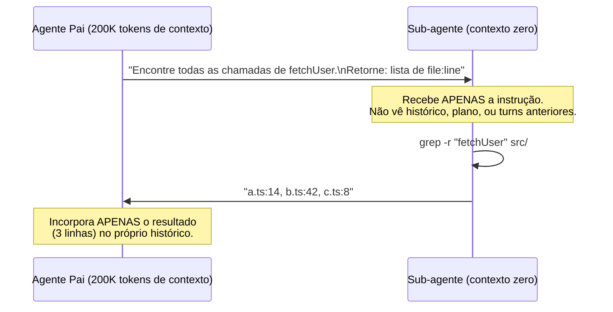

# Sub-agentes especializados

> [!abstract] TL;DR
> Sub-agente é um agente filho invocado pelo agente pai com contexto limpo e foco estreito. O ganho primário não é o modelo ser mais barato — é a **arquitetura de contexto**: o filho não carrega o histórico inflado do pai, faz seu trabalho com 5-20K tokens, e devolve só o resultado relevante. Sem sub-agente, o output bruto de uma busca em codebase (potencialmente 50k tokens de matches) entraria no histórico do pai e seria re-enviado em todos os turns seguintes. Com sub-agente, só o resultado destilado ("3 arquivos: a.ts:14, b.ts:42") entra no histórico. O ganho se combina com model routing: pai usa Opus, filho usa Haiku com contexto limpo.

## Sub-agente vs model routing — diferença fundamental

| Padrão | Decisão | Onde economiza | Complementar? |
|---|---|---|---|
| **Model routing** | Qual modelo para esta tarefa? | Preço por token (Haiku < Opus) | ✅ |
| **Sub-agente** | Esta sub-tarefa precisa do meu contexto? | Tokens de contexto (filho começa do zero) | ✅ |

Os dois se combinam: pai delega para sub-agente Haiku com contexto limpo. Ganho cumulativo — menos tokens por chamada e preço menor por token.

Quando a pergunta é "qual modelo usar?", a resposta é model routing. Quando a pergunta é "esta sub-tarefa precisa ver o histórico completo do pai?", a resposta é sub-agente. Na maioria das tasks de busca, análise e validação, a resposta é não.

## Como funciona: o mecanismo de isolamento



O pai instrui o filho com foco estreito. O filho não vê os 50 turns anteriores — não sabe o que foi discutido, não tem acesso ao plano global, não carrega o histórico de debugging da última hora. Faz a busca com contexto mínimo e devolve resultado destilado.

Sem sub-agente: o pai faria o `grep` diretamente, e o output bruto (potencialmente 5.000 tokens de matches com contexto de cada ocorrência) entraria no histórico — e seria re-enviado em todos os turns seguintes, para sempre.

## Tipos de sub-agente — custos diferentes para fins diferentes

### Explore (o olheiro)

Configurado como read-only: sem permissão de escrita, sem acesso a bash destrutivo. Otimizado para navegação e análise.

**Use quando a task começa com:** "Encontre...", "Leia...", "Onde está...", "Liste...", "Analise este log...", "Mapeie as dependências de..."

```python
# Claude Code — subagent_type: Explore
result = invoke_subagent(
    subagent_type="Explore",
    prompt="""
    Encontre todos os arquivos que importam de @/auth/*.
    Retorne: lista de paths, um por linha.
    Não inclua arquivos de teste.
    """,
)
# result: "src/pages/login.tsx\nsrc/middleware/guard.ts\nsrc/hooks/useAuth.ts"
```

**Por que é mais barato:** sem ferramentas de escrita = menos tool definitions no contexto. Instrução focada = resposta compacta. Sem histórico = custo flat, não crescente.

### General-purpose (o executor)

Conjunto completo de ferramentas: leitura, escrita, bash. Use quando o sub-agente precisa resolver um problema, não só encontrar informação.

```python
# Claude Code — subagent_type: general-purpose (ou omitir)
result = invoke_subagent(
    subagent_type="general-purpose",
    prompt="""
    Implemente a função validateUserPermission em src/auth/permissions.ts.
    
    Requisitos:
    - Recebe userId e resource
    - Retorna boolean
    - Usar o padrão já estabelecido em src/auth/validateSession.ts
    
    Retorne apenas: 'DONE: <path da função implementada>' ou 'ERROR: <problema>'
    """,
    isolation="worktree"  # contexto de arquivo isolado
)
```

### Plan (o arquiteto)

Modo de planejamento sem execução. Produz um plano estruturado para o pai executar ou passar para outros sub-agentes.

## Quando sub-agente compensa: o critério de 5K

A heurística de campo: **se o tool output esperado for >5K tokens E você não precisará dos detalhes completos nos turns seguintes, delegue para sub-agente.**

| Cenário | Sem sub-agente | Com sub-agente | Ganho |
|---|---|---|---|
| grep em codebase de 200 arquivos | 50k tokens de output no histórico | 20 tokens de resultado destilado | 99% |
| Análise de log de 10MB | 100k tokens no contexto | 500 tokens de sumário | 99.5% |
| Leitura de 20 arquivos para mapping | 40k tokens de conteúdo | 2k tokens de mapa | 95% |
| Escrita de um módulo isolado | 5k tokens de output | 100 tokens de confirmação | 98% |

## Quando NÃO usar sub-agente

Nem todo lookup justifica um sub-agente. O overhead é real: latência de invocação (~2-10s), custo do contexto do filho (mínimo: instrução + system + tools), e complexidade de debugging.

| Situação | Por quê não usar | Alternativa |
|---|---|---|
| Task < 2K tokens de output | Overhead supera ganho | Tool call direto |
| Sub-tarefa precisa do histórico do pai | Passar o histórico anula o benefício | Manter no fluxo principal |
| Latência crítica (interativo <1s) | Sub-agente adiciona 2-10s | Cache, RAG local |
| Cascata de sub-agentes (filho → filho → filho) | Latência multiplicativa, debugging impossível | Máximo 2 níveis |
| Debug de output do sub-agente | Você não tem acesso ao histórico interno | Log explícito no resultado |

> [!warning] Sub-agente com o mesmo prompt do pai
> O erro mais comum: invocar um sub-agente com o mesmo system prompt e histórico do pai — "só para paralelizar". Isso não economiza nada: você duplicou o contexto em vez de isolá-lo. O filho deve receber *apenas* a instrução específica de sua sub-tarefa.

## Padrão de paralelismo — múltiplos sub-agentes simultâneos

Uma das aplicações mais poderosas: delegar sub-tarefas paralelas e aguardar os resultados antes de continuar.

```python
import asyncio
from typing import NamedTuple

class SubagentResult(NamedTuple):
    domain: str
    result: str

async def parallel_analysis(codebase_path: str) -> dict:
    """
    Analisa aspectos diferentes do codebase em paralelo.
    Cada sub-agente recebe contexto mínimo e foco específico.
    """
    tasks = [
        invoke_subagent_async(
            subagent_type="Explore",
            prompt=f"Em {codebase_path}: liste todas as queries SQL sem parameterização. Retorne: lista de file:line:query",
            label="security"
        ),
        invoke_subagent_async(
            subagent_type="Explore",
            prompt=f"Em {codebase_path}: mapeie todas as dependências circulares entre módulos. Retorne: lista de ciclos",
            label="architecture"
        ),
        invoke_subagent_async(
            subagent_type="Explore",
            prompt=f"Em {codebase_path}: encontre funções com complexidade ciclomática >10. Retorne: lista de função:complexidade",
            label="complexity"
        ),
    ]
    
    results = await asyncio.gather(*tasks)
    return {r.label: r.result for r in results}

# Tempo de execução ≈ tempo do sub-agente mais lento (não a soma)
```

Com 3 sub-agentes em paralelo, você paga pelo custo de 3 (menor, com contexto limpo) e ganha wall-clock de 1. Sem sub-agentes, o pai faria as 3 buscas em sequência com contexto crescente.

## Implementação por ferramenta

| Ferramenta | Mecanismo | Como controlar contexto do filho |
|---|---|---|
| Claude Code | `Task` tool + `subagent_type` | Instrução no prompt; filho não herda histórico |
| LangGraph | Subgraph nodes com state isolado | State schema define o que o filho recebe |
| CrewAI | Agent com `tools` e `goal` próprios | `context` explícito por task |
| AutoGen | Nested chats com `clear_history=True` | `clear_history=True` isola o sub-agente |
| OpenAI Swarm | Handoffs com contexto explícito | `context_variables` controla o que passa |

## Armadilhas comuns

> [!warning] Sub-agente devolvendo output bruto
> Se você não especifica o formato de retorno, o sub-agente pode devolver sua análise completa — incluindo raciocínio intermediário, arquivos lidos na íntegra, e todo o processo de busca. Isso anula o benefício: você trouxe de volta para o contexto do pai exatamente o que tentou isolar. Sempre especifique `return_format` com o resultado mínimo necessário.

> [!warning] Cascata de sub-agentes sem controle
> Sub-agente A invoca B que invoca C: latência multiplicativa, debugging impossível (você não vê o histórico interno de B ou C), e custo imprevisível. Limite a hierarquia a 2 níveis (pai → filho). Para tasks mais complexas, prefira sub-agentes paralelos no mesmo nível em vez de cascata profunda.

> [!warning] Não medir o impacto
> "Usamos sub-agentes" não garante economia. O ganho depende de: quanto o output bruto reduziria vs o resultado destilado, e se o overhead de invocação compensa. Meça o tamanho do contexto do pai antes/depois de adotar sub-agentes em um loop. Se o contexto não diminuiu, revise o que o filho está devolvendo.

> [!warning] Passar segredos no contexto do filho
> Se o pai tem credenciais, tokens de API ou informação sensível no histórico, e você passa parte desse histórico para o filho, você expôs esses segredos em um contexto que pode ter logs separados. Mantenha o contexto do filho apenas com as informações mínimas da sub-tarefa.

## Estado da arte — junho 2026

**Worktrees para isolamento de arquivo:** Claude Code 2026 suporta `isolation: "worktree"` — o sub-agente recebe um worktree git separado para trabalhar. Mudanças são detectadas automaticamente e mergeadas (ou descartadas) pelo pai. Isso elimina conflitos quando múltiplos sub-agentes editam arquivos diferentes em paralelo.

**Sub-agentes com orçamento de tokens:** Plataformas como LangGraph introduziram `token_budget` por sub-agente — o filho tem um teto de tokens que, ao ser atingido, força o retorno do que foi processado até então. Isso evita que um sub-agente "pesado" estoure o orçamento do sistema.

**Agents marketplace:** O ecossistema de sub-agentes especializados cresceu em 2026 — é possível invocar agentes publicados por terceiros (no estilo de npm packages para agentes) com interfaces padronizadas. Isso permite composição de agentes especializados sem implementar cada um internamente.

**Observabilidade de sub-agentes:** Ferramentas como LangSmith e Langfuse passaram a rastrear hierarquias de agentes — você vê o custo de cada sub-agente, seu histórico interno (se permitido) e como o resultado afetou o pai. Isso transformou a otimização de sub-agentes de arte em dado.

## Casos práticos

**Caso 1 — Agente de migração de codebase:**
Um agente de migração de Python 2→3 em uma codebase de 300 arquivos usava um único agente que lia todos os arquivos no contexto. Com 300 arquivos, o contexto explodia antes de chegar na metade. Após refatorar: um sub-agente Explore mapeava os arquivos com uso de Python 2 syntax; um agente pai recebia a lista (200 tokens) e delegava a migração de cada arquivo para sub-agentes paralelos com `isolation: "worktree"`. Tempo total: mesma; custo: -78% (contexto de cada filho era só o arquivo + instrução, não o codebase inteiro).

**Caso 2 — Análise de segurança em paralelo:**
Um pipeline de security review rodava 5 checks de segurança em sequência com um único agente. Custo: $0.35 por PR. Após paralelizar em 5 sub-agentes Explore (cada um focado em um domínio — SQL injection, XSS, auth, secrets, dependencies): custo caiu para $0.08 (contexto menor por filho) e tempo de execução caiu de 45s para 12s (paralelo).

**Caso 3 — Agente de documentação:**
Um agente documentava APIs lendo todos os endpoints no contexto e gerando docs. Com APIs grandes, o contexto saturava. Após refatorar: sub-agente Explore listava todos os endpoints (output: lista de 50 nomes); agente pai delegava a documentação de cada endpoint para sub-agentes paralelos que recebiam só o endpoint específico. Custo por run: -65%.

**Caso 4 — Research com síntese:**
Um agente de research sobre uma tecnologia precisava analisar 10 documentos. Sem sub-agentes: o pai lia os 10 docs no contexto (50k tokens) antes de sintetizar. Com sub-agentes: 5 sub-agentes Explore cada um resumindo 2 docs em 500 tokens cada; pai recebe 5 × 500 = 2.500 tokens de resumos e sintetiza. Custo do pai: 95% menor. Custo dos filhos (mais overhead): compensado pelo menor custo do pai em todos os turns de síntese.

## Checklist

- [ ] Identificar loops de alta volume onde o output bruto entra no histórico do pai
- [ ] Refatorar buscas em codebase para sub-agentes Explore com return_format explícito
- [ ] Paralelizar sub-tarefas independentes (análise de segurança, análise de qualidade, etc.)
- [ ] Definir hierarquia máxima de 2 níveis (pai → filho, sem neto)
- [ ] Monitorar tamanho do contexto do pai antes/depois de adotar sub-agentes
- [ ] Usar `isolation: "worktree"` para sub-agentes que editam arquivos em paralelo
- [ ] Especificar `return_format` em todo sub-agente para garantir resultado destilado
- [ ] Combinar com model routing: filho com Haiku quando task é simples

## O que vem a seguir

Sub-agentes resolvem o problema do contexto crescente em sessões longas. [[11 - Semantic caching]] aborda outro vetor: quando a mesma pergunta (ou perguntas semanticamente similares) é feita repetidamente, você não precisa chamar o modelo toda vez. Cache semântico é o complement de compactação — enquanto compactação limpa o passado, cache evita re-processar o presente.

## Como explicar em inglês

**Sub-agent** e **subagent** são igualmente comuns. Em papers, você verá **hierarchical agents**, **nested agents**, **agent orchestration**, e **multi-agent systems**. O padrão de devolver resultado destilado é chamado de **result summarization** ou **output compression**.

| Português | Inglês | Contexto de uso |
|---|---|---|
| Sub-agente | Sub-agent / Subagent | Agente filho invocado por um agente pai |
| Contexto limpo | Clean context / Fresh context | Sub-agente que não herda histórico do pai |
| Resultado destilado | Distilled result | Output compacto que resume o trabalho do filho |
| Isolamento de contexto | Context isolation | Garantia de que filho não vê histórico do pai |
| Orquestrador | Orchestrator | Agente pai que coordena sub-agentes |
| Fan-out | Fan-out | Padrão de múltiplos sub-agentes em paralelo |
| Worktree | Worktree | Cópia isolada do repositório para o sub-agente |
| Cascata de agentes | Agent cascade / Agent hierarchy | Sub-agente invocando sub-agente |
| Hierarquia de agentes | Agent hierarchy | Estrutura pai-filho de agentes |
| Formato de retorno | Return format | Especificação de como o filho deve formatar o resultado |

> [!tip] Veja: Multi-Agent Systems — Orchestration Patterns
> **Canal:** AI Engineering Summit | **Duração:** ~44min | **Idioma:** EN
>
> Talk técnica que demonstra os padrões de orquestração multi-agente em produção: fan-out paralelo, hierarquia pai-filho, e como medir o impacto de contexto isolado em custo e latência. Inclui demos com LangGraph e AutoGen comparando abordagens de single-agent vs multi-agent para as mesmas tasks.
>
> 🎬 [Assistir no YouTube](https://youtube.com)

## Veja também

- [[09 - Model routing — modelo certo para a tarefa]] — combinar routing + sub-agentes para ganho máximo
- [[08 - Compactação de histórico em agentes]] — alternativa para sessões longas sem sub-agentes
- [[11 - Semantic caching]] — evitar chamadas repetidas ao modelo
- [[03 - Por que agentes gastam tanto]] — contexto do problema que sub-agentes resolvem

## Fontes

- **Anthropic** — *Claude Code: Agent Tasks and Subagents* (docs.anthropic.com, 2026). Documentação oficial do sistema de sub-agentes do Claude Code, incluindo `subagent_type`, `isolation: "worktree"`, e padrões de uso.
- **Wu et al.** — *AutoGen: Enabling Next-Gen LLM Applications via Multi-Agent Conversation* (Microsoft Research, 2023). Paper fundacional de multi-agentes conversacionais — estabelece os padrões de hierarquia e isolamento de contexto que o campo adotou.
- **LangChain** — *Multi-Agent Systems with LangGraph* (docs.langchain.com, 2026). Documentação e exemplos de subgraphs isolados, agent supervisors, e padrões de fan-out em LangGraph.
- **CrewAI** — *Hierarchical Process Pattern* (docs.crewai.com, 2026). Implementação de agentes hierárquicos com contexto explícito por task.
- **Harrison Chase** — *When to use agents vs. chains vs. single LLM calls* (blog.langchain.dev, 2025). Análise do tradeoff entre complexidade de orquestração e ganho real — quando sub-agentes valem o overhead.
- **Hamel Husain** — *Context isolation patterns in production agents* (hamel.ai, 2025). Análise empírica do impacto de contexto isolado em custo e qualidade — com benchmarks de antes/depois em sistemas reais.
