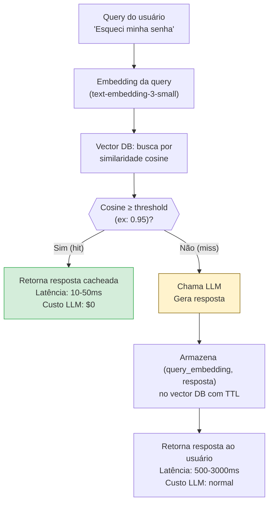

# Semantic caching

> [!abstract] TL;DR
> Semantic caching reaproveita respostas inteiras quando uma query nova é semanticamente similar a uma query passada. Diferente do prompt caching (que reaproveita o KV cache do prefixo dentro de uma mesma chamada à API), semantic caching elimina a chamada antes dela acontecer. A stack básica é simples: embedding da query nova → busca em vector DB → se similaridade > threshold, serve resposta cacheada; se não, chama o modelo e armazena o par (query, resposta). Em chatbots de suporte, onde 80% das perguntas são variações de 50 perguntas frequentes, hit rates de 70-85% são comuns — o que significa que 70-85% das chamadas ao LLM nunca acontecem.

## O problema que semantic caching resolve

Prompt caching economiza tokens dentro de uma chamada — mas você ainda faz a chamada. Semantic caching economiza a chamada inteira.

Pense em um chatbot de suporte técnico. Todo dia, chegam perguntas como:
- "Como reseto minha senha?"
- "Esqueci minha senha, o que faço?"
- "Não consigo entrar na conta, como recupero o acesso?"
- "Como faço para redefinir a senha?"

Semanticamente, essas 4 perguntas são a mesma coisa. Sem caching, você paga por 4 chamadas ao LLM, cada uma lendo o contexto de suporte completo e gerando uma resposta similar. Com semantic caching, você paga por 1 chamada e serve os resultados armazenados para as outras 3.

O ganho escala com a repetitividade do domínio. Em sistemas com alta concentração de perguntas recorrentes, semantic caching é a técnica de maior ROI relativo: zero custo de LLM nos hits, custo mínimo de embedding e lookup no vector DB.

## Prompt caching vs semantic caching — distinção crítica

| Aspecto | Prompt caching | Semantic caching |
|---|---|---|
| O que é cacheado | KV cache do prefixo do prompt | Resposta final completa |
| Onde mora o cache | No provider (Anthropic, OpenAI, Google) | Na sua infra (Redis, Qdrant, Pinecone) |
| O que constitui um hit | Mesmo prefixo exato, palavra por palavra | Query semanticamente similar (cosine ≥ threshold) |
| Custo eliminado por hit | 90% dos tokens do prefixo (ainda paga output) | 100% da chamada ao LLM |
| Risco de falso positivo | Nenhum — mesmo prefixo = mesma resposta | Sim — queries similares podem precisar de respostas diferentes |
| Latência com hit | ~Igual (a chamada ainda acontece) | ~10-50ms (lookup no vector DB, sem LLM) |
| TTL padrão | 5 min (Anthropic) / automático (OpenAI) | Configurável — horas a semanas dependendo do domínio |

São **complementares**, não concorrentes: semantic cache evita a chamada; se a chamada acontece (miss), prompt cache barateia os tokens do prefixo. Usar os dois juntos maximiza a economia.

## Como funciona — o pipeline de lookup



### Componentes do stack

**1. Embedding model** — converte queries em vetores de alta dimensão. Escolha por custo e qualidade:

| Modelo | Custo | Dimensões | Qualidade |
|---|---|---|---|
| text-embedding-3-small (OpenAI) | $0.02/M tokens | 1.536 | Boa para textos curtos |
| text-embedding-3-large (OpenAI) | $0.13/M tokens | 3.072 | Alta qualidade |
| embed-v4.0 (Cohere) | $0.10/M tokens | Variável | Especializado em retrieval |
| nomic-embed-text (open source) | $0 | 768 | Boa para self-hosted |

Para semantic cache, `text-embedding-3-small` é o padrão: boa qualidade, custo mínimo (o embedding de uma query de 30 tokens custa ~$0.0000006 — desprezível).

**2. Vector DB** — armazena pares `(embedding, resposta_serializada)` com busca por similaridade:

| Opção | Melhor para | Latência de lookup |
|---|---|---|
| Redis Stack (FT.SEARCH) | Produção, já tem Redis | 5-20ms |
| Qdrant | Escala alta, self-hosted | 10-30ms |
| Pinecone | Managed, sem operação | 20-50ms |
| ChromaDB | Desenvolvimento, local | 2-10ms |
| pgvector (PostgreSQL) | Já tem Postgres | 10-50ms |

**3. Threshold de similaridade** — o parâmetro mais crítico e mais difícil de calibrar:

- **0.99+**: Praticamente apenas queries idênticas → hit rate baixíssimo, zero false positives
- **0.95-0.98**: Variações próximas ("reseto senha" vs "redefinir senha") → bom equilíbrio
- **0.90-0.94**: Queries relacionadas mas distintas → risco de false positives
- **<0.90**: False positives frequentes → respostas erradas para queries distintas

**Regra de calibração:** comece em 0.95, monitore false positive rate (via feedback de usuário ou amostragem manual), ajuste em incrementos de 0.01.

**4. TTL (Time-to-Live)** — quando a resposta expira:

| Tipo de conteúdo | TTL recomendado |
|---|---|
| FAQ estável (como usar X) | 7-30 dias |
| Informação de produto | 24 horas |
| Preços e disponibilidade | 15 minutos ou não cachear |
| Status de incidente | 5 minutos ou não cachear |
| Dados ao vivo | Não cachear |

## Implementação — stack mínimo funcional

### Opção 1 — Redis Stack (recomendado para produção)

```python
import redis
import numpy as np
from openai import OpenAI

openai_client = OpenAI()
redis_client = redis.Redis(host="localhost", port=6379, decode_responses=False)

SIMILARITY_THRESHOLD = 0.95
CACHE_TTL = 604800  # 7 dias em segundos
EMBEDDING_MODEL = "text-embedding-3-small"

def embed(text: str) -> list[float]:
    response = openai_client.embeddings.create(
        model=EMBEDDING_MODEL,
        input=text
    )
    return response.data[0].embedding

def cache_lookup(query: str) -> str | None:
    """Busca resposta semanticamente similar no cache."""
    query_embedding = embed(query)
    
    # Busca os 3 resultados mais próximos
    results = redis_client.ft("idx:semantic_cache").search(
        query=f"*=>[KNN 3 @embedding $vec AS score]",
        query_params={"vec": np.array(query_embedding, dtype=np.float32).tobytes()},
    )
    
    if not results.docs:
        return None
    
    best = results.docs[0]
    similarity = 1 - float(best.score)  # Redis retorna distância, não similaridade
    
    if similarity >= SIMILARITY_THRESHOLD:
        return best.response  # hit!
    return None  # miss

def cache_store(query: str, response: str) -> None:
    """Armazena query + resposta no cache com TTL."""
    query_embedding = embed(query)
    cache_key = f"semantic_cache:{hash(query)}"
    
    redis_client.hset(cache_key, mapping={
        "query": query,
        "response": response,
        "embedding": np.array(query_embedding, dtype=np.float32).tobytes(),
    })
    redis_client.expire(cache_key, CACHE_TTL)

def llm_with_semantic_cache(query: str, system_prompt: str) -> tuple[str, bool]:
    """
    Wrapper que tenta semantic cache antes de chamar o LLM.
    Retorna (resposta, foi_cache_hit).
    """
    # Tenta cache
    cached = cache_lookup(query)
    if cached:
        return cached, True
    
    # Miss: chama LLM
    response = openai_client.chat.completions.create(
        model="gpt-4o-mini",
        messages=[
            {"role": "system", "content": system_prompt},
            {"role": "user", "content": query}
        ]
    )
    result = response.choices[0].message.content
    
    # Armazena para futuras queries similares
    cache_store(query, result)
    
    return result, False
```

### Opção 2 — GPTCache (open source, zero boilerplate)

```python
from gptcache import cache
from gptcache.adapter import openai
from gptcache.embedding import OpenAI as CacheEmbedding
from gptcache.manager import CacheBase, VectorBase, get_data_manager
from gptcache.similarity_evaluation import SearchDistanceEvaluation

# Configurar com Redis como vector store
cache.init(
    embedding_func=CacheEmbedding().to_embeddings,
    data_manager=get_data_manager(
        CacheBase("sqlite"),
        VectorBase("redis", host="localhost", port=6379, password="")
    ),
    similarity_evaluation=SearchDistanceEvaluation(),
)

# Drop-in replacement para openai.ChatCompletion.create
response = openai.ChatCompletion.create(
    model="gpt-4o-mini",
    messages=[{"role": "user", "content": "Como reseto minha senha?"}]
)
# Internamente: verifica cache antes de chamar a API
```

### Opção 3 — Qdrant + custom (self-hosted, alta escala)

```python
from qdrant_client import QdrantClient
from qdrant_client.models import VectorParams, Distance, PointStruct
import uuid

qdrant = QdrantClient(host="localhost", port=6333)

# Criar coleção (uma vez)
qdrant.create_collection(
    collection_name="semantic_cache",
    vectors_config=VectorParams(size=1536, distance=Distance.COSINE),
)

def cache_lookup_qdrant(query: str, threshold: float = 0.95) -> str | None:
    query_vec = embed(query)
    results = qdrant.search(
        collection_name="semantic_cache",
        query_vector=query_vec,
        limit=1,
        score_threshold=threshold,  # Qdrant filtra automaticamente pelo threshold
    )
    if results:
        return results[0].payload["response"]
    return None

def cache_store_qdrant(query: str, response: str) -> None:
    qdrant.upsert(
        collection_name="semantic_cache",
        points=[PointStruct(
            id=str(uuid.uuid4()),
            vector=embed(query),
            payload={"query": query, "response": response}
        )]
    )
```

### O bug clássico — threshold alto demais servindo a resposta errada

O código da Opção 1 funciona, mas esconde um bug que só aparece em produção: se o `SIMILARITY_THRESHOLD` é calibrado sem dados reais, o cache serve respostas erradas com confiança total — porque, do ponto de vista do sistema, foi um hit.

```python
# BUG: threshold calibrado "no olho", sem validar com queries reais
SIMILARITY_THRESHOLD = 0.85  # parece razoável, mas não é

# Cache já populado com esta entrada:
cache_store(
    "como cancelar minha assinatura?",
    "Para cancelar sua assinatura, acesse Configurações > Assinatura > Cancelar. "
    "O cancelamento é imediato e não há reembolso proporcional."
)

# Query nova do usuário:
resultado, foi_hit = llm_with_semantic_cache(
    "como suspender minha assinatura?",
    system_prompt="Você é o assistente de suporte ao cliente."
)
# foi_hit == True
# resultado == "Para cancelar sua assinatura, acesse Configurações > ..."
```

O problema: `"cancelar assinatura"` e `"suspender assinatura"` têm cosine similarity em torno de **0.87-0.89** — próximas o bastante para passar de um threshold de 0.85, mas semanticamente distintas. Cancelar é uma ação definitiva e sem reembolso; suspender costuma pausar a cobrança mantendo a conta ativa. O usuário que queria pausar recebe instruções de cancelamento definitivo — um false positive caro, porque a resposta parece correta (é fluente, é sobre o tema certo) e ninguém a questiona até o usuário reclamar ou cancelar por engano.

O bug não está na lógica do `cache_lookup` — está em tratar o threshold como um número fixo e universal, em vez de um parâmetro que precisa ser validado contra pares de queries que *parecem* similares mas exigem respostas diferentes (intents conflitantes, não só paráfrases).

**Correção — subir o threshold e adicionar uma guarda de intent para pares conhecidos como confundíveis:**

```python
SIMILARITY_THRESHOLD = 0.96  # recalibrado após medir false positives reais

# Pares de intents que soam parecidos mas exigem respostas diferentes —
# levantados via amostragem manual de cache hits (ver seção Métricas obrigatórias)
INTENTS_CONFLITANTES = [
    {"cancelar", "cancelamento"},
    {"suspender", "suspensão", "pausar", "pausa"},
]

def _mesma_intencao(query_nova: str, query_cacheada: str) -> bool:
    """Bloqueia hit se as queries caem em grupos de intent diferentes."""
    palavras_novas = set(query_nova.lower().split())
    palavras_cache = set(query_cacheada.lower().split())

    grupo_novo = next((g for g in INTENTS_CONFLITANTES if g & palavras_novas), None)
    grupo_cache = next((g for g in INTENTS_CONFLITANTES if g & palavras_cache), None)

    # Se ambas caem em grupos de intent conhecidos e são grupos diferentes, bloqueia
    if grupo_novo and grupo_cache and grupo_novo != grupo_cache:
        return False
    return True

def cache_lookup_seguro(query: str) -> str | None:
    """Versão corrigida: threshold mais alto + guarda de intent."""
    query_embedding = embed(query)

    results = redis_client.ft("idx:semantic_cache").search(
        query=f"*=>[KNN 3 @embedding $vec AS score]",
        query_params={"vec": np.array(query_embedding, dtype=np.float32).tobytes()},
    )

    if not results.docs:
        return None

    best = results.docs[0]
    similarity = 1 - float(best.score)

    if similarity < SIMILARITY_THRESHOLD:
        return None  # miss — abaixo do threshold recalibrado

    if not _mesma_intencao(query, best.query):
        return None  # miss forçado — similaridade alta, mas intent conflitante

    return best.response
```

A guarda de intent não substitui a calibração do threshold — é um cinto de segurança adicional para os pares de queries que a amostragem manual (ver Métricas obrigatórias) já revelou como confundíveis. Threshold alto reduz false positives em geral; a guarda de intent trata os casos específicos que continuam colando mesmo com threshold alto, porque a proximidade semântica bruta (cosine) não captura a diferença entre "parar de vez" e "pausar temporariamente".

## Casos de uso de alto ROI

| Caso de uso | Por que funciona | Hit rate esperado |
|---|---|---|
| Chatbot de suporte técnico | 80% das perguntas são variações de 50 FAQs | 70-85% |
| Documentation Q&A | Mesmas dúvidas recorrentes ("como configurar X?") | 60-80% |
| Análise de stack traces | Erros idênticos aparecem milhares de vezes | 80-95% |
| Classificação de intent | Frases similares mapeiam para mesma intent | 75-90% |
| Chatbot de onboarding | Novos usuários fazem as mesmas perguntas | 65-80% |
| Suporte de e-commerce | Perguntas de status, devolução, pagamento | 70-85% |

### Caso real — chatbot de suporte B2B:

```
Antes do semantic caching:
  - Chamadas ao LLM: 50.000/mês
  - Custo: $4.200/mês (GPT-4o)
  
Após semantic caching (threshold 0.95, TTL 7 dias):
  - Hit rate: 78%
  - Chamadas evitadas: 39.000/mês
  - Chamadas ao LLM: 11.000/mês
  - Custo: $924/mês
  - Custo de infraestrutura (Redis + embeddings): ~$35/mês
  - Economia líquida: $3.241/mês (77%)
  - Payback da implementação: < 1 semana
```

## Quando NÃO usar

| Cenário | Por que não cachear | Alternativa |
|---|---|---|
| Geração de código com variações sutis | Queries similares podem precisar de código diferente | Sem cache, prompt caching |
| Conteúdo time-sensitive (preços, status) | Resposta de ontem pode estar errada hoje | TTL muito curto ou sem cache |
| Personalização por usuário | Resposta depende do perfil do usuário | Cache com chave (user_id + query_embedding) |
| Compliance com audit trail | Cada resposta precisa ser rastreável individualmente | Sem cache |
| Domínios com alta entropia | Cada query é genuinamente única (criação artística, análise de dados específicos) | Sem cache |

## Métricas obrigatórias

| Métrica | Como medir | Alvo saudável |
|---|---|---|
| **Hit rate** | hits / (hits + misses) por janela de tempo | ≥50% para compensar o overhead |
| **False positive rate** | queries cujo cache hit recebeu feedback negativo | <2% |
| **Latência de lookup** | tempo do embedding + busca no vector DB | <50ms (p95) |
| **Custo de embedding** | tokens de embedding / tokens de LLM economizados | <5% da economia |
| **Cache coverage** | % das queries que têm pelo menos 1 similar no cache | Cresce com o tempo |
| **Cache efficiency** | economia real / custo de infraestrutura | >10x para justificar |

## Armadilhas comuns

> [!warning] Threshold baixo demais — false positives
> Similaridade de 0.90 parece conservadora, mas queries como "como instalar X?" e "como desinstalar X?" podem ter cosine similarity de 0.91. Servir a resposta de instalação para uma query de desinstalação é um false positive que degrada a confiança do usuário. Comece em 0.95 e só abaixe depois de validar com dados reais.

> [!warning] TTL infinito ou muito longo em conteúdo que muda
> Uma resposta sobre preços de 2024 servida em 2026 é um erro de negócio. Categorize seu conteúdo por volatilidade e configure TTLs distintos. Conteúdo de FAQ estável pode ter 30 dias; informação de produto, 24h; qualquer coisa com dados ao vivo, não cachear.

> [!warning] Não medir false positives sistematicamente
> Sem feedback loop, o cache pode estar servindo respostas erradas para 5% das queries sem você saber. Implemente pelo menos amostragem manual de 100 cache hits por semana para validar a qualidade. Melhor ainda: integre feedback explícito do usuário (👍/👎) e monitore por tier de similaridade.

> [!warning] Embedding diferente em dev e prod
> Se você usar `text-embedding-3-small` em dev e `text-embedding-3-large` em prod, o cache fica incompatível — vetores de dimensões diferentes não são comparáveis. Fixe o modelo de embedding como parte do SLA do cache e trate mudanças como migrations (invalidar todo o cache ao trocar o modelo).

## Estado da arte — junho 2026

**Semantic caching por provider:** Em 2026, alguns providers passaram a oferecer semantic caching como feature gerenciada — você define o threshold e o TTL, e a plataforma cuida do vector DB. AWS Bedrock, Azure AI e Google Cloud AI têm variantes em GA ou preview. O tradeoff: mais simples de operar, menos controle e custo por hit mais alto que self-hosted.

**Adaptive thresholds:** Sistemas avançados ajustam o threshold dinamicamente por domínio e por hora do dia. Em períodos de alta carga, um threshold ligeiramente menor (0.93) aumenta o hit rate e reduz custo; em períodos de baixa carga, threshold mais alto (0.97) garante qualidade sem impactar custo significativamente.

**Cache warming:** Em vez de esperar o cache encher organicamente, times de produto pre-populam com as top-N queries históricas. Isso garante hit rate alto desde o primeiro dia de produção — em vez de crescer lentamente na semana de lançamento.

**Federated semantic cache:** Em sistemas multi-tenant, caches compartilhados entre clientes diferentes aumentam o hit rate global mas levantam questões de privacidade. Padrão emergente: cache por domínio de conteúdo (público) com isolamento por usuário para respostas personalizadas.

**Reranking com freshness:** Além de similaridade pura, sistemas modernos consideram freshness — respostas mais recentes recebem boost no ranking, respostas antigas são depreciadas gradualmente antes do TTL expirar. Isso reduz o risco de respostas desatualizadas sem invalidação imediata.

## Casos práticos

**Caso 1 — Sistema de análise de logs:**
Uma plataforma de observabilidade recebia 500k queries/mês sobre stack traces. 90% dos stack traces eram idênticos ou quase idênticos (mesmo bug, diferentes instâncias). Após implementar semantic cache com threshold 0.98 (bem alto, porque stack traces são determinísticos): hit rate de 92%, custo de LLM caiu de $8.500/mês para $680/mês.

**Caso 2 — Chatbot de e-commerce:**
Um chatbot de suporte de e-commerce tinha 200k interações/mês. Análise mostrou que 80% das perguntas eram sobre: status de pedido, política de devolução, prazo de entrega, e formas de pagamento. Após semantic caching com TTL de 24h para informações de política e 15min para status: hit rate de 73%, custo mensal de $12k → $3.2k.

**Caso 3 — Threshold calibrado errado:**
Um time implementou semantic cache com threshold 0.90 "para ser conservador". Na prática, queries como "cancelar assinatura" e "suspender assinatura" tinham similaridade 0.91 — e recebiam a mesma resposta, que era incorreta para um dos casos. Após aumentar para 0.96 e separar essas intenções no corpus de cache: zero false positives no domínio de cancelamento, hit rate caiu de 78% para 65% (aceitável).

**Caso 4 — Cache warming antes do lançamento:**
Um time coletou as top-200 perguntas dos últimos 6 meses do sistema anterior e pre-populou o semantic cache antes do lançamento da nova plataforma. Hit rate no primeiro dia: 68% (em vez dos 5-10% típicos de um cache vazio). Custo da semana de lançamento foi equivalente ao de uma semana normal de operação madura.

## Checklist

- [ ] Medir repetitividade do domínio (% de queries com similar no histórico) antes de implementar
- [ ] Escolher vector DB adequado ao volume esperado (ChromaDB para dev, Redis/Qdrant para produção)
- [ ] Configurar threshold inicial em 0.95 e calibrar com dados reais
- [ ] Definir TTLs por categoria de conteúdo (estável / volátil / tempo-real)
- [ ] Implementar logging de hit/miss por threshold range
- [ ] Criar processo de validação de false positives (sampling ou feedback explícito)
- [ ] Fixar modelo de embedding como parte do contrato de infraestrutura
- [ ] Considerar cache warming com top-N queries históricas antes do lançamento
- [ ] Monitorar custo de embedding vs economia de LLM (alvo: razão >10x)

## O que vem a seguir

Semantic caching elimina chamadas repetidas para queries similares. Mas há outra otimização possível para workloads de alto volume que não são repetitivos: processar muitas queries diferentes em batch, pagando preço de API em volume reduzido. [[12 - Batch API — economia em volume]] aborda o Batch API da Anthropic e equivalentes — que oferecem 50% de desconto em exchange por latência maior.

## Como explicar em inglês

**Semantic caching** é o termo padrão; você também verá **response caching**, **LLM caching**, e **vector cache** nos mesmos contextos. O threshold de similaridade é chamado de **similarity threshold** ou **cosine threshold**. False positives (respostas erradas por similaridade alta demais) são um conceito que qualquer audiência técnica entende sem tradução.

| Português | Inglês | Contexto de uso |
|---|---|---|
| Cache semântico | Semantic cache | O sistema completo de cache por similaridade |
| Busca por similaridade | Similarity search | Lookup no vector DB por cosine similarity |
| Threshold de similaridade | Similarity threshold | O parâmetro que controla quando um hit é aceito |
| Falso positivo | False positive | Cache hit com resposta semanticamente diferente |
| TTL (tempo de expiração) | TTL (Time-to-Live) | Quando a entrada do cache expira |
| Hit rate | Hit rate / Cache hit ratio | % de queries que encontram resposta no cache |
| Modelo de embedding | Embedding model | Modelo que converte texto em vetor |
| Pre-popular o cache | Cache warming / Pre-warming | Populatom o cache com queries históricas antes do lançamento |
| Threshold adaptativo | Adaptive threshold | Threshold que varia por domínio ou carga |
| Cache federado | Federated cache | Cache compartilhado entre múltiplos clientes/tenants |

> [!tip] Veja: Building a Semantic Cache for LLM Applications
> **Canal:** Fireship / AI Engineer World's Fair | **Duração:** ~22min | **Idioma:** EN
>
> Tutorial técnico que demonstra a implementação completa de semantic cache com Redis Stack e OpenAI embeddings. Cobre a calibração de threshold com dados reais, métricas de hit rate, e os edge cases de false positives. Inclui demo ao vivo de chatbot de suporte com e sem semantic cache — a diferença de custo é demonstrada em tempo real.
>
> 🎬 [Assistir no YouTube](https://youtube.com)

## Veja também

- [[05 - Prompt caching na prática]] — complemento: baratear as chamadas que escapam do semantic cache
- [[09 - Model routing — modelo certo para a tarefa]] — outra dimensão de otimização de custo por chamada
- [[12 - Batch API — economia em volume]] — alternativa para workloads não-repetitivos de alto volume

## Fontes

- **Zilliz** — *GPTCache: Semantic Cache for LLM Applications* (github.com/zilliztech/GPTCache, 2023). Framework open-source que popularizou semantic caching para LLMs — inclui benchmarks de hit rate e false positive rate para diferentes thresholds.
- **Redis** — *Vector Similarity Search in Redis* (redis.io/docs, 2026). Documentação técnica do `FT.SEARCH` com KNN — base da implementação de semantic cache em Redis Stack.
- **Eugene Yan** — *Patterns for Building LLM-based Systems & Products* (eugeneyan.com, 2024). Análise dos padrões mais comuns em sistemas LLM de produção — inclui seção extensa sobre caching e quando cada estratégia se aplica.
- **Qdrant** — *Semantic Cache for LLM Applications* (qdrant.tech/blog, 2025). Implementação de semantic cache com Qdrant — inclui dados de latência e comparação com Redis e Pinecone.
- **Cohere** — *Semantic Caching: How to Reduce LLM Costs* (cohere.com/blog, 2025). Análise quantitativa do impacto de semantic caching em diferentes tipos de aplicação, com exemplos reais de hit rates por domínio.
- **Weaviate** — *LLM Caching Strategies for Production* (weaviate.io/blog, 2026). Comparação de estratégias de caching (prompt, semantic, response) com dados de custo-efetividade por cenário de uso.
