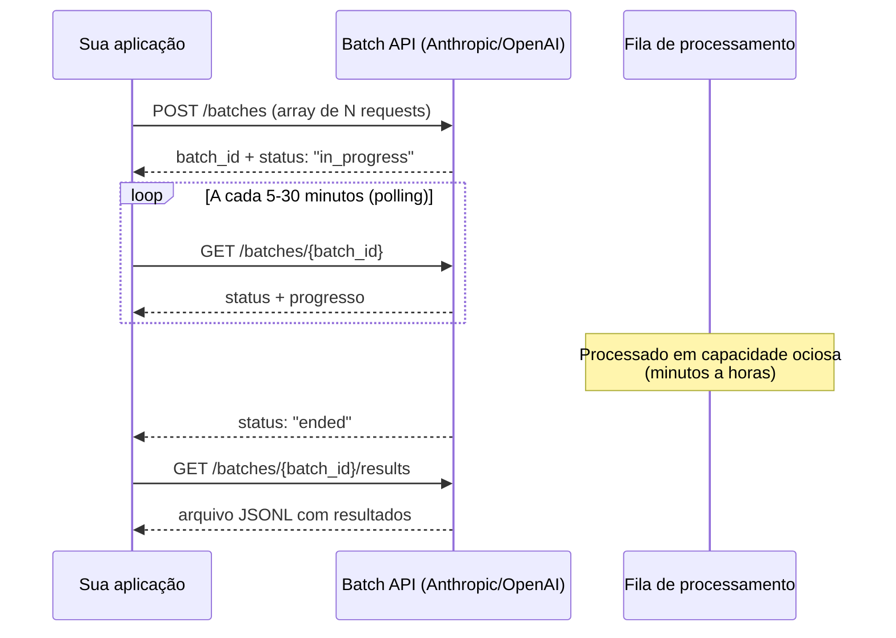

# Batch API — economia em volume

> [!abstract] TL;DR
> Batch APIs permitem enviar lotes de requests para processamento assíncrono com ~50% de desconto sobre o preço normal da API. O tradeoff é latência: em vez de resposta em segundos, você espera minutos a horas. Ideal para qualquer task que não precisa de resposta em tempo real — geração de testes em massa, documentação automatizada, migrações de código, análise de log histórico, classificação de grandes datasets. A regra: se você pode esperar 24h, você economiza 50%.

## O problema: pagar preço premium por workloads que não precisam ser rápidos

APIs de LLM cobram pelo tempo de computação necessário para servir sua request em latência real-time. Para garantir que sua resposta chegue em <3 segundos, o provedor mantém capacidade ociosa dedicada à sua region — e você paga por isso.

Mas muitas tasks de engenharia não precisam de resposta em segundos:

```
Tasks que você poderia processar durante a noite:
  ✅ Documentar todas as funções públicas do seu SDK (300 funções)
  ✅ Gerar testes unitários para módulos sem cobertura (50 arquivos)
  ✅ Migrar 200 componentes de JavaScript para TypeScript
  ✅ Analisar e categorizar 10.000 logs de erro da semana passada
  ✅ Gerar changelogs estruturados para cada commit do trimestre
  ✅ Extrair metadados de 5.000 tickets de suporte históricos
```

Para essas tasks, pagar preço de API em tempo real é desperdiçar dinheiro em capacidade que você não precisa. Batch API é o contrato onde você diz: "Processe isso quando tiver capacidade ociosa, pode demorar até 24h" — e o provedor te dá 50% de desconto em troca.

## Como funciona o processamento em batch

### Fluxo básico



### Implementação com Anthropic Batch API

```python
import anthropic
import json
import time
from pathlib import Path

client = anthropic.Anthropic()

def run_batch(requests: list[dict], output_path: str = "batch_results.jsonl") -> dict:
    """
    Executa um batch de requests e aguarda a conclusão.
    
    requests: lista de dicts com {custom_id, model, messages, max_tokens}
    output_path: arquivo JSONL para salvar resultados
    """
    # Formatar requests no formato Anthropic
    batch_requests = [
        anthropic.types.MessageCreateParamsNonStreaming(
            custom_id=req["custom_id"],
            params={
                "model": req.get("model", "claude-sonnet-4-6"),
                "max_tokens": req.get("max_tokens", 2048),
                "messages": req["messages"]
            }
        )
        for req in requests
    ]
    
    # Criar o batch
    batch = client.messages.batches.create(requests=batch_requests)
    print(f"Batch criado: {batch.id} | {len(requests)} requests")
    
    # Aguardar conclusão com polling
    poll_interval = 30  # segundos
    while batch.processing_status == "in_progress":
        time.sleep(poll_interval)
        batch = client.messages.batches.retrieve(batch.id)
        
        progress = batch.request_counts
        print(f"Status: {batch.processing_status} | "
              f"Processados: {progress.succeeded + progress.errored}/{progress.total}")
    
    print(f"Batch concluído: {batch.request_counts.succeeded} sucessos, "
          f"{batch.request_counts.errored} erros")
    
    # Salvar resultados em JSONL
    results = {}
    with open(output_path, "w") as f:
        for result in client.messages.batches.results(batch.id):
            f.write(result.model_dump_json() + "\n")
            if result.result.type == "succeeded":
                results[result.custom_id] = result.result.message.content[0].text
            else:
                results[result.custom_id] = f"ERROR: {result.result.error}"
    
    return results


# Exemplo: gerar documentação para 50 funções
def generate_docs_batch(functions: list[dict]) -> dict[str, str]:
    """
    functions: lista de {name, signature, body}
    Retorna: {name: docstring}
    """
    requests = [
        {
            "custom_id": func["name"],
            "messages": [{
                "role": "user",
                "content": f"""Gere uma docstring Python para esta função.
Formato: Google docstring style.
Máximo: 10 linhas.

```python
{func["signature"]}
{func["body"]}
```"""
            }],
            "max_tokens": 300
        }
        for func in functions
    ]
    
    return run_batch(requests, "docs_results.jsonl")


# Chama durante a noite / CI pipeline / processo agendado
if __name__ == "__main__":
    functions = load_functions_from_codebase()  # seu parser
    docs = generate_docs_batch(functions)
    write_docs_to_files(docs)  # seu writer
```

### Implementação com OpenAI Batch API

```python
import openai
import json
import time

client = openai.OpenAI()

def create_openai_batch(requests: list[dict]) -> str:
    """Cria um arquivo JSONL e submete o batch."""
    # OpenAI usa arquivo JSONL como input
    jsonl_content = "\n".join([
        json.dumps({
            "custom_id": req["custom_id"],
            "method": "POST",
            "url": "/v1/chat/completions",
            "body": {
                "model": req.get("model", "gpt-4o-mini"),
                "messages": req["messages"],
                "max_tokens": req.get("max_tokens", 1024)
            }
        })
        for req in requests
    ])
    
    # Upload do arquivo
    with open("batch_input.jsonl", "w") as f:
        f.write(jsonl_content)
    
    with open("batch_input.jsonl", "rb") as f:
        batch_file = client.files.create(file=f, purpose="batch")
    
    # Criar batch
    batch = client.batches.create(
        input_file_id=batch_file.id,
        endpoint="/v1/chat/completions",
        completion_window="24h"
    )
    
    return batch.id


def wait_for_batch(batch_id: str, poll_interval: int = 60) -> dict:
    """Aguarda conclusão e retorna resultados."""
    while True:
        batch = client.batches.retrieve(batch_id)
        
        if batch.status == "completed":
            # Baixar resultados
            result_file = client.files.content(batch.output_file_id)
            results = {}
            for line in result_file.text.splitlines():
                result = json.loads(line)
                results[result["custom_id"]] = (
                    result["response"]["body"]["choices"][0]["message"]["content"]
                    if result["response"]["status_code"] == 200
                    else f"ERROR: {result['error']}"
                )
            return results
        
        if batch.status in ["failed", "cancelled"]:
            raise RuntimeError(f"Batch falhou: {batch.status}")
        
        time.sleep(poll_interval)
```

## Quando usar vs quando não usar

| Task | Batch? | Por quê |
|---|---|---|
| Documentar 300 funções de SDK | ✅ | Pode esperar overnight |
| Gerar testes para todos os módulos | ✅ | CI pipeline pode rodar em horário de baixo custo |
| Migrar 200 componentes de framework | ✅ | Task única, resultado usado depois |
| Classificar 50.000 tickets históricos | ✅ | Dataset grande, processamento assíncrono ideal |
| Analisar logs da semana passada | ✅ | Retrospectivo, sem urgência |
| Chat interativo com usuário | ❌ | Usuário está esperando em tempo real |
| Agente de coding em sessão ativa | ❌ | Cada step depende do anterior |
| Debug em tempo real | ❌ | Urgente |
| Geração de relatório em tempo real | ❌ | Usuário aguardando |
| Code review de PR com feedback imediato | ⚠️ | Depende do SLA do time |

> [!warning] Latência de horas, não segundos
> O SLA do Batch API da Anthropic é "até 24h" — na prática, a maioria dos lotes de até 10.000 requests é processada em 15-120 minutos. Mas você não tem garantia. Nunca use Batch API em fluxos que um usuário está esperando, ou em pipelines com SLA de minutos. Se o dado precisa estar disponível em menos de 30 minutos, use a API síncrona normal.

## Comparativo de pricing — junho 2026

| Provider | API padrão | Batch API | Desconto | SLA máximo |
|---|---|---|---|---|
| Anthropic (Sonnet) | $3/$15 (input/output por MTok) | $1.50/$7.50 | 50% | 24h |
| Anthropic (Haiku) | $0.25/$1.25 | $0.125/$0.625 | 50% | 24h |
| OpenAI (GPT-4o) | $2.50/$10 | $1.25/$5 | 50% | 24h |
| OpenAI (GPT-4o-mini) | $0.15/$0.60 | $0.075/$0.30 | 50% | 24h |
| Google (Gemini 2.0 Flash) | $0.075/$0.30 | Variável | Variável | Variável |

*Preços approximados de junho/2026 — verifique documentação oficial para valores exatos.*

## Combinando batch com outros padrões de economia

Batch API não é exclusivo de outros padrões — combina:

```
Batch (50% desconto de preço)
  + Model routing (Haiku para tasks simples = 12x mais barato que Opus)
  + Prompt caching (se muitas requests compartilham o mesmo system prompt)
  = Redução cumulativa de 70-90% vs API síncrona com modelo caro
```

> [!warning] Prompt caching + batch: compatibilidade limitada
> Batch requests geralmente não se beneficiam de prompt caching da mesma forma que chamadas síncronas. Os tokens de cache precisam ser quentes (recentes) no momento do processamento, mas o batch pode ser processado horas depois da submissão — quando o cache já expirou. Em lotes grandes onde o mesmo system prompt é compartilhado, o caching pode funcionar dentro do lote (requests processadas em sequência dentro do mesmo batch), mas não entre batches separados.

## Padrões de implementação

### Pattern 1 — Batch em CI/CD

```yaml
# .github/workflows/ai-docs.yml
name: Generate Documentation

on:
  schedule:
    - cron: '0 2 * * 1'  # Segunda-feira, 2am (fora do horário de pico)
  workflow_dispatch:

jobs:
  generate-docs:
    runs-on: ubuntu-latest
    steps:
      - uses: actions/checkout@v4
      - name: Generate docs via Batch API
        env:
          ANTHROPIC_API_KEY: ${{ secrets.ANTHROPIC_API_KEY }}
        run: |
          python scripts/generate_docs_batch.py \
            --target src/ \
            --output docs/api/ \
            --model claude-haiku-4-5-20251001  # Haiku + Batch = máxima economia
```

### Pattern 2 — Pipeline de migração

```python
def migrate_codebase_batch(source_dir: Path, target_framework: str) -> None:
    """
    Migra todos os arquivos de um diretório via Batch API.
    Uso: overnight, sem urgência.
    """
    files = list(source_dir.glob("**/*.js"))
    print(f"Migrando {len(files)} arquivos para {target_framework}")
    
    requests = [
        {
            "custom_id": str(f.relative_to(source_dir)),
            "messages": [{
                "role": "user",
                "content": f"Migre este código para {target_framework}.\n\n```js\n{f.read_text()}\n```"
            }],
            "max_tokens": 4096
        }
        for f in files
        if f.stat().st_size < 100_000  # Pular arquivos muito grandes
    ]
    
    results = run_batch(requests, "migration_results.jsonl")
    
    # Aplicar resultados
    for file_path, migrated_code in results.items():
        target_path = source_dir / file_path.replace(".js", ".ts")
        target_path.write_text(migrated_code)
    
    print(f"Migração concluída: {len(results)} arquivos")
```

### Pattern 3 — Análise de dataset

```python
def analyze_support_tickets(tickets: list[dict]) -> pd.DataFrame:
    """
    Classifica e extrai metadados de tickets de suporte.
    Ideal para análise histórica ou relatórios semanais.
    """
    requests = [
        {
            "custom_id": str(ticket["id"]),
            "messages": [{
                "role": "user",
                "content": f"""Analise este ticket de suporte e extraia:
1. Categoria (billing/technical/account/feature_request)
2. Urgência (low/medium/high/critical)  
3. Sentimento (positive/neutral/negative)
4. Ação necessária (1 linha)

Ticket: {ticket['content']}

Responda em JSON: {{"category": "...", "urgency": "...", "sentiment": "...", "action": "..."}}"""
            }],
            "max_tokens": 200
        }
        for ticket in tickets
    ]
    
    results = run_batch(requests)
    
    # Converter para DataFrame
    rows = []
    for ticket_id, result in results.items():
        try:
            metadata = json.loads(result)
            rows.append({"ticket_id": ticket_id, **metadata})
        except json.JSONDecodeError:
            rows.append({"ticket_id": ticket_id, "error": result})
    
    return pd.DataFrame(rows)
```

## Armadilhas comuns

> [!warning] Debugging difícil em batches grandes
> Se 5% das 10.000 requests de um batch falham, identificar quais falharam e por quê exige parse do arquivo JSONL de resultados. Implemente sempre logging estruturado com `custom_id` e inspecione amostras dos erros antes de reprocessar. Um batch de 10k requests com 500 erros pode ter padrões (todas as requests com >4096 tokens, ou com caracteres especiais no input).

> [!warning] Não implementar retry para requests com erro
> Batch APIs retornam requests individuais com status de erro (timeout, rate limit, content filter). Sem código de retry para esses casos, você perde silenciosamente parte do lote. Sempre verifique `batch.request_counts.errored` antes de considerar o batch completo, e reimplemente as requests com erro via nova chamada (síncrona ou novo batch).

> [!warning] Custom IDs não únicos no batch
> Se duas requests no mesmo batch têm o mesmo `custom_id`, você não consegue distinguir os resultados. Use IDs únicos (UUID, hash do conteúdo, ou caminho do arquivo) — nunca índices sequenciais sem contexto.

> [!warning] Limite de tamanho do batch
> Anthropic permite até 10.000 requests por batch; OpenAI, até 50.000. Mas batches muito grandes têm latência proporcional. Para workloads de 100k+ itens, particione em múltiplos batches de 5-10k e submeta em paralelo. Monitore cada batch individualmente e consolide os resultados.

## Estado da arte — junho 2026

**Batch API com webhook:** Em 2026, Anthropic e OpenAI passaram a suportar webhooks para notificação de conclusão do batch — você não precisa de polling. Ao criar o batch, especifique `notification_url` e a plataforma fará um POST quando o processamento terminar. Isso elimina o overhead de polling e simplifica a arquitetura de workflows assíncronos.

**Prioridade de batch configurável:** Algumas plataformas introduziram tiers de prioridade para batch: "standard" (até 24h, 50% desconto), "expedited" (até 4h, 25% desconto), e "overnight" (processamento garantido até 8h, 60% desconto). Isso permite escolher o tradeoff ideal por workload.

**Batch + streaming de resultados:** Em vez de baixar todos os resultados ao final, plataformas modernas oferecem streaming de resultados parciais — você começa a processar os primeiros resultados enquanto o resto do batch ainda está sendo processado. Útil para pipelines onde cada resultado alimenta um step subsequente.

## Casos práticos

**Caso 1 — Documentação de SDK (300 funções):**
Um time precisava documentar 300 funções de um SDK legado. Via API síncrona (Sonnet): $12 em 2 horas. Via Batch API (Haiku + batch): $1.50 em processamento overnight. Rodou no CI às 2am, documentação disponível às 9am. Custo total 87,5% menor.

**Caso 2 — Migração de testes (200 arquivos):**
Um time migrava testes de pytest para unittest em 200 arquivos. Via Batch API (Sonnet + batch): $30, processados em ~4h durante a madrugada. Via API síncrona seria $60 em tempo real. Resultado aplicado automaticamente via PR criado pelo CI.

**Caso 3 — Classificação de 50k tickets de suporte:**
Uma análise histórica de 6 meses de tickets (50.000 registros) para identificar padrões. Via Batch API (Haiku + batch): $9.50, processados em 3 batches de 16.667 requests cada, em ~6 horas. Via API síncrona (Haiku): $19, em ~15 horas. Batch foi 2x mais barato e 2.5x mais rápido (3 batches em paralelo vs 1 stream).

**Caso 4 — Geração de changelogs:**
Um time gerava changelogs estruturados para cada commit do quarter (1.200 commits). Via Batch API: $8, processados em ~2h. Resultado: 1.200 changelogs em formato Markdown, usados para gerar release notes automaticamente.

## Checklist

- [ ] Identificar workloads assíncronos no sistema que podem se beneficiar de batch
- [ ] Implementar `custom_id` único por request (UUID ou hash do conteúdo)
- [ ] Verificar o campo `request_counts.errored` ao final do batch
- [ ] Implementar retry automático para requests com erro
- [ ] Configurar webhook de notificação de conclusão (quando disponível)
- [ ] Combinar com model routing: Haiku para tasks simples no batch = máxima economia
- [ ] Testar com lote pequeno (10-100 requests) antes de escalar para milhares
- [ ] Implementar parsing de JSONL de resultados com tratamento de erros por linha
- [ ] Considerar paralelizar múltiplos batches para workloads > 20k requests

## O que vem a seguir

Com batch você economiza 50% no preço da API para workloads assíncronos. Mas às vezes o problema não é só o custo por token — é o volume de tokens no output. [[13 - Respostas concisas — controlar output tokens]] aborda como instruir o modelo para ser mais direto, reduzindo output sem perder qualidade — uma economia que se aplica tanto em batch quanto em chamadas síncronas.

## Como explicar em inglês

**Batch API** é o termo universal — Anthropic, OpenAI e Google usam exatamente esse nome. O processamento assíncrono em batch é chamado de **batch processing** ou **async processing**. O arquivo de resultados em formato linha-por-linha é um **JSONL file** (JSON Lines).

| Português | Inglês | Contexto de uso |
|---|---|---|
| API em lote | Batch API | O endpoint de processamento assíncrono |
| Processamento em lote | Batch processing | O modelo de execução assíncrona |
| Janela de conclusão | Completion window | O SLA máximo do batch (ex: "24h") |
| ID personalizado | Custom ID | Identificador único por request no batch |
| Polling | Polling | Verificar periodicamente o status do batch |
| Webhook de notificação | Completion webhook | Callback HTTP quando o batch termina |
| Resultado em JSONL | JSONL results | Arquivo de saída, uma linha JSON por resultado |
| Request com erro | Errored request | Request individual que falhou dentro do batch |
| Particionamento de batch | Batch partitioning | Dividir workload grande em múltiplos batches |
| Janela noturna | Overnight window | Executar batch durante horas de baixo custo |

> [!tip] Veja: Batch Processing LLMs at Scale — Production Patterns
> **Canal:** AI Engineering Summit | **Duração:** ~31min | **Idioma:** EN
>
> Talk técnica sobre padrões de processamento em lote com LLMs em produção. Cobre a implementação do pipeline completo (submissão, polling, parsing de resultados, retry de erros), estratégias de particionamento para workloads grandes, e integração com CI/CD. Inclui benchmarks reais de custo e latência comparando abordagens síncrona vs batch.
>
> 🎬 [Assistir no YouTube](https://youtube.com)

## Veja também

- [[09 - Model routing — modelo certo para a tarefa]] — combinar Haiku + batch para máxima economia
- [[11 - Semantic caching]] — alternativa quando o problema é repetitividade, não volume
- [[15 - Orçamento e hard limits]] — definir teto de gasto por job de batch
- [[16 - Auditoria de consumo]] — rastrear custo por batch job

## Fontes

- **Anthropic** — *Message Batches API* (docs.anthropic.com, 2026). Documentação oficial da Batch API da Anthropic, incluindo limites, pricing, e exemplos de código.
- **OpenAI** — *Batch API Reference* (platform.openai.com, 2026). Referência da Batch API da OpenAI com exemplos de JSONL e gestão de erros.
- **Google** — *Batch prediction for Gemini* (cloud.google.com/vertex-ai/docs, 2026). Documentação do processamento em batch no Vertex AI para modelos Gemini.
- **LangChain** — *Batch processing with LangChain* (docs.langchain.com, 2025). Padrões de batch em pipelines LangChain — inclui paralelismo e tratamento de erros em escala.
- **Hamel Husain** — *When to use Batch APIs for LLMs* (hamel.ai, 2025). Análise de custo-benefício de batch vs síncrono por tipo de workload — com dados reais e fórmulas para calcular o ponto de break-even.
