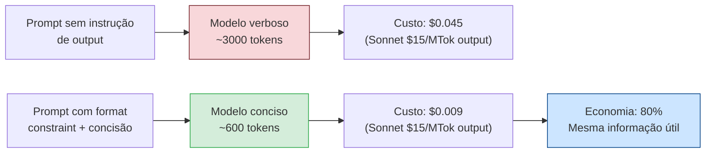

# Respostas concisas — controlar output tokens

> [!abstract] TL;DR
> Output tokens são 3-6x mais caros que input na maioria dos provedores. Modelos são verbosos por default — geram preâmbulos, explicações óbvias, reformulações da pergunta, e resumos do que acabaram de fazer. Nenhum disso agrega valor. As técnicas mais eficazes: instruções explícitas no system prompt do que NÃO gerar, format constraints (JSON em vez de prosa), e `max_tokens` calibrado por tipo de task. Reduções de 40-70% no output são alcançáveis sem degradar a qualidade que importa.

## O problema: modelos treinados para serem úteis também são treinados para serem verbosos

Modelos são treinados com RLHF (Reinforcement Learning from Human Feedback) para maximizar satisfação humana. E humanos, em avaliações, frequentemente preferem respostas completas, bem estruturadas e com contexto — mesmo quando 60% desse conteúdo é repetição desnecessária.

O resultado é um viés sistêmico para verbosidade:

```
Você: "Refatore esta função para usar list comprehension."

Modelo verboso (3.200 tokens):
  "Claro! Vou refatorar sua função para usar list comprehension,
   que é uma forma mais pythônica de criar listas. Aqui está o código:
   
   [código]
   
   Nesta versão, utilizamos list comprehension para substituir o loop
   for original. A expressão [...] itera sobre a lista original e aplica
   a transformação. Isso torna o código mais conciso e legível.
   
   As principais mudanças foram: [...]"

Modelo conciso (600 tokens):
  [código]
```

Você pediu código. Você recebeu uma aula. E pagou por cada token da aula.

O output verboso não é um bug — é o modelo funcionando como treinado. Sua responsabilidade como engenheiro é instruí-lo explicitamente para o modo que serve ao seu uso.



## Por que output tokens custam mais

Em todos os provedores, output custa significativamente mais que input por token:

| Provedor | Input | Output | Razão output/input |
|---|---|---|---|
| Anthropic (Sonnet) | $3/MTok | $15/MTok | **5x** |
| Anthropic (Haiku) | $0.25/MTok | $1.25/MTok | **5x** |
| OpenAI (GPT-4o) | $2.50/MTok | $10/MTok | **4x** |
| OpenAI (GPT-4o-mini) | $0.15/MTok | $0.60/MTok | **4x** |
| Google (Gemini 2.0 Flash) | $0.075/MTok | $0.30/MTok | **4x** |

O motivo é computacional: geração autoregressive (token por token) é computacionalmente mais intensa que o forward pass de leitura. Cada output token exige uma passagem completa pelo modelo. Input pode ser processado em paralelo (atenção); output é inerentemente sequencial.

**Consequência prática:** reduzir output em 50% tem o mesmo impacto em custo que reduzir input em 200-250%. Investimento em controlar output é proporcionalmente mais valioso que investimento em controlar input.

## Técnicas de controle de output

### 1. Instruções explícitas no system prompt

A técnica de maior impacto: diga ao modelo o que NÃO fazer. Proibições são mais eficazes que pedidos vagos de "seja conciso".

```markdown
## Regras de output (sistema prompt)

### Não fazer
- NÃO repita a pergunta ou reformule antes de responder
- NÃO adicione preâmbulos ("Claro!", "Ótima pergunta!", "Vou ajudar...")
- NÃO explique mudanças óbvias de código (o código já explica)
- NÃO adicione sumário ao final do que acabou de fazer
- NÃO ofereça alternativas quando o usuário não pediu

### Para código
- Retorne APENAS o código alterado, sem o arquivo inteiro
- Se apenas 1 função mudou, retorne apenas essa função
- Sem comentários explicativos em código novo (a não ser que pedir)
- Erros: retorne o erro + a linha do fix, não uma análise completa

### Para análise
- Resposta máxima: 3 parágrafos a não ser que instrução diferente
- Use bullet points para listas, não prosa longa
- Dados concretos > abstrações
```

**Impacto medido:** system prompt com instruções de output reduz verbosidade em 30-50% na maioria dos modelos. O efeito é mais forte em Claude (muito responsivo a instruções de formato) e moderado em GPT-4o.

### 2. Format constraints — JSON em vez de prosa

Quando você precisa de dados estruturados, JSON força o modelo a ser compacto:

```python
# ❌ Prosa — modelo verboso por natureza
prompt = "Analise este log de erro e me diga o que causou o problema."
# Output típico: 500-800 palavras de análise

# ✅ JSON schema — resposta mínima e parseable
prompt = """Analise este log de erro. Responda em JSON:
{
  "root_cause": "uma frase",
  "affected_component": "nome do componente",
  "fix": "ação específica em uma frase",
  "severity": "low|medium|high|critical"
}"""
# Output típico: 80-120 tokens de JSON válido
```

Para análise de código, prefira:

```python
# Em vez de "explique o que está errado aqui"
prompt = """Revise este código. Formato de resposta:
ISSUE: [descrição em 1 linha]
FIX: [código corrigido específico]
REASON: [motivo em 1 frase, omitir se óbvio]
"""
```

### 3. `max_tokens` calibrado por tipo de task

O parâmetro `max_tokens` limita o output máximo. Usar o default (geralmente 4096-8192) para tasks que precisam de 200 tokens é desperdiçar capacidade de buffer — e convida o modelo a usar todo o espaço disponível.

```python
# Calibração por tipo de task
MAX_TOKENS_BY_TASK = {
    "classification": 50,        # "positive", "negative", ou JSON de 3 campos
    "short_summary": 200,        # TL;DR de texto
    "code_review": 500,          # review de um arquivo médio
    "code_generation": 2048,     # implementação de uma função
    "bug_fix": 1024,             # patch de um bug
    "documentation": 800,        # docstring + exemplos
    "analysis_long": 1500,       # análise detalhada
    "refactoring_large": 4096,   # refactoring de módulo inteiro
}

def call_with_calibrated_tokens(task_type: str, messages: list) -> str:
    max_tokens = MAX_TOKENS_BY_TASK.get(task_type, 1024)
    response = client.messages.create(
        model="claude-sonnet-4-6",
        max_tokens=max_tokens,
        messages=messages
    )
    
    # Alertar se o modelo atingiu o limite (possível truncamento)
    if response.stop_reason == "max_tokens":
        logger.warning(f"Task {task_type}: resposta truncada em {max_tokens} tokens. "
                       f"Considere aumentar o limite.")
    
    return response.content[0].text
```

> [!warning] max_tokens muito baixo trunca a resposta sem aviso claro ao usuário
> Se `max_tokens=200` e o modelo precisa de 350 para completar o raciocínio, ele para abruptamente no meio. O campo `stop_reason == "max_tokens"` indica isso, mas a resposta incompleta pode ser usada silenciosamente. Sempre monitore `stop_reason` em produção e alertar quando ≠ "end_turn".

O código abaixo é o antipadrão mais comum em produção — parece inofensivo porque "funciona" na maioria das chamadas, e só quebra silenciosamente quando o modelo precisa de mais espaço do que o previsto:

```python
# ❌ Código-com-falha: não monitora stop_reason
def summarize_ticket(ticket_text: str) -> str:
    response = client.messages.create(
        model="claude-sonnet-4-6",
        max_tokens=300,  # calibrado para "resumo curto" — mas sem margem de segurança
        messages=[{"role": "user", "content": f"Resuma este ticket: {ticket_text}"}]
    )
    # Bug: extrai o texto e retorna direto, sem checar se a geração foi truncada
    return response.content[0].text

# Ticket longo e complexo chega no pipeline:
resumo = summarize_ticket(ticket_muito_detalhado)
# response.stop_reason == "max_tokens" (o modelo precisava de ~420 tokens)
# resumo termina no meio de uma frase: "O cliente relatou que o erro ocorre
#  quando o sistema tenta processar pagamentos acima de R$ 500 e a inte"
#
# Esse resumo truncado é salvo no banco, exibido ao atendente, e vira
# a base de uma decisão — sem que ninguém saiba que está incompleto.
```

A correção não é aumentar `max_tokens` cegamente — é fechar o loop de observabilidade:

```python
# ✅ Corrigido: monitora stop_reason e trata o truncamento explicitamente
def summarize_ticket(ticket_text: str) -> str:
    response = client.messages.create(
        model="claude-sonnet-4-6",
        max_tokens=300,
        messages=[{"role": "user", "content": f"Resuma este ticket: {ticket_text}"}]
    )

    if response.stop_reason == "max_tokens":
        logger.warning(
            "summarize_ticket: resposta truncada em 300 tokens; "
            "considerar aumentar o limite ou dividir o ticket."
        )
        # Decisão explícita: reprocessar com mais espaço, ou marcar
        # o resumo como parcial para quem for consumir o dado.
        return summarize_ticket_retry(ticket_text, max_tokens=600)

    return response.content[0].text
```

A diferença entre os dois blocos não é o valor de `max_tokens` — é que o segundo trata `stop_reason` como um sinal de controle, não como um campo que existe na resposta mas nunca é lido.

### 4. Pedidos diferenciados por tipo de use case

A instrução de concisão deve ser calibrada ao uso:

```python
# Para automação (sem humano lendo)
CONCISE_SYSTEM = """
Você é um agente de automação. Respostas devem ser:
- Apenas o dado pedido, sem contexto adicional
- Para confirmações: apenas "OK" ou "ERRO: <motivo>"
- Para código: apenas o código, sem comentários
- Zero preâmbulos ou despedidas
"""

# Para programação assistida (desenvolvedor lendo)
DEVELOPER_SYSTEM = """
Você auxilia desenvolvedores. Respostas devem ser:
- Diretas ao ponto, sem preâmbulos
- Código com comentários apenas onde o 'por quê' não é óbvio
- Erros: diagnóstico em 1 parágrafo + solução específica
- Sem reformular a pergunta, sem resumo final do que fez
"""

# Para documentação (usuário final lendo)
DOCUMENTATION_SYSTEM = """
Você gera documentação técnica. Respostas devem ser:
- Estruturadas (headers, bullets) mas sem texto de preenchimento
- Exemplos concretos em vez de explicações abstratas
- Máximo 1 exemplo por conceito a não ser que pedido mais
"""
```

### 5. Few-shot de output conciso

Mostrar exemplos de output desejado é mais eficaz que descrever:

```python
FEW_SHOT_CONCISE = """
Exemplos do formato de resposta esperado:

USER: "Qual é a diferença entre list e tuple em Python?"
ASSISTANT: List é mutável; tuple é imutável. Use tuple para dados que não mudam (coordenadas, RGB), list para coleções que crescem. Tuple é ~10% mais rápido em iteração.

USER: "Como faço um left join em SQL?"
ASSISTANT: 
SELECT a.*, b.coluna FROM tabela_a a LEFT JOIN tabela_b b ON a.id = b.id_a;
Retorna todos os registros de a, e NULL nos campos de b quando não há match.
"""
```

Few-shot de concisão tem efeito imediato no estilo de resposta sem precisar instruir explicitamente o que proibir.

### 6. Streaming com early termination

Para casos onde você precisa de parte do output (ex: os primeiros N tokens de uma resposta longa):

```python
def stream_with_limit(prompt: str, char_limit: int = 500) -> str:
    """
    Stream a response mas pare quando atingir o limit de caracteres.
    Economiza tokens de output não gerados.
    """
    result = []
    total_chars = 0
    
    with client.messages.stream(
        model="claude-sonnet-4-6",
        max_tokens=2048,
        messages=[{"role": "user", "content": prompt}]
    ) as stream:
        for text in stream.text_stream:
            result.append(text)
            total_chars += len(text)
            
            if total_chars >= char_limit:
                stream.close()  # Termina o stream antecipadamente
                break
    
    return "".join(result)
```

Útil em interfaces onde você exibe a resposta à medida que é gerada e o usuário pode interromper.

## Impacto financeiro — exemplos reais

| Cenário | Verboso | Conciso | Economia |
|---|---|---|---|
| Code review, 100 calls/dia (Sonnet) | 5k output/call → $7.50/dia | 1.5k output/call → $2.25/dia | $157/mês |
| Classificação de intenção, 10k calls/dia (Haiku) | 200 tokens/call → $0.25/dia | 30 tokens/call → $0.04/dia | $6.30/mês |
| Geração de docs, 500 calls/dia (Sonnet) | 1.5k output/call → $11.25/dia | 500 output/call → $3.75/dia | $225/mês |
| Debug assistido, 50 calls/dia (Sonnet) | 3k output/call → $2.25/dia | 800 output/call → $0.60/dia | $49/mês |

*Baseado em Sonnet $15/MTok output e Haiku $1.25/MTok output (junho/2026)*

## Quando NÃO pedir concisão

| Situação | Por que não pedir concisão | O que fazer em vez |
|---|---|---|
| Debugging com raciocínio não-óbvio | A explicação do modelo pode revelar o bug | Peça concisão no fix, não na análise |
| Aprendizado ativo de novo conceito | Você quer a explicação | Não instrua concisão |
| ADR ou decisão de arquitetura | Trade-offs precisam de justificativa | Instrua formato estruturado, não menos conteúdo |
| Revisão de segurança | False negatives são cara | Deixe o modelo ser completo |
| Conteúdo que será lido por usuários | Clareza > brevidade | Instrua clareza, não comprimento |

## Armadilhas comuns

> [!warning] "Seja conciso" sem especificar o formato
> "Seja conciso" é ambíguo — para o modelo, pode significar cortar informação importante. Prefira instruções específicas: "retorne apenas o código alterado", "responda em JSON com os campos X, Y, Z", "máximo 3 bullets". Especificidade bate vagueza na instrução de formato.

> [!warning] Concisão aplicada uniformemente a todos os tipos de task
> Uma instrução de sistema que pede concisão máxima funciona bem para automação e mal para debugging. Mantenha system prompts diferentes por tipo de contexto de uso, ou use instruções condicionales no prompt de usuário.

> [!warning] max_tokens como única medida de controle
> Definir `max_tokens=300` não faz o modelo ser conciso — ele vai gerar 300 tokens de preâmbulo e parar antes de dar a resposta útil. max_tokens é um limite de segurança, não um indutor de concisão. Use-o em conjunto com instruções de formato, não isoladamente.

> [!warning] Não monitorar stop_reason em produção
> Se o modelo trunca respostas (`stop_reason == "max_tokens"`) com frequência, o limite está baixo demais para a task. Sem monitoramento, você serve respostas incompletas sem saber. Logar `stop_reason` é obrigatório em sistemas de produção.

## Estado da arte — junho 2026

**Instruction following melhorou drasticamente:** Modelos de 2026 seguem instruções de formato com muito mais fidelidade que os de 2024. "Retorne apenas JSON" hoje produz JSON limpo sem preâmbulo em 98%+ dos casos em Claude Sonnet — em 2024, a taxa era de 70-80%. Isso torna as técnicas de format constraint mais confiáveis.

**Structured outputs como feature nativa:** a API da Anthropic (`output_format`, disponível para Claude Sonnet 4.5+ e Opus 4.5+) usa *constrained decoding* — o schema JSON é compilado numa grammar que restringe os tokens candidatos durante a geração, não uma instrução de prompt que o modelo pode ignorar. OpenAI e Google têm mecanismos equivalentes.

> [!question]- Structured outputs reduz o output ou só garante o formato?
> As duas coisas parecem a mesma, mas não são. A documentação oficial da Anthropic é explícita: o ganho principal é **confiabilidade** (zero erros de parsing, zero retries por schema inválido), não economia de tokens. Na prática, `output_format` costuma até **aumentar levemente o input** — a API injeta um system prompt automático explicando o schema esperado — e **invalida o prompt cache** da conversa quando o formato muda entre turnos. A economia de output vem de você já não precisar escrever instruções de formato manuais no prompt (que syntax constraints fariam de qualquer forma); a ferramenta certa para "gerar menos tokens" continua sendo `max_tokens` calibrado + instrução de concisão, não `output_format` sozinho.

**Output tokens como foco de otimização:** Em 2025-2026, a comunidade descobriu que input optimization foi sobreenfatizada em relação a output. Com modelos cada vez mais capazes de responder com qualidade a prompts concisos, a fronteira de otimização se moveu para output — que é 4-5x mais caro por token e mais controlável via instrução.

**System prompt caching com instruções de output:** Combinação emergente: system prompt com regras de concisão + caching do system prompt. As regras de output ficam no prefixo cacheado e são reaplicadas em todos os turns sem custo adicional (após a primeira chamada, que cacheia).

## Casos práticos

**Caso 1 — Agente de code review:**
Um agente de code review gerava reviews com explicações longas, contexto histórico e sugestões de refactoring não pedidas. Custo médio: $0.08/PR. Após adicionar instruções de formato ("ISSUE: [1 linha] / FIX: [código específico] / SKIP se trivial"): custo caiu para $0.018/PR — 78% de redução. Qualidade dos reviews melhorou porque o modelo parou de "encher linguiça" e focou nos issues reais.

**Caso 2 — Chatbot de suporte:**
Um chatbot de suporte técnico gerava respostas de 400-600 palavras para perguntas simples. Após few-shot com exemplos de respostas concisas (3-5 linhas) + instrução de não reformular a pergunta: output médio caiu de 450 tokens para 120 tokens. NPS do suporte aumentou (usuários preferem respostas diretas).

**Caso 3 — Pipeline de análise de logs:**
Um pipeline analisava 1.000 logs/hora com Sonnet. Cada análise gerava 800 tokens de prosa. Após migrar para JSON output (4 campos: categoria, severidade, componente, ação): 80 tokens por análise. Custo: $12/hora → $1.20/hora. Processamento 10x mais rápido (menos tokens a gerar).

**Caso 4 — Geração de documentação:**
Um gerador de docs produzia docstrings com seções extensas de exemplos não pedidos. Após calibrar `max_tokens=400` e adicionar template específico: output médio de 1.200 → 350 tokens. Docstrings mais focadas e mais rápidas de ler.

## Checklist

- [ ] Auditar output médio por tipo de task (logar `usage.output_tokens`)
- [ ] Adicionar instruções explícitas de formato ao system prompt (o que NÃO fazer)
- [ ] Calibrar `max_tokens` por tipo de task em vez de usar o default
- [ ] Monitorar `stop_reason == "max_tokens"` para detectar truncamentos
- [ ] Migrar tasks de análise estruturada para JSON output em vez de prosa
- [ ] Testar few-shot de concisão em cases onde instruções textuais não bastam
- [ ] Manter system prompts distintos por contexto (automação / dev assistido / usuário final)
- [ ] Revisar mensagens de confirmação e acks — muitas vezes 1 palavra é suficiente

## O que vem a seguir

Output tokens são uma dimensão do custo. Outra é o **reasoning** — a cadeia de pensamento interna que modelos como Claude Opus 3+ e o OpenAI o1 usam para tarefas complexas. Raciocínio estendido pode consumir dezenas de milhares de tokens invisíveis que aparecem na fatura como "thinking tokens". [[14 - Thinking budget — controlar reasoning tokens]] explica como controlar esse custo sem sacrificar a qualidade de raciocínio.

## Como explicar em inglês

**Output tokens** é o termo técnico universal. **Verbosity** e **verboseness** descrevem o comportamento de gerar mais tokens do que necessário. **Format constraints** são as instruções que forçam o modelo a um formato específico. **Structured outputs** é o nome da feature de API que força JSON válido.

| Português | Inglês | Contexto de uso |
|---|---|---|
| Tokens de output | Output tokens / Completion tokens | Tokens gerados pelo modelo |
| Concisão forçada | Forced conciseness | Instruir o modelo a ser breve |
| Instrução de formato | Format constraint / Output format instruction | Especificar o formato da resposta |
| Saída estruturada | Structured output | JSON com schema definido como parâmetro de API |
| Limite de tokens | Token limit / max_tokens | Teto de tokens de output por chamada |
| Preâmbulo | Preamble / Boilerplate text | Texto introdutório desnecessário antes da resposta útil |
| Stop reason | Stop reason | Motivo pelo qual o modelo parou de gerar |
| Verbosidade | Verbosity | Tendência a gerar mais tokens do que necessário |
| Reformulação | Rephrasing / Question rephrasing | Repetir a pergunta do usuário antes de responder |
| Few-shot de formato | Format few-shot | Exemplos de output conciso para guiar o modelo |

> [!tip] Veja: AI prompt engineering: A deep dive
> **Canal:** Anthropic | **Idioma:** EN | **Participantes:** Amanda Askell, Alex Albert, David Hershey, Zack Witten
>
> Conversa da equipe de prompt engineering da Anthropic sobre como refinam prompts na prática — inclui a lógica de instruir o modelo com o que NÃO fazer, o uso de personas e metáforas, e como calibram formato de resposta para diferentes casos de uso. Não é focada só em concisão, mas dá o contexto de como a própria Anthropic pensa esse tipo de instrução.
>
> 🎬 [Assistir no YouTube](https://www.youtube.com/watch?v=T9aRN5JkmL8)

## Veja também

- [[02 - Anatomia do gasto — input, output e reasoning]] — por que output custa mais
- [[14 - Thinking budget — controlar reasoning tokens]] — raciocínio estendido como custo adicional
- [[06 - Context pruning — o que remover do prompt]] — controlar input; esta nota controla output

## Fontes

- **Anthropic** — *Prompt Engineering Guide* (docs.anthropic.com, 2026). Seção sobre concisão e structured outputs — inclui exemplos de format constraints e impacto em qualidade.
- **Anthropic** — *Structured Outputs* (platform.claude.com/docs, 2026). Documentação oficial do parâmetro `output_format` e do `strict: true` em tool use — detalha o mecanismo de constrained decoding, modelos suportados, e o efeito (leve aumento de input, invalidação de cache) que a feature tem sobre tokens.
- **OpenAI** — *Structured Outputs* (platform.openai.com, 2026). Documentação da feature de JSON schema forçado via parâmetro de API — substitui instruções de formato no prompt.
- **Lilian Weng** — *Prompt Engineering* (lilianweng.github.io, 2023). Survey abrangente de técnicas de prompting — inclui seção sobre controle de formato de output com análise de efetividade comparada.
- **Simon Willison** — *Everything I've learned about prompting LLMs* (simonwillison.net, 2025). Análise empírica de técnicas de instrução de formato em diferentes modelos — com exemplos de before/after e medições de token count.
- **Hamel Husain** — *The economics of LLM output* (hamel.ai, 2025). Análise de custo do output vs input por provedor, com fórmulas para calcular o ROI de instruções de concisão.
