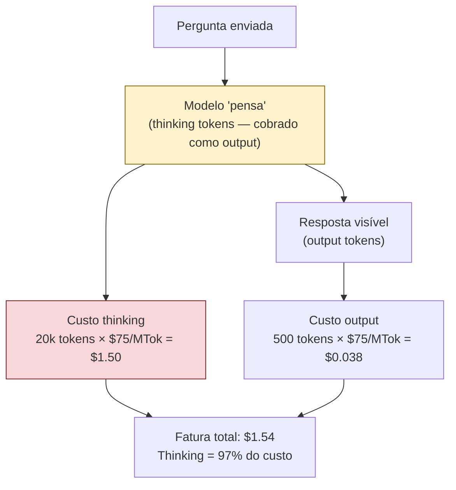

# Thinking budget — controlar reasoning tokens

> [!abstract] TL;DR
> Modelos com raciocínio estendido (Claude Opus com thinking, o4, Gemini com thinking) geram tokens internos de "pensamento" que são cobrados como output — a tier mais cara. Sem limite configurado, o modelo pode gastar 50k+ tokens pensando em um problema trivial. O parâmetro `thinking.budget_tokens` define o teto: 2k-5k para bugs simples, 15k-30k para debugging complexo, 50k+ apenas para problemas genuinamente difíceis. A melhor economia é não ativar thinking para tasks que um modelo standard resolve — o overhead de 10-50x no custo não se justifica em 80% dos casos de uso.

## O problema: raciocínio invisível que aparece na fatura

A geração de 2024-2025 de modelos de "raciocínio" — Claude Opus com extended thinking, OpenAI o1/o3/o4, Google Gemini Thinking — introduziu uma nova categoria de custo que não aparece no output visível: os thinking tokens.

O modelo "pensa" internamente antes de responder. Esse pensamento é uma cadeia de raciocínio que o modelo gera (e que você pode ou não ver), mas que **sempre** é cobrada como output — a tier mais cara.

```python
# Chamada com extended thinking
response = client.messages.create(
    model="claude-opus-4-8",
    max_tokens=8000,
    thinking={"type": "enabled", "budget_tokens": 20000},
    messages=[{"role": "user", "content": "Qual é o capital da França?"}]
)

print(response.usage)
# Output:
# Usage(
#   input_tokens=15,
#   output_tokens=1,          # "Paris." — o que você pediu
#   cache_read_input_tokens=0,
#   cache_creation_input_tokens=0
# )
# + thinking_tokens: ~2.000  # o modelo "pensou" sobre onde fica Paris
#
# Custo total: $0.00015 (input) + $0.00125 (output) + $0.05 (thinking)
# O thinking custou 97% do total por uma pergunta trivial
```

Thinking tokens são cobrados à mesma taxa que output tokens — em Claude Opus ($75/MTok output), um budget de 20.000 thinking tokens custa $1.50 **por chamada**, antes mesmo de gerar uma palavra de resposta.



## Por que thinking existe e quando vale o custo

Raciocínio estendido não é marketing — em alguns domínios, ele genuinamente melhora a qualidade de resposta porque permite ao modelo explorar hipóteses, refutar premissas falsas, e verificar raciocínio antes de commitar a uma resposta.

**Domínios onde thinking tem ROI positivo:**

| Domínio | Por que thinking ajuda | Ganho típico |
|---|---|---|
| Debugging de race conditions | Requer manter modelo mental de estado concorrente | Alta precisão em diagnóstico |
| Algoritmos com múltiplos edge cases | Exploração de casos antes de escrever código | Menos bugs na primeira tentativa |
| Arquitetura com trade-offs não-óbvios | Consideração de consequências de longo prazo | Decisões mais robustas |
| Problemas matemáticos e lógicos | Verificação de cada passo antes do próximo | Significativamente maior acuidade |
| Refactoring com impacto em cascata | Rastreamento de dependências através do codebase | Menos regressões |

**Domínios onde thinking não tem ROI:**

| Domínio | Por que não usar thinking | Custo vs ganho |
|---|---|---|
| Formatação e template | Sem ambiguidade | 10-50x mais caro, zero ganho |
| Classificação de intent | Task determinística | Budget mínimo, sem benefício |
| Geração de boilerplate | Código repetitivo sem lógica | Desnecessário |
| Perguntas factuais simples | O modelo já sabe | Waste puro |
| Code review de código óbvio | Padrões conhecidos | Superfaturamento |
| Tradução simples | Sem nuance de registro | Zero benefício |

A regra de ouro: **se um modelo sem thinking responderia corretamente, você está pagando pelo pensamento sem benefício.**

## Calibrando o budget por tipo de task

```python
# Configuração por tipo de task — valores de junho/2026
THINKING_BUDGET = {
    # Sem thinking — tasks determinísticas e simples
    "classification": None,
    "formatting": None,
    "simple_bug_fix": None,          # bug com stack trace claro
    "boilerplate_generation": None,
    
    # Budget baixo — alguma ambiguidade, sem complexidade alta
    "code_review_medium": 2000,      # review de módulo padrão
    "algorithm_simple": 3000,        # algoritmo com 1-2 edge cases
    "debugging_with_context": 5000,  # bug com boa reprodução
    
    # Budget médio — raciocínio necessário
    "debugging_complex": 15000,      # race condition, timing bug
    "refactoring_module": 10000,     # refactoring com dependências
    "api_design": 12000,             # design de API pública
    
    # Budget alto — problemas genuinamente difíceis
    "architecture_decision": 30000,  # ADR com múltiplos trade-offs
    "system_design": 40000,          # design de sistema distribuído
    "security_audit": 25000,         # análise de threat model
    
    # Budget máximo — reservar para casos excepcionais
    "hard_algorithm": 50000,         # algoritmo de complexidade alta
    "concurrent_bug": 60000,         # debugging de deadlock
}

def call_with_thinking(
    task_type: str,
    messages: list,
    model: str = "claude-opus-4-8"
) -> tuple[str, dict]:
    """
    Chama o modelo com thinking calibrado ao tipo de task.
    Retorna (resposta, usage_stats).
    """
    budget = THINKING_BUDGET.get(task_type)
    
    kwargs = {
        "model": model,
        "max_tokens": 8192,
        "messages": messages
    }
    
    if budget is not None:
        kwargs["thinking"] = {"type": "enabled", "budget_tokens": budget}
    
    response = client.messages.create(**kwargs)
    
    # Extrair uso para monitoramento
    usage = {
        "input": response.usage.input_tokens,
        "output": response.usage.output_tokens,
        "thinking": getattr(response.usage, "thinking_tokens", 0),
        "task_type": task_type,
        "budget": budget or 0,
        "budget_used_pct": (
            getattr(response.usage, "thinking_tokens", 0) / budget * 100
            if budget else 0
        )
    }
    
    return response.content[-1].text, usage
```

## Monitorando thinking tokens

Thinking tokens frequentemente ficam invisíveis em sistemas que monitoram apenas `output_tokens`. Isso cria uma categoria de custo que cresce sem controle.

```python
import logging
from dataclasses import dataclass, field
from collections import defaultdict

logger = logging.getLogger(__name__)

@dataclass
class ThinkingMetrics:
    calls: int = 0
    total_thinking_tokens: int = 0
    total_output_tokens: int = 0
    total_cost_usd: float = 0.0
    budget_exceeded_count: int = 0
    by_task_type: dict = field(default_factory=lambda: defaultdict(dict))

OPUS_PRICES = {
    "input": 15 / 1_000_000,    # $15/MTok
    "output": 75 / 1_000_000,   # $75/MTok (thinking também)
}

metrics = ThinkingMetrics()

def track_thinking_usage(usage: dict, cost_per_output_token: float = OPUS_PRICES["output"]):
    """
    Registra uso de thinking tokens e alerta sobre anomalias.
    """
    thinking_tokens = usage.get("thinking", 0)
    output_tokens = usage.get("output", 0)
    budget = usage.get("budget", 0)
    task_type = usage.get("task_type", "unknown")
    
    # Custo
    thinking_cost = thinking_tokens * cost_per_output_token
    output_cost = output_tokens * cost_per_output_token
    total_cost = thinking_cost + output_cost
    
    # Atualizar métricas
    metrics.calls += 1
    metrics.total_thinking_tokens += thinking_tokens
    metrics.total_output_tokens += output_tokens
    metrics.total_cost_usd += total_cost
    
    # Alertas
    if budget > 0 and thinking_tokens >= budget * 0.95:
        logger.warning(
            f"Thinking atingiu {usage['budget_used_pct']:.0f}% do budget "
            f"em task '{task_type}'. Considere aumentar o budget ou "
            f"revisar se a task realmente precisa de thinking."
        )
        metrics.budget_exceeded_count += 1
    
    if thinking_tokens == 0 and budget and budget > 0:
        logger.info(f"Task '{task_type}': thinking não foi usado (budget: {budget}). "
                    "Considere remover thinking para economizar.")
    
    # Log estruturado
    logger.info("thinking_usage", extra={
        "task_type": task_type,
        "thinking_tokens": thinking_tokens,
        "output_tokens": output_tokens,
        "thinking_cost_usd": thinking_cost,
        "budget": budget,
        "budget_pct": usage.get("budget_used_pct", 0),
    })
    
    return {"thinking_cost": thinking_cost, "total_cost": total_cost}
```

## Alternativas ao extended thinking

Para muitos casos onde desenvolvedores ativam thinking, existem alternativas mais baratas:

| Necessidade | Com thinking (caro) | Alternativa (barata) |
|---|---|---|
| Debugging complexo | Opus + 30k tokens thinking | Sonnet + Chain-of-Thought explícito no prompt |
| Verificar lógica antes de responder | Thinking ativado | "Pense passo a passo antes de responder" no prompt |
| Trade-offs de arquitetura | Thinking + Opus | Multi-agent: 3 sub-agentes Sonnet com perspectivas diferentes |
| Problemas algorítmicos médios | Thinking ativado | Prompt com "pense em pseudocódigo antes do código final" |

**Chain-of-Thought explícito como alternativa:**

```python
# Em vez de extended thinking (caro):
kwargs = {"thinking": {"type": "enabled", "budget_tokens": 20000}}

# Chain-of-Thought explícito no prompt (muito mais barato):
cot_prompt = """
Antes de responder, pense em voz alta:
1. Qual é o problema central?
2. Quais são as causas possíveis?
3. Qual é a solução mais provável?

Então, forneça a resposta final após o raciocínio.
"""
```

O CoT explícito usa tokens de output (não thinking), é transparente (você lê o raciocínio), e custa de 5 a 10x menos que extended thinking com Opus.

## Armadilhas comuns

> [!warning] Thinking ativado por default para todos os requests
> Um sistema que ativa extended thinking em todas as chamadas de um agente com Opus paga 5-50x mais do que necessário. O thinking deve ser opt-in por tipo de task, não opt-out. Padrão seguro: thinking desativado por default; ativado apenas quando o tipo de task está na whitelist.

> [!warning] Budget de thinking sem monitoramento de uso real
> Definir `budget_tokens: 20000` não significa que o modelo vai usar 20.000 tokens — ele usa o que precisa, até o limite. Mas sem monitoramento, você não sabe se o modelo está consistentemente usando 2.000 (budget excessivo) ou atingindo 19.800 (budget insuficiente). Logar `thinking_tokens` em cada chamada é obrigatório para calibrar o budget.

> [!warning] Usar modelo de thinking quando modelo standard basta
> Extended thinking é uma feature de modelos específicos (Opus, o4). Se você só quer raciocínio melhor, muitas vezes o Sonnet padrão com um prompt bem estruturado entrega resultado equivalente. O mito de que "thinking = sempre melhor" custa caro.

> [!warning] Não distinguir thinking tokens de output tokens em dashboards
> Se seu dashboard de custo agrega thinking e output em uma única métrica, você não consegue identificar qual percentual do custo vem de raciocínio vs resposta. Isso impede otimização cirúrgica. Sempre rastreie `thinking_tokens` separadamente de `output_tokens`.

## Estado da arte — junho 2026

**Extended thinking em modelos mid-tier:** Em 2025-2026, o thinking se democratizou — Claude Sonnet (não só Opus), GPT-4o, e Gemini Flash passaram a oferecer raciocínio estendido com preços por thinking token proporcionalmente menores. Isso muda o cálculo: thinking em Sonnet ($15/MTok output) é 5x mais barato que em Opus ($75/MTok), e cobre a maioria dos casos de uso que antes exigiam Opus.

**Thinking streaming e visibilidade:** Em 2026, todos os providers oferecem streaming dos thinking tokens — você vê o raciocínio do modelo em tempo real. Isso permite early termination se o raciocínio divergiu (economizando tokens não gerados) e auditoria do processo de raciocínio.

**Budgets adaptativos:** Pesquisas de 2026 demonstraram que o modelo usa thinking de forma desigual — problemas que ele conhece bem gastam poucos thinking tokens; problemas novos consomem mais. Sistemas adaptativos ajustam o budget dinamicamente com base na similaridade com queries anteriores (via embeddings): queries similares a casos conhecidos recebem budget menor.

**Thinking como feature de debugging auditável:** Em contextos de compliance, extended thinking passou a ser usado não só por qualidade, mas por auditabilidade — o processo de raciocínio é um artefato que documenta como a decisão foi tomada. Em alguns domínios regulados (finanças, saúde), isso tem valor independente do custo.

## Casos práticos

**Caso 1 — Agente de debugging com thinking irrestrito:**
Um agente de debugging ativou extended thinking em todas as chamadas com Opus. Custo por sessão de debugging: $15-40. Após análise, 70% das chamadas eram para leitura de arquivos e busca — tasks que não precisam de thinking. Após limitar thinking apenas a chamadas de diagnóstico de bug (tipo de task identificado pelo orquestrador): custo por sessão: $3-8. Redução de 78%.

**Caso 2 — Calibração de budget por complexidade:**
Um time começou com budget uniforme de 20k tokens para todas as chamadas com thinking. Análise de 1.000 chamadas revelou: 40% usavam <3.000 tokens (budget excessivo), 55% usavam 3.000-18.000 (calibrado), 5% atingiam o limite de 20k (budget insuficiente). Após segmentar em 3 tiers (5k/15k/30k) por complexidade detectada: custo de thinking -35% sem degradação de qualidade.

**Caso 3 — Chain-of-Thought como alternativa ao thinking:**
Um sistema de análise de trade-offs de arquitetura usava Opus + thinking (budget 30k). Custo: $2.50/análise. Após testar Sonnet + CoT explícito no prompt ("analise em 3 etapas: contexto, trade-offs, recomendação"): custo de $0.25/análise, qualidade similar em 85% dos casos. Para os 15% mais complexos, manteve Opus + thinking.

**Caso 4 — Thinking em Sonnet vs Opus:**
Após extended thinking ser disponibilizado no Sonnet (2026), o time migrou 60% dos casos de Opus + thinking para Sonnet + thinking. Custo de thinking: de $75/MTok para $15/MTok (5x redução). Qualidade comparable em análises de código; diferença percebida apenas em arquitetura de sistema muito complexa.

## Quando o thinking budget é insuficiente

O budget age como um teto — o modelo para de pensar ao atingir o limite e responde com o que tem. Se o budget for sistematicamente insuficiente, você paga quase o teto mas recebe respostas degradadas: o modelo "foi cortado no meio do pensamento" e a qualidade cai.

Como detectar budget insuficiente:

```python
def analyze_thinking_saturation(usage_log: list[dict]) -> dict:
    """
    Analisa logs de uso para detectar saturação de budget.
    Entrada esperada: lista de dicts com thinking_tokens e budget.
    """
    if not usage_log:
        return {}
    
    saturated = [
        r for r in usage_log
        if r.get("budget", 0) > 0 and r.get("thinking", 0) >= r["budget"] * 0.95
    ]
    
    avg_pct = sum(
        r.get("thinking", 0) / r["budget"] * 100
        for r in usage_log if r.get("budget", 0) > 0
    ) / max(len(usage_log), 1)
    
    return {
        "total_calls": len(usage_log),
        "saturated_calls": len(saturated),
        "saturation_rate_pct": len(saturated) / max(len(usage_log), 1) * 100,
        "avg_budget_usage_pct": avg_pct,
        "recommendation": (
            "Aumentar budget em 50%" if len(saturated) / max(len(usage_log), 1) > 0.1
            else "Budget calibrado"
        )
    }
```

Regra prática: se mais de 10% das chamadas atingem ≥95% do budget, aumente o budget em 50%. Se menos de 20% das chamadas usam >30% do budget, provavelmente você pode reduzir o budget pela metade.

## Thinking em sistemas multi-agentes

Em sistemas com múltiplos agentes, o custo de thinking multiplica. Um agente orquestrador com thinking + 5 sub-agentes com thinking pode gerar 6 vezes o custo de uma chamada única.

```
Orquestrador (Opus + 30k thinking) = $2.25/chamada
5 sub-agentes (Opus + 10k thinking cada) = 5 × $0.75 = $3.75/conjunto

Total por ciclo completo: $6.00
Com 100 ciclos/dia: $600/dia → $18.000/mês
```

Estratégia: **thinking assimétrico** — somente o agente de mais alto nível usa thinking pesado; sub-agentes usam no máximo 3k-5k tokens ou nenhum thinking.

```python
AGENT_THINKING_POLICY = {
    "orchestrator": 30000,     # thinking pesado — decide estratégia
    "code_writer": 5000,       # thinking leve — implementação tem contexto claro
    "code_reviewer": 8000,     # thinking médio — precisa raciocinar sobre trade-offs
    "file_reader": None,       # zero thinking — leitura é determinística
    "test_runner": None,       # zero thinking — execução é determinística
    "summarizer": None,        # zero thinking — sumarização é bem definida
}
```

## Checklist

- [ ] Auditar quais chamadas têm thinking ativado atualmente
- [ ] Logar `thinking_tokens` separadamente de `output_tokens` em produção
- [ ] Criar whitelist de task_types que justificam thinking (não opt-out, mas opt-in)
- [ ] Calibrar budget por tipo de task (começar com estimativas, ajustar com dados)
- [ ] Implementar alertas quando thinking_tokens ≥ 95% do budget configurado
- [ ] Avaliar Chain-of-Thought explícito como alternativa para casos de complexidade média
- [ ] Comparar custo de thinking em Sonnet vs Opus para o seu workload específico
- [ ] Desativar thinking em sub-agentes Explore e tasks de busca/leitura
- [ ] Implementar análise de saturação de budget (taxa de chamadas ≥95%)
- [ ] Aplicar thinking assimétrico em arquiteturas multi-agente (pesado só no orquestrador)
- [ ] Revisar dashboards de custo para separar thinking de output em métricas

## O que vem a seguir

Com output tokens e thinking tokens sob controle, o próximo passo é gerenciar o custo total no nível de negócio: orçamentos por usuário, por projeto, hard limits que previnem surpresas na fatura, e alertas de custo em tempo real. [[15 - Orçamento e hard limits]] cobre como implementar governança de custo em sistemas de IA de produção.

## Como explicar em inglês

**Extended thinking** é o termo da Anthropic; OpenAI usa **reasoning** (o1, o3, o4); Google usa **thinking mode** em Gemini. O parâmetro de controle é **thinking budget** ou **reasoning budget** conforme o provider.

| Português | Inglês | Contexto de uso |
|---|---|---|
| Tokens de pensamento | Thinking tokens / Reasoning tokens | Tokens de raciocínio interno cobrados como output |
| Raciocínio estendido | Extended thinking / Chain-of-thought | Modo de raciocínio profundo de modelos avançados |
| Budget de thinking | Thinking budget / Reasoning budget | Limite de tokens de pensamento por chamada |
| Cadeia de raciocínio | Chain of thought (CoT) | Sequência de passos de raciocínio intermediário |
| Raciocínio visível | Visible reasoning / Transparent thinking | Thinking tokens acessíveis pelo usuário |
| Budget esgotado | Budget exhausted | Quando o modelo atinge o limite de thinking tokens |
| Raciocínio implícito | Implicit reasoning | Raciocínio interno sem thinking explícito |
| Custo de raciocínio | Reasoning cost | Custo total dos thinking tokens |
| Modelo de raciocínio | Reasoning model | Modelo com capacidade de extended thinking |
| Raciocínio adaptativo | Adaptive reasoning | Sistema que ajusta o budget por complexidade |

> [!tip] Leia: Extended Thinking — documentação oficial
> **Fonte:** Anthropic (platform.claude.com) | **Idioma:** EN
>
> Documentação oficial do extended thinking — parâmetro `budget_tokens`, controle de exibição (`summarized`/`omitted`), streaming via `thinking_delta`, integração com tool use, e a nota de pricing que confirma o ponto central desta nota: você é cobrado pelos tokens de pensamento *gerados*, não pelo resumo exibido.
>
> 📖 [Ler a documentação](https://platform.claude.com/docs/en/build-with-claude/extended-thinking)

## Veja também

- [[02 - Anatomia do gasto — input, output e reasoning]] — onde reasoning aparece na fatura
- [[09 - Model routing — modelo certo para a tarefa]] — routing para decidir quando usar modelos com thinking
- [[13 - Respostas concisas — controlar output tokens]] — o outro vetor de custo de output
- [[15 - Reasoning models e chain-of-thought]] — como o raciocínio estendido funciona por dentro (galho Anatomia dos LLMs), complementando a lente de custo desta nota

## Fontes

- **Anthropic** — *Extended Thinking* (docs.anthropic.com, 2026). Documentação oficial do extended thinking da Anthropic — parâmetros, pricing, e exemplos de código.
- **OpenAI** — *Reasoning Models* (platform.openai.com/docs/reasoning, 2026). Guia dos modelos o1/o3/o4 com raciocínio interno — inclui configuração de reasoning effort e pricing.
- **Wei et al.** — *Chain-of-Thought Prompting Elicits Reasoning in Large Language Models* (Google Research, 2022). Paper original do CoT — estabelece que prompts de raciocínio passo a passo melhoram performance em problemas complexos sem custo de thinking tokens.
- **Snell et al.** — *Scaling LLM Test-Time Compute Optimally* (Berkeley AI Research, 2024). Análise de como alocar compute em tempo de inferência — base teórica para a calibração de thinking budgets por complexidade.
- **Simon Willison** — *Extended thinking: what it is and when to use it* (simonwillison.net, 2025). Análise prática com exemplos reais de before/after, medições de custo e qualidade, e guia de decisão para quando thinking vale o custo.
