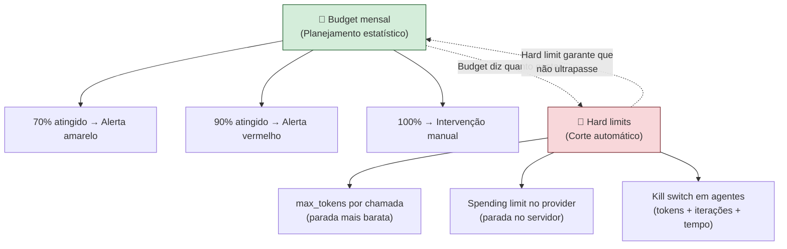

# Orçamento e hard limits

> [!abstract] TL;DR
> Orçamento sem limite técnico é dependência de disciplina humana — e humanos esquecem. A camada inferior é budget (planejamento estatístico), a camada superior são **hard limits** (corte automático): `max_tokens` por chamada, caps mensais no provider, kill switches que abortam sessões fora do esperado. Sem hard limits, uma única chamada com `max_tokens` aberto ou um agente em loop pode queimar o budget de um mês em horas. A regra de ouro: budget define a meta; hard limit garante que erros de código não superem essa meta.

## O problema: gastos que escapam do controle humano

Imagine um engenheiro abrindo um agente de debugging às 17h numa sexta-feira. O agente entra em loop tentando corrigir um problema de concorrência, gerando 2.000 tokens por iteração, 50 iterações/minuto. Às 21h (quando alguém olha a fatura), o sistema consumiu 24 milhões de tokens — $1.800 em quatro horas, de uma conta que tinha budget de $500/mês.

Este não é um cenário hipotético. É o padrão que aparece nas postmortems de times que adotaram agentes sem governance.

A defesa não é humana — é estrutural. Há duas camadas independentes:



## Duas camadas: orçamento vs hard limit

| Camada | Função | Atua quando | Exemplo |
|---|---|---|---|
| **Budget** | Planejar e prever | Antes da execução | "Esperamos gastar $200/mês neste projeto" |
| **Hard limit** | Bloquear automaticamente | Durante a execução | "Aborte se a sessão passar de 500K tokens" |
| **Monitoramento** | Fechar o ciclo | Após a execução | "Esse PR custou $12 — dentro do esperado?" |

Budget responde *quanto*. Hard limit responde *o que fazer quando passar*. Monitoramento responde *o que aprender*. Os três são necessários — budget sem hard limit é wishful thinking; hard limit sem budget é arbitrário; os dois sem monitoramento não melhoram com o tempo.

## Camada 1 — Orçamento: quanto esperar gastar

### Referências de budget por perfil (junho 2026)

| Perfil | Budget mensal | Modelo principal | Casos de uso |
|---|---|---|---|
| Dev solo, casual | $10-30 | Haiku 4.5 + Flash | Autocomplete + chat ocasional |
| Dev solo, power user | $50-150 | Claude Sonnet 4.6 | Agente ativo diário |
| Dev solo, heavy | $150-300 | Sonnet + Opus | Sessões longas de agente, refactoring |
| Time de 5 devs | $300-1.000 | Mix com routing | Feature development com CI/CD |
| Startup (10 devs + CI) | $1.000-3.000 | Enterprise plan | Automação, review, docs geradas |
| Produto B2C com LLM | Variável | Multi-provider | Depende de DAU e uso por sessão |

Para calcular o budget de um produto B2C, use a fórmula:

```
Budget = DAU × sessões/usuário/dia × tokens_por_sessão × preço/token × margem_de_segurança(1.3)

Exemplo:
1.000 DAU × 3 sessões × 8.000 tokens/sessão × $3/MTok × 1.3
= 1.000 × 3 × 0.008 × 3 × 1.3
= $93,6/dia → ~$2.808/mês
```

### Configurando alertas de gasto nos providers

```bash
# Anthropic: Settings → Usage Limits → Set monthly limit
# OpenAI:    Settings → Billing → Usage limits
# GCP Vertex: Budget alerts no console de billing
# AWS Bedrock: AWS Budgets com tag de serviço
```

Configure **dois alertas** — 70% (sinal amarelo, revisar padrões de uso) e 90% (sinal vermelho, intervenção mandatória). Sem alertas, você descobre o estouro na fatura, não antes.

## Camada 2 — Hard limits: garantias técnicas

### `max_tokens` em cada chamada

A defesa mais barata e mais frequentemente esquecida. Sem `max_tokens`, o modelo pode gerar até o limite do contexto — em modelos com 128K+ de output window, isso é um risco real.

```python
import anthropic

client = anthropic.Anthropic()

# Errado: sem teto de output
response = client.messages.create(
    model="claude-sonnet-4-6",
    messages=[{"role": "user", "content": prompt}],
)
# Uma resposta runaway pode gerar 128.000 tokens: $9.60 por chamada

# Certo: teto explícito calibrado por endpoint
ENDPOINT_MAX_TOKENS = {
    "summarize": 500,
    "classify": 100,
    "code_review": 2000,
    "code_generation": 4000,
    "architecture_doc": 6000,
    "full_refactor": 8000,
}

def call_with_limit(prompt: str, endpoint: str, **kwargs) -> str:
    max_tokens = ENDPOINT_MAX_TOKENS.get(endpoint, 2000)
    response = client.messages.create(
        model="claude-sonnet-4-6",
        max_tokens=max_tokens,
        messages=[{"role": "user", "content": prompt}],
        **kwargs
    )
    return response.content[0].text
```

### Spending limits no provider

Hard limit do lado do servidor — protege mesmo quando o código cliente falha ou é explorado.

| Provider | Onde configurar | O que acontece ao atingir |
|---|---|---|
| Anthropic | Console → Plan & Billing → spending limit | Novas chamadas retornam erro 429 |
| OpenAI | Billing → usage limits (soft + hard) | Soft: alerta; Hard: bloqueia |
| Vertex AI | Cloud Billing → Budget alerts + quota policies | Quota exceeded + alerta |
| AWS Bedrock | AWS Budgets + Service Quotas | SNS notification + optional action |

Soft limit dispara alerta. Hard limit **bloqueia** novas chamadas até o ciclo seguinte ou intervenção manual. Em produção, prefira hard limit sobre soft limit — se ninguém olha o alerta em tempo real, ele é decoração.

### Kill switches em agentes

Agentes em loop são o cenário mais perigoso — o gasto não é por chamada, é por sessão. Uma sessão sem controle pode acumular tokens mais rápido do que qualquer monitoramento humano consegue detectar. O mecanismo do loop em si (ReAct, plan-then-execute, multi-agent) é o assunto de [[Anatomia de Agents]] — aqui o interesse é só o corte de emergência quando esse loop foge do esperado.

```python
import time
from dataclasses import dataclass, field
from typing import Callable

class BudgetExceeded(Exception):
    pass

@dataclass
class AgentBudgetGuard:
    """
    Kill switch tri-dimensional para agentes.
    Verificar em cada iteração antes de chamar o modelo.
    """
    max_tokens: int = 500_000          # ~$1.50 com Sonnet
    max_iterations: int = 50
    max_session_seconds: int = 1800    # 30 minutos
    
    # Estado interno
    tokens_used: int = field(default=0, init=False)
    iterations: int = field(default=0, init=False)
    start_time: float = field(default_factory=time.time, init=False)
    
    def check(self, tokens_this_step: int = 0) -> None:
        """
        Lança BudgetExceeded se qualquer limite foi atingido.
        Chamar ANTES de cada step do agente.
        """
        self.tokens_used += tokens_this_step
        self.iterations += 1
        elapsed = time.time() - self.start_time
        
        if self.tokens_used >= self.max_tokens:
            raise BudgetExceeded(
                f"Token cap atingido: {self.tokens_used:,}/{self.max_tokens:,} tokens"
            )
        if self.iterations >= self.max_iterations:
            raise BudgetExceeded(
                f"Iteration cap: {self.iterations}/{self.max_iterations} iterações"
            )
        if elapsed >= self.max_session_seconds:
            raise BudgetExceeded(
                f"Time cap: {elapsed:.0f}s/{self.max_session_seconds}s"
            )
    
    @property
    def summary(self) -> dict:
        return {
            "tokens_used": self.tokens_used,
            "iterations": self.iterations,
            "elapsed_seconds": time.time() - self.start_time,
            "tokens_pct": self.tokens_used / self.max_tokens * 100,
        }


# Uso em um loop de agente
def run_agent(task: str, on_step: Callable) -> str:
    guard = AgentBudgetGuard(max_tokens=200_000, max_iterations=30)
    
    try:
        while not task_complete:
            guard.check()           # verifica ANTES de chamar o modelo
            result = on_step(task)
            guard.check(result.usage.total_tokens)
    except BudgetExceeded as e:
        # Logar, alertar, mas não deixar o erro explodir silenciosamente
        logger.error(f"Agent budget exceeded: {e}", extra=guard.summary)
        raise
```

Kill switches em ferramentas existentes:

| Ferramenta | Configuração | Default |
|---|---|---|
| Claude Code | `/limits` mostra consumo da sessão | Sem hard limit por padrão |
| Cursor | Agent mode → "Max iterations" | ~25 iterações |
| OpenCode | config `agent.maxSteps` | Configurável |
| LangChain | `max_iterations` no AgentExecutor | 15 |
| LlamaIndex | `max_iterations` no ReActAgent | 10 |

## Orçamento por usuário em produtos B2C

Quando o LLM é parte do produto — não infraestrutura interna — o orçamento precisa ser rastreado por usuário, não por time. O padrão emergente usa Redis para contadores rápidos:

```python
import redis
from datetime import datetime

r = redis.Redis(host="localhost", port=6379, db=0)

MONTHLY_TOKEN_BUDGET = {
    "free": 100_000,
    "pro": 1_000_000,
    "enterprise": float("inf"),
}

def get_budget_key(user_id: str) -> str:
    month = datetime.now().strftime("%Y-%m")
    return f"token_budget:{user_id}:{month}"

def check_and_consume_budget(
    user_id: str,
    tokens_needed: int,
    plan: str = "free"
) -> tuple[bool, int]:
    """
    Verifica se o usuário tem budget e consome os tokens.
    Retorna (allowed, remaining).
    """
    budget_limit = MONTHLY_TOKEN_BUDGET[plan]
    if budget_limit == float("inf"):
        return True, -1  # enterprise: sem limite
    
    key = get_budget_key(user_id)
    
    # Pipeline atômico: get + incrby
    pipe = r.pipeline()
    pipe.get(key)
    pipe.incrby(key, tokens_needed)
    pipe.expire(key, 60 * 60 * 24 * 35)  # 35 dias de TTL
    current, new_total, _ = pipe.execute()
    
    current = int(current or 0)
    
    if current >= budget_limit:
        # Revert: desfaz o incremento
        r.decrby(key, tokens_needed)
        return False, budget_limit - current
    
    return True, budget_limit - new_total

# Em um endpoint de produto:
def handle_user_request(user_id: str, prompt: str, plan: str) -> dict:
    estimated_tokens = len(prompt.split()) * 3  # estimativa grosseira
    
    allowed, remaining = check_and_consume_budget(user_id, estimated_tokens, plan)
    if not allowed:
        return {"error": "monthly_budget_exceeded", "remaining": remaining}
    
    # Chamar o modelo e ajustar o consumo real após a resposta
    response = call_model(prompt)
    actual_tokens = response.usage.total_tokens
    
    # Ajuste: desfaz estimativa, aplica real
    r.decrby(get_budget_key(user_id), estimated_tokens)
    r.incrby(get_budget_key(user_id), actual_tokens)
    
    return {"response": response.content[0].text, "tokens_used": actual_tokens}
```

## Armadilhas comuns

> [!warning] `max_tokens` ausente em produção
> Uma resposta sem limite pode gerar 128.000 tokens em modelos modernos — $9.60 por chamada com Sonnet, $9.60 que se multiplica por todas as chamadas antes de alguém perceber. O padrão seguro é: `max_tokens` obrigatório em TODAS as chamadas; PR checklist verifica presença.

> [!warning] Budget sem hard limit — "a gente monitora"
> Times que dependem de monitoramento humano para conter custos invariavelmente têm um incidente. O monitoramento falha aos fins de semana, à noite, em lançamentos acelerados, quando a pessoa responsável está doente. Hard limit automático é a única defesa que funciona 24/7.

> [!warning] Kill switch só por tempo
> Um agente pode queimar 500K tokens em 10 minutos. Um kill switch de 30 minutos não protege contra isso. O kill switch tri-dimensional (tokens + iterações + tempo) é o mínimo — cada dimensão captura falhas que as outras não capturam.

> [!warning] Soft limits como substituição de hard limits
> Soft limits disparam alertas — mas alertas requerem humanos atentos. Em horários de baixo movimento, alertas ficam sem resposta por horas. Use soft limits para visibilidade e hard limits para proteção real. Os dois são complementares, não intercambiáveis.

## Estado da arte — junho 2026

**Cost-aware agents como padrão:** Em 2025-2026, frameworks de agentes incorporaram guardrails de custo como feature nativa, não afterthought. LangGraph 0.3+, LlamaIndex Workflows e Claude Code expõem métricas de custo por step em tempo real, e permitem registrar callbacks que decidem se o próximo step deve executar com base no custo acumulado.

**Orçamento por usuário em SaaS:** Produtos B2C com LLM adotaram o padrão de orçamento por usuário — cada usuário tem um token budget mensal (ex: 1M tokens/mês no plano gratuito), e o backend rastreia o consumo por `user_id` com Redis ou banco relacional. Quando o budget esgota, o produto faz fallback para modelo menor ou mostra paywall.

**Spending limits granulares:** Anthropic e OpenAI expandiram os controles de spending — além do limite mensal global, é possível configurar limits por API key, por projeto, e alertas por endpoint. Em 2026, isso é padrão em todos os providers enterprise.

**Orçamento prospectivo com previsão:** Ferramentas como Helicone e Portkey adicionaram previsão de gasto — com base no padrão das últimas 4 semanas, o dashboard projeta o gasto do mês inteiro e alerta se a projeção supera o budget antes que isso aconteça.

## Casos práticos

**Caso 1 — Startup sem hard limit em agente de CI:** Uma startup de developer tools integrou um agente de code review no CI. Em uma semana normal, o agente processava 200 PRs/semana a $0.15/PR = $30/semana. Em um hackathon interno, o volume subiu para 800 PRs em 2 dias. O agente entrou em loop em 3 PRs com código gerado por IA (contexto gigante), gerando 50K tokens por revisão. Resultado: $900 em 48h vs. $30/semana esperados. Depois do incidente: `max_tokens=3000` + kill switch de sessão + alerta Slack a 50% do budget.

**Caso 2 — Orçamento por time em empresa:** Uma empresa com 40 engenheiros implementou orçamento por time — cada squad de 5 pessoas tem $200/mês de budget de IA rastreado por uma API key específica. Times que otimizam o uso (routing para Haiku em tasks simples) ficam dentro do budget. Times que abusam excedem e recebem alerta com relatório de custo por tipo de chamada. Resultado: redução de 40% no gasto total sem redução de produtividade.

**Caso 3 — Kill switch salvando fatura em agente de refactoring:** Um agente de refactoring de codebase legado foi configurado com `max_iterations=100` (sem cap de tokens). O agente entrou em loop tentando refatorar um arquivo com 15.000 linhas, processando o contexto inteiro em cada iteração. Após 47 iterações: 8.2M tokens consumidos, $246 em 90 minutos. O iteration cap parou o agente antes do esgotamento completo. Depois: `max_tokens=8000` por chamada + cap de tokens por sessão.

**Caso 4 — Orçamento prospectivo impedindo surpresa:** Um time de produto usava Helicone para monitorar gasto. Na segunda semana de junho, a previsão apontou $3.200 para o mês vs. budget de $2.000. A causa: um novo feature de "análise de documento completo" processava PDFs de 200 páginas sem paginação. O time identificou o problema 15 dias antes da fatura chegar, implementou paginação + cache de resultados, e encerrou o mês em $1.850.

## Checklist

- [ ] Budget mensal definido e comunicado ao time
- [ ] Alertas configurados a 70% e 90% do budget no console do provider
- [ ] `max_tokens` explícito em TODAS as chamadas de produção (não só nas mais longas)
- [ ] Spending limit (hard) configurado no console do provider
- [ ] Kill switch tri-dimensional em todos os agentes (tokens + iterações + tempo)
- [ ] Dashboard de consumo revisado semanalmente com custo por feature/task
- [ ] PR checklist inclui verificação de `max_tokens` em novos endpoints
- [ ] Orçamento por usuário em produtos B2C com tracking por `user_id`
- [ ] Soft limits para visibilidade + hard limits para proteção real (não substituir um pelo outro)
- [ ] Teste de carga simulando agente em loop para validar os kill switches
- [ ] Orçamento por usuário com Redis para produtos B2C (rastreio por `user_id`)
- [ ] Ajuste de consumo real vs. estimativa após cada chamada

## O que vem a seguir

Com orçamento e hard limits em funcionamento, você sabe *quanto* gasta e tem garantias de que não ultrapassará. O próximo passo é entender *por quê* gasta: quais chamadas são mais caras, quais features consomem mais tokens, onde há oportunidade de otimização. [[16 - Auditoria de consumo]] cobre como construir um pipeline de auditoria que atribui custo a features, usuários, e tipos de operação — transformando o dado de consumo em decisão de produto.

## Como explicar em inglês

**Budget** e **hard limit** são os termos universais — não traduzir. Em conversas técnicas internacionais, o vocabulário de governance de custo é todo em inglês.

| Português | Inglês | Contexto de uso |
|---|---|---|
| Orçamento de tokens | Token budget / Spending limit | Planejamento de custo por período |
| Limite rígido | Hard limit | Corte automático sem intervenção humana |
| Limite suave | Soft limit | Alerta que requer ação humana |
| Limite de sessão | Session cap | Limite de tokens/tempo por sessão de agente |
| Kill switch | Kill switch | Parada de emergência de agente em loop |
| Estouro de orçamento | Budget overrun | Custo acima do previsto |
| Alerta de gasto | Spending alert | Notificação ao atingir percentual do budget |
| Limite por chamada | Per-call limit / max_tokens | Teto de output por request |
| Guardrail de custo | Cost guardrail | Proteção estrutural contra gasto excessivo |
| Previsão de gasto | Spend forecast | Projeção de custo baseada em tendência atual |

> [!tip] Veja: How to Set Up LLM Cost Controls in Production
> **Canal:** Fireship / LLM Engineering | **Duração:** ~15min | **Idioma:** EN
>
> Tutorial prático de implementação de hard limits e kill switches em sistemas com LLMs — inclui código Python para o padrão guard + monitor, configuração de alertas nos providers, e exemplos de postmortem de incidentes de custo. Foco em produção, não teoria.
>
> 🎬 [Assistir no YouTube](https://youtube.com/results?search_query=LLM+cost+controls+production)

## Veja também

- [[04 - Monitoramento — ccusage, Langfuse, dashboards]] — como monitorar o consumo em tempo real
- [[09 - Model routing — modelo certo para a tarefa]] — routing como primeira linha de economia
- [[16 - Auditoria de consumo]] — atribuir custo a features e usuários
- [[18 - Playbook de economia — checklist completo]] — visão integrada de todas as técnicas

## Fontes

- **Anthropic** — *Spending Limits documentation* (docs.anthropic.com, 2026). Documentação oficial dos controles de spending da Anthropic — configuração de limits, alertas, e comportamento ao atingir o limite.
- **OpenAI** — *Usage limits and billing API* (platform.openai.com/docs/billing, 2026). Guia dos soft e hard limits da OpenAI — inclui API para consultar consumo e configurar alertas programaticamente.
- **Helicone** — *LLM Cost Monitoring and Forecasting* (helicone.ai/docs, 2026). Documentação do sistema de previsão de custo da Helicone — como funciona o modelo de projeção e como configurar alertas prospectivos.
- **LangChain** — *Agent Callbacks and Budget Guards* (python.langchain.com/docs, 2026). Como implementar callbacks de budget em agentes LangChain — inclui o padrão `on_llm_start` para verificar budget antes de cada chamada.
- **Jina, Jim** — *The $50,000 LLM Bill: A Postmortem* (blog.jina.ai, 2024). Análise de um incidente real de custo descontrolado com LLMs — causa raiz, como foi detectado, e medidas preventivas adotadas.
- **Portkey.ai** — *LLM Cost Governance Guide* (portkey.ai/docs, 2026). Guia de governança de custo com foco em multi-provider — inclui padrões de orçamento por usuário, por projeto, e alertas prospectivos em produção.
