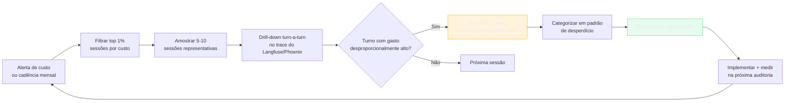

# Auditoria de consumo

> [!abstract] TL;DR
> Monitoramento mostra *quanto* gastou; auditoria mostra *por quê* gastou. É investigação causal: drill-down em traces para encontrar top offenders, padrões de desperdício e oportunidades de otimização. Sem cadência regular de auditoria (mensal, no mínimo), times só descobrem desperdício quando a fatura passa do budget — tarde demais. A auditoria começa no topo (1% das sessões mais caras) e desce até o turno exato onde o gasto explodiu.

## O problema: a fatura não diz onde está o desperdício

A fatura do mês diz "$1.847". O dashboard diz que Opus consumiu 60% do custo. Mas qual feature? Qual usuário? Qual chamada específica custou $120 num dia que deveria ter custado $12?

Monitoramento agrega. Auditoria disseca. A diferença é a diferença entre "algo saiu caro" e "o agente de debugging entrou em loop no arquivo database.py porque o modelo leu o arquivo inteiro em vez de usar grep".



## Auditoria vs monitoramento

| Pergunta | Ferramenta |
|---|---|
| "Quanto gastei este mês?" | Dashboard — [[04 - Monitoramento — ccusage, Langfuse, dashboards]] |
| "Está dentro do budget?" | Dashboard + alerta — [[15 - Orçamento e hard limits]] |
| **"Por que esta sessão custou $4?"** | **Auditoria — trace drill-down** |
| **"Qual feature está queimando 30% do budget?"** | **Auditoria — custo por tag/feature** |
| **"Onde está o desperdício escondido?"** | **Auditoria — análise de padrões** |

## Top offenders típicos

A cada auditoria, esperar encontrar pelo menos 2-3 destes padrões. Eles são recorrentes porque surgem de comportamentos de código e configuração que persistem sem review ativo.

### 1. Tools verbosas sem filtro

`grep -r "TODO" .` retornando 5K matches que entram no histórico. Ou `cat package-lock.json` (50K tokens). Sintoma: turno único com >20K input tokens em um step de busca.

Fix: truncar output de ferramentas, usar substrings relevantes, nunca passar `package-lock.json` ou `yarn.lock` completos.

### 2. Histórico não compactado em sessão longa

Sessão de 2h sem compactação carregando 300K tokens em cada turno — a quantidade de "passado" cresce enquanto o "presente" relevante é só os últimos 3-4 turnos. Sintoma: input por turno cresce linearmente com a duração da sessão.

Fix: [[08 - Compactação de histórico em agentes]] — rolling summarization, `/compact` proativo.

### 3. Retries invisíveis

Tool calls com sintaxe errada disparando retry automático. O modelo chama uma ferramenta com parâmetro errado, recebe erro, tenta de novo com variação mínima, repete 3-5 vezes antes de desistir. Sintoma: 2-3 turnos consecutivos com payloads quase idênticos.

Fix: validar parâmetros de tool calls antes de executar; registrar erros de tool como eventos separados no trace. Esse padrão de retry surge do próprio loop de decisão do agente — ver [[Anatomia de Agents]] para entender por que um agente insiste na mesma tool call em vez de desistir ou pedir ajuda.

### 4. Reasoning excessivo em tarefa simples

Extended thinking ativado para responder uma pergunta determinística. Sintoma: `thinking_tokens >> output_tokens` em queries triviais — ver [[14 - Thinking budget — controlar reasoning tokens]].

Fix: whitelist de task_types que justificam thinking; desativar por default.

### 5. Modelo errado para a tarefa

Opus chamado para autocomplete; Haiku chamado para análise complexa que falha e re-tenta com Opus (custo duplo: Haiku que não entrega + Opus de fallback). Sintoma: distribuição de modelo por tipo de tarefa inconsistente com o expected routing.

Fix: [[09 - Model routing — modelo certo para a tarefa]] — routing determinístico por tipo de task.

### 6. Tool definitions infladas

System prompt com 15 tools quando a sessão usou só 3. Cada turno carrega todas as definições — lazy loading reduziria o custo fixo por turno. Sintoma: input fixo do system prompt >10K tokens com alta proporção de tool definitions.

Fix: [[07 - Compressão de tool definitions]] — lazy loading, descriptions concisas, ferramentas que a sessão não usa ficam de fora.

### 7. Caching mal configurado

`cache_control` ausente em prefixos repetidos; ou breakpoints no lugar errado (ex: colocado no meio de mensagens ao invés de antes). Sintoma: cache hit rate <40% em sessões que deveriam ter >80%.

Fix: [[05 - Prompt caching na prática]] — breakpoints nos lugares certos, medir hit rate por sessão.

## Atribuição de custo por feature e usuário

Para tornar a auditoria acionável, o custo precisa ser atribuído a entidades de negócio — não apenas a "chamadas de API". Isso requer tagging consistente desde a primeira chamada.

```python
import anthropic
from contextvars import ContextVar
from uuid import uuid4

# Contexto de execução propagado automaticamente
current_feature = ContextVar("feature", default="unknown")
current_user = ContextVar("user_id", default="anonymous")
current_session = ContextVar("session_id", default=None)

client = anthropic.Anthropic()

def call_with_attribution(prompt: str, model: str = "claude-sonnet-4-6", **kwargs) -> str:
    """
    Chama o LLM com metadata de atribuição de custo.
    Usa Langfuse metadata para rastreio.
    """
    feature = current_feature.get()
    user_id = current_user.get()
    session_id = current_session.get() or str(uuid4())
    
    response = client.messages.create(
        model=model,
        max_tokens=kwargs.pop("max_tokens", 2000),
        messages=[{"role": "user", "content": prompt}],
        # Metadata para auditoria
        metadata={
            "feature": feature,
            "user_id": user_id,
            "session_id": session_id,
            "environment": "production",
        },
        **kwargs
    )
    
    return response.content[0].text


# Em um endpoint de produto:
def handle_code_review(pr_id: str, user_id: str, code: str) -> str:
    # Setar contexto antes de qualquer chamada aninhada
    current_feature.set("code_review")
    current_user.set(user_id)
    current_session.set(f"pr_{pr_id}")
    
    return call_with_attribution(f"Review this code:\n{code}")
```

Com tagging consistente, a auditoria responde perguntas como:
- "Qual feature custou mais em junho?" → filtrar por `feature` tag
- "Qual usuário gerou mais custo?" → filtrar por `user_id` tag
- "PR reviews estão mais caros do que semana passada?" → comparar por `feature=code_review`

## Passo a passo da auditoria

```python
# Script de auditoria com Langfuse API
from langfuse import Langfuse
from datetime import datetime, timedelta

lf = Langfuse()

def audit_top_sessions(
    start_date: datetime,
    end_date: datetime,
    top_n: int = 20
) -> list[dict]:
    """
    Extrai as sessões mais caras do período para análise.
    """
    traces = lf.get_traces(
        from_timestamp=start_date,
        to_timestamp=end_date,
        order_by="totalCost",
        order="DESC",
        limit=top_n
    )
    
    sessions = []
    for trace in traces.data:
        session = {
            "id": trace.id,
            "session_id": trace.session_id,
            "total_cost": trace.calculated_total_cost,
            "input_tokens": trace.usage.input,
            "output_tokens": trace.usage.output,
            "duration_seconds": (trace.start_time - trace.end_time).seconds,
            "tags": trace.tags,
            "url": f"https://cloud.langfuse.com/trace/{trace.id}"
        }
        sessions.append(session)
    
    return sessions


def categorize_offender(trace_id: str) -> dict:
    """
    Analisa um trace específico e categoriza o padrão de desperdício.
    """
    observations = lf.get_observations(trace_id=trace_id)
    
    patterns = {
        "verbose_tools": False,
        "uncompacted_history": False,
        "invisible_retries": False,
        "excessive_reasoning": False,
        "wrong_model": False,
        "inflated_tool_defs": False,
        "bad_caching": False,
    }
    
    turns = sorted(observations.data, key=lambda o: o.start_time)
    
    for i, obs in enumerate(turns):
        # Tool verboso: turno único com >20K input tokens
        if obs.usage and obs.usage.input > 20_000:
            patterns["verbose_tools"] = True
        
        # Histórico não compactado: input crescendo linearmente
        if i > 5 and turns[i].usage and turns[i-3].usage:
            growth = turns[i].usage.input / max(turns[i-3].usage.input, 1)
            if growth > 1.5:
                patterns["uncompacted_history"] = True
        
        # Reasoning excessivo: thinking > 5x output
        if (obs.usage and obs.usage.get("thinking_tokens", 0) > 
                obs.usage.output * 5):
            patterns["excessive_reasoning"] = True
    
    return {
        "trace_id": trace_id,
        "patterns": [k for k, v in patterns.items() if v],
        "primary_pattern": next((k for k, v in patterns.items() if v), "unknown")
    }
```

## Ferramentas para auditoria

| Ferramenta | Forte em | Quando usar |
|---|---|---|
| **Langfuse** | Trace search, filtros por custo, comparação de versões | Sistemas custom com instrumentação própria |
| **Arize Phoenix** | Sessions com timeline visual, fácil drill-down | Times que preferem UX visual |
| **LangSmith** | Filtros por tags, integração nativa LangChain | Stacks LangChain/LangGraph |
| **Helicone** | Proxy + analytics; zero instrumentação necessária | Times que querem setup rápido |
| **ccusage** (CLI) | Quick audit de Claude Code local | Devs solo, sessões de desenvolvimento |
| **OpenAI Dashboard** | Análise de uso por API key e endpoint | Stacks puro-OpenAI |

## Cadência recomendada

| Perfil | Cadência | Profundidade | Tempo estimado |
|---|---|---|---|
| Dev solo | Mensal | Top 5 sessões mais caras | 30 min |
| Time pequeno (≤5) | Quinzenal | Top 10 sessões + relatório | 1h |
| Time grande (>10) | Semanal | Tracking contínuo + revisão semanal | 2h/semana |
| Produto B2C | Contínuo | Alertas automáticos + revisão mensal | Automatizado |
| Pós-incidente | Imediato | Drill em todas sessões >P95 do dia | Urgente |

## Armadilhas comuns

> [!warning] Auditar só o agregado
> A média mensal esconde o outlier que é exatamente o problema. Uma sessão de $120 em um dia que deveria ter custado $5 não aparece em "custo médio por sessão = $1.50". Filtrar sempre pelo top 1% — é onde estão as oportunidades reais de otimização.

> [!warning] Não documentar fixes
> Sem documentação, o mesmo padrão retorna no mês seguinte. A auditoria deve gerar um runbook interno: "quando ver X sintoma, aplicar Y fix". Sem memória institucional, cada auditoria parte do zero.

> [!warning] Auditoria sem ação
> Relatório bonito sem fix implementado é teatro de governança. O critério de sucesso de uma auditoria não é "encontramos os problemas" — é "o gasto reduziu na auditoria seguinte". Sem métrica de melhoria, a auditoria vira custo sem retorno.

> [!warning] Auditar só pós-incidente
> Auditoria reativa chega tarde. A cadência regular (mensal/quinzenal) detecta desperdício antes de virar incidente. O custo de uma hora mensal de auditoria é irrisório comparado ao custo de um mês de desperdício não detectado.

## Relatório de auditoria — o que documentar

O resultado de uma auditoria deve ser um artefato persistente — não uma reunião sem registro. O formato mínimo:

```markdown
# Auditoria de consumo — Junho 2026

**Período:** 2026-06-01 → 2026-06-30
**Total gasto:** $1.847 (budget: $2.000)
**Volume:** 142.000 chamadas | 58M tokens

## Top 3 offenders encontrados

| # | Padrão | Custo estimado | Feature | Fix |
|---|---|---|---|---|
| 1 | Histórico não compactado | $380 (21%) | code_review | Rolling summarization |
| 2 | Tool definitions infladas | $220 (12%) | all | Lazy loading |
| 3 | Modelo errado (Opus em classify) | $140 (8%) | classify_intent | Routing fix |

## Fixes priorizados

- [x] Rolling summarization no code_review (ETA: 3h) — **Impacto estimado: -$380/mês**
- [ ] Lazy loading de tool definitions (ETA: 1 dia) — **Impacto estimado: -$220/mês**
- [ ] Routing de classify para Haiku (ETA: 2h) — **Impacto estimado: -$140/mês**

## Métricas de qualidade

- Cache hit rate: 42% → **meta: 70%** (identificar por que baixou de 65%)
- P95 custo por sessão: $8.20 → **meta: <$5.00**
- Sessões >$10: 23 (vs. 14 no mês anterior) — tendência de alta

## Próxima auditoria

**Data:** 2026-07-15 | **Responsável:** @josenaldo
```

Documentação assim cria responsabilidade, permite comparar tendências mês a mês, e serve como onboarding para novos membros do time.

## Estado da arte — junho 2026

**Auditoria automatizada com IA:** Em 2026, ferramentas como Helicone e Langfuse introduziram análise automática de padrões de desperdício — o sistema usa um modelo (geralmente Haiku ou equivalente) para classificar traces por padrão de ofensor e gerar relatório de auditoria sem intervenção humana. O humano só revisa os top findings e decide os fixes.

**Cost attribution por feature flag:** Produtos que usam feature flags (LaunchDarkly, Statsig, GrowthBook) passaram a taguear chamadas de LLM com o ID do experimento ou flag. Isso permite comparar o custo exato de uma feature A vs. feature B antes de decidir qual rollout. Em 2026, essa prática é padrão em times de produto que rodam A/B tests com LLMs.

**Trace sampling inteligente:** Em sistemas de alta escala (milhões de chamadas/dia), logar 100% dos traces é caro. Em 2026, o padrão é tail sampling — logar 100% dos traces caros (>P95 de custo) e amostrar 1-5% dos demais. Assim, a auditoria tem cobertura total dos outliers sem custo de storage proporcional ao volume.

**Benchmarking de custo por provider:** Em 2026, times que usam múltiplos providers (Anthropic + OpenAI + Gemini) mantêm benchmarks mensais de custo por tipo de task — qual provider entrega a mesma qualidade por menor custo em cada categoria. A auditoria virou ferramenta de decisão de routing multi-provider.

## Casos práticos

**Caso 1 — Auditoria encontrando tool verbosa em agente de CI:** Auditoria mensal filtrou top 1% das sessões mais caras. A sessão mais cara ($18 em uma única execução de CI) tinha um turno com 45K input tokens. Drill-down: o agente chamou `git diff HEAD~100` sem limitar o número de commits — o diff de 3 semanas de desenvolvimento inteiro entrou no contexto. Fix: `git diff HEAD~5` como default, com opção explícita para ranges maiores. Redução: 70% no custo médio de sessões de CI.

**Caso 2 — Cache hit rate de 12% descoberto em auditoria:** Um time relatou custo crescente mês a mês sem mudança de volume. Auditoria revelou cache hit rate de 12% (esperado: >70%). Causa: o system prompt era reconstituído em cada chamada com um timestamp `f"Current date: {datetime.now()}"` — o timestamp mudava a cada request, invalidando o cache. Fix: remover o timestamp do system prompt (ou mover para a primeira mensagem do usuário). Cache hit rate subiu para 78%. Redução de custo: 45%.

**Caso 3 — Distribuição de modelo revelando routing errado:** Auditoria de distribuição de modelo por tipo de task revelou que 30% das chamadas de "autocomplete" usavam Opus (routing errôneo). Causa: um bug no classifier que identificava autocomplete como "análise de código complexa" quando o arquivo tinha mais de 500 linhas. Fix: corrigir o classifier + adicionar teste unitário. Redução: $200/mês para um time de 5 devs.

**Caso 4 — Auditoria automatizada com Helicone:** Um time de 3 devs implementou auditoria automatizada — um script Python roda toda segunda-feira, filtra top 10 sessões da semana, classifica por padrão e envia resumo no Slack. O humano lê o resumo em 5 minutos e decide se algum fix é urgente. Tempo de auditoria: 5 min/semana vs. 1h antes. Nenhum incidente de custo nas 12 semanas seguintes.

## Checklist

- [ ] Top 10 sessões por custo identificadas (filtrar no Langfuse/Helicone)
- [ ] Cada sessão classificada em pelo menos 1 dos 7 padrões de desperdício
- [ ] Pelo menos 2 fixes priorizados com estimativa de impacto
- [ ] Cache hit rate medido e comparado com mês anterior (meta: >70%)
- [ ] Distribuição de modelo por tipo de tarefa revisada
- [ ] Relatório curto (1 página) compartilhado com stakeholders
- [ ] Runbook atualizado com novos padrões encontrados
- [ ] Auditoria da próxima sessão agendada antes de encerrar esta
- [ ] Tagging de feature e user_id em todas as chamadas de produção
- [ ] Comparar custo por feature com mês anterior (tendência de crescimento identificada?)
- [ ] Verificar se tail sampling está configurado (100% outliers + 5% amostra geral)

## O que vem a seguir

Com o padrão de desperdício identificado e os fixes planejados, a pergunta natural é: valem o esforço de otimização? Nem todo custo de LLM é desperdício — às vezes o gasto é proporcional ao valor entregue. [[17 - ROI de IA — quando o agente vale o custo]] cobre como calcular o retorno real de sistemas de IA e decidir onde investir em otimização vs. onde aceitar o custo como parte do produto.

## Como explicar em inglês

**Audit** e **trace drill-down** são os termos padrão. Em contextos de observabilidade, o vocabulário é fortemente influenciado pelo mundo de distributed systems — muitos termos são equivalentes.

| Português | Inglês | Contexto de uso |
|---|---|---|
| Auditoria de consumo | Cost audit / Usage audit | Revisão periódica de padrões de custo |
| Drill-down em trace | Trace drill-down | Análise turno-a-turno de uma sessão específica |
| Top offender | Top offender / Cost hotspot | Sessão ou padrão que concentra custo desproporcional |
| Taxa de acerto do cache | Cache hit rate | % de chamadas servidas pelo cache |
| Ferramenta verbosa | Verbose tool / Noisy tool | Tool que retorna mais dados do que o necessário |
| Histórico não compactado | Uncompacted history | Contexto crescendo sem summarização |
| Retry invisível | Silent retry / Hidden retry | Re-tentativa automática não logada explicitamente |
| Atribuição de custo | Cost attribution | Associar custo a feature, usuário ou operação |
| Amostral de cauda | Tail sampling | Logar 100% dos outliers caros, amostrar os demais |
| Auditoria automatizada | Automated audit | Script que gera relatório de auditoria sem intervenção humana |

> [!tip] Veja: LLM Observability — Finding Hidden Costs in Production
> **Canal:** Arize Phoenix / LLM Engineering | **Duração:** ~22min | **Idioma:** EN
>
> Demonstração prática de auditoria de consumo com Arize Phoenix — como filtrar sessões por custo, abrir traces turno-a-turno, e identificar os padrões de desperdício mais comuns. Inclui um exemplo real de cache hit rate de 8% sendo investigado e corrigido ao vivo.
>
> 🎬 [Assistir no YouTube](https://youtube.com/results?search_query=LLM+observability+cost+audit+production)

## Veja também

- [[04 - Monitoramento — ccusage, Langfuse, dashboards]] — setup de monitoramento antes de auditar
- [[15 - Orçamento e hard limits]] — o que fazer quando a auditoria encontra problemas graves
- [[17 - ROI de IA — quando o agente vale o custo]] — calcular se o custo vale o benefício
- [[18 - Playbook de economia — checklist completo]] — visão integrada de todas as técnicas
- [[22 - Caso real — Auditoria de 47M tokens em maio 2026]] — este workflow aplicado a um caso real

## Fontes

- **Langfuse** — *Trace analysis and cost attribution docs* (langfuse.com/docs, 2026). Documentação do sistema de trace filtering e cost attribution da Langfuse — inclui exemplos de queries para encontrar top offenders.
- **Arize** — *LLM Observability Best Practices* (arize.com/blog, 2025). Guia de observabilidade com foco em auditoria de custo — inclui o padrão de tail sampling para sistemas de alta escala.
- **Helicone** — *Automated Cost Analysis* (helicone.ai/docs, 2026). Como usar o sistema de análise automática de padrões da Helicone — classificação de offenders sem instrumentação manual.
- **Kleppmann, Martin** — *Designing Data-Intensive Applications* (O'Reilly, 2017). Base teórica de distributed tracing e observabilidade — aplicada aqui ao contexto de LLMs, onde "trace" é uma sessão de agente.
