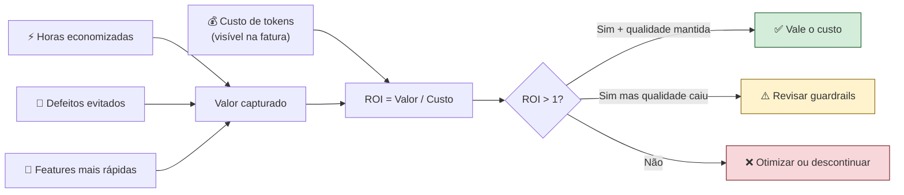
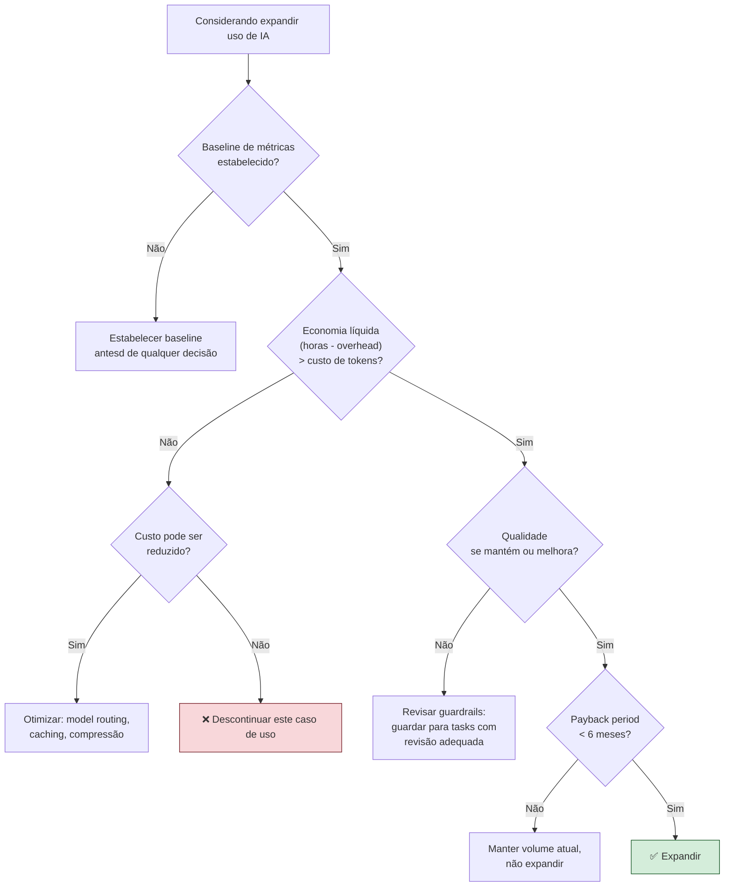

# ROI de IA — quando o agente vale o custo

> [!abstract] TL;DR
> A pergunta certa não é "quanto custa o agente?" — é "quanto custa **não** ter o agente?". ROI de IA se mede comparando custo de tokens vs custo de hora de engenheiro economizada, ajustado por qualidade e risco. A hora de um senior brasileiro ($30-60) compra ~200K tokens de Sonnet — se um agente economiza 1h por dia, ele paga até $1.300/mês de tokens antes de virar prejuízo direto. Mas vanity metrics (uso, frequência) podem mascarar valor real (defeitos evitados, tempo recuperado). Sem métricas de baseline pré-IA, qualquer cálculo de ROI é fé, não evidência.

## O problema: custo visível, valor invisível

O custo de tokens aparece na fatura. O valor é invisível: uma sessão de debugging que custou $3 mas descobriu um bug que teria levado 4 horas para encontrar gerou $240 de valor (4h × $60/h de senior). Como capturar esse valor?

A resposta não é intuitiva: você não mede o valor da IA medindo a IA — você mede o que **muda** no trabalho do engenheiro. Velocidade de entrega, taxa de defeito, rework, satisfação. Se nenhuma dessas métricas melhora, a IA não está gerando valor independentemente do quanto está sendo usada.



## A equação básica

```
ROI = (Valor capturado - Custo total) / Custo total

Onde:
  Valor capturado  = horas economizadas × custo/hora + valor de defeitos evitados
  Custo total      = tokens (API/plano) + overhead (revisão, configuração, treinamento)
```

O overhead frequentemente é ignorado — e é exatamente o que pode tornar o ROI negativo em cenários aparentemente positivos. Um agente que economiza 30 min de escrita mas exige 45 min de revisão cuidadosa tem ROI negativo de escrita.

## A matemática rápida: hora vs tokens

| Perfil (BR, 2026) | Custo/hora | Equivalente em tokens Sonnet 4.6 (input) |
|---|---|---|
| Junior | ~$15 | ~50K tokens ($0.045/MTok × 50K = $2.25) |
| Pleno | ~$30 | ~100K tokens |
| Senior | ~$60 | ~200K tokens |
| Staff/Principal | ~$100+ | ~330K tokens |

**Interpretação:** 1h de senior = 200K tokens de input de Sonnet. Se um agente economiza 1h/dia desse senior, você pode gastar até $60/dia em tokens (≈ $1.300/mês) antes de virar prejuízo direto — e ainda sem contar o valor adicional de features entregues mais rápido.

### Payback period

```
Payback (meses) = Investimento inicial / (Economia mensal - Custo mensal de tokens)
```

```python
def calculate_roi(
    setup_hours: float,
    hourly_rate: float,
    hours_saved_per_day: float,
    working_days_per_month: int,
    monthly_token_cost: float,
    overhead_hours_per_day: float = 0.0   # revisão, treinamento, etc.
) -> dict:
    """
    Calcula ROI e payback period de adoção de IA.
    """
    setup_cost = setup_hours * hourly_rate
    
    net_hours_saved = hours_saved_per_day - overhead_hours_per_day
    monthly_savings = net_hours_saved * hourly_rate * working_days_per_month
    monthly_net = monthly_savings - monthly_token_cost
    
    payback_months = setup_cost / monthly_net if monthly_net > 0 else float("inf")
    annual_roi = (monthly_net * 12 - setup_cost) / (setup_cost + monthly_token_cost * 12)
    
    return {
        "setup_cost": setup_cost,
        "monthly_savings": monthly_savings,
        "monthly_token_cost": monthly_token_cost,
        "monthly_net": monthly_net,
        "payback_months": payback_months,
        "annual_roi_pct": annual_roi * 100,
        "is_positive": monthly_net > 0 and payback_months < 6
    }

# Exemplo: senior com adoção de agente de debugging
result = calculate_roi(
    setup_hours=40,
    hourly_rate=60,
    hours_saved_per_day=1.5,
    working_days_per_month=20,
    monthly_token_cost=200,
    overhead_hours_per_day=0.25   # 15 min de revisão/dia
)
# → payback: 1.6 meses, annual ROI: 534%
```

> [!example] Cálculo real — setup de agente de debugging
> - Setup: 40h × $60 = $2.400 (one-time)
> - Tokens: $200/mês
> - Economia bruta (1.5h/dia × 20 dias × $60): $1.800/mês
> - Overhead (15min revisão/dia × 20 × $60/60): $300/mês
> - Economia líquida: $1.500/mês
> - Payback: $2.400 / ($1.500 - $200) = **1.85 meses**
> - ROI anual: ~500%

## Métricas de valor real (não vanity)

| Métrica | O que mede | Como medir |
|---|---|---|
| **Defect escape rate** | Bugs em prod por feature com IA vs sem IA | Rastrear origin (manual vs IA) por ticket |
| **Rework ratio** | LOC reescritas / LOC commitadas | `git log` comparando antes/depois da adoção |
| **Time-to-merge** | Idade média de PR com IA vs sem IA | PR metrics no GitHub/GitLab |
| **Cycle time** | Ideia → produção com e sem agente | Ticket criado → deployed, por categoria |
| **Dev satisfaction** | NPS interno ou pulse survey | Survey mensal anônimo de 3 perguntas |
| **Horas economizadas auto-reportadas** | O dev sente que economizou tempo? | Weekly time log (5 min/semana) |

> [!warning] Compare com baseline, não com "zero"
> Métricas isoladas não dizem nada. Compare com o trimestre anterior à adoção de IA, com um time controle sem IA, ou com benchmark da indústria. Sem comparação, qualquer número pode ser interpretado como positivo.

## Vanity metrics que enganam

| Métrica vanity | Por que engana | Métrica melhor |
|---|---|---|
| Tokens consumidos/mês | Uso ≠ valor | Horas economizadas validadas pelo dev |
| % de PRs com IA | Pode estar gerando lixo | PRs merged com IA × defect rate nos 30 dias seguintes |
| Linhas de código geradas | Mais código ≠ mais valor | Features completas por sprint (não story points) |
| Velocidade de geração | Rápido e errado é caro | Time-to-merge (inclui review, não só geração) |
| "Tickets fechados com agente" | Como "fechado" é definido? | Tickets sem regressão em 30 dias |

## Framework de decisão: expandir, manter ou descontinuar

A decisão de investimento em IA não é binária — é um portfólio com múltiplos casos de uso, cada um com seu próprio ROI.



## ROI por tipo de task — onde IA realmente ajuda

Nem toda task tem o mesmo ROI. Dados de campo de 2025-2026 mostram padrões consistentes:

| Tipo de task | ROI típico | Por que funciona |
|---|---|---|
| Geração de boilerplate | **Alto** (5-10x) | Repetitivo, sem contexto de negócio necessário |
| Escrita de testes unitários | **Alto** (3-8x) | Pattern conhecido, output verificável |
| Documentação de código existente | **Médio** (2-4x) | Contexto disponível, revisão necessária |
| Code review de PR simples | **Médio** (2-3x) | Padrões conhecidos, edge cases precisam de humano |
| Debugging com stack trace claro | **Médio** (2-4x) | Contexto bem definido |
| Debugging de race conditions | **Baixo** (1-2x) | Complexidade além do modelo |
| Arquitetura de sistema | **Baixo a negativo** | Requer contexto organizacional que o modelo não tem |
| Tasks com compliance pesado | **Negativo** | Overhead de auditoria supera ganho |

## Quando IA NÃO vale a pena

- **Qualidade crítica com revisão custosa:** o tempo de revisão de cada output (medical, finance, infra crítica) pode anular a economia. Se o reviewer leva 45 min para validar algo que o modelo gerou em 30 segundos, o custo real explodiu.
- **Domínio muito específico sem fine-tuning:** o modelo alucina mais do que ajuda. O overhead de correção supera o ganho de geração.
- **Team pequeno + codebase pequena:** o overhead de configuração (40-80h iniciais) não amortiza em contextos de baixo volume.
- **Problema mal-definido:** IA acelera escrita, mas não substitui clareza de spec. Código gerado rápido a partir de spec vaga gera retrabalho acelerado.
- **Métricas instáveis:** se você não consegue medir o ganho, está apostando, não investindo.
- **Compliance pesado:** auditoria de cada output gerado pode exigir mais trabalho do que escrever do zero.

## Armadilhas comuns

> [!warning] Medir só uso, não valor
> Times com dashboards de "tokens por mês" e "PRs com IA" podem estar investindo em métricas que não refletem valor. A única métrica que importa para o ROI é o que muda no output do time — velocidade, qualidade, satisfação. Uso é condição necessária, não suficiente.

> [!warning] Não medir o contrafactual
> Sem baseline pré-IA ou grupo controle, qualquer melhoria de métrica pode ser atribuída a dezenas de outras variáveis: time cresceu, dívida técnica reduzida, processo melhorou. Estabeleça baseline antes de adotar; meça delta, não valor absoluto.

> [!warning] Ignorar custo de overhead de revisão
> O overhead da IA não é só tokens — é o tempo de revisão humana de cada output. Um agente que escreve código que requer 40% mais tempo de review do que código humano tem um custo oculto que pode inverter o ROI. Medir o tempo de review separadamente do tempo de geração é essencial.

> [!warning] Comparar IA com "fazer nada" em vez de com a melhor alternativa
> O contrafactual honesto não é "sem IA não teríamos entregado" — é "com autocompletion melhor, linters mais fortes, ou melhor documentação, teríamos entregado menos?". IA precisa ganhar de outros investimentos para justificar o custo, não de ausência de investimento.

## Comparando investimentos alternativos

O ROI de IA precisa competir com outros investimentos que o mesmo budget compraria. A análise honesta inclui o contrafactual.

| Alternativa ao budget de IA | ROI estimado | Melhor quando |
|---|---|---|
| Licença de ferramenta de lint/static analysis | Alto + duradouro | Codebase com dívida de qualidade |
| 20h de pair programming (senior/junior) | Alto para o júnior | Time com gap de sênioridade |
| 40h de refactoring de gargalo crítico | Variável | Problema bem identificado |
| Budget de IA com good routing | Alto se bem configurado | Uso diário e diversificado |
| Contratação de 0.1 FTE (10h/mês de freelancer) | Previsível | Task muito especializada |

A pergunta não é "IA vale a pena?" — é "IA vale a pena **comparada a essas alternativas** para o nosso contexto atual?".

## Rastreando o ROI no tempo

O ROI de IA não é estático. Três forças movem o número:

1. **Deflação de tokens** — o custo por token cai consistentemente. O que custava $20/MTok em 2023 custa $3/MTok em 2026. Tasks com ROI marginal tornam-se positivas com o tempo.

2. **Aprendizado da equipe** — devs que usam IA há mais tempo extraem mais valor: melhor prompt engineering, melhor seleção de tasks, melhor integração no workflow. O ROI aumenta com a curva de aprendizado.

3. **Mudança de domínio** — quando o codebase muda (ex: migração para nova linguagem, novo domínio de negócio), o modelo conhece menos o contexto e o ROI cai até o modelo ser retreinado ou o dev aprender a dar mais contexto.

```python
# Template de rastreio de ROI ao longo do tempo
class ROITracker:
    def __init__(self, hourly_rate: float):
        self.hourly_rate = hourly_rate
        self.records: list[dict] = []
    
    def add_month(
        self,
        month: str,
        hours_saved: float,
        overhead_hours: float,
        token_cost_usd: float,
        defects_caught: int = 0,
        avg_defect_cost_hours: float = 4.0
    ) -> dict:
        defect_value = defects_caught * avg_defect_cost_hours * self.hourly_rate
        savings = (hours_saved - overhead_hours) * self.hourly_rate + defect_value
        net = savings - token_cost_usd
        roi_pct = (net / token_cost_usd) * 100 if token_cost_usd > 0 else 0
        
        record = {
            "month": month,
            "hours_saved": hours_saved,
            "overhead_hours": overhead_hours,
            "token_cost": token_cost_usd,
            "defect_value": defect_value,
            "net_monthly": net,
            "roi_pct": roi_pct,
        }
        self.records.append(record)
        return record
    
    def summary(self) -> dict:
        if not self.records:
            return {}
        total_net = sum(r["net_monthly"] for r in self.records)
        avg_roi = sum(r["roi_pct"] for r in self.records) / len(self.records)
        trend = (
            self.records[-1]["roi_pct"] - self.records[0]["roi_pct"]
            if len(self.records) > 1 else 0
        )
        return {
            "months_tracked": len(self.records),
            "total_net_usd": total_net,
            "avg_monthly_roi_pct": avg_roi,
            "roi_trend": "increasing" if trend > 5 else "stable" if abs(trend) <= 5 else "decreasing"
        }
```

## Estado da arte — junho 2026

**Benchmarks independentes de produtividade:** Em 2025-2026, pesquisas independentes (METR, MIT Sloan, GitHub Research) produziram dados mais matizados que os claims de marketing. O ganho de produtividade real para tasks de software varia de 13% (tasks ambíguas, domínio novo) a 55% (tasks bem-definidas, domínio conhecido). A mensagem: contexto importa mais do que a ferramenta.

**ROI em times de produto vs infraestrutura:** Dados de 2026 mostram que times de produto (features novas) têm ROI positivo mais consistente que times de infraestrutura (manutenção, segurança, compliance). A hipótese: IA é melhor em geração do que em raciocínio sobre consequências de segunda ordem.

**Deflação do custo de tokens:** Em 2025-2026, o custo por token caiu ~60% em média — o que era $15/MTok tornou-se $3/MTok em modelos equivalentes. Isso desloca o ponto de breakeven: tasks que eram marginalmente positivas tornaram-se claramente positivas. Ver [[20 - O futuro — tokens cada vez mais baratos]].

**Métricas de qualidade integrando IA:** Times maduros em 2026 medem não só "velocidade com IA" mas "taxa de defeito de código gerado por IA vs humano" — e descobrindo que código IA tem menos bugs de sintaxe mas mais bugs de lógica de negócio, especialmente em domínios com regras complexas não documentadas.

## Casos práticos

**Caso 1 — ROI positivo em geração de testes:**
Um time de 8 devs adotou agente de geração de testes para código legado. Cobertura subiu de 23% para 61% em 3 meses. Custo: $400/mês em tokens + 20h de setup. Valor medido: 3 bugs críticos pegos em review antes do prod que historicamente chegariam à produção (custo médio de bug em prod: 4h × $50 = $200). ROI no trimestre: +$600 em valor - $1.200 em custo = -$600, mas com trajetória positiva após o payback do setup.

**Caso 2 — ROI negativo em geração de documentação:**
Uma empresa adotou agente de geração de docs de API. Os devs passavam mais tempo revisando e corrigindo a documentação gerada do que levariam para escrever do zero. O modelo gerava docs corretas na estrutura mas incorretas no conteúdo (semantics específicos de domínio que não estavam nos comentários do código). ROI: negativo. Decisão: descontinuar a geração automática, usar IA só para formatação e linting de docs humanas.

**Caso 3 — Payback de 2 meses com agente de debugging:**
Senior com $60/h de custo adotou agente de debugging (Claude Sonnet + MCP do codebase). Média de 1.2h economizadas por dia, 20 dias úteis, com 15 min de overhead de revisão. Custo de tokens: $180/mês. Net mensal: (0.95h × 20 × $60) - $180 = $1.140 - $180 = $960/mês. Setup: 30h = $1.800. Payback: 1.875 meses. ROI anual após payback: ~640%.

**Caso 4 — ROI de plano vs API:**
Um dev pesado (power user com 8h/dia de coding assistido) calculou ROI entre plano Pro ($20/mês) e API paga. Com API, consumia ~$120/mês em tokens. O plano Max (uso ilimitado de Claude Opus) custava $100/mês — mas eliminava a fricção de monitorar custo por chamada. Decisão: plano Max para desenvolvimento, API para produção com controles. ROI do plano vs API: +$20/mês de economia + economia mental de não monitorar.

## Cadência de revisão de ROI

ROI é dinâmico — o que era negativo pode tornar-se positivo com deflação de tokens ou fine-tuning, e vice-versa com mudança de domínio.

| Frequência | O que revisar | Quem |
|---|---|---|
| **Mensal** | Custo de tokens vs economia estimada | Tech lead / dev responsável |
| **Trimestral** | Métricas de qualidade (defect rate, rework) | Tech lead + product manager |
| **Semestral** | Decisão de expandir, manter ou descontinuar | CTO / decisor técnico |
| **Ad-hoc** | Após mudança de preço de provider | Tech lead |

## Checklist

- [ ] Baseline de métricas estabelecido antes de adotar IA (time-to-merge, defect rate)
- [ ] Cálculo de ROI documentado com overhead de revisão incluído
- [ ] Payback period calculado e validado com gestor
- [ ] Vanity metrics identificadas e excluídas do report de valor
- [ ] Revisão mensal de custo vs economia com dados reais
- [ ] Decisão de continuar/expandir/descontinuar revisada trimestralmente
- [ ] Custo de tokens monitorado separadamente de custo de overhead humano
- [ ] ROI calculado por tipo de task (não só agregado do time)
- [ ] Framework de decisão documentado para novos casos de uso
- [ ] Comparação com alternativas (lint tools, pair programming, contratação) feita antes de expandir
- [ ] ROI tracker mensal implementado (mesmo que seja uma planilha simples)
- [ ] Deflação de tokens considerada na projeção de ROI futuro
- [ ] Decisão de descontinuar documentada com raciocínio (para não ser revertida sem motivo)

## ROI para decisão de plano vs API

Uma aplicação prática do cálculo de ROI é a escolha entre plano fixo (Pro, Max) e API paga. A decisão depende do volume e do perfil de uso.

| Perfil | Plano indicado | Por que |
|---|---|---|
| Dev casual (<2h/dia de IA) | Pro ($20/mês) | Volume baixo; API mais cara |
| Dev power user (2-6h/dia) | Max ($100/mês) | Uso ilimitado vence API acima de ~$80/mês |
| Time de 5 (uso moderado) | Pro por dev ou Team | Budget fixo previsível |
| Produto em produção | API com routing | Controle granular de custo + modelo correto por task |
| CI/CD com volume alto | API + Batch | Desconto de 50% em batch + volume não interativo |

Ver [[19 - Planos e tiers — Max, Pro, API, Enterprise]] para o cálculo completo.

## O que vem a seguir

Com ROI calculado e decisão de continuar, o próximo passo prático é comparar os planos disponíveis — Pro, Max, API, Enterprise — e entender qual faz mais sentido para cada perfil de uso. [[18 - Playbook de economia — checklist completo]] consolida todas as técnicas do galho em um guia operacional; [[19 - Planos e tiers — Max, Pro, API, Enterprise]] cobre a decisão de plano vs API.

## Como explicar em inglês

**ROI** é universal — não traduzir. Em inglês técnico, os termos de medição de produtividade têm nuances importantes.

| Português | Inglês | Contexto de uso |
|---|---|---|
| Retorno sobre investimento | ROI (Return on Investment) | Métrica financeira padrão |
| Custo de oportunidade | Opportunity cost | Custo de não usar IA (contrafactual) |
| Período de payback | Payback period | Tempo para recuperar investimento inicial |
| Taxa de defeito | Defect rate | Bugs por feature ou por linha de código |
| Tempo de ciclo | Cycle time | Ideia → produção, métrica de fluxo |
| Overhead de revisão | Review overhead | Custo humano de revisar output de IA |
| Métrica vanity | Vanity metric | Métrica que parece boa mas não reflete valor |
| Contrafactual | Counterfactual | O que teria acontecido sem IA |
| Baseline | Baseline | Medida de referência pré-adoção |
| Amortização do setup | Setup amortization | Distribuir custo de configuração pelo tempo de uso |

> [!tip] Veja: The Real Productivity Impact of AI Coding Assistants
> **Canal:** METR / MIT Sloan Research | **Duração:** ~30min | **Idioma:** EN
>
> Apresentação dos resultados de pesquisa independente sobre o impacto de ferramentas de IA no desenvolvimento de software — metodologia, dados reais de produtividade, e nuances por tipo de task e perfil de desenvolvedor. Contrasta com benchmarks de marketing dos vendors.
>
> 🎬 [Assistir no YouTube](https://youtube.com/results?search_query=AI+coding+productivity+real+impact+research)

## Veja também

- [[01 - O problema — por que tokens custam dinheiro]] — base do custo que entra no denominador do ROI
- [[15 - Orçamento e hard limits]] — garantir que o custo não ultrapasse o budget calculado
- [[16 - Auditoria de consumo]] — investigar onde o custo está indo
- [[19 - Planos e tiers — Max, Pro, API, Enterprise]] — decisão de plano após calcular o ROI
- [[20 - O futuro — tokens cada vez mais baratos]] — como a deflação de tokens afeta o ROI futuro

## Fontes

- **GitHub Research** — *Quantifying GitHub Copilot's impact on developer productivity* (2024). Estudo controlado com 95 devs — 55% mais rápidos em tasks de geração, mas sem impacto significativo em debugging e refactoring.
- **METR** — *Measuring impact of AI on real-world software development* (2025). Estudo independente de longo prazo em tarefas reais — identificou 13-23% de ganho médio, com alta variância por tipo de task.
- **Stack Overflow Developer Survey 2026** — *AI tools usage and productivity*. Dados de 65.000 devs sobre adoção, satisfação e percepção de produtividade — inclui segmentação por perfil e tipo de empresa.
- **Kalliamvakou, Eirini** — *The economic impact of AI coding tools* (MIT Sloan Management Review, 2025). Análise econômica do ROI de IA em software — inclui modelos de cálculo e estudo de casos reais de 40 empresas.
