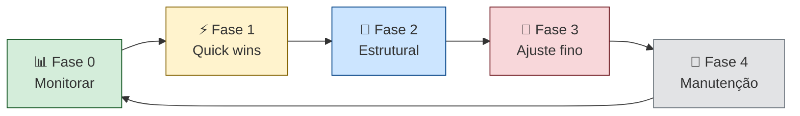

# Playbook de economia — checklist completo

> [!abstract] TL;DR
> Este é o checklist mestre de economia de tokens — a destilação de todas as técnicas desta trilha em uma sequência operacional. Aplicando o conjunto completo, é possível reduzir custos em 60-85% mantendo (ou melhorando) a qualidade. A ordem importa: monitore primeiro para saber onde está o desperdício, depois aplique as técnicas de maior impacto (caching, pruning, routing), e por fim as de ajuste fino. Nunca otimize sem dados — você provavelmente estará otimizando o lugar errado.

## Por que playbook e não só checklist

Uma lista de itens sem ordem ou prioridade cria confusão: o time aplica técnicas de ajuste fino antes de estabelecer monitoramento, ou implementa semantic caching antes de resolver o problema mais óbvio de falta de prompt caching.

Este playbook tem sequência deliberada:



**Regra de ouro:** não avance para a próxima fase sem ter completado pelo menos 70% da anterior. Fase 2 sem dados de baseline (Fase 0) é otimização cega.

## Fase 0: Monitoramento (ANTES de otimizar)

O ponto de partida. Sem baseline, você não sabe onde está o custo nem como medir o impacto das otimizações.

- [ ] Instalar monitoramento de consumo: `ccusage` para Claude Code local, Helicone/Langfuse para sistemas com API
- [ ] Registrar baseline de custo diário/semanal por pelo menos 1 semana antes de otimizar
- [ ] Identificar TOP 3 categorias de gasto (por model, por feature, por tipo de operação)
- [ ] Verificar cache hit rate — se <40%, prompt caching é o primeiro fix
- [ ] Verificar distribuição de modelos — se Opus aparece em tasks simples, routing é o primeiro fix
- [ ] Documentar o baseline: "Custo atual: $X/mês, distribuição: Y% input, Z% output, W% thinking"

**Referência:** [[04 - Monitoramento — ccusage, Langfuse, dashboards]]

## Fase 1: Quick wins (alto impacto, baixo esforço)

Técnicas com impacto imediato e implementação simples. Começar por aqui garante ROI rápido.

### 1.1 Prompt caching

A única otimização com redução de até 90% em custo de input para conteúdo estático repetido.

- [ ] Identificar conteúdo estático no system prompt (instruções, contexto de projeto, tool definitions)
- [ ] Mover conteúdo estático para o início do prompt (antes de conteúdo dinâmico)
- [ ] Adicionar `cache_control: {"type": "ephemeral"}` no breakpoint correto
- [ ] Verificar que breakpoint está em posição de >1024 tokens do início
- [ ] Medir cache hit rate antes e depois (meta: >70% em sessões recorrentes)

**Referência:** [[05 - Prompt caching na prática]]

### 1.2 Context pruning

Remover o que não é necessário — a técnica mais simples de redução de input.

- [ ] Configurar `.cursorignore` / `.claudeignore` para excluir `node_modules/`, `dist/`, `coverage/`, `*.lock`
- [ ] Excluir arquivos de build e gerados do contexto
- [ ] Usar `Read` com `offset/limit` para enviar só as linhas relevantes (não arquivos inteiros)
- [ ] Verificar CLAUDE.md — se passou de 200 linhas, há informação desnecessária

**Referência:** [[06 - Context pruning — o que remover do prompt]]

### 1.3 Respostas concisas

Output custa 4-5x mais que input — instruir o modelo a ser conciso tem ROI imediato.

- [ ] Adicionar instrução de concisão no system prompt: "Responda de forma direta e sem preâmbulos"
- [ ] Calibrar `max_tokens` por tipo de endpoint (não deixar no default)
- [ ] Remover solicitações de explicação excessiva quando só o código é necessário

**Referência:** [[13 - Respostas concisas — controlar output tokens]]

### 1.4 Model routing básico

Garantir que tarefas simples não usam modelos caros.

- [ ] Mapear os tipos de tasks mais frequentes
- [ ] Identificar quais tasks podem ir para Haiku/Flash (classificação, formatação, templates)
- [ ] Configurar routing explícito para pelo menos as 3 tasks mais frequentes

**Referência:** [[09 - Model routing — modelo certo para a tarefa]]

## Fase 2: Otimizações estruturais (médio esforço, alto impacto)

Requerem mudanças de código ou configuração, mas impacto é sustentável a longo prazo.

### 2.1 Compactação de histórico em agentes

- [ ] Configurar rolling summarization em agentes de longa duração
- [ ] Usar `/compact` proativamente quando o contexto passar de ~100K tokens
- [ ] Implementar anchored state document para agentes com estado complexo
- [ ] Configurar `/clear` entre tarefas independentes

**Referência:** [[08 - Compactação de histórico em agentes]]

### 2.2 Compressão de tool definitions

- [ ] Auditar descriptions de tools — se >85 tokens por tool, comprimir
- [ ] Implementar lazy loading: tools não usadas na sessão não entram no system prompt
- [ ] Considerar tool merging (action parameter) para ferramentas relacionadas
- [ ] Verificar uso real de cada tool nas últimas 20 sessões — remover as não utilizadas

**Referência:** [[07 - Compressão de tool definitions]]

### 2.3 Sub-agentes eficientes

- [ ] Delegar buscas e leituras para sub-agente `Explore` (read-only, sem histórico de tool calls)
- [ ] Usar `general-purpose` apenas para tasks de escrita ou que exigem múltiplas ferramentas
- [ ] Aplicar heurística dos 5K tokens: se contexto relevante > 5K, sub-agente vale a pena
- [ ] Medir custo por sub-agente separadamente

**Referência:** [[10 - Sub-agentes especializados]]

### 2.4 Thinking budget

- [ ] Criar whitelist de task_types que justificam extended thinking
- [ ] Desativar thinking por default — ativar só na whitelist
- [ ] Calibrar budget por tipo de task (ex: 5K para review simples, 30K para debugging complexo)
- [ ] Logar `thinking_tokens` separadamente de `output_tokens` no dashboard

**Referência:** [[14 - Thinking budget — controlar reasoning tokens]]

## Fase 3: Ajuste fino (menor esforço incremental, impacto residual)

Técnicas que otimizam os últimos 10-20% do custo — implementar após as fases 1 e 2.

### 3.1 Batch API

- [ ] Identificar tasks assíncronas de alto volume (relatórios, análise de PR, documentação)
- [ ] Implementar batch processing com 50% de desconto no custo
- [ ] Configurar SLA de até 24h para tasks não urgentes

**Referência:** [[12 - Batch API — economia em volume]]

### 3.2 Semantic caching

- [ ] Identificar queries de alta frequência e baixa variação (FAQ, análise de padrões repetidos)
- [ ] Implementar cache semântico com threshold 0.95-0.98
- [ ] Medir cache hit rate e ROI do cache (custo de embedding vs custo de LLM evitado)

**Referência:** [[11 - Semantic caching]]

### 3.3 Orçamento e governança

- [ ] Definir budget mensal por projeto/time
- [ ] Configurar alertas a 70% e 90% do budget nos consoles dos providers
- [ ] Implementar hard limits no código (spending limits + kill switches em agentes)

**Referência:** [[15 - Orçamento e hard limits]]

## Fase 4: Manutenção contínua

- [ ] Revisar dashboard de consumo semanalmente (10 min)
- [ ] Auditoria mensal: top 10 sessões mais caras, classificação por padrão de desperdício
- [ ] Ajustar budget e modelo de routing trimestralmente
- [ ] Atualizar tabela de preços quando providers mudam pricing
- [ ] Treinar novos membros do time nas práticas de economia (30 min de onboarding)
- [ ] Revisar ROI semestral: expandir o que funciona, descontinuar o que não funciona

**Referência:** [[16 - Auditoria de consumo]] | [[17 - ROI de IA — quando o agente vale o custo]]

## Diagnóstico rápido: por onde começar?

Antes de seguir o playbook linear, um diagnóstico de 15 minutos pode priorizar a fase mais impactante para o seu contexto específico.

```python
def diagnose_optimization_priority(
    cache_hit_rate_pct: float,
    opus_pct_of_calls: float,
    avg_session_turns: float,
    thinking_pct_of_cost: float,
    output_pct_of_cost: float,
) -> list[str]:
    """
    Retorna lista de técnicas priorizadas por impacto estimado.
    Responda as 5 perguntas com dados do seu dashboard.
    """
    priorities = []
    
    if cache_hit_rate_pct < 40:
        priorities.append("🔴 CRÍTICO: Prompt caching — cache hit rate < 40%")
    
    if opus_pct_of_calls > 30:
        priorities.append("🔴 CRÍTICO: Model routing — Opus em >30% das chamadas")
    
    if avg_session_turns > 20:
        priorities.append("🟡 ALTO: Compactação de histórico — sessões com >20 turnos")
    
    if thinking_pct_of_cost > 20:
        priorities.append("🟡 ALTO: Thinking budget — raciocínio >20% do custo")
    
    if output_pct_of_cost > 50:
        priorities.append("🟡 ALTO: Respostas concisas — output >50% do custo")
    
    if not priorities:
        priorities.append("🟢 OK: Continue com Fase 3 (ajuste fino)")
    
    return priorities

# Exemplo de diagnóstico:
result = diagnose_optimization_priority(
    cache_hit_rate_pct=18,    # muito baixo
    opus_pct_of_calls=45,     # alto demais
    avg_session_turns=12,     # ok
    thinking_pct_of_cost=8,   # ok
    output_pct_of_cost=35,    # ok
)
# → ["🔴 CRÍTICO: Prompt caching", "🔴 CRÍTICO: Model routing"]
# Focar Fase 1 antes de qualquer outra técnica
```

## Quick reference: técnica por problema

Tabela de lookup rápido quando você identifica um sintoma específico:

| Sintoma observado | Técnica | Fase | Referência |
|---|---|---|---|
| Cache hit rate < 40% | Prompt caching | 1 | [[05 - Prompt caching na prática]] |
| Input por turno cresce linearmente | Compactação de histórico | 2 | [[08 - Compactação de histórico em agentes]] |
| Opus em tasks de classificação | Model routing | 1 | [[09 - Model routing — modelo certo para a tarefa]] |
| Turno único > 20K input tokens | Context pruning / tool output truncation | 1 | [[06 - Context pruning — o que remover do prompt]] |
| Thinking > 5x output por chamada | Thinking budget | 2 | [[14 - Thinking budget — controlar reasoning tokens]] |
| System prompt > 10K tokens | Tool definition compression | 2 | [[07 - Compressão de tool definitions]] |
| Mesma query cara repetida muitas vezes | Semantic caching | 3 | [[11 - Semantic caching]] |
| Output muito longo e redundante | Respostas concisas | 1 | [[13 - Respostas concisas — controlar output tokens]] |
| Tasks assíncronas de volume alto | Batch API | 3 | [[12 - Batch API — economia em volume]] |
| Agente em loop sem parar | Kill switches | — | [[15 - Orçamento e hard limits]] |
| Custo crescendo sem motivo claro | Auditoria de consumo | — | [[16 - Auditoria de consumo]] |

## Impacto acumulado estimado

A aplicação sequencial das técnicas tem impacto composto — cada técnica reduz o custo já reduzido pela anterior.

| Técnica aplicada | Redução incremental | Custo resultante |
|---|---|---|
| Baseline (sem otimização) | — | $1.000/mês |
| + Prompt caching | -40% | $600/mês |
| + Context pruning | -20% | $480/mês |
| + Respostas concisas | -15% | $408/mês |
| + Model routing | -25% | $306/mês |
| + Compactação de histórico | -15% | $260/mês |
| + Thinking budget | -10% | $234/mês |
| + Batch API (tarefas assíncronas) | -5% do total | $200/mês |
| **Total** | **~80%** | **~$200/mês** |

Os números são estimativas para um perfil de uso moderado de um time de 3-5 devs com agente ativo. Resultados variam por padrão de uso — perfis com sessões muito longas ganham mais com compactação; perfis com prompts estáticos ganham mais com caching.

## Armadilhas comuns

> [!warning] Otimizar antes de medir
> O erro mais comum: implementar prompt caching sem saber se o custo está em input ou output. Se 80% do custo é output (respostas longas), caching de input tem impacto mínimo. Sempre Fase 0 primeiro.

> [!warning] Aplicar todas as técnicas de uma vez
> Quando múltiplas mudanças são aplicadas simultaneamente, é impossível saber qual teve impacto. Aplicar uma fase por vez, medir entre cada fase, e atribuir o ganho corretamente.

> [!warning] Tratar o playbook como estático
> Preços mudam, modelos evoluem, o padrão de uso do time muda. O playbook precisa ser revisado trimestralmente — especialmente as tabelas de custo por modelo e os thresholds de routing.

> [!warning] Ignorar o custo de implementação das otimizações
> Cada técnica tem custo de engenharia. Semantic caching requer infraestrutura (Redis + embedding model). Batch API requer arquitetura assíncrona. Calcular o payback antes de implementar, especialmente as técnicas de Fase 3.

## Estado da arte — junho 2026

**Otimização automatizada com análise de logs:** Ferramentas como Helicone Optimize (2026) analisam logs de uso e recomendam automaticamente quais técnicas aplicar, com estimativa de impacto baseada em dados reais do usuário — não apenas benchmarks genéricos. O playbook vira dinâmico.

**IA de segunda ordem para otimização de IA:** Times avançados em 2026 usam um modelo mais barato (Haiku) para classificar e pré-processar requests antes de decidir qual modelo principal invocar. O classificador custa ~$0.001 por request e pode economizar $0.15-$1.50 em requests que seriam enviados ao Opus desnecessariamente.

**Playbooks por domínio:** Em 2026, a otimização de custo tem playbooks específicos por domínio — developer tools, customer support, document processing, code review. As técnicas de maior impacto variam: para customer support, semantic caching tem ROI altíssimo; para code review, context pruning (excluir arquivos irrelevantes do diff) tem maior impacto.

## Casos práticos

**Caso 1 — Time de 5 devs com redução de 73%:**
Time aplicou as Fases 1-2 ao longo de 3 sprints. Partindo de $1.200/mês: prompt caching (-45%, $660), context pruning (-18%, $541), model routing (-22%, $422), compactação de histórico (-17%, $350). Total em 3 meses: -71%. Tempo de implementação: ~30h de engenharia.

**Caso 2 — Dev solo com playbook mínimo:**
Dev solo com $150/mês de uso: adotou só Fase 1 (prompts caching + .claudeignore + max_tokens calibrado). Resultado em 2 semanas: $85/mês. Redução de 43% em 4h de trabalho. Concluiu que Fases 2 e 3 não compensavam o esforço para o volume dele.

**Caso 3 — Produto B2C com otimização em produção:**
Startup com LLM em produto: aplicou Fases 0-3 ao longo de 2 meses. De $8.000/mês para $2.100/mês (-74%). O maior impacto foi na Fase 3 (semantic caching para perguntas frequentes de usuários), que sozinha reduziu 35% — diferente do padrão de ferramentas de dev onde caching de prompt tem maior impacto.

**Caso 4 — ROI de implementação das fases:**
Time calculou o custo de implementação de cada fase antes de executar:
- Fase 0 (monitoramento): 4h de setup, $0 incremental — executar imediatamente
- Fase 1 (quick wins): 8h total, payback em 2 semanas — executar agora
- Fase 2 (estrutural): 20h total, payback em 1 mês — executar no próximo sprint
- Fase 3 (ajuste fino): 40h total, payback em 3 meses — avaliar depois da Fase 2

## O que vem a seguir

Com o playbook implementado, os próximos passos são comparar os planos disponíveis para maximizar o budget ([[19 - Planos e tiers — Max, Pro, API, Enterprise]]) e entender como o custo vai evoluir à medida que os tokens ficam mais baratos ([[20 - O futuro — tokens cada vez mais baratos]]).

## Como explicar em inglês

**Playbook** é o termo direto em inglês. Em contextos de engenharia, o vocabulário de otimização tem termos específicos que vale conhecer.

| Português | Inglês | Contexto de uso |
|---|---|---|
| Playbook de economia | Cost optimization playbook | Guia operacional de redução de custo |
| Quick wins | Quick wins / Low-hanging fruit | Técnicas de alto impacto e baixo esforço |
| Otimização estrutural | Structural optimization | Mudanças de arquitetura com impacto duradouro |
| Ajuste fino | Fine-tuning / Fine-grained optimization | Otimizações residuais de menor impacto |
| Impacto acumulado | Compounding impact | Impacto composto de múltiplas técnicas |
| Baseline de custo | Cost baseline | Medida de referência pré-otimização |
| Checklist mestre | Master checklist | Lista abrangente de verificação |
| Manutenção contínua | Ongoing maintenance | Processo regular de revisão e ajuste |
| Custo residual | Residual cost | Custo remanescente após otimizações |
| Payback de implementação | Implementation payback | Tempo para recuperar custo de engenharia |

> [!tip] Veja: LLM Cost Optimization — From 0 to Production
> **Canal:** Latent Space / AI Engineering | **Duração:** ~35min | **Idioma:** EN
>
> Walkthrough completo de otimização de custo com LLMs em produção — cobrindo prompt caching, model routing, e monitoramento. Inclui dados reais de uma startup que reduziu custos em 70% em 2 meses usando as mesmas técnicas deste playbook, com código e dashboards ao vivo.
>
> 🎬 [Assistir no YouTube](https://youtube.com/results?search_query=LLM+cost+optimization+production+2026)

## Veja também

- [[01 - O problema — por que tokens custam dinheiro]] — a motivação para o playbook
- [[04 - Monitoramento — ccusage, Langfuse, dashboards]] — Fase 0 em detalhe
- [[19 - Planos e tiers — Max, Pro, API, Enterprise]] — decisão de plano após otimizar
- [[20 - O futuro — tokens cada vez mais baratos]] — como o landscape vai mudar

## Fontes

- **Anthropic** — *Best Practices for Token Efficiency* (docs.anthropic.com, 2026). Guia oficial de otimização de tokens — prompt caching, max_tokens, e padrões recomendados.
- **Helicone** — *LLM Cost Optimization Guide* (helicone.ai/docs, 2026). Guia prático com dados reais de usuários — quais técnicas têm maior impacto em diferentes cenários de uso.
- **Simon Willison** — *Token optimization strategies that actually work* (simonwillison.net, 2025). Análise prática com experimentos mensuráveis — expectativas realistas de impacto de cada técnica.
- **Wilson, Alex** — *The LLM Cost Optimization Handbook* (leanpub.com, 2026). Livro técnico cobrindo as principais estratégias de otimização com exemplos de código e estudos de caso reais.
