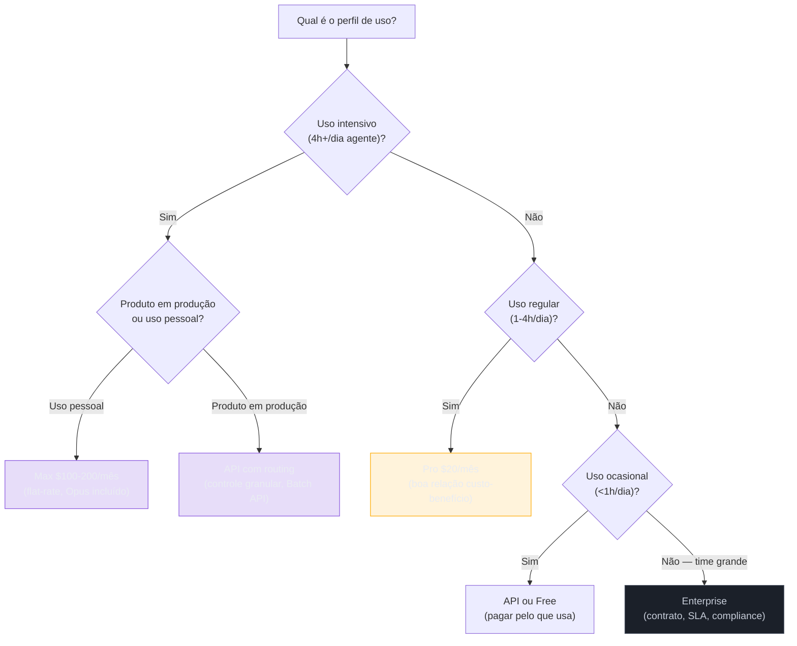

# Planos e tiers — Max, Pro, API, Enterprise

> [!abstract] TL;DR
> Providers oferecem múltiplos modelos de cobrança: pay-per-token (API), assinatura flat-rate (Pro/Max), e enterprise. Para dev solo usando agentes 4h+/dia, planos flat-rate (Claude Max $100/mês) geralmente são mais baratos que API pura — especialmente com Opus. Para times e automação, API com routing é mais flexível e mais barato. Enterprise faz sentido acima de 10 devs com necessidade de SLA, suporte, e controles de compliance. A decisão certa depende de volume, previsibilidade, controle necessário, e se você aceita ficar preso a um provider.

## O problema: custo imprevisível vs custo subótimo

Há dois modos de errar na escolha de plano:

- **API sem controle:** custo variável que surpreende na fatura — um agente em loop ou uma semana intensiva de debugging pode multiplicar o custo esperado.
- **Plano flat-rate errado:** pagar $100/mês e usar 20% da capacidade (waste); ou ter o plano Pro atingido toda semana por quem deveria estar no Max.

A árvore de decisão não é complicada — o problema é que a maioria das pessoas não faz o cálculo antes de decidir.



## Comparativo de modelos de cobrança

| Modelo | Como cobra | Previsibilidade | Melhor para |
|---|---|---|---|
| **API pay-per-token** | $/MTok por chamada | Variável — requer monitoramento | Automação, CI/CD, produto, volume variável |
| **Pro ($20/mês)** | Flat rate, uso moderado | Alta | Dev casual, orçamento apertado |
| **Max ($100-200/mês)** | Flat rate, uso alto (5x ou 20x Pro) | Alta | Dev power user, agentes intensivos |
| **Enterprise** | Contrato anual + SLA | Muito alta | Times >10 devs, compliance, SOC2 |

## Claude (Anthropic) — junho 2026

> [!warning] Validade: junho 2026
> Preços e tiers mudam com frequência — a Anthropic já revisou os limites do Max mais de uma vez desde o lançamento. Confira a [página oficial de pricing](https://www.anthropic.com/pricing) antes de decidir; os valores abaixo são um retrato do momento, não uma garantia.

| Plano | Preço | Capacidade | Modelos disponíveis | Notas |
|---|---|---|---|---|
| **Free** | $0 | Muito limitado | Haiku, Sonnet (limitado) | Bom para experimentar |
| **Pro** | $20/mês | Uso moderado | Sonnet, Opus (limitado) | Atinge limites em uso intensivo |
| **Max 5x** | $100/mês | 5x uso do Pro | Sonnet + Opus (amplo) | Melhor custo/benefício para power users |
| **Max 20x** | $200/mês | 20x uso do Pro | Sonnet + Opus (extensivo) | Para uso muito intensivo ou par programação com agente |
| **API** | Pay-per-token | Sem limite (billing cap) | Todos | Flexibilidade máxima, requer controles |
| **Enterprise** | Contrato anual | Customizado | Todos + recursos enterprise | SOC2, SSO, suporte dedicado |

**Recursos exclusivos do Max vs Pro:**
- Uso de Opus sem bloqueio frequente
- Maior janela de contexto em projetos de longa duração
- Prioridade de acesso em horários de pico
- Acesso antecipado a novos modelos e features

## OpenAI — junho 2026

> [!warning] Validade: junho 2026
> A OpenAI reorganiza tiers com regularidade (Plus, Pro, Go, Business já mudaram de composição mais de uma vez). Confira a [página oficial de pricing](https://openai.com/pricing) antes de decidir.

| Plano | Preço | Modelos | Diferencial |
|---|---|---|---|
| **Free** | $0 | GPT-4o-mini | Muito limitado |
| **Plus** | $20/mês | GPT-4o, o4-mini | Limite de uso razoável para dev casual |
| **Pro** | $200/mês | GPT-4o, o3, o4, o1 | Reasoning ilimitado, acesso prioritário |
| **API** | Pay-per-token | Todos | Sem limite, pay what you use |
| **Enterprise** | Contrato | Todos | Compliance, data retention controls |

## Google (Gemini) — junho 2026

> [!warning] Validade: junho 2026
> O Gemini API tem free tier generoso que muda de limites conforme a capacidade de inferência do Google evolui. Confira a [página oficial de pricing](https://ai.google.dev/pricing) antes de decidir.

| Plano | Preço | Modelos | Diferencial |
|---|---|---|---|
| **Free** | $0 | Gemini Flash (limitado) | Experimentos básicos |
| **Advanced** | $20/mês | Gemini Pro, Ultra | Integrado ao workspace Google |
| **API (AI Studio)** | Pay-per-token | Flash, Pro, Ultra | Free tier generoso; Ultra pago |
| **Vertex AI** | Pay-per-token + infra | Todos | Enterprise GCP, fine-tuning |

## Quando cada plano faz sentido: árvore de decisão detalhada

A árvore acima é o resumo. Aqui está a lógica completa com os critérios que fazem a diferença:

### Dev solo

| Perfil | Plano recomendado | Raciocínio |
|---|---|---|
| Experimental (<30 min/dia) | Free ou API | Custo mínimo, sem comprometimento |
| Casual (1-2h/dia, Sonnet) | Pro $20/mês | Flat-rate cobre o uso sem surpresas |
| Regular (2-4h/dia, mix) | Pro ou Max 5x | Depende de quanto Opus você usa |
| Intensivo (4-8h/dia, agente) | Max 5x $100/mês | Opus incluído, sem limite frequente |
| Muito intensivo (8h+, pair com agente) | Max 20x $200/mês | Capacidade máxima sem restrições |
| Automação e scripts pessoais | API | Controle por chamada, sem flat-rate |

### Times

| Tamanho | Situação | Plano recomendado |
|---|---|---|
| 2-3 devs | Uso homogêneo | Planos individuais (Pro ou Max) |
| 3-5 devs | Uso variável | API centralizada com por-dev limits |
| 5-10 devs | Produto + internal tools | API + Team plan combinados |
| 10+ devs | Compliance, SLA, suporte | Enterprise |
| Produto B2C (qualquer tamanho) | Uso por usuário rastreável | API obrigatório |

## Cálculo: API vs Max para dev solo

Desenvolvedor usando Claude Sonnet 4.6 intensivamente, 6h/dia, 22 dias/mês. Perfil típico de dev com agente ativo.

```
Input estimado:   ~50K tokens/hora × 6h × 22 dias = 6.6M tokens/mês
Output estimado:  ~10K tokens/hora × 6h × 22 dias = 1.32M tokens/mês

Custo API:
  Input:  6.6M × $3/MTok  = $19.80
  Output: 1.32M × $15/MTok = $19.80
  Total API: ~$39.60/mês

Custo Max 5x: $100/mês

→ API é MAIS BARATA para Sonnet puro.
```

Mas o cálculo muda quando Opus entra:

```
Input estimado Opus: ~2M tokens/mês (20% do uso total)
Output estimado Opus: ~400K tokens/mês

Custo API com Opus:
  Sonnet input:  5.28M × $3/MTok = $15.84
  Sonnet output: 1.06M × $15/MTok = $15.90
  Opus input:    2M × $15/MTok   = $30.00
  Opus output:   400K × $75/MTok  = $30.00
  Total: ~$91.74/mês

Custo Max 5x: $100/mês

→ Max e API ficam próximos quando o uso de Opus é significativo.
```

**Conclusão:** para dev solo com uso intensivo de Sonnet e pouco Opus, API é mais barata. Para dev que usa Opus regularmente (debugging complexo, arquitetura), Max 5x ($100) compensa a partir de ~$80/mês de uso de API com Opus.

## API com routing vs plano flat-rate para times

Para times, o modelo de API com routing é geralmente mais vantajoso:

| Critério | Plano flat-rate | API com routing |
|---|---|---|
| Previsibilidade de custo | Alta (custo fixo) | Média (varia com volume) |
| Otimização possível | Baixa (tudo incluso) | Alta (pagar só o necessário) |
| Escalabilidade | Limitada por plano | Ilimitada (com billing cap) |
| Controle por usuário/feature | Não | Sim (via API keys) |
| Flexibilidade de provider | Baixa | Alta (multi-provider) |
| Compliance e auditoria | Limitada | Alta (logs granulares) |

**Regra prática:** time de até 3 devs com uso homogêneo → planos individuais. Time de 4+ devs com uso variável → API com routing.

## Recursos enterprise que você talvez não sabia que precisa

Enterprise não é só "mais do mesmo" — tem recursos que mudam o que você pode construir:

| Recurso | Por que importa | Presente em consumer plans? |
|---|---|---|
| **Data residency** | Dados processados apenas na região configurada (GDPR, LGPD, HIPAA) | Não |
| **Audit logs completos** | Log de cada chamada com user, payload, resposta — para compliance | Não (parcial) |
| **SSO / SAML** | Integração com IdP corporativo (Okta, Azure AD) | Não |
| **BAA (Business Associate Agreement)** | Requisito legal para dados de saúde (HIPAA) | Não |
| **SLA de uptime (99.9%+)** | Garantia com créditos se houver downtime | Não |
| **Suporte dedicado com SLA** | Resposta em horas, não dias | Não |
| **Fine-tuning de modelos** | Adaptar o modelo ao domínio específico | Não (geralmente) |
| **Rate limits maiores** | Sem throttling em picos de uso | Throttling mais rígido |

Para produtos em domínios regulados (saúde, finanças, jurídico), Enterprise não é opcional — é requisito legal.

## Vendor lock-in: risco real de planos flat-rate

Planos flat-rate criam lock-in implícito — mudar de provider exige mudar de plano, reconfigurar workflows, e possivelmente perder features específicas (ex: Projects do Claude, Memory do ChatGPT).

Com API, a camada de abstração (LiteLLM, Portkey, LangChain) permite trocar de provider com uma mudança de variável de ambiente.

```python
# Com API + abstração: trocar de provider = mudar 1 linha
import litellm

# Anthropic
response = litellm.completion(
    model="claude-sonnet-4-6",
    messages=[{"role": "user", "content": "Hello"}]
)

# OpenAI (mesma interface)
response = litellm.completion(
    model="gpt-4o",
    messages=[{"role": "user", "content": "Hello"}]
)

# Google Gemini (mesma interface)
response = litellm.completion(
    model="gemini/gemini-2.5-pro",
    messages=[{"role": "user", "content": "Hello"}]
)
```

## Armadilhas comuns

> [!warning] Pro para uso heavy
> O plano Pro atinge limites com uso intensivo de agentes — especialmente com Opus. Quando o limite é atingido, o modelo degrada para Haiku ou bloqueia temporariamente. Para quem usa agentes diariamente por 4h+, o Max 5x ($100) é o ponto de equilíbrio real.

> [!warning] Max para uso leve
> Pagar $100/mês usando 1h/dia de Sonnet é waste puro — a API a $3/MTok seria $5-10/mês para o mesmo volume. O plano Max só compensa quando o uso de Opus é frequente ou quando o volume em Sonnet ultrapassa ~$80/mês.

> [!warning] API sem monitoramento e hard limits
> Pay-per-token sem controle = fatura surpresa. Um agente em loop ou uma semana de debugging intensivo pode multiplicar o custo esperado. Nunca usar API sem configurar spending limits no console do provider e kill switches no código.

> [!warning] Comparar planos sem incluir custo de ferramentas
> Claude Max $100/mês inclui Claude.ai (interface) + Claude Code (CLI) + Projects. API $100/mês em tokens não inclui interface. Compare o total, não só os tokens.

## Calculando o breakeven: planilha mental

O ponto de decisão entre API e plano flat-rate depende do seu mix de modelos. Aqui está o cálculo genérico:

```python
def calculate_breakeven(
    sonnet_tokens_per_month_m: float,  # em MTok
    opus_tokens_per_month_m: float,    # em MTok
    plan_cost_usd: float = 100.0,      # Max 5x
) -> dict:
    """
    Compara custo de API vs plano flat-rate.
    Preços de junho 2026:
      Sonnet: $3/MTok input, $15/MTok output (estimativa 80/20 split)
      Opus:   $15/MTok input, $75/MTok output (estimativa 80/20 split)
    """
    # Estimativa 80% input, 20% output
    sonnet_api_cost = (
        sonnet_tokens_per_month_m * 0.8 * 3 +
        sonnet_tokens_per_month_m * 0.2 * 15
    )
    opus_api_cost = (
        opus_tokens_per_month_m * 0.8 * 15 +
        opus_tokens_per_month_m * 0.2 * 75
    )
    total_api = sonnet_api_cost + opus_api_cost
    
    savings = total_api - plan_cost_usd
    
    return {
        "api_cost": total_api,
        "plan_cost": plan_cost_usd,
        "savings_with_plan": savings,
        "recommendation": "Plano" if savings > 0 else "API",
        "breakeven_opus_m_tokens": (
            (plan_cost_usd - sonnet_api_cost) / (0.8 * 15 + 0.2 * 75)
            if total_api < plan_cost_usd else None
        )
    }

# Dev com uso intensivo:
result = calculate_breakeven(
    sonnet_tokens_per_month_m=10,   # 10M tokens Sonnet
    opus_tokens_per_month_m=2,      # 2M tokens Opus
    plan_cost_usd=100
)
# → API custa ~$90 (Sonnet $30 + Opus $60), plano custa $100
# → API ainda é mais barata, mas muito próximo
# → Qualquer uso adicional de Opus inverte a equação

result2 = calculate_breakeven(
    sonnet_tokens_per_month_m=10,
    opus_tokens_per_month_m=4,      # mais uso de Opus
    plan_cost_usd=100
)
# → API: ~$90 + $120 = $210, plano: $100
# → Plano economiza $110/mês com 4M tokens Opus
```

**Conclusão:** o parâmetro determinante é o volume de Opus. Para Sonnet puro, API quase sempre vence. Para Opus intensivo, plano Max vence com folga.

## Estado da arte — junho 2026

**Deflação de planos:** Em 2025-2026, o custo dos planos flat-rate caiu em termos reais — o mesmo $20/mês do Plus em 2023 compra acesso a modelos significativamente mais capazes em 2026. O que era exclusivo do tier Enterprise tornou-se padrão no tier Pro.

**Multi-modal e ferramentas incluídas:** Planos de 2026 incluem capacidades que eram extras ou limitadas: visão computacional, geração de imagens, code execution, web search, file processing — tudo incluso nos planos Pro e Max. O custo real por tarefa caiu mais do que o preço do plano sugere.

**Enterprise expandindo para times menores:** Planos Enterprise, antes restritos a contratos de $50k+/ano, estão disponíveis em 2026 para times de 10+ devs com contratos mais acessíveis. Anthropic Team e OpenAI Team (acima dos planos Pro individuais) cobrem a faixa entre plano individual e Enterprise.

## Casos práticos

**Caso 1 — Dev solo migrando de Max para API:** Dev com Max $100/mês analisou seu uso real (ccusage): 80% do uso era Sonnet, só 20% Opus. Custo equivalente na API: ~$45/mês. Migrou para API com spending limit de $120/mês e kill switch de sessão. Economizou $55/mês sem degradação de qualidade.

**Caso 2 — Time de 5 devs com planos individuais vs API centralizada:** Time com 5 planos Pro ($20 × 5 = $100/mês) sofria de uso desigual — 2 devs usavam 80% da capacidade, 3 usavam 20%. Migraram para API centralizada com API key por dev e spending limit individual de $30/dev/mês. Total: $80-120/mês (variável), com controle granular e sem limites de capacidade para os heavy users.

**Caso 3 — Produto B2C: por que API é obrigatório:** Startup com 1.000 usuários não poderia usar plano flat-rate — o custo por usuário precisava ser rastreado, o routing por tipo de task era essencial (Haiku para triagem, Sonnet para análise), e o custo precisava escalar com o receita. API com routing resultou em $0.08/usuário/mês vs. impraticável com plano flat.

**Caso 4 — Enterprise para compliance:** Empresa de healthtech com requisitos HIPAA precisava de: data residency (dados não saem da região), audit logs completos, SLA de 99.9%, e controle de quais modelos são usados. Nenhum plano de consumidor atendia — Enterprise foi o único caminho, com custo 3x maior que API mas com compliance e suporte garantidos.

**Caso 5 — Time de 8 devs decidindo entre 8 planos Max e API centralizada:**

Por que esse caso é diferente dos anteriores? Porque em times pequenos-médios (6-10 devs) a decisão não é óbvia como em times de 3 (planos individuais) ou 15+ (Enterprise) — é a faixa cinzenta onde o cálculo por pessoa importa.

Um time de 8 devs mediu o uso real (via ccusage) ao longo de um mês e encontrou o seguinte mix, aplicando as mesmas taxas de referência já usadas nos cálculos acima (Sonnet $3/$15 por MTok input/output; Opus $15/$75 por MTok):

```
Perfil do time (8 devs, uso medido):
  3 devs "heavy" (uso tipo Max 5x): ~10M tokens Sonnet + 3M tokens Opus/mês cada
  3 devs "regular" (uso tipo Pro):   ~2M tokens Sonnet + 0.3M tokens Opus/mês cada
  2 devs "leve" (uso ocasional):     ~0.5M tokens Sonnet/mês cada, sem Opus

Opção A — 8 planos individuais:
  3 × Max 5x ($100)  = $300
  3 × Pro ($20)      = $60
  2 × Pro ($20)      = $40   (mesmo com uso leve, não há tier menor com Opus ocasional)
  Total: $400/mês

Opção B — API centralizada com spending limit por dev:
  3 heavy:   (10M × 0.8×3 + 10M × 0.2×15) + (3M × 0.8×15 + 3M × 0.2×75) ≈ $54 + $81 = $135/dev × 3 = $405
  3 regular: (2M × 0.8×3 + 2M × 0.2×15) + (0.3M × 0.8×15 + 0.3M × 0.2×75) ≈ $10.8 + $8.1 = $18.9/dev × 3 ≈ $57
  2 leve:    (0.5M × 0.8×3 + 0.5M × 0.2×15) ≈ $2.7/dev × 2 ≈ $5.4
  Total API: ~$467/mês
```

O resultado surpreende quem assume que "API sempre sai mais barato para times": aqui os planos individuais ($400) saem mais baratos que API centralizada (~$467), porque os 3 devs heavy usam Opus pesado o bastante para o Max 5x compensar — e os 2 devs leves não geram economia suficiente na API pra compensar o overhead dos heavy.

> [!info] O que isso ensina
> Não existe resposta universal por tamanho de time — o mix de modelos (quanto de Opus vs. Sonnet) pesa mais que o número de pessoas. Um time de 8 devs majoritariamente Sonnet inverteria essa conta facilmente a favor da API. **Sempre recalcule com dados reais do seu time**, não com a heurística de "times grandes = API".

## Checklist de decisão

- [ ] Calcular uso médio mensal atual (tokens por tipo: input, output, thinking) com dados reais
- [ ] Comparar custo API vs plano flat-rate com os números reais (não estimativas genéricas)
- [ ] Verificar se Opus é usado regularmente (>15% do uso) — este é o maior fator a favor do Max
- [ ] Avaliar necessidade de controle granular por usuário/feature (API obrigatório para produtos)
- [ ] Verificar requisitos de compliance antes de assumir que plano consumer serve
- [ ] Configurar spending limits e alertas INDEPENDENTEMENTE do plano escolhido
- [ ] Revisar decisão de plano semestralmente (deflação de tokens e mudança de uso podem inverter a decisão)
- [ ] Calcular breakeven com dados reais de uso (não estimativas genéricas)
- [ ] Verificar mix Sonnet/Opus — este é o fator determinante da decisão plano vs API
- [ ] Documentar razão da decisão de plano para referência futura

## O que vem a seguir

Com o plano escolhido e otimizações implementadas, a última perspectiva é a trajetória do custo — os tokens ficam mais baratos a cada ciclo, o que significa que o retorno sobre o esforço de otimização muda com o tempo. [[20 - O futuro — tokens cada vez mais baratos]] cobre a curva de deflação e o que isso significa para as decisões de hoje.

## Como explicar em inglês

**Subscription plan**, **pay-per-token**, e **enterprise** são os termos padrão. O vocabulário de pricing de SaaS e de LLMs se sobrepõe bastante.

| Português | Inglês | Contexto de uso |
|---|---|---|
| Plano de assinatura | Subscription plan / Flat-rate plan | Plano com custo fixo mensal |
| Pagamento por token | Pay-per-token / Usage-based pricing | Cobrança proporcional ao uso |
| Tier de plano | Plan tier | Nível do plano (Free, Pro, Enterprise) |
| Usuário intensivo | Power user / Heavy user | Usuário que usa o serviço extensivamente |
| Taxa de uso | Usage rate / Usage cap | Limite de uso em planos flat-rate |
| Empresa de grande porte | Enterprise | Tier para grandes empresas com contrato |
| Lock-in de vendor | Vendor lock-in | Dependência de um único provider |
| SLA | SLA (Service Level Agreement) | Garantia de uptime e suporte |
| Capacidade de uso | Usage capacity | Volume de tokens disponível no plano |
| Taxa mensal fixa | Monthly flat fee | Custo fixo independente do uso |

> [!tip] Veja: Claude Max vs API — Which Is Cheaper For Developers?
> **Canal:** AI Jason / Developer Tooling | **Duração:** ~12min | **Idioma:** EN
>
> Comparação prática com cálculos reais — custo de API vs planos Max para diferentes perfis de uso, com spreadsheet de cálculo disponível. Cobre o breakeven point por modelo e padrão de uso, e quando cada opção faz sentido.
>
> 🎬 [Assistir no YouTube](https://youtube.com/results?search_query=Claude+Max+vs+API+cost+comparison+2026)

## Veja também

- [[15 - Orçamento e hard limits]] — configurar limites independentemente do plano
- [[09 - Model routing — modelo certo para a tarefa]] — maximizar o valor do plano com routing
- [[04 - Monitoramento — ccusage, Langfuse, dashboards]] — medir uso para calibrar a decisão de plano
- [[20 - O futuro — tokens cada vez mais baratos]] — como a deflação afeta a decisão de plano

## Fontes

- **Anthropic** — *Pricing Page* ([anthropic.com/pricing](https://www.anthropic.com/pricing), 2026). Tabela oficial de preços de planos e API da Anthropic — inclui comparativo de features por tier.
- **OpenAI** — *Pricing Page* ([openai.com/pricing](https://openai.com/pricing), 2026). Tabela oficial de planos e API da OpenAI.
- **Google** — *Gemini API Pricing* ([ai.google.dev/pricing](https://ai.google.dev/pricing), 2026). Pricing do Gemini API e comparativo de planos Workspace/Advanced.
- **LiteLLM** — *Provider Comparison* ([docs.litellm.ai](https://docs.litellm.ai/docs/), 2026). Interface unificada para múltiplos providers — facilita comparação de custo e migração entre providers.
