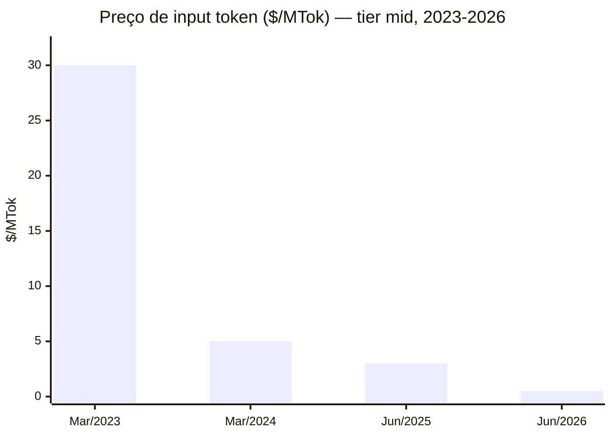
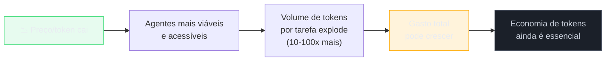

# O futuro — tokens cada vez mais baratos

> [!abstract] TL;DR
> O preço por token caiu ~100x entre 2023 e 2026, e a tendência continua. MoE, quantização, chips especializados, e competição entre providers aceleram a queda. Em 2027-2028, modelos mid-tier de hoje serão commodities ultrabaratas. Mas o volume de uso sobe ainda mais rápido — agentes consomem 10-100x mais tokens que chat. O gasto total pode SUBIR mesmo com preço por token caindo: o dev que gastava $0.25/dia em chat gasta $6/dia com agente. A economia de tokens continuará sendo essencial — não porque tokens ficam caros, mas porque volume escala sem limite.

## A queda de preço mais rápida na história da tecnologia

Imagine montar em 2024 uma planilha de orçamento de IA para os próximos 4 anos. Você projeta o gasto atual de $3.000/mês com API e assume, otimisticamente, que o preço cai pela metade a cada ano — então, em 2028, você esperaria pagar algo como $190/mês para o mesmo volume. A planilha real seria bem mais dramática: o preço por token do tier equivalente já caiu para uma fração de centavo, e o gasto mensal da empresa não caiu — subiu, porque o time passou a rodar agentes que processam 50x mais tokens que o chat manual de 2024. Uma projeção "conservadora" de queda de preço parece ridícula perto da curva real; e o orçamento que "parecia impossível" de tão baixo continua sendo insuficiente, porque o volume cresceu mais rápido ainda. Esse é o padrão-chave deste capítulo: preço por token e gasto total são duas curvas diferentes, e confundir uma pela outra é o erro de planejamento mais comum na área.

A deflação de preço de tokens não tem paralelo. Em comparação:

- Transistores (Lei de Moore): preço dividido por 2 a cada ~2 anos
- Armazenamento de disco: preço dividido por 2 a cada ~1.5 anos
- Tokens de LLM: preço dividido por ~10 a cada **12-18 meses** (2023-2026)



> [!warning] Caducidade — tabela abaixo tem prazo de validade curto
> Preços de token mudam em semanas, não em anos. As linhas até "Jun/2026" são dados observados na época da escrita desta nota; as linhas de 2027 e 2028 são **projeção, não fato** — extrapolação da tendência histórica, sujeita a desacelerar (limites físicos de hardware) ou acelerar (nova arquitetura, guerra de preços). Ao ler esta nota depois de 2026, trate os números como ilustração de ordem de grandeza, não como tabela de preços atual — confira o dashboard da Artificial Analysis (referências) para o valor vigente.

| Período | Modelo representativo | Input $/MTok | Variação |
|---|---|---|---|
| Mar/2023 | GPT-4 | $30.00 | Baseline |
| Mar/2024 | GPT-4o | $5.00 | -83% |
| Jun/2025 | Claude Sonnet 4.6 | $3.00 | -40% |
| Jun/2026 — mid | Claude Sonnet 4.6 | $3.00 | Estável |
| Jun/2026 — fast | Gemini Flash 2.0 | $0.50 | -83% vs Sonnet |
| Jun/2026 — nano | GPT-4.1 Nano | $0.10 | -97% vs GPT-4 |
| 2027 (projeção) | Tier mid | $0.50–1.00 | -67–83% vs hoje |
| 2028 (projeção) | Tier mid | $0.10–0.30 | -90–97% vs hoje |

A trajetória sugere que, em 2028, o mid-tier terá preço de hoje's nano-tier. Tasks que hoje custam $3/MTok custarão $0.10–0.30/MTok.

## Contextualizando: quanto caiu, quanto falta cair

Para entender a magnitude da deflação, é útil comparar com analogias de outras tecnologias. Em termos absolutos, o preço de input token caiu de $30/MTok em março/2023 para $0.10/MTok em modelos nano em junho/2026 — uma redução de 300x em 3 anos. Para ter a mesma redução em armazenamento de HDD, levou 15 anos.

A questão é: o que ainda falta cair para que tokens sejam "praticamente gratuitos"? A resposta depende do modelo:

```
Custo atual (Sonnet, junho 2026):    $3.00/MTok input
Custo projetado 2027 (mid-tier):     $0.50–1.00/MTok
Custo projetado 2028 (mid-tier):     $0.10–0.30/MTok

Para ter tokens "quase grátis" (~$0.01/MTok):
- 300x de queda ainda necessária
- Com a velocidade atual (10x por ano): ~2.5 anos (2028-2029)
- Mas a velocidade pode desacelerar à medida que chegamos à física do hardware
```

A tendência é clara — a velocidade da queda é incerta.

## Fatores que impulsionam a deflação

Cinco forças independentes convergem para reduzir o custo por token — e, ao contrário da maioria das reduções de custo tecnológico, todas operam ao mesmo tempo.

### 1. Mixture of Experts (MoE)

Modelos MoE ativam apenas um subconjunto de seus parâmetros por token (tipicamente 15-25% dos parâmetros totais). Um modelo de 200B parâmetros com MoE pode ter custo de computação equivalente a um modelo denso de 30-40B.

**Impacto:** modelos MoE de alta capacidade (GPT-4o, Mixtral, Gemini Ultra) têm custo de inferência muito menor que modelos densos de mesma performance. A tendência é que a maioria dos modelos top-tier migre para MoE.

### 2. Quantização INT4/INT8

Modelos em FP16/BF16 (precisão padrão) podem ser quantizados para INT8 ou INT4 com perda de qualidade mínima (1-3% em benchmarks comuns) e:
- 2-4x menos memória de GPU necessária
- 1.5-3x mais throughput (tokens por segundo por GPU)
- Possibilidade de rodar em hardware menor (e mais barato)

**Impacto:** providers conseguem servir mais tokens com o mesmo hardware, reduzindo custo unitário.

### 3. Chips especializados para inferência

- **Groq LPU:** latência de inferência 10-100x menor que GPUs, custo por token muito baixo
- **Google TPUs v5e/v6:** otimizados para inferência de transformers, disponíveis via Vertex AI
- **AWS Trainium/Inferentia:** chips proprietários da AWS para Bedrock
- **Silicon proprietário da Anthropic (projeto em andamento):** reduzir dependência de NVIDIA

**Impacto:** hardware especializado reduz custo de energia e latência, permitindo preços menores.

### 4. Competição global de providers

DeepSeek (China), Qwen (Alibaba), Mistral (França), e outras empresas lançam modelos comparáveis aos líderes ocidentais por custos de inferência significativamente menores. O efeito: Anthropic, OpenAI e Google são forçados a reduzir preços para manter market share.

**Impacto direto:** em 2025-2026, cada anúncio de modelo da DeepSeek foi seguido por cortes de preço dos providers americanos em dias.

### 5. Escala de operação

Com bilhões de tokens processados por dia, os providers atingem economias de escala que reduzem custo por token sem mudança de tecnologia. Mais usuários = melhor utilização de hardware = menor custo marginal.

## Como o hardware impulsiona a deflação

Por trás da queda de preço há uma cadeia de custos que reduz em cascata:

```
GPU VRAM (custo/GB) ↓
  → Modelos maiores rodam em hardware menor
     → Mais inferências por GPU
        → Menor custo por token

Throughput de GPU (tokens/segundo) ↑
  → Mais tokens por unidade de hardware por segundo
     → Menor custo por token

Chips especializados (TPU/LPU/Trainium) ↓
  → Inferência sem a margem de GPU de propósito geral
     → Menor custo por token
```

O Groq LPU (Language Processing Unit) demonstrou em 2025-2026 que é possível servir Llama 4 70B a latências de <10ms/token com custo de inferência 5-10x menor que GPU equivalente. Quando (e se) os grandes providers adotarem hardware especializado em escala, a deflação pode acelerar.

## O paradoxo do volume

A deflação de preço cria uma armadilha cognitiva: "tokens ficando mais baratos = custo cai". A realidade é mais sutil.



**Dados concretos:**

| Modo de uso | Tokens/dia típico | Custo/dia (Sonnet, 2026) |
|---|---|---|
| Chat manual (2023-2024) | 20K–50K | $0.06–$0.15 |
| Code assistant ativo | 200K–500K | $0.60–$1.50 |
| Agente de desenvolvimento | 1M–3M | $3.00–$9.00 |
| Agente agressivo com multiagent | 5M–15M | $15–$45 |

O dev que gastava $0.25/dia em 2024 com chat pode gastar $15/dia em 2026 com agente agressivo — mesmo com preço por token 6x menor. O volume cresceu 60x.

## O que muda e o que não muda

| O que muda | O que NÃO muda |
|---|---|
| Preço por token cai continuamente | Output continua sendo ~5x mais caro que input |
| Modelos mid-tier viram commodity | Flagship sempre terá premium sobre mid-tier |
| Contexto maior fica mais barato | Contexto irrelevante ainda dilui qualidade |
| Modelos mais rápidos e capazes | Trade-off custo/qualidade permanece |
| Acesso a modelos open-source melhora | Custos de operação de infra própria persistem |
| Mais providers, mais opções de routing | Vendor lock-in em tooling permanece como risco |

## A curva de adoção e o efeito na demanda

A deflação de preço não existe no vácuo — ela interage com a curva de adoção. À medida que tokens ficam mais baratos, novos casos de uso surgem que antes não eram economicamente viáveis:

```
2023 ($30/MTok): só casos de alto valor (análise jurídica, research)
2024 ($5/MTok):  code review, debugging, documentação
2025 ($3/MTok):  agentes de desenvolvimento, CI/CD com IA
2026 ($0.50/MTok): agentes autônomos, análise de dados em escala, edge inference
2027 ($0.10/MTok): aplicações de consumo em escala, processamento em lote de datasets inteiros
2028 ($0.03/MTok): IA embutida em qualquer aplicação como utilitário
```

Cada nível de preço desbloqueia um novo conjunto de aplicações. E cada nova aplicação gera demanda adicional de tokens — acelerando a necessidade de infraestrutura e, paradoxalmente, sustentando o mercado mesmo com preços caindo.

O modelo econômico aqui é similar ao da eletricidade: o preço por kWh caiu ~100x no século XX, mas a demanda total de eletricidade subiu ~1000x. Tokens seguirão trajetória similar.

## Implicações para otimização hoje

A deflação de tokens muda o valor relativo de cada técnica do playbook:

| Técnica | Hoje (2026) | Em 2028 |
|---|---|---|
| Prompt caching | Alto impacto | Impacto menor (input mais barato) |
| Context pruning | Alto impacto | Impacto menor |
| Model routing | Altíssimo impacto | Impacto menor (flagship mais acessível) |
| Respostas concisas | Alto impacto | Impacto persistente (output sempre mais caro) |
| Thinking budget | Alto impacto | Impacto persistente (thinking = output) |
| Kill switches | Essencial | Mais essencial (agentes mais autônomos) |
| Semantic caching | Médio impacto | Médio (custo de embedding pode cair também) |

**Conclusão:** as técnicas que controlam output tokens e volume de chamadas (concisão, thinking budget, kill switches) terão ROI crescente à medida que input tokens ficam baratos mas output tokens mantêm premium. As técnicas de redução de input (caching, pruning) terão ROI decrescente — mas ainda positivo, especialmente em escala.

## Armadilhas comuns

> [!warning] "Tokens vão ser grátis, não preciso otimizar"
> O volume de uso escala mais rápido que a queda de preço. Agentes autônomos de 2027-2028 processarão 10-100x mais tokens que os de hoje. A economia de tokens não se torna irrelevante — ela se torna mais crítica, aplicada a volumes maiores.

> [!warning] "Vou esperar tokens ficarem mais baratos antes de adotar IA"
> A vantagem competitiva de dominar agentes AGORA supera qualquer economia de esperar. Times que desenvolvem fluência com agentes em 2026 terão anos de vantagem sobre os que esperarem. O custo é o custo de aprendizado, não só de tokens.

> [!warning] Projeções lineares em mercado não-linear
> O preço pode estagnar temporariamente (suprimento de hardware limitado, concentração de mercado) ou cair mais rápido que o esperado (breakthrough tecnológico, entrada de competidor). Projeções de preço de tokens têm incerteza alta — não tome decisões de arquitetura assumindo um número específico em 2028.

> [!warning] Ignorar custos de orquestração e operação
> O preço de tokens é o custo mais visível, mas não o único. Custos de operação de sistemas de agentes incluem: latência (tempo de engenheiro esperando resposta), custos de observabilidade (logging de 15M tokens/dia), custos de retry e error handling, e custo de revisão humana dos outputs. Esses custos não deflacionam na mesma velocidade.

> [!info] Caducidade — "Estado da arte" é um retrato, não uma previsão confiável
> A seção abaixo descreve o estado do mercado no momento em que esta nota foi escrita. O parágrafo sobre GPT-5 e Claude 5 é **especulação explícita** baseada em padrões históricos de lançamento — não há garantia de que esses modelos existirão com esses nomes, nesses prazos, ou com essa estrutura de preço. Trate como um exercício de raciocínio ("se o padrão histórico se mantiver, então...") e não como um roteiro. Ao reler esta nota mais tarde, o valor está no *raciocínio* sobre como preço e capacidade normalmente se movem juntos — não nos números específicos.

## Estado da arte — junho 2026

**Open-source alcançando closed-source:** Em 2025-2026, modelos open-source (Llama 4, Qwen 3, Gemma 3) alcançaram quality comparable ao GPT-4o e Claude Sonnet em muitos benchmarks. Para quem opera própria infra, isso significa: custo de token próximo de zero (só hardware), mas custo de operação e manutenção não trivial. A equação closed-source vs self-hosted tornou-se mais competitiva.

**Especulação sobre GPT-5 e Claude 5:** As gerações de modelos flagship esperadas para 2026-2027 (GPT-5, Claude 5) projetam saltos de capacidade similares aos vistos em gerações anteriores — com um padrão onde o novo flagship substitui o anterior no preço do tier mid. O que hoje custa $75/MTok (Opus) pode custar $3-5/MTok em 18-24 meses. **Importante:** isso é extrapolação de um padrão passado (novo flagship → antigo flagship vira mid-tier em preço), não uma previsão pontual. Se o padrão de lançamento mudar (ex: providers pararem de descontinuar gerações antigas, ou a corrida de capacidade desacelerar), a equação muda junto.

Por que esse padrão se repete historicamente? Cada novo flagship é treinado com mais dados e compute, mas serve num hardware de inferência que também melhorou (chips mais novos, quantização mais madura). O resultado é que o provider consegue cobrar menos pelo modelo anterior — que já pagou seu custo de P&D — para posicioná-lo como "tier mid" e usar a margem para financiar o próximo salto. É o mesmo mecanismo de descida de preço que aconteceu com Opus 3 → Sonnet 4.6: o antigo topo de linha vira o "bom o suficiente" de amanhã. Isso não é garantia de que GPT-5 e Claude 5 seguirão exatamente esse roteiro — é a aposta mais razoável dado o histórico, e nada mais que isso.

**Edge inference:** Em 2026, modelos pequenos (1-7B parâmetros) rodam diretamente em dispositivos — laptops, smartphones, sistemas embarcados. Para tasks simples (classificação, extração de dados, formatação), o custo pode ser literalmente zero (local, sem chamada de API). Isso cria uma nova camada de routing: local (zero custo) → API barata → API cara.

**Como pensar sobre essas três tendências juntas:** open-source, especulação de flagship e edge inference não são fenômenos isolados — são três frentes da mesma pressão de deflação. Open-source aperta o preço por baixo (força providers a competir com algo quase-grátis). Flagship caro virando mid-tier aperta por cima (o topo de linha de ontem passa a ser commodity). E edge inference remove uma fatia inteira do volume da equação (tasks simples nem chegam a virar chamada de API). Um consultor de sistemas legados que precisa decidir onde investir hoje deve perguntar: essa task específica está mais perto de qual das três frentes — e onde ela estará em 12 meses?

## Casos práticos

**Caso 1 — Team que apostou em agentes cedo (2024) vs late adopters (2026):** Um time adotou agentes em 2024, quando tokens custavam mais. Pagaram $500/mês em tokens no primeiro mês, mas construíram fluência, pipelines, e prompts otimizados. Em 2026, com tokens mais baratos, seu custo de $500/mês de 2024 cobre 3x mais tokens — e o time está 18 meses à frente em produtividade. O time que esperou ficou barato no curto prazo e atrás no médio prazo.

**Caso 2 — Deflação mudando a decisão de routing:** Em 2024, routing entre Haiku e Sonnet tinha impacto de 20x no custo (Haiku: $0.25/MTok vs Sonnet: $3/MTok). Em 2026, Gemini Flash entrou no mercado a $0.50/MTok — e Gemini Ultra a $2.50/MTok. O gap fechou, e a decisão de routing ficou menos binária: um modelo "bom o suficiente" para 80% das tasks custa só 5x menos que o melhor. O ROI de routing diminuiu, mas continua positivo.

**Caso 3 — Self-hosted como alternativa:** Uma empresa de médio porte calculou: usar Claude Sonnet API custava $3.000/mês para o volume deles. Rodar Llama 4 70B em 4× A100 alugadas custaria ~$2.400/mês em compute, com qualidade similar em 85% dos casos. A diferença: zero custo variável por token no self-hosted, mas custo fixo de infra e time de manutenção. Após análise completa, API ganhou por conta da simplicidade — mas a margem diminuiu.

**Caso 4 — Edge inference para pré-triagem:** Uma startup de atendimento ao cliente implementou Llama 3.2 3B local (rodando no servidor da empresa, sem API call) para classificar intenção de mensagem. De 1.000 mensagens/dia, 600 iam para o modelo local (zero custo de API) e só 400 escalavam para Claude Sonnet na API. Resultado: custo de tokens -60%, latência do modelo local <200ms.

**Caso 5 — Consultoria de legado recalculando o ROI de migração assistida por IA:** Um consultor avaliou, em 2024, migrar um monólito Java legado usando agentes de IA para gerar testes de caracterização antes do refactor. Na época, o orçamento de tokens ($3/MTok input, volume estimado de 20M tokens para o projeto) tornava a proposta cara demais para o cliente aprovar — cerca de $60 só de input. Em 2026, o mesmo projeto, com roteamento para um modelo mid-tier a $0.50/MTok, custaria $10 de input para o mesmo volume de análise — mas o volume real também mudou: o consultor agora roda os agentes com mais iterações de verificação (volume 4x maior, ~80M tokens), porque ficou barato o suficiente para não precisar economizar em cobertura de teste. O custo final ficou parecido em dólares absolutos, mas a qualidade da migração (cobertura de teste, detecção de regressão) subiu substancialmente — o dinheiro que antes ia para "menos chamadas por economia" foi redirecionado para "mais chamadas por rigor". É o paradoxo do volume aplicado a uma decisão de arquitetura concreta: o preço caiu, mas o padrão de trabalho absorveu a folga em qualidade, não em economia.

## Checklist: preparando-se para o futuro

- [ ] Acompanhar tabela de preços de providers mensalmente (Artificial Analysis tem dashboard)
- [ ] Testar novos modelos quando lançados — qualidade pode superar o tier anterior por preço menor
- [ ] Implementar routing multi-provider hoje (LiteLLM, Portkey) para trocar sem reescrita
- [ ] Avaliar edge inference para tasks simples quando volume justificar
- [ ] Não tomar decisões de arquitetura baseadas em preços específicos de 2028 — incerteza é alta
- [ ] Manter playbook de economia atualizado à medida que o landscape muda

## O que vem a seguir

Com uma visão do futuro econômico dos tokens, a perspectiva prática é ver como tudo isso se aplica a um caso real — ferramentas concretas usadas por desenvolvedores hoje, com os hacks específicos de cada plataforma. [[21 - Hacks de trincheira — Claude, Gemini e Copilot em 2026]] cobre o estado da arte das ferramentas de developer AI em junho de 2026.

## Como explicar em inglês

**Token price deflation** é o termo mais usado em inglês. **Inference cost reduction** é mais técnico e abrange o processo que leva à deflação.

| Português | Inglês | Contexto de uso |
|---|---|---|
| Deflação de tokens | Token price deflation | Queda consistente do preço por token |
| Paradoxo do volume | Volume paradox | Volume cresce mais rápido que o preço cai |
| Inferência em edge | Edge inference | Modelos rodando localmente sem chamada de API |
| Quantização | Quantization | Redução de precisão numérica de modelos |
| Mistura de especialistas | Mixture of Experts (MoE) | Arquitetura que ativa parcialmente os parâmetros |
| Custo de operação | Operational cost / OpEx | Custo de rodar o sistema além dos tokens |
| Modelo commodity | Commodity model | Modelo amplamente disponível sem diferencial de custo |
| Deflação de preço | Price deflation | Queda sustentada de preço por unidade |
| Tier mid / flagship | Mid-tier / Flagship model | Categorias de capacidade e preço de modelos |
| Routing multi-provider | Multi-provider routing | Direcionar requests para diferentes providers conforme custo |

> [!tip] Veja: The Economics of AI — Why Token Prices Keep Falling
> **Canal:** Dwarkesh Patel / AI Forecasting | **Duração:** ~45min | **Idioma:** EN
>
> Análise econômica profunda da deflação de tokens — hardware, escala, competição, e o papel do open-source na pressão sobre preços. Inclui projeções de custo baseadas em trajetórias de hardware e volume de uso, com perspectiva histórica comparando a outras tecnologias transformadoras.
>
> 🎬 [Assistir no YouTube](https://youtube.com/results?search_query=AI+token+economics+price+deflation+2026)

## Veja também

- [[01 - O problema — por que tokens custam dinheiro]] — o baseline que a deflação está reduzindo
- [[09 - Model routing — modelo certo para a tarefa]] — routing evolui conforme preços mudam
- [[19 - Planos e tiers — Max, Pro, API, Enterprise]] — decisões de plano afetadas pela deflação
- [[21 - Hacks de trincheira — Claude, Gemini e Copilot em 2026]] — estado atual das ferramentas

## Fontes

- **Artificial Analysis** — *LLM Price Tracking Dashboard* ([artificialanalysis.ai/models](https://artificialanalysis.ai/models), acessado 2026). Dados históricos de preço por token de todos os providers — atualizado regularmente, com séries temporais desde 2023.
- **Benedict Evans** — *AI Costs and Scaling* ([ben-evans.com](https://www.ben-evans.com/), acessado 2026). Análise econômica de longo prazo — parallelos com outras tecnologias transformadoras e implicações para adoção.
- **Vipul Naik** — *LLM API Price Tracking* ([github.com/vipulnaik](https://github.com/vipulnaik), acessado 2026). Perfil GitHub com repositórios de histórico de preços de API de LLMs — fonte primária para a tabela de deflação desta nota. **Nota de proveniência:** não foi possível confirmar o path exato de um repositório específico de price-tracking neste perfil; o link aponta para o perfil GitHub, verificado ativo.
- **SemiAnalysis** — *The Inference Cost Revolution* ([semianalysis.com](https://semianalysis.com/), acessado 2025-2026). Análise técnica dos drivers de redução de custo de inferência — MoE, quantização, chips especializados e suas contribuições relativas.
