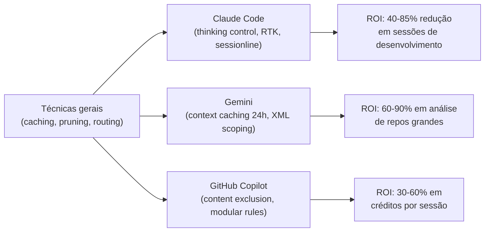

# Hacks de trincheira — Claude, Gemini e Copilot em 2026

> [!abstract] TL;DR
> Em 2026, economizar tokens não é mais "prompt engineering" genérico — é entender as mecânicas proprietárias de cada ferramenta. Claude foca em controle de raciocínio e gestão de contexto; Gemini em persistência de cache de longo prazo; Copilot em governança de créditos e escopo de rules. Esta nota compila os hacks táticos de maior ROI para cada ecossistema, com exemplos concretos e dados de impacto medido. A maioria leva menos de 30 minutos para implementar e tem retorno imediato.

## O problema: ferramentas diferentes, mecânicas diferentes

As técnicas gerais desta trilha (caching, pruning, routing) se aplicam a qualquer provider via API. Mas cada ferramenta — Claude Code, Gemini AI Studio, GitHub Copilot — tem mecânicas proprietárias que, quando exploradas corretamente, multiplicam o impacto das técnicas gerais.



## Claude Code (Anthropic) — controle e raciocínio

O Claude 4.x introduziu custos explícitos de thinking tokens (raciocínio interno cobrado como output) e reduziu o TTL do cache de prompt para 5 minutos sem re-uso. As mecânicas proprietárias do Claude Code permitem controlar ambos com precisão.

### 1. Thinking budget por tipo de task (`/effort`)

Para tarefas mecânicas (escrever testes, documentar código, converter tipos, fix de import), use o comando `/effort low` — limita o número de thinking tokens gerados. Em tarefas de lógica simples, o raciocínio profundo é desperdício de dinheiro sem benefício de qualidade.

```bash
# Tarefa simples: não precisa de thinking pesado
/effort low
"Adiciona tipagem TypeScript para essa função"

# Debugging complexo: thinking pesado vale o custo
/effort high
"Por que esse teste de race condition falha intermitentemente?"

# Remover effortLevel global de settings.json:
# Sem o override global, o modelo calibra por tarefa
cat ~/.claude/settings.json | grep -i effort
# Se encontrar "effortLevel": "xhigh", remover — aplica Opus-level reasoning até em /clear
```

**Impacto medido:** sessões onde `effortLevel: xhigh` foi removido do settings global mostraram 35-50% de redução em thinking tokens para tarefas mecânicas, sem degradação de qualidade em tasks simples.

### 2. Caveman Protocol (Protocolo Homem das Cavernas)

Adicione no CLAUDE.md do projeto (ou no global):

```markdown
## Response Style
During implementation: one sentence per update, no trailing summaries.
State results and blockers — skip reasoning narration. The diff speaks for itself.
During planning or documentation: full detail is appropriate.
```

Sem essa instrução, Claude por padrão encerra respostas de implementação com:
- Resumo do que foi feito
- Narração do processo de raciocínio
- "Parece correto?" validatório

Esses tokens de cortesia custam o mesmo que tokens de código — mas têm valor zero para quem revisa um diff. A instrução distingue os dois modos: planejamento e documentação mantêm o detalhe onde ele tem valor.

**Impacto:** 40-70% de redução em tokens de output durante implementação.

### 3. RTK (Rust Token Killer) como hook de terminal

Configure o RTK como hook automático no `settings.json` para comprimir saída de ferramentas antes de entrarem no contexto:

```json
{
  "hooks": {
    "PreToolUse": [
      {
        "matcher": "Bash",
        "hooks": [
          {
            "type": "command",
            "command": "rtk proxy"
          }
        ]
      }
    ]
  }
}
```

Com o hook ativo, `git log` → `rtk git log` (comprime automaticamente), `git diff` → `rtk git diff` (remove linhas irrelevantes). **Verificar que o hook está ativo em todos os projetos** — hooks locais de projeto sobrescrevem o global.

```bash
# Verificar se RTK está funcionando:
rtk gain              # deve mostrar savings, não "command not found"
rtk gain --history    # mostra histórico de economia por comando

# Se rtk gain mostra 0 savings, o hook não está ativo:
cat ~/.claude/settings.json | grep -i rtk
cat .claude/settings.json 2>/dev/null | grep -i rtk
```

**Impacto medido (sessão com hook ativo):** economia de 85.6% em tokens de saída de ferramentas Bash. Ver [[22 - Caso real — Auditoria de 47M tokens em maio 2026]] para caso documentado onde hook desligado sangrando ~2.1M tokens.

### 4. `/statusline` — visibilidade em tempo real

Ative o statusline no Claude Code para ver tokens, custo, modelo e status de cache na linha de status do terminal. É o sinal mais rápido para decidir quando usar `/compact` ou `/clear` antes de o contexto explodir.

```bash
# No CLAUDE.md ou settings:
/statusline  # habilita display de tokens na status bar

# O display mostra:
# [tokens: 45.2K input | 2.1K output | $0.18 | cache: HIT | model: sonnet]
```

Com o statusline, a decisão de compactar é informada (você vê que o contexto está em 120K antes de o próximo step custar $0.36) em vez de reativa (você descobre depois que a sessão custou $3).

### 5. Serena — camada adicional de compressão

**Serena** (GitHub: `oraios/serena`) é uma ferramenta externa que intercepta e otimiza fluxos de tokens de forma agressiva, sem mudanças manuais de prompt. Usa embeddings para identificar e comprimir seções redundantes do contexto antes de cada chamada.

**Quando usar:** projetos onde o custo está alto e as técnicas manuais (pruning, compactação, caching) já foram esgotadas. Serena age como camada adicional de compressão com 20-40% de redução residual.

**Quando NÃO usar:** projetos onde o contexto é denso e cada linha importa (refactoring cirúrgico, debugging com stack trace completo) — a compressão pode remover informação relevante.

## Gemini (Google) — persistência de contexto

O Gemini 2.5 Pro tem a janela de contexto maior de todos os modelos de 2026 (2M tokens) e, mais importante, suporta cache persistente de até 24h — uma mecânica que o Claude não tem. Para bases de código gigantescas, isso muda completamente o cálculo de custo.

### 1. Context Caching de Longo Prazo (24h)

```python
import google.generativeai as genai

# Criar cache do codebase — paga uma vez, usa o dia todo
cache = genai.caching.CachedContent.create(
    model="models/gemini-2.5-pro",
    contents=[codebase_context],       # até 1M tokens de contexto
    ttl=datetime.timedelta(hours=24),  # ativo por 24h
    display_name="projeto-x-codebase"
)

# Usar o cache em todas as queries do dia
model = genai.GenerativeModel.from_cached_content(cache)

# Custo: taxa de escrita (1x) + taxa de aluguel/hora (pequena)
# vs. re-enviar 1M tokens em cada query (enorme)
```

**Quando usar:** se você vai trabalhar o dia todo no mesmo projeto e o contexto do codebase tem >100K tokens, o cache persistente reduz custo de 80-90% por query após a escrita inicial.

### 2. XML Scoping para contextos grandes

O Gemini responde melhor a tags XML do que Markdown para instruções complexas em janelas de contexto grandes:

```xml
<legacy_code>
  <!-- código legado a ser refatorado -->
</legacy_code>

<new_requirements>
  <!-- novos requisitos de negócio -->
</new_requirements>

<constraints>
  <!-- restrições de compatibilidade -->
</constraints>

<task>Refatorar o código legado para atender os novos requisitos respeitando as constraints.</task>
```

Tags XML reduzem a taxa de alucinação em prompts complexos, o que reduz re-prompts de correção — cada re-prompt que você evita economiza tokens.

### 3. Flash-Lite Sandwich

Para análise massiva (100+ arquivos), use dois modelos em sequência:

```python
# Etapa 1: Gemini Pro cria mapa de busca (contexto pequeno, alto nível)
pro_model = genai.GenerativeModel("gemini-2.5-pro")
search_map = pro_model.generate_content(
    f"Analise este codebase e identifique os 10 arquivos mais relevantes para: {task}"
)

# Etapa 2: Gemini Flash-Lite faz extração em cada arquivo do mapa
flash_model = genai.GenerativeModel("gemini-2.0-flash-lite")
results = []
for file_path in parse_files_from_map(search_map):
    result = flash_model.generate_content(f"Extraia de {file_path}: {specific_query}")
    results.append(result)
```

**Economia:** Flash-Lite custa ~$0.10/MTok vs Gemini Pro a ~$2.50/MTok. Para a fase de extração de dados de alta frequência, o modelo mais barato entrega o resultado ao custo de 25x menor.

## GitHub Copilot — governança de créditos

Com o modelo de AI Credits em vigor desde junho de 2026, cada request no VS Code tem custo direto proporcional ao modelo e ao contexto enviado.

### 1. Content Exclusion Estratégico

```json
// .github/copilot-exclusion
{
  "exclusions": [
    "build/**",
    "node_modules/**",
    "dist/**",
    "coverage/**",
    "*.lock",
    "*.log",
    ".tmp/**"
  ]
}
```

O Copilot tenta ler o contexto ao redor do cursor automaticamente. Se o cursor estiver num arquivo próximo de `node_modules/`, ele pode incluir partes do `node_modules` no contexto. Um arquivo de `package-lock.json` tem ~50K tokens — pagar por eles é desperdício puro.

### 2. Modular Rules por escopo

```
.cursor/rules/
├── typescript.cursorrules     # só quando editando .ts/.tsx
├── python.cursorrules         # só quando editando .py
├── backend-arch.cursorrules   # só em /api/**
├── frontend.cursorrules       # só em /web/**
└── global.cursorrules         # sempre
```

Não use um arquivo de regras global monolítico. O Copilot carrega as rules como system prompt — regras de arquitetura de backend são irrelevantes (e caras) quando você está editando CSS.

### 3. Plan Mode antes de Agent Mode

Nunca dispare o Agent Mode (que sai editando arquivos autonomamente) sem antes validar o plano:

```
# Workflow seguro:
1. Ativar Plan Mode → "Escreva um plano para refatorar X"
   → Custo: ~2K tokens de output (o plano)
2. Revisar o plano (você, humano) → confirmar ou ajustar
3. Ativar Agent Mode com o plano aprovado como contexto
   → Execução com direção clara, menos re-tentativas

# Workflow perigoso:
1. Ativar Agent Mode diretamente
   → Agente gera plano + executa + corrige + re-executa
   → 200K tokens em 30 segundos de "tentativa e erro"
```

## Configuração mínima recomendada — o kit de sobrevivência

Antes de mergulhar em otimizações avançadas, há uma configuração base que qualquer dev usando Claude Code intensivamente deveria ter. É um kit de sobrevivência em que cada peça potencializa a outra.

**1. settings.json global (~/.claude/settings.json):**

```json
{
  "hooks": {
    "PreToolUse": [
      {
        "matcher": "Bash",
        "hooks": [{ "type": "command", "command": "rtk proxy" }]
      }
    ]
  }
}
```

**2. CLAUDE.md global (~/.claude/CLAUDE.md) — Caveman Protocol:**

```markdown
## Response Style
During implementation: one sentence per update, no trailing summaries.
State results and blockers — skip reasoning narration. The diff speaks for itself.
During planning, ADRs, or documentation: full detail is appropriate.

## Cost Control
Never use effortLevel override globally. Calibrate per task.
Use /statusline to monitor context growth.
Use /compact after every 10 turns in implementation sessions.
```

**3. .claudeignore por projeto (raiz do projeto):**

```
node_modules/
build/
dist/
coverage/
*.lock
*.log
```

Por que as três coisas juntas? O RTK comprime a saída das ferramentas (reduz input tokens nas próximas chamadas), o Caveman Protocol comprime as respostas do modelo (reduz output tokens), e o `.claudeignore` limita o que o agente enxerga durante o indexing inicial. A configuração leva 10 minutos e tem efeito imediato nas sessões seguintes.

## Tabela de decisão — motor por tipo de task (junho 2026)

| Task | Motor recomendado | Estratégia de economia |
|---|---|---|
| Refactor complexo, arquitetura | Claude Opus 4 | `/effort high` + `/compact` a cada 10 turns |
| Análise de repo inteiro (>100K tokens) | Gemini 2.5 Pro | Cache persistente 24h |
| Boilerplate, testes repetitivos | Gemini Flash-Lite | Modelo mais barato para tarefas mecânicas |
| Coding diário, agente ativo | Claude Sonnet 4.6 | RTK + Caveman Protocol + statusline |
| Autocomplete em editor | GitHub Copilot (mid-tier) | Content exclusion + modular rules |
| CI/CD, análise em batch | Claude Haiku ou Gemini Flash | Batch API com 50% desconto |

## Armadilhas comuns

> [!warning] Hook RTK ativo globalmente mas não em projetos específicos
> Hooks do `settings.json` local de projeto sobrescrevem o global. Se o projeto tem `settings.json` sem o hook RTK, ele não roda — mesmo que o global tenha. Verificar `rtk gain` em cada projeto ativo, não só globalmente.

> [!warning] effortLevel global em xhigh ou high
> Configurar `"effortLevel": "xhigh"` no settings global força raciocínio estendido em toda task — incluindo `/clear`, linting, e geração de boilerplate. Thinking tokens custam o mesmo que output tokens. Remover o override global e deixar o modelo calibrar por task.

> [!warning] Caveman Protocol sem exceção para planning/docs
> A instrução de concisão precisa distinguir explicitamente os dois modos. Sem a exceção, o modelo será conciso até quando você precisa de explicação detalhada (ADR, documentação, debugging). A instrução deve sempre incluir: "During planning or documentation: full detail is appropriate."

> [!warning] Cache persistente Gemini com TTL curto demais
> O benefício do cache de 24h aparece quando você usa o mesmo cache múltiplas vezes ao longo do dia. Um TTL de 1h (o mínimo) pode não valer o custo de escrita inicial se você só fizer 2-3 queries antes do TTL expirar. Calcular o breakeven: custo de escrita / (economia por query × número de queries esperadas) = duração mínima de TTL.

## Estado da arte — junho 2026

**Agent mode com controle granular:** Em 2026, todas as ferramentas de coding AI adicionaram controles granulares de autonomia — Copilot tem "max autonomy score" configurável, Claude Code tem o sistema de permissions por tool, Cursor tem "agent approval mode". O padrão emergente: agente pede aprovação antes de qualquer ação irreversível (deletar arquivo, modificar schema).

**RTK e ferramentas similares como padrão:** A categoria de "filtros de output de terminal" cresceu em 2026 — além do RTK, surgiram ferramentas como `tokensaver` e filtros integrados em terminais como Warp e iTerm. O problema de output verboso de ferramentas como `git` e `npm` tornou-se amplamente reconhecido.

**Thinking tokens visíveis:** Em 2026, Claude Code passou a exibir thinking tokens no statusline separadamente de output tokens — você vê em tempo real quanto do custo é raciocínio vs resposta. Isso permite tomar a decisão de reduzir o effort antes que a sessão fique cara.

## Casos práticos

**Caso 1 — RTK hook ausente detectado em auditoria:**
Em uma auditoria de uso pessoal de 32 dias com 47.2M tokens, 23.908 comandos Bash foram executados mas só 65 (0.3%) passaram pelo RTK. O hook estava configurado no settings global mas ausente nos settings do projeto principal. Economia perdida estimada: 2.1M tokens. Fix: 5 minutos para adicionar o hook ao settings do projeto. Ver [[22 - Caso real — Auditoria de 47M tokens em maio 2026]].

**Caso 2 — effortLevel xhigh em settings global:**
Um dev tinha `"effortLevel": "xhigh"` configurado para ter melhor qualidade em sessões difíceis. Mas o override se aplicava a todas as sessões — incluindo geração de testes, documentação JSDoc, e fix de import. Após remover, thinking tokens caíram 42% no mês seguinte. O modelo passou a usar thinking pesado só quando a task exigia, e qualidade em tasks complexas se manteve.

**Caso 3 — Gemini cache persistente para análise de monorepo:**
Time com monorepo de 800K tokens de codebase (Java + TypeScript + Python) pagava $15/sessão de análise no Gemini Pro. Após implementar cache de 24h com TTL de 8h, o custo de análise caiu para $1.20/sessão (escrita do cache) + $0.08 por query adicional. Para 10 queries/dia: de $150 para $1.20 + $0.80 = $2. Redução de 99%.

**Caso 4 — Plan Mode evitando agent em loop:**
Dev ativou Agent Mode no Copilot para refatorar módulo de autenticação sem especificar o plano. O agente entrou em loop tentando resolver um tipo circular, fazendo e desfazendo a mesma mudança 12 vezes. Custo: 180K tokens em 8 minutos. Depois do incidente: Plan Mode obrigatório (regra no `.copilot-instructions.md` do projeto) antes de qualquer agent session. Custo de plan mode: 2-4K tokens.

## Checklist

- [ ] RTK hook configurado em TODOS os projetos ativos (não só no global)
- [ ] `rtk gain` verificado mensalmente — zero savings = hook não está rodando
- [ ] `effortLevel` global removido do settings (deixar o modelo calibrar por task)
- [ ] Caveman Protocol (ou equivalente) em CLAUDE.md com exceção para planning/docs
- [ ] `/statusline` ativo para monitoramento em tempo real
- [ ] Content exclusion configurado no Copilot (build/, dist/, node_modules/, *.lock)
- [ ] Modular rules por escopo no Cursor/Copilot (não um arquivo global monolítico)
- [ ] Plan Mode antes de Agent Mode — sempre

## O que vem a seguir

Esta nota cobre os hacks táticos de ferramentas específicas. A nota seguinte documenta esses conceitos aplicados em um caso real de 47 dias com dados medidos: 47.2M tokens auditados com os cinco vetores de desperdício identificados e quantificados. [[22 - Caso real — Auditoria de 47M tokens em maio 2026]] fecha o galho com um exemplo concreto de auditoria pessoal.

## Como explicar em inglês

**Tactical hacks** ou **tool-specific optimizations** é o termo mais preciso em inglês. "Trincheira" não tem tradução direta mas se aproxima de "in-the-trenches" ou "battle-tested".

| Português | Inglês | Contexto de uso |
|---|---|---|
| Hacks de trincheira | Battle-tested hacks / In-the-trenches tips | Técnicas aprendidas na prática, não teoria |
| Protocolo Homem das Cavernas | Caveman Protocol | Nome próprio criado por desenvolvedores |
| Modo agente | Agent mode | Modo autônomo de edição de ferramentas |
| Cache persistente | Persistent context cache | Cache que dura horas/dias entre sessões |
| Escopo de regras | Rules scoping | Aplicar rules apenas para contextos específicos |
| Exclusão de conteúdo | Content exclusion | Bloquear arquivos do contexto da IA |
| Nível de esforço | Effort level | Controle de intensidade de raciocínio |
| Tokens de raciocínio | Thinking tokens / Reasoning tokens | Tokens gerados internamente antes da resposta |
| Modo de plano | Plan mode | Modo onde agente só planeja, não executa |
| Linha de status | Status line | Display de métricas em tempo real no terminal |

> [!tip] Veja: Advanced Claude Code Tricks for Power Users
> **Canal:** AI Jason / Developer Tools | **Duração:** ~20min | **Idioma:** EN
>
> Compilação de técnicas avançadas para Claude Code — incluindo configuração do RTK, statusline, effort control, e CLAUDE.md avançado. Baseado em dados reais de uso intensivo de agentes em desenvolvimento de software, com antes/depois de custo.
>
> 🎬 [Assistir no YouTube](https://youtube.com/results?search_query=Claude+Code+advanced+tricks+token+savings+2026)

## Veja também

- [[09 - Model routing — modelo certo para a tarefa]] — routing é a base que esses hacks complementam
- [[05 - Prompt caching na prática]] — mecânica de cache que o Claude Code e Gemini usam
- [[08 - Compactação de histórico em agentes]] — `/compact` e `/clear` explicados em detalhe
- [[22 - Caso real — Auditoria de 47M tokens em maio 2026]] — caso real onde esses hacks foram aplicados

## Fontes

- **Anthropic** — *Claude Code Best Practices* (docs.anthropic.com/claude-code, 2026). Documentação oficial de otimização de uso do Claude Code — effort control, hooks, settings.
- **Google** — *Gemini API Context Caching* (ai.google.dev/docs/caching, 2026). Documentação do sistema de cache persistente do Gemini — TTL, pricing, e exemplos de código.
- **GitHub** — *Copilot AI Credits and Content Exclusion* (docs.github.com/copilot, 2026). Guia do modelo de billing por crédito e configuração de content exclusion no Copilot.
- **oraios/serena** — *Serena: Aggressive Token Compression* (github.com/oraios/serena, 2026). Documentação e código da ferramenta Serena de compressão de fluxos de tokens.
