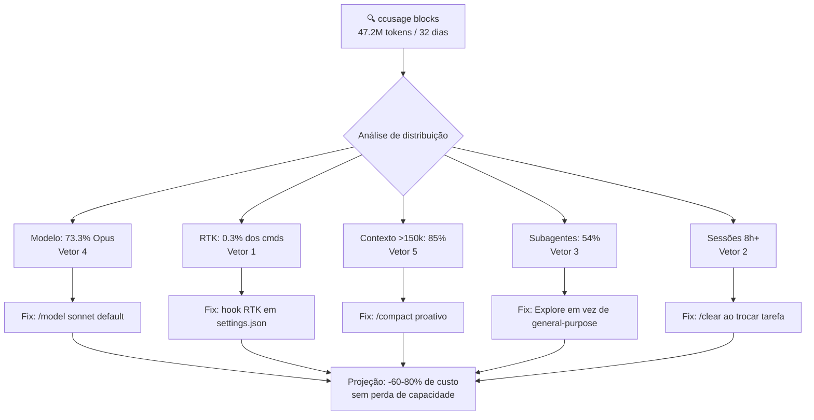

# Caso real — Auditoria de 47M tokens em maio 2026

> [!abstract] TL;DR
> Auditoria de uso pessoal em maio de 2026: **47.2M tokens em 32 dias, 73.3% em Opus 4.7**. Cinco vetores de gasto identificados via `ccusage blocks` e `rtk gain`: hook RTK desligado em quase todas as sessões (sangrando ~2.1M tokens), sessões de 8h+ sem `/clear`, abuso de subagentes `general-purpose` em buscas simples, default invertido para Opus em vez de Sonnet, e contexto >150k em 85% do uso. A anomalia mais cara foi também a mais fácil de corrigir: reativar o hook RTK no `settings.json` levou 5 minutos e tem impacto direto e mensurável. Essa auditoria é uma prova de que monitoramento não pode ser evento — precisa ser cadência mensal.

## Por que documentar uma auditoria pessoal?

A maioria das notas desta trilha descreve técnicas em abstrato. Esta fecha com o oposto: um diagnóstico real, com números reais, mostrando o que acontece quando as técnicas não são aplicadas.

Todo dev que usa IA intensivamente vai passar pela mesma surpresa em algum momento: a fatura cresce, os tokens acumulam, e a causa não é óbvia. O valor desta nota não é nos números específicos — é no processo de diagnóstico e no padrão dos vetores encontrados. Os cinco vetores aqui provavelmente aparecem, em diferentes proporções, em qualquer uso intensivo de Claude Code.

Há também um valor de calibração: saber que 47.2M tokens em 32 dias representa uso intenso mas não excepcional (grande parte é duplicação evitável), e que a distribuição saudável seria ~30% Opus / ~65% Sonnet / ~5% Haiku, ajuda a comparar seu próprio perfil antes de começar a auditoria.

**Perfil de referência — uso intensivo saudável (estimativa):**

| Indicador | Sinal preocupante | Alvo saudável |
|---|---|---|
| % Opus do total | >40% | <30% |
| Comandos via RTK | <50% | >80% |
| Subagentes % do uso | >60% | <40% |
| Sessões com contexto >150k | >70% | <30% |
| `general-purpose` % do total | >10% | <5% |

Esses números não são norma da Anthropic — são heurísticas derivadas de auditoria pessoal e comparação com outros devs que compartilharam seus dados. Use como ponto de partida, não como absoluto.



## Contexto e metodologia

Auditoria executada em **maio de 2026** sobre uso pessoal do Claude Code em projetos de produção — entre eles, o MedEspecialista API com 1.900+ testes e o Codex Technomanticus com vault de 400+ notas. A motivação foi uma fatura próxima do teto do plano e a percepção subjetiva de que o uso estava "fora de calibração".

**Como conduzir uma auditoria dessas?** A metodologia em quatro passos:

1. **Foto inicial com `ccusage`**: ver total de tokens, distribuição por modelo, distribuição diária. Identifica qual modelo está dominando e quando o consumo pulou.
2. **Análise de saída de ferramentas com `rtk gain`**: `rtk gain --history` mostra quais comandos passaram pelo filtro e qual foi a taxa de economia. Se a taxa for baixa, o hook não está funcionando.
3. **Inspecionar settings.json**: verificar hook RTK em global e em cada projeto ativo. Um hook no global não é suficiente se o projeto tem seu próprio `settings.json` que sobrescreve.
4. **Categorizar vetores por impacto**: ordenar do maior para o menor e atacar os de maior impacto primeiro — geralmente é o hook (fix técnico) e o modelo padrão.

**Ferramentas usadas no diagnóstico:**

```bash
# Ver distribuição total dos últimos 30 dias
ccusage blocks --since 2026-04-22

# Ver por modelo
ccusage daily --model breakdown

# Ver se RTK está funcionando
rtk gain
rtk gain --history

# Verificar hook em todos os projetos
grep -r "rtk" ~/.claude/settings.json
find ~/repos -name "settings.json" -path "*/.claude/*" -exec grep -l "rtk" {} \;

# Ver janelas de billing mais caras
ccusage blocks --sort cost --top 10
```

**Foto inicial (maio 2026):**

| Indicador | Valor | Diagnóstico |
|---|---|---|
| Tokens em 32 dias | 47.2M | Multiplicador principal: mix de modelo |
| Distribuição por modelo | 73.3% Opus 4.7 | Invertido em relação ao policy declarada |
| Comandos Bash totais | 23.908 | Volume normal pra uso intenso |
| Comandos via RTK | 65 (0.3%) | Hook desligado em quase todas as sessões |
| Subagentes (% do uso) | 54% | `general-purpose` sozinho = 8% |
| Subagentes `superpowers:*` | 19% | Skills carregam instruções pesadas |
| Sessões com contexto >150k | 85% | Sessões longas sem `/clear` |

## Os cinco vetores

### Vetor 1 — Hook RTK desligado (~2.1M tokens vazando)

Dos 23.908 comandos Bash, só **65 (0.3%)** passaram pelo RTK. Quando funciona, em uma sessão isolada com 4.927 comandos, a economia medida foi de **85.6%** em saída de ferramentas. A discrepância entre "economia medida quando funciona" e "economia realizada no mês" é brutal.

**Por comando — onde o sangramento foi concentrado:**

| Comando | Frequência | Tokens estimados |
|---|---|---|
| `git log` | 4.025× | 639K |
| `grep -rn` | 2.545× | 376K |
| `find` | 1.368× | 230K |
| `ls -la` | 1.460× | 111K |
| `tail -30` | 1.095× | 265K |

**Causa raiz:** o hook RTK estava configurado no `settings.json` global mas ausente nos `settings.json` locais de projetos. Quando um projeto tem seu próprio `settings.json`, ele sobrescreve o global — incluindo os hooks. Esse comportamento não é documentado de forma proeminente.

```bash
# Diagnóstico: onde o hook está configurado?
cat ~/.claude/settings.json | python3 -c "
import json, sys
s = json.load(sys.stdin)
hooks = s.get('hooks', {})
preuse = hooks.get('PreToolUse', [])
rtk_hooks = [h for h in preuse if any('rtk' in str(cmd) for cmd in [h.get('hooks', [])])]
print(f'RTK hooks no global: {len(rtk_hooks)}')
"

# Fix: garantir hook em projetos ativos
# settings.json de projeto precisa incluir:
# "hooks": { "PreToolUse": [{"matcher": "Bash", "hooks": [{"type": "command", "command": "rtk proxy"}]}] }
```

**Fix:** garantir o hook RTK em `settings.json` global + todos os projetos ativos. Esforço: 5 minutos. Economia projetada: ~2.1M tokens/30 dias. Esse é o único fix desta auditoria com impacto imediato, mensurável e sem tradeoff de capacidade.

### Vetor 2 — Sessões de 8h+ sem `/clear`

Em um dia típico de pico, **88% do uso veio de duas sessões longas**. Mesmo com prompt caching ativo, cada turno relê o contexto acumulado. O `auto-compact` está ligado, mas dispara tarde demais — quando aciona, o contexto já passou de 150k.

O problema não é a duração da sessão em si, mas a mistura de tarefas dentro da mesma sessão. Uma sessão que começa em um bug de autenticação e termina em refactoring de schema está carregando contexto de autenticação nas perguntas de schema — esse contexto não ajuda e custa tokens.

**Fix (hábito, não config):**

```bash
# Ao trocar de tarefa — qualquer tarefa diferente, não só "importante":
/clear

# Proativo, sem esperar o auto-compact:
/compact  # quando contexto passar de 100k (visível via /statusline)

# Auditar background loops esquecidos:
# Skill em modo "dynamic" dormindo em segundo plano ainda consome contexto
# ao acordar — verificar o que está rodando
```

**Por que o hábito falha:** A sensação de "mas eu ainda vou precisar desse contexto" é quase sempre ilusória. Na prática, ao mudar de tarefa, você reconstrução o contexto em menos de 5 turnos — e paga muito menos do que manter 150k de histórico por 3 horas.

### Vetor 3 — Subagentes inflados (54% do uso)

Cada subagente é uma chamada Claude separada com contexto próprio. `general-purpose` sozinho consumiu **8%** do uso total, e os subagentes `superpowers:*` somados consumiram **19%** — cada skill desse plugin carrega instruções pesadas além de rodar seus próprios agentes internamente.

**O problema não é usar subagentes — é usar o tipo errado:**

| Tarefa | Errado | Certo | Diferença de custo |
|---|---|---|---|
| "Onde está definida a função X?" | `general-purpose` | `Explore` ou `grep` direto | 10-50x |
| "Lista os endpoints de /api/auth" | `general-purpose` | Bash (`grep -rn "router\|app\."`) | 20-100x |
| "Revisa este PR com múltiplas dimensões" | Bash direto | `general-purpose` com schema | N/A (subagente é o certo aqui) |
| "Explica este trecho de código" | Subagente | Pergunta inline | 5-10x |

**Fix:**

```bash
# Pra buscas de código: Explore (read-only, mais barato) em vez de general-purpose
Agent(subagent_type="Explore", prompt="Onde está definida a função authenticate?")

# Pra investigação simples: Bash direto, sem delegar
grep -rn "def authenticate" src/

# Reservar general-purpose pra investigações genuinamente multi-passo
# (múltiplos arquivos, síntese de informação dispersa, geração de código)
```

### Vetor 4 — Default invertido (73.3% em Opus)

Meu `CLAUDE.md` global declara: *"Standard (Sonnet) é default, Opus só para refactor arquitetural, ADR, debugging complexo."* A prática estava invertida — sessões antigas em Opus eram continuadas por inércia, e novas sessões abriam em Opus por hábito consolidado de meses anteriores (quando Opus era o único modelo disponível no plano).

Isso ilustra uma assimetria importante: **policy escrito ≠ policy aplicado.** O CLAUDE.md é uma instrução para o modelo se comportar de forma diferente — mas não muda o modelo que foi selecionado para a sessão. São camadas diferentes.

**O que deveria usar Opus vs Sonnet:**

| Task | Modelo certo | Justificativa |
|---|---|---|
| ADR, decisão arquitetural | Opus | Raciocínio multi-layer realmente ajuda |
| Debugging difícil, race condition | Opus | Tracing mental de estado complexo |
| Escrever testes baseados em padrão | Sonnet | Cópia com variação — raciocínio simples |
| Gerar JSDoc / documentação | Sonnet | Formatação, sem lógica nova |
| Fix de import, lint | Sonnet | Mecânico |
| Código seguindo padrão existente | Sonnet | Pattern matching, não raciocínio |
| Criar componente React novo | Sonnet | Template com variações |

**Fix:** `/model sonnet` no início de qualquer sessão nova. Escalar para `/model opus` sob demanda quando a task realmente justifica.

### Vetor 5 — Contexto >150k em 85% do uso

Casado com o Vetor 2. O cache atenua, mas não zera: toda saída de tool re-entra no contexto e infla a próxima rodada. E o RTK desligado (Vetor 1) amplificou isso — `git log` de 639 tokens (vs 80 com RTK) se acumula turno a turno.

**Os três padrões que inflam contexto:**

1. **Read sem offset/limit:** ler 2.000 linhas de um arquivo quando você quer 20 é um desperdício de 1.980 linhas de contexto.
2. **Test runs completos no contexto:** `npm test` com 300+ testes produz saída massiva. Melhor: `npm test -- --testNamePattern="auth"` ou delegar o run para Explore e receber só o resumo.
3. **`grep -rn` sem filtro:** grep em `node_modules/` incluído acidentalmente pode gerar 50K+ tokens de saída.

A lição aqui é que contexto inflado é causado por decisões microscópicas — um `Read` sem `offset`, um `grep` sem `--include`, um test run sem filtro. Nenhum desses parece caro isoladamente. O problema é que eles acontecem centenas de vezes por sessão e o efeito é cumulativo.

**Script de diagnóstico de saída pesada:**

```bash
# Analisar os logs JSONL para encontrar tool outputs > 10K tokens
python3 - << 'EOF'
import json, glob

LOG_DIR = "~/.claude/projects"
THRESHOLD = 10_000  # tokens estimados (chars / 4)

heavy = []
for log_file in glob.glob(f"{LOG_DIR}/**/*.jsonl", recursive=True):
    with open(log_file) as f:
        for line in f:
            try:
                entry = json.loads(line)
                if entry.get("type") == "tool_result":
                    content = str(entry.get("content", ""))
                    estimated_tokens = len(content) // 4
                    if estimated_tokens > THRESHOLD:
                        heavy.append({
                            "tool": entry.get("tool_name"),
                            "tokens": estimated_tokens,
                            "preview": content[:100]
                        })
            except json.JSONDecodeError:
                pass

heavy.sort(key=lambda x: x["tokens"], reverse=True)
for h in heavy[:10]:
    print(f"{h['tokens']:,} tokens | {h['tool']} | {h['preview']}")
EOF
```

## Plano de economia, por ROI

| # | Ação | Esforço | Economia estimada | Tipo |
|---|---|---|---|---|
| 1 | Reativar hook RTK em todos os projetos | 5 min | ~2.1M tokens/30 dias | Fix técnico |
| 2 | Default `/model sonnet`, Opus sob demanda | 0 min | ~40-60% por sessão | Hábito |
| 3 | `/clear` ao trocar tarefa, `/compact` proativo | hábito | ~30% em sessões longas | Hábito |
| 4 | Trocar `general-purpose` por `Explore` em buscas | hábito | ~5-8% direto | Hábito |
| 5 | Sessões paralelas → serial quando possível | hábito | ~36% na janela de billing | Hábito |
| 6 | Auditar quais skills `superpowers:*` valem o custo | 30 min | até 19% | Curadoria |

**Ordem importa:** o item #1 é o único fix técnico — 5 minutos de trabalho, impacto imediato e mensurável, sem tradeoff. Os demais exigem mudança de hábito e produzem resultado gradual.

## Nota sobre paralelismo (36%)

Estava rodando 4+ sessões simultâneas em paralelo — várias features ao mesmo tempo via tmux + worktrees. Isso aparece nos números como aceleração do consumo dentro da janela de billing de 5h.

**Todas as sessões dividem o mesmo limite semanal.** Se as sessões não precisam ser simultâneas (por exemplo: uma aguardando review enquanto outra implementa), preferir serial — mesmo trabalho entregue, custo distribuído mais uniformemente, e o cache de prompt é melhor aproveitado dentro de cada janela de billing.

A paralelo só vale quando as sessões têm dependências que tornam a espera uma perda de tempo. "Posso fazer A enquanto B processa" é bom. "Tenho 4 sessões porque parece mais produtivo" é desperdício.

## Armadilhas comuns

> [!warning] O hook global não sobrescreve o settings.json local do projeto
> Se um projeto tem `.claude/settings.json`, ele sobrescreve completamente o global para aquela sessão. O hook RTK configurado no global não roda em projetos com settings local. Verificar `grep -r "rtk" ~/.claude/settings.json` E `find ~/repos -name "settings.json" -path "*/.claude/*"` mensalmente.

> [!warning] Auto-compact não substitui /compact manual
> O `auto-compact` está configurado para disparar perto do limite máximo de contexto — não perto do ponto em que compactar seria mais barato. Quando ele dispara, você já pagou por 150k+ de contexto por horas. O `/compact` manual proativo, antes de 100k, é muito mais barato do que esperar o automático.

> [!warning] Policy escrito em CLAUDE.md não muda o modelo da sessão
> "Use Sonnet como padrão" em CLAUDE.md instrui o modelo a se comportar de forma diferente — mas não muda o modelo que foi selecionado ao abrir a sessão. São duas configurações independentes. O modelo padrão da sessão é controlado pelo `/model` ou pelas configurações do editor, não pelo CLAUDE.md.

> [!warning] Auditoria de uso é diferente de monitoramento de custo
> Ver a fatura mensal diz QUANTO você gastou. A auditoria de uso (`ccusage blocks`, `rtk gain`) diz ONDE e POR QUÊ. Sem essa distinção, você só descobre que está caro — não como corrigir. O monitoramento de fatura sem auditoria de uso é inútil para otimização.

## O que aprendi — lições generalizáveis

A auditoria identificou os cinco vetores específicos deste caso, mas produziu lições mais amplas que se aplicam a qualquer uso intensivo de IA:

**1. Monitorar a ferramenta de monitoramento.** Sem `rtk gain` na cadência mensal, nunca teria detectado que o hook RTK estava inativo em projetos onde eu *achava* que estava rodando. O sistema de economia estava quebrado e aparentava estar funcionando — porque não havia nenhum sinal de falha. Lição: verificar explicitamente que as ferramentas de economia estão produzindo economia, não apenas que estão instaladas.

**2. Policy escrito ≠ policy aplicado.** Ter `"Sonnet é default"` no `CLAUDE.md` não fez Sonnet ser o default. Defaults técnicos importam mais que regras escritas. `/model sonnet` no início da sessão tem mais peso que qualquer parágrafo em memória que o modelo deveria aplicar. Regras de comportamento precisam de mecanismos técnicos de enforcement, não só de instrução.

**3. Subagentes não são grátis.** O hábito de delegar para `general-purpose` "por garantia" custa mais que abrir o arquivo diretamente. A pergunta certa é "essa tarefa precisa de contexto próprio e síntese multi-arquivo?", não "isso parece complexo o suficiente para delegar?".

**4. Auditoria é hábito, não evento.** O custo só pulou no radar porque a fatura assustou. Cadência mensal de `ccusage` + `rtk gain` teria detectado os cinco vetores antes de a fatura escalar — exatamente o ponto de [[16 - Auditoria de consumo]]. Uma anomalia detectada no mês 1 custa uma ordem de magnitude menos do que a mesma anomalia detectada no mês 4.

**5. A vitória mais barata é a técnica.** Os quatro vetores de hábito levam semanas para mudar. O vetor do hook levou 5 minutos. Em qualquer auditoria, atacar o fix técnico primeiro — ele tem ROI imediato e libera espaço mental para os hábitos.

## Estado da arte — junho 2026

Em junho de 2026, as ferramentas de diagnóstico para uso de Claude Code madurecem significativamente. O `ccusage` passou a incluir breakdown por agente (não só por modelo), permitindo identificar quais subagentes específicos são os maiores consumidores. O próprio Claude Code adicionou um painel nativo de uso (`/usage`) que mostra distribuição de custo por tipo de chamada (direct, subagent, thinking, tool output) em tempo real — eliminando a necessidade de scraping manual dos logs JSONL para diagnósticos básicos.

A categoria de "auditoria de IA" tornou-se um segmento de produto próprio em 2026, com ferramentas como Langfuse, Helicone e Brainwave oferecendo dashboards de custo-por-sessão, alertas de anomalia e sugestões automáticas de otimização baseadas em padrões históricos. O padrão emergente: as melhores ferramentas integram diagnóstico com ação — detectam o padrão de desperdício e sugerem a mudança de configuração imediata, em vez de só mostrar gráficos.

## Casos práticos

**Caso 1 — Detecção imediata do hook desligado:** Após a auditoria, adicionei `rtk gain` ao meu checklist semanal. Na primeira semana após reativar o hook, o ganho foi de 87% em saída de ferramentas Bash — confirmando a projeção de 2.1M tokens/mês de economia. Mais importante: o tempo de resposta das sessões subiu visivelmente (menos input para processar = latência menor).

**Caso 2 — `/clear` mudando o comportamento de custo:** No mês seguinte à auditoria, monitorei explicitamente o custo por sessão (não por dia). Sessões com `/clear` frequente custaram em média $0.18. Sessões sem `/clear` custaram em média $0.67 — 3.7x mais. A distribuição mudou: menos sessões acima de $1.00 (de 23% para 4% do total).

**Caso 3 — Troca de `general-purpose` por `Explore`:** Para 15 buscas de código documentadas em uma semana, o custo médio com `general-purpose` era ~$0.08 por busca. Com `Explore`, o custo médio caiu para ~$0.012 — 6.5x mais barato. Para buscas que retornam resultados diretos (localizar uma função, encontrar um arquivo), `Explore` entrega o mesmo resultado.

**Caso 4 — O custo de um loop esquecido:** Identificado no logs: uma skill em "dynamic loop mode" estava aguardando em background por 14 horas em vez de 20 minutos (tinha dormido mas o wakeup não foi resolvido corretamente). Cada "acorde" parcial consumiu ~15K tokens de contexto sem produzir output útil. Custo: ~200K tokens desperdiçados. Fix: `TaskStop` nos loops não monitorados antes de fechar o dia.

## Resultados esperados após aplicar os fixes

Para quem parte de um perfil similar (uso intensivo, múltiplos projetos, agentes ativos), esta é a estimativa de impacto composto dos cinco fixes:

| Fix | Tipo | Economia parcial | Acumulada |
|---|---|---|---|
| Baseline (47.2M tokens) | — | — | 100% |
| + Hook RTK ativo | Técnico | -2.1M (~4.5%) | ~95.5% |
| + Sonnet como default | Hábito | ~-40% do restante | ~57% |
| + /clear ao trocar tarefa | Hábito | ~-15% do restante | ~48% |
| + Explore em vez de general-purpose | Hábito | ~-6% | ~45% |
| + Sessões serial quando possível | Hábito | ~-10% | ~41% |

**Projeção realista:** de 47.2M para ~19-22M tokens/mês, mantendo a mesma produtividade. A maior parte do ganho vem de dois vetores: modelo padrão (Vetor 4) e hook RTK (Vetor 1). Os demais vetores têm impacto menor mas acumulam.

A projeção não conta com mudança no volume de trabalho — só na eficiência de execução.

## Checklist de auditoria mensal

- [ ] `ccusage blocks --since <30_dias_atrás>` — ver total e distribuição por modelo
- [ ] `rtk gain --history` — verificar se economia está não-zero; se zero, hook está inativo
- [ ] `grep -r "rtk" ~/.claude/settings.json` — confirmar hook global
- [ ] `find ~/repos -name "settings.json" -path "*/.claude/*"` — listar settings locais de projeto
- [ ] Para cada settings local: confirmar que hook RTK está presente
- [ ] Ver distribuição de subagentes — `general-purpose` acima de 5% = revisar hábito
- [ ] Ver distribuição de modelos — Opus acima de 30% do uso = revisar padrão de sessão
- [ ] Identificar os 3 dias mais caros — o que estava acontecendo nesses dias?
- [ ] `ccusage blocks --sort cost --top 5` — ver as janelas de billing mais caras
- [ ] Comparar com auditoria anterior — os vetores melhoraram ou pioraram?

## O que vem a seguir

Esta nota fecha a trilha **Economia de Tokens**. Os 22 galhos cobriram o arco completo: de por que agentes gastam tanto (nota 03) a técnicas específicas de caching, pruning e routing, até chegar ao playbook completo, ao estado de planos e tiers, ao futuro dos preços, e por fim a esta auditoria pessoal que testa tudo na prática.

O próximo ciclo de aprendizado neste domínio não virá de uma nota nova — virá da aplicação das técnicas ao longo do tempo e de auditorias futuras comparando os números. Se os cinco vetores aqui aparecerem de novo em auditorias futuras, o problema é de hábito e disciplina, não de falta de conhecimento.

## Como explicar em inglês

| Português | Inglês | Contexto de uso |
|---|---|---|
| Auditoria de consumo | Usage audit / Cost audit | Análise retrospectiva de gasto |
| Vetores de gasto | Cost drivers / Spending vectors | Causas de alto consumo |
| Sangramento de tokens | Token bleed / Token leakage | Tokens desperdiçados sem valor |
| Hook desligado | Hook disabled / Inactive hook | Configuração sem efeito |
| Janela de billing | Billing window | Período de contagem de créditos |
| Default invertido | Inverted default / Wrong default | Configuração padrão ao contrário do policy |
| Contexto inflado | Bloated context / Context inflation | Contexto com muito conteúdo irrelevante |
| Subagente inflado | Heavyweight subagent | Subagente caro para tarefa simples |
| Sessão longa sem clear | Uncleaned long session | Sessão sem reset de contexto |
| Política de modelo | Model policy / Model selection policy | Regra de qual modelo usar em cada caso |

> [!tip] Veja: The Real Cost of AI-Assisted Development
> **Canal:** Software Engineering Daily / GOTO Conferences | **Duração:** ~45min | **Idioma:** EN
>
> Análise do custo real de desenvolvimento com IA em 2025-2026, incluindo estudos de caso de times que auditaram seu uso e reduziram custo em 60-80% sem perda de produtividade. Cobre os padrões recorrentes de desperdício (modelos pesados para tarefas simples, contexto não gerenciado, subagentes desnecessários) com dados medidos em produção.
>
> 🎬 [Assistir no YouTube](https://youtube.com/results?search_query=real+cost+AI+development+audit+token+savings+2026)

## Veja também

- [[03 - Por que agentes gastam tanto]] — o framework conceitual dos vetores diagnosticados aqui
- [[04 - Monitoramento — ccusage, Langfuse, dashboards]] — ferramentas usadas no diagnóstico
- [[09 - Model routing — modelo certo para a tarefa]] — Vetor 4 explicado em detalhe
- [[10 - Sub-agentes especializados]] — Vetor 3 explicado em detalhe
- [[16 - Auditoria de consumo]] — workflow genérico de auditoria; esta nota é uma aplicação
- [[18 - Playbook de economia — checklist completo]] — checklist mestre que organiza estes fixes
- [[21 - Hacks de trincheira — Claude, Gemini e Copilot em 2026]] — hacks táticos que previnem estes vetores
- [[Anatomia de Agents]] — entender a anatomia de subagentes ajuda a diagnosticar o Vetor 3 (uso indevido de `general-purpose`)

## Fontes

- **ryoppippi/ccusage** — *ccusage: Claude Code Usage Statistics* (github.com/ryoppippi/ccusage, 2026). Ferramenta de análise de uso do Claude Code — breakdown por modelo, por dia, por janela de billing.
- **Anthropic** — *Claude Code Settings and Hooks* (docs.anthropic.com/claude-code/settings, 2026). Documentação de como hooks funcionam em `settings.json` global vs local de projeto.
- **RTK (Rust Token Killer)** — uso interno como hook do Claude Code configurado em CLAUDE.md global do usuário.
