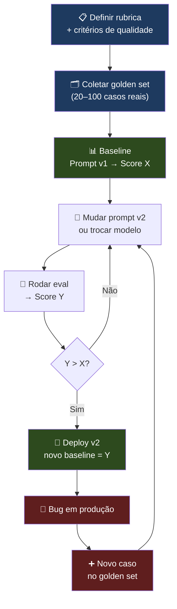

# 01 - Eval-driven development — a disciplina

> [!abstract] TL;DR
> **EDD** (Eval-driven development) é o shift de *"rodei 3 vezes e olhei, parece bom"* para **medição sistemática contínua**: você define o que é "bom" antes de escrever o prompt — não depois de descobrir o bug em produção. A analogia com TDD é operacional, não só metafórica: TDD escreve o teste antes do código; EDD escreve a eval antes do prompt. O ciclo é *definir rubrica → coletar golden set → estabelecer baseline → mudar → re-medir*, sempre nessa ordem. A diferença prática é que EDD converte intuição dispersa em **memória coletiva**: o conhecimento sobre o que é qualidade fica no dataset, não nas cabeças do time. O princípio central é *"evals first, prompts second"*: sem golden dataset e rubrica, qualquer mudança de prompt é aposta, não engenharia. EDD se aplica a qualquer sistema repetível com LLM em produção; é overkill em one-shots, brainstorming e exploração inicial. Parafraseando Hamel Husain em *Your AI Product Needs Evals*: sem evals você não tem produto — tem demo.

> [!question]- O que eu preciso saber antes de ler isso?
> Esta nota não exige conhecimento de código — é conceitual. A premissa é que você já tem algum sistema com LLM: um chatbot, um extrator de dados, um classificador, qualquer coisa que roda mais de uma vez. E que você provavelmente está tomando decisões sobre esse sistema baseado em "rodar algumas vezes e ver se parece bom". EDD é a alternativa sistemática a isso. Se você vem de desenvolvimento de software tradicional, a analogia com TDD é direta e intuitiva. Se você nunca fez TDD, não preocupa — a nota explica do zero.

## O shift conceitual

Antes:

```
1. Escrever prompt v1
2. Testar 3-5 inputs manualmente
3. "Parece bom" → deploy
4. Usuário reclama → mudar prompt v2
5. Testar 3-5 inputs (diferentes dos anteriores)
6. "Tá melhor" → deploy
7. Usuário reclama de outra coisa
8. Repetir, sem nunca saber se v2 > v1 ou v3 > v2
```

Depois (EDD):

```
1. Definir o que "bom" significa → rubrica
2. Coletar 30-100 exemplos canônicos → golden set
3. Rodar baseline com prompt v1 → score X
4. Mudar pra v2 → roda eval → score Y
5. Decide com base em X vs Y, não em "achei melhor"
6. Bug em prod → vira novo caso no golden set → regression test permanente
```

A diferença não é só rigor. É **memória**. Com EDD, o conhecimento acumulado fica no dataset; sem EDD, fica espalhado em decisões de quem estava no time naquele dia.

O ciclo completo, do ponto de vista operacional:



O ponto chave do diagrama: **bugs de produção não terminam o ciclo — eles entram nele**. Todo incidente vira caso no golden set, que vira regression test permanente. É assim que o dataset cresce organicamente e o sistema melhora com o tempo, em vez de acumular dívida silenciosa.

## Analogia com TDD

| TDD | EDD |
|---|---|
| Escreve teste antes do código | Escreve eval antes do prompt |
| Vermelho → verde → refactor | Baseline → mudar prompt → re-medir |
| Cobertura de teste | Cobertura de cenários no golden set |
| Regressão = teste antigo que quebrou | Regressão = score caiu no golden set |
| Falha de teste bloqueia merge | Falha de eval bloqueia merge ([[07 - Eval em CI-CD]]) |

A analogia tem um limite importante: testes tradicionais são **booleanos** (passa ou falha); evals são **graduados** (score 4.2/5 com threshold em 4.0). Isso muda o ferramental, mas não a mentalidade.

## O princípio: evals first, prompts second

Antes de escrever uma linha de prompt:

1. **Tarefa.** Qual o input e o output esperado em palavras humanas?
2. **Critério de sucesso.** Como você reconhece um output bom? Liste 3-5 dimensões.
3. **Exemplos.** 5-10 pares input-output que você consideraria sucesso. Comece pelo dataset, mesmo que minúsculo.
4. **Anti-tests.** 2-3 inputs onde o modelo **deveria** recusar ou responder "não sei".

Só **depois** desses quatro passos é hora de escrever prompt. Esse trabalho upstream é o que evita o ciclo de iteração cega.

> [!tip] Hamel Husain — *Your AI Product Needs Evals*
> *"Most teams skip evals because they feel slower upfront. But the alternative is iterating on prompts forever without knowing if you're moving forward or sideways. The team that builds evals first ships better products faster — not because they're more rigorous, but because every change generates signal instead of noise."*

## Quando EDD aplica

Aplica:

- **Pipelines de produção** — qualquer sistema que vai rodar 1000+ vezes/dia
- **Tarefas repetíveis** — classificação, extração, resumo, roteamento, geração com schema
- **Sistemas críticos** — finance, healthcare, legal, compliance (eval é parte do dossiê de auditoria)
- **Multi-prompt pipelines** — quando você tem 3+ chamadas encadeadas e precisa isolar qual mudou

Não aplica (ou é overkill):

- **One-shots** — "me escreve um email pro meu chefe agora"
- **Brainstorming** — exploração criativa onde "errado" não tem definição
- **POC inicial** — primeira semana descobrindo se o problema tem solução. Antes de ter eval, você precisa ter sistema.
- **Tarefas verdadeiramente subjetivas** — escolha de capa de livro, escrita de poesia sem brief específico

O risco de fazer EDD prematuro é gastar 2 semanas montando golden set pra um produto que pivota. O risco de não fazer EDD depois que o produto estabilizou é ficar refém de intuição.

## EDD não é sobre perfeição

Um equívoco que paralisa times: pensar que "fazer EDD" significa ter eval perfeito antes de lançar. Não é. EDD é um espectro — e qualquer nível é melhor que nível 0.

Um golden set de 10 casos mal formados roda em CI é melhor que nenhum golden set. Uma rubrica de 1 dimensão em vez de 5 ainda é melhor que nada. A ideia não é chegar em estado ideal — é começar a gerar signal onde antes não havia nenhum, e ir melhorando iterativamente.

O estado "pronto pra lançar sem nenhum eval" é um estado de dívida técnica. Assim como dívida financeira, ela acumula juros (custo de descobrir bugs em produção em vez de nos testes). Você não precisa pagar tudo de uma vez — mas você precisa começar a pagar.

## Maturidade EDD

| Nível | Sinal |
|---|---|
| **0** | *"Olhei e tá bom"* |
| **1** | Golden set ad-hoc em planilha; rodada manual ocasional |
| **2** | Eval automatizado em CI bloqueando merge |
| **3** | Eval em CI + observabilidade em prod ([[03-Dominios/Tecnologia/IA/Anatomia dos LLMs/19 - Evaluation de LLMs em produção]]) |
| **4** | A/B test em prod com métricas de negócio + judge calibrado |
| **5** | Eval contínuo — golden set evolui com casos reais, regression tests acumulados, dashboard de saúde |

Meta para 2026, segundo Hamel: nível 2 como mínimo absoluto pra qualquer produto com LLM em prod.

**O que cada nível parece na prática:**

**Nível 0 → 1 (o desbloqueio):** A transição mais impactante. O time para de basear decisões em *"achei que ficou melhor"* e começa a ter números — mesmo que imperfeitos. Um golden set de 10 exemplos numa planilha do Google, rodado manualmente uma vez por sprint, já é nível 1. O bloqueio costuma ser cultural, não técnico: *"isso vai levar tempo que não temos"*. Leva 4 horas. Cada incidente de regressão que isso previne leva 16.

**Nível 1 → 2 (a automação):** O runner de eval entra no pipeline de CI. Qualquer PR que toca em prompt, system message, ou modelo roda o eval automaticamente. O merge só acontece se o score mantém ou melhora — o threshold funciona como um test suite que bloqueia. Este é o nível que Hamel Husain chama de *"mínimo absoluto para produto em produção"*: abaixo disso, você não tem engenharia de qualidade, tem intuição automatizada.

**Nível 2 → 3 (a visibilidade real):** CI testa com o golden set, não com tráfego real. Nível 3 fecha esse gap: observabilidade em produção significa que você está vendo o comportamento com inputs reais, não só com os 50 casos que você curou. A diferença entre nível 2 e 3 é a diferença entre *"nosso sistema passou nos testes"* e *"nosso sistema está funcionando agora"*.

**Nível 3 → 4 (a decisão de negócio):** O eval técnico está rodando. Mas accuracy de 92% no golden set não é o mesmo que resolução de tickets, CSAT, ou receita. Nível 4 conecta os dois: A/B test em produção com métricas de negócio + LLM-as-judge calibrado com julgamento humano. A pergunta que nível 4 responde é *"essa mudança melhorou o produto?"*, não só *"essa mudança melhorou o score técnico?"*.

**Nível 4 → 5 (o sistema vivo):** O golden set não é mais estático — cresce com casos reais. Todo incidente em produção vira caso no dataset. O dashboard de saúde mostra histórico de scores ao longo do tempo. Regressões são detectadas automaticamente antes de chegar ao usuário. O custo marginal de cada nova feature com LLM cai, porque a infraestrutura de qualidade já está estabelecida — adicionar um prompt novo significa adicionar casos no dataset, não reinventar o processo.

## O que entra no golden set

Hamel Husain detalha os tipos de casos que devem entrar num golden set bem calibrado:

**Casos de sucesso claro:** inputs onde o output esperado é unânime — qualquer engenheiro do time concordaria. Estes são os mais fáceis de construir e estabelecem o piso.

**Casos difíceis mas resolvíveis:** inputs onde você precisou pensar pra definir o output esperado — ambíguos, com múltiplas interpretações razoáveis, onde a resposta depende de contexto específico do domínio. Esses casos são os mais valiosos porque expõem o que o modelo erra quando não tem contexto extra.

**Casos de anti-test:** inputs onde a resposta correta é "recusar", "não sei", "informação insuficiente". Em produção, modelos que sempre tentam responder falham nesses casos sistematicamente. Se você não os inclui no golden set, você não sabe se o modelo falha neles.

**Casos de regressão:** bugs reais que apareceram em produção. Todo caso que chegou via incident deve entrar no golden set — é a única forma de garantir que o bug não volta silenciosamente.

Proporção sugerida para um golden set inicial de 50 casos: 20 sucesso claro, 20 difíceis, 5 anti-tests, 5 regressões conhecidas.

## EDD em times vs solos

Em times, EDD tem uma dimensão organizacional que vai além da técnica. O golden set externaliza o conhecimento sobre o que "bom" significa — que de outra forma fica distribuído nas cabeças das pessoas (e sai com elas quando saem do time). O rubrica documenta o julgamento coletivo.

Isso tem um efeito colateral valioso: onboarding de novos engenheiros fica mais rápido porque eles podem rodar os evals e ver por si mesmos o que o sistema está fazendo bem e mal, sem precisar pedir para alguém "ensinar" o que é qualidade.

Em projetos solos, EDD ainda aplica — mas o benefício é mais pessoal. Você usa evals pra não confiar só na sua memória do que funcionava antes, e pra não ter que re-testar manualmente toda vez que mudar alguma coisa.

**Mini-caso — time de 3 engenheiros, pipeline de extração financeira:**

Uma fintech com pipeline de extração de dados de PDFs (balanços, extratos). O sistema tinha 3 prompts em sequência: extração → normalização → validação. Toda semana alguém mudava um prompt baseado em reclamação de usuário; duas semanas depois, outra pessoa revertia porque *"estava quebrando outros casos"*. Ninguém sabia o estado real do sistema. O conhecimento coletivo sobre o que "funcionar" significava vivia em conversas de Slack.

Semana 1 de EDD: levantaram 40 PDFs reais dos logs, anotaram manualmente o output esperado (4h de trabalho), definiram 2 dimensões de qualidade — precisão do valor numérico e integridade do campo. Golden set de 40 casos, runner em Python, integrado no CI como job opcional.

Resultado 4 semanas depois: descobriram que o prompt v7 de normalização estava quebrando PDFs de um banco específico — que nunca aparecia nos 5 testes manuais porque ninguém pensava em testar aquele banco. O bug estava em produção há 3 semanas sem detecção. O golden set de 40 casos — 4 horas de trabalho — teria detectado na hora do merge.

O efeito colateral: o onboarding do quarto engenheiro levou metade do tempo, porque ele pôde rodar os evals e ver por si mesmo o que o sistema fazia bem e mal, sem precisar pedir para alguém "explicar o contexto".

## O pipeline de EDD em uma tarde

Para times que querem experimentar EDD num projeto real antes de comprometer com a prática:

```
Manhã (2h):
  - Identificar o prompt mais crítico do sistema
  - Coletar 20-30 inputs reais de logs de produção
  - Escrever o output esperado pra cada um (à mão, brutalmente)
  - Definir 3 dimensões de avaliação e o que score 1/3/5 significa em cada

Tarde (2h):
  - Codificar o eval runner básico (roda prompt em cada input, guarda output)
  - Rodar baseline
  - Checar se scores refletem sua intuição (calibração manual)
  - Integrar no CI como job opcional (não bloqueante ainda)
```

Resultado: você tem dados reais sobre o seu sistema em quatro horas. É isso. O resto é refinamento.

## A objeção comum — *"evals são caros"*

Custo típico de eval (Sonnet 4.6, golden set de 100 itens):

```
100 itens × ~$0.005/item = $0.50 por rodada
× 30 rodadas/mês (PRs + main merges) = $15/mês
```

Custo de **não** fazer eval, em produto com LLM em prod:

- 1 incidente de regressão silenciosa = ~16h de debug + churn de usuário
- 1 rollback de prompt em prod = 4-8h de discussão sem dados
- Tempo perdido em "esse prompt é melhor?" sem resposta objetiva = ~8h/semana por engenheiro

O ROI é claro. A objeção real raramente é custo; é cultura.

## O que "um eval" inclui

Uma confusão comum é pensar em eval como "rodar o modelo e olhar o output". Um eval completo tem quatro componentes:

1. **Dataset:** os inputs de teste. Pode ser golden set curado, amostras de produção, casos sintéticos, ou combinação.
2. **Sistema de inferência:** o pipeline que roda o modelo com os inputs — prompt, temperatura, modelo, parâmetros. Tudo fixado e versionado.
3. **Scorer:** o que avalia o output. Pode ser comparação contra ground truth (exata ou fuzzy), rubrica manual, LLM-as-judge, ou combinação (nota 04).
4. **Comparação:** o report que confronta o score atual com o baseline. Sem isso, um eval é só um snapshot — sem contexto histórico, inútil pra decisão.

Os componentes 1 e 4 são os mais frequentemente negligenciados. Times que têm 2 e 3 (modelo rodando, output sendo avaliado) mas não têm 1 e 4 (dataset curado, histórico comparativo) têm automação mas não têm EDD.

## OpenAI sobre evals no core

A OpenAI documenta o framework OpenAI Evals com a frase *"evals are at the core of how we develop our models"*. A mensagem implícita pra quem constrói **em cima** dos modelos é a mesma — se o lab que treinou o modelo trata eval como infraestrutura crítica, quem usa o modelo em produto não pode tratar como afterthought.

## EDD como documentação viva

Um efeito colateral de EDD que times raramente antecipam: o golden set + rubrica + histórico de scores vira documentação viva do comportamento esperado do sistema. É mais útil do que qualquer README ou spec de produto, porque é executável e verificável.

Quando alguém pergunta "o que exatamente o sistema faz no caso X?", você não precisa explicar — você mostra o caso X no golden set, o output esperado, e o score atual. Se o score é 4.5/5 em X, o sistema lida bem com X. Se é 2/5, você sabe onde está o problema.

Esse artefato também é o que permite auditorias reais em sistemas críticos. Em finance, healthcare e legal, reguladores frequentemente pedem evidência de que o sistema funciona como documentado. Um golden set com histórico de scores é exatamente essa evidência. Documentação textual de comportamento esperado não é.

## Anti-patterns

- **Eval só pre-launch** — escreve eval pra lançar, nunca mais roda
- **Eval rodando, ninguém lendo** — pipeline existe, scores ninguém olha
- **Golden set congelado** — não evolui com bugs reais; vira fóssil
- **Métricas técnicas sem métricas de negócio** — accuracy 92% que não move resolution rate
- **Eval-driven sem driver** — métrica existe, ninguém é responsável por levantar
- **Eval no humano em vez do humano no loop** — humano só revisando output sem feedback que volta pro dataset

## O custo invisível de não ter evals

Equipes sem evals tomam decisões de prompt da seguinte forma: alguém muda o prompt, roda 5-10 inputs à mão, "acha que melhorou", e dá merge. O problema é que "rodar 5-10 inputs" é viés de confirmação sistemático — você tende a testar os inputs que você acha que funcionam, não os casos de borda que revelam o que não funciona.

O custo acumulado:

- **Merge do merge.** Cada PR muda o prompt baseado em intuição. Sem baseline, ninguém sabe se o sistema melhorou ou piorou no global.
- **Regressões silenciosas.** Um caso que funcionava bem de repente começa a falhar — mas como ninguém testou aquele específico, só aparece quando usuário reclama.
- **Paralisia de iteração.** Com o tempo, ninguém quer mudar nada porque "a última mudança quebrou X" — mas sem dataset, ninguém sabe o que X é.
- **Incapacidade de comparar modelos.** "Devemos migrar de GPT-4o para Claude Sonnet?" Se você não tem golden set com scores, a resposta honesta é "não sabemos".

EDD converte esse custo invisível em custo visível e gerenciável: o custo de manter o golden set e rodar evals é pequeno e previsível.

## A assimetria temporal

A objeção mais comum é que evals custam tempo no início. É verdade — e é a armadilha. O tempo é front-loaded (semana 1-2) mas o retorno é long-tail (meses a anos). Quem avalia o custo de evals só pela semana 1 vai sempre achar caro. Quem avalia pelo custo total do projeto vai sempre achar barato.

A assimetria concreta: montar um golden set de 50 casos custa ~4 horas. Cada incidente de regressão silenciosa que o golden set teria detectado custa ~8-16 horas de debug + rollback + comunicação. Um incidente paga pelo golden set. No segundo, você está lucrando.

## Como começar amanhã

1. Escolha **um** prompt em produção. O mais crítico.
2. Coleta 20 inputs reais dos últimos 7 dias (logs).
3. Escreve a resposta esperada à mão pra cada um. Sim, 20 vezes. Isso é o golden set v0.
4. Define 3 dimensões de qualidade ([[03 - Scoring rubrics e critérios]]).
5. Roda manualmente — o que você acharia 4-5/5, o que acharia 1-2/5?
6. Codifica isso em script. Roda em CI próximo PR.

Em uma semana você tem nível 1. Em duas, nível 2. O resto é refinamento.

> [!tip] Checklist antes de fazer qualquer mudança de prompt
> - [ ] Existe golden set com ≥20 casos curados?
> - [ ] Existe rubrica com dimensões e scores bem definidos?
> - [ ] Existe baseline de score no estado atual?
> - [ ] A mudança vai ser validada contra o baseline antes do merge?
>
> Se algum item é "não", você está iterando cego — e o próximo PR pode ser uma regressão que você não vai descobrir.

## Armadilhas comuns

> [!warning] Montar golden set com casos felizes
> O instinto é montar o golden set com casos onde o modelo já funciona bem — o que você usou pra demonstrar que o sistema funciona. Esse dataset não detecta regressões, porque os casos problemáticos não estão nele. Golden sets úteis incluem: casos de borda, inputs ambíguos, entradas com formatação estranha, casos onde o modelo falhou historicamente, e casos onde a resposta correta é "não sei" ou "recusar". Quanto mais contra-intuitivos os casos, mais útil o conjunto.

> [!warning] Evals como formalidade de lançamento, não como prática contínua
> É comum montar evals na semana do lançamento para "ter". O problema: o golden set fica congelado, ninguém roda em PRs subsequentes, e os bugs de produção nunca voltam pro dataset. Dois meses depois, o eval existe mas não detecta nada que importa. EDD é uma prática contínua: todo bug em produção vira caso no golden set, todo PR que toca no prompt roda o eval, e o score vai para o histórico do projeto. Sem o loop de feedback entre produção e golden set, o eval vira fóssil.

> [!warning] Confiar em métricas técnicas sem métricas de negócio
> Accuracy de 92% no golden set não significa que o produto entregou valor. Um sistema de suporte que acerta o tom mas resolve 30% menos tickets do que a versão anterior está piorando o negócio, mesmo com score técnico alto. EDD completo inclui dois ciclos: evals técnicos (golden set, rubrica) para velocidade de iteração, e evals de negócio (resolution rate, CSAT, tempo de resposta) para confirmar que melhorias técnicas se traduzem em valor. Sem os dois, você pode estar otimizando a métrica errada.

## Como explicar em inglês

Em entrevistas sobre AI Engineering ou em design reviews de sistemas com LLM, a disciplina de EDD aparece como diferenciador entre quem tem experiência de produção e quem tem só experiência de prototipagem:

> "Eval-driven development is the practice of measuring systematically before and after every change to a prompt or model, instead of testing a few cases manually and calling it 'looks good.' The workflow mirrors TDD: you define what good means — golden dataset plus scoring rubric — before writing the first prompt. Every prompt change generates a score against the baseline. Every production bug becomes a new case in the golden set as a permanent regression test. Without evals, you're iterating blind."

| Português | Inglês |
|-----------|--------|
| dataset dourado | golden dataset / golden set |
| rubrica de avaliação | scoring rubric |
| regressão de qualidade | quality regression |
| eval baseline | eval baseline |
| eval em CI/CD | eval in CI/CD |
| golden set congelado | frozen/stale golden set |
| caso de borda | edge case |
| métricas de negócio | business metrics |
| avaliação graduada | graduated evaluation |
| juiz LLM | LLM-as-judge |

## O que vem a seguir

Com a disciplina estabelecida, a nota 02 entra nos detalhes práticos do asset mais importante de EDD: o golden dataset. Como construir um conjunto que realmente detecta regressões — quantos exemplos, de onde vêm, como garantem cobertura dos casos que importam.

Ver [[02 - Golden datasets — como construir]].

## Veja também

- [[02 - Golden datasets — como construir]]
- [[03 - Scoring rubrics e critérios]]
- [[07 - Eval em CI-CD]]
- [[03-Dominios/Tecnologia/IA/AI Engineering Stack/09 - Evaluation Layer]]
- [[03-Dominios/Tecnologia/IA/Anatomia dos LLMs/19 - Evaluation de LLMs em produção]] — os 4 pilares aplicados em produção

## Fontes

- **Hamel Husain** — [*Your AI Product Needs Evals*](https://hamel.dev/blog/posts/evals/) (2024+)
- **Eugene Yan** — [*Evals are all you need*](https://eugeneyan.com/writing/evals/) (2024)
- **OpenAI** — [*OpenAI Evals* (github.com/openai/evals)](https://github.com/openai/evals) — *"evals at the core"*
- **Chip Huyen** — *AI Engineering* (2025), cap. sobre evaluation
- **Andrej Karpathy** — *"Vibe coding"* (X/Twitter, 2025) — termo que motiva o contrapeso disciplinar do EDD
