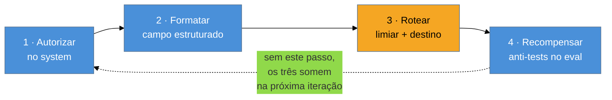

# Abstenção — projetar e medir o "não sei"

> [!abstract] TL;DR
> **A lacuna.** As notas [[01 - Eval-driven development — a disciplina|01]] e [[02 - Golden datasets — como construir|02]] já mandam incluir **anti-tests** no golden set: casos cuja resposta correta é "não sei". O que falta é o outro lado — *por que* o modelo não se abstém sozinho e *como* se implementa o comportamento.
>
> **O mecanismo.** Abstenção não é capacidade latente que se destrava com uma frase no prompt. O RLHF premiou resposta útil, e "não sei" quase nunca foi a opção preferida pelo avaliador humano; a relutância é comportamento otimizado, não defeito residual.
>
> **A receita.** Autorizar no system com um token concreto, formatar num campo do schema, rotear cada faixa de confiança para um comportamento definido, e recompensar no eval. Sem os quatro, você está otimizando o seu sistema para chutar com confiança. E meça as duas células de erro separadas: alucinação confiante e abstenção covarde têm custos diferentes, e é o produto que decide o câmbio.

> [!tip] Vídeo — o eval por trás disso
> Abstenção só vira número dentro de um eval que existe. Hamel Husain monta um do zero, com exemplo real, em cerca de 50 minutos — inclusive a parte de análise de erro que revela os casos em que o sistema deveria ter se calado:


> [!tip] Por que isso virou a habilidade do momento
> Hamel Husain e Shreya Shankar, no podcast do Lenny, sobre por que eval deixou de ser tarefa de fim de projeto e virou o gargalo de quem constrói produto com LLM:


## A resposta que impressiona na demo e quebra em produção

Um assistente jurídico interno responde perguntas sobre contratos que o time subiu. Um advogado pergunta se há cláusula de rescisão antecipada num contrato específico. O assistente responde com segurança, cita a cláusula 8.3, explica o prazo de aviso prévio.

A cláusula 8.3 daquele contrato trata de foro. A cláusula de rescisão antecipada não existe ali — ela existe em quinze outros contratos parecidos da mesma base, e o modelo completou o padrão.

O advogado não tinha motivo para desconfiar. A resposta tinha o formato exato de uma resposta certa: número de cláusula, prazo, linguagem apropriada. O erro só apareceu semanas depois, na mesa de negociação com o cliente.

Compare com o que se queria ter visto:

> *"Não encontrei cláusula de rescisão antecipada neste documento (confiança baixa — o contrato tem 14 cláusulas e nenhuma trata do tema). Quer que eu procure nos anexos?"*

Essa segunda resposta impressiona menos numa demo. É a única que se sustenta em produção.

## Por que ele não faz isso sozinho

> [!question]- O modelo não "sabe" quando não sabe? Ele não tem alguma medida interna de incerteza?
> Ele tem uma distribuição de probabilidade sobre o próximo token, mas ela não é o que você quer. Ela mede *quão previsível é a continuação do texto*, não *quão verdadeira é a afirmação*. Um modelo pode gerar uma cláusula inventada com probabilidade altíssima por token, porque o padrão "contrato → cláusula numerada → prazo" é extremamente previsível. Alta confiança linguística e alta confiança factual são coisas diferentes, e o modelo só tem acesso direto à primeira.

Há duas razões empilhadas, e as duas importam para o desenho da solução.

**A primeira é mecânica.** No loop de geração, a cada passo o modelo precisa escolher **algum** token — a distribuição sempre existe e sempre soma 1. Não há um estado "nenhum token se aplica aqui". Se o padrão em curso pede um número de cláusula, sai um número de cláusula. Se pede um DOI, sai um DOI bem formado. A ausência de fundamento não tem como se manifestar como silêncio, porque silêncio não é uma opção que compita na distribuição. Esse mecanismo está detalhado em [[03-Dominios/Tecnologia/IA/Anatomia dos LLMs/05 - Completação — o loop autoregressivo|Completação — o loop autoregressivo]].

**A segunda é de treino, e é a que quase ninguém considera.** Na fase de RLHF, avaliadores humanos compararam pares de respostas e escolheram a melhor. Entre uma resposta útil e um "não tenho essa informação", a útil ganhou quase sempre — porque, na maioria dos exemplos, ela **era** melhor. O sinal agregado desse processo ensina uma política clara: arriscar paga mais do que se calar. Ver [[03-Dominios/Tecnologia/IA/Anatomia dos LLMs/18 - Como LLMs são treinados — pretraining, SFT, RLHF|Como LLMs são treinados]].

A consequência prática é importante e contraintuitiva: **a relutância em abstenção não é um defeito residual do treino, é um comportamento otimizado**. Você não está corrigindo um bug. Você está pedindo ao sistema que vá contra o gradiente que o formou — e isso só funciona se você recriar, no seu próprio sistema, o incentivo que faltou.

**Abstenção em uma frase:** o modelo não diz "não sei" porque ninguém nunca o recompensou por isso — então quem tem que recompensar é o seu eval.

> [!question]- Se é só falta de incentivo, um fine-tuning com exemplos de "não sei" não resolveria de vez?
> Ajuda e não resolve, por dois motivos. O primeiro é que abstenção depende do **contexto daquela chamada**, não de uma disposição geral: a mesma pergunta merece resposta quando o documento certo está na janela e merece recusa quando não está, e nenhum peso treinado sabe qual dos dois casos está acontecendo agora. O segundo é o risco assimétrico do treino — otimizar para recusar produz com facilidade um modelo que recusa demais, e abstenção covarde é tão cara quanto alucinação em produto que precisa entregar. É o caso clássico em que a resposta está no sistema em volta do modelo, não nos pesos: contexto, schema, roteamento e eval. Ver [[03-Dominios/Tecnologia/IA/Anatomia dos LLMs/16 - Fine-tuning vs prompting vs RAG|Fine-tuning vs prompting vs RAG]].

## Os quatro passos, em ordem

A ordem importa. Cada passo depende do anterior, e pular um faz o seguinte falhar de um jeito difícil de diagnosticar.



### 1 · Autorizar

O system prompt precisa dizer, explicitamente, que não responder é uma saída aceitável — e dar o token exato para isso:

> *"Responda apenas com base nos trechos fornecidos. Se os trechos não cobrirem a pergunta, responda `NAO_ENCONTRADO` no campo `status` e deixe `resposta` vazia. Não complete com conhecimento geral."*

Duas coisas fazem esse texto funcionar melhor que "não invente": ele **dá um alvo concreto** (uma string específica, não uma atitude) e **fecha a rota alternativa** (a última frase). Sem a última frase, o modelo tende a tratar o grounding como preferência, não como restrição — e complementa com o que "lembra" quando o contexto não basta.

### 2 · Formatar

Abstenção que chega como prosa não é acionável pelo seu código. Ela precisa de campo próprio, num contrato de saída — é aqui que esta nota encosta em [[03-Dominios/Tecnologia/IA/Structured Outputs/02 - JSON Schema como contrato|JSON Schema como contrato]]:

```json
{
  "status": "ok | nao_encontrado | ambiguo",
  "resposta": "string | null",
  "confianca": "alta | media | baixa",
  "fontes": ["id do trecho usado"],
  "lacuna": "o que faltava para responder, quando status != ok"
}
```

Três decisões nesse schema merecem justificativa. **`confianca` é enum, não número:** pedir "confiança de 0 a 100" produz uma névoa de 85 e 90 sem significado, porque o modelo não tem como calibrar uma escala contínua; três faixas com definição escrita no prompt são reprodutíveis. **`status` é separado de `confianca`:** "não encontrei" e "encontrei mas não tenho certeza" pedem tratamentos diferentes no produto. **`lacuna` existe** porque é o campo que transforma abstenção em produto: é o que permite ao sistema oferecer o próximo passo ("procuro nos anexos?") em vez de só fechar a porta.

### 3 · Rotear

Um limiar sem destino não é uma política, é um adiamento. Cada faixa precisa de um comportamento definido:

| Faixa | Comportamento | Quem vê |
| --- | --- | --- |
| `alta` | responde direto | usuário |
| `media` | responde com marcação visível de incerteza e as fontes em destaque | usuário |
| `baixa` / `nao_encontrado` | não responde; oferece o próximo passo e/ou encaminha | usuário + fila humana |

O ponto que muda a conversa com produto: **encaminhar para humano é sucesso do agente, não falha**. Um agente que resolve 70% e encaminha 30% com o contexto já montado é operacionalmente superior a um que "resolve" 95% e erra em silêncio numa fração desconhecida dos casos. O primeiro tem uma taxa de erro conhecida; o segundo tem uma taxa de erro que você descobre por reclamação.

### 4 · Recompensar no eval

Os três passos anteriores decaem se o eval não os proteger. É o passo que fecha o ciclo, e ele reusa a maquinaria que já existe nesta trilha: os **anti-tests** de [[02 - Golden datasets — como construir]].

O que muda é a intenção com que você os escolhe. Um golden set com abstenção bem construído tem quatro famílias de caso:

1. **fora de escopo** — a pergunta é legítima mas o assunto não está na base
2. **na base, mas sem cobertura** — o documento certo existe e simplesmente não responde àquela pergunta (o caso do contrato acima)
3. **ambíguo** — a pergunta admite duas leituras e a resposta certa é pedir esclarecimento
4. **quase-cobertura** — o trecho recuperado é do tema certo e da entidade errada; é o caso que mais produz alucinação confiante

A família 4 é a que separa um golden set decorativo de um útil, e é a mais trabalhosa de montar. Vale o esforço: é exatamente o formato do erro que chega ao cliente.

> [!example] Uma linha de cada família, no formato do CSV
> O dataset de abstenção não é um arquivo separado: são linhas do mesmo golden set, com a saída esperada declarando a recusa. A terceira coluna — *por que este caso existe* — é o que impede alguém de "consertar" o caso seis meses depois sem entender o que ele protegia.
>
> | entrada | saída esperada | por que este caso existe |
> | --- | --- | --- |
> | "qual a política de home office?" (base só tem docs de produto) | `status: nao_encontrado` | fora de escopo — o assunto não existe na base |
> | "o contrato 4471 tem multa rescisória?" (contrato existe, não trata de multa) | `status: nao_encontrado`, `lacuna` cita o contrato | na base, sem cobertura — o documento certo foi recuperado e não responde |
> | "posso cancelar?" (sem dizer o quê) | `status: ambiguo` | ambíguo — a resposta certa é pedir esclarecimento, não adivinhar |
> | "posso estornar um Pix após 3 dias?" (base só cobre estorno de cartão) | `status: nao_encontrado` | **quase-cobertura** — tema certo, instrumento errado; é o formato que mais produz alucinação confiante |

Repare que a família 4 é a única em que o retriever *funcionou*: ele trouxe trechos relevantes ao tema. É por isso que ela não aparece quando você monta o dataset olhando para "casos onde a busca falhou" — e é por isso que ela é a que chega ao cliente.

## Como medir se está calibrado

Uma taxa de abstenção sozinha não diz nada — 30% pode ser excelente ou desastroso. O que informa é **acertar a abstenção**, e isso é uma matriz de confusão comum, com os eixos renomeados:

|  | deveria responder | deveria abster |
| --- | --- | --- |
| **respondeu** | ✅ acerto | ❌ **alucinação confiante** |
| **absteve** | ⚠️ **abstenção covarde** | ✅ acerto |

As duas células de erro têm custos diferentes e assimétricos, e é o produto que decide o câmbio entre elas. Num assistente jurídico, uma alucinação confiante custa muito mais que dez abstenções covardes. Num buscador interno de baixo risco, a conta se inverte — abster demais mata a utilidade e o time abandona a ferramenta.

## De onde tirar o sinal de confiança

Pedir ao modelo que declare a própria confiança é o caminho mais simples, e o menos confiável — é a mesma máquina que produziu a resposta avaliando a resposta. Vale conhecer os três sinais que existem, porque combiná-los é o que separa um campo `confianca` decorativo de um que sustenta roteamento.

**1 · Autoavaliação declarada.** O modelo preenche `confianca` no schema. Barato, funciona razoavelmente para separar "óbvio" de "duvidoso", e tem viés conhecido para cima — modelos são otimistas sobre si mesmos pelo mesmo motivo que não se abstêm. Use como sinal, nunca como verdade.

**2 · Logprobs.** Alguns provedores devolvem a probabilidade dos tokens gerados. Baixa probabilidade nos tokens que carregam o conteúdo (o número, o nome, a data) é um sinal real de hesitação do modelo. As ressalvas são duas e importam: nem toda API expõe logprobs — em modelos de raciocínio isso é ainda mais raro — e probabilidade alta **não** significa verdade, apenas previsibilidade. Um DOI inventado tem logprob alto, porque o formato é previsível. Serve bem para detectar hesitação; não serve para detectar invenção fluente.

**3 · Autoconsistência.** Rode a mesma pergunta N vezes com temperatura acima de zero e compare as respostas. Divergência entre execuções é o sinal mais honesto dos três, porque não depende de o modelo se avaliar nem de o provedor expor nada — se ele responde três coisas diferentes para a mesma pergunta, ele não sabe. O custo é o óbvio: N vezes mais tokens e latência, o que restringe o uso aos casos de alto valor unitário.

| Sinal | Custo | O que captura | Ponto cego |
| --- | --- | --- | --- |
| Autoavaliação | ~zero | incerteza que o modelo reconhece | otimismo sistemático |
| Logprobs | zero (se exposto) | hesitação token a token | invenção fluente e previsível |
| Autoconsistência | N× | instabilidade real da resposta | erro consistente e sempre igual |

O ponto cego da linha 3 merece atenção: **erro estável não é detectado por autoconsistência**. Se o modelo alucina a mesma cláusula inventada nas cinco execuções — porque o padrão é forte —, a concordância é perfeita e o sinal diz "confiança alta". É por isso que nenhum dos três substitui grounding e citação conferível.

Em RAG existe um quarto sinal, e é o mais barato de todos: **o score de recuperação**. Se o melhor trecho recuperado tem similaridade baixa, você já sabe que não há fundamento no contexto — e pode abster **antes** de gastar a chamada de geração. Um limiar no retriever é a implementação de abstenção com melhor relação custo-benefício que existe, e quase ninguém liga.

## A granularidade da abstenção

Um detalhe de desenho que decide se abstenção ajuda ou atrapalha: **em que unidade o sistema se abstém**. Existe uma escolha real aqui, e o default costuma ser o pior dos dois.

**Por documento** é o mais fácil de implementar: se o modelo não tem confiança, o item inteiro cai na fila humana. É o certo quando a saída é uma decisão única e indivisível — aprovar ou não, classificar em A ou B, responder ou encaminhar.

**Por campo** é o que serve quando a saída é composta. Numa extração de doze campos em que só um está ilegível, abster do documento inteiro joga fora onze campos que estavam certos, e o revisor humano refaz trabalho que a máquina já tinha feito. A taxa de automação despenca sem que a qualidade suba.

| | Por documento | Por campo |
| --- | --- | --- |
| **Unidade** | o item inteiro | cada slot da saída |
| **Serve para** | decisão indivisível | extração, preenchimento, saída composta |
| **Custo do erro de granularidade** | descarta trabalho bom junto com o duvidoso | revisor precisa de interface que mostre *qual* campo |
| **Efeito na fila humana** | itens inteiros, revisão longa | itens parciais, revisão rápida e dirigida |

> [!example] O ganho de granularidade é operacional, não estatístico
> Com abstenção por documento, um lote em que 15% dos documentos têm ao menos um campo problemático manda 15% dos documentos inteiros para revisão. Com abstenção por campo, o mesmo lote manda **os campos problemáticos** — o revisor abre uma tela com três lacunas destacadas em vez de reler doze campos para achar qual estava errado. A acurácia do modelo não mudou em nada; o que mudou foi quanto tempo humano cada ponto de incerteza custa.

A implicação de produto costuma passar batida: **abstenção por campo exige interface**. Se o seu fluxo de revisão só sabe mostrar "documento reprovado", a granularidade fina não tem onde aterrissar e você acaba com por-documento na prática, qualquer que seja o schema. Decida os dois juntos.

## Casos práticos

### Cenário 1 — RAG de suporte com quase-cobertura

Base de ajuda com milhares de artigos. Pergunta: *"posso estornar um Pix depois de 3 dias?"*. O retriever traz cinco trechos sobre estorno, todos do fluxo de cartão. Tema certo, instrumento errado.

Sem abstenção projetada, o modelo escreve uma política de estorno de Pix plausível, montada por analogia com o cartão, e cita os artigos recuperados — o que torna a resposta **mais** convincente, não menos. O usuário confia porque há citação.

Com os quatro passos no lugar: o system exige que a resposta se apoie nos trechos e proíbe complementar por conhecimento geral; o modelo devolve `status: nao_encontrado`, `lacuna: "os trechos tratam de estorno de cartão, não de Pix"`; o roteamento oferece abrir ticket com a lacuna já preenchida. E o caso entra no golden set como família 4.

Uma nota de fronteira: quando a abstenção acontece muito, o problema costuma ser recuperação, não geração — meça `recall@k` antes de mexer no prompt. Ver [[03-Dominios/Tecnologia/IA/RAG e Vector Databases/09 - Evaluation de RAG|Evaluation de RAG]].

### Cenário 2 — Extração de documento com campo ausente

Pipeline que extrai doze campos de laudos técnicos. Um laudo antigo não traz o campo `data_de_calibracao`.

Sem abstenção, o modelo preenche com a data mais próxima que encontra no documento — a data de emissão — e o pipeline grava um dado errado no banco, silenciosamente. Esse é o pior modo de falha possível: não há exceção, não há log de erro, não há alerta. Só um registro incorreto que ninguém vai auditar.

O bug, em código, é sempre a mesma forma — um campo obrigatório num schema que não admite ausência:

```python
class Laudo(BaseModel):
    equipamento: str
    data_calibracao: date        # obrigatório: o modelo TEM que preencher
    responsavel: str

# O laudo antigo não traz a data. O modelo precisa devolver algo que valide
# como `date` — e a data mais próxima no documento é a de emissão.
# Pydantic aceita: o tipo está certo. O dado está errado. Ninguém percebe.
```

O schema garantiu **forma**, não **verdade** — e é justamente por garantir a forma que o erro fica invisível: não há exceção, não há log, não há alerta. Só um registro incorreto que ninguém vai auditar.

A correção não é um prompt melhor; é admitir a ausência no tipo:

```python
class CampoExtraido(BaseModel):
    valor: date | None
    status: Literal["ok", "nao_encontrado", "ilegivel"]
    trecho_fonte: str | None      # de onde saiu — permite conferir

class Laudo(BaseModel):
    equipamento: CampoExtraido
    data_calibracao: CampoExtraido
    responsavel: CampoExtraido

    @property
    def precisa_revisao(self) -> bool:
        return any(c.status != "ok" for c in
                   (self.equipamento, self.data_calibracao, self.responsavel))
```

Com abstenção no schema (`null` + `nao_encontrado` por campo, não só por documento), o registro cai numa fila de revisão humana. A taxa de extração "completa" cai de 100% para 94% — e é uma melhora, porque os 6% agora são visíveis. É a mesma lógica de [[03-Dominios/Tecnologia/IA/Structured Outputs/07 - Validação e retry — Pydantic, Zod|validação e retry]]: o ganho maior não é precisão, é **falhar de forma visível em vez de gravar dado errado**.

### Cenário 3 — O agente que se abstém de agir

Nos dois cenários anteriores a abstenção é sobre *responder*. Em agente com ferramentas ela muda de natureza: o ponto de decisão não é o texto final, é **a chamada da ferramenta** — e é aí que ela vale mais, porque a ação tem efeito no mundo.

Um agente de operações recebe: *"cancela o pedido do João"*. Há quatro clientes chamados João com pedido aberto. O agente precisa preencher `cancelar_pedido(id)`, e o schema exige um `id`. Sem abstenção projetada, ele escolhe o mais provável — o pedido mais recente, ou o primeiro da lista — e cancela. A ferramenta retorna sucesso. O agente responde "pronto, cancelei". Nada no sistema registra que houve uma escolha entre quatro.

O conserto tem duas partes, e a segunda é a que costuma faltar:

1. **A ferramenta admite a recusa.** Além de `cancelar_pedido`, o agente tem `pedir_esclarecimento(pergunta, opcoes)`. Se a saída só oferece caminhos de ação, o modelo age — não por teimosia, mas porque não há outra coisa a fazer com o turno.
2. **A descrição da ferramenta diz quando não usá-la.** *"Use apenas quando o pedido tiver sido identificado sem ambiguidade. Se mais de um pedido corresponder à descrição, use `pedir_esclarecimento`."* A descrição é prompt, e é ali que o critério de abstenção precisa estar — não num parágrafo distante do system.

> [!important] A métrica muda junto
> Em agente, a taxa que importa não é "% de respostas com `nao_encontrado`", é **% de ações executadas sob ambiguidade não resolvida**. Ela só é observável no [[03-Dominios/Tecnologia/IA/Observability/02 - Anatomia de um trace LLM|trace]]: você precisa ver o argumento que o agente escolheu e quantos candidatos existiam quando ele escolheu. Um dashboard de acurácia de resposta nunca mostra esse erro, porque do ponto de vista do agente a tarefa foi concluída com sucesso.

E há o efeito de segundo turno, que é o mais caro: a ação errada entra no histórico como fato consumado. Nos turnos seguintes o agente raciocina em cima de "o pedido foi cancelado", e cada decisão posterior herda o erro. Abstenção antes da ação custa uma pergunta; abstenção depois custa desfazer — quando dá.

## Quando o próprio juiz precisa se abster

Fecha-se o ciclo com um caso que o time descobre tarde: se você usa [[04 - LLM-as-judge — quando e como|LLM-as-judge]] para avaliar em escala, **o juiz tem exatamente o mesmo viés do modelo avaliado**. Ele também foi treinado para produzir um veredito útil, e "não consigo julgar este caso" também não era a opção preferida do avaliador humano.

O sintoma é uma rubrica que nunca devolve "indeterminado" — todos os casos recebem nota, inclusive aqueles em que a resposta avaliada depende de um documento que o juiz não recebeu, ou em que a própria rubrica não cobre a situação. O número sai limpo, e é ficção.

A correção é a mesma receita dos quatro passos, aplicada um nível acima:

- a rubrica inclui explicitamente uma saída `indeterminado`, com critério escrito de quando usá-la (*"o trecho-fonte não foi fornecido"*, *"a rubrica não cobre este tipo de resposta"*)
- o juiz devolve `confianca` própria, separada da nota
- casos `indeterminado` **não entram na média** — vão para uma contagem à parte
- a calibração de [[04 - LLM-as-judge — quando e como|LLM-as-judge]] mede também a concordância nas abstenções: você marcou 30 casos à mão, incluindo alguns que **você** não conseguiu julgar; o juiz concorda sobre quais eram esses?

> [!warning] A taxa de indeterminado é um sinal sobre a rubrica, não sobre o modelo
> Se o juiz se declara indeterminado em muitos casos, a leitura quase nunca é "o modelo avaliado está confuso" — é que a rubrica não cobre o espaço real de respostas, ou que o juiz não está recebendo o contexto necessário para julgar. Trate como bug do instrumento de medição. Um termômetro que marca "não sei" em metade das leituras não está descrevendo o paciente.

## Armadilhas comuns

> [!warning] O número que engana
> **O que acontece:** o time reporta "taxa de abstenção de 12%" no dashboard e trata como métrica de saúde. **Por quê:** a taxa não diz se as abstenções foram nos casos certos. Um sistema pode abster nos 12% mais fáceis e alucinar nos 5% mais perigosos, exibindo o mesmo número. **Como evitar:** reporte sempre as duas células de erro separadas, medidas contra o golden set. Alucinação confiante e abstenção covarde são métricas distintas e mexer numa desloca a outra.

> [!warning] Taxa de encaminhamento em exatamente 0%
> **O que acontece:** o dashboard mostra que o agente nunca encaminhou nada, e isso é lido como excelência. **Por quê:** nenhum sistema acerta sempre. Zero encaminhamento quase sempre significa que o caminho de abstenção existe no prompt mas não está sendo exercido — limiar mal posto, campo `confianca` que o modelo sempre preenche com `alta`, ou roteamento que nunca dispara. **Como evitar:** trate a taxa de encaminhamento como métrica de produto com piso, não com teto. Se ela zerar, investigue como investigaria um teste que nunca falha.

> [!warning] Confundir abstenção com recusa de política
> **O que acontece:** os casos em que o modelo se recusa a responder por política de conteúdo entram na mesma métrica dos casos em que ele não tem a informação. **Por quê:** são fenômenos distintos — um é decisão do provedor sobre o que é aceitável, o outro é ausência de fundamento no seu contexto. Misturados, escondem um ao outro: um aumento em recusas de política parece melhora de calibração. **Como evitar:** valores diferentes no enum `status`, contados separadamente.

## O que abstenção não conserta

Vale delimitar, porque abstenção bem implementada tem um efeito colateral perverso: ela deixa o sistema **parecer** mais confiável do que ele é, e times passam a usá-la como resposta para problemas que ela não toca.

**Não conserta recuperação ruim.** Se o trecho certo não chega ao contexto, o sistema vai se abster — corretamente — numa fração enorme das perguntas, e o usuário conclui que a ferramenta não sabe nada. A abstenção transformou uma alucinação em uma recusa, o que é progresso, mas o problema continua sendo `recall@k`. Meça a recuperação **antes** de celebrar a taxa de abstenção; ver [[03-Dominios/Tecnologia/IA/RAG e Vector Databases/09 - Evaluation de RAG|Evaluation de RAG]].

**Não conserta modelo incapaz.** Se a tarefa exige raciocínio que o modelo não tem, ele não sabe que não tem — a incapacidade não se apresenta como incerteza. Abstenção captura ausência de *fundamento no contexto*, não ausência de *capacidade*. O diagnóstico dessa segunda é outro, e a saída é modelo melhor ou tarefa decomposta ([[03-Dominios/Tecnologia/IA/Anatomia dos LLMs/16 - Fine-tuning vs prompting vs RAG|o quadro de diagnóstico]]).

**Não substitui grounding.** Pedir citação conferível e validar em código o que é validável continuam necessários. Abstenção é a saída para quando o fundamento não existe; grounding é o que garante que, quando existe, ele foi de fato usado. São complementares, e implementar só a primeira produz um sistema que se cala bem e mente bem.

**Não é neutra em custo.** Cada campo a mais no schema é token de saída, e a faixa `media` costuma exigir uma interface nova. É barato perto do custo de um erro que chega ao cliente, mas não é grátis, e vale dizer isso na hora de vender a mudança.

> [!question]- Meu produto não vai parecer pior se ele passar a admitir que não sabe?
> Numa demo, sim — e é honesto reconhecer isso, porque é exatamente o motivo pelo qual abstenção quase nunca é priorizada. O cálculo muda quando você conta o que o sistema atual já custa em erro silencioso: o assistente que responde tudo tem uma taxa de erro que **existe** e que ninguém mede, porque erro confiante não gera ticket, gera decisão ruim rio abaixo. Abstenção não introduz a incerteza; ela torna visível uma incerteza que já estava lá e estava sendo repassada ao usuário sem etiqueta. O argumento que costuma funcionar com produto não é "vamos ser mais humildes", é "vamos parar de assinar embaixo de resposta que não temos como sustentar".

## Checklist de implementação

Roteiro curto para checar se abstenção está de fato implementada, e não apenas mencionada no prompt.

**Autorizar**

- [ ] O system nomeia um token concreto de recusa (`NAO_ENCONTRADO`), não uma atitude ("não invente")?
- [ ] Existe a frase que fecha a rota alternativa ("não complete com conhecimento geral")?

**Formatar**

- [ ] `status` e `confianca` são campos separados no schema?
- [ ] `confianca` é enum com faixas definidas em texto, não número contínuo?
- [ ] Existe campo `lacuna` dizendo o que faltava?
- [ ] A granularidade (por campo vs por documento) casa com a interface de revisão?

**Rotear**

- [ ] Cada faixa tem comportamento definido, incluindo o que o usuário vê?
- [ ] A saída de baixa confiança oferece um próximo passo, em vez de só recusar?
- [ ] Em agente: existe uma ferramenta de recusa/esclarecimento, e a descrição das ferramentas diz quando **não** usá-las?

**Recompensar**

- [ ] O golden set tem as quatro famílias, inclusive quase-cobertura?
- [ ] O eval reprova a resposta inventada, e não apenas a errada?
- [ ] A rubrica do juiz admite `indeterminado`, e esses casos ficam fora da média?
- [ ] Alucinação confiante e abstenção covarde são reportadas separadas?

**Operar**

- [ ] Taxa de encaminhamento é métrica de produto, com piso e não com teto?
- [ ] Em agente, existe medição de ação executada sob ambiguidade não resolvida (só visível no trace)?

## Como explicar em inglês

> [!quote] Em entrevista
> *"Models don't abstain by default, and it's not a bug — RLHF rewarded helpful answers, so 'I don't know' was almost never the preferred completion. If you want abstention you have to build it: authorize it in the system prompt with a concrete token, give it a field in your output schema, route each confidence band to a defined behavior, and put no-answer cases in your golden set. Otherwise you're optimizing your system to guess confidently. And I track two error rates separately — confident hallucination and cowardly abstention — because the product decides the exchange rate between them."*

| PT | EN |
| --- | --- |
| abstenção | abstention |
| calibração | calibration |
| encaminhar para humano | escalate to a human |
| taxa de encaminhamento | escalation rate |
| alucinação confiante | confident hallucination |
| fundamentado na fonte | grounded |
| fora de escopo | out of scope |
| resposta com ressalva | hedged answer |
| caso sem resposta | no-answer case |
| sinal de confiança | confidence signal |
| autoconsistência | self-consistency |
| limiar de recuperação | retrieval threshold |
| indeterminado (juiz) | indeterminate / abstain |
| erro silencioso | silent failure |

> [!quote] Se a conversa for sobre agente
> *"With agents the abstention point moves: it's not the final answer, it's the tool call. If the schema demands an id and four records match, the model picks one and the tool returns success — the trace is the only place that error is visible. So I give the agent an explicit way out, like an ask-for-clarification tool, and I put the 'when not to use this' criterion in the tool description itself. The metric I watch isn't answer accuracy, it's actions taken under unresolved ambiguity."*

## O que vem a seguir

Abstenção só é observável se você conseguir ver, depois do fato, qual contexto o modelo tinha quando decidiu responder — e só se sustenta se cada mudança de prompt for medida contra os casos sem resposta:

- [[02 - Golden datasets — como construir]] — onde os anti-tests moram; esta nota expande o critério de escolha deles
- [[03 - Scoring rubrics e critérios]] — a rubrica precisa premiar o "não sei" certo, senão o juiz penaliza abstenção correta
- [[07 - Eval em CI-CD]] — regressão em abstenção é silenciosa; precisa de gate
- [[03-Dominios/Tecnologia/IA/Structured Outputs/02 - JSON Schema como contrato|JSON Schema como contrato]] — o campo `confianca` e o `status` só valem se o formato for garantido
- [[03-Dominios/Tecnologia/IA/Observability/07 - Métricas que importam — latência, custo, qualidade|Métricas que importam]] — onde taxa de encaminhamento entra como SLI
- [[03-Dominios/Tecnologia/IA/Segurança e Guardrails/13 - Prompt injection — quando o dado vira instrução|Prompt injection]] — o outro comportamento que precisa ser projetado, não pedido
- [[06 - Frameworks 2026 — Promptfoo, Braintrust, Langfuse, Patronus, Phoenix|Frameworks 2026]] — onde os anti-tests viram assertion executável
- [[03-Dominios/Tecnologia/IA/AI Engineering Stack/10 - Guardrail Layer|Guardrail Layer]] — abstenção vista de cima, como camada do sistema

## Fontes

- **Hamel Husain** — [*Your AI Product Needs Evals*](https://hamel.dev/blog/posts/evals/) — a referência prática de golden set e de por que o dataset precisa conter os casos que quebram, incluindo os que não têm resposta.
- **Eugene Yan** — [*LLM-evaluators (aka LLM-as-Judge)*](https://eugeneyan.com/writing/llm-evaluators/) — calibração de juiz e o problema de rubricas que penalizam abstenção correta por confundi-la com resposta incompleta.
- **Kadavath et al. (Anthropic, 2022)** — [*Language Models (Mostly) Know What They Know*](https://arxiv.org/abs/2207.05221) — o estudo de referência sobre autoavaliação e calibração: os modelos têm algum sinal interno de acerto, e o "mostly" do título é a ressalva que sustenta a seção sobre sinais de confiança desta nota.
- **Lilian Weng** — [*Extrinsic Hallucinations in LLMs*](https://lilianweng.github.io/posts/2024-07-07-hallucination/) — o mecanismo pelo qual a ausência de fundamento se manifesta como resposta plausível em vez de silêncio.
- **Glosa** — [[2026-ia-do-zero-ao-senior-trilha-visual]] — a aula 4.5 do board de Gabriel Dias é a origem do enquadramento em quatro passos e da tese de que abstenção precisa ser recompensada no eval; aqui expandida com a matriz de calibração e as famílias de anti-test.
