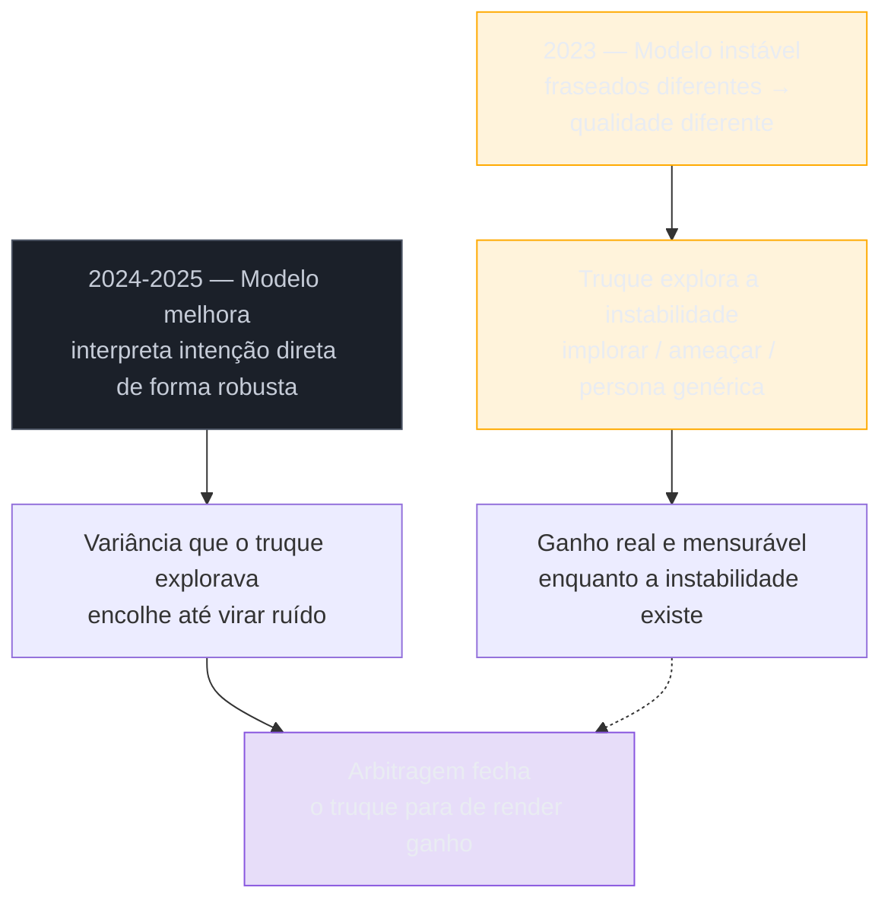
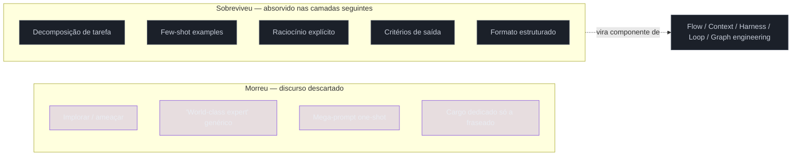

# Prompt engineering — o que morreu e o que sobrou

> [!abstract] TL;DR
> Entre 2024 e 2026 o cargo "Prompt Engineer" praticamente sumiu das vagas — o título caiu cerca de 30%. No mesmo período, a *skill* "prompt engineering" listada em vagas de emprego cresceu cerca de 250%, e o número de vagas que a exigem triplicou. Não é contradição: o que morreu foram os **truques de fraseado** (implorar, ameaçar, prometer gorjeta, "you are a world-class expert") — arbitragem sobre a fragilidade do modelo, que fechou quando os modelos ficaram bons o suficiente em interpretar linguagem natural direta. O que sobrou — decompor a tarefa, dar exemplos, pedir raciocínio explícito, especificar formato de saída — não morreu: foi absorvido como fundação de toda camada que veio depois. Essa absorção é o padrão que se repete a cada capítulo desta série.

> [!question]- Perguntas de revisão
> 1. Se a skill cresceu 250% mas o cargo caiu 30%, onde foi parar o trabalho de prompt engineering? Quem faz esse trabalho hoje, se não é mais um "Prompt Engineer"?
> 2. Qual é a diferença estrutural entre um truque como "prometa uma gorjeta" e uma técnica como few-shot prompting? Por que uma sobreviveu e a outra não?
> 3. Se "absorção não é extinção" é o padrão, o que você deveria esperar ler daqui a um ano sobre a camada que hoje parece definitiva?

---

## O cargo que valia seis dígitos e sumiu

Em 2023, "Prompt Engineer" era manchete. Vagas anunciando salários de seis dígitos para alguém cuja função era, essencialmente, escrever frases muito boas para um chatbot. Havia cursos, certificações, listas de "as 50 melhores técnicas de prompt", e uma corrida de empresas se anunciando como pioneiras por terem contratado um.

Passe para 2026 e procure "Prompt Engineer" nas mesmas plataformas de vaga. O título praticamente desapareceu — uma queda de aproximadamente 30% frente a 2024. Se você tomasse só esse número, a conclusão óbvia seria: a disciplina morreu, foi hype, passou.

Só que olhar apenas o título é olhar o lugar errado. Enquanto o *cargo* murchava, a *skill* — a linha "prompt engineering" listada como requisito dentro de descrições de vaga de Engenheiro de IA, Engenheiro de ML, Desenvolvedor de Produto de IA, Analista de Dados — cresceu cerca de 250% no mesmo intervalo. E o número de vagas que exigem essa skill triplicou. Uma pesquisa de 2026 com líderes de TI e dados encontrou que 82% deles concordam que "prompt sozinho não é suficiente para produção multi-etapa" — mas note a frase: *não é suficiente*, não *não é necessário*. A skill continua no requisito. O que sumiu foi o cargo dedicado só a ela.

Esse descompasso entre cargo e skill é o fio que puxa esta nota. Ele não é um acidente estatístico — é a assinatura de um padrão específico que vamos ver se repetir em cada camada desta série: loop engineering, graph engineering, e o que quer que venha depois vão passar pelo mesmo ciclo. Entender exatamente *o que* morreu em prompt engineering — e por quê — é o modelo mental que evita ler cada nova onda como "a anterior era fraude, esta é a verdade".

> [!info] Sobre os números salariais
> Faixas específicas de salário para júnior/pleno/sênior em 2026 aparecem em agregadores de vaga (não em fonte oficial de mercado de trabalho) e mostram alta em todos os níveis frente a 2024 — trate como estimativa de agregador, não como dado censitário. O ponto que importa para esta nota não é o valor absoluto, é a direção: a demanda pela skill subiu, não caiu, no mesmo período em que o cargo dedicado desapareceu.

### Os quatro números lado a lado

Colocar os quatro números do mercado juntos deixa o descompasso mais nítido do que qualquer um isolado:

| Métrica | 2024 → 2026 | O que mede |
|---|---|---|
| Título "Prompt Engineer" em vagas | queda de ~30% | Cargo dedicado, full-time, só para escrever prompt |
| Skill "prompt engineering" listada em vagas | alta de ~250% | Requisito dentro de outras funções (Engenheiro de IA, ML, Produto, Dados) |
| Vagas que exigem a skill | triplicaram | Alcance — quantas posições diferentes passaram a pedir isso |
| Líderes de TI/dados que dizem "prompt sozinho não basta" (survey 2026) | 82% | Consenso de que prompt é necessário, mas insuficiente sozinho |

Leia a tabela na ordem certa e o padrão salta: a linha 1 é sobre *concentração* — quantas empresas pagavam alguém só para isso. As linhas 2 e 3 são sobre *difusão* — quantas funções diferentes passaram a exigir a mesma competência, embutida no trabalho de outra pessoa. A linha 4 é o motivo dessa difusão: a skill deixou de ser suficiente sozinha, então parou de justificar um cargo isolado, e passou a ser um ingrediente dentro de cargos mais amplos.

Esse é, historicamente, o destino de boa parte das competências técnicas nascentes: no início da web, "Webmaster" foi um cargo dedicado só para colocar páginas no ar; hoje escrever HTML básico é competência esperada de qualquer desenvolvedor front-end, sem cargo próprio. Não é que HTML tenha "morrido" — é que deixou de ser raro o bastante para justificar um título exclusivo. Prompt engineering está seguindo a mesma curva, só que em um intervalo de tempo muito mais curto — dois ou três anos em vez de uma década.

---

## O que de fato morreu: os truques

Para separar o que morreu do que sobrou, é preciso ser específico sobre o que "prompt engineering" significava, na prática, em 2023. Não era uma disciplina — era, em boa parte, uma coleção de gambiarras de linguagem natural, descobertas por tentativa e erro, que produziam ganhos de qualidade desproporcionais ao esforço de escrevê-las. Algumas das mais conhecidas:

- **Implorar.** Prompts que terminavam com "por favor, isso é muito importante para mim" ou "minha carreira depende disso" — e relatos anedóticos de que a resposta melhorava.
- **A persona genérica.** Abrir todo prompt com "You are a world-class expert in X" — não porque o modelo precisasse da instrução para acessar conhecimento de X (ele já tinha), mas porque a frase parecia empurrar o registro da resposta para mais confiante e estruturado.
- **Ameaçar.** Variações de "se você errar, algo ruim vai acontecer" — inclusive versões bizarras que circulavam em threads, tipo ameaçar "desligar" o modelo.
- **Prometer gorjeta.** "Vou te dar $200 de gorjeta se fizer certo" — um experimento informal que virou meme depois de relatos (não totalmente reproduzíveis) de que aumentava a qualidade da resposta.
- **O mega-prompt one-shot.** A crença de que existe uma única string, bem longa e bem lapidada, capaz de fazer o modelo acertar uma tarefa complexa de primeira — sem decomposição, sem iteração, sem verificação. Só a frase certa.

O que essas técnicas têm em comum não é a superstição — é a *estrutura econômica*. Cada uma delas era uma forma de **arbitragem sobre a fragilidade do modelo**. Um modelo de 2022-2023 não interpretava intenção de forma robusta; ele reagia de maneiras inconsistentes e às vezes contraintuitivas ao mesmo pedido reformulado de jeitos diferentes. Havia variância real — um mesmo pedido, fraseado de duas formas, podia produzir qualidade bem diferente. Quem descobria uma fraseação que explorava essa variância a favor da resposta certa tinha, de fato, uma vantagem mensurável. Não era placebo puro: era engenharia reversa de um sistema instável.

> [!question]- Isso quer dizer que os truques nunca funcionaram?
> Não necessariamente — o ponto não é que fossem fraude. É que o ganho vinha de explorar uma *falha específica* do modelo (instabilidade de interpretação), não de um princípio de comunicação universal. Quando a falha desaparece, o truque some com ela — não porque "nunca funcionou", mas porque o buraco que ele preenchia fechou.

### Nem tudo em 2022-2024 era folclore

É importante não jogar tudo de 2022-2024 no mesmo balaio dos truques de bajulação. No mesmo período em que "prometa uma gorjeta" circulava como dica de fórum, pesquisadores publicavam técnicas com mecanismo explicável e reprodutível: few-shot prompting (mostrar exemplos do padrão desejado), chain-of-thought — pedir ao modelo para articular passos de raciocínio antes da resposta final — e tree-of-thought, uma variação que explora múltiplos caminhos de raciocínio em paralelo antes de convergir numa resposta. A autoria dessas três técnicas é difusa — vieram de múltiplos papers e experimentos ao longo de 2022-2024, não de uma pessoa ou lançamento único.

A diferença entre essas técnicas e os truques de bajulação não é a data de origem — é o *mecanismo*. Few-shot e chain-of-thought funcionam porque mudam a informação disponível para o modelo no momento de gerar a resposta (mais exemplos do padrão, mais passos intermediários explícitos) — isso é engenharia de informação, não exploração de instabilidade. É por isso que essas duas sobrevivem intactas na lista da próxima seção, enquanto "prometa uma gorjeta" não sobrevive: uma muda o que o modelo *tem* para trabalhar, a outra tenta mudar quanto o modelo *se esforça* — e esforço nunca foi o gargalo real.

---

## O mecanismo da morte: quando a arbitragem fecha

Pense em qualquer mercado com uma ineficiência conhecida — um preço mal calibrado, uma lacuna de informação. Enquanto poucos exploram essa ineficiência, ela rende lucro real. Mas arbitragem, por definição, se autodestrói: quanto mais gente explora a lacuna, mais ela se fecha, até que o "truque" vira ruído — não porque as pessoas pararam de tentar, mas porque o preço já embutiu a correção.

Prompt engineering de truque seguiu exatamente essa curva. A partir do fim de 2024, os modelos ficaram consistentemente melhores em interpretar linguagem natural direta e ambígua — sem precisar de encanamento retórico ao redor do pedido. Isso significa, em termos práticos: a diferença de qualidade entre "faça X" e "You are a world-class expert, please do X, my career depends on it" **encolheu até virar ruído estatístico**. A variância que o truque explorava — a fragilidade do modelo diante de fraseados diferentes do mesmo pedido — foi o que efetivamente diminuiu.

Formalizando o mecanismo em uma frase: **truque é arbitragem sobre fragilidade do modelo; o modelo melhora, a arbitragem fecha.** Não é que "a IA aprendeu a ignorar bajulação" no sentido de ter sido treinada especificamente contra isso (embora parte do alinhamento moderno também empurre nessa direção, reduzindo sicofantismo). É mais simples que isso: o modelo passou a extrair a intenção real do pedido de forma robusta o bastante para que o verniz retórico deixasse de mover a agulha.

Isso explica por que a queda do título "Prompt Engineer" e o boom da skill "prompt engineering" não são contraditórios — são a mesma causa vista de dois ângulos. O emprego que consistia em *só* polir fraseado parou de gerar valor mensurável, porque a fraseado deixou de ser o gargalo. Mas o trabalho de estruturar bem um pedido para um sistema de IA — que é uma coisa mais ampla do que fraseado — continuou necessário, e virou requisito espalhado por outros cargos em vez de justificar um cargo próprio.

> [!question]- E se o modelo piorar de novo, ou um domínio específico continuar instável?
> A lógica é reversível: onde a instabilidade volta a existir — modelos menores, domínios de nicho mal representados no treino, tarefas fora da distribuição usual — a mesma arbitragem reabre. Isso é uma das razões pelas quais prompt engineering "para casos difíceis" ainda tem valor de nicho, mesmo com a média do mercado tendo fechado a lacuna nos casos comuns.

### Duas forças fechando a mesma lacuna, não uma só

Vale separar duas coisas que empurraram na mesma direção, mas por caminhos diferentes, para não simplificar demais o "modelo melhorou" como se fosse um único botão girado.

A primeira é capacidade bruta: modelos maiores, treinados com mais dados e mais compute, ficaram objetivamente melhores em tarefas de compreensão de linguagem — inferir intenção a partir de um pedido ambíguo é, no fundo, uma tarefa de compreensão, e ela melhorou junto com todas as outras.

A segunda é mais específica e menos falada: o próprio processo de alinhamento pós-treino — o ajuste fino que ensina o modelo a seguir instruções e a se comportar de forma útil e segura (instruction tuning, aprendizado por reforço com feedback humano e variantes) — foi, ao longo de 2024 e 2025, refinado repetidamente para lidar melhor com exatamente o tipo de pedido ambíguo ou mal formatado que os truques tentavam contornar. Cada rodada de alinhamento é, em essência, uma correção dirigida a exatamente esse tipo de falha: o modelo erra de um jeito específico em testes internos, os times de alinhamento ajustam o treino para reduzir aquele erro específico, o modelo da próxima versão erra menos daquele jeito. Bajulação e ameaças eram, sem que ninguém tivesse planejado dessa forma, uma classe de "erro" que ficou cada vez mais irrelevante porque o alvo que ela mirava — um modelo que reage de forma inconsistente a fraseados equivalentes — foi um dos alvos repetidamente corrigidos.

O resultado prático das duas forças somadas é o mesmo, mesmo vindo de mecanismos diferentes: a distância de qualidade entre "pedido direto e claro" e "pedido direto e claro com verniz retórico ao redor" encolheu até a maioria dos usuários deixar de notar diferença.

### Um exemplo lado a lado

O jeito mais rápido de sentir a diferença entre truque e fundamento é ver os dois pedindo a mesma coisa.

**Versão 2023, cheia de truque:**

> "You are a world-class expert copywriter with 20 years of experience. This is extremely important for my career, please do your best. Write a product description for a running shoe. I'll tip you $50 if it's great."

Repare no que essa versão *não* diz: não diz para quem é o produto, não diz o tom, não diz o tamanho, não diz o que incluir ou excluir, não dá exemplo de como uma boa descrição desse tipo se parece. Todo o "trabalho" do prompt está em tentar convencer o modelo a se esforçar mais — como se esforço fosse um dial que bajulação girasse.

**Mesma tarefa, decomposição e critério:**

> "Escreva a descrição de produto de um tênis de corrida para trail running, público-alvo corredores amadores de 25-40 anos que já treinam mas nunca fizeram trilha. Foco: amortecimento em terreno irregular e aderência em piso molhado — não mencione preço nem comparação com concorrentes. Tom: direto, sem hipérbole ('o melhor tênis do mundo'), no máximo 80 palavras. Exemplo do tom desejado: [inserir um parágrafo de referência de descrição anterior aprovada]."

A segunda versão não tem nenhuma bajulação — e é objetivamente mais fácil de a IA acertar de primeira, porque reduziu a ambiguidade sobre o que "bom" significa nesse contexto específico: público definido, o que incluir, o que excluir, tamanho, tom, e um exemplo âncora. Nenhum desses elementos depende de o modelo estar "instável" para funcionar — funcionam tão bem em 2023 quanto em 2026, porque resolvem um problema de comunicação, não uma falha de modelo. É por isso que a segunda versão é o que sobrevive: decomposição (público, foco, exclusões), critério de saída (tom, tamanho) e exemplo (âncora) — os mesmos três elementos que a seção anterior identificou como fundação.

---

## Anatomia comparada: a gorjeta de $200 contra o few-shot

A seção anterior separou truque de fundamento em abstrato — arbitragem sobre fragilidade versus engenharia de informação. Vale tornar essa separação concreta com um único par, lado a lado, porque é mais fácil sentir a diferença comparando um truque específico com um fundamento específico do que lendo a categoria em prosa.

**O truque: "vou te dar $200 de gorjeta se fizer certo."**

O mecanismo por trás dessa frase nunca foi claro nem para quem a usava — a teoria mais repetida era que o modelo, treinado sobre uma quantidade enorme de texto humano em que promessas de recompensa correlacionam com esforço maior, "aprenderia" a associar a menção de gorjeta a uma resposta mais cuidadosa. Repare no que essa teoria pressupõe: que existe uma variável interna equivalente a "esforço" que uma frase de superfície consegue mover, independente do conteúdo real da tarefa. Em 2023, havia relatos anedóticos — não replicados de forma controlada — de que a frase de fato mudava a qualidade da resposta em alguns casos. O problema é que "alguns casos" é exatamente a assinatura de arbitragem sobre instabilidade: um efeito que aparece quando o modelo está inconsistente entre execuções do mesmo pedido, e desaparece quando ele para de estar. Testar essa frase hoje contra o mesmo pedido sem ela produz, na prática, a mesma resposta — a gorjeta não move mais nada porque não havia "esforço" nenhum sendo comprado; havia ruído de amostragem sendo confundido com sinal.

**O fundamento: few-shot prompting.**

Compare com o mecanismo de mostrar dois ou três exemplos do padrão desejado antes de pedir a tarefa. Aqui não há teoria vaga sobre motivação simulada — o mecanismo é direto e verificável: cada exemplo é informação adicional sobre o formato, o tom e os limites da resposta esperada, informação que o modelo não tinha antes de ler o exemplo e passa a ter depois. Não é uma aposta sobre o estado emocional simulado do modelo; é literalmente aumentar os dados disponíveis no momento da inferência. Um exemplo bem escolhido reduz o espaço de respostas plausíveis do mesmo jeito que uma especificação mais detalhada reduz ambiguidade em qualquer sistema de engenharia — categoricamente diferente de tentar mover uma variável de "motivação" que talvez nem exista.

| | Gorjeta de $200 (morto) | Few-shot (vivo) |
|---|---|---|
| O que a frase adiciona ao modelo | Nada verificável — nenhuma informação nova sobre a tarefa | Um exemplo concreto do padrão de entrada-saída esperado |
| Mecanismo alegado | Simular "motivação", "esforço" | Reduzir ambiguidade fornecendo informação |
| Efeito em 2023 | Relatos anedóticos, não controlados, de ganho ocasional | Ganho mensurável e reprodutível em papers |
| Efeito em 2026 | Nenhum diferencial detectável | Continua reduzindo erro em tarefas de formato específico |
| Por que sobreviveu ou não | Explorava instabilidade — a instabilidade fechou | Resolve um problema estrutural — o problema não desapareceu |

O teste mais simples para replicar esse raciocínio em qualquer truque que você encontrar por aí: pergunte se a frase adiciona **informação** sobre a tarefa (sobrevive) ou se ela tenta mover uma variável de **motivação simulada** que não corresponde a nenhum mecanismo verificável dentro do modelo (morre assim que o modelo para de estar instável o bastante para a diferença aparecer). "Você é um especialista" não adiciona informação — o modelo já "sabe" o que um especialista em X sabe, ou não sabe, independente de ser chamado de especialista. Um exemplo de entrada-saída adiciona informação que literalmente não estava lá antes. Essa é a linha divisória inteira.

---

## O que sobrou: fundação, não decoração

Se o que morreu foi o verniz retórico, o que sobreviveu foi tudo aquilo que nunca dependeu de explorar instabilidade — porque endereçava um problema estrutural real, presente em qualquer sistema que precise transformar intenção humana em instrução para uma máquina que processa linguagem probabilisticamente. Cinco elementos, em particular, não morreram: foram absorvidos.

**Decomposição de tarefa.** Quebrar um pedido grande e vago em passos menores e verificáveis nunca foi um truque de fraseado — é engenharia de problema, o mesmo princípio que rege dividir um programa em funções. Continua sendo o primeiro movimento de qualquer prompt sério, e é também o primeiro movimento de qualquer nó dentro de um flow, de um harness, de um loop.

**Exemplos (few-shot).** Mostrar dois ou três exemplos do padrão de entrada-saída desejado continua sendo uma das formas mais confiáveis de reduzir ambiguidade — porque um exemplo comunica formato, tom e limites de um jeito que descrição em prosa frequentemente não consegue igualar em densidade de informação. Isso não é sobre "enganar" o modelo; é sobre fornecer um contrato mais preciso.

**Cadeia de raciocínio explícita.** Pedir para o modelo articular passos intermediários antes da resposta final — o que ficou conhecido como chain-of-thought — continua tendo efeito mensurável em tarefas que exigem múltiplas etapas lógicas, mesmo com os modelos de raciocínio atuais que fazem parte desse trabalho internamente. A diferença é que, hoje, esse padrão frequentemente já vem embutido na arquitetura do modelo ou do harness em vez de precisar ser pedido explicitamente a cada prompt.

**Critérios de saída.** Dizer explicitamente o que conta como resposta aceitável — extensão, tom, o que incluir, o que excluir — nunca foi truque; é especificação. Toda camada que veio depois de prompt engineering herdou essa exigência, só que aplicada a unidades maiores: um flow inteiro precisa de critério de sucesso, um loop precisa de critério de parada, um grafo precisa de critério de arbitragem entre nós.

**Formato estruturado.** Pedir a saída num formato previsível (JSON, uma lista com campos fixos, um schema) para que o próximo passo do sistema possa consumi-la sem parsing frágil é, hoje, tratado como disciplina própria — [[Structured Outputs]] — mas sua origem é prompt engineering pedindo "responda no seguinte formato".

Repare no padrão comum a esses cinco: nenhum deles é sobre fraseado bonito. Todos são sobre **reduzir ambiguidade estrutural** entre o que o humano quer e o que a máquina vai produzir. É por isso que sobreviveram — porque a fonte do problema que resolvem não desapareceu quando o modelo melhorou. Modelos melhores reduzem a penalidade por um pedido malformado, mas não eliminam a necessidade de o pedido ser bem formado. Ambiguidade estrutural não é fragilidade de modelo — é uma propriedade da comunicação entre duas partes com modelos mentais diferentes, e isso não se resolve só treinando um modelo maior.

> [!abstract] Resumo em uma linha
> O que morreu explorava a instabilidade do modelo; o que sobrou resolvia ambiguidade estrutural — e ambiguidade estrutural não desaparece só porque o modelo ficou mais esperto.

---

## Absorvido, não descartado: todo nó ainda tem um prompt

Aqui está o ponto que a queda do título "Prompt Engineer" esconde: prompt engineering não foi substituído por context engineering, nem por flow engineering, nem por loop ou graph engineering, no sentido de "camada nova, técnica velha jogada fora". Foi **absorvido** — incorporado como competência de base dentro de cada camada seguinte, sem holofote próprio.

Pegue qualquer sistema agêntico moderno organizado como grafo de agentes especializados — o assunto das últimas notas desta série. Cada nó desse grafo, por mais sofisticada que seja a arquitetura ao redor, ainda recebe, em algum ponto, um texto que instrui aquele nó específico sobre o que fazer. Esse texto ainda se beneficia de decomposição clara, exemplos bem escolhidos, critério de saída explícito. A skill de escrever esse texto bem não desapareceu — ela só deixou de ser o *produto inteiro* do sistema e virou um *componente* dele, igual a uma função bem escrita dentro de um programa maior. Ninguém abre vaga para "Function Writer" — escrever boas funções é parte do trabalho de qualquer engenheiro de software. Prompt engineering seguiu o mesmo caminho: deixou de justificar um cargo dedicado porque virou parte esperada do trabalho de quem constrói qualquer coisa em cima de LLM.

Isso explica, com precisão, o número de 250% de crescimento na skill: mais sistemas precisando de prompts bem escritos — só que agora cada engenheiro de IA, engenheiro de dados, desenvolvedor de agente escreve os seus, como parte de um trabalho maior, em vez de terceirizar para um especialista dedicado só a isso.

Essa é a lição transferível desta nota — o motivo real de ela existir dentro deste galho, e não só uma curiosidade de mercado de trabalho: **absorção não é extinção**. Toda camada nova, ao nascer, precisa de espaço discursivo para se afirmar, e a forma mais fácil de abrir esse espaço é anunciar que a camada anterior "morreu" ou "virou jardim de infância". Isso é retórica de lançamento, não balanço técnico. Na prática, quase sempre o que acontece é: a camada nova resolve um problema em uma unidade de design maior (o fluxo, a janela, o ambiente, o ciclo, a rede), e a camada anterior encolhe de "a disciplina inteira" para "um componente necessário dentro da disciplina nova" — sem desaparecer.

Vale prever o próximo capítulo com essa lente antes mesmo de chegar lá: quando este galho tratar de loop engineering, você vai ler alguém dizendo que loops "substituem" flows e prompts. E quando chegar em graph engineering, vai ler gente dizendo que grafos tornam loops obsoletos. Nenhuma das duas afirmações vai ser inteiramente falsa — e nenhuma vai ser inteiramente verdadeira. O padrão desta nota se repete: a unidade de design cresce, a camada anterior não desaparece, ela vira peça da nova.

Para deixar concreto onde cada elemento sobrevivente reaparece, camada por camada:

- **Flow engineering** (próxima nota): decomposição de tarefa vira decomposição do fluxo em etapas testáveis — o mesmo princípio, aplicado a uma unidade maior que uma única instrução.
- **Context engineering**: critérios de saída e formato estruturado viram parte do "ambiente informacional" que o agente carrega — não é mais só o que pedir numa mensagem, é o que manter disponível ao longo de uma sessão inteira.
- **Loop engineering**: raciocínio explícito e critério de saída viram a métrica que o loop mede e o alvo que ele persegue a cada ciclo — o "critério de saída" de um prompt individual virou o "critério de parada" de um sistema que se repete.
- **Graph engineering**: cada nó de um work graph ou org graph, quando chega a hora de executar, ainda recebe uma instrução que precisa de decomposição, exemplo e critério — só que agora essa instrução é uma peça pequena dentro de uma topologia muito maior.

Em nenhum desses casos a técnica "virou obsoleta". Ela mudou de escala e de nome de exibição, mas o problema que resolve — reduzir ambiguidade entre intenção e execução — é o mesmo em todas as camadas, só que aplicado a unidades de design cada vez maiores.

### O ceticismo necessário sobre os próprios números

Vale uma ressalva sobre os dados de mercado citados nesta nota, para não usá-los como prova mais forte do que realmente são. Uma queda de 30% no título "Prompt Engineer" também pode refletir, em parte, uma correção normal de contratação excessiva durante o pico do hype de 2023 — quando empresas abriram vagas dedicadas antes de saber, de fato, o quanto daquele trabalho justificava um cargo próprio versus ser absorvido por outras funções. Nem todo cargo que desaparece prova uma tese sobre a tecnologia; às vezes prova só que o mercado de contratação superestimou a demanda inicial e depois se ajustou. A leitura "absorção, não extinção" desta nota é consistente com os quatro números juntos — título caindo, skill e vagas subindo, consenso de insuficiência isolada em 82% dos líderes — mas números de agregador de vaga não são estatística oficial de trabalho, e devem ser lidos como direção de mercado, não como medição precisa.

---

## Duas armadilhas

> [!warning] Aprender só o truque, nunca o fundamento
> Quem passou 2023 memorizando fórmulas de fraseamento ("comece com 'aja como'", "termine prometendo gorjeta") sem nunca entender *por que* decomposição, exemplos e critérios de saída funcionam, ficou com uma skill que evaporou junto com a instabilidade do modelo que ela explorava. Quem aprendeu o fundamento — por que ambiguidade estrutural atrapalha, como reduzi-la — carrega essa competência intacta para context engineering, para escrever nós de grafo, para qualquer coisa que envolva instruir um sistema baseado em LLM. A skill que sobrevive é sempre a que resolve um problema estrutural, nunca a que explora uma falha temporária.

> [!warning] Jogar fora prompt engineering ao subir de camada
> O erro oposto, e hoje mais comum: achar que, porque a unidade de design subiu para o fluxo, a janela ou a rede, escrever bem cada instrução individual deixou de importar. Um nó de grafo com instrução vaga — "resolva o problema do usuário" sem decompor, sem exemplo, sem critério de sucesso — falha pela mesma razão que um prompt vago falhava em 2023: ambiguidade estrutural não some porque você reorganizou a arquitetura ao redor dela. Grafos sofisticados com nós mal instruídos falham de forma mais cara e mais difícil de depurar do que um prompt mal escrito falhava — porque o erro se propaga por uma rede em vez de ficar contido numa única resposta.

> [!warning] Confundir "o título morreu" com "a competência morreu"
> Uma terceira armadilha, mais sutil que as duas anteriores porque nasce de uma leitura apressada dos próprios números desta nota: um desenvolvedor vê a manchete "Prompt Engineer caiu 30%" e conclui que estudar prompt — decomposição, exemplo, critério de saída — deixou de valer o tempo, porque "isso já era coisa do passado". Ele para de investir na base exatamente na hora em que a skill (não o cargo) triplicou em demanda. O erro de leitura é confundir o desaparecimento de um *título de vaga* com o desaparecimento de uma *competência* — dois fenômenos que esta nota inteira mostrou serem quase opostos: o título caiu porque a skill deixou de ser rara o bastante para justificar um cargo próprio, não porque parou de ser necessária. Quem abandona os fundamentos por acreditar que "morreram" chega em context engineering, em harness engineering, em qualquer camada seguinte, sem a base que todas elas silenciosamente pressupõem — e reaprende, do jeito mais caro, a mesma lição que esta nota tentou entregar de graça.

---

## Como explicar em inglês

If you're explaining this in an interview: the "Prompt Engineer" job title collapsed, but the underlying skill didn't die — it got absorbed as a baseline competency inside every layer built on top of it. What actually died were the tricks that exploited model instability — begging, threats, the $200 tip, the generic "world-class expert" persona; what survived were the parts that reduce structural ambiguity — task decomposition, few-shot examples, explicit output criteria — because that problem never went away just because the model got smarter.

| PT | EN |
|---|---|
| Engenharia de prompt | Prompt engineering |
| Truques de prompt / hacking | Prompt hacking / prompt tricks |
| Decomposição de tarefa | Task decomposition |
| Absorção, não extinção | Absorption, not extinction |
| Arbitragem sobre fragilidade | Arbitrage on model fragility |
| Ambiguidade estrutural | Structural ambiguity |
| Exemplos (few-shot) | Few-shot examples |

---

## O que vem a seguir

Prompt engineering resolveu o problema de uma instrução isolada. O próximo capítulo mostra o que aconteceu quando alguém percebeu, ainda em janeiro de 2024 — antes da maior parte do mercado falar em "agentes" — que o problema real não era escrever a instrução perfeita, era encadear várias instruções com verificação no meio, movendo a unidade de design do input único para o **fluxo**: [[03-Dominios/Tecnologia/IA/Evolução da Engenharia de IA/03 - Flow engineering — o precursor que ninguém cita|03 - Flow engineering — o precursor que ninguém cita]].

Para o tratamento mais extenso e técnico de prompt engineering como disciplina própria — incluindo as técnicas específicas que sobreviveram, com exemplos trabalhados — veja o galho dedicado: [[03-Dominios/Tecnologia/IA/Prompt Engineering/index|Prompt Engineering]]. Para a transição seguinte, da instrução única para o ambiente informacional inteiro, veja [[03-Dominios/Tecnologia/IA/Context Engineering/01 - De prompt engineering a context engineering|De prompt engineering a context engineering]].

---

## Fontes

- Karpathy, Andrej — declarações públicas sobre a transição de prompt para context engineering (jun/2025) — citado no galho [[03-Dominios/Tecnologia/IA/Context Engineering/01 - De prompt engineering a context engineering|Context Engineering]]; ponto de referência para quando a robustez de interpretação dos modelos passou a ser tratada como consenso no discurso técnico.
- Agregadores de vaga e pesquisas de mercado de trabalho em IA (2024-2026) — fonte dos números de queda de título, crescimento de skill, triplicação de vagas e faixas salariais citadas nesta nota; dados de agregador, não estatística oficial — tratados aqui como estimativa direcional, não valor exato.
- Survey de líderes de TI/dados (2026) — origem do dado "82% dos líderes dizem que prompt sozinho não basta para produção multi-etapa", citado como evidência de que a skill continua exigida mesmo com o cargo dedicado em queda.
- **Perez, C. E. (@IntuitMachine)** — [*From Loop Engineering to Graph Engineering?*](https://x.com/IntuitMachine/status/2078419526354378975) — o mesmo padrão de "absorção, não extinção" descrito nesta nota para prompt engineering reaparece, adiante no galho, como o argumento central sobre por que loops não substituem o que veio antes deles; leitura cruzada útil para quem quer ver o padrão se repetir camada a camada.
- **Orosz, G. (Pragmatic Engineer)** — [*What Is Loop Engineering?*](https://newsletter.pragmaticengineer.com/p/what-is-loop-engineering) — cobre a mesma dinâmica de vocabulário de mercado (título de vaga vs. skill exigida) para a camada de loop engineering, contexto útil para comparar com os números de prompt engineering desta nota.
