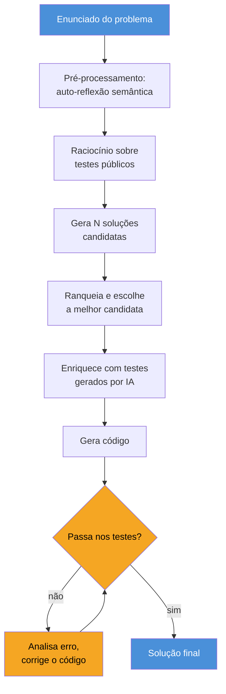
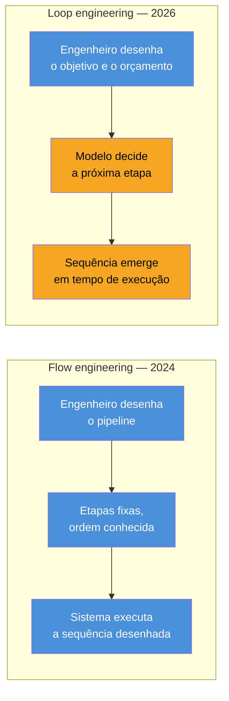

# Flow engineering — o precursor que ninguém cita

> [!abstract] TL;DR
> Em junho de 2026, dev Twitter "descobriu" que agentes de código deveriam gerar, rodar teste, corrigir e repetir — e batizou isso de *loop engineering*. Em janeiro de 2024, dois anos e meio antes, o paper do AlphaCodium (Codium AI, hoje Qodo) já tinha um nome pra exatamente essa ideia: *flow engineering*. O mecanismo é quase o mesmo. O que mudou não foi a ideia — foi quem decide a próxima etapa. No flow, era o engenheiro, desenhando o pipeline à mão. No loop, é o próprio modelo. Essa é a diferença real, e ela é ensinável. O resto — o nome que sumiu, o nome que pegou — é história de branding, não de engenharia.

---

## Uma descoberta com data de validade

Voltemos a junho de 2026. Um punhado de nomes influentes do dev Twitter — Addy Osmani, Peter Steinberger, gente comentando uma fala de Boris Cherny — chegou, quase em coro, à mesma conclusão: agentes de codificação trabalham melhor quando não recebem um prompt único, mas entram num ciclo. O agente gera código, roda os testes, lê o resultado, corrige, roda de novo. Repete até passar. Chamaram isso de *loop engineering*, e o termo pegou fogo — a thread de Steinberger sobre o assunto passou de meio milhão de visualizações.

Havia algo genuinamente novo ali, e a nota seguinte deste galho — [[05 - Loop engineering — o motor de 4 tempos e as 4 traições]] — vai te mostrar o quê. Mas o *esqueleto* da ideia — gerar, testar, corrigir, repetir — não nasceu em 2026. Ele tem um nome, um paper e uma data de publicação: **AlphaCodium**, da Codium AI (empresa que hoje se chama Qodo), publicado em janeiro de 2024 sob o título "Code Generation with AlphaCodium: From Prompt Engineering to Flow Engineering" (arXiv 2401.08500).

> [!question]- Se a ideia já existia, por que ninguém no debate de 2026 citou o paper?
> Essa é exatamente a pergunta que esta nota tenta responder — e a resposta não é "porque a ideia era diferente". É mais interessante do que isso: tem a ver com quem estava ouvindo, de onde veio a voz, e com que outros termos o *flow engineering* competia por atenção em 2024. Chegamos lá.

O próprio título do paper já entrega o argumento central: **"de prompt engineering para flow engineering"**. Os autores identificaram, em janeiro de 2024, a mesma transição de camada que o dev Twitter redescobriu em junho de 2026 — só que com outro nome na segunda metade do título.

Isso não é uma acusação de plágio, nem uma tentativa de diminuir a conversa de 2026 — Osmani, Steinberger e os outros nomes envolvidos provavelmente nunca tinham lido, ou não se lembravam, de um paper de geração de código competitivo publicado dois anos e meio antes num nicho de pesquisa bem específico. Isso também é normal: a literatura técnica cresce rápido demais para qualquer pessoa acompanhar tudo, e boa parte da inovação em engenharia é redescoberta legítima, não cópia. O interessante aqui não é "quem copiou quem" — é o que essa lacuna de citação revela sobre como o campo de IA aplicada absorve (ou não absorve) sua própria história recente. Esse é o assunto real desta nota.

---

## O problema que o AlphaCodium queria resolver

Para entender por que o flow existe, é preciso primeiro entender o problema que o prompt engineering *não* resolve: geração de código para problemas de programação competitiva.

Pense num desafio de plataforma tipo Codeforces: um enunciado em linguagem natural, cheio de casos de borda implícitos, restrições numéricas específicas, e uma exigência brutal — o código tem que compilar, rodar e produzir a saída *exata*, char por char, para um conjunto de testes ocultos. Não existe "quase certo". Ou o código passa em todos os testes, ou falha.

Compare isso com o tipo de tarefa em que prompt engineering brilha: escrever um e-mail, resumir um documento, responder uma pergunta de forma útil. Nessas tarefas, "quase certo" quase sempre é aceitável — um resumo pode capturar 90% dos pontos importantes e ainda ser genuinamente útil. Geração de código competitivo não perdoa esse tipo de aproximação. Um algoritmo que resolve 99% dos casos de teste, mas falha silenciosamente num caso de borda com N no limite máximo da restrição, é reprovado com a mesma severidade que um algoritmo completamente errado. É esse regime de tudo-ou-nada que expõe o limite de "só escreva um bom prompt" — e que justifica, sem exagero retórico, a mudança de unidade de design que o AlphaCodium propôs.

Prompt engineering — a arte de escrever a instrução perfeita — tem um teto baixo aqui. Você pode escrever o prompt mais bem lapidado do mundo pedindo "resolva este problema e gere um código Python correto", e o modelo ainda vai errar um caso de borda que nunca apareceu explicitamente no enunciado. A razão é estrutural: linguagem natural otimizada (a técnica clássica de prompt engineering — few-shot, chain-of-thought, especificar o formato de saída) ataca problemas de *compreensão* e *estilo*. Geração de código competitivo é um problema de *correção exaustiva contra um oráculo* — os testes. São categorias diferentes de dificuldade, e a segunda não cede à primeira.

Os autores do AlphaCodium relatam algo revelador sobre o próprio processo de pesquisa deles: cerca de **95% do esforço de desenvolvimento** não foi gasto lapidando o texto de nenhum prompt individual — foi gasto desenhando a arquitetura de alto nível do fluxo e decidindo que dados injetar em cada etapa. Essa proporção sozinha já é o argumento do paper resumido em uma frase: a alavancagem não está mais na frase, está no desenho do pipeline.

> [!info] Quem é a Codium AI/Qodo
> A empresa por trás do paper — Codium AI, que depois se renomeou Qodo — constrói ferramentas de geração e revisão de código assistida por IA voltadas a times de engenharia, não um laboratório de pesquisa acadêmica pura como a DeepMind. O AlphaCodium nasceu, portanto, de uma motivação prática: melhorar um produto de geração de código, não apenas publicar um resultado acadêmico. Isso ajuda a explicar o foco do paper em eficiência de custo (poucas chamadas ao modelo) além de acurácia bruta — uma preocupação de produto, não só de benchmark.

---

## O mecanismo: um flow test-driven, etapa por etapa

Aqui está o que o AlphaCodium efetivamente faz — e vale seguir de perto, porque cada etapa resolve um problema específico que uma chamada única ao modelo não resolveria.

### 1. Pré-processamento com auto-reflexão

Antes de gerar qualquer código, o flow pede ao modelo para **refletir sobre o problema em texto natural**, decompondo o enunciado em uma lista de seções semânticas — o que é pedido, quais são as entradas, quais são as restrições, o que conta como caso de borda. Não é um resumo: é uma decomposição estruturada que força o modelo a articular entendimento antes de comprometer-se com uma solução.

Essa etapa sozinha já captura uma classe inteira de erros. Modelos de linguagem, quando pedidos para "escreva o código", frequentemente pulam direto para a implementação e só descobrem no meio do caminho que mal-entenderam uma restrição. Forçar a reflexão como etapa separada — sem ainda escrever uma linha de código — empurra esse mal-entendido para a superfície cedo, quando é barato de corrigir.

### 2. Raciocínio sobre os testes públicos

O problema chega com alguns testes de exemplo (os "testes públicos" — pares entrada/saída que o enunciado já fornece). O flow examina esses pares e raciocina explicitamente sobre eles: o que cada teste está validando, que padrão de comportamento ele revela que o enunciado, em prosa, talvez tenha deixado implícito.

Testes são especificação executável. Um enunciado em linguagem natural pode ser ambíguo; um par entrada-saída não é. Essa etapa usa os testes públicos como uma segunda fonte de verdade, cruzando-a com a reflexão da etapa 1.

### 3. Geração de múltiplas soluções possíveis, e ranqueamento

Em vez de comprometer-se com uma única abordagem algorítmica, o flow gera **várias soluções candidatas** e as ranqueia por plausibilidade e qualidade. Isso é busca, não commitment cego na primeira ideia que o modelo teve — uma técnica que já aparecia em formas mais simples no debate de prompt engineering (self-consistency, tree-of-thought), mas aqui aplicada dentro de um pipeline com etapas de validação real, não apenas votação entre amostras.

A diferença prática é que o ranqueamento aqui não é "qual resposta a maioria das amostras concorda" — é "qual candidata melhor explica os testes públicos e a reflexão da etapa 1". É um critério de seleção ancorado em evidência externa (os testes), não em consenso estatístico entre gerações do próprio modelo. Essa ancoragem em evidência externa, e não em auto-consistência, é um fio que reaparece com força total na nota [[07 - Grounded vs ungrounded — tocar a realidade]], mais adiante neste galho.

### 4. Enriquecimento com testes gerados por IA

Esta é a etapa que dá nome ao "test-driven" do flow. Os testes públicos do enunciado normalmente não cobrem todos os casos de borda — um problema de competição pode ter dois ou três exemplos visíveis, cobrindo uma fração pequena do espaço de comportamento esperado. O AlphaCodium usa o próprio modelo para **gerar testes adicionais**, ampliando a cobertura antes mesmo de qualquer código ser escrito contra eles.

> [!info] Por que gerar testes antes de gerar código, e não depois?
> Porque testes escritos depois do código tendem a confirmar o que o código já faz — vício de confirmação, só que automatizado. Testes gerados a partir do enunciado, antes do código existir, têm mais chance de expor exatamente os casos de borda que o código ainda vai errar.

### 5. Geração e correção iterativa contra os pares entrada-saída

Só then o código é efetivamente escrito — e imediatamente rodado contra o conjunto de testes (públicos + gerados). Quando falha, o flow não descarta e recomeça do zero: ele analisa o erro específico, ajusta a solução, e roda de novo. O paper descreve isso como "decisões soft com dupla validação" — o modelo regenera e corrige, iterando até os testes passarem ou o orçamento de iterações se esgotar.

É essa etapa — gerar, rodar, ler o erro, corrigir, repetir — que é *estruturalmente idêntica* ao que o dev Twitter batizou de loop engineering dois anos e meio depois. A pergunta que fica pendurada até a próxima seção é: se o mecanismo é o mesmo, por que os nomes são diferentes?

Vale notar um detalhe de engenharia que passa despercebido numa leitura rápida: o "corrigir" desta etapa não é "descartar tudo e gerar do zero" a cada falha. É correção incremental — o flow identifica, a partir da mensagem de erro ou do teste que falhou, qual parte específica do código provavelmente está errada, e ajusta só aquela parte. Regenerar do zero a cada iteração seria mais simples de implementar, mas desperdiçaria o trabalho de raciocínio já feito nas etapas anteriores — e arriscaria reintroduzir, na nova tentativa, exatamente o mesmo erro que acabou de ser corrigido, ou um erro novo em uma parte que já estava correta.

> [!warning] Isto é uma iteração *test-driven*, não uma iteração livre
> Cada volta do laço tem um alvo objetivo e binário: passar ou não passar num conjunto de testes previamente fixado. Não há "o modelo decide quando parar por conta própria" — o critério de parada é externo e mecânico. Guarda esse detalhe: ele é o fio que puxa toda a seção seguinte.

### Seguindo um problema pela esteira, do início ao fim

Vale tornar isso concreto com um exemplo genérico — não um problema real do paper, mas o tipo de problema que o CodeContests contém, para você visualizar cada etapa em ação.

Imagine o enunciado: "dada uma lista de N inteiros, encontre o menor número de operações para tornar todos os elementos iguais, onde uma operação é incrementar ou decrementar um elemento em 1". Parece simples. Mas tem uma pegadinha clássica de competição escondida: N pode chegar a milhões, então uma solução por força bruta (testar todo par de elementos) estoura o tempo limite — o enunciado nunca diz isso explicitamente, você tem que inferir pela restrição numérica.

- Na etapa de **auto-reflexão**, o flow decompõe: "objetivo = igualar todos os elementos; operação = ±1 por elemento; N pode ser grande (restrição menciona até 10⁶) → força bruta O(N²) é candidata a estourar tempo".
- No **raciocínio sobre testes públicos**, o flow olha os dois ou três exemplos dados e confirma: a saída esperada bate com "mover todos os elementos até a mediana" — uma pista algorítmica que o enunciado não disse em palavras, mas os pares entrada-saída revelam.
- Na etapa de **geração de candidatas**, o flow propõe mais de uma abordagem — por exemplo, mover até a média (errado, mas plausível à primeira vista) e mover até a mediana (correto) — e ranqueia a segunda mais alto por bater com os testes públicos.
- No **enriquecimento de testes**, o flow gera casos extras que o enunciado não deu: lista com um único elemento, lista já uniforme, lista com números negativos, N no limite máximo da restrição — exatamente os casos de borda que fariam uma solução ingênua falhar silenciosamente.
- Na **geração e correção iterativa**, o código é escrito, roda contra o conjunto ampliado de testes, e se falhar no caso de N grande por timeout, o flow lê esse erro específico e ajusta a implementação — trocando, por exemplo, uma ordenação desnecessária por uma mais eficiente — sem precisar reformular o problema do zero.

Nenhuma dessas cinco etapas, sozinha, é sofisticada. A força do flow está em como elas se encadeiam: cada etapa produz um artefato (uma reflexão, um teste, uma candidata ranqueada) que a etapa seguinte consome. É orquestração de artefatos, não só de tokens.

---

## O resultado: acima do AlphaCode, acima do competidor médio

O paper não vende a ideia apenas na elegância do desenho — ele mede. Na validação sobre o CodeContests (dataset de problemas de programação competitiva vindos de plataformas como o Codeforces), a diferença entre prompt único e flow é o número mais citado do paper: usando GPT-4, a acurácia (pass@5 — a solução é considerada correta se acertar em até 5 tentativas) saltou de **19% com um único prompt bem desenhado para 44% com o flow do AlphaCodium**. Mais que dobrar a taxa de acerto sem trocar o modelo por baixo — só trocando a arquitetura ao redor dele.

A escala do teste também merece registro, porque desmonta uma dúvida legítima — "isso não é só um resultado bonito num punhado de problemas escolhidos a dedo?". A avaliação cobriu 117 problemas do conjunto de validação e 165 do conjunto de teste do CodeContests — números pequenos comparados a benchmarks de linguagem natural, mas típicos (e caros de ampliar) em avaliação de geração de código competitivo, onde cada problema exige verificação contra um oráculo de testes reais, não apenas comparação textual.

A comparação que dá título a esta seção é com o **AlphaCode**, sistema da DeepMind publicado em 2022 especificamente para este mesmo tipo de problema. O AlphaCode usava um orçamento de computação massivo — gerando e filtrando um número enorme de candidatas por problema — para atingir, em média, uma colocação equivalente ao **top 54,3%** dos competidores em disputas do Codeforces com mais de 5 mil participantes: ou seja, superior à mediana, mas não por muito. O AlphaCodium superou esse patamar com uma fração da computação — o próprio paper reporta uma ordem de grandeza dramaticamente menor de chamadas ao modelo por solução (na casa de 15 a 20 chamadas, contra o orçamento de busca massiva do AlphaCode).

> [!example] O que "superar o desenvolvedor médio" significa aqui
> Ficar acima do top 54,3% do Codeforces não é "resolver qualquer problema de programação" — é performar, num benchmark de competição estruturado, melhor do que a mediana de programadores competitivos que treinam especificamente para esse tipo de desafio. É um resultado real e mensurável, mas vale ler com o escopo certo: é sobre problemas de competição com testes de correção exata, não sobre desenvolvimento de software em produção.

O ponto de comparação relevante não é "o AlphaCodium é melhor modelo que o GPT-4 usado pelo AlphaCode" — é o mesmo modelo de base, orquestrado de forma diferente, produzindo resultado muito superior. É a demonstração empírica exata da tese deste galho inteiro: a unidade de design importa mais do que o modelo por baixo dela.

Vale notar também o que esse resultado *não* prova. O AlphaCodium não venceu por ter um modelo melhor, nem por ter mais dados de treino, nem por qualquer vantagem que dependesse de acesso privilegiado a infraestrutura fora do alcance de outros times. Ele venceu por desenhar melhor o *entorno* da chamada ao modelo — a mesma alavanca que este galho inteiro persegue, camada após camada. Isso é, ao mesmo tempo, a parte animadora da história (a alavanca está disponível para qualquer engenheiro disposto a desenhar o pipeline certo) e a parte que exige humildade (o desenho certo não é óbvio, e o paper reporta que boa parte do trabalho foi tentativa e erro sobre a arquitetura, não sobre o prompt).

---

## O ponto historiográfico: a ideia sobreviveu, o nome não

Aqui está o coração desta nota, e vale isolar a frase porque ela resume tudo: **a ideia sobreviveu, o nome não.**

Compare as duas descrições, lado a lado:

- **Flow engineering (AlphaCodium, jan/2024):** um pipeline de etapas fixas — pré-processar, refletir sobre testes, gerar candidatas, ranquear, enriquecer testes, gerar código, iterar contra os testes até passar. Cada etapa foi *desenhada por um humano*, com antecedência, e é a mesma sequência para todo problema que passa pelo sistema.
- **Loop engineering (dev Twitter, jun/2026):** um agente que gera código, roda teste, lê o erro, corrige, repete — mas o *agente* decide quantas voltas dar, quando desviar da abordagem, quando parar, e às vezes até que ferramentas invocar em cada volta. A sequência não é fixa; ela emerge da decisão do modelo em tempo de execução.

O esqueleto mecânico — gerar, testar, corrigir, repetir — é o mesmo esqueleto. O que mudou não foi a forma do laço. Foi **quem decide a próxima etapa**.

No flow, é o engenheiro. Ele senta, desenha o diagrama, decide que depois do pré-processamento vem o raciocínio sobre testes, e que depois disso vem geração de candidatas — e essa ordem está fixada no código do sistema antes de qualquer problema específico chegar. O flow não decide "pular a etapa de reflexão porque este problema parece fácil": ele passa por todas as etapas, sempre, porque foi assim que o humano desenhou.

No loop, é o modelo. O agente que hoje resolve um bug, roda o teste, e decide sozinho se vale a pena tentar outra abordagem ou se o próximo passo é investigar um arquivo diferente — essa decisão não está fixada em nenhum diagrama desenhado à mão. Está delegada, em tempo real, para o próprio modelo, dentro de um orçamento de iterações e um critério de parada, mas sem um roteiro passo-a-passo escrito de antemão.

> [!question]- Isso não é só semântica — "flow" e "loop" parecem quase sinônimos?
> É a pergunta certa a fazer, e a resposta é não, mas o motivo importa mais do que a conclusão. Se a diferença fosse só de vocabulário, esta nota seria sobre marketing e ponto final. A diferença real é operacional: quem decide a próxima etapa determina onde o erro pode entrar no sistema, quem é responsável por ele, e quanto custa mudar o comportamento. Num flow, um bug de comportamento se corrige editando o diagrama — o humano muda a etapa 3, testa, publica. Num loop, o mesmo bug pode exigir mudar o *critério* pelo qual o modelo decide a próxima etapa — um problema de uma ordem de abstração acima. Essa é uma distinção concreta e ensinável, com consequências de engenharia diferentes — não um sinônimo com roupa nova.

Vale notar, com honestidade, que essa comparação não estava disponível para os autores do AlphaCodium em 2024 — a autonomia de decidir a "próxima etapa" em tempo real exigia modelos e harnesses (ambientes de execução com ferramentas, memória de sessão, orçamento de chamadas) que só amadureceram entre 2025 e 2026. O flow de 2024 não é uma versão "incompleta" do loop de 2026 por falta de visão dos autores — é uma resposta correta ao que era possível construir com confiabilidade na época. A infraestrutura de agentes autônomos simplesmente não estava lá ainda.

> [!example] Um bug real, tratado dos dois jeitos
> Imagine que o pipeline (flow ou loop) começa a gerar código que ignora sistematicamente um caso de borda — números negativos, por exemplo. Num flow, você abre o diagrama, identifica que a etapa de "enriquecimento de testes" não estava gerando casos com números negativos, ajusta a lógica daquela etapa especificamente, republica, e o comportamento muda de forma previsível para *todo* problema que passar pelo pipeline dali em diante. Num loop, o mesmo sintoma pode não ter uma etapa única para editar — pode estar no critério que o próprio modelo usa para decidir "os testes que já tenho são suficientes, vou seguir para o código". Corrigir isso significa mexer no objetivo, no prompt de sistema que orienta a decisão, ou no orçamento de iterações — uma mudança de uma ordem de abstração acima, com efeito mais difícil de prever e testar isoladamente antes de publicar.

---

## Por que o nome não pegou

Esta seção mistura fato documentado com inferência — e o divisor fica marcado.

**Fato documentado:** o paper existe desde janeiro de 2024, tem um título que nomeia explicitamente a transição ("From Prompt Engineering to Flow Engineering"), foi publicado por uma empresa (Codium AI, hoje renomeada Qodo) especializada em geração e revisão de código assistida por IA, e reporta resultados quantitativos verificáveis contra um benchmark público (CodeContests) e contra um sistema concorrente conhecido (AlphaCode, da DeepMind).

**Inferência razoável, não fato provado**, sobre por que "flow engineering" não se tornou o termo dominante em 2026:

- **Competição de vocabulário.** Em 2024, "flow engineering" tinha que competir por atenção com um vocabulário que já estava se consolidando ao redor de "agents" e "chains" — o próprio LangChain, com sua popularidade crescente, empurrava o público para pensar em termos de "chain" e "agent", não de "flow". Um termo novo entrando num campo onde outros dois já disputavam mindshare tem uma barreira extra para virar padrão.
- **Origem institucional, não de figura de comunidade.** O termo "loop engineering" ganhou tração porque foi carregado por vozes individuais com audiência própria no dev Twitter — Addy Osmani, Peter Steinberger — comentando e re-narrando uma observação. "Flow engineering" veio de um paper técnico assinado por uma empresa. Não há, no material disponível, uma figura equivalente carregando o termo para fora do paper e para dentro da conversa pública recorrente.
- **Público diferente.** Em janeiro de 2024, quem lia papers de geração de código competitivo era majoritariamente a comunidade de pesquisa em code generation — não o público mais amplo de desenvolvedores usando agentes de codificação no dia a dia, que só começou a crescer em escala a partir de 2025-2026 com ferramentas como Claude Code. O termo nasceu no lugar certo para ser citado em outros papers, e no lugar errado para virar hashtag.
- **Momento do ciclo de hype era outro.** Janeiro de 2024 era, ainda, a fase em que boa parte da atenção pública em torno de LLMs estava concentrada em prompt engineering propriamente dito — técnicas como chain-of-thought e few-shot prompting ainda dominavam a conversa, e a ideia de que "a frase certa" deixaria de ser o gargalo central ainda não tinha se popularizado fora de círculos técnicos avançados. Um paper anunciando a superação do prompt engineering, num momento em que o prompt engineering ainda era o assunto do dia, tinha uma audiência natural menor do que teria em 2026, quando "a frase certa não basta mais" já era senso comum.

Nenhum desses quatro pontos está documentado como causa oficial no material desta pesquisa — são leituras plausíveis do padrão observado, oferecidas como tal.

---

## Outros precursores esquecidos: uma linhagem mais longa

O AlphaCodium não é o único capítulo que a conversa de 2026 pulou. A linhagem real do que virou "loop engineering" é mais longa, e vale traçá-la em detalhe — não como lista de nomes, mas como uma sequência causal, onde cada elo resolve uma limitação específica do anterior.

### ReAct (2022) — a semente conceitual

Dois anos antes do AlphaCodium, quatro antes de "loop engineering" virar termo de dev Twitter, o paper ReAct formalizou algo que hoje parece óbvio, mas não era: intercalar *raciocínio* (reasoning, texto livre onde o modelo "pensa em voz alta") com *ação* (acting, uma chamada de ferramenta ou uma decisão concreta), observar o resultado dessa ação, e alimentar essa observação de volta no próximo passo de raciocínio. Antes do ReAct, a prática comum era ou pedir para o modelo pensar (chain-of-thought, sem agir) ou pedir para ele agir direto (chamar uma ferramenta, sem verbalizar por quê). O ReAct uniu as duas coisas num único ciclo — pensar, agir, observar, pensar de novo — e esse ciclo é, estruturalmente, o ancestral mais remoto de tudo que viria depois: do flow do AlphaCodium ao loop de 2026. A diferença entre o ReAct e o AlphaCodium não é o ciclo em si — é que o AlphaCodium fechou esse ciclo especificamente contra testes, com um pipeline desenhado à mão etapa por etapa, enquanto o ReAct deixava a estrutura do raciocínio mais aberta.

### AutoGPT (2023) — a primeira desilusão em escala

Se o ReAct foi a semente conceitual, o AutoGPT foi a primeira vez que essa semente virou fenômeno público. Lançado em 2023, ele prometia algo que soava quase mágico: dê um objetivo de alto nível — "pesquise X e me entregue um relatório" — e o agente decompõe sozinho em subtarefas, executa uma atrás da outra, sem roteiro fixo desenhado por um humano. Por um momento, foi o projeto mais comentado da comunidade de IA aplicada.

E então veio a desilusão, quase tão rápida quanto o entusiasmo. Agentes do AutoGPT driftavam do objetivo original em execuções mais longas, entravam em loops improdutivos repetindo a mesma tentativa fracassada, e consumiam orçamento de API sem convergir para nada útil. Essa fase de desilusão não é um detalhe de rodapé — é um dado relevante para quem lê sobre loop engineering em 2026 com entusiasmo renovado: a ideia de "deixe o modelo decidir sozinho, do início ao fim, sem supervisão" já tinha sido tentada, em escala pública, e tinha esbarrado exatamente nos problemas que a nota [[05 - Loop engineering — o motor de 4 tempos e as 4 traições]] cataloga em detalhe — métricas gamed, drift, decadência do critério de parada. O AutoGPT não estava "errado" tecnicamente; estava cedo, sem os freios (orçamento delimitado, critérios de parada mais robustos, human-in-the-loop pontual) que as gerações seguintes aprenderiam a adicionar.

### "Ralph Wiggum" de Geoffrey Huntley (jul/2025) — o elo mais próximo

Entre o AutoGPT de 2023 e o "loop engineering" de 2026, há um elo direto e recente: o padrão que Geoffrey Huntley apelidou informalmente de "Ralph Wiggum", em referência à simplicidade quase ingênua do personagem de "Os Simpsons". A receita é deliberadamente crua: um loop de shell script que repete o *mesmo* prompt, sem modificação nenhuma no texto, até o objetivo declarado ser atingido — o agente, a cada volta, reavalia o estado atual do trabalho e decide o que fazer a seguir, mas o prompt que o invoca continua idêntico de volta em volta.

É o elo mais direto entre o flow desenhado à mão de 2024 e o loop autônomo consolidado em 2026: já é, tecnicamente, um agente decidindo sozinho o que fazer em cada iteração — a mesma delegação de decisão que caracteriza o loop engineering — mas publicado um ano antes do termo pegar, sem o vocabulário e sem a arena de discussão (dev Twitter em peso, com contagem de visualizações na casa das centenas de milhares) que "loop engineering" ganharia depois. Rastrear essa linha — ReAct, AutoGPT, Ralph Wiggum, e só então o termo — deixa claro que "loop engineering" não é uma invenção de junho de 2026: é a quarta ou quinta vez que a comunidade batiza a mesma ideia, cada vez com um pouco mais de infraestrutura ao redor dela.

O padrão que emerge dessa linhagem inteira — ReAct em 2022, AutoGPT em 2023, AlphaCodium em janeiro de 2024, Ralph Wiggum em julho de 2025, e só então "loop engineering" como termo consolidado em junho de 2026 — é que a distância entre a primeira demonstração de uma ideia e o momento em que ela recebe um nome que gruda é, tipicamente, medida em anos, não em meses. Quem chega primeiro raramente é quem nomeia; quem nomeia raramente é quem chega primeiro.

| Marco | Quando | O que mudou em relação ao anterior |
|---|---|---|
| ReAct | 2022 | Formaliza o ciclo pensar → agir → observar → pensar |
| AutoGPT | 2023 | Aplica o ciclo a objetivos de alto nível, sem roteiro fixo — e revela os riscos de fazer isso sem freios |
| AlphaCodium (flow engineering) | jan/2024 | Fecha o ciclo contra testes, com etapas desenhadas à mão e ordem fixa |
| Ralph Wiggum | jul/2025 | O agente decide sozinho o que fazer a cada volta, com um único prompt fixo repetido |
| "Loop engineering" (termo) | jun/2026 | O ciclo ganha nome de disciplina, audiência de dev Twitter, e freios mais maduros (orçamento, critério de parada) |

Ler essa tabela de cima para baixo é ver a mesma ideia sendo retrabalhada com um pouco mais de infraestrutura de confiabilidade a cada rodada — não uma sequência de invenções desconectadas.

---

## Ceticismo: isso é só rebranding?

Vale confrontar a leitura mais cínica de frente, porque ela existe e tem parte de razão. Uma crítica recorrente ao anúncio de "loop engineering" em 2026 — o tipo de comentário que aparece nas respostas de qualquer thread viral sobre o assunto — é essencialmente: "isso não é novo, é o mesmo loop do Ralph/goal de sempre, só com nome de marketing".

Essa crítica acerta o fato histórico: o mecanismo realmente não é novo, como esta nota inteira documentou. Onde ela erra, ou pelo menos simplifica demais, é em tratar "o loop" como a novidade inteira do debate de 2026. A cobertura mais cuidadosa do fenômeno — e não apenas o entusiasmo inicial das threads — aponta que o elemento genuinamente novo não é o loop em si, é a **supervisão multi-agente** ao redor dele: múltiplos loops rodando em paralelo, cada um com seu próprio objetivo, sendo coordenados, auditados e às vezes cancelados por uma camada acima. É exatamente esse elemento — loops que vigiam outros loops — que puxa a conversa para "graph engineering" poucas semanas depois, tema da nota [[06 - Graph engineering — a confiabilidade mora nas arestas]].

Há ainda uma segunda camada de ceticismo, mais estrutural, que vale carregar: orquestração de etapas via grafo dirigido (DAG) não é novidade nenhuma na engenharia de software em geral — Airflow existe desde 2014, Step Functions e outros motores de workflow são anteriores a qualquer LLM. A pergunta honesta, ao ver "flow" e depois "loop" e depois "graph" desfilarem como se fossem descobertas originais, não é "isso é novo?" — quase nunca é, no sentido de estrutura de orquestração. A pergunta é **o que muda quando os nós desse grafo passam a ser estocásticos** — quando a "tarefa" executada em cada nó não tem resultado determinístico, e a "aresta" que liga um nó ao seguinte pode ser decidida por um modelo de linguagem em vez de uma condição booleana escrita por um engenheiro. Essa é a única parte genuinamente nova de toda essa história — e ela está, apropriadamente, escondida atrás de um vocabulário que soa como se tudo fosse originalíssimo.

> [!warning] O nome vende a novidade inteira; o mecanismo vende só uma fração dela
> Toda vez que um termo novo aparece anunciando ter resolvido algo, vale separar o que é genuinamente inédito (aqui: nós estocásticos dentro de uma estrutura de orquestração antiga) do que é reembalagem de uma prática já testada (aqui: o próprio ciclo gerar-testar-corrigir, que remonta a 2022 e 2024). As duas coisas coexistem no mesmo anúncio, e só uma delas merece o entusiasmo.

Há ainda um ceticismo de custo, que já valia para o AlphaCodium em 2024 e vale ainda mais para qualquer versão autônoma do mesmo ciclo em 2026: cada volta do laço — flow ou loop — é uma ou mais chamadas ao modelo, e cada chamada tem um preço. O AlphaCodium foi desenhado, em parte, para minimizar esse custo (15 a 20 chamadas por solução, ordens de grandeza abaixo do orçamento do AlphaCode), mas um pipeline mal calibrado, ou um loop sem orçamento máximo de iterações bem definido, pode facilmente entrar num regime onde o custo de tentar de novo supera o valor da tentativa. Esse é exatamente o tipo de risco de "tokenmaxxing" — gastar cada vez mais chamadas sem retorno proporcional — que reaparece, com mais força, na discussão de loop engineering na próxima nota deste galho.

---

## A lição transferível

Esta é a parte que vale carregar para fora desta nota específica, porque ela se repete em cada capítulo deste galho: quando alguém anuncia a próxima camada — a próxima "engineering" da vez —, a pergunta útil não é "isso é novo?". Quase nunca é, no sentido absoluto. Alguém, em algum paper ou repositório menos visível, já fez algo estruturalmente parecido antes.

A pergunta que realmente separa hype de sinal é outra: **o que exatamente mudou de dono — a decisão, o custo, ou só o nome?**

- Se a decisão mudou de dono (do engenheiro para o modelo, como no salto de flow para loop), há uma mudança de engenharia real, com consequências concretas em como você debuga, versiona e responsabiliza o sistema.
- Se o custo mudou de dono (ficou mais barato fazer o que já era possível, como no salto de AlphaCode — busca massiva — para AlphaCodium — 15 a 20 chamadas), há uma mudança de acessibilidade real, mesmo sem mudança conceitual.
- Se só o nome mudou — mesma técnica, mesmo custo, mesma decisão, embalagem nova — você está lendo marketing, e o paper de dois anos atrás vai te dizer isso em cinco minutos de leitura.

Antes deste galho terminar, essa pergunta vai reaparecer em toda camada seguinte — inclusive na mais recente, que também vai envelhecer.

---

## Prompt engineering não desapareceu dentro do flow

Vale um parêntese, porque é fácil ler o título do paper — "de prompt engineering para flow engineering" — como "prompt engineering morreu, flow engineering o substituiu". Não é isso que acontece dentro do próprio AlphaCodium.

Cada etapa do flow — a auto-reflexão, o raciocínio sobre testes, a geração de candidatas, o enriquecimento de testes, a correção iterativa — é, ela mesma, executada por uma chamada ao modelo com um prompt cuidadosamente desenhado. O flow não elimina o prompt; ele **multiplica** o prompt em várias chamadas especializadas, cada uma menor e mais focada do que o prompt monolítico que tentaria fazer tudo de uma vez. Escrever bem o prompt de cada etapa continua sendo trabalho de prompt engineering — só que agora é prompt engineering aplicado a uma etapa específica dentro de uma arquitetura maior, não a "a" pergunta única que o sistema inteiro depende. É a mesma relação que a nota [[02 - Prompt engineering — o que morreu e o que sobrou]] detalha para as camadas seguintes: a habilidade não morre, ela migra de protagonista para componente.

---

## Onde o flow sobrevive hoje, mesmo sem o nome

Vale fechar o argumento historiográfico com uma observação prática, porque ela mostra que "flow engineering" não morreu — só deixou de precisar de nome próprio por ter virado padrão implícito.

Praticamente toda ferramenta de codificação agêntica em uso em 2026 — os agentes por trás de [[Claude Code]] e de concorrentes no mesmo espaço, documentados no galho [[Agentes de Codificação]] — incorpora, de alguma forma, o mesmo esqueleto que o AlphaCodium formalizou primeiro: gerar uma mudança de código, rodar os testes existentes (ou gerar novos quando faltam), ler o resultado, corrigir, repetir. Isso não é mais anunciado como uma técnica separada com nome próprio — é assumido como o comportamento padrão esperado de qualquer agente de codificação decente. A prática venceu; o rótulo "flow engineering" não sobreviveu ao processo de virar padrão de fato, precisamente porque padrões de fato tendem a perder o nome no caminho — ninguém chama HTTP de "protocol engineering" hoje, embora alguém tenha precisado nomear e defender a ideia na época.

Essa mesma lógica de ciclo test-driven é também o objeto central da nota [[03-Dominios/Tecnologia/IA/Improvement Loop/01 - O ciclo eval → diff → ship|O ciclo eval → diff → ship]], dentro do galho [[Improvement Loop]] — que trata, num nível mais amplo que geração de código único, do laço geral entre medir, mudar e publicar. Vale a leitura cruzada: o AlphaCodium é uma instância especializada, aplicada a um domínio fechado (competição de programação), do mesmo padrão geral que aquele galho documenta para sistemas de produção inteiros.

> [!question]- Se o padrão já está embutido nas ferramentas, por que ainda vale estudar o paper original?
> Porque entender o mecanismo original — por que a auto-reflexão vem antes da geração de testes, por que os testes são enriquecidos antes do código ser escrito, por que a correção é iterativa contra um oráculo fixo — ajuda a diagnosticar quando um agente de codificação moderno está se comportando mal. Se você sabe que a ordem "refletir → enriquecer testes → gerar → corrigir" existe por uma razão específica, reconhece mais rápido quando uma ferramenta pula uma etapa (por exemplo, gera código sem testes suficientes) e explica parte do porquê ela está errando mais do que deveria.

---

## Flow vs. loop, lado a lado

Para fechar com algo que você possa aplicar na próxima decisão de arquitetura, aqui está a distinção condensada em cinco eixos:

| Eixo | Flow engineering (2024) | Loop engineering (2026) |
|---|---|---|
| Quem decide a próxima etapa | O engenheiro, no desenho do pipeline | O modelo, em tempo de execução |
| Sequência de etapas | Fixa, conhecida antes de rodar | Emergente, varia por tarefa |
| Onde entra o erro de comportamento | Numa etapa específica do diagrama | No critério de decisão do modelo |
| Como se corrige um comportamento indesejado | Editando a etapa no pipeline | Ajustando o objetivo, o orçamento ou o critério de parada |
| Previsibilidade de custo (chamadas ao modelo) | Alta — número de etapas é conhecido | Variável — depende de quantas voltas o modelo decidir dar |
| Facilidade de debug | Mais fácil — cada etapa é isolável e testável | Mais difícil — o comportamento emerge da interação entre voltas |

Nenhuma linha dessa tabela declara um vencedor. Um flow fixo continua sendo a escolha certa quando o espaço do problema é bem conhecido de antemão e a previsibilidade importa mais que a flexibilidade — pipelines de CI, geração de relatório, validação de formulário estruturado. Um loop autônomo compensa a perda de previsibilidade quando o espaço do problema é grande demais, ou muda rápido demais, para caber num diagrama desenhado à mão — o exato cenário que a próxima nota deste galho explora.

> [!question]- Isso significa que todo sistema deveria migrar de flow para loop?
> Não — e essa é talvez a armadilha mais comum de quem lê sobre a "camada mais nova" e assume que ela substitui a anterior por definição. O AlphaCodium continua sendo, hoje, uma escolha de arquitetura defensável para o problema que ele resolve: correção exaustiva contra um oráculo de testes, num domínio fechado e bem definido. Trocar aquele flow fixo por um loop autônomo não tornaria o sistema melhor — tornaria o comportamento menos previsível para um problema que já era resolvido com previsibilidade total. A pergunta não é "qual camada é mais nova", é "qual unidade de design combina com a forma do meu problema".

### Um exemplo de decisão, para tornar isso concreto

Imagine que você está desenhando um sistema de revisão automática de pull requests para o seu time. Dois formatos de solução aparecem na sua cabeça:

- **Formato flow:** um pipeline fixo — extrai o diff, roda o linter, roda os testes existentes, gera um resumo do que mudou, verifica se a cobertura de testes caiu, posta um comentário estruturado. Seis etapas, sempre as mesmas seis, em sempre a mesma ordem, para todo PR.
- **Formato loop:** um agente que recebe o PR e decide sozinho o que investigar — talvez rode os testes primeiro, talvez leia o código relacionado antes, talvez decida que este PR específico merece uma checagem extra de segurança que outro PR não merecia, talvez pare cedo se o diff for trivial.

Nenhuma resposta é universalmente certa. Se o seu time quer que toda revisão automática passe exatamente pelas mesmas seis checagens, de forma auditável e previsível — o formato flow. É mais fácil de explicar num onboarding, mais fácil de debugar quando um PR passa por um comentário estranho, e o custo por execução é conhecido de antemão. Se o seu time quer que a profundidade da revisão se adapte ao tamanho e ao risco do PR — um typo em um README não merece a mesma investigação que uma mudança em código de autenticação — o formato loop se paga, ao custo de menos previsibilidade e mais trabalho de instrumentação para entender, depois do fato, por que o agente decidiu investigar (ou não investigar) alguma coisa.

A decisão certa, na prática, raramente é "flow *ou* loop" de forma pura — é onde, dentro do seu sistema, você quer manter controle explícito, e onde você está disposto a delegar. O AlphaCodium delegou a geração e a correção de código, mas manteve a sequência de etapas rigidamente fixa. Um agente de revisão de PR pode fazer a escolha oposta: manter a lista de checagens possíveis fixa, mas delegar ao modelo quais delas rodar e em que ordem. Misturar os dois formatos dentro do mesmo sistema — flow para as partes onde a previsibilidade importa mais, loop para as partes onde a adaptação importa mais — é, na prática, a escolha mais comum entre as duas extremidades da tabela acima.

---

## Checklist — antes de comprar o próximo anúncio de camada

Da próxima vez que uma thread anunciar a próxima "engineering" da vez — e este galho documenta pelo menos seis dessas nos últimos quatro anos —, vale rodar esta checklist antes de reescrever seu vocabulário de arquitetura:

- [ ] Busque o termo mais o ano corrente e o ano anterior — quantas vezes ele já foi "descoberto"?
- [ ] Procure explicitamente por "paper" ou "arXiv" combinado com o conceito central do anúncio, não só com o nome do termo — o nome muda mais rápido que a ideia.
- [ ] Identifique quem decide o quê no sistema antigo e no novo — a decisão mudou de dono, ou só o rótulo mudou?
- [ ] Identifique o que ficou mais barato ou mais acessível — se nada mudou de custo nem de dono da decisão, é reembalagem.
- [ ] Leia pelo menos um contra-argumento público antes de adotar o vocabulário novo em documentação interna — a crítica costuma aparecer nas primeiras 48h de qualquer anúncio viral.
- [ ] Se for adotar o termo mesmo assim, documente a citação da origem — é o mínimo que este capítulo pede.

Nenhum item dessa lista é sobre ser cético por esporte. É sobre gastar a atenção — sua e da sua equipe — em mudanças de arquitetura que valem a pena, e reconhecer rápido as que são só um nome novo para uma prática que vocês já rodam há dois anos.

---

## Como explicar em inglês

If you're walking a colleague through this in English: flow engineering and loop engineering share the exact same skeleton — generate, test, correct, repeat — so the real distinction to name isn't the loop itself, it's who decides the next step. A flow is a fixed pipeline an engineer designed by hand, test-driven end to end; a loop hands that decision to the model at runtime, inside a budget instead of a diagram.

| PT | EN |
|---|---|
| Fluxo (pipeline fixo) | Fixed pipeline / flow |
| Ciclo autônomo | Autonomous loop |
| Test-driven | Test-driven |
| Quem decide a próxima etapa | Who decides the next step |
| Etapa | Step / stage |
| Critério de parada | Stopping criterion |
| Auto-reflexão | Self-reflection |

---

> [!tip] Assista: AI Agent Flow Engineering — Itamar Friedman (CEO, Codium AI)
> **Canal:** On The Frontier | **Duração:** ~46min | **Idioma:** EN
>
> O próprio autor do AlphaCodium explica por que gastou mais de 95% do tempo de pesquisa em flow engineering, não em prompt — e o que muda quando você projeta o fluxo em vez de caçar a frase certa. Trecho de destaque [00:15]: *"it's the shift from prompt engineering [to flow engineering]"*
>
> 🎬 [Assistir no YouTube](https://www.youtube.com/watch?v=IiIdEKbMym4)

## O que vem a seguir

O flow do AlphaCodium resolvia um problema específico, fechado: gerar código que passa em testes de programação competitiva. Mas o mesmo período — 2025 e 2026 — viu a unidade de design deslocar-se de novo, desta vez para algo mais amplo do que qualquer pipeline fixo: a janela de contexto inteira, e depois o ambiente executável ao redor do modelo. A próxima nota, [[04 - Context e harness — o ambiente vira o produto]], segue esse deslocamento — de "qual é a sequência de etapas certa" para "qual é o ambiente informacional e operacional certo em que o modelo trabalha".

---

## Fontes

- **Ridnik, T., Kredo, D., Friedman, I.** — [Code Generation with AlphaCodium: From Prompt Engineering to Flow Engineering](https://arxiv.org/abs/2401.08500) (arXiv 2401.08500, jan/2024). Paper original — fonte primária do mecanismo, dos números de pass@5 e da comparação de custo com o AlphaCode.
- **Codium AI / Qodo** — [Repositório AlphaCodium](https://github.com/Codium-ai/AlphaCodium) no GitHub. Detalha as etapas do flow (pré-processamento, reflexão, ranqueamento de soluções, enriquecimento de testes, iteração) e a proporção de esforço (~95%) dedicada ao desenho do pipeline em vez de prompts individuais.
- **Li, Y. et al. (DeepMind)** — [Competition-Level Code Generation with AlphaCode](https://arxiv.org/abs/2203.07814) (arXiv 2203.07814, 2022). Paper original do AlphaCode — fonte do resultado de colocação média (top 54,3%) usado como ponto de comparação.
- **MarkTechPost** — [Codium AI Proposes AlphaCodium: A New Advanced Approach to Code Generation by LLMs Beating DeepMind's AlphaCode](https://www.marktechpost.com/2024/01/20/codium-ai-proposes-alphacodium-a-new-advanced-approach-to-code-generation-by-llms-beating-deepminds-alphacode/) (jan/2024). Cobertura contemporânea ao lançamento do paper.
- **Huntley, G.** — descrição pública do padrão "Ralph Wiggum" (jul/2025), citada na pesquisa consolidada deste galho — loop de bash repetindo o mesmo prompt até o objetivo ser atingido.
- **Yao, S. et al.** — *ReAct: Synergizing Reasoning and Acting in Language Models* (2022). Paper que formaliza o ciclo pensar-agir-observar citado como semente conceitual mais remota da linhagem do loop.
- **Significant Gravitas e comunidade** — *AutoGPT* (2023), projeto open-source que popularizou agentes autônomos perseguindo objetivos de alto nível sem roteiro fixo — e expôs, publicamente, os primeiros sintomas de drift e loop improdutivo que reapareceriam anos depois no debate de loop engineering.
- Ver também as fontes de [[05 - Loop engineering — o motor de 4 tempos e as 4 traições]] para a cobertura completa do debate de loop engineering em junho de 2026 (Osmani, Steinberger, Cherny).
