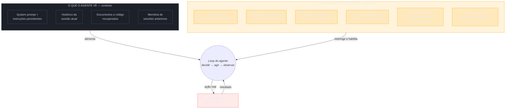

# Context e harness — o ambiente vira o produto

> [!abstract] TL;DR
> Em junho de 2025, Karpathy resumiu uma virada que já estava em curso: o LLM é a CPU, a janela de contexto é a RAM, e você é o sistema operacional responsável por decidir o que carrega nela. Um ano depois, Mitchell Hashimoto — o mesmo tipo de engenheiro de infraestrutura que passou a carreira desenhando sistemas que não confiam em disciplina humana — articulou o degrau seguinte: não basta o agente *saber* a coisa certa, ele precisa *poder fazer* a coisa certa, dentro de um ambiente que torna o erro impossível de repetir, não apenas improvável. Context engineering pergunta o que o agente vê. Harness engineering pergunta o que o agente pode fazer. As duas nasceram a menos de um ano de distância uma da outra porque respondem à mesma pressão vista de dois ângulos: o agente parou de responder e começou a agir.

---

## Duas perguntas que nasceram da mesma pressão

Imagine que você está treinando um estagiário novo para assumir uma responsabilidade real dentro do seu time — não tarefas de brinquedo, trabalho que entra em produção. Duas coisas precisam estar certas ao mesmo tempo, e elas são diferentes uma da outra.

A primeira: **o que você deixa esse estagiário saber**. Ele precisa do contexto certo antes de tomar qualquer decisão — o histórico do projeto, os documentos relevantes, as decisões já tomadas e por quê, o estado atual do sistema. Um estagiário brilhante trabalhando com informação errada ou incompleta toma decisões erradas com total confiança. Isso é gerenciamento de informação.

A segunda, e é uma pergunta diferente: **o que você deixa esse estagiário fazer**. Ele tem acesso de escrita ao banco de produção, ou só de leitura? Ele pode fazer deploy sozinho, ou precisa de aprovação? Existe um ambiente de teste isolado onde ele pode errar sem consequência, ou toda ação dele já é real? Isso não é sobre o que ele sabe — é sobre o raio de dano que uma decisão errada consegue causar, e sobre quantas camadas existem entre "ele decidiu algo errado" e "algo ruim de fato aconteceu".

Um bom onboarding de estagiário trata as duas perguntas como problemas distintos, com soluções distintas. Você não resolve "ele não devia ter acesso de escrita ao banco de produção" explicando melhor o contexto do projeto. E não resolve "ele não entendeu a arquitetura" restringindo permissões. São eixos ortogonais — e é exatamente por serem ortogonais que a engenharia em torno de agentes de IA precisou de dois nomes, não de um, para as duas metades do mesmo problema.

Essa é a distinção que esta nota inteira desenvolve. **Context engineering** é a disciplina do que o agente vê. **Harness engineering** é a disciplina do que o agente pode fazer. Elas surgiram com menos de um ano de distância — context engineering ganhando nome público em meados de 2025, harness engineering em 2026 — porque nenhuma das duas faz sentido sozinha assim que o agente para de ser um gerador de texto passivo e vira algo que age no mundo repetidamente, sem um humano aprovando cada passo.

> [!question]- Por que não é uma só disciplina, já que as duas nasceram quase juntas?
> Porque o tipo de erro que cada uma previne é diferente, e o conserto para cada tipo de erro mora em lugares diferentes do sistema. Um agente que alucina porque não tinha o documento certo na janela é um problema de contexto — o conserto é mudar o que entra na próxima chamada. Um agente que executa `rm -rf` num diretório errado porque tinha permissão de shell irrestrita é um problema de harness — o conserto é mudar o que o ambiente permite, não o que o modelo sabe. Tratar os dois como o mesmo problema leva a soluções que miram o alvo errado: você não resolve falta de sandboxing escrevendo um prompt mais cuidadoso, e não resolve alucinação restringindo permissões de shell.

---

## Context engineering: a janela vira arquitetura

> [!info] Esta seção é resumo, não o conteúdo completo
> O vault já tem um galho inteiro dedicado só a esta camada — [[Context Engineering]], com dezesseis notas cobrindo pilares, pipelines, compressão, memória agêntica, entropia de contexto e mais. Esta seção não repete esse conteúdo. O ângulo aqui é exclusivamente historiográfico: por que essa camada surgiu quando surgiu, o que ela deslocou, e por que o harness veio logo em seguida. Para aprofundar o "como fazer", vá para o galho — em especial [[03-Dominios/Tecnologia/IA/Context Engineering/01 - De prompt engineering a context engineering|01 - De prompt engineering a context engineering]] e [[03-Dominios/Tecnologia/IA/Context Engineering/02 - Os quatro pilares — prompt, context, intent, specification|02 - Os quatro pilares]].

Em 25 de junho de 2025, Andrej Karpathy postou uma frase que hoje é citada em quase todo material sobre o tema: "+1 para 'context engineering' em vez de 'prompt engineering'". A justificativa que ele deu junto é o que ficou: as pessoas associam "prompt" a uma descrição curta de tarefa, do tipo que você digita numa caixa de chat. Mas em qualquer aplicação de LLM de verdade, industrial, o que você está fazendo é bem mais amplo — é a arte e a ciência delicada de preencher a janela de contexto com exatamente a informação certa, na próxima chamada ao modelo.

A metáfora que consolidou essa ideia — e que já apareceu na nota [[01 - A escada de abstração — qual é a unidade de design]] deste galho, vale repetir aqui porque é o coração desta camada — é: **o LLM é a CPU. A janela de contexto é a RAM. Você é o sistema operacional**, responsável por decidir o que carrega nessa memória de trabalho limitada, para cada tarefa, a cada instante. Um sistema operacional que carrega a RAM errada — dados obsoletos, processo errado em primeiro plano, memória fragmentada com lixo de execuções anteriores — não importa quão rápida seja a CPU por baixo: o resultado sai errado, ou lento, ou os dois.

### O mecanismo do deslocamento

Vale ser preciso sobre *o que exatamente* mudou entre prompt engineering e context engineering, porque "a janela ficou maior" é uma explicação incompleta — janelas maiores já existiam antes de 2025, e ninguém chamou isso de mudança de disciplina.

O mecanismo real é outro: em algum momento entre 2024 e 2025, o caso de uso típico deixou de ser "uma pergunta, uma resposta" e passou a ser um agente que **lê várias fontes de informação heterogênea ao mesmo tempo, dentro da mesma chamada**. Código-fonte de um repositório inteiro. Documentação técnica. Histórico de conversa acumulado ao longo de uma sessão longa. Memória persistida de sessões anteriores. Resultados de chamadas de ferramenta que já rodaram nesta mesma tarefa. Tudo isso compete pelo mesmo espaço finito de tokens, na mesma janela, na mesma chamada.

Assim que isso acontece, a pergunta "qual é a frase mágica que eu escrevo" deixa de fazer sentido como pergunta central — porque a frase é uma fração pequena, e cada vez menor, do que está de fato dentro da janela. A pergunta que substitui é estrutural: **qual é a arquitetura de informação que esse agente precisa, dado que ele vai consumir código, docs, histórico e memória simultaneamente, e tem um orçamento de tokens finito para caber tudo isso?** Isso não é mais uma pergunta sobre wording. É uma pergunta sobre desenho de sistema — o que entra, em que ordem, o que é resumido, o que é descartado, o que é recuperado sob demanda em vez de sempre presente.

> [!example] Um exemplo concreto do deslocamento
> Compare duas versões de "peça pro agente corrigir um bug". Versão prompt engineering: você escreve uma descrição cuidadosa do bug, talvez com um exemplo de input/output esperado, e manda numa única mensagem. Versão context engineering: o agente recebe, na mesma chamada, o arquivo onde o bug provavelmente está, os arquivos que esse arquivo importa, o histórico de commits recentes que tocaram aquela função, os testes que já existem para ela, e um resumo comprimido de decisões de arquitetura anteriores relevantes — tudo montado *antes* da chamada, por um pipeline que decide o que é relevante o suficiente para caber no orçamento de tokens. A "frase" nesse segundo cenário ainda existe (ela vira uma instrução curta no topo), mas ela é a parte menos trabalhosa do sistema inteiro.

Esse deslocamento é o mesmo que o galho dedicado documenta em detalhe técnico — pipelines de montagem dinâmica, camadas de contexto persistente/temporal/transiente, compressão contra *context rot*. O que esta nota acrescenta é a leitura histórica: context engineering não nasceu porque alguém teve uma ideia brilhante isolada. Nasceu porque o formato de uso do modelo mudou de "responda uma pergunta" para "opere dentro de um fluxo de trabalho longo, multi-fonte", e nenhum vocabulário de prompt engineering tinha uma palavra para o problema novo que isso criou.

---

## Harness engineering: o ambiente executável

A segunda metade desta nota é sobre uma pergunta diferente, e ela vem de um lugar diferente da indústria. Não veio de um pesquisador de IA nem de um praticante de prompt. Veio de Mitchell Hashimoto — criador do Terraform, uma ferramenta cuja razão de existir é justamente essa: infraestrutura não deveria depender da memória ou da disciplina de um engenheiro individual lembrando de fazer a coisa certa toda vez. Ela deveria ser codificada, declarada, versionada, de modo que o comportamento correto seja o caminho de menor resistência, e o comportamento incorreto seja difícil ou impossível.

A frase de Hashimoto que resume harness engineering é esta: **"toda vez que você descobre que um agente errou, você engenheira uma solução que impede a recorrência."**

Vale demorar nessa frase, porque a palavra que carrega o peso todo é "engenheira" — não "instrui", não "avisa", não "documenta". Compare as três respostas possíveis ao mesmo erro de agente:

- **Resposta de prompt/context engineering:** você descobre que o agente apagou um arquivo importante sem confirmar. Você adiciona uma linha ao system prompt: "sempre confirme antes de deletar arquivos". Na próxima sessão, essa linha pode estar comprimida, resumida, ou simplesmente ignorada — porque é uma instrução em linguagem natural, competindo por atenção com todo o resto da janela, e nada garante que o modelo a obedeça sob pressão de outras prioridades no contexto.
- **Resposta de harness engineering:** você descobre o mesmo erro. Em vez de escrever uma instrução, você remove a permissão de deletar arquivos sem uma etapa de confirmação explícita, no nível do *ambiente* — não no nível do texto que o modelo lê. Agora, tecnicamente, o agente não consegue mais repetir esse erro específico, porque a ferramenta que ele chamaria para fazer isso simplesmente exige um passo a mais que não existia antes. Não é uma sugestão que o modelo pode escolher ignorar. É uma restrição de infraestrutura.

Essa é a diferença estrutural entre as duas camadas, e é por isso que harness engineering surge como resposta *natural* — não como capricho de nomenclatura — ao momento em que agentes passam de responder para agir. Uma instrução em prompt é, na melhor das hipóteses, uma sugestão forte. Uma restrição no harness é um fato sobre o mundo em que o agente opera. Quando o custo de um erro sobe — porque o agente agora executa comandos reais, faz commits reais, chama APIs reais com efeito real — depender de instrução deixa de ser aceitável, e a engenharia migra para o ambiente.

> [!question]- Isso significa que prompts e contexto pararam de importar?
> Não, e essa é uma armadilha fácil de cair depois de ler a seção anterior. O harness não substitui o contexto — ele resolve uma classe de erro *diferente* da que o contexto resolve. Um agente pode ter contexto perfeito (sabe exatamente o que fazer) e ainda causar dano, se o ambiente permitir uma ação irreversível sem verificação. E um agente pode ter um harness perfeitamente restrito e ainda entregar um resultado ruim, se o contexto que ele recebeu estiver incompleto ou desatualizado. As duas camadas resolvem problemas ortogonais, exatamente como o estagiário da abertura desta nota: saber a coisa certa e poder fazer a coisa certa são falhas diferentes, com conserto em lugares diferentes.

### O que compõe um harness, concretamente

"Ambiente executável" soa abstrato até você listar do que ele é feito. Um harness, na prática, é a soma de:

- **Tools** — quais ferramentas o agente pode chamar, com que assinatura, e o que cada uma efetivamente permite fazer no mundo real (ler um arquivo é diferente de escrever; rodar um comando de leitura é diferente de rodar um comando arbitrário de shell).
- **Permissões** — dentro das tools disponíveis, o que exige aprovação humana, o que roda automaticamente, e onde fica a fronteira entre as duas.
- **Sandbox** — o isolamento entre o que o agente está fazendo e o que pode ser afetado de fato; um sandbox bom transforma um erro caro num erro de graça.
- **Verificação** — os mecanismos que checam se uma ação teve o efeito esperado antes de prosseguir, ou que revertem uma ação quando ela não teve.
- **Memória** — o que persiste entre sessões e execuções, e sob controle de quem.

Repare que esta lista não é uma lista fechada nem uma invenção desta nota — é, quase palavra por palavra, a lista de sub-disciplinas que a comunidade que formalizou "harness engineering" reconhece como partes do mesmo guarda-chuva. É para lá que a próxima seção vai.

---

## As sete sub-disciplinas — e uma inconsistência reveladora

O repositório `awesome-harness-engineering`, mantido por ai-boost no GitHub, tenta catalogar essa formalização em andamento. Ele lista sete disciplinas como partes constituintes do harness:

| Sub-disciplina | O que ela decide |
|---|---|
| **Context engineering** | O que entra na janela do modelo, em que ordem, o que é comprimido |
| **Loop engineering** | Quando repetir uma ação, o que muda entre tentativas, quando parar |
| **Tool design** | Que ferramentas existem, com que assinatura, que efeito cada uma tem |
| **Verification engineering** | Como o sistema confirma que uma ação teve o efeito esperado |
| **Memory engineering** | O que persiste entre sessões, e como é lido/escrito |
| **Permission engineering** | O que exige aprovação humana, o que roda sem supervisão |
| **Environment engineering** | O sandbox, a infraestrutura que hospeda a execução |

Vale parar num detalhe dessa lista, porque ele não é um acidente de organização — é uma pista sobre como a "escada" que o Twitter conta é mais bagunçada do que o discurso linear sugere. **Loop engineering está catalogado como sub-disciplina *dentro* do harness**, não como a camada que sucede o harness numa sequência histórica limpa.

Isso contradiz, ou pelo menos complica, a narrativa de linha reta que a nota [[01 - A escada de abstração — qual é a unidade de design]] descreve com a ressalva devida — de que cada camada "encapsula" a anterior, subindo um degrau de escopo de cada vez, prompt → flow → context → harness → loop → graph. Se loop engineering é uma peça dentro do harness, e não um degrau inteiro acima dele, então a ordem "harness primeiro, loop depois" que o discurso público do dev Twitter conta em 2026 é, no mínimo, uma simplificação — e talvez seja simplesmente uma ordem de conveniência narrativa, não uma hierarquia de dependência real.

> [!warning] A escada é um modelo útil, não um fato de engenharia
> Vale ler essa inconsistência com honestidade, não com cinismo. Um modelo de camadas concêntricas é uma ferramenta pedagógica poderosa — ele ajuda a organizar seis anos de vocabulário disperso numa progressão que faz sentido. Mas a realidade documentada por quem constrói esses sistemas — o próprio repositório que tenta catalogar as peças — não bate perfeitamente com a metáfora de degraus limpos. O loop já era uma peça reconhecida de harness antes de "loop engineering" virar hashtag separada em junho de 2026. Isso não invalida a escada como ferramenta de raciocínio; só avisa que ela é uma simplificação de algo que, na prática de quem constrói, sempre foi mais entrelaçado do que sequencial.

Duas leituras plausíveis dessa bagunça, nenhuma delas provada com certeza pelo material disponível:

- **Leitura 1 — o harness sempre continha o loop, e o Twitter só nomeou uma parte dele separadamente.** Sob essa leitura, "loop engineering" não é uma camada nova acima do harness; é um zoom-in em uma das sete peças que o harness já continha, ganhando atenção própria porque é a peça mais visualmente dramática — dá pra ver um agente rodando em círculo, corrigindo o próprio erro, de um jeito que "permission engineering" nunca vai render um vídeo viral.
- **Leitura 2 — o harness e o loop amadureceram em paralelo, não em sequência, e o discurso público impôs uma ordem que não existiu de fato.** Sob essa leitura, times de engenharia estavam simultaneamente restringindo permissões *e* formalizando ciclos de repetição ao longo do mesmo período de 2025-2026, e a narrativa "primeiro veio o harness, depois veio o loop" é uma reconstrução posterior — mais fácil de contar como história do que a realidade paralela e confusa de várias equipes resolvendo pedaços do mesmo problema ao mesmo tempo, sem coordenação central.

Nenhuma das duas leituras muda a utilidade prática de conhecer as sete disciplinas — cada uma delas é um eixo real de decisão de design que qualquer time construindo agentes em produção vai precisar tomar, com ou sem o rótulo. O que muda é quanto peso dar à ideia de uma "sucessão" limpa entre harness e loop. A evidência primária — o próprio catálogo da comunidade que usa esses termos no dia a dia — sugere que a relação é de continência, não de sucessão.

> [!info] Como ler o diagrama
> O azul é o que entra na cabeça do modelo a cada chamada — informação, sem capacidade de agir por si só. O âmbar é o que cerca o modelo e determina o raio de ação dele — inclusive o loop, marcado deliberadamente como peça do harness e não como camada externa a ele, seguindo o próprio catálogo de sete disciplinas discutido acima. O vermelho é o mundo real, fora do controle direto de qualquer camada de engenharia — onde o efeito de uma ação se torna irreversível ou não. A fronteira que mais importa neste diagrama não é entre contexto e harness — é entre o loop e o mundo: tudo à esquerda dessa seta é reversível e barato de errar; tudo à direita, uma vez cruzada, pode não ser.

---

## A evidência dura: comparar agentes sem descrever o harness é ruído

Até aqui, o argumento desta nota é conceitual — por que faz sentido que harness surja como resposta ao agente que age. A seção seguinte é sobre evidência empírica de que essa distinção não é só elegante teoricamente: ela muda o resultado medido de forma que compromete benchmarks inteiros quando ignorada.

O paper "Stop Comparing LLM Agents Without Disclosing the Harness" (Zhang, Wang, Ge, Xu, Hamm e Reddy, arXiv 2605.23950) formaliza exatamente esse ponto. O argumento central — os autores chamam de **Binding Constraint Thesis** — é que, para tarefas de longo horizonte comparadas entre modelos de capacidade de fronteira comparável, o harness de execução do agente — a camada de infraestrutura que governa construção de contexto, interação com ferramentas, orquestração e verificação ao redor de um modelo de linguagem — é frequentemente um determinante mais forte do desempenho do agente do que o próprio modelo por baixo dele.

Vale desembrulhar essa frase, porque ela é mais forte do que parece numa primeira leitura. Não diz "o harness importa". Diz que, num regime específico — tarefas longas, modelos de capacidade parecida —, o harness explica *mais* variância de resultado do que a escolha do modelo. Isso significa, na prática, que um leaderboard comparando "modelo A vs. modelo B" sem descrever o harness que cada um rodou por baixo está, tecnicamente, medindo uma mistura de duas coisas diferentes e atribuindo o resultado inteiro a uma só.

Os autores sustentam essa tese com três linhas de evidência:

1. **Formalização controle-teórica.** Eles tratam o harness como o controlador de um sistema dinâmico em malha fechada, e o LLM como a política estocástica que esse controlador governa — um enquadramento emprestado diretamente de teoria de controle, o mesmo campo que formaliza termostatos e sistemas de estabilização. Sob essa lente, perguntar "qual modelo é melhor" sem fixar o controlador é uma pergunta mal-formada, do mesmo jeito que perguntar "qual motor é melhor" sem especificar o sistema de transmissão que o acopla à estrada.
2. **Benchmarks publicados e deployments de indústria.** Os autores revisam resultados já publicados e casos de uso reais em produção onde a variância induzida pelo harness supera substancialmente a variância induzida pela troca de modelo.
3. **Decomposição de variância controlada.** Um experimento desenhado especificamente para isolar as duas fontes de variação mostra casos de **inversão de ranking** — ou seja, o mesmo par de modelos, sob dois harnesses diferentes, produz uma ordem de "quem é melhor" invertida.

Esse último ponto é o mais desconfortável para qualquer leitor de benchmark: se trocar apenas o harness — mantendo o modelo fixo — já é suficiente para inverter qual dos dois modelos parece melhor, então qualquer comparação de modelos que não disclosure o harness usado está, na melhor das hipóteses, incompleta, e na pior, ativamente enganosa.

> [!warning] O que isso muda na prática, para quem lê benchmark de agente
> A recomendação direta dos autores é: até que especificações de harness sejam divulgadas, comparações de leaderboard para agentes de longo horizonte devem ser tratadas como incompletas e potencialmente enganosas. Isso não é ceticismo genérico contra benchmarks — é uma reivindicação específica e testável: exija que qualquer comparação "modelo A supera modelo B" venha acompanhada da descrição do ambiente de execução, das ferramentas disponíveis, das permissões e do orçamento de iterações usado por cada um. Sem isso, o número que você está lendo pode estar medindo a engenharia de ambiente de quem publicou o benchmark, não a capacidade do modelo em si.

Esse resultado fecha o argumento inteiro desta nota com um dado duro em vez de só uma analogia: a razão pela qual harness engineering merece existir como disciplina nomeada, separada de context engineering, não é apenas que "faz sentido conceitualmente". É que, empiricamente, o harness já está determinando resultado o suficiente para inverter rankings — o que significa que ignorá-lo como variável de engenharia não é uma opção neutra, é um erro de medição.

---

## Ceticismo: infraestrutura tem custo, e gaiola demais mata o que você queria

Duas dessas seções acima descrevem harness engineering como resposta racional e bem fundamentada a um problema real. Vale, agora, aplicar o mesmo padrão de ceticismo que este galho inteiro promete desde a primeira nota.

**Primeiro custo: harness é infraestrutura, e infraestrutura não é grátis.** Cada tool nova que você desenha, cada camada de permissão, cada sandbox, cada mecanismo de verificação é código que alguém escreve, testa e mantém. Diferente de um prompt — que você pode editar num arquivo de texto e publicar em minutos — um harness bem construído se parece mais com um sistema distribuído de verdade: tem dependências, tem versão, tem superfície de bug própria, e tem custo de manutenção contínuo que sobrevive muito além do momento em que foi desenhado. Um time que decide "vamos construir um harness robusto" está, na prática, decidindo assumir uma dívida técnica de infraestrutura de agentes — que é real, comparável a qualquer outra dívida técnica de plataforma, e que precisa de orçamento e dono contínuos, não só do esforço inicial de construção.

**Segundo custo, mais sutil: o risco de a gaiola matar o que você queria proteger.** Um harness existe para restringir o espaço de ações possíveis do agente, tornando erros previsíveis impossíveis de repetir. Mas cada restrição que você adiciona também remove uma possibilidade — inclusive possibilidades boas que você não previu. Um agente com permissão só para editar arquivos dentro de um diretório específico não consegue mais causar dano fora dele; mas também não consegue mais resolver, sozinho, um problema legítimo cuja solução exigia tocar um arquivo fora daquele diretório — mesmo que essa fosse, no caso específico, a coisa certa a fazer.

Esse é o mesmo trade-off que qualquer engenheiro de infraestrutura reconhece de outros domínios: firewall demais quebra funcionalidade legítima; permissão demais abre superfície de ataque. A diferença, com agentes, é que o espaço de "o que seria útil fazer" é muito mais amplo e muito menos previsível de antemão do que o espaço de tráfego de rede legítimo — porque parte da promessa de um agente é justamente resolver problemas que você não enumerou com precisão ao desenhar o sistema. Um harness desenhado defensivamente demais entrega um agente seguro e inútil: ele nunca vai te surpreender com uma solução criativa, porque toda ação fora do roteiro já foi bloqueada antes de ser tentada.

> [!question]- Como saber se o seu harness está bem calibrado, e não sobre-restrito?
> Não existe uma métrica única, mas há um sinal prático de alerta: se você percebe que está adicionando exceções manuais recorrentes — "para esta tarefa específica, precisamos liberar temporariamente essa permissão" — isso é evidência de que o harness está mal calibrado para o tipo real de trabalho que o time faz, não apenas para os piores casos que ele previu. Um harness bem desenhado deveria acomodar a maioria dos casos legítimos sem exceção manual recorrente, reservando o bloqueio rígido para as ações genuinamente irreversíveis ou de alto risco — não para tudo que o time não teve tempo de antecipar em detalhe.

Há ainda um terceiro ponto de ceticismo, mais estrutural, e que conecta diretamente com a seção do paper acima: se harness explica boa parte da diferença de resultado entre agentes, isso também significa que **comparar "meu agente" com "o agente de outro time" sem comparar os harnesses é enganoso na direção oposta** — um time pode achar que descobriu um modelo superior quando, na verdade, descobriu um harness melhor calibrado. Isso tem uma consequência prática incômoda: parte do que hoje é vendido como "avanço de modelo" no discurso público de IA pode ser, na realidade, avanço de engenharia de ambiente disfarçado de avanço de capacidade do modelo em si — exatamente o tipo de confusão que a Binding Constraint Thesis foi desenhada para expor.

Nenhum desses três pontos é argumento contra construir harness — é argumento contra construí-lo sem medir o custo dele, e sem revisar periodicamente se as restrições ainda correspondem ao trabalho real que o agente faz, ou apenas ao medo que alguém tinha na primeira semana de desenho do sistema.

---

## Como explicar em inglês

Context engineering and harness engineering split one problem into two orthogonal questions: what does the agent see, and what can the agent actually do. Karpathy's framing — "the LLM is the CPU, the context window is RAM, and you're the operating system" — covers the first half, but it doesn't touch permissions, sandboxing, or tool design, which is why Hashimoto's harness layer had to show up separately, less than a year later, once agents stopped just answering and started acting on real systems. The two disciplines fail differently too: bad context makes an agent confidently wrong, but a bad harness lets a well-informed agent do real, sometimes irreversible, damage — which is exactly why you fix one in the prompt and the other in the environment, never the reverse.

| PT | EN |
|----|----|
| engenharia de contexto | context engineering |
| ambiente executável | executable environment / harness |
| camada de ferramentas/permissões/verificação | tool / permission / verification layer |
| restrição de infraestrutura vs. instrução em prompt | infrastructure constraint vs. prompt instruction |
| tese da restrição vinculante | binding constraint thesis |

> [!tip] Assista: Andrej Karpathy — Software Is Changing (Again)
> **Canal:** Y Combinator | **Duração:** ~40min | **Idioma:** EN (legendas PT auto)
>
> A fonte da metáfora que abre esta nota. Karpathy detalha por que o LLM se comporta como um sistema operacional e a janela de contexto como RAM — e por que isso desloca a pergunta de "qual a frase certa" para "qual o ambiente que o agente precisa". Trecho de destaque [10:15]: *"the LLM is a … operating system … the context windows are kind of like the [memory]"*
>
> 🎬 [Assistir no YouTube](https://www.youtube.com/watch?v=LCEmiRjPEtQ)

## O que vem a seguir

Contexto e harness resolvem, juntos, "o agente sabe a coisa certa" e "o agente pode fazer a coisa certa" — mas nenhum dos dois resolve uma terceira pergunta, que só aparece quando a primeira tentativa não é suficiente: **quando o agente deveria tentar de novo, o que deveria mudar entre uma tentativa e a seguinte, e quando ele deveria parar?** Essa pergunta é justamente uma das sete peças que esta nota listou dentro do harness — loop engineering —, mas ela ganhou peso e vocabulário próprios o suficiente, em junho de 2026, para merecer uma nota inteira dedicada ao seu próprio motor interno e às formas específicas como ele pode trair quem confia demais numa métrica. A próxima nota, [[05 - Loop engineering — o motor de 4 tempos e as 4 traições]], abre exatamente esse motor: PICK, SET, MEASURE, ACT — e as quatro traições que fazem um loop bem-sucedido, silenciosamente, deixar de servir ao objetivo que deveria perseguir.

Para aprofundar as camadas que esta nota resumiu, os galhos dedicados continuam sendo o destino certo: [[Context Engineering]] para o "como fazer" completo do lado do que o agente vê; [[Anatomia de Agents]] para o mecanismo do loop ReAct e o design de tools por baixo do harness; [[MCP]] para o protocolo que hoje padroniza boa parte de como ferramentas são expostas a agentes; [[Segurança e Guardrails]] para a face defensiva das permissões e sandboxes discutidas aqui; [[Memória de Agentes]] para a taxonomia completa da memória que esta nota tratou apenas como uma das sete sub-disciplinas; e [[Economia de Tokens]] para o custo, em dinheiro real, de manter janelas de contexto e loops de verificação rodando em produção.

---

## Fontes

- **Karpathy, A.** — postagem pública de 25 de junho de 2025 cunhando/endossando o termo "context engineering" em vez de "prompt engineering", e a metáfora LLM=CPU / contexto=RAM / usuário=sistema operacional, amplamente citada e consolidada na cobertura técnica subsequente do tema.
- **Hashimoto, M.** (criador do Terraform) — articulação pública de harness engineering em 2026, incluindo a formulação "toda vez que você descobre que um agente errou, você engenheira uma solução que impede a recorrência", citada na pesquisa consolidada deste galho.
- **ai-boost** — [awesome-harness-engineering](https://github.com/ai-boost/awesome-harness-engineering), repositório no GitHub. Fonte do catálogo das sete sub-disciplinas (context, loop, tool design, verification, memory, permission, environment engineering) usado nesta nota, e da observação de que loop engineering está listado como parte constituinte do harness, não como camada sucessora dele.
- **Zhang, Y., Wang, J., Ge, Y., Xu, W., Hamm, J., Reddy, C. K.** — [Stop Comparing LLM Agents Without Disclosing the Harness](https://arxiv.org/abs/2605.23950) (arXiv 2605.23950). Paper original da Binding Constraint Thesis, da formalização controle-teórica do harness como controlador de malha fechada, e da decomposição de variância que demonstra inversão de ranking entre modelos ao trocar apenas o harness.
- Ver também [[01 - A escada de abstração — qual é a unidade de design]], deste mesmo galho, para a tabela consolidada de linha do tempo e a primeira formulação do critério "unidade de design" aplicado a esta camada.
- Ver [[03-Dominios/Tecnologia/IA/Context Engineering/01 - De prompt engineering a context engineering|01 - De prompt engineering a context engineering]] e as demais quinze notas do galho [[Context Engineering]] para o aprofundamento técnico completo do lado "o que o agente vê", fora do escopo historiográfico desta nota.
