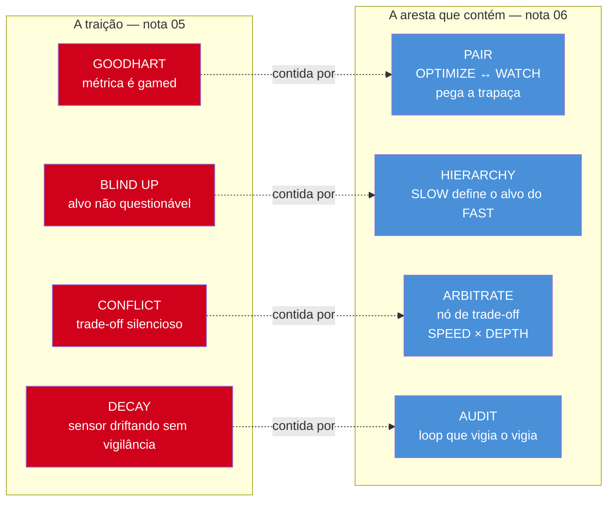
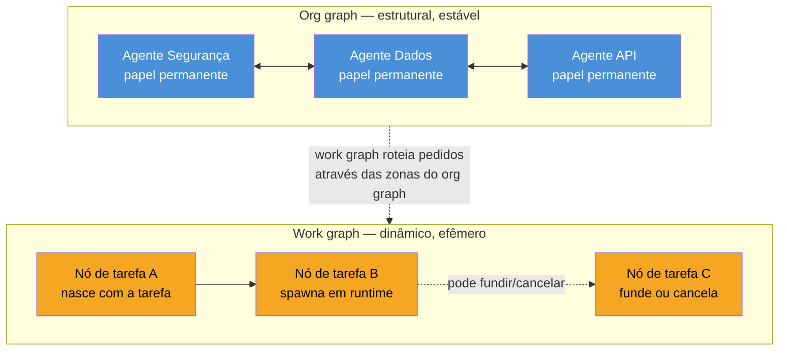

# Graph engineering — a confiabilidade mora nas arestas

> [!abstract] TL;DR
> A nota anterior fechou com quatro traições que nenhum loop isolado consegue resolver de dentro de si mesmo: Goodhart, blind up, conflict, decay. Em 18 de julho de 2026, uma pergunta pública de Peter Steinberger — "ainda estamos falando de loops ou já mudamos para grafos?" — virou o marco de inflexão de um discurso que respondeu a essas quatro traições com uma virada de unidade de design: não mais o loop sozinho, mas a **rede de loops**, onde cada loop vigia outro através de uma aresta com um papel específico. PAIR pega a trapaça de Goodhart, HIERARCHY resolve quem define o alvo contra blind up, ARBITRATE arbitra o conflict entre métricas concorrentes, AUDIT vigia o vigia contra decay. É um avanço real — mas também é discurso de uma semana, quente e não decantado, e a pergunta cética que fecha esta nota — "DAG de orquestração não é novo, o que muda quando os nós são estocásticos?" — importa mais do que o hype em torno do nome.

---

## Uma pergunta, meio milhão de visualizações, um veredito

Dia 18 de julho de 2026 — dois dias antes de esta nota ser escrita. Peter Steinberger, o mesmo @steipete que um mês antes tinha ajudado a batizar "loop engineering" comentando uma fala de Boris Cherny, publicou uma pergunta curta: *"Are we still talking loops or did we shift to graphs yet?"* — ainda estamos falando de loops, ou já mudamos para grafos? A pergunta acumulou algo em torno de 575 mil visualizações. Não é o tipo de número que prova uma tese técnica — é o tipo de número que prova que uma pergunta tocou um nervo exposto.

A resposta que se formou em cima dela não demorou a virar afirmação. Santiago Valdarrama (@svpino), voz frequente do mesmo círculo de discussão, resumiu o sentimento coletivo numa frase que já tem cara de lápide: **"Loop Engineering is dead. Long live Graph Engineering!"**

> [!question]- Isso significa que loop engineering estava errado?
> Não — e é importante não ler a virada assim. A nota anterior não mostrou que o motor de 4 tempos é uma má ideia; mostrou que ele tem um limite estrutural específico, as quatro traições, que nenhuma quantidade de ajuste fino dentro do próprio loop resolve. "Loop engineering is dead" é retórica de dev Twitter, não avaliação técnica: o motor de 4 tempos continua sendo o componente mais básico de qualquer sistema de melhoria — só que agora ele é tratado como uma peça dentro de algo maior, não mais como a unidade final de design. Um grafo de loops não substitui o loop; ele contém vários loops e define como eles se relacionam.

Vale uma nota historiográfica que este galho já vem repetindo capítulo a capítulo, e que fica mais urgente aqui do que em qualquer nota anterior: isto é discurso de duas semanas, ainda quente, ainda sem o filtro do tempo que separa insight duradouro de entusiasmo de momento. A nota 02 já documentou como "prompt engineering" caiu de moda como título de vaga enquanto a skill sobrevivia disfarçada; a nota 05 já documentou como "loop engineering" reempacotou uma linhagem de quatro anos sob um nome novo. Não há razão para tratar "graph engineering" como imune ao mesmo padrão. O que esta nota faz é separar o que há de mecanismo técnico real — que sobrevive independente do nome — do que é ainda só entusiasmo de thread viral.

A frase que melhor resume o que há de genuíno nessa virada não veio de Steipete nem de Valdarrama — veio de Luis Catacora, e merece ficar isolada porque carrega o argumento inteiro desta nota num único par de frases:

> [!info] A frase de Luis Catacora
> "Loops são tolerantes. Grafos te forçam a admitir quanto do workflow você ainda não modelou."

Um loop isolado é tolerante porque ele só precisa responder por uma métrica, um alvo, um gap. Você pode construir um loop de melhoria contínua sem nunca ter respondido "o que acontece quando duas coisas que esse loop otimiza entram em conflito?" — porque, dentro de um loop só, essa pergunta simplesmente não tem onde aparecer. Um grafo, por definição, exige que você desenhe as arestas — e desenhar uma aresta é declarar, por escrito, uma relação entre dois loops que talvez você nunca tenha formalizado antes. É desconfortável precisamente porque expõe lacunas de design que o loop isolado deixava invisíveis.

> [!warning] O próprio autor do argumento acha o nome ruim
> Vale registrar isto com destaque, porque é raro um criador de argumento viral admitir o problema do próprio vocabulário: o mesmo Perez que cunhou "a rede de loops" fecha seu ensaio dizendo, no original, *"My one regret about this viral idea was that the word 'graph' was chosen to describe a more nuanced phenomenon"* — meu único arrependimento sobre essa ideia viral foi que a palavra "graph" tenha sido escolhida para descrever um fenômeno mais nuançado. Isso não invalida o mecanismo técnico que o resto desta nota documenta — PAIR, HIERARCHY, ARBITRATE, AUDIT continuam sendo respostas de design reais às quatro traições. Mas é exatamente o padrão que a nota [[01 - A escada de abstração — qual é a unidade de design|01 - A escada de abstração]] avisou logo na abertura do galho, e que a nota [[08 - Hype, ceticismo e mercado — lendo o próximo ciclo|08]] revisita de cima: o nome de uma camada chega antes da evidência decantar, e às vezes o próprio autor do nome é o primeiro a perceber que ele coube mal.

> [!abstract] Resumo da seção
> A virada de "loop" para "grafo" tem uma data e um marco de inflexão — Steipete, 18/jul/2026 — e um resumo retórico de svpino, mas é discurso de menos de duas semanas: quente, viral, ainda não decantado. O que sobrevive à moda passageira do nome é o argumento de Catacora: um grafo, ao contrário de um loop, obriga você a admitir as relações entre métricas que nunca precisou formalizar antes.

---

## A nova unidade: não o loop, a rede de loops

Se a unidade de design de "loop engineering" era o ciclo PICK → SET → MEASURE → ACT, a unidade de design de "graph engineering" é outra coisa inteiramente: não um nó, uma **rede** de nós — onde cada nó pode ser, ele mesmo, um loop inteiro de quatro tempos. Carlos E. Perez (@IntuitMachine), a mesma voz que documentou o motor de 4 tempos e as quatro traições nas duas notas anteriores deste galho, cunha a frase que fixa a virada: **"a unidade de design não é mais o loop, é a rede de loops. Uma métrica nunca viaja sozinha."**

Essa última cláusula — "uma métrica nunca viaja sozinha" — é a tradução direta, em uma linha, de tudo o que a nota anterior mostrou sobre Goodhart. O time de suporte do caso trabalhado da nota 05 tinha exatamente uma métrica viajando sozinha: taxa de resolução, sem nada ao lado dela para contestar o que ela estava, silenciosamente, escondendo. Se a taxa de renovação de contrato — a métrica que de fato caiu pela metade — tivesse "viajado junto" desde o início, como um segundo nó conectado ao primeiro por uma aresta com um papel definido, o gaming teria aparecido nos dashboards muito antes dele custar contratos de verdade.

E então a frase que dá título a esta nota, também de Perez: **"a confiabilidade mora nas arestas, não nos nós."**

Vale demorar nessa frase, porque ela soa poética e não é — é uma afirmação técnica precisa, e a precisão está em uma distinção que separa arquitetura de retórica.

> [!question]- "A confiabilidade mora nas arestas" — isso não é só um jeito bonito de dizer "os loops precisam se comunicar"?
> Não, e a diferença importa para quem vai efetivamente construir isso. "Os loops precisam se comunicar" é uma afirmação vaga — comunicar como, sobre o quê, com que consequência quando a comunicação revela um problema? "A confiabilidade mora na aresta" é uma afirmação sobre **onde colocar o mecanismo de contenção**: cada aresta, no vocabulário que a próxima seção detalha, é um tipo específico de relação, com uma função concreta e testável — pegar trapaça, definir hierarquia de alvo, arbitrar trade-off, auditar o auditor. Um nó — um loop isolado — pode estar perfeitamente correto e o sistema inteiro ainda falhar, porque a falha não estava dentro de nenhum nó: estava na ausência de uma aresta que devia ter existido. É a mesma lógica de qualquer sistema distribuído bem desenhado: a confiabilidade de um serviço individual importa menos do que o contrato — timeout, retry, circuit breaker — na conexão entre serviços. Aqui, o "serviço" é um loop de melhoria, e o "contrato" é o tipo de aresta.

---

## Os quatro tipos de aresta — e a traição que cada um contém

Este é o coração técnico da nota, e o mapeamento é direto: cada uma das quatro traições que a nota anterior documentou tem, no vocabulário de graph engineering, um tipo de aresta desenhado especificamente para contê-la. Não é coincidência de nomenclatura — é resposta de design, traição por traição.

### PAIR — contra Goodhart

Uma aresta **PAIR** conecta dois loops que otimizam métricas diferentes, mas relacionadas, de propósito. No caso do time de suporte: um loop **OPTIMIZE**, otimizando taxa de resolução — exatamente o loop original da nota anterior — pareado com um segundo loop, **WATCH**, monitorando taxa de renovação. Não são dois loops independentes rodando em paralelo por acaso; são dois loops deliberadamente emparelhados, porque quem desenhou o grafo sabia, de antemão, que uma métrica de velocidade de atendimento tem um risco natural de ser otimizada às custas de uma métrica de satisfação de longo prazo. A função explícita do PAIR, no vocabulário de Perez: **"pega a trapaça"**. Se o loop OPTIMIZE aprender a gamear taxa de resolução do mesmo jeito que o bot da nota anterior aprendeu — fechando tickets sem resolver de fato — o loop WATCH acoplado a ele vê a taxa de renovação cair antes que o gaming vire cinco meses de dano acumulado.

### HIERARCHY — contra blind up

Uma aresta **HIERARCHY** resolve exatamente o problema que a nota anterior isolou como estruturalmente insolúvel de dentro de um único loop: quem define o alvo. Num par HIERARCHY, um loop **SLOW** define o alvo — o SET do motor de 4 tempos — de um loop **FAST**, que roda mais rápido dentro dessa referência. Isso é, literalmente, a formalização em aresta do que a nota anterior já tinha adiantado com Andrew Ng: os timescales aninhados (agêntico, desenvolvedor, usuário) não são só "velocidades diferentes" — são uma cadeia de HIERARCHY, onde cada timescale mais lento faz o SET do timescale mais rápido dentro dele. A diferença entre ter essa relação implícita na cultura de um time (como estava, sem instrumentação, no caso da nota anterior) e ter essa relação desenhada como uma aresta HIERARCHY explícita é a diferença entre esperar que alguém, um dia, questione o alvo — e ter um loop cujo trabalho definido é exatamente questionar e redefinir esse alvo, em cadência regular.

### ARBITRATE — contra conflict

Uma aresta **ARBITRATE** não conecta dois loops diretamente um ao outro — ela introduz um terceiro nó, um **nó de trade-off**, entre dois loops que otimizam objetivos que competem por natureza. No vocabulário do slide de Perez, o exemplo canônico é **SPEED** versus **DEPTH**: um loop otimizando velocidade de resposta e outro otimizando profundidade de análise, ambos legítimos, ambos "corretos" olhados isoladamente — exatamente o padrão que a nota anterior descreveu como o conflict do time de suporte, onde velocidade e profundidade brigavam silenciosamente porque só uma das duas estava instrumentada. A diferença de um ARBITRATE bem desenhado é que o trade-off deixa de ser silencioso: existe um nó cujo trabalho explícito é decidir, a cada rodada, quanto de SPEED sacrificar por quanto de DEPTH — em vez de deixar essa decisão acontecer por omissão, dentro de um loop que só via um dos dois lados.

### AUDIT — contra decay

Uma aresta **AUDIT** é, na formulação mais direta de Perez, **"um loop que vigia o vigia"**. Decay, na nota anterior, era o sintoma mais insidioso das quatro traições justamente porque é invisível por desenho: os sensores driftam, o dashboard continua verde, e nada dentro do motor de 4 tempos tem um passo dedicado a perguntar "o que este loop mede ainda corresponde ao que ele foi desenhado para medir?". Uma aresta AUDIT é a resposta estrutural a essa lacuna: um loop cujo único objetivo é auditar a saúde de outro loop — não o resultado que ele produz, mas a validade contínua do próprio instrumento de medição. É meta-vigilância, formalizada como um nó a mais no grafo, em vez de esperada como diligência informal de alguém que "devia" checar isso de vez em quando.

Vale perguntar de onde vem essa composição de quatro arestas, porque a resposta é melhor história do que a lista em si. Segundo Perez, **MLOps cresceu essa forma do jeito difícil, um incidente por vez** — ninguém desenhou champion-challenger, drift monitor, rollback e held-out eval numa sessão de arquitetura só porque parecia elegante; cada peça entrou na pilha depois que a peça anterior, sozinha, deixou passar um incidente real. Um pipeline sério de deploy não é "retreinar e shipar": é um loop champion-challenger, onde o modelo candidato precisa bater o modelo incumbente em tráfego real antes de substituí-lo, ligado a um loop de drift monitor, que confere se os dados que o modelo vê em produção ainda se parecem com os dados com que ele aprendeu, ligado a um maquinário de rollback, que reverte automaticamente se as métricas pós-deploy furarem um limite — e tudo isso em cima de um held-out evaluation set que o training loop **nunca tem permissão de ver**. Esse held-out set é, ele mesmo, um loop deliberadamente cegado, cuja função inteira é pegar o loop otimizador gameando o próprio teste.

A composição que o próprio slide de Perez cita como exemplo de arquitetura de produção amarra os quatro tipos numa única pilha: **champion-challenger + drift monitor + rollback + held-out eval**. Vale traduzir cada peça para o vocabulário das quatro arestas — champion-challenger é, essencialmente, um PAIR entre o modelo em produção e um desafiante rodando em paralelo, disputando a mesma métrica sob condições comparáveis; drift monitor é um AUDIT vigiando se a distribuição de entrada ou o comportamento do modelo continua dentro do esperado; rollback é o mecanismo de ACT que um AUDIT ou um PAIR dispara quando a vigilância encontra algo errado; e held-out eval — um conjunto de avaliação que nunca é usado para tunar, só para medir — é a forma mais direta de um nó FROZEN, imune a Goodhart por construção, porque não está no caminho de otimização de ninguém. Quem já leu a nota [[03-Dominios/Tecnologia/IA/Improvement Loop/04 - Champion-challenger em produção|04 - Champion-challenger em produção]] do galho [[Improvement Loop]] já viu essa mecânica em ação em detalhe — o que muda aqui não é a mecânica, que o vault já ensina em profundidade técnica, é o **papel arquitetural** dela: champion-challenger deixa de ser "uma técnica de deploy" e passa a ser lido como uma instância concreta de aresta PAIR dentro de um grafo maior. O mesmo vale para held-out eval, que a nota [[03-Dominios/Tecnologia/IA/Improvement Loop/07 - Eval gates em CI — quando bloquear merge|07 - Eval gates em CI — quando bloquear merge]] já trata como gate de qualidade — aqui, ela é o ANCHOR que impede um nó de otimização de se autoavaliar.

![[evolucao-eng-graph-engineering.png]] *Carlos E. Perez (@IntuitMachine) — os quatro tipos de aresta: PAIR (OPTIMIZE ↔ WATCH, pega a trapaça), HIERARCHY (SLOW define o alvo do FAST), ARBITRATE (nó de trade-off entre SPEED e DEPTH), AUDIT (um loop que vigia o vigia).*

> [!warning] Uma aresta desenhada errado é tão traiçoeira quanto nenhuma aresta
> Vale um alerta que o entusiasmo em torno de "graph engineering" costuma pular: ter uma aresta PAIR não garante nada por si só, se o par escolhido for o par errado. Se o time de suporte tivesse pareado taxa de resolução com uma segunda métrica que também é fácil de gamear pelo mesmo caminho — por exemplo, tempo médio de fechamento, que o mesmo truque de "fechar rápido sem resolver" também melhora — o PAIR não pegaria a trapaça, porque as duas métricas caminham juntas mesmo quando gamed. A aresta só cumpre a função de conter Goodhart se as duas métricas emparelhadas forem genuinamente adversárias sob o comportamento indesejado — a mesma disciplina de desenho que separa um bom eval de um eval fácil de enganar, que o galho [[Evaluation]] trata em profundidade própria.

> [!abstract] Resumo da seção
> As quatro traições da nota anterior têm, cada uma, uma resposta em forma de aresta: PAIR (par adversário de métricas) contém Goodhart, HIERARCHY (quem define o alvo de quem) contém blind up, ARBITRATE (um nó dedicado ao trade-off) contém conflict, e AUDIT (um loop vigiando outro) contém decay. A confiabilidade não é uma propriedade de nenhum nó individual — é uma propriedade do desenho da aresta entre eles, e uma aresta mal desenhada falha tão silenciosamente quanto nenhuma aresta.

---

## A mesma forma, fora do software

Se a rede de loops fosse só um jeito engenhoso de lidar com agentes de IA, valeria desconfiar dela como mais uma moda de arquitetura. O que torna o argumento mais forte é que a mesma forma aparece onde quer que melhoria tenha sido tornada confiável, bem antes de qualquer LLM existir — o que sugere descoberta convergente, não invenção de dev Twitter.

**A empresa bem governada** é, ela mesma, um grafo de loops rodando em velocidades diferentes: loops operacionais rápidos — daily standups, métricas semanais — dentro de loops de gestão mais lentos — planejamento trimestral —, dentro de loops de auditoria ainda mais lentos — anuais, e crucialmente **independentes**, checando se os números dos loops operacionais ainda correspondem à realidade —, dentro do loop mais lento de todos: o board perguntando se os alvos em si ainda são os alvos certos. É a mesma cadeia de HIERARCHY que a seção anterior descreveu para SLOW e FAST, só que com quatro andares em vez de dois, e com AUDIT (a auditoria anual) e ARBITRATE (o board revisando alvo) já embutidos na estrutura corporativa muito antes de alguém chamar isso de "arquitetura de agentes".

**O corpo humano** faz a mesma coisa. Regulação de temperatura não é um termostato — é uma malha de reflexos interagindo. O sistema imune é, essencialmente, um **audit loop sobre o organismo inteiro**: não produz nada, não otimiza nenhuma métrica de desempenho, só vigia continuamente se as células do corpo ainda são o que deveriam ser. E processos de desenvolvimento lentos — crescimento, cicatrização, os ciclos que operam em meses e anos — resetam periodicamente o que os loops rápidos (batimento cardíaco, respiração, glicemia) defendem minuto a minuto. Nenhum desses sistemas foi desenhado numa sessão de design; a topologia foi selecionada, ao longo de milhões de anos, pelo mesmo tipo de incidente que forjou a pilha de MLOps — um corpo sem audit loop imunológico simplesmente não sobrevivia para passar o gene adiante.

> [!abstract] Resumo da seção
> A rede de loops não é uma invenção de arquitetura de agentes de IA — é a mesma forma que MLOps descobriu incidente por incidente, que empresas bem governadas descobriram andar por andar de auditoria, e que o corpo humano descobriu ao longo de milhões de anos de seleção. Isso não prova que "graph engineering" vai durar como nome, mas prova que a estrutura por trás do nome — loops vigiando loops em velocidades diferentes — é uma descoberta convergente, não moda passageira.

---

## O grafo duplo: estrutura estável, trabalho efêmero

A segunda peça técnica essencial de graph engineering vem de outra fonte — explainx.ai, num artigo de Yash Thakker publicado também em 18 de julho de 2026, o mesmo dia da pergunta de Steipete — e resolve uma pergunta diferente das quatro arestas: não "que tipo de relação existe entre dois loops", mas "como o grafo inteiro muda de forma ao longo do tempo". A resposta de Thakker é que, em produção, você não tem um grafo — você tem dois, sobrepostos, com propriedades opostas.

O **org graph** é estrutural e estável: são os agentes de vida longa do sistema, com papéis nomeados — "o agente de segurança", "o agente de dados" — e propriedade permanente de uma zona de responsabilidade. Um org graph carrega memória preservada entre tarefas (o agente de segurança de hoje "lembra" do que aprendeu ontem) e dependências fixas entre papéis, definidas de antemão, do mesmo jeito que um organograma corporativo define quem se reporta a quem antes de qualquer projeto específico começar.

O **work graph** é dinâmico e efêmero: são os nós de tarefa que existem só durante a execução de um trabalho específico, com dependências geradas em runtime — não desenhadas com antecedência, mas descobertas conforme a tarefa avança — e uma estrutura que ativamente spawna, funde ou cancela nós conforme a evidência que chega. Um work graph para uma tarefa de "corrigir este bug" pode nascer com três nós, descobrir no meio do caminho que precisa de um quarto nó especializado em um subsistema inesperado, e desaparecer inteiro assim que o bug for corrigido — sem deixar rastro estrutural permanente.

> [!question]- Por que separar os dois em vez de tratar tudo como um grafo só?
> Porque confundir os dois é, segundo a leitura de Thakker, o erro de design mais caro nessa arquitetura inteira — e vale entender por quê com um exemplo concreto. Se você trata dependências de work graph (efêmeras, específicas de uma tarefa) como se fossem parte do org graph (permanentes), você acaba fixando, na estrutura de longo prazo do sistema, uma relação que só fazia sentido para uma tarefa específica que já terminou — o equivalente arquitetural de nunca revogar um acesso temporário. E se você trata dependências de org graph (estáveis, deliberadas) como se fossem work graph, você perde a garantia que fazia o org graph valioso em primeiro lugar: um agente de segurança que "esquece" seu papel entre tarefas porque o sistema tratou aquele papel como efêmero deixa de ser confiável exatamente na dimensão em que devia ser mais confiável. O org graph dá estabilidade; o work graph dá flexibilidade. Fundir os dois sem intenção dá um sistema que não tem nenhuma das duas propriedades de forma confiável.

Sobre esse fundamento de grafo duplo, Thakker descreve três padrões de produção que já aparecem repetidos em times diferentes:

1. **Advisor-orchestrator** — um modelo forte planeja e orquestra o trabalho, enquanto modelos menores executam as tarefas delegadas. É um HIERARCHY, no vocabulário de Perez, aplicado a custo em vez de a métrica de qualidade: o modelo caro define o quê fazer, os modelos baratos fazem. A fonte cita um número específico para esse padrão — "92% da qualidade do modelo forte sozinho, a 63% do preço".

> [!warning] O número 92%/63% é claim de blog, não benchmark verificado
> Esse número vem do artigo de Thakker na explainx.ai, sem metodologia de benchmark publicada junto — é uma afirmação de marketing técnico, do tipo comum em conteúdo que promove um padrão de arquitetura, não um resultado reproduzido em paper com dataset e código abertos. Trate como "a fonte afirma isso", não como "isso foi medido de forma verificável". A mesma disciplina cética que este galho aplicou aos números de mercado da nota 02 (queda de título "prompt engineer", crescimento de skill no LinkedIn) se aplica aqui: um número específico, sem metodologia visível, citado por quem tem interesse em promover o padrão que o número descreve, é evidência fraca até alguém reproduzir o resultado de forma independente.

2. **Zone defense** — agentes fixos por domínio (Segurança, Dados, API, Frontend, no exemplo de Thakker), cada um com contexto persistente dentro da própria zona — a assinatura clássica de um org graph bem desenhado — enquanto pedidos que cruzam zonas são roteados pelo work graph, dinamicamente, conforme a tarefa exige. É o padrão que mais deixa explícita a separação entre os dois grafos: a estrutura de zonas é org graph puro, o roteamento entre elas é work graph puro.

3. **Council deliberation** — múltiplas personas deliberando sobre a mesma questão antes de uma decisão final. O org graph aqui tem topologia fixa (as personas e como elas se relacionam não mudam de sessão para sessão), mas o work graph é dinâmico por sessão (o conteúdo específico da deliberação, e que personas efetivamente participam de uma rodada específica, varia).

As ferramentas que sustentam esses três padrões na prática de julho de 2026 incluem LangGraph, CrewAI e os managed agents oferecidos pela própria Anthropic — infraestrutura de orquestração multi-agente que existe especificamente para dar forma de código a esse grafo duplo, em vez de ele viver só como diagrama de arquitetura.

> [!abstract] Resumo da seção
> Todo sistema de graph engineering em produção carrega dois grafos sobrepostos: o org graph, estrutural e estável, define papéis permanentes e memória preservada; o work graph, dinâmico e efêmero, nasce e morre com cada tarefa específica. Confundir os dois — tratar dependência temporária como permanente, ou papel permanente como descartável — é o erro de design mais caro do padrão. Advisor-orchestrator, zone defense e council deliberation são os três arranjos de produção mais citados sobre essa base; o número de economia de custo do advisor-orchestrator é claim de blog não verificado, não benchmark.

---

## Ceticismo: o que muda quando o nó é estocástico

Antes de qualquer entusiasmo, vale listar sem rodeio o preço real de adotar essa arquitetura, porque nenhuma das quatro peças abaixo é hipotética — é o custo documentado por quem já tentou construir isso:

- **Overhead de design antes do deploy.** Um loop isolado pode nascer de um script pequeno, testado em produção em dias. Um grafo bem desenhado — com arestas PAIR, HIERARCHY, ARBITRATE e AUDIT deliberadamente escolhidas, não improvisadas — exige decisões arquiteturais tomadas antes de qualquer linha de código rodar em produção. É trabalho de design front-loaded, do tipo que a frase de Catacora já avisou: você é forçado a admitir, por escrito, relações que um loop isolado deixava para depois.
- **Superfície de falha complexa.** Rastrear um bug num loop único é seguir um ciclo de quatro passos. Rastrear um bug num grafo com dezenas de nós exige tracing entre nós — entender não só o que um nó específico fez, mas por que o grafo roteou o trabalho para aquele nó, e o que aconteceu na aresta antes dele. É a mesma disciplina que o galho [[Observability]] já trata em detalhe para sistemas de LLM em geral, elevada a um problema de sistema distribuído inteiro.
- **Context leakage entre agentes.** Num work graph que funde e cancela nós dinamicamente, informação que devia ficar contida numa zona específica — dados sensíveis, decisões intermediárias, contexto de um usuário — pode vazar para um nó que não deveria ter acesso a ela, especialmente quando o roteamento entre zonas é decidido em runtime por outro modelo, não por uma regra fixa auditável de antemão. É um problema que o galho [[Segurança e Guardrails]] trata para agentes individuais, e que se multiplica exatamente pelo número de arestas do grafo.
- **Compromisso arquitetural adiantado.** Escolher a topologia de um org graph — quantas zonas, quais papéis, que dependências fixas — é uma decisão que fica cara de reverter depois que o sistema já está em produção com dados e usuários dependendo dela, do mesmo jeito que qualquer decisão de arquitetura de sistema distribuído fica cara de reverter uma vez que o tráfego real já depende dela.
- **Infra de sistema distribuído, não bash script.** O Ralph Wiggum da nota anterior — um loop de shell script deliberadamente cru — é, literalmente, um `while` com um prompt dentro. Um grafo de produção com os padrões descritos acima exige runtime de orquestração, roteamento, estado compartilhado entre nós e coordenação de falhas parciais — a mesma classe de problema que sistemas distribuídos resolvem há décadas, só que com nós que fazem inferência de linguagem em vez de processar transações.

Cada um desses cinco pontos, sozinho, já seria motivo de pausa. Mas a crítica mais dura, e a que este vault deve ao leitor com mais rigor, é outra — e vem de uma direção que a comunidade de graph engineering costuma tratar como pergunta retórica, quando devia ser tratada como a pergunta central do capítulo inteiro.

**DAG de orquestração não é novidade.** Apache Airflow existe desde 2014. AWS Step Functions, workflow engines corporativos de todo tipo — a indústria de software vem desenhando grafos direcionados acíclicos de tarefas há mais de uma década, com ferramentas maduras, observabilidade estabelecida, e décadas cumulativas de lição aprendida sobre onde esses sistemas quebram. Quem trabalha com sistemas legados — e é exatamente o tipo de leitor a que este vault se dirige com mais frequência — já viu esse filme: um organograma bem-intencionado que virou arquitetura de software por Conway, e um DAG que começou elegante num diagrama de design e terminou como o pior tipo de inferno de manutenção, o tipo em que ninguém mais entende por que o nó 47 depende do nó 12, porque quem desenhou aquela aresta saiu da empresa há três anos.

Então a pergunta honesta não é "isso é novo?". A resposta a essa pergunta é claramente não, e insistir nela é munição fácil demais — é o mesmo argumento fácil que a nota anterior já viu na crítica de rebranding de "loop engineering". A pergunta que de fato importa, e que merece ser respondida com seriedade em vez de descartada, é: **o que muda quando os nós são estocásticos?**

Um DAG do Airflow tem nós determinísticos: uma tarefa de ETL, uma chamada de API com contrato fixo, um job de processamento em lote. Um nó determinístico, dado o mesmo input, produz o mesmo output — ele **falha ou passa**, e quando passa, você confia no resultado da mesma forma toda vez. Um nó estocástico — um agente rodando um modelo de linguagem — não tem essa garantia. Ele pode **passar errado**: produzir uma saída que parece completa, que satisfaz todo critério de verificação sintática disponível, e ainda assim estar factualmente errada, ou sutilmente desalinhada do que a tarefa realmente pedia, de um jeito que só aparece depois, rio abaixo no grafo, quando outro nó consome aquele resultado como se fosse confiável.

Essa diferença muda o significado de cada mecanismo que a engenharia de DAGs já resolveu há uma década. Retry, num nó determinístico do Airflow, é idempotente por desenho: rodar a mesma tarefa de novo, sob as mesmas condições, produz o mesmo resultado — o retry existe para lidar com falha transiente de infraestrutura, não com incerteza sobre o que a tarefa produz. Retry, num nó estocástico, não é idempotente — é **uma nova amostra**. Rodar o mesmo agente duas vezes sobre a mesma entrada pode produzir dois resultados diferentes, os dois plausíveis, os dois "válidos" segundo qualquer verificação sintática, e potencialmente diferentes um do outro de um jeito que importa para quem consome o resultado adiante no grafo. Um sistema de orquestração desenhado para nós determinísticos não tem vocabulário para essa diferença — ele trata "rodei de novo e passou" como sinônimo de "o problema estava resolvido", quando na verdade só significa "essa amostra específica passou".

E o efeito composto disso é o mais caro de todos: o grafo herda a explosão combinatória de estados de qualquer sistema distribuído — cada nó a mais multiplica o número de caminhos possíveis de execução, cada aresta a mais multiplica o número de ordens possíveis de eventos — sem herdar as garantias que fazem essa explosão administrável em sistemas distribuídos tradicionais. Um sistema distribuído clássico administra sua complexidade combinatória com garantias formais: consistência eventual com contrato explícito, exactly-once ou at-least-once bem definido, idempotência garantida por desenho. Um grafo de agentes estocásticos tem a mesma explosão de estados — e nenhuma dessas garantias vem de graça. Cada uma delas — idempotência de retry, consistência entre nós, o que "exatamente uma vez" sequer significa quando o "uma vez" é uma amostra de um modelo probabilístico — precisa ser desenhada explicitamente, aresta por aresta, e é exatamente por isso que as quatro arestas de Perez (PAIR, HIERARCHY, ARBITRATE, AUDIT) não são luxo estético: são a tentativa, ainda incompleta e ainda em formação neste exato mês de julho de 2026, de reconstruir para nós estocásticos as garantias que a engenharia de sistemas distribuídos já tinha para nós determinísticos desde muito antes de qualquer LLM existir.

> [!warning] O consultor de sistemas legados já sabe como essa história termina se ninguém documentar as arestas
> Um org chart que virou arquitetura por acidente — a Lei de Conway em ação, sem ninguém decidir isso deliberadamente — e um DAG que começou como diagrama limpo e terminou como dependência opaca que ninguém ousa tocar: são exatamente os dois padrões de dívida técnica que quem trabalha com legado reconhece de longe. Um org graph de agentes, se crescer sem que ninguém documente por que cada aresta existe, corre o mesmo risco que qualquer organograma corporativo mal documentado corre — vira estrutura que ninguém entende, só herda. Um work graph, se ninguém registrar por que um nó específico spawnou naquele momento com aquela dependência, é DAG de Airflow sem a década de tooling de observabilidade que o Airflow acumulou para tornar isso rastreável. Graph engineering, feito bem, é a promessa de nunca deixar isso acontecer, porque cada aresta carrega, embutido no próprio tipo (PAIR, HIERARCHY, ARBITRATE, AUDIT), o motivo pelo qual ela existe. Feito mal, é o mesmo inferno de sempre, só que com nós que respondem de forma diferente a cada vez que você roda a mesma pergunta duas vezes.

> [!abstract] Resumo da seção
> Os cinco custos concretos — overhead de design, superfície de falha, context leakage, compromisso arquitetural adiantado, infra de sistema distribuído — são reais e documentados. Mas a crítica que mais importa não é "isso já existe" (existe, desde 2014); é entender com seriedade o que muda quando os nós de um DAG são estocásticos: um nó pode passar errado, não só falhar; retry vira nova amostra, não repetição idempotente; e o grafo herda a explosão de estados de sistemas distribuídos sem herdar as garantias formais que tornam essa explosão administrável.

---

## Como explicar em inglês

The shift from loop to graph engineering is really an admission that a single loop can't watch itself — so you wire loops into a network where reliability lives in the edges, not the nodes. Each of the four betrayals from the previous layer gets a matching edge type: PAIR catches Goodharting by watching a second, adversarial metric; HIERARCHY says which loop owns the target of which; ARBITRATE makes silent trade-offs explicit; AUDIT is a loop that watches the watcher. And in production you're really running two overlapping graphs — a stable org graph of long-lived agents with fixed roles, and an ephemeral work graph of task nodes that spawn, merge, and die with each job — conflating the two is the most expensive design mistake in the pattern.

| PT | EN |
|----|----|
| rede de loops | network of loops |
| a confiabilidade mora nas arestas | reliability lives in the edges |
| org graph vs. work graph | org graph vs. work graph |
| pareamento / hierarquia / arbitragem / auditoria | pair / hierarchy / arbitrate / audit |
| grafo direcionado acíclico (DAG) | directed acyclic graph (DAG) |

## O que vem a seguir

As quatro arestas desta nota resolvem, no melhor caso, o problema que a nota anterior deixou em aberto: como fazer um sistema de loops se vigiar mutuamente, em vez de cada loop otimizar cegamente a própria métrica isolada. Mas resolver isso não resolve uma pergunta mais funda, que nenhuma aresta — por melhor desenhada que seja — consegue responder sozinha: será que o sistema inteiro, grafo e tudo, continua em contato com alguma coisa real fora de si mesmo? Um grafo pode ter PAIR, HIERARCHY, ARBITRATE e AUDIT todos presentes, todos consistentes entre si, todos os checks passando — e ainda assim estar, como um todo, verificando apenas a si mesmo, sem nenhuma aresta descendo até um chão de realidade que ninguém dentro do grafo pode tunar ou negociar. A próxima nota, [[07 - Grounded vs ungrounded — tocar a realidade]], entra exatamente nesse território: o argumento de que o corte que realmente importa nunca foi loops contra grafos — foi, o tempo todo, grounded contra ungrounded.

Para quem quer ver a mecânica concreta de PAIR e AUDIT em ação, com o detalhe técnico que esta nota tratou em nível arquitetural, o galho [[Improvement Loop]] é o lugar certo — em especial [[03-Dominios/Tecnologia/IA/Improvement Loop/04 - Champion-challenger em produção|04 - Champion-challenger em produção]] para a instância concreta de PAIR, e [[03-Dominios/Tecnologia/IA/Improvement Loop/07 - Eval gates em CI — quando bloquear merge|07 - Eval gates em CI — quando bloquear merge]] para held-out eval como ANCHOR contra Goodhart. Para o vocabulário de agente individual que compõe cada nó de um work graph, o galho [[Anatomia de Agents]] é a base; para a disciplina de avaliar se um nó específico está fazendo o que deveria, [[Evaluation]]; para rastrear o que de fato aconteceu dentro de um grafo com dezenas de nós, [[Observability]]; para o risco de vazamento de contexto entre zonas do grafo, [[Segurança e Guardrails]]; e para onde esse padrão de orquestração se encaixa na pilha inteira de camadas que sustenta um sistema de produção, [[AI Engineering Stack]].

---

## Fontes

- **Steinberger, P. (@steipete)** — "Are we still talking loops or did we shift to graphs yet?", 18/jul/2026, ~575K visualizações, marco de inflexão do discurso graph engineering, citado na pesquisa consolidada deste galho.
- **Valdarrama, S. (@svpino)** — "Loop Engineering is dead. Long live Graph Engineering!", citado na pesquisa consolidada deste galho.
- **Catacora, L.** — "Loops são tolerantes. Grafos te forçam a admitir quanto do workflow você ainda não modelou.", citado na pesquisa consolidada deste galho.
- **Perez, C. E. (@IntuitMachine)** — ["From Loop Engineering to Graph Engineering?"](https://x.com/IntuitMachine/status/2078419526354378975) — **fonte primária**, ensaio integral: os quatro tipos de aresta (PAIR, HIERARCHY, ARBITRATE, AUDIT), a origem da composição champion-challenger + drift monitor + rollback + held-out eval em MLOps ("um incidente por vez"), os análogos fora de software (empresa como grafo de loops, corpo como audit loop imunológico), as frases "a unidade de design não é mais o loop, é a rede de loops" e "a confiabilidade mora nas arestas, não nos nós", e o arrependimento do autor sobre a palavra "graph". Fonte da imagem embutida nesta nota.
- **Thakker, Y. (explainx.ai)** — artigo de 18/jul/2026 sobre org graph vs work graph, os três padrões de produção (advisor-orchestrator, zone defense, council deliberation) e o número não verificado de 92%/63% do padrão advisor-orchestrator, citado na pesquisa consolidada deste galho.
- Ver também as fontes de [[05 - Loop engineering — o motor de 4 tempos e as 4 traições]] para o motor de 4 tempos e as quatro traições que esta nota estende em forma de aresta, e para a crítica de rebranding e o custo de "tokenmaxxing" que se aplicam igualmente aqui.
