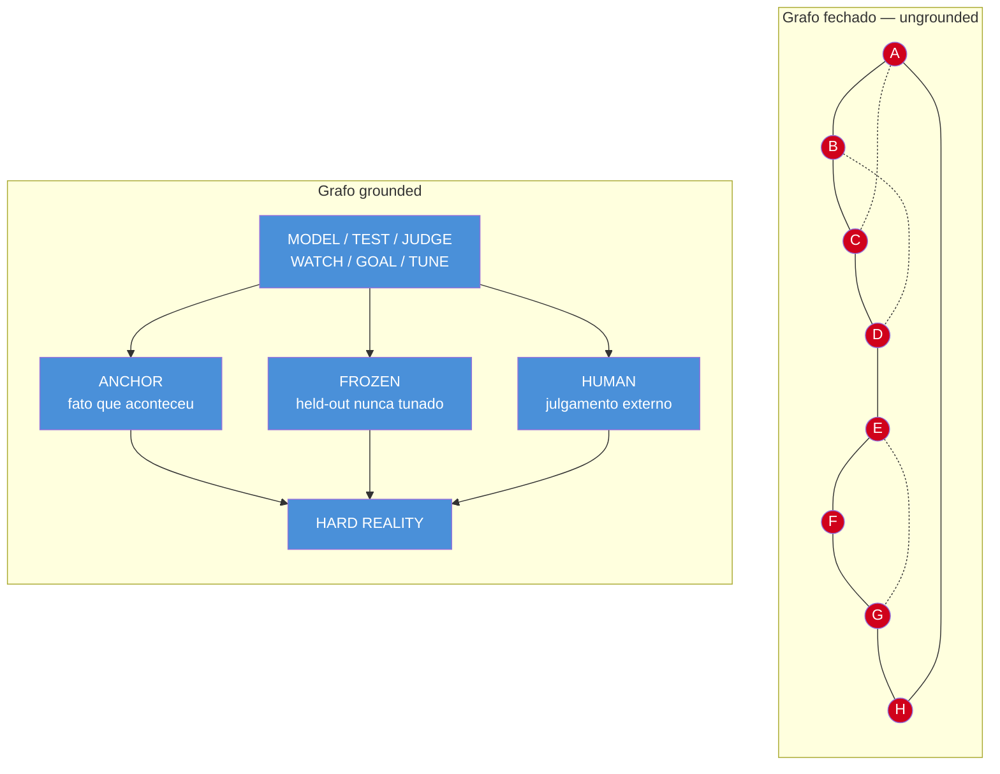

# Grounded vs ungrounded — tocar a realidade

> [!abstract] TL;DR
> Um grafo de agentes pode estar perfeitamente consistente — todo nó concordando com todo nó, sete checks verdes — e ainda assim estar inteiramente errado, porque consistência interna não é o mesmo que verdade externa. Carlos E. Perez (@IntuitMachine) argumenta que o corte que de fato separa um sistema confiável de um sistema que só parece confiável não é "loop vs grafo" — é se pelo menos uma parte do sistema continua tocando algo que ninguém dentro do sistema pode ajustar: um fato do mundo (ANCHOR), uma regra congelada (FROZEN), ou um julgamento humano externo (HUMAN). Esta nota leva esse argumento a sério, mostra o mecanismo de por que a autoconsistência engana, e também mostra por que ele é, ao mesmo tempo, um argumento honesto e uma jogada retórica de quem quer encerrar um ciclo de hype dizendo "vocês estavam discutindo a coisa errada".

---

## O grafo que passa em todos os próprios testes

A nota anterior deste galho, [[06 - Graph engineering — a confiabilidade mora nas arestas]], deixou o argumento em um lugar aparentemente resolvido: um loop sozinho não sabe questionar o próprio alvo, então a resposta é uma rede de loops se vigiando — um PAIR pegando a trapaça de outro, uma HIERARCHY definindo a referência de baixo, um ARBITRATE mediando velocidade contra profundidade, um AUDIT vigiando o vigia. A confiabilidade, dizia a nota, mora nas arestas.

Perez volta ao mesmo desenho um slide depois e faz uma pergunta desconfortável: e se as arestas também estiverem erradas?

Imagine um grafo com oito nós, A até H, todos conectados entre si. Cada nó valida os outros. A concorda com B, B concorda com C, C confirma A, e assim por diante — uma malha fechada onde toda aresta reporta "consistente" com toda aresta vizinha. Rode os checks e você vê sete sinais verdes. Não seis, não cinco com ressalvas — sete. O sistema inteiro concorda consigo mesmo.

O rótulo que Perez dá a esse grafo é preciso e desconfortável: **"consistente, mútuo, verificado por nada".** E o veredito que ele anexa é o motivo desta nota inteira existir: um grafo assim **"falha mais tarde, e mais caro"**.

Vale tornar isso concreto com o cenário completo que Perez usa para fechar seu ensaio — porque é mais afiado do que o exemplo abstrato de A a H, e é exatamente o tipo de armadilha que uma equipe que levou a sério a nota anterior pode cair. Imagine uma empresa que construiu o grafo inteiro, direito: métricas pareadas (PAIR), audit loops (AUDIT), meta-loops tunando os parâmetros dos loops de baixo (HIERARCHY) — e **cada um desses loops consome relatórios**. O audit loop confere os números de operações contra os números de finanças; os números de finanças vêm dos mesmos sistemas que operações alimenta; o meta-loop tuna thresholds usando dashboards construídos sobre tudo isso. Todo loop vigia outro loop, e **nenhum loop toca o chão**. Esse grafo é circular: uma rede elaborada de confirmação mútua na qual tudo é consistente e nada é verificado — e vai falhar exatamente como o loop único da nota 05 falhou, só que mais tarde e mais caro, com muito mais luzes verdes no caminho para baixo. A topologia da nota 06 comprou sofisticação. Não comprou contato com a realidade.

> [!question]- Como um sistema pode estar "consistente" e "errado" ao mesmo tempo? Isso não é uma contradição?
> Não é contradição porque consistência e correção são propriedades diferentes, medidas contra referências diferentes. Consistência mede se as partes do sistema concordam *entre si*. Correção mede se o sistema concorda com algo *fora dele* — o mundo, um fato, um resultado real. Um grupo de pessoas pode estar inteiramente de acordo sobre algo e estar todo inteiramente enganado; a unanimidade nunca foi evidência de verdade, só evidência de que ninguém no grupo discordou. Um grafo de agentes de IA tem exatamente o mesmo problema, só que automatizado e rodando em produção.

### O mecanismo: por que partes que se validam mutuamente podem estar erradas juntas

Vale abrir esse mecanismo devagar, porque é a peça técnica mais importante desta nota, e é fácil deixar passar como truísmo filosófico quando na verdade é um bug de arquitetura concreto.

Pega o exemplo mais comum de pipeline de avaliação de agentes em 2026: um **LLM-as-judge** avaliando a saída de outro LLM (ou do mesmo modelo, em outra chamada), usando uma **rubrica que também foi escrita por um LLM** a partir de exemplos "bons" — exemplos que, por sua vez, foram selecionados por um terceiro LLM, ou pelo mesmo modelo em modo de auto-curadoria. A nota [[03-Dominios/Tecnologia/IA/Evaluation/04 - LLM-as-judge — quando e como|04 - LLM-as-judge — quando e como]] já documenta esse padrão em detalhe técnico; aqui o ponto é outro — é o que acontece quando ele vira um circuito fechado.

Cada peça desse pipeline, isolada, parece razoável. Escrever uma rubrica com ajuda de um LLM economiza tempo de um humano especialista. Usar um LLM-judge para avaliar em escala é mais barato que rodar avaliação humana em cada exemplo. Gerar o golden set com ajuda de um modelo acelera a cobertura. Cada decisão, no momento em que é tomada, tem uma justificativa de engenharia sólida.

O problema aparece quando você olha o circuito inteiro, não cada peça: o modelo que gera a saída, o modelo que escreve a rubrica de avaliação, e o modelo que julga a saída contra a rubrica compartilham a mesma distribuição de vieses. Se o modelo gerador tem uma tendência sistemática — preferir respostas mais longas, evitar admitir incerteza, estruturar tudo em bullet points mesmo quando prosa seria melhor — essa mesma tendência tende a estar presente no modelo que escreve a rubrica (porque "o que parece uma boa resposta" é julgado com o mesmo instinto) e no modelo que julga (pela mesma razão). O resultado: o judge aprova a saída não porque ela é boa, mas porque saída, rubrica e judge concordam sobre o que "bom" significa, e essa concordância nunca foi comparada com nada fora do circuito — nenhum cliente, nenhum teste real, nenhum humano que não seja o próprio time que configurou o pipeline.

O mesmo mecanismo se repete em duas outras peças comuns do stack de observação de agentes:

- **Eval set gerado pelo mesmo modelo que ele avalia** — se o conjunto de exemplos de teste (o "golden set") foi sintetizado por um LLM a partir do próprio domínio de tarefas, ele tende a cobrir bem os casos que aquele modelo já lida bem, e a sub-representar exatamente os casos onde o modelo falha de um jeito que ele mesmo não sabe articular como pergunta de teste. A nota [[03-Dominios/Tecnologia/IA/Evaluation/02 - Golden datasets — como construir|02 - Golden datasets — como construir]] documenta essa armadilha em profundidade técnica; o ponto aqui é só notar que ela é uma instância direta do mesmo mecanismo de autoconsistência sem verdade.
- **Drift monitor cujo baseline foi tunado junto** — um monitor de drift compara a distribuição atual de saídas com uma distribuição de referência ("baseline") capturada em algum momento no passado. Se esse baseline foi calibrado no mesmo ciclo de ajuste em que o próprio modelo/prompt foi tunado — ou seja, se baseline e sistema monitorado evoluíram juntos, no mesmo lote de decisões de engenharia — o monitor perde justamente a capacidade que deveria ter: detectar quando o sistema se afastou do que costumava fazer bem. Ele detecta desvio do próprio passado recente, não desvio da realidade.

Em todos os três casos, o formato do erro é idêntico: **uma parte do sistema que deveria checar outra parte compartilha a origem, os dados ou os vieses da parte que está checando.** A aresta de verificação existe — ela roda, ela retorna um número, ela aparece verde no dashboard — mas ela nunca sai do grafo. É exatamente o desenho de A–H que Perez descreve: todo nó valida outro nó, e nenhum nó jamais toca nada de fora.

> [!example] Um jeito rápido de reconhecer o padrão
> Pergunte, de qualquer par gerador/verificador no seu sistema: "se o gerador tivesse um viés sistemático amanhã, o verificador teria como perceber?" Se a resposta depende de o verificador ter sido treinado, calibrado ou escrito de forma independente do gerador — com dados, autoria ou processo diferentes — a resposta costuma ser sim. Se o verificador nasceu do mesmo processo, dos mesmos dados, ou foi ajustado no mesmo ciclo que o gerador, a resposta é quase sempre não, e você tem um circuito A–H disfarçado de sistema de qualidade.

### Por que "mais tarde, e mais caro"

O veredito de Perez tem duas partes, e vale separar por quê cada uma é verdadeira.

**Mais tarde**, porque um circuito autoconsistente não produz sinal de alarme algum enquanto o erro se acumula. Isso já é familiar de dentro deste galho: é a mesma mecânica de **DECAY** que a nota [[05 - Loop engineering — o motor de 4 tempos e as 4 traições]] documentou — sensores que driftam sem que ninguém revalide se ainda medem o que foram desenhados para medir, enquanto o dashboard continua verde. A diferença aqui é de escala: DECAY, na nota 05, era sobre um loop e uma métrica. Aqui é sobre um grafo inteiro de nós que se auditam mutuamente sem que nenhum deles esteja ancorado a nada externo — então não é uma métrica que apodrece, é o conceito inteiro de "verificação" dentro do sistema que perde poder de detecção, porque toda verificação disponível é interna.

A nota [[06 - Graph engineering — a confiabilidade mora nas arestas]] já tinha proposto uma resposta a DECAY: um nó de **AUDIT**, um "loop que vigia o vigia". Essa resposta ainda não é suficiente, e é aqui que o argumento desta nota corta mais fundo do que o da nota 06. Se o auditor também está dentro do mesmo grafo — se ele foi treinado, configurado ou calibrado pelas mesmas pessoas, com os mesmos dados, na mesma cultura de "o que parece certo" que o resto do sistema — ele é só mais um nó. Ele pode estar genuinamente convencido de que está checando algo externo, e continuar, estruturalmente, sem tocar nada fora do grafo. Auditoria interna sem âncora externa não quebra o circuito de autoconsistência; só adiciona mais um voto ao consenso que já existia.

**E mais caro**, porque o erro que se acumula silenciosamente dentro de um sistema que parece saudável não é descoberto por um alarme controlado — é descoberto quando algo do mundo real finalmente colide com ele: um cliente cancela em massa, um regulador aparece, uma auditoria externa (de verdade externa, não um nó do próprio grafo) encontra a discrepância. Nesse ponto, o custo não é só corrigir o sistema — é reconstruir a confiança de quem foi afetado, refazer decisões que foram tomadas em cima do sinal falso, e frequentemente descobrir que o problema já se espalhou para partes do sistema que dependiam, direta ou indiretamente, do nó comprometido. É o mesmo argumento de Goodhart da nota 05 — "o sucesso do loop era a falha" — só que multiplicado pela superfície inteira de um grafo, em vez de contida em uma métrica isolada.

> [!abstract] Resumo da seção
> Um grafo de agentes que se validam mutuamente pode estar internamente perfeito — todo nó de acordo com todo nó — e externamente falso, porque validação mútua mede concordância interna, não correção. O mecanismo concreto é o gerador, a rubrica e o judge compartilhando origem, dados ou vieses, de modo que a "verificação" nunca sai do circuito. E mesmo um nó de auditoria, se estiver dentro do mesmo grafo, não resolve isso — só adiciona mais um voto ao consenso. O erro resultante não desaparece; ele se acumula em silêncio enquanto todo indicador continua verde, e é descoberto mais tarde, e mais caro, por algo de fora do sistema.

---

## As três âncoras

Se o problema é que nenhum nó do grafo toca algo de fora, a solução, no desenho de Perez, não é adicionar mais nós — é garantir que pelo menos parte do sistema continue conectada a algo que nenhum nó, por mais bem-intencionado que seja, consegue ajustar. Ele nomeia três formas dessa conexão.

### ANCHOR — fatos que aconteceram fora do sistema

A âncora mais direta é o fato bruto: **receita que caiu no banco, testes que de fato executaram, clientes que de fato ficaram** (em vez de cancelaram), **a contagem física que bate ou não bate**. Perez chama esse tipo de medição de "do tipo com que não se discute" — não porque seja infalível, mas porque não é uma métrica calculada por um componente do sistema sobre o próprio comportamento do sistema. É um evento que aconteceu no mundo, fora de qualquer pipeline de IA, e que pode ser checado independentemente de qualquer coisa que o grafo diga sobre si mesmo.

A propriedade que faz de um fato uma âncora de verdade — e não só mais um número — é que ele **não pode ser produzido pelo próprio sistema que está sendo avaliado.** Um LLM pode gerar uma resposta que parece ótima; ele não pode fazer um cliente renovar um contrato. Pode gamed uma taxa de resolução (como o caso trabalhado da nota 05); não pode gamed diretamente a receita que chega numa conta bancária real, porque essa receita depende de uma decisão humana, de fora, tomada com informação que o sistema não controla por completo.

### FROZEN — o valor vem de não poder ser ajustado

A segunda âncora é sutil e é, na visão desta nota, a mais fácil de subestimar: **regras que nunca foram tunadas, um held-out set** — um conjunto de exemplos deliberadamente mantido fora de qualquer ciclo de ajuste, nunca usado para treinar, calibrar ou orientar prompt engineering, guardado justamente para servir de teste independente mais tarde.

O mecanismo que dá valor ao FROZEN não é a qualidade dos exemplos em si — é o congelamento. Um held-out set que foi consultado, ainda que uma vez, durante o desenvolvimento deixa de medir generalização e passa a medir memorização: o sistema pode estar bom nele precisamente porque alguém, em algum momento, ajustou algo olhando para aquele conjunto. O valor da âncora **vem inteiramente de não poder ser ajustada** — no momento em que alguém a toca para "melhorar o número", ela deixa de ser âncora e vira só mais um alvo do motor PICK-SET-MEASURE-ACT, sujeito às mesmas quatro traições da nota 05, sobretudo Goodhart. Nós FROZEN existem, na formulação de Perez, **precisamente porque são as regras que o otimizador seria tentado a enfraquecer** — a mesma lógica exata que já explica, na nota anterior, por que um training loop nunca tem permissão de ver o próprio held-out set: o congelamento não é conservadorismo burocrático, é a única forma de proteger uma regra do exato mecanismo que a nota 05 documentou destruindo métricas.

> [!question]- Se o held-out set nunca pode ser ajustado, como ele continua útil à medida que o mundo muda?
> Essa é exatamente a tensão que a parte de ceticismo desta nota trata com cuidado adiante — ela não tem resposta limpa. Um FROZEN protege contra um problema (overfitting no próprio processo de melhoria) criando outro (obsolescência silenciosa conforme a distribuição real do mundo se afasta do que o set congelado representa). A prática mais honesta que existe hoje não elimina esse trade-off — administra ele, por exemplo, criando held-out sets **versionados**, cada um congelado por um período definido e depois substituído por um novo — nunca ajustado, sempre trocado por inteiro, com o antigo preservado para comparação histórica. É mais disciplina de processo do que solução técnica definitiva.

### HUMAN — "melhor" vem de fora

A terceira âncora é o julgamento humano, mas não qualquer julgamento humano — especificamente o julgamento humano como **fonte externa de valor, e não como mais um nó dentro do grafo.**

A distinção importa porque é fácil errar exatamente esse ponto, e a próxima seção — a parte de ceticismo desta nota — dedica um `[!warning]` inteiro a essa armadilha. Por ora, a versão positiva: quando um humano avalia uma saída de um sistema com critério que não veio do próprio sistema — não foi treinado a partir das preferências do modelo, não foi calibrado para concordar com o judge automatizado, não está sendo pressionado por métricas internas do time que constrói o produto — esse julgamento carrega algo que nenhuma combinação de nós internos consegue reproduzir: uma noção de "melhor" que se origina fora do circuito. É o mesmo papel, em forma diferente, que ANCHOR e FROZEN cumprem: uma referência que o sistema não pode fabricar sozinho.

![[evolucao-eng-grounded-vs-ungrounded.png]]
*Carlos E. Perez (@IntuitMachine) — o grafo A–H, consistente e verificado por nada, contra o mesmo tipo de sistema com três cordas descendo até a linha de HARD REALITY: ANCHOR, FROZEN, HUMAN.*

### A regra

Perez condensa as três âncoras numa única frase, e vale citá-la sem paráfrase porque é o argumento inteiro desta nota em uma linha:

> [!info] A regra de Perez
> "Toda máquina de melhoria, qualquer que seja seu formato, tem que continuar tocando a realidade que diz melhorar."

Repare no que a frase não diz. Ela não diz "todo sistema precisa de mais camadas de verificação" — a nota anterior já mostrou que mais camadas, se todas internas, só adicionam mais nós ao mesmo grafo autoconsistente. Ela também não diz "grafos são ruins e loops são bons", nem o inverso — e é exatamente essa recusa em tomar partido na disputa de arquitetura que prepara o fecho do argumento:

> [!abstract] O fecho
> "O corte real nunca foi loops vs grafos. É **GROUNDED vs UNGROUNDED**."

O vermelho, no primeiro subgrafo, não marca um nó defeituoso — marca que **nenhum** nó ali tem uma saída para fora do círculo, por mais consistente que o círculo seja internamente. O azul, no segundo, marca que o mesmo conjunto de operações (MODEL, TEST, JUDGE, WATCH, GOAL, TUNE — os mesmos verbos de melhoria que aparecem em qualquer loop ou grafo deste galho) continua existindo, só que agora com três cordas descendo até uma linha que nenhum desses verbos controla.

> [!abstract] Resumo da seção
> Três âncoras dão a um sistema de melhoria uma saída para fora de si mesmo: ANCHOR (fatos que aconteceram no mundo, fora do controle do sistema), FROZEN (regras e held-out sets que valem precisamente por nunca serem ajustados) e HUMAN (julgamento externo, não fabricado pelo próprio circuito). A regra que as une: toda máquina de melhoria precisa continuar tocando a realidade que diz melhorar — e o corte que separa um sistema confiável de um sistema que só parece confiável nunca foi a forma (loop ou grafo), foi se essa conexão externa existe.

---

## A previsão de Perez: grafos também vão falhar

Vale fechar o argumento técnico com a previsão que o próprio Perez faz sobre o destino do padrão que ele mesmo documentou — porque ela é o antídoto mais direto contra ler esta nota como "e agora grounding resolveu tudo". A previsão segura, na leitura dele, é que arquitetura de loops vire ortodoxia do jeito que loops únicos viraram: os tutoriais mudam, "por que uma métrica nunca basta" vira cânone de palestra, todo sistema sério passa a shipar com métricas pareadas e ciclos de auditoria do jeito que hoje todo sistema sério shipa com controle de versão. Mas a previsão mais profunda segue do próprio padrão que o ensaio descobriu: **grafos de loops também vão falhar**, do jeito característico deles — circularmente, consistentemente, plausivelmente —, onde quer que sejam construídos sem âncoras. E quando isso acontecer, o discurso vai sacudir de novo na direção do que vier a seguir, exatamente como sacudiu de prompt para flow, de flow para context e harness, de loop para grafo.

Essa previsão é o que mantém este capítulo alinhado com o resto do galho, e não uma exceção profética a ele: nenhuma camada documentada aqui — nem esta — é apresentada como destino final. O maquinário de melhoria, qualquer que seja sua forma futura, vai continuar precisando admitir que seus alvos mais profundos foram **escolhidos, não computados** — e é exatamente aí que a autoridade de qualquer arquitetura, por mais sofisticada que seja, para de ser técnica e passa a ser humana.

> [!abstract] Resumo da seção
> Perez não trata grounded vs ungrounded como resposta final: prevê que grafos de loops também vão falhar, do jeito circular e plausível que caracteriza sistemas sem âncora, e que o discurso vai se deslocar de novo para o que vier depois. O que não muda, em nenhuma camada futura, é que os alvos mais profundos de qualquer máquina de melhoria foram escolhidos por pessoas, não computados por ela.

---

## Por que este capítulo é retroativo, não sucessor

Todo capítulo anterior deste galho seguiu o mesmo formato historiográfico: uma unidade de design nova sucede a anterior, ocupa o lugar dela na conversa, e a linha do tempo avança — prompt engineering cede espaço a flow engineering, que cede a context e harness engineering, que cede a loop engineering, que cede a graph engineering. Cada capítulo tinha um "quando" claro e substituía o capítulo de trás.

Grounded vs ungrounded não segue esse padrão, e vale marcar isso com precisão, porque errar esse ponto é o jeito mais fácil de ler mal o argumento de Perez.

**Grounded/ungrounded não é a camada 7 da escada.** É um corte transversal, aplicável a qualquer camada anterior ao mesmo tempo. Um prompt engineering artesanal, escrito à mão por um especialista que compara a saída contra clientes reais satisfeitos, é grounded — está tocando ANCHOR o tempo todo, mesmo sendo, em termos de unidade de design, a camada mais antiga e mais simples deste galho. Um graph engineering elaborado, com PAIR, HIERARCHY, ARBITRATE e AUDIT — a arquitetura mais sofisticada documentada na nota 06 — pode ser inteiramente ungrounded, se todo nó de verificação daquele grafo, incluindo o AUDIT, nunca tocar nada fora do próprio circuito. A sofisticação arquitetural e o grounding são eixos independentes: você pode ter os dois, nenhum dos dois, ou só um.

> [!question]- Se é um eixo independente, por que essa nota está na mesma linha do tempo das outras seis?
> Porque o argumento de Perez é, ele mesmo, um evento datado — uma posição pública, formulada em julho de 2026, em resposta direta ao debate loop-vs-grafo que as notas 05 e 06 documentam. A posição em si é atemporal (grounding sempre importou, em qualquer sistema de melhoria, com ou sem IA); mas o *fato de alguém ter feito esse argumento, nesse momento, como resposta a essa disputa específica* é um evento historiográfico como qualquer outro deste galho. É por isso que a nota entra na linha do tempo — não porque introduz uma camada nova, mas porque registra um argumento novo sobre as camadas já existentes.

Essa diferença de tipo importa para quem lê a linha do tempo inteira, porque muda a pergunta certa a fazer de cada camada anterior. Até aqui, a pergunta natural, capítulo a capítulo, era "qual é a unidade de design desta camada?". A partir daqui, para qualquer camada — passada ou futura, prompt, flow, context, loop, grafo, ou o que vier depois — a pergunta adicional, e possivelmente mais importante, é: **essa unidade de design, do jeito que foi implementada, ainda toca algo fora de si mesma?** Um "graph engineering" bem-feito no sentido arquitetural da nota 06 e mal-feito no sentido de grounding desta nota ainda falha mais tarde, e mais caro — só que agora com uma arquitetura mais cara para investigar quando falhar.

### A leitura honesta: também é a jogada retórica clássica de quem quer fechar um ciclo

Há uma segunda camada de leitura que este galho, sendo historiografia e não converso, precisa fazer — e ela não desmente o argumento de Perez, só o situa dentro de um gênero conhecido.

"Vocês estão discutindo a coisa errada" é, historicamente, a jogada retórica mais eficiente que existe para encerrar um ciclo de hype sem ter que discordar de nenhum lado dele. Ela não entra na disputa entre "loops" e "grafos" tomando partido — ela declara a disputa inteira mal-formulada, o que tem o efeito prático de esvaziar as duas posições ao mesmo tempo e reposicionar quem faz o argumento como estando um nível acima da briga. É uma manobra reconhecível: quando um debate técnico atinge saturação de atenção — e o debate loop-vs-grafo, documentado na nota 06 com a métrica de ~575K visualizações do thread de Steipete, claramente atingiu — a jogada de maior alcance discursivo não é "loop vence" nem "grafo vence", é "vocês dois estavam olhando pro lugar errado".

Isso não torna o argumento falso. É perfeitamente possível — e, pelo mecanismo detalhado na primeira metade desta nota, esta nota argumenta que é o caso — que grounded vs ungrounded seja, ao mesmo tempo, (a) um ponto tecnicamente correto sobre por que sistemas autoconsistentes falham, e (b) uma jogada de posicionamento que beneficia quem a formula ao encerrar retoricamente um ciclo de discussão que já estava perdendo fôlego. As duas coisas coexistem sem contradição. A leitura cética que este galho pratica desde a nota 02 não é "desconfiar de todo argumento novo por reflexo" — é notar o gênero do argumento, sem deixar isso enfraquecer a avaliação do conteúdo técnico dele por mérito próprio.

> [!abstract] Resumo da seção
> Grounded/ungrounded reorganiza as camadas anteriores da linha do tempo em vez de sucedê-las — é um corte transversal (um prompt pode ser grounded, um grafo pode ser ungrounded), não uma camada 7. Isso muda a pergunta que vale fazer de qualquer camada: não só "qual é a unidade de design", mas "essa unidade toca algo fora de si mesma". E, honestamente, o argumento também cumpre a função retórica clássica de quem quer declarar um ciclo de hype encerrado sem entrar na disputa — as duas leituras são compatíveis, e nenhuma invalida a outra.

---

## Ceticismo: grounding é um ideal com custo, não um botão

A regra de Perez soa, lida rápido, como um princípio de design que basta adotar. Na prática de julho de 2026, aplicar as três âncoras esbarra em limites reais que valem nomear com honestidade — porque tratar "grounding" como se fosse gratuito é o mesmo tipo de otimismo raso que este galho tem evitado desde a primeira nota.

**ANCHOR nem sempre está disponível a tempo, ou nunca existe.** Em muitos domínios, o fato que serviria de âncora chega tarde demais para ser útil no ciclo de decisão que precisaria dele — churn de cliente, por exemplo, frequentemente só se confirma meses depois de uma interação específica, o que significa que qualquer sistema de melhoria que dependa desse sinal está sempre otimizando com dados de vários ciclos atrás. Em outros domínios, obter o fato tem custo direto e alto — rotulagem humana especializada, por exemplo, não escala de graça. E em alguns domínios, o ground truth simplesmente **não existe** de forma objetiva: tarefas criativas, geração de texto aberto, brainstorming — não há um fato do mundo contra o qual checar se um poema, um nome de produto ou uma ideia de campanha é "certo". Grounding, nesses casos, não é um botão que falta apertar — é um recurso que pode ser caro, atrasado, ou conceitualmente ausente.

**Held-out set congela e apodrece — e não há resposta limpa para isso.** A tensão já foi levantada na seção sobre FROZEN, mas merece reafirmação aqui, entre os pontos de ceticismo, porque é um trade-off real, não um problema com solução técnica definitiva. O congelamento protege contra overfitting no processo de melhoria — sem ele, qualquer conjunto de teste vira, cedo ou tarde, mais um alvo do motor PICK-SET-MEASURE-ACT. Mas o mesmo congelamento garante que o set vai, com o tempo, se afastar da distribuição real do mundo, que segue mudando enquanto o set fica parado. Um held-out set de dois anos atrás pode estar medindo cenários que já não são representativos do tráfego atual — e a única forma de saber é, paradoxalmente, comparar contra outra âncora, o que devolve o problema um nível acima em vez de resolvê-lo.

> [!warning] A armadilha mais perigosa desta nota: humano no loop não é grounding automático
> A terceira âncora, HUMAN, é a que mais convida a um erro de leitura preguiçoso — "colocamos um humano no loop, logo o sistema está grounded". Isso é falso na maioria dos casos práticos, e é falso de um jeito que se disfarça bem. Um humano cansado, revisando a centésima saída do dia sem atenção real, não está exercendo julgamento externo — está carimbando. Um humano com o mesmo viés sistemático do modelo que está avaliando (o revisor foi treinado dentro da mesma cultura de produto, com as mesmas preferências implícitas sobre "o que parece uma boa resposta") não está trazendo uma referência de fora — está trazendo mais uma instância do mesmo viés, só que em carne. E o caso mais traiçoeiro de todos: um humano que sistematicamente aprova o que o modelo sugere — o fenômeno de **automation bias**, onde a mera presença de uma sugestão gerada por máquina desloca o julgamento humano na direção dessa sugestão, mesmo quando o humano teria discordado partindo do zero. Nesse caso, o "HUMAN" do desenho de Perez não é uma corda descendo até HARD REALITY — é só mais um nó do grafo A–H, disfarçado de âncora porque tem um nome humano associado a ele. O galho [[O Lado Sombrio da IA]] documenta essa família de fenômeno — delegação progressiva de julgamento a um sistema automatizado até o humano deixar de exercer, na prática, qualquer critério independente — e vale a leitura cruzada de quem quer entender por quê "humano no loop" é uma frase que promete mais grounding do que costuma entregar.

Essas três ressalvas não desmontam a regra de Perez — elas a tornam mais precisa. Grounding não é um estado binário que um sistema tem ou não tem; é um espectro de quanto de conexão externa genuína um sistema mantém, com custos reais em cada ponto desse espectro, e com pelo menos uma armadilha (automation bias) capaz de fazer um sistema *parecer* grounded exatamente quando deixou de ser.

> [!abstract] Resumo da seção
> A regra "toda máquina de melhoria precisa tocar a realidade" é correta e, ao mesmo tempo, incompleta sem essas ressalvas: ANCHOR pode chegar tarde, custar caro, ou simplesmente não existir; FROZEN protege contra overfitting ao custo de acumular drift silencioso contra o mundo real; e HUMAN, a âncora que mais parece grounding automático, é a mais fácil de perder para automation bias, viés compartilhado ou fadiga de revisão — nesses casos, o nó "humano" nunca sai do grafo, só parece que saiu.

---

## Como explicar em inglês

The real split was never loops versus graphs — it's grounded versus ungrounded. A system can be perfectly self-consistent, every node agreeing with every other node, and still be completely wrong, because internal agreement isn't the same thing as external truth. What keeps a system honest is an anchor: some fact, frozen rule, or human judgment that no component inside the system can adjust to make itself look good.

| PT | EN |
|----|----|
| grounded vs ungrounded | grounded vs ungrounded |
| âncora | anchor |
| held-out set congelado | frozen / held-out set |
| julgamento humano vindo de fora | human judgment from outside |
| alvos escolhidos, não computados | targets are chosen, not computed |

---

## O que vem a seguir

Esta nota fechou o argumento técnico central do galho: o corte que separa um sistema confiável de um sistema que só parece confiável não é a forma que ele assume — loop, grafo, ou qualquer arquitetura que vier depois — é se ele continua tocando algo que não pode ajustar sozinho. Mas fechar o argumento técnico não fecha a pergunta editorial que abriu este capítulo: por que esse argumento específico, formulado exatamente agora, por essa pessoa, teve o alcance que teve? A última nota deste galho, [[08 - Hype, ceticismo e mercado — lendo o próximo ciclo]], sai do conteúdo técnico camada por camada e olha para o padrão inteiro de cima — como cada nome novo se comportou como ciclo de hype, o que sobreviveu de cada um depois que a atenção do dev Twitter foi embora, e o que isso ensina sobre como ler o próximo nome que vai aparecer depois deste.

Para quem quer aprofundar cada peça do mecanismo de autoconsistência descrito aqui, o galho [[Evaluation]] trata em detalhe técnico o par LLM-judge/rubrica/golden-set — em especial [[03-Dominios/Tecnologia/IA/Evaluation/04 - LLM-as-judge — quando e como|04 - LLM-as-judge — quando e como]] e [[03-Dominios/Tecnologia/IA/Evaluation/02 - Golden datasets — como construir|02 - Golden datasets — como construir]] — e o galho [[Improvement Loop]] documenta held-out sets e comparação controlada em produção em [[03-Dominios/Tecnologia/IA/Improvement Loop/04 - Champion-challenger em produção|04 - Champion-challenger em produção]], um dos exemplos mais próximos de FROZEN aplicado na prática. O galho [[Observability]] é a base técnica de qualquer WATCH que precise, ele mesmo, estar ancorado a algo externo em vez de só monitorar o próprio sistema monitorando o próprio sistema. Para a armadilha de automation bias citada no ceticismo, [[O Lado Sombrio da IA]] é a leitura companheira obrigatória. E para quem quer a base conceitual do que significa um agente ter (ou não ter) acesso genuíno ao ambiente que ele diz estar operando — uma outra forma do mesmo problema de grounding, em escala de agente único —, o galho [[Anatomia de Agents]] é o ponto de partida.

---

## Fontes

- **Perez, C. E. (@IntuitMachine)** — ["From Loop Engineering to Graph Engineering?"](https://x.com/IntuitMachine/status/2078419526354378975) — **fonte primária**, ensaio integral: o grafo A–H "consistente, mútuo, verificado por nada", o cenário da empresa cujos loops só consomem relatórios uns dos outros, as três âncoras (ANCHOR, FROZEN, HUMAN), a regra "toda máquina de melhoria precisa continuar tocando a realidade que diz melhorar", o fecho "o corte real nunca foi loops vs grafos, é grounded vs ungrounded", a previsão de que grafos de loops também vão falhar sem âncoras, e o fecho sobre alvos "escolhidos, não computados". Fonte da imagem embutida nesta nota.
- Ver também as fontes de [[05 - Loop engineering — o motor de 4 tempos e as 4 traições]] e [[06 - Graph engineering — a confiabilidade mora nas arestas]] para o contexto completo do debate loop-vs-grafo ao qual este argumento responde diretamente.
