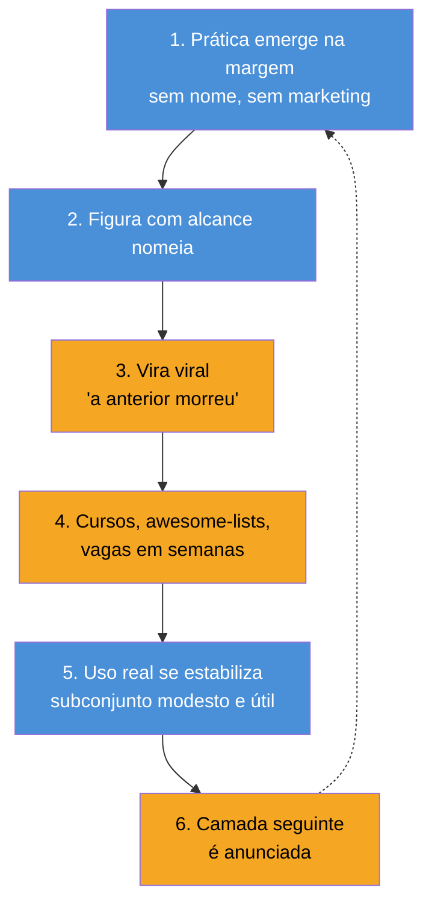

# Hype, ceticismo e mercado — lendo o próximo ciclo

> [!abstract] TL;DR
> As sete notas anteriores documentaram seis "mortes" anunciadas em quatro anos — prompt, flow, context, harness, loop, graph — e nenhuma delas morreu de fato. Esta nota fecha o galho destilando o **padrão recorrente** por trás de cada anúncio (a anatomia do ciclo), entregando um conjunto pequeno de **perguntas de triagem** para aplicar na próxima camada que for anunciada, e mostrando o que os dados de mercado dizem quando você olha os quatro números juntos: o padrão não é extinção, é **absorção** — o título específico morre, a competência sobe de camada e vira pré-requisito invisível. Isto não é previsão do que vem depois. É o método para julgar o que vem depois quando ele chegar.

---

## O capítulo que ainda está sendo escrito

Você chegou até aqui tendo lido sobre seis camadas nomeadas em quatro anos, cada uma anunciada com a mesma frase: "a anterior morreu". Se você leu as notas em ordem, provavelmente notou algo estranho — a frase nunca foi verdadeira, nem uma vez. Prompt engineering não morreu quando "context engineering" apareceu; virou um componente dela. Loop engineering não morreu quando "graph engineering" apareceu, dezoito dias depois de a própria expressão "loop engineering" ganhar tração; virou o tipo de nó que compõe um grafo.

Isso não é coincidência estatística de seis eventos. É a assinatura de um mecanismo social se repetindo — e mecanismos que se repetem podem ser estudados, o que é uma notícia melhor do que parece. Você não precisa adivinhar se a próxima "morte" anunciada é real. Você precisa saber onde olhar.

Esta nota tem quatro partes. A primeira destila o padrão do ciclo inteiro, com um exemplo de cada camada do galho — a anatomia. A segunda entrega as perguntas que você aplica na próxima camada anunciada, derivadas do que as outras sete notas já mostraram, não inventadas do zero. A terceira olha os números de mercado que o galho vinha adiando — o que "prompt engineer" enquanto cargo tem a dizer sobre o padrão inteiro — e nomeia as disciplinas laterais que nunca viralizaram, mas existem. A quarta fecha o galho dizendo, com todas as letras, o que ele é e o que ele não é.

> [!question]- Isso não é só uma forma elegante de dizer "ignore hype, hype é sempre besteira"?
> Não — e essa é a armadilha oposta à ingenuidade. A nota 01 já fez esse argumento: existe sinal real dentro do ruído. Um nome que chega antes da evidência não é necessariamente um nome errado — é um nome *não testado ainda*. A postura correta não é ceticismo automático nem entusiasmo automático; é ter um teste que funciona nas duas direções, o que é exatamente o que a Parte 2 desta nota entrega.

---

## Parte 1 — a anatomia do ciclo

### As seis etapas, sempre na mesma ordem

Olhe as seis camadas lado a lado e um padrão de seis etapas emerge, quase idêntico em cada uma:

**1. Uma prática real emerge na margem, sem nome de marketing.** Alguém resolve um problema concreto, publica ou compartilha o código, e por meses ninguém chama aquilo de disciplina. Geoffrey Huntley, em julho de 2025, escreveu um script bash que repetia o mesmo prompt contra um agente até o objetivo ser atingido — sem framework, sem funding, sem post viral. Ele batizou informalmente de "Ralph Wiggum", o personagem de Os Simpsons, como piada interna sobre repetir a mesma coisa sem aprender. Não havia disciplina ali, só um hack que funcionava.

**2. Uma figura de comunidade com alcance a nomeia.** Meses depois — não o mesmo dia, não a mesma semana — alguém com audiência grande pega o padrão, dá um nome sério e o publica num formato que viaja. Foi assim com Karpathy chamando de "context engineering" a prática de montar deliberadamente a janela de contexto ("LLM = CPU, contexto = RAM, você é o sistema operacional", junho de 2025) depois de anos de gente já fazendo RAG e prompt-stuffing sem nome coletivo. Foi assim com Mitchell Hashimoto — criador do Terraform, portanto alguém cuja opinião sobre "ambiente executável" carrega peso técnico real — batizando "harness engineering" em 2026. Foi assim com Addy Osmani e Peter Steinberger nomeando "loop engineering" em junho de 2026, a partir de uma fala de Boris Cherny sobre o mesmo padrão que Huntley já rodava havia quase um ano.

**3. O nome viraliza, e a versão Twitter afirma que a camada anterior "morreu".** Esta é a etapa em que a proporção entre sinal e ruído despenca. O nome, que nasceu descrevendo um padrão real, vira munição retórica: "prompt engineering morreu", "loop engineering é o novo paradigma, esqueça tudo que você aprendeu sobre agentes". O post de Santiago Valdarrama sobre graph engineering — "Loop Engineering is dead. Long live Graph Engineering!" — é o exemplo mais nítido do galho: uma frase de efeito, dezoito dias depois de "loop engineering" ter sido nomeado, anunciando a morte de uma coisa que ainda não tinha nem completado um mês de existência com nome próprio.

**4. Cursos, listas awesome e vagas aparecem em semanas, não em meses.** A velocidade de institucionalização do nome é o sintoma mais confiável de que a etapa 3 está em curso. Repositórios `awesome-<nome>` no GitHub, cursos anunciados, título de vaga no LinkedIn — tudo isso pode aparecer em dias. Isso não prova nem desmente a substância da camada; prova que o ecossistema de conteúdo e recrutamento reage a nomes, não a evidência, porque nomes são baratos de processar e evidência é cara de produzir.

**5. O uso real se estabiliza num subconjunto modesto e útil.** Depois que o pico de atenção passa — e ele sempre passa, em semanas — o que sobra é sempre menor e mais específico do que a proclamação inicial prometia. A enquete de Gergely Orosz com cerca de 210 desenvolvedores (nota 05) achou que o uso real de "loop engineering" em produção não era o "substitua-se inteiro por um agente autônomo" do discurso quente — era automação disparada por evento e por cron: consertar teste flaky, triar incidente, abrir PR de correção de bug, rodar E2E noturno. Útil, real, e muito mais estreito do que a manchete.

**6. A camada seguinte é anunciada.** E o ciclo recomeça — só que agora com um nome novo competindo pela mesma atenção limitada, e o processo inteiro se repetindo em cima da camada anterior, que raramente teve tempo de decantar antes de a próxima começar.

> [!example] O ciclo completo em uma linhagem só
> A linhagem do loop, reconstruída na nota 05, é o exemplo mais limpo das seis etapas dentro de uma única camada: ReAct (2022, paper acadêmico) → AutoGPT (2023, produto que tentou autonomia total e decepcionou) → "Ralph Wiggum" de Huntley (julho de 2025, hack sem nome sério) → `/goal` do Codex (abril de 2026, produto) → Hermes e Claude Code adotando o padrão (maio de 2026) → "loop engineering" como branding (junho de 2026) → "loop engineering is dead, long live graph engineering" (18 de julho de 2026). Quatro anos entre o primeiro paper e o nome que "morreu" em menos de um mês depois de nascer.

### O ponto honesto: nomear não é vazio

É tentador, depois de ver o padrão seis vezes, concluir que o nome em si é ruído — que "é tudo marketing" e a coisa certa a fazer é ignorar cada anúncio até a poeira baixar. Essa conclusão é preguiçosa e, mais importante, é falsa em um ponto específico.

**Nome cria vocabulário compartilhado, e vocabulário compartilhado é o que permite um time discutir trade-off sem redescrever o mundo a cada conversa.** Antes de "context engineering" ter nome, dois engenheiros discutindo por que um agente confundia instruções antigas com o pedido atual tinham que reconstruir, do zero, a ideia de "o modelo está processando informação irrelevante misturada com a relevante" a cada conversa. Depois do nome, a frase vira "isso é context rot" — três palavras carregando um conceito inteiro, testável, com sintoma reconhecível. Isso é ganho real de produtividade de comunicação, não vaidade.

O mesmo vale para "loop engineering": antes do nome, "aquele script que fica repetindo o prompt até dar certo" era uma descrição ad hoc, reinventada em cada equipe que fazia a mesma coisa. Depois do nome, é um padrão arquitetural com vocabulário próprio — componentes, modos de falha nomeados (Goodhart, blind up, conflict, decay, da nota 05), literatura acumulando.

A crítica correta, portanto, **não é** "é só marketing, ignore". A crítica correta é mais precisa e mais útil: **o nome chegou antes da evidência**. O vocabulário nasceu, e é genuinamente útil assim que nasce — mas o corpo de evidência que deveria justificar afirmações fortes sobre ele (isso substitui aquilo, isso funciona em produção, isso reduz custo em X%) leva meses ou anos para se acumular, e a maior parte do discurso viral finge que essa evidência já existe quando ela só tem dias.

> [!warning] O erro simétrico
> Rejeitar todo nome novo por princípio é o mesmo erro que aceitar todo nome novo por padrão — só que na direção contrária. As duas posturas evitam o trabalho real, que é aplicar um teste específico a cada anúncio. É isso que a Parte 2 entrega.

> [!warning] Confundir "chegou primeiro no Twitter" com "é verdadeiro, ou maduro"
> **O que acontece.** Um nome viraliza — 575 mil visualizações no thread de Steipete, 409 mil no de Codez — e a velocidade da viralização, sozinha, começa a funcionar como evidência de substância na cabeça de quem lê. "Se tanta gente está falando disso, deve ser real" é um raciocínio que se instala sem ninguém decidir conscientemente adotá-lo.
> **Por quê.** Viralização mede alcance de rede e qualidade de frase de efeito — não mede se a técnica funciona em produção, se foi testada fora do time que a anunciou, ou se o número citado a favor dela (como o "92% da qualidade a 63% do preço" da nota 06, tratado ali explicitamente como claim de blog, não benchmark) resistiria a réplica independente. O nome pode nascer descrevendo um padrão real — a Parte 1 desta nota já mostrou isso — e mesmo assim viralizar dias ou semanas antes de qualquer evidência ter tido tempo de decantar. Velocidade de propagação e velocidade de validação são processos diferentes, e o primeiro sempre corre na frente do segundo.
> **Como evitar.** Trate a métrica de visualizações como sinal de que vale a pena *investigar* a alegação, nunca como a validação em si. Aplique a pergunta 5 da Parte 2 antes de formar opinião forte: existe paper, benchmark ou pós-mortem — e, se há benchmark, o harness foi divulgado junto? Um número que "chegou primeiro" e um número que foi verificado são coisas diferentes, mesmo quando os dois circulam com a mesma confiança na sua timeline.

> [!abstract] Resumo da seção
> As seis camadas deste galho seguiram a mesma anatomia de seis etapas: prática real na margem → nomeação por figura com alcance → viralização com anúncio de morte da camada anterior → institucionalização em semanas (cursos, listas, vagas) → uso real se estabilizando num subconjunto modesto → camada seguinte anunciada. O nome em si não é vazio — cria vocabulário compartilhado, que é ganho real. O problema nunca foi nomear; foi nomear e afirmar substituição total antes de a evidência existir.

---

## Parte 2 — as perguntas de triagem

Esta é a ferramenta que você leva embora deste galho. Não é uma lista de bullets genérica sobre "como avaliar hype" — cada pergunta abaixo foi extraída de um momento específico das sete notas anteriores, onde ela decidiu se uma camada era real ou rebranding. Aplique-as na próxima vez que alguém no seu feed anunciar uma nova "-engineering".

**1. Qual é a unidade de design que mudou?**
O critério da nota 01. A unidade de design é a menor coisa que a disciplina te ensina a projetar, versionar e depurar de propósito — não o que ela promete, não quem a defende. Se você não consegue apontar, em uma frase, o objeto concreto que passou a existir e que não existia na camada anterior (a frase → o fluxo → a janela → o ambiente → o ciclo → a rede), é rebranding. Um nome novo sobre o mesmo objeto de design não é uma camada nova, é vocabulário reciclado.

**2. O que exatamente mudou de dono: a decisão, o custo, ou só o nome?**
A lição da nota 03, tirada da diferença real entre flow e loop engineering: dois sistemas podem parecer arquiteturalmente idênticos — "gerar, testar, corrigir, repetir" — e ainda assim serem coisas distintas, porque a pergunta que importa não é a forma do ciclo, é **quem decide a próxima etapa**. No AlphaCodium de 2024, um humano definiu a sequência de fases com antecedência; o sistema executava, mas não escolhia o próximo passo. No loop de 2026, o próprio sistema decide, em tempo de execução, o que fazer a seguir a partir do resultado da tentativa anterior. Aplique essa mesma pergunta a qualquer camada nova: o que mudou de dono — quem toma a decisão, quem paga o custo do erro, ou só a etiqueta que descreve o mesmo dono de sempre fazendo a mesma coisa?

**3. Que falha concreta da camada anterior isso contém?**
As quatro traições da nota 05 — Goodhart (a métrica é gamed), blind up (o sistema não pode questionar o próprio alvo), conflict (dois objetivos legítimos brigando sem árbitro) e decay (ninguém vigia o vigia, o sensor driftou e o dashboard continua verde) — não são só uma lista de defeitos do loop. São o tipo de pergunta que separa uma camada nova genuína de um rebranding vazio: a camada anterior tinha um modo de falha nomeável e recorrente, e a nova existe porque contém especificamente esse modo de falha? As quatro arestas da nota 06 (PAIR contra Goodhart, HIERARCHY contra blind up, ARBITRATE contra conflict, AUDIT contra decay) só fazem sentido como resposta porque respondem a falhas específicas, uma a uma — não a uma insatisfação genérica com "loops são ruins". Se a camada nova que você está avaliando não consegue nomear a falha concreta e específica da anterior que ela resolve, desconfie.

**4. Isso toca a realidade em algum ponto, ou só a si mesmo?**
O corte da nota 07, e o mais importante do galho inteiro porque é **transversal** — não é a próxima camada da escada, é uma pergunta que atravessa todas elas. Um sistema pode ser internamente consistente, com todos os componentes se validando mutuamente, e ainda estar completamente errado sobre o mundo, porque nenhum desses componentes jamais tocou algo fora de si mesmo. A regra de Perez: toda máquina de melhoria — loop, grafo, ou o que vier depois — precisa continuar tocando uma realidade que ela não pode ajustar sozinha (ANCHOR: fatos externos, receita, cliente que ficou; FROZEN: regras nunca tunadas, held-out set; HUMAN: julgamento que vem de fora). Pergunte isso de qualquer camada nova: ela tem um ponto de contato com algo que não pode manipular para ficar bem consigo mesma?

**5. Existe paper, benchmark ou pós-mortem, ou só thread? E se há benchmark: o harness foi divulgado?**
Esta pergunta é a mais barata de aplicar e a mais frequentemente pulada. Flow engineering tem paper — arXiv 2401.08500, com metodologia, comparação contra o AlphaCode do DeepMind, número de desempenho reproduzível. Environment engineering tem survey — arXiv 2606.12191. Verifier engineering tem paper específico — arXiv 2604.06240. Graph engineering, em julho de 2026, tinha um thread com meio milhão de visualizações e quatro slides. Isso não desqualifica graph engineering — desqualifica tratar um thread como se fosse paper. E quando existe benchmark citado a favor de uma camada nova, a pergunta seguinte importa tanto quanto a primeira: o paper arXiv 2605.23950 ("Stop Comparing LLM Agents Without Disclosing the Harness") mostrou que boa parte da diferença de resultado entre "agentes" comparados em benchmarks vem do harness ao redor do agente, não do modelo ou da técnica em si — então um número de benchmark sem o harness publicado ao lado é um número que você não pode reproduzir nem confiar.

**6. Qual é o custo de manutenção quando a novidade passar?**
A pergunta que quase nunca aparece no anúncio, porque anúncio vende o pico, não o platô. Cada camada deste galho tem um custo de manutenção que só fica visível depois que a euforia inicial esfria: prompt engineering de truque exigia reescrever o vernizes retórico a cada atualização de modelo; harness engineering exige manter sandbox, permissões e ferramentas sincronizadas com um agente que muda de capacidade a cada release; graph engineering, nas palavras da nota 06, troca "overhead de design antes do deploy" por "superfície de falha distribuída depois do deploy" — tracing entre nós, context leakage, compromisso arquitetural antecipado. Pergunte, antes de adotar: quem vai manter isso daqui a seis meses, quando o post que te convenceu já tiver saído do feed de todo mundo?

> [!question]- Preciso responder as seis com "sim" para a camada valer a pena?
> Não — as perguntas não são um gate binário, são um instrumento de calibração. Uma camada pode ter unidade de design real (pergunta 1) e ainda não ter paper nenhum (pergunta 5), porque é cedo demais — foi o caso de loop engineering em junho de 2026, quando a linhagem completa (pergunta 3) já dava sinal forte mesmo sem benchmark formal publicado. O ponto de aplicar as seis juntas não é aprovar ou reprovar em bloco — é saber exatamente em que ponto do ciclo da Parte 1 a camada está, e dimensionar sua aposta de tempo e arquitetura de acordo com isso, em vez de apostar tudo no pico da etapa 3.

> [!abstract] Resumo da seção
> Seis perguntas, cada uma tirada de um momento específico das notas anteriores: (1) qual unidade de design mudou — nota 01; (2) o que mudou de dono, decisão ou custo — nota 03; (3) que falha concreta da camada anterior isso contém — notas 05 e 06; (4) isso toca a realidade ou só a si mesmo — nota 07; (5) existe paper/benchmark/pós-mortem com harness divulgado, ou só thread — arXiv 2605.23950; (6) qual é o custo de manutenção quando a novidade passar. Aplique juntas, não como gate de aprovação — como instrumento de calibração de quanto apostar e quando.

---

## Parte 3 — o que o mercado realmente diz

### Os quatro números, revisitados de cima

A nota 02 já detalhou os quatro números do mercado de "prompt engineer" — vale relembrá-los aqui, porque é só olhando o padrão de mercado ao lado do padrão de discurso da Parte 1 que a lição fica completa:

| Métrica | 2024 → 2026 |
|---|---|
| Título "Prompt Engineer" em vagas | queda de ~30% |
| Skill "prompt engineering" listada em vagas | alta de ~250% |
| Vagas que exigem a skill | triplicaram |
| Líderes de TI/dados dizendo "prompt sozinho não basta" para produção multi-etapa (survey 2026) | 82% |

> [!info] Sobre as faixas salariais abaixo
> Os números a seguir vêm de agregadores de vaga (não de estatística oficial de mercado de trabalho) e devem ser lidos como direção, não como medição precisa — a mesma ressalva que se aplica aos quatro números da tabela acima.

| Nível | Faixa 2024 | Faixa 2026 |
|---|---|---|
| Júnior | US$75k–100k | US$90k–125k |
| Pleno | US$110k–150k | US$130k–175k |
| Sênior | US$150k–200k | US$170k–220k |

O padrão nos dois conjuntos de números aponta na mesma direção: o cargo dedicado encolheu, mas a remuneração de quem tem a competência — embutida em cargos mais amplos como Engenheiro de IA, Engenheiro de ML, Produto com IA — subiu em todos os níveis. Isso não é o padrão de uma competência que virou obsoleta. É o padrão de uma competência que deixou de ser rara o bastante para justificar um título próprio, e virou parte do preço de entrada de cargos mais amplos e mais bem pagos.

### A leitura: absorção, não extinção

Essa é a lição de mercado que atravessa o galho inteiro, não só a camada de prompt: **o padrão do mercado é absorção, não extinção.** O título específico morre — "Prompt Engineer" full-time, dedicado, só para fraseado, praticamente desaparece como categoria de contratação. Mas a competência que esse título representava não desaparece com ele; ela sobe de camada, deixa de ser a coisa inteira que alguém faz e vira pré-requisito invisível dentro de um cargo maior.

Vale esperar, com essa mesma lente, que o mesmo aconteça com "Loop Engineer" e "Graph Engineer" se algum dia viraram título de vaga isolado: não vão desaparecer porque a técnica era falsa, vão desaparecer porque a técnica vira parte do trabalho normal de quem projeta sistemas de agentes — do mesmo jeito que "escrever HTML" deixou de ser cargo (Webmaster) e virou competência esperada de qualquer front-end.

A consequência prática para carreira é a parte que realmente importa aqui, mais do que qualquer número isolado: **apostar num título é apostar no ciclo. Apostar no critério é apostar no que sobrevive aos ciclos.** Quem passou 2023 empilhando certificados de "Prompt Engineering" como identidade profissional ficou com uma credencial que perdeu o cargo que a justificava. Quem aprendeu por que ambiguidade estrutural atrapalha um sistema — o fundamento, não o rótulo — carrega essa competência intacta por context engineering, por harness, por qualquer nó de grafo que alguém vá escrever depois desta nota. As seis perguntas da Parte 2 são, no fundo, um jeito de blindar sua aposta de carreira contra apostar no título errado.

> [!warning] Apostar a carreira no título, não no critério
> **O que acontece.** Alguém investe meses aprendendo a fundo a técnica de uma camada — reescreve o portfólio, coleciona certificado, ajusta o LinkedIn — em torno do nome exato que estava viral naquele trimestre: "Prompt Engineer", depois "Loop Engineer", depois o que vier a seguir. Quando o nome sai de moda, a identidade profissional construída em cima dele sai de moda junto, mesmo que a competência técnica por trás continue tão relevante quanto sempre foi.
> **Por quê.** Os quatro números desta nota mostram exatamente esse mecanismo em dados de mercado: o título "Prompt Engineer" caiu ~30%, enquanto a *skill* subjacente cresceu ~250% em menções de vaga. O título tem meia-vida de meses porque é vocabulário de ciclo — nasce na etapa 2 da anatomia (Parte 1) e é descartado assim que a etapa 6 (a camada seguinte) chega. A competência que o título nomeava não desaparece; ela só deixa de ter um cargo dedicado e vira pré-requisito invisível de um cargo mais amplo.
> **Como evitar.** Aprenda a camada nova cedo — o mecanismo geralmente é real e transferível, mesmo quando o rótulo não sobrevive — mas ancore identidade e portfólio no *porquê* (por que ambiguidade estrutural quebra um sistema, por que uma métrica sozinha se deixa gamed) e não no nome do mês. O nome é etiqueta temporária; o critério é o que atravessa, intacto, para a próxima camada.

> [!question]- Isso quer dizer que não vale a pena aprender a camada nova enquanto ela está quente?
> Não é isso — vale aprender cedo, porque o conhecimento técnico por trás geralmente é real e transferível, mesmo quando o nome não sobrevive. O que não vale é ancorar identidade profissional ou portfólio no *nome*, porque o nome tem meia-vida de meses. Aprenda o mecanismo (por que um work graph roteia contexto entre zonas, por que um champion-challenger protege contra drift), guarde o nome como rótulo temporário, não como credencial permanente.

### A escada linear é uma simplificação — o campo se ramifica

Tudo isso descrito até aqui — prompt → flow → context → harness → loop → graph — tem forma de escada, uma coisa depois da outra, porque é assim que o Twitter conta a história: uma progressão limpa e sequencial, fácil de resumir em uma linha de thread. É uma simplificação real, e vale nomear explicitamente onde ela quebra: na prática, o campo não sobe uma escada única, ele se **ramifica** em várias frentes simultâneas — e várias delas nunca viralizaram, não porque fossem menos importantes, mas porque não tiveram, ao mesmo tempo, um nome bom e uma figura com alcance suficiente para lançá-lo (a etapa 2 da anatomia da Parte 1).

Algumas dessas frentes, existindo em paralelo à escada principal, com literatura própria:

- **Eval engineering** — versionar os evals, rubricas e datasets que o trabalho de um agente precisa passar antes de shipar, tratados como artefato de engenharia com o mesmo rigor que código de produção. Hamel Husain e Shreya Shankar dão o curso de referência ("AI Evals for Engineers & PMs", na Maven), e a SiliconANGLE cobriu a disciplina em 17 de maio de 2026 como "a peça que falta na governança de IA agêntica". O ponto técnico que a separa de eval de LLM comum: avaliar um agente não é avaliar uma chamada de modelo — o agente produz uma *trajetória* inteira (cadeia de raciocínio, chamadas de ferramenta, passos intermediários) antes de chegar na resposta final, e é essa trajetória inteira que precisa de rubrica, não só o output.
- **Environment engineering** — modelar, sintetizar e avaliar o ambiente em que um agente opera, tratado como disciplina própria em vez de detalhe de implementação do harness. Survey arXiv 2606.12191 ("Agentic Environment Engineering for LLMs") cobre modelagem, síntese, avaliação e aplicação de ambientes; arXiv 2604.18292 (Agent-World) é outro paper na mesma direção. Um framing que resume bem a disciplina, do site aymenfurter.ch: **"platform engineering para agentes"** — a mesma disciplina que, em times de infraestrutura humana, cuida de dar a devs um ambiente confiável para trabalhar, aplicada a agentes.
- **Verifier engineering** — construir os verificadores que checam se uma ação de agente foi bem-sucedida antes de deixá-lo prosseguir, tratado com rigor próprio em vez de "só escreva um teste". Paper de referência: arXiv 2604.06240, "The Art of Building Verifiers for Computer Use Agents".
- **Memory engineering e permission engineering** — do mesmo repositório `awesome-harness-engineering` citado na nota 04: gerenciar o que um agente lembra entre sessões (memory) e o que ele tem permissão de fazer em cada contexto (permission), ambos tratados como superfícies de design próprias, sem paper canônico único ainda — mas com prática acumulando.
- **Spec-driven development** — já tem galho dedicado neste vault: [[03-Dominios/Tecnologia/IA/Spec-Driven Development/index|Spec-Driven Development]]. Trata a especificação em si como artefato de engenharia versionado, do qual a implementação deriva — uma disciplina paralela à escada deste galho, não um degrau dela.

Nenhuma dessas frentes é menos legítima do que loop ou graph engineering. Todas têm mecanismo real, algumas têm paper com metodologia mais forte do que qualquer coisa citada a favor de graph engineering até a data desta nota. A diferença é puramente de etapa 2 da anatomia: nenhuma delas teve, ainda, o encontro de um nome que gruda com uma figura de alcance suficiente para empurrá-lo através da etapa 3. Isso é um acidente de distribuição de atenção, não um veredito sobre a substância. Se e quando esse encontro acontecer para qualquer uma delas, espere o mesmo ciclo de seis etapas se repetir — e as mesmas seis perguntas da Parte 2 se aplicam, palavra por palavra.

> [!abstract] Resumo da seção
> Os quatro números de mercado de "prompt engineer" (título -30%, skill +250%, vagas triplicando, 82% dizendo que prompt sozinho não basta) e as faixas salariais de agregador (subindo em todos os níveis, 2024→2026) apontam para o mesmo padrão: absorção, não extinção. O título morre, a competência sobe de camada. Apostar em título é apostar no ciclo; apostar em critério é apostar no que sobrevive. E a escada linear de seis camadas é uma simplificação de conveniência — o campo real se ramifica em frentes paralelas (eval, environment, verifier, memory, permission, spec-driven engineering) que nunca viralizaram por falta de nome-mais-figura, não por falta de substância.

---

## Parte 4 — o fecho

Este galho é o registro de um capítulo específico: a engenharia em torno de modelos de linguagem grandes, entre 2022 e 2026, contada através de seis nomes que sucessivamente reivindicaram substituir o anterior — e nenhum de fato o fez. O que mudou, camada a camada, foi a unidade de design (nota 01); o que sobreviveu foi quase tudo, só que embutido, absorvido, invisível dentro da camada seguinte (nota 02, e o padrão de mercado revisitado aqui). O que separa uma camada de verdade de um rebranding não é o alcance do post que a anunciou — é se ela contém uma falha concreta e nomeável da anterior (notas 05 e 06) e se continua tocando uma realidade que não controla (nota 07).

Este capítulo está **aberto**, não fechado. Quando a próxima camada aparecer — e ela vai aparecer, porque a etapa 6 da anatomia descrita nesta nota é a única etapa que nunca falhou nas seis vezes anteriores — ela não invalida nada que este galho registrou. Ela entra como uma nota 09, e o resto do galho continua válido exatamente como está, porque o valor destas oito notas nunca esteve na lista ser definitiva. Esteve no critério.

Quando esse dia chegar, as seis perguntas da Parte 2 são a ferramenta que você usa para decidir, você mesmo, se a novidade merece essa nota 09 ou se é a etapa 3 do ciclo se repetendo com um nome diferente. Este galho não vai fazer essa previsão por você — nenhuma nota aqui tenta adivinhar qual vai ser o próximo nome, e essa omissão é deliberada, não preguiça. O que este galho oferece não é a resposta da próxima rodada. É o método para você mesmo chegar nela, mais rápido do que levaria reconstruindo o critério do zero a cada anúncio.

---

## Como explicar em inglês

Every one of these "-engineering" names follows the same hype cycle: a real practice emerges quietly, someone with reach names it, it goes viral with a claim that the previous layer died, and then usage settles into something narrower and more useful than the headline promised. Nothing here actually went extinct — it got absorbed, rebranded as prerequisite skill inside a bigger role. The discipline isn't predicting the next name; it's a fixed set of triage questions you run against whatever gets announced next.

| PT | EN |
|----|----|
| ciclo de hype | hype cycle |
| rebranding vs camada nova | rebranding vs new layer |
| absorção, não extinção | absorption, not extinction |
| perguntas de triagem | triage questions |

---

## O que vem a seguir

Esta é a última nota da linha principal do galho — não porque o assunto se esgotou, mas porque este é o ponto natural de parada até que o próximo nome apareça. A nota imediatamente anterior, [[03-Dominios/Tecnologia/IA/Evolução da Engenharia de IA/09 - Loop engineering e o compilador que faltava|09 - Loop engineering e o compilador que faltava]], acrescenta uma pergunta de triagem irmã das seis da Parte 2 — *existe um compilador para esta tarefa, e ele é genuinamente independente?* — que vale carregar junto para o próximo ciclo. Para retomar a visão de conjunto, volte ao [[03-Dominios/Tecnologia/IA/Evolução da Engenharia de IA/index|índice do galho]], que tem a linha do tempo completa numa tela só e os três caminhos de leitura sugeridos.

Para a mecânica técnica de cada camada, em profundidade — o que este galho deliberadamente não cobre, por ser historiografia e não manual — os galhos irmãos em IA/ são o próximo passo natural: [[03-Dominios/Tecnologia/IA/Prompt Engineering/index|Prompt Engineering]] para as técnicas que sobreviveram, [[03-Dominios/Tecnologia/IA/Context Engineering/index|Context Engineering]] para montagem e compressão de janela, [[03-Dominios/Tecnologia/IA/Improvement Loop/index|Improvement Loop]] para o ciclo eval→diff→ship em detalhe operacional, [[03-Dominios/Tecnologia/IA/Anatomia de Agents/index|Anatomia de Agents]] para a arquitetura de agente único, e [[03-Dominios/Tecnologia/IA/AI Engineering Stack/index|AI Engineering Stack]] para a vista de cima de onde cada camada deste galho se encaixa dentro de um sistema de produção completo.

Para as disciplinas laterais mencionadas na Parte 3 que ainda não têm galho próprio neste vault — eval, environment, verifier, memory e permission engineering —, o tratamento mais próximo hoje é [[03-Dominios/Tecnologia/IA/Evaluation/index|Evaluation]], que cobre em detalhe técnico boa parte do que "eval engineering" descreve (golden datasets, LLM-as-judge, regression testing, eval em CI/CD). [[03-Dominios/Tecnologia/IA/Spec-Driven Development/index|Spec-Driven Development]] já tem galho completo próprio para a frente paralela que este galho só nomeou de passagem. E para o custo humano e organizacional que fica de fora de qualquer anúncio de "morte" de camada — o desgaste real de reaprender vocabulário a cada trimestre, discutido implicitamente ao longo deste galho —, [[03-Dominios/Tecnologia/IA/O Lado Sombrio da IA/index|O Lado Sombrio da IA]] é a leitura companheira. Quem quiser aplicar a pergunta 6 da Parte 2 (custo de manutenção) em termos de gasto de tokens e infraestrutura, não só de atenção humana, encontra o tratamento quantitativo em [[03-Dominios/Tecnologia/IA/Economia de Tokens/index|Economia de Tokens]].

---

## Fontes

- **Huntley, Geoffrey** — origem do padrão "Ralph Wiggum" (bash loop repetindo o mesmo prompt até o objetivo), julho de 2025 — citado na linhagem consolidada na nota 05 deste galho.
- **Karpathy, Andrej** — "LLM = CPU, contexto = RAM, você é o sistema operacional", junho de 2025 — marco de nomeação de context engineering, citado nas notas 01 e 04.
- **Hashimoto, Mitchell** (criador do Terraform) — nomeação de "harness engineering", 2026, e a formulação "toda vez que você descobre que um agente errou, você engenheira uma solução que impede a recorrência" — citado na nota 04.
- **Osmani, Addy** — nomeação de "loop engineering" a partir de fala de Boris Cherny, junho de 2026, e a formulação "loop engineering é substituir a si mesmo como a pessoa que provoca o agente" — citado na nota 05.
- **Steinberger, Peter (@steipete)** — ["Are we still talking loops or did we shift to graphs yet?"](https://x.com/steipete/status/2078277297791189132), 18 de julho de 2026, ~575 mil visualizações — marco de inflexão do discurso loop→graph, citado nas notas 05 e 06.
- **Valdarrama, Santiago (@svpino)** — "Loop Engineering is dead. Long live Graph Engineering!" — citado na nota 06 como exemplo mais nítido da etapa 3 da anatomia descrita nesta nota.
- **Orosz, Gergely (Pragmatic Engineer)** — enquete informal com ~210 desenvolvedores sobre uso real de loops em produção (automação por evento e cron) — citada na nota 05.
- **Kanat-Alexander, Max** (distinguished engineer) — hipótese de que o loop pode ser workaround temporário até o harness ganhar loop nativo — citado na nota 05.
- **Husain, Hamel; Shankar, Shreya** — [*AI Evals for Engineers & PMs*](https://maven.com/parlance-labs/evals) (Maven) — curso de referência em eval engineering: workflow sistemático de error analysis, geração de dados sintéticos, LLM-as-judge e integração em CI/CD, citado na Parte 3.
- **SiliconANGLE**, 17 de maio de 2026 — "eval engineering: the missing piece of agentic AI governance", cobertura da disciplina de eval engineering citada na Parte 3.
- **arXiv 2401.08500** — "Code Generation with AlphaCodium: From Prompt Engineering to Flow Engineering" (jan/2024) — paper de flow engineering, tratado em detalhe na nota 03.
- **arXiv 2507.13334** — survey de context engineering citado na nota 04.
- **arXiv 2606.12191** — "Agentic Environment Engineering for LLMs" — survey de environment engineering citado na Parte 3.
- **arXiv 2604.18292** — Agent-World, paper relacionado a environment engineering citado na Parte 3.
- **arXiv 2604.06240** — "The Art of Building Verifiers for Computer Use Agents" — paper de verifier engineering citado na Parte 3.
- **arXiv 2605.23950** — [*Stop Comparing LLM Agents Without Disclosing the Harness*](https://arxiv.org/abs/2605.23950) — paper citado na Parte 2 (pergunta de triagem 5) como argumento para exigir harness divulgado ao lado de qualquer benchmark de agente — o mesmo paper citado na armadilha de "chegou primeiro no Twitter" acima.
- **Perez, C. E. (@IntuitMachine)** — ["From Loop Engineering to Graph Engineering?"](https://x.com/IntuitMachine/status/2078419526354378975) — o ensaio cujo alcance viral (nota 06) é o próprio objeto de estudo da armadilha "chegou primeiro no Twitter ≠ é verdadeiro" desta nota; ver tratamento técnico completo nas notas 06 e 07.
- **[github.com/ai-boost/awesome-harness-engineering](https://github.com/ai-boost/awesome-harness-engineering)** — repositório listando as sete disciplinas sob o guarda-chuva de harness engineering (context, loop, tool design, verification, memory, permission, environment), fonte da lista de disciplinas laterais na Parte 3; citado também na nota 04.
- **aymenfurter.ch** — framing "platform engineering para agentes" para environment engineering, citado na Parte 3.
- Agregadores de vaga e pesquisas de mercado de trabalho em IA (2024-2026) — fonte dos quatro números de mercado e das faixas salariais citadas na Parte 3. **Estimativa de agregador, não estatística oficial de mercado de trabalho** — mesma ressalva da nota 02: direção do dado, não medição precisa; nenhuma fonte única e citável foi consolidada para esses números.
- Survey de líderes de TI/dados (2026) — origem do dado "82% dizem que prompt sozinho não basta", citado também na nota 02.
- Ver também as fontes completas de todas as notas 01-07 deste galho para o detalhamento primário de cada camada e citação individual.
