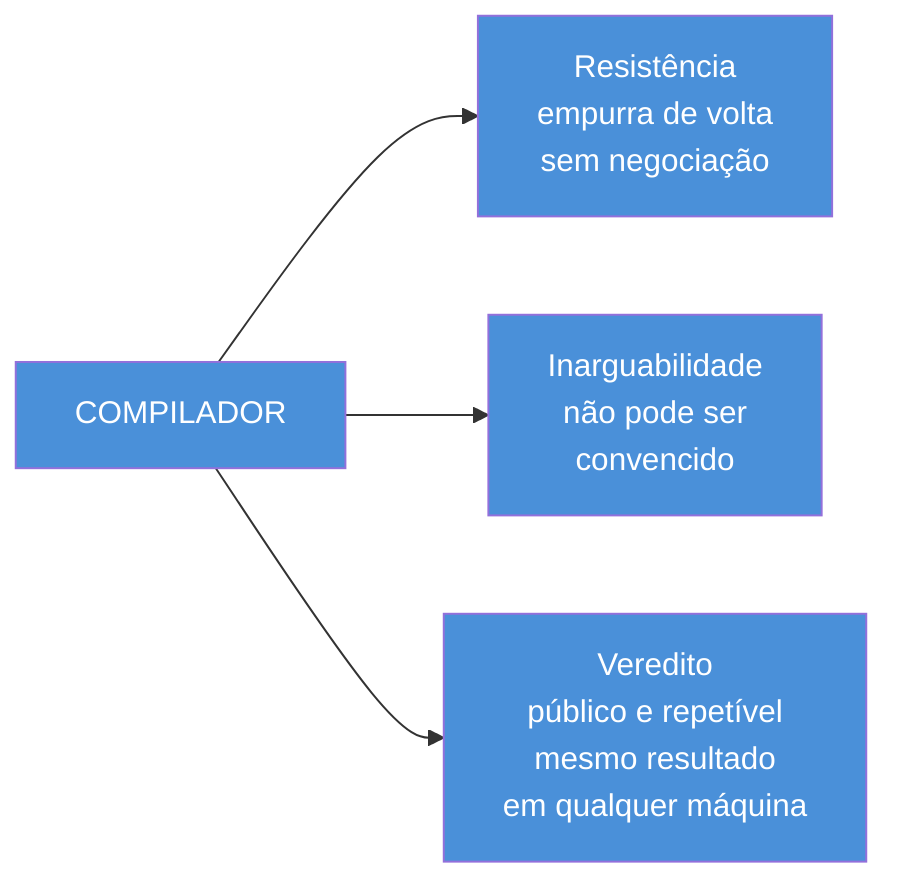
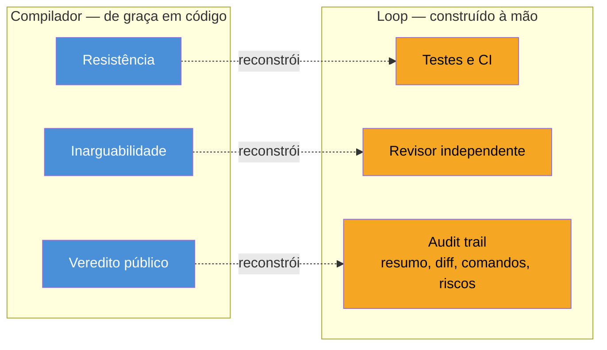
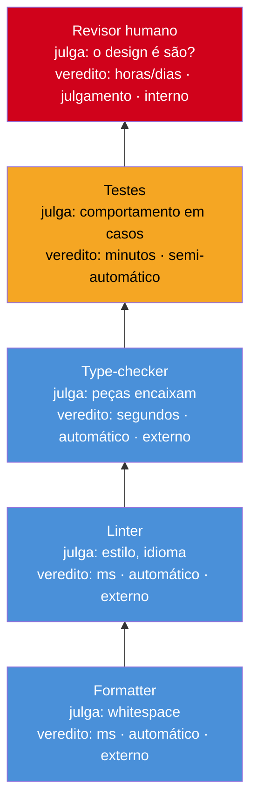

# Loop engineering e o compilador que faltava

> [!abstract] TL;DR
> Carlos E. Perez (@IntuitMachine) escreveu dois ensaios sobre loop engineering, não um. O primeiro — coberto nas notas 05 a 07 deste galho — pergunta como o loop funciona e como ele trai quem o construiu. Este, escrito antes daquele, pergunta uma coisa anterior: **por que alguns domínios precisam de loop e outros não precisam de nada parecido.** A resposta é que programação vem com um compilador de graça — algo que se recusa a deixar você errar de um jeito específico, que não pode ser convencido, e que dá um veredito público e repetível. É por isso que coding agents funcionam tão bem: não porque os modelos são melhores em código, mas porque o mundo confere o trabalho por você, de graça, toda vez que você aperta run. Loop engineering é o que você constrói quando esse presente não existe — e o primeiro movimento da disciplina não é desenhar o loop, é perguntar se um compilador já existe para esta tarefa. A parte mais afiada do argumento: um agente revisando outro agente do mesmo tipo é o lugar mais fácil de fabricar um juiz falso — o formato de verificação sobrevive, a única propriedade que o tornava confiável desaparece em silêncio.

---

## Duas perguntas, um autor, uma ordem invertida

Antes de entrar no argumento, vale marcar uma coisa que fica fácil de perder se você leu este galho em sequência: as notas 05, 06 e 07 vieram de um único thread de Perez, publicado em julho de 2026, com quatro slides que caminham juntos — o motor de quatro tempos, as quatro traições, a rede de loops, o corte grounded/ungrounded. Esta nota vem de um ensaio **diferente**, do mesmo autor, escrito **antes** daquele — publicado como texto corrido, sem os slides, com um título que já entrega a tese: "Loop Engineering and The Missing Compiler".

A ordem cronológica real, portanto, não é a ordem em que este galho apresentou o assunto. Perez primeiro perguntou por que loop engineering existe — esta nota. Só depois ele perguntou como o loop, uma vez construído, trai quem o construiu, e o que fazer quando uma rede inteira de loops se engana em conjunto — as notas 05, 06 e 07. Este galho manteve a ordem didática (motor → traições → rede → grounding) porque é a ordem que ensina melhor a mecânica; esta nota chega por último no galho, como a nota 09, mas chega **primeiro** na cabeça de quem escreveu os dois ensaios.

Isso importa porque muda o que esta nota é. Ela não é "a próxima camada da escada" — não introduz uma unidade de design nova, não sucede graph engineering, não compete por espaço na linha do tempo prompt→flow→context→harness→loop→graph que organiza o resto do galho. É uma **segunda lente** sobre a mesma camada que a nota 05 já cobriu: loop engineering. A nota 05 perguntou *como o motor de quatro tempos funciona, e como ele quebra*. Esta pergunta algo anterior a isso — **por que você precisa de um motor de quatro tempos, para começo de conversa, em alguns domínios e não em outros.**

> [!question]- Se as duas notas cobrem "loop engineering", elas não deveriam ter sido fundidas numa nota só?
> A tentação existe, mas fundir perderia o que faz cada ensaio valer a pena separadamente. A nota 05 é sobre a **forma** do loop — PICK, SET, MEASURE, ACT, e os quatro jeitos estruturais de essa forma trair quem a construiu. Esta nota é sobre a **origem** do loop — por que ele precisa existir, o que ele está tentando substituir, e onde ele estruturalmente não consegue chegar. São perguntas diferentes o suficiente para que responder as duas na mesma nota obrigaria a cortar pela metade uma das duas. E, como a seção final desta nota mostra, a resposta de "por que loop existe" (esta nota) e a resposta de "por que loop trai" (nota 05) acabam convergindo no mesmo ponto cego — mas chegam lá por caminhos diferentes, e vale ver os dois caminhos antes de perceber que são o mesmo destino.

> [!abstract] Resumo da seção
> Este galho apresentou o argumento de Perez fora de ordem cronológica: as notas 05-07 vêm de um ensaio posterior sobre a forma do loop e suas quatro traições; esta nota vem de um ensaio anterior sobre a origem do loop — por que ele precisa existir. Não é a camada seguinte da escada; é uma segunda lente sobre a mesma camada, respondendo a pergunta "por que" em vez de "como".

---

## O compilador vivido, não definido

Aqui está uma pergunta que qualquer time que já usou um agente de codificação e um agente de redação lado a lado já fez, mesmo sem formular exatamente assim: por que o agente de código parece confiável de um jeito que o agente de prosa, de estratégia ou de redação nunca parece? Você pede para um agente escrever uma função e sente que pode confiar no resultado de um jeito que não sente ao pedir para ele escrever um parágrafo de posicionamento de produto ou decidir a prioridade certa de um roadmap.

A resposta que circula por aí é sedutora e está errada: "os modelos são melhores em código do que em prosa". Errada não porque seja falsa como observação superficial — modelos de fato pontuam bem em benchmarks de código — mas porque ela aponta para a causa errada. Não é que o modelo "entenda" código melhor do que entende linguagem natural num sentido profundo. É que **código vem com uma coisa que prosa não vem: um compilador.**

Perez propõe definir compilador não pelo que ele produz — a tradução de código-fonte para algo que a máquina executa — mas pelo que ele **é**, vivido do ponto de vista de quem escreve o código. Nessa definição, um compilador é uma coisa que **se recusa a deixar você estar errado de um jeito específico**. Você escreve um type mismatch e ele te para seco. Você não pode adulá-lo. Não pode reformular o erro até ele ceder, insistir, tentar de novo com um argumento melhor. E a recusa dele é **evidente para qualquer outra pessoa** — rode o mesmo código em outra máquina, com outro compilador da mesma linguagem, e você recebe o mesmo veredito.

Reduzido ao essencial, um compilador é três propriedades soldadas em uma coisa só:

1. **Resistência** — algo que empurra de volta quando você erra, sem negociação.
2. **Inarguabilidade** — algo que não pode ser convencido a mudar o próprio julgamento, porque o julgamento não depende de você.
3. **Veredito público e repetível** — o resultado não é uma opinião de quem checou; é reproduzível por qualquer outra pessoa, em qualquer outra máquina, a qualquer momento.

O ponto central desta seção — e o que faz o argumento inteiro valer a pena — é que **programação é incomum** porque as três propriedades chegam de graça, embutidas na própria linguagem. Você não constrói a resistência de um type-checker: você a herda ao escolher uma linguagem tipada. Você não negocia com um compilador para que ele aceite um programa malformado: ele simplesmente não aceita, e essa recusa não depende de quem está pedindo, de quanto contexto foi dado, de quão bem articulado é o pedido.

**Essa é a razão silenciosa pela qual coding agents funcionam tão bem** — não porque os modelos são mais afiados em código do que em prosa, mas porque código é o raro domínio onde a realidade confere o trabalho por você, automaticamente, toda vez que você aperta run. O agente propõe; o mundo dispõe. E ninguém — nem o time que construiu o agente, nem quem opera o pipeline de CI, nem o próprio agente — paga o custo de construir esse árbitro. Ele já estava lá, embutido na gramática da linguagem, décadas antes do primeiro LLM existir.

> [!question]- Se o compilador é grátis em código, por que ainda existe tanto discurso sobre "verificar" o que um agente de codificação faz?
> Porque o compilador grátis cobre só uma fatia do que "código correto" significa — a fatia sintática e de tipos. Um programa pode compilar perfeitamente e ainda estar completamente errado: resolver o problema errado, ter um bug de lógica, degradar performance, introduzir uma falha de segurança. O compilador dá resistência, inarguabilidade e veredito público para uma classe específica e relativamente estreita de erro. Para tudo o que fica fora dessa classe — comportamento, design, adequação ao propósito — código não é diferente de prosa: também precisa de andaime construído à mão. É exatamente aí que a seção seguinte entra.

Compare isso, por um instante, com o domínio irmão deste galho que a nota 07 já tratou: as três âncoras de Perez — ANCHOR, FROZEN, HUMAN — nasceram para responder à mesma pergunta de fundo, num vocabulário diferente. As duas ideias vêm do mesmo autor perguntando, de dois jeitos diferentes ao longo de meses, a mesma coisa: **o que impede um sistema de melhoria de se enganar sozinho?** A seção final desta nota volta a esse parentesco com mais detalhe — vale carregá-lo desde já como pano de fundo.

> [!abstract] Resumo da seção
> Um compilador, vivido em vez de definido, é três propriedades soldadas: resistência (empurra de volta), inarguabilidade (não pode ser convencido) e veredito público e repetível (o mesmo resultado em qualquer máquina). Programação é o domínio raro onde essas três chegam embutidas na linguagem, sem custo de construção — é essa herança grátis, não superioridade do modelo em código, que explica por que coding agents funcionam tão bem.

---

## Loop engineering como arqueologia de verificação

Aqui está a virada do ensaio, e ela reformula tudo que este galho já disse sobre "por que loop engineering existe" numa frase mais funda do que qualquer uma das anteriores: **loop engineering é o que você constrói quando o compilador não existe.**

Visto assim, loop engineering deixa de ser principalmente sobre autonomia, sobre prompting esperto ou sobre orquestração de múltiplos passos — os enquadramentos que o próprio dev Twitter usou para vender a disciplina em junho de 2026, documentados na nota 05. É, antes de qualquer coisa, o trabalho de **notar que um tipo de tarefa não tem compilador**, e construir a coisa mais próxima disso que os materiais disponíveis permitem.

Um loop, nessa moldura, é o andaime que você embrulha em volta de um agente para que ele tente, ouça um "não", e tente de novo — e cada parte séria desse andaime corresponde a uma das três propriedades do compilador, reconstruída à mão precisamente porque o domínio não a forneceu de graça:

- **Testes e checks de CI = a resistência.** Manufaturada deliberadamente, porque nada na tarefa empurra de volta sozinho. Onde um compilador dá resistência de graça, um domínio sem compilador exige que alguém escreva o teste que vai desempenhar esse papel.
- **O revisor independente, o segundo passe que não escreveu o código = o juiz inarguável.** Instalado precisamente porque a coisa que fez o trabalho não pode ser confiada para dar a própria nota — o mesmo princípio, em forma de processo, que faz um compilador não aceitar argumento de quem escreveu o código malformado.
- **O audit trail no final — o resumo, o diff, os comandos rodados, os riscos nomeados = o veredito público.** O registro que permite a alguém que não estava dentro do loop confirmar, depois, o que de fato aconteceu — a réplica manual do "rode em outra máquina e receba o mesmo veredito".

Boa loop engineering, nesta luz, é só essas três propriedades reconstruídas com fidelidade — testes que de fato resistem, um revisor que de fato não compartilha o enquadramento de quem produziu o trabalho, um audit trail que de fato permite a alguém de fora reconstruir o que aconteceu. E a frase que fecha essa metade do argumento merece ficar isolada, porque é a consequência mais afiada do ensaio inteiro:

> [!warning] Má loop engineering é um agente falando consigo mesmo
> Reproduza tudo de um loop sério — o formato de teste, o formato de revisão, o formato de audit trail — menos as três propriedades que davam autoridade ao compilador original, e você não construiu um loop mais fraco. Você construiu **um compilador com a resistência, a independência e o veredito público todos silenciosamente removidos.** O formato sobrevive inteiro; a substância desaparece. É indistinguível, de fora, de um sistema de verificação real — até o momento em que algo que ele deveria ter pegado passa direto.

A implicação prática desse reenquadramento é a que dá título a esta seção: o primeiro movimento da disciplina de loop engineering **não é construtivo, é diagnóstico**. Antes de desenhar qualquer peça do andaime — antes de decidir que tipo de revisor instalar, que critério de parada usar, que formato de audit trail manter — a pergunta que precisa vir primeiro é: **o que seria um compilador para esta tarefa, e ele já existe?** Se existe, use-o; construir um loop por cima de um compilador que já resolve o problema é reinventar, com mais custo e menos confiabilidade, algo que já estava resolvido. Se não existe, você acabou de encontrar exatamente a coisa que o loop precisa fabricar.

Isso é literalmente uma escavação — daí "arqueologia de verificação", o vocabulário que dá nome a esta seção e que a nota inteira vai carregar até o fecho. Você não está inventando verificação do nada; está escavando, camada por camada, até achar o que já resiste de verdade num domínio que nunca lhe deu um compilador pronto.

> [!question]- Isso não é só reformular "escreva testes" com um nome mais bonito?
> Em parte, sim — e é honesto admitir isso. "Escreva testes antes de confiar no agente" já era conselho padrão antes deste ensaio existir. O que o reenquadramento acrescenta não é a prática, é o **diagnóstico que precede a prática**: por que testar, revisar e auditar são exatamente as três coisas certas a fazer, e não uma lista arbitrária de boas práticas. Elas são certas porque reconstroem, uma a uma, as três propriedades específicas que fazem um compilador confiável. Um time que sabe *por que* o revisor precisa ser independente — não "porque é boa prática ter segundo par de olhos", mas porque a independência é a propriedade que torna um veredito informação em vez de eco — desenha loops melhores do que um time que só está seguindo um checklist. A seção 5 desta nota mostra exatamente onde essa diferença de entendimento importa na prática.

> [!abstract] Resumo da seção
> Loop engineering é o que você constrói quando o compilador não existe para uma tarefa. Testes e CI reconstroem a resistência; o revisor independente reconstrói a inarguabilidade; o audit trail reconstrói o veredito público. Má loop engineering — o modo característico de falha da disciplina — é reproduzir o formato dessas três peças sem a substância que as tornava confiáveis: um agente falando consigo mesmo, disfarçado de sistema de verificação. E o primeiro movimento da disciplina é sempre diagnóstico: perguntar se um compilador já existe antes de construir qualquer coisa.

---

## A escada de verificadores

"Compilador" precisa ser plural, porque nenhum codebase real roda só um. Um projeto sério já empilha uma sequência inteira: o formatter, o linter, o type-checker, a suíte de testes, o revisor humano — cinco verificadores, não um, e cada um checa uma **altura de afirmação diferente**. O formatter julga whitespace. O linter julga estilo e padrões idiomáticos. O type-checker julga se as peças encaixam sem contradição. Os testes julgam se o programa se comporta como deveria em casos concretos. O revisor julga se o design inteiro é são — se aquela é a arquitetura certa para o problema, não só se o código está correto linha a linha.

Empilhados, esses cinco formam uma escada, e cada degrau verifica algo que o degrau abaixo estruturalmente não consegue enxergar. Um type-checker pode aprovar um programa perfeitamente tipado que resolve o problema errado. Um teste pode passar num programa que passa naquele caso específico e falha silenciosamente em todo o resto. Nenhum degrau de baixo compensa a cegueira do degrau de cima; cada um cobre uma fatia própria, e a fatia não se sobrepõe.

O que muda, degrau a degrau, não é só *o que* é checado — é **o veredito em si**, em três dimensões ao mesmo tempo. Embaixo da escada, o veredito é instantâneo, automático e externo: um type error é decidido em milissegundos, por algo fora de quem escreveu o código, sem nenhum julgamento humano envolvido no caminho. Subindo, o veredito fica progressivamente mais lento, menos automático e menos externo. "Essa arquitetura se sustenta?" não pode ser decidido em milissegundos, não pode ser decidido sem julgamento, e não pode ser decidido inteiramente por nada que não seja uma pessoa olhando o problema.

O check no topo da escada ainda faz o mesmo essencial que o check embaixo faz — pegar uma afirmação e forçá-la contra algo real, recusar deixá-la passar se não resistir. Mas ele precisa **esticar muito mais para tocar a realidade**, e o toque, quando finalmente chega lá, é menos certeiro do que o toque instantâneo do type-checker embaixo.

Esta é a reformulação que sustenta o argumento inteiro desta nota, e vale grifar porque corrige um jeito preguiçoso de ler tudo que veio antes: **loop engineering não é a busca por "o" compilador faltante — como se houvesse um único verificador ausente esperando para ser construído.** É a busca pelo **compilador faltante num dado nível** da escada. A pergunta prática, para qualquer trabalho que você esteja tentando automatizar ou verificar, não é "existe um compilador para isso" em abstrato — é: **em que degrau eu estou, e o que um verificador teria que ser aqui, neste nível de abstração, para este tipo específico de afirmação?**

Isso muda o que "loop bem desenhado" significa na prática. Um loop que só verifica sintaxe quando a afirmação real que importa está no nível de arquitetura está verificando a coisa errada — está resolvendo, com rigor impecável, um problema um degrau abaixo do problema que de fato precisa de resposta. E um loop que tenta forçar um julgamento de arquitetura a passar por um checker automático de milissegundos está cometendo o erro inverso: pedindo ao degrau de baixo para responder por uma pergunta que só pertence ao degrau de cima.

> [!question]- Como eu sei em que degrau da escada uma tarefa específica está?
> Pergunte o que aconteceria se a resposta estivesse errada de um jeito que só um humano notaria. Se o erro é "essa variável tem o tipo errado", você está no degrau do type-checker — a máquina resolve isso sozinha, sem ambiguidade. Se o erro é "esse teste específico não cobre o caso que importa", você está no degrau dos testes — ainda mecanizável, mas alguém precisa ter escrito o caso certo primeiro. Se o erro é "essa é a abordagem errada para o problema, mesmo que tudo funcione tecnicamente", você subiu até o degrau do revisor, e nenhum automatismo vai substituir esse julgamento — só reduzir o volume de coisas triviais que chegam até ele.

> [!abstract] Resumo da seção
> Um codebase real roda uma escada de verificadores — formatter, linter, type-checker, testes, revisor — cada um checando uma altura de afirmação diferente. Subindo a escada, o veredito fica mais lento, menos automático e menos externo. Loop engineering não busca um compilador faltante em geral; busca o compilador faltante no nível específico em que uma dada afirmação vive.

---

## Réplicas são amostradores, não oráculos

A moldura da escada precisa de um rebaixamento honesto antes de merecer confiança, porque um compilador real e um verificador feito à mão não são o mesmo tipo de objeto — por mais que o segundo tente imitar o primeiro.

**Um compilador é total e determinístico.** Ele checa todo caso, toda vez, sem lacuna e sem opinião. Não existe programa que o compilador "esqueça" de checar, nem dia em que ele decida ser mais tolerante do que foi ontem. Os verificadores que loop engineering constrói à mão não têm nenhuma dessas duas propriedades: são **parciais e probabilísticos**. Uma suíte de testes só checa os casos que alguém pensou em escrever — e todo bug em produção que "os testes não pegaram" é, por definição, um caso que ninguém pensou em escrever. Um revisor só pega o que ele, por acaso, nota naquela leitura específica, num dia específico, com o nível de atenção que sobrou depois de tudo mais que estava competindo pela atenção dele. Um piloto, um experimento controlado, só mede a fatia do mundo que alguém teve o cuidado de instrumentar — e tudo fora dessa fatia continua invisível, funcionando ou quebrando sem que ninguém saiba.

Cada um desses três é uma **amostra da realidade**, substituindo a cobertura completa que só um compilador de verdade oferece. E a consequência prática disso é dura o suficiente para merecer ficar isolada: você nunca recebe, do outro lado de um loop bem construído, a mesma garantia que um compilador dá. Você recebe uma **sombra probabilística** dessa garantia — e o tamanho dessa sombra, o quanto ela de fato cobre versus o quanto só parece cobrir, é o ofício real de quem faz loop engineering.

> [!example] O tamanho da sombra é o que separa dois times que "têm testes"
> Dois times, dois codebases, os dois dizendo "temos suíte de testes automatizada rodando em CI antes de qualquer merge". Um time escreveu os testes cobrindo os caminhos felizes e os dois ou três casos de borda que alguém lembrou na hora — a sombra que essa suíte projeta sobre "o programa está correto" é fina: cobre uma fração pequena do espaço real de comportamento possível, e um bug fora dessa fração passa direto, com a suíte inteira verde. O outro time escreveu testes pensando deliberadamente em invariantes — propriedades que deveriam valer para qualquer entrada, não só para os exemplos que vieram à cabeça primeiro — e a sombra que essa suíte projeta é bem maior, mesmo com um número parecido de testes escritos. Nenhuma das duas suítes é um compilador. As duas são amostras. Mas uma amostra é escolhida com ofício, e a outra é escolhida por conveniência — e a diferença só aparece quando algo passa pela suíte fraca e explode em produção.

A habilidade central de loop engineering, nessa luz, é escolher **a amostra mais barata da realidade que ainda resiste genuinamente** — um check pequeno o bastante para rodar o tempo todo, sem virar gargalo, mas real o bastante para que o trabalho verificado não consiga fingir que passou. "Recriar compiladores" — o jeito como este galho, e o próprio ensaio de Perez, descreveram loop engineering até aqui — acerta a função que está sendo reproduzida, mas é levemente generoso demais quanto à confiabilidade efetivamente obtida. O que você constrói é maquinário grau-compilador, feito com materiais que apenas **aproximam** um compilador — nunca com a totalidade e o determinismo que davam ao original sua autoridade.

> [!abstract] Resumo da seção
> Compiladores reais são totais e determinísticos; réplicas feitas à mão — testes, revisores, pilotos — são parciais e probabilísticas, amostras da realidade em vez de cobertura completa dela. Você nunca recebe a garantia de um compilador, só uma sombra probabilística dela, e o tamanho dessa sombra é o verdadeiro ofício de loop engineering: escolher a amostra mais barata que ainda resiste de verdade.

---

## Independência é a parte fácil de falsificar

Esta é a seção mais afiada do ensaio, e a mais importante para quem trabalha rotineiramente com subagentes — o leitor típico deste vault, que usa mais de um agente na mesma sessão o tempo todo, um propondo e outro revisando.

Volte às três propriedades do compilador. Resistência é fácil de reconstruir — qualquer teste que falhe quando deveria falhar já tem resistência. Veredito público é fácil de reconstruir — qualquer log, qualquer diff salvo, qualquer resumo escrito já é, em algum grau, um registro público. A propriedade difícil, a que carrega o peso real da autoridade de um compilador, é a terceira: **inarguabilidade**. E ela vem de uma coisa específica que as outras duas não garantem sozinhas: **o compilador não pode compartilhar o seu enquadramento.**

Um compilador engaja seu código nos termos dele — a gramática da linguagem, as regras de tipo, a semântica formal — não nos termos de quem escreveu o código. Por isso, quando ele discorda de você, a discordância é **informação em vez de eco**. Ele não está confirmando o que você já pensava; está checando contra algo que existe independentemente do que você pensava. É essa independência de enquadramento, mais do que qualquer outra coisa, que torna o veredito de um compilador digno de confiança.

Reproduza tudo de um compilador **menos** isso — a resistência, o veredito público, o formato inteiro de "passa/falha" — e você não construiu um compilador mais fraco. Você construiu algo pior do que nada, porque tem a aparência de verificação sem a substância dela, e a aparência é exatamente o que faz alguém confiar nele sem checar mais.

Este é o modo característico pelo qual loop engineering falha na prática. Recorrer a um segundo agente como revisor é o movimento natural quando você precisa de um juiz independente — é literalmente a peça que a seção 2 desta nota descreveu como reconstrução da inarguabilidade. E é, ao mesmo tempo, **o lugar mais fácil de manufaturar um juiz falsificado**: um checker que emite veredito crocante de pass/fail, formatado exatamente como se fosse autoritativo, mas que vive no mesmo tipo de cabeça que o agente que fez o trabalho. Os dois foram treinados nos mesmos dados, com os mesmos vieses de "o que parece uma boa resposta", com a mesma noção implícita do que conta como completo. Então os dois podem concordar — confiante e silenciosamente — **exatamente no mesmo ponto cego.**

> [!warning] Um veredito vindo de algo que compartilha suas premissas é teatro vestido de verificação
> Não importa quão crocante o formato — "PASS", um score numérico, uma lista de checkmarks. Se o verificador nasceu do mesmo processo, dos mesmos dados de treino, do mesmo instinto sobre o que é "bom", que o trabalho que ele está verificando, a independência nunca existiu — só a aparência dela. E a aparência é o que mais importa para quem está decidindo se confia no resultado, porque é a única coisa visível de fora. Uma coisa pode ter exatamente o formato de um compilador — mesmas entradas, mesmas saídas crocantes — e ainda assim não ser um, porque **a única propriedade que tornava o compilador confiável é a invisível, e a invisível é a primeira a ser descartada** quando alguém monta esse tipo de verificação depressa demais.

> [!example] O teste rápido para reconhecer o padrão
> Pergunte, de qualquer par gerador/revisor que você montar com dois agentes: se o agente gerador tivesse um viés sistemático — preferir respostas mais longas do que o necessário, evitar admitir que uma abordagem não funciona, estruturar tudo do mesmo jeito mesmo quando o problema pede outra forma — o agente revisor teria como perceber? Se os dois vêm do mesmo modelo, com o mesmo prompt de sistema, sem nenhuma instrução deliberada para adotar um enquadramento diferente do que o gerador usou, a resposta honesta é quase sempre não. O revisor herda o mesmo ponto cego, porque nasceu do mesmo processo que o produziu — e um veredito que nasce do mesmo ponto cego não é independência, é o mesmo julgamento, ecoado de volta com formato de aprovação.

Vale marcar, para não parecer que isso invalida a prática inteira de revisão por agente: os melhores praticantes já meio que sabem disso, e é por isso que os manuais honestos de loop avisam, explicitamente, que um agente revisando um agente **não substitui** um check real — não porque revisão por agente seja inútil, mas porque ela não carrega, sozinha, a propriedade que dava ao compilador original sua autoridade. Onde funciona de verdade é quando a independência é construída deliberadamente: um prompt de revisão diferente o suficiente para forçar um enquadramento distinto, um modelo diferente do que gerou o trabalho, critérios de avaliação escritos e congelados **antes** de o trabalho existir — não inventados depois, olhando para o resultado, o que reintroduz exatamente o mesmo compartilhamento de enquadramento pela porta dos fundos.

> [!question]- Isso significa que revisão por agente nunca deveria ser usada como verificador principal?
> Não é isso — significa que ela precisa ser construída com a mesma disciplina que se aplicaria a qualquer outra peça de resistência manufaturada, e não tratada como um substituto barato de verificação humana só porque tem o formato de um checker. A independência não é binária; é um espectro, e cada decisão de design — mesmo modelo ou modelo diferente, mesmo prompt-base ou enquadramento deliberadamente distinto, critério definido antes ou depois de ver o resultado — move o revisor para mais perto ou mais longe de compartilhar o ponto cego do gerador. O erro não é usar um agente como revisor. É usá-lo sem perguntar, explicitamente, o que na configuração dele garante que ele não vai simplesmente concordar em silêncio.

Este ponto tem um parceiro direto em outra nota deste galho, e vale a conexão explícita: a nota 06 descreveu a aresta **AUDIT** — um loop que "vigia o vigia", instalado como resposta à traição de DECAY. O AUDIT da nota 06 é, exatamente, uma tentativa de instalar o juiz inarguável que esta seção está descrevendo. E o alerta desta seção é o mesmo alerta, com foco mais fino: um AUDIT falha do jeito descrito aqui **especificamente quando o auditor compartilha o enquadramento** de quem ele audita — quando foi treinado, configurado ou calibrado pelas mesmas pessoas, com os mesmos dados, na mesma cultura de "o que parece certo" que o resto do sistema. A nota 07 já chegou perto disso, de outro ângulo: um AUDIT dentro do mesmo grafo autoconsistente "não quebra o circuito de autoconsistência; só adiciona mais um voto ao consenso que já existia". A diferença de vocabulário entre as duas notas — "compartilha o enquadramento" aqui, "está dentro do mesmo grafo" lá — é a mesma observação, olhada de dois lugares diferentes da obra do mesmo autor.

> [!abstract] Resumo da seção
> A autoridade de um compilador vem de uma propriedade específica: ele não compartilha o enquadramento de quem escreveu o código, então sua discordância é informação, não eco. Recorrer a um segundo agente como revisor é o jeito natural de reconstruir essa independência — e o jeito mais fácil de falsificá-la, porque um agente do mesmo tipo, treinado nos mesmos dados, tende a concordar em silêncio exatamente no mesmo ponto cego do agente que revisa. Um veredito que compartilha premissas com o trabalho que verifica é teatro vestido de verificação, mesmo quando emite pass/fail com formato impecável.

---

## A torre tem um último andar

Continue subindo a escada da seção 3 e, em algum momento, você fica sem compilador para construir — não porque ninguém ainda tenha construído o certo, mas porque o próprio referente contra o qual verificar começa a rarefazer até sumir.

O linter checa contra uma regra escrita, algo tão externo quanto um documento de estilo. O teste checa contra uma execução real, um comportamento que de fato aconteceu quando o programa rodou. O piloto checa contra o mundo — devagar, caro, mas de verdade, com clientes reais reagindo a uma versão real do produto. Suba mais um degrau e você chega em afirmações do tipo "essa é a estratégia sábia", "isso é de bom gosto", "essa é sequer a pergunta certa" — e **não sobra referente externo nenhum contra o qual compilar.**

A tentação, chegando aqui, é ler isso como uma lacuna temporária — um compilador que ainda não foi construído, esperando ferramental melhor, mais dados, um modelo mais capaz de avaliação. É mais honesto, e mais útil no fim das contas, tratar como **um nível onde nenhum compilador pode existir**, ponto final, não porque a engenharia ainda não chegou lá, mas porque a própria estrutura da pergunta não admite esse tipo de resposta. O senso do que conta como bom trabalho, no topo da torre, não é um fato sobre o mundo externo que qualquer checker — humano ou automatizado — poderia medir contra uma referência fixa. Não pode ser instalado num verificador. Só pode ser **cultivado** — e onde é cultivado independentemente, por pessoas diferentes, em contextos diferentes, tende a divergir precisamente nos lugares que ninguém jamais testou em conjunto.

Acima dessa linha, a estratégia certa não é escalar — é **mudar de natureza**. Você para de tentar compilar o julgamento e começa a torná-lo **auditável**: expor o raciocínio e a evidência tão completamente quanto possível, de forma que um humano consiga tomar o veredito ele mesmo, informado, em vez de terceirizar a decisão para um verificador que não tem como existir naquele nível. A torre tem um último andar, e o movimento certo nele não é continuar empilhando verificadores cada vez mais sofisticados — é entregar o julgamento, totalmente documentado, a uma pessoa em quem se pode confiar para sentir a diferença.

> [!question]- Isso não é o mesmo argumento que a nota 07 já fez sobre a âncora HUMAN?
> É parente próximo, mas com um ângulo diferente que vale distinguir. A nota 07 argumenta que HUMAN funciona como âncora quando o julgamento vem **de fora do circuito** — não foi calibrado para concordar com o resto do sistema. O argumento aqui é sobre **em que nível** o julgamento humano deixa de ser opcional e passa a ser a única resposta estruturalmente possível: não "humano é uma das três âncoras disponíveis", mas "acima de um certo degrau da escada, humano é a única coisa que existe, porque compilador — de qualquer tipo — parou de fazer sentido como conceito". São compatíveis, mas a nota 07 fala de robustez (o humano pode falhar em ser âncora de verdade); esta seção fala de existência (não há nada além do humano para tentar, correto ou não).

> [!abstract] Resumo da seção
> Conforme as afirmações sobem a escada, o referente externo contra o qual verificar rarefaz até sumir — "essa é a estratégia sábia" não tem fato externo que um checker possa medir. Esse é um nível onde nenhum compilador pode existir, não uma lacuna que ferramental futuro fecha. Acima dessa linha, a estratégia certa é parar de tentar compilar o julgamento e torná-lo auditável — expor raciocínio e evidência para que um humano tome o veredito.

---

## Um compilador pressupõe uma spec

Esta é a parte mais funda do ensaio, e a que mais importa no trabalho intelectualmente mais difícil — a que a metáfora do compilador, usada sozinha, deixa de fora sem avisar.

Um compilador só consegue checar seu código porque as regras da linguagem **já estão definidas** antes de a checagem começar. "Correto" existe, fixo e externo, previamente a qualquer verificação específica — a gramática de uma linguagem de programação não é negociada a cada compilação, ela foi decidida, publicada, versionada, e o compilador só aplica o que já foi decidido. Essa premissa é praticamente invisível para quem programa, precisamente porque, em programação, ela quase sempre vale sem exceção: você raramente precisa perguntar "o que conta como Python válido" — isso já foi resolvido antes de você escrever a primeira linha.

Mas uma fatia grande do trabalho intelectual sério é **a parte que acontece antes de a spec existir**. Boa parte de pesquisa, de análise, de estratégia — o tipo de trabalho que este mesmo galho, na nota 08, chama de "a pergunta que vem antes de qualquer critério de triagem" — é descobrir qual é a pergunta certa, inventar o enquadramento que torna um problema tratável, decidir o que sequer contaria como boa resposta antes de qualquer resposta ter sido tentada. Isso **não tem análogo de compilador**, porque não existe nada contra o que checar até que essa parte esteja pronta. É uma atividade de natureza diferente da verificação — mais parecida com girar um problema por todos os enquadramentos disponíveis e ver qual sobrevive ao contato com os fatos, do que com aplicar uma regra já fixada contra um artefato já pronto — e nenhum verificador, por melhor construído que seja, faz esse trabalho por você.

A nota deste vault que mais leva essa distinção a sério tem um título que já entrega isso: [[03-Dominios/Tecnologia/IA/Spec-Driven Development/02 - O que é Spec-Driven Development|Spec-Driven Development]] trata a especificação em si como o artefato de engenharia que precisa existir **antes** de qualquer implementação ser avaliada como correta ou incorreta — e o próprio galho de SDD, em suas notas sobre a fase Specify, já reconhece implicitamente que escrever a spec é um trabalho de natureza diferente do trabalho de segui-la. O ponto que esta seção acrescenta é o motivo estrutural pelo qual isso é assim: escrever a spec é, literalmente, a parte do trabalho que **cria** o referente contra o qual um compilador algum dia vai poder checar. Antes dela, não há "correto" para checar contra nada.

A consequência disso para loop engineering é a que fecha o argumento inteiro do ensaio: loop engineering, **mesmo aperfeiçoada** — mesmo com a escada inteira da seção 3 bem construída, mesmo com independência genuína garantida na seção 5, mesmo sabendo exatamente onde parar na seção 6 — endereça só a **metade de verificação** do trabalho, e deixa a **metade de descoberta** inteiramente intocada.

> [!warning] O erro de categoria a evitar
> Acreditar que um verificador mais afiado vai fazer o seu pensamento por você. O verificador — qualquer verificador, do type-checker mais estrito ao revisor humano mais rigoroso — só pode dizer se você atendeu a um padrão que já existia antes dele checar. Ele nunca pode dizer **qual padrão valia a pena atender** para começo de conversa. Um loop de engenharia perfeito, aplicado à pergunta errada, produz uma resposta perfeitamente verificada para um problema que não precisava ser resolvido daquele jeito — e nenhuma quantidade de rigor de verificação corrige isso, porque o rigor de verificação inteiro pressupõe que a pergunta já estava certa.

Isso conecta de volta com o AlphaCodium da nota 03 deste galho de um jeito que vale nomear explicitamente. O AlphaCodium funcionava tão bem, em janeiro de 2024, precisamente porque competições de programação já vêm com a spec resolvida — o enunciado do problema, os testes ocultos, o critério de "aceito/rejeitado" definido por quem organizou a competição, antes de qualquer solução ser tentada. Os testes eram o compilador de graça, no sentido exato desta nota: a resistência, a inarguabilidade e o veredito público já estavam todos lá, embutidos no formato da competição, esperando para serem consultados. O flow test-driven do AlphaCodium não precisou descobrir o que "resolver o problema" significava — só precisou verificar, repetidamente, contra um padrão que já tinha sido decidido por outra pessoa. É o mesmo motivo, com o mesmo vocabulário, pelo qual esta nota abriu dizendo que coding agents funcionam bem: a spec, em competição de programação, já veio pronta.

> [!abstract] Resumo da seção
> Um compilador só checa porque a spec — o que conta como "correto" — já está definida antes da checagem começar. Boa parte do trabalho intelectual sério é a parte anterior a isso: descobrir a pergunta, inventar o enquadramento, decidir o que contaria como boa resposta. Esse trabalho não tem análogo de compilador. Loop engineering, mesmo perfeita, endereça só a metade de verificação e deixa a metade de descoberta intocada — e o erro de categoria é acreditar que um verificador mais afiado substitui o trabalho de pensar a pergunta certa.

---

## O loop engineer como arqueólogo de verificação

Junte as seis seções anteriores e a pergunta que abre qualquer trabalho de loop engineering deixa de ser "quão autônomo eu posso deixar o agente" — a pergunta que o dev Twitter de junho de 2026 fez viralizar, segundo a nota 05 — e vira uma interrogação mais curta e mais útil, aplicada tarefa por tarefa:

- O que seria um compilador **neste nível de abstração** específico?
- Quão barata pode ser a réplica que ainda **resiste genuinamente** e é **genuinamente independente**?
- Até onde na escada minha réplica alcança, antes de o referente rarefazer e a única jogada restante ser **publicar o julgamento para um humano**?
- E qual parte deste trabalho **não é verificação** — mas a descoberta do próprio padrão que um compilador teria precisado, se existisse?

Um bom loop engineer, nesta luz, é algo como um **arqueólogo de verificação**. Ele escava o compilador que o domínio nunca shipou, constrói a réplica mais fiel que os materiais disponíveis permitem, empilha essas réplicas escada acima até onde elas de fato alcançam — e, na parte que separa a disciplina de automação por wishful thinking, **marca claramente onde as réplicas param**. Ele sabe quais andares da torre têm um verificador real, quais têm só um amostrado e falível, e quais não têm nenhum, porque o julgamento ali é irredutivelmente humano ou porque a spec, honestamente, ainda não foi escrita.

A medida de um loop bom, então, não é quão autônomo ele deixa o agente. É a **qualidade do compilador que você consegue construir no nível em que você por acaso está**: apertado onde existe unit test de verdade, frouxo e lento onde só existe piloto, ausente onde o trabalho é gosto ou descoberta — e, nesse último caso, honesto o suficiente para dizer isso em voz alta em vez de fingir um verificador que não existe. A sabedoria de um loop engineer não é saber construir mais verificadores. É saber os níveis exatos em que a jogada certa é **parar** de construí-los, e entregar o julgamento, com toda a evidência exposta, a alguém em quem se pode confiar para sentir a diferença.

---

## Onde os dois ensaios de Perez se encontram

Este galho apresentou dois vocabulários diferentes para a mesma preocupação de fundo, e vale nomear o parentesco com precisão, sem forçar os dois a dizer exatamente a mesma coisa.

As **três âncoras** da nota 07 — ANCHOR, FROZEN, HUMAN — e as **três propriedades do compilador** desta nota — resistência, inarguabilidade, veredito público — são a mesma intuição, vestida em dois vocabulários diferentes, escrita pelo mesmo autor em dois momentos diferentes. Um ANCHOR (um fato que aconteceu, fora do controle do sistema) tem resistência: não pode ser adulado para dizer outra coisa. Um FROZEN (um held-out set nunca tunado) tem inarguabilidade: ninguém dentro do processo de melhoria pode negociar com ele. E as duas notas, cada uma à sua maneira, terminam no mesmo lugar — a pergunta de se algo dentro de um sistema de melhoria continua tocando algo que o sistema não controla.

Mas os dois vocabulários não dizem exatamente a mesma coisa, e vale explorar a diferença em vez de resolvê-la à força. A nota 07 fala, no fundo, de **tocar a realidade** — se o sistema tem uma corda descendo até algo externo, um fato, uma regra congelada, um julgamento que não veio de dentro do circuito. Esta nota fala de **quem tem autoridade para dizer não** — não apenas se existe uma conexão com o mundo externo, mas se essa conexão é capaz de recusar, de resistir, de emitir um veredito que a pessoa recebendo aquele veredito não pode simplesmente reformular até ele ceder.

As duas coisas normalmente andam juntas — um fato externo (ANCHOR) tipicamente também resiste (não pode ser convencido a dizer outra coisa), e um verificador com autoridade para recusar tipicamente também está tocando algo fora do circuito que ele mesmo não fabricou. Mas elas podem, em princípio, se separar. Um sistema pode estar tocando a realidade — recebendo dados externos genuínos — e ainda assim não ter autoridade de recusa nenhuma, se ninguém no processo tiver poder real de bloquear o que aquele dado externo sinaliza como errado; é o caso, comum o suficiente para valer nomear, de um dashboard que mostra números reais e ruins que ninguém age sobre eles. E um sistema pode ter autoridade de recusa forte — um revisor que bloqueia merge sem hesitar — e ainda assim estar tocando só a si mesmo, se aquele revisor nunca compara seu julgamento contra nada fora do próprio processo que o formou; é exatamente o caso da falsificação de independência descrita na seção 5.

> [!question]- Então qual dos dois vocabulários é o certo para usar?
> Nenhum é estritamente melhor — cada um ilumina uma falha diferente que a outra pode deixar passar. Use o vocabulário de grounding (nota 07) quando a pergunta em jogo é "de onde vem o dado que este sistema está usando para se avaliar" — útil para caçar circularidade num pipeline de métricas. Use o vocabulário do compilador (esta nota) quando a pergunta em jogo é "quem, ou o quê, tem autoridade real para dizer que este trabalho específico está errado" — útil para caçar revisão falsificada num par gerador-verificador. Um sistema robusto de verdade normalmente precisa passar nos dois testes, não só em um — e a razão de este galho manter os dois vocabulários separados, em vez de fundir um no outro, é que cada um pega um jeito diferente de o mesmo sistema se enganar.

Essa não é uma tensão que precisa de resolução — é o tipo de redundância que este vault trata como reforço, não como duplicação a ser podada. Ter dois jeitos de nomear o mesmo problema de fundo, vindos do mesmo autor em momentos diferentes, dá ao leitor duas ferramentas de diagnóstico em vez de uma, cada uma mais afiada para um tipo específico de falha.

> [!abstract] Resumo da seção
> Um loop engineer bom é um arqueólogo de verificação: escava o compilador que o domínio nunca shipou, constrói a réplica mais fiel possível, empilha escada acima até onde ela alcança, e marca com clareza onde para. As três âncoras da nota 07 e as três propriedades do compilador desta nota são a mesma intuição em vocabulários diferentes — grounding pergunta se o sistema toca algo externo; o compilador pergunta se algo tem autoridade para recusar. As duas perguntas normalmente andam juntas, mas não são idênticas, e vale manter as duas.

---

## O que vem a seguir

Esta nota não abre uma camada nova na escada prompt→flow→context→harness→loop→graph que organiza o resto do galho — ela reabre, com uma lente diferente, a camada que a nota 05 já cobriu. As duas juntas dão a loop engineering o tratamento mais completo que este galho oferece: a nota 05 mostra como o motor de quatro tempos funciona e como ele trai quem o construiu; esta mostra por que o motor precisa existir para começo de conversa, e onde, estruturalmente, ele nunca vai conseguir chegar.

Para fechar o galho como um todo, [[08 - Hype, ceticismo e mercado — lendo o próximo ciclo|08 - Hype, ceticismo e mercado]] continua sendo o ponto de parada natural — inclusive porque a sexta pergunta de triagem daquela nota ganha, aqui, uma pergunta irmã que vale carregar junto: além de "isso toca a realidade, ou só a si mesmo?" (o corte da nota 07), pergunte também **"existe um compilador para isso, e ele é genuinamente independente?"** — o corte desta nota. As duas perguntas, lado a lado, cobrem tanto a falta de conexão externa quanto a falsificação de autoridade interna, e juntas formam um filtro mais completo do que qualquer uma sozinha para avaliar a próxima camada — ou o próximo par gerador-verificador — que aparecer.

A prática de de fato construir grafos de agentes — não a arquitetura conceitual que a nota 06 documentou, mas as ferramentas concretas para desenhar nós, arestas, fan-out e verificadores em produção — vive em outro galho deste vault, sob [[Claude Code]], onde a mecânica de workflows dinâmicos e orquestração de subagentes é tratada em detalhe operacional. Esta nota deu o vocabulário para julgar se um desses verificadores, uma vez construído, é real ou falsificado; aquele galho é onde construir um de verdade.

Para a mecânica técnica de LLM-as-judge — a instância mais comum, em 2026, do padrão de "revisor que compartilha o enquadramento do gerador" descrito na seção 5 —, o galho [[Evaluation]] trata o assunto em profundidade técnica, especialmente [[03-Dominios/Tecnologia/IA/Evaluation/04 - LLM-as-judge — quando e como|04 - LLM-as-judge — quando e como]], que já documenta boa parte da mecânica que esta nota explica pela raiz. O galho [[Improvement Loop]] cobre a versão operacional do mesmo problema aplicada a prompts — vale revisitar [[03-Dominios/Tecnologia/IA/Improvement Loop/01 - O ciclo eval → diff → ship|01 - O ciclo eval → diff → ship]] com a pergunta desta nota em mente: o eval que fecha aquele ciclo é um compilador de verdade, ou uma réplica que precisa ser nomeada como tal? Para a mecânica de agente único — o que um agente vê, que ferramentas tem, como decide — [[Anatomia de Agents]] é a base conceitual sobre a qual qualquer par gerador-verificador é construído. E para a metade de descoberta que a seção 7 desta nota deixou deliberadamente fora do alcance de qualquer loop, [[Spec-Driven Development]] é o galho que trata, com rigor próprio, o trabalho de escrever a spec antes de qualquer verificação fazer sentido — em especial [[03-Dominios/Tecnologia/IA/Spec-Driven Development/02 - O que é Spec-Driven Development|02 - O que é Spec-Driven Development]], que é, lido ao lado desta nota, a outra metade da mesma moeda: o que fazer antes de qualquer compilador, real ou reconstruído, ter algo contra o que checar.

Para quem quer o precursor histórico do compilador de graça em ação, [[03-Dominios/Tecnologia/IA/Agentes de Codificação/index|Agentes de Codificação]] documenta, em detalhe operacional, exatamente por que ferramentas de codificação agêntica se tornaram o caso de uso mais maduro de IA aplicada — e a razão, lida com o vocabulário desta nota, é a mesma que abriu a nota inteira: código é o domínio raro onde a resistência, a inarguabilidade e o veredito público já vêm de graça, embutidos na linguagem, décadas antes de qualquer agente existir para se aproveitar disso.

---

## Fontes

- **Perez, C. E. (@IntuitMachine)** — "Loop Engineering and The Missing Compiler" (subtítulo: "Loop engineering as the search for the verifier a kind of work never came with"), thread no X. Fonte primária integral desta nota: as três propriedades do compilador (resistência, inarguabilidade, veredito público), a reconstrução dessas três propriedades em testes/CI, revisor independente e audit trail, a escada de verificadores (formatter → linter → type-checker → testes → revisor humano), o rebaixamento de réplicas a amostradores probabilísticos, a seção sobre independência falsificável, o argumento do último andar da torre, e a distinção entre a metade de verificação e a metade de descoberta do trabalho intelectual.
- **Perez, C. E. (@IntuitMachine)** — "From Loop Engineering to Graph Engineering?" — o ensaio posterior, coberto nas notas 05, 06 e 07 deste galho, citado aqui apenas para estabelecer a ordem cronológica real entre os dois ensaios e o parentesco entre as três âncoras (ANCHOR, FROZEN, HUMAN) e as três propriedades do compilador.
- **Vídeo relacionado, citado pelo próprio autor** — "What Makes Agency Actually Work?", https://www.youtube.com/watch?v=53Y3SYR5vTU — referenciado no ensaio original como leitura companheira sobre o que de fato faz agentes funcionarem bem; não assistido em detalhe para esta nota, citado como pista de leitura adicional na mesma linha argumentativa.
- Ver também as fontes de [[05 - Loop engineering — o motor de 4 tempos e as 4 traições]], [[06 - Graph engineering — a confiabilidade mora nas arestas]] e [[07 - Grounded vs ungrounded — tocar a realidade]] para o ensaio posterior do mesmo autor e o debate loop-vs-grafo ao qual ele responde — e para [[03 - Flow engineering — o precursor que ninguém cita]], onde o AlphaCodium (arXiv 2401.08500) já documentava, em janeiro de 2024, o caso concreto de um domínio em que a spec — e portanto o compilador — já vinha pronta.
