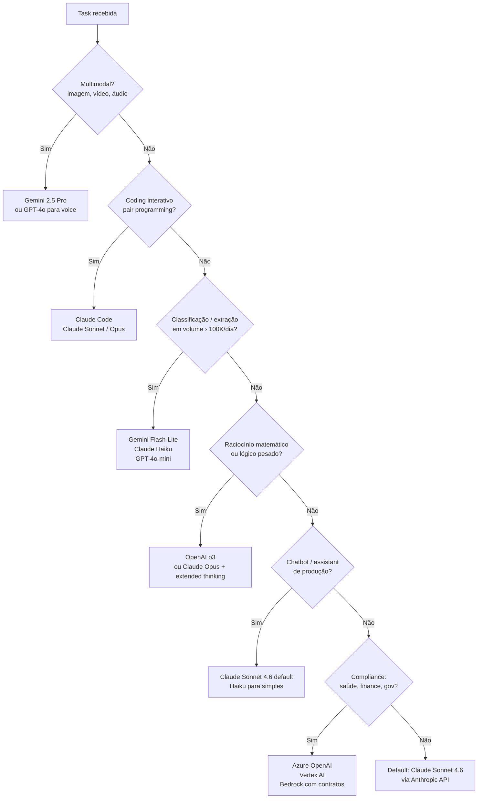
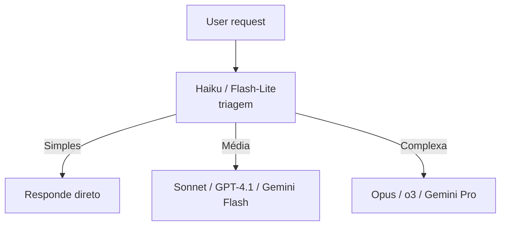
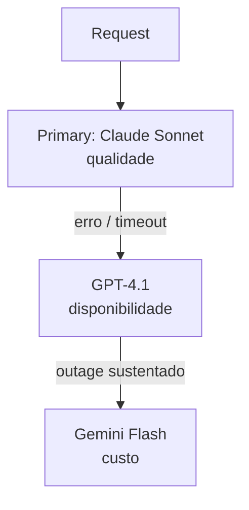
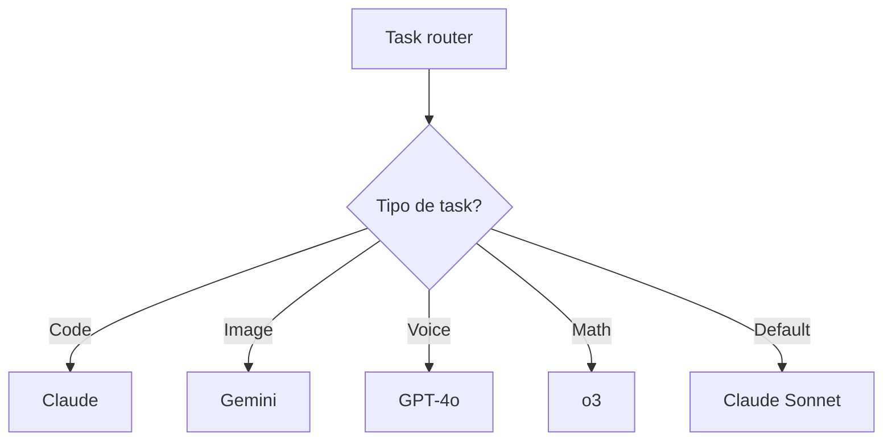
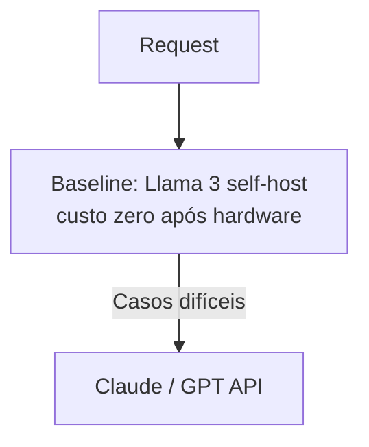

# Comparativo de LLMs

> [!abstract] TL;DR
> Não existe "o melhor LLM" — existe o melhor para cada combinação de task, custo, latência, stack e compliance. O padrão maduro em 2026 é **multi-provider com tiering agressivo**: modelo leve (Haiku/Flash) para triagem, modelo médio (Sonnet/GPT-4.1) para o grosso das tasks, modelo pesado (Opus/o3) apenas para casos difíceis. Claude lidera em raciocínio e tool use, Gemini em multimodal nativo, GPT em ecossistema e voice. A decisão correta exige golden set próprio — benchmarks públicos não substituem validação no seu workload real.

> "Qual [[Dicionário de IA#LLM (Large Language Model)|LLM]] devo usar?" é a pergunta que todo senior fullstack responde dezenas de vezes por ano. Esta nota é um framework de decisão prático, destilado de literatura técnica, post-mortems públicos, e benchmarks independentes. **Não existe "o melhor LLM"** — existe o melhor para cada combinação de (task, restrições de custo, restrições de latência, stack, compliance). Esta nota dá: uma matriz de decisão prática, trade-offs reais (não marketing), e critérios para escolher entre Claude, GPT, Gemini e ferramentas derivadas em 2026. Para notas individuais, ver [[Claude]], [[GitHub Copilot]], [[Codex]], [[Gemini]]. Para fundamentos de LLMs em geral, [[Anatomia dos LLMs|LLMs]].

> [!question]- Como responder "qual LLM devo usar?" em entrevista sem parecer que não sei?
> Mostre que a pergunta tem contexto, não uma resposta universal. Estrutura de resposta: "Depende de três critérios: (1) tipo de task — raciocínio complexo favorece Claude/Sonnet, multimodal favorece Gemini, volume alto de tasks simples favorece Flash/Haiku; (2) restrições — latência, custo por request, compliance/data residency; (3) stack existente — se a empresa vive no Google Cloud, Vertex AI reduz fricção; se vive no GitHub, Copilot é natural. O padrão maduro é multi-provider com tiering: modelo pesado para tarefas difíceis, modelo leve para triagem, fallback entre providers para resiliência."

## A pergunta errada e a pergunta certa

**Pergunta errada:** "Qual o melhor LLM?"

**Pergunta certa:** "Dada a task, o budget disponível, a latência tolerável, o stack existente e as restrições de compliance, qual LLM entrega o melhor resultado esperado?"

Antes de responder a primeira, é necessário esclarecer:

1. **Task:** coding interativo? Classificação em volume? Chatbot? [[Dicionário de IA#RAG (Retrieval-Augmented Generation)|RAG]]? Multimodal?
2. **Custo tolerável:** $0.001 por chamada ou $0.30?
3. **Latência:** tempo real (< 500ms) ou async (minutos)?
4. **Stack existente:** já usa GCP? AWS? GitHub? Nenhum?
5. **Compliance:** regulamentado (saúde, finance)? Data residency? On-prem?
6. **Volume:** 100 chamadas/dia ou 10M/dia?

Só depois dessas respostas faz sentido recomendar algo.

## As três famílias principais em 2026

| Família | Empresa | Modelos principais | Context max | Força definidora |
| --- | --- | --- | --- | --- |
| **Claude** | Anthropic | Opus 4.x, Sonnet 4.6, Haiku 4.5 | 1M tokens | Raciocínio profundo, código, [[Dicionário de IA#tool use\|tool use]] consistente, safety |
| **GPT** | OpenAI | GPT-4.1, GPT-4o, o1, o3 | 1M tokens (dependendo) | Ecossistema amplo, multimodal, voice, integração enterprise |
| **Gemini** | Google DeepMind | 2.5 Pro, 2.5 Flash, 2.5 Flash-Lite | 1M-2M tokens | Multimodal nativo, contexto gigante, integração Google Cloud |

Fora dessas, há players relevantes em nicho:

- **Llama 3/4 (Meta)** — open source state-of-the-art, base para self-hosting.
- **Mistral** — open source europeu, competitivo, compliance-friendly.
- **DeepSeek** — open source chinês, muito forte em coding, custo agressivo.
- **Qwen (Alibaba)** — open source, forte em multilingual (incluindo PT-BR).

## O que diferencia um senior escolhendo LLM

1. **Não decide por benchmark público.** Benchmarks decoram tasks; seu workload é único. Testa com golden set próprio.
2. **Separa modelo de ferramenta.** GPT-4.1 ≠ Copilot. Claude ≠ Claude Code. Ferramentas adicionam workflow, modelo é modelo.
3. **Tiering é default, não otimização.** Haiku/Flash para triagem, escalada para Sonnet/4.1, último recurso Opus/o3.
4. **Pin version em produção.** Nunca alias em críticos.
5. **Conhece os custos reais** — input tier, output tier, caching, batch.
6. **Testa migração antes de decidir.** Comparação side-by-side em amostra representativa.
7. **Considera total cost of ownership** — API + observabilidade + dev time + treinamento.
8. **Sabe onde cada modelo falha.** Claude pode ser cauteloso demais; GPT pode alucinar com confiança; Gemini pode ser inconsistente em text-only.
9. **Pensa em lock-in.** Migração cross-provider leva tempo; escolha com isso em mente.
10. **Revisa decisão a cada 6 meses.** Paisagem muda rápido.

## Matriz de decisão por task

### Coding interativo (pair programming)

**Ferramentas:** Claude Code, Cursor, Copilot Agent Mode, Gemini CLI.

| Critério | Recomendação |
| --- | --- |
| **Default** | **Claude Code** (Claude Opus/Sonnet) — raciocínio e tool use consistentes |
| **IDE-first, GitHub-centric** | **Copilot** (com Claude ou GPT como model) |
| **Codebase muito grande** | **Gemini CLI** ou Claude Code Opus (context longo) |
| **Async/paralelo** | **Codex Cloud** |
| **Voice/visual interaction** | **Cursor** ou **Gemini Live** (experimental) |

Stack típica em times produtivos em 2026: Claude Code + Copilot (inline completions). Os dois juntos costumam render mais do que qualquer um isolado.

### Chatbot em produção

| Critério | Recomendação |
| --- | --- |
| **Qualidade de conversa** | Claude Sonnet 4.6 ou GPT-4.1 |
| **Voice** | GPT-4o Voice ou Gemini Live |
| **Custo baixo** | Gemini Flash ou Claude Haiku |
| **Custo extremo** | Gemini Flash-Lite ou self-host Llama 3 |
| **Multilingual incluindo PT-BR** | Claude Sonnet ou Qwen (self-host) |
| **Compliance health/finance** | Vertex AI + Gemini ou Azure OpenAI + GPT |

### Classificação / extração em volume

| Critério | Recomendação |
| --- | --- |
| **Default** | Claude Haiku ou GPT-4o-mini ou Gemini Flash-Lite |
| **Cost-king** | **Gemini Flash-Lite** — frequentemente 2-3x mais barato |
| **Qualidade premium** | Claude Sonnet com structured outputs |
| **Self-host** | Llama 3 70B ou DeepSeek (coding) |

### RAG e search

| Critério | Recomendação |
| --- | --- |
| **Generator** | Claude Sonnet (seguir contexto com fidelidade) |
| **Embeddings** | Voyage 3, Cohere embed v3, ou OpenAI text-embedding-3-large |
| **Reranker** | Cohere Rerank v3 ou Voyage Rerank |
| **Grounding web** | Gemini com Search grounding |

Ver [[RAG e Vector Databases]] para deep dive.

### Agents com tool use

| Critério | Recomendação |
| --- | --- |
| **Default** | Claude Sonnet — tool use mais consistente |
| **Raciocínio pesado** | Claude Opus ou GPT o3 |
| **Cloud sandbox** | Codex (OpenAI) |
| **Framework** | Claude Agent SDK, LangGraph, Vercel AI SDK |

### Multimodal

| Critério | Recomendação |
| --- | --- |
| **Imagem/OCR** | Gemini 2.5 Pro ou Claude Sonnet (vision) |
| **Vídeo** | **Gemini 2.5 Pro** (único com nativo robusto) |
| **Áudio entrada/saída** | GPT-4o ou Gemini Live |
| **Combinação de múltiplos modos** | **Gemini 2.5 Pro** |

### Raciocínio matemático/lógico

| Critério | Recomendação |
| --- | --- |
| **Top tier** | **OpenAI o1 / o3** ou Claude Opus com extended thinking |
| **Budget** | Claude Sonnet com CoT ou self-consistency |

### Casos regulados (saúde, finance, governo)

| Critério | Recomendação |
| --- | --- |
| **Azure-first** | Azure OpenAI (GPT) |
| **GCP-first** | Vertex AI (Gemini ou Claude via Vertex) |
| **AWS-first** | Bedrock (Claude, Llama, Mistral) |
| **On-prem obrigatório** | Llama 3, Mistral, Qwen self-host |

## Matriz técnica comparativa

### Capacidades

| Aspecto | Claude 4.x | GPT-4.1/o3 | Gemini 2.5 |
| --- | --- | --- | --- |
| **Context window** | 1M | 1M | 1M-2M |
| **Multimodal text+img** | Sim | Sim | Nativo (melhor) |
| **Multimodal video** | Não nativo | Não nativo | **Sim nativo** |
| **Multimodal audio** | Não | GPT-4o | Sim nativo |
| **Voice mode** | Não | GPT-4o Voice | Gemini Live |
| **Extended thinking** | Sim (transparente) | o1/o3 (hidden) | Em Pro |
| **Tool use nativo** | Muito bom | Bom | Bom |
| **Structured outputs** | Via tool use | Sim nativo | Sim |
| **Prompt caching** | Sim (~90% desconto) | Sim (50%) | Context caching |
| **Batch API** | Sim (50% desconto) | Sim | Sim |
| **Fine-tuning** | Não (em breve?) | Sim | Sim |
| **Grounding web** | Não nativo | Via Assistants API | **Google Search nativo** |

### Custo (2026, aproximado, por 1M tokens)

| Modelo | Input | Output | Caching |
| --- | --- | --- | --- |
| **Claude Opus 4.x** | $15 | $75 | -90% |
| **Claude Sonnet 4.6** | $3 | $15 | -90% |
| **Claude Haiku 4.5** | $0.80 | $4 | -90% |
| **GPT-4.1** | $3 | $12 | -50% |
| **GPT-4.1-mini / 4o-mini** | $0.15-0.25 | $0.60-1.00 | -50% |
| **o3** | $15+ | $60+ | -50% |
| **Gemini 2.5 Pro** | $1.25-2.50 | $5-10 | Sim |
| **Gemini 2.5 Flash** | $0.30 | $2.50 | Sim |
| **Gemini 2.5 Flash-Lite** | $0.10 | $0.40 | Sim |

**Observação:** tiers de contexto longo, batch, caching e regional pricing podem fazer diferença enorme. Sempre consulte pricing atual do provedor.

### Qualidade de código (observação geral do mercado em abril 2026)

Baseado em benchmarks públicos (LMSYS Arena, SWE-Bench, LiveCodeBench), análises independentes (Artificial Analysis) e relatos consistentes da comunidade. **Sempre validar com golden set próprio antes de decidir.**

- **Refactors complexos, debugging profundo:** Claude Opus ~ o3 > Claude Sonnet > GPT-4.1 > Gemini 2.5 Pro
- **Coding interativo confortável:** Claude Code > Cursor > Copilot > Gemini CLI
- **Completions inline rápidas:** Copilot ~ Cursor > Claude Code
- **Tool use confiabilidade:** Claude > GPT > Gemini
- **Seguir instruções longas:** Claude > GPT > Gemini

### Segurança e safety

- **Claude:** Constitutional AI, mais conservador, admite "não sei" com mais frequência.
- **GPT:** moderação maduras, mas ocasionalmente alucina com confiança.
- **Gemini:** moderação forte, ocasionalmente bloqueia tasks legítimas.

Para tasks sensíveis: sempre prompt injection defense + output filtering + human-in-the-loop em ações destrutivas.

## Ferramentas derivadas — comparativo

### Coding agents locais/cloud

| Ferramenta | Modelo base | Tipo | Pontos fortes | Pontos fracos |
| --- | --- | --- | --- | --- |
| **Claude Code** | Claude Opus/Sonnet | CLI + IDE interativo | Raciocínio, tool use, skills, MCP, CLAUDE.md | CLI learning curve |
| **Cursor** | Múltiplos (GPT, Claude, custom) | IDE AI-first | UX excelente, tab completion, composer | Lock-in no IDE |
| **GitHub Copilot** | GPT + Claude + Gemini | IDE inline + chat + agent | Integração GitHub, multi-IDE, PR automation | Menos customizável |
| **Codex (OpenAI)** | GPT-4.1, o1, o3 | Agent cloud async | Paralelização, PR automation | Não interativo |
| **Gemini CLI** | Gemini 2.5 | CLI | Multimodal, grounding, contexto 2M | Ecosistema menor |
| **Gemini Code Assist** | Gemini | IDE extension | Integração GCP | Menos features que Copilot |
| **[[Dicionário de IA#Aider\|Aider]]** | Múltiplos (user escolhe) | CLI | Open source, controle fino | Requer config |
| **Cline** | Múltiplos | VS Code extension | Open source, flexível | Menos polido que Claude Code |
| **[[Dicionário de IA#Continue\|Continue]]** | Múltiplos | VS Code/JetBrains | Open source, multi-model | Maturidade variável |

### Frameworks de agent

| Framework | Provider | Pontos fortes | Pontos fracos |
| --- | --- | --- | --- |
| **Claude Agent SDK** | Anthropic | Nativo, MCP, observabilidade | Claude-first |
| **LangChain/LangGraph** | Community | Ecossistema gigante | Overhead, breaking changes |
| **Vercel AI SDK** | Vercel | Next.js/React DX excelente | Focado em web |
| **CrewAI** | Community | Multi-agent paradigm claro | Menos maduro |
| **AutoGen** | Microsoft | Academic rigor | Menos prod-ready |
| **llamaindex** | Community | RAG-focused | Menos agent-focused |

### Plataformas enterprise

| Plataforma | Provider | Pontos fortes |
| --- | --- | --- |
| **Azure OpenAI** | Microsoft + OpenAI | GPT com enterprise guarantees, Office integration |
| **AWS Bedrock** | AWS | Multi-model (Claude, Llama, Mistral), IAM, region selection |
| **Google Vertex AI** | Google | Gemini + Claude + modelos, governance, model garden |
| **Anthropic Console** | Anthropic | Claude direto, mais simples |
| **OpenAI Platform** | OpenAI | GPT direto, Assistants API |

## Framework de decisão prático

Quando você tem que escolher **agora**, use este fluxograma mental:



Se seu projeto tem múltiplas necessidades, tier agressivamente — não escolha um modelo para tudo.

## Padrões de arquitetura

### Padrão 1: tiering agressivo



Redução típica de custo: 5-10x vs usar modelo grande sempre.

### Padrão 2: multi-provider fallback



Resiliência contra outage de provider único.

### Padrão 3: especialização por capability



Cada task para o modelo onde ele brilha.

### Padrão 4: self-host + cloud híbrido



Custo previsível + qualidade em edge cases.

## Armadilhas comuns

> [!warning] Benchmark público como proxy do seu caso de uso
> MMLU, HumanEval e GSM8K medem habilidades específicas em distribuições controladas. "Gemini supera Claude em X benchmark" não prediz que Gemini vai superar Claude no seu workload. O único benchmark que importa para decisão de produção é um golden set do seu próprio problema, com distribuição real dos seus inputs. Decida com dados seus, não com leaderboards.

> [!warning] Escolher modelo pelo preço sem medir custo por output correto
> Flash-Lite é 10-20x mais barato por token do que Sonnet. Mas se Flash-Lite resolve 75% das tasks corretamente e Sonnet resolve 95%, o custo real por output útil pode ser maior com Flash — sem contar o custo de fallback, reprocessamento e erros que chegam a produção. A métrica certa é "custo por output correto", não "custo por token".

> [!warning] Ignorar custo de migração ao trocar de modelo
> "Vamos trocar de Claude para GPT" parece simples. Na prática: system prompts precisam de re-tuning (prompts otimizados para um modelo não portam direto), eval do golden set precisa ser reexecutado, a equipe precisa adaptar workflow. Switching cost é real e frequentemente subestimado. Inclua sempre no cálculo; modelos com compatibilidade de API similar (OpenAI-compatible endpoints) reduzem mas não eliminam o custo.

## Como ganhar experiência prática

Esta nota é framework de decisão. Para internalizar, prática é insubstituível. Três caminhos curados:

### Caminho 1 — Benchmark próprio com golden set (1 semana)

Construir golden set de 30-50 inputs representativos de uma task real. Rodar em 3 modelos lado a lado:

- Claude Sonnet 4.6
- GPT-4.1
- Gemini 2.5 Pro

Medir: accuracy (LLM-as-judge ou exact match), latência p50/p95, custo por chamada, taxa de erro de schema. Tabela comparativa final justificando a escolha.

**Critério de sucesso:** decisão fundamentada por dados, não por hype.

### Caminho 2 — Multi-provider router no Codex Technomanticus (2 semanas)

Implementar cliente que aceita lista de providers em ordem de prioridade, com fallback automático em erro/timeout e circuit breaker básico.

- Primary: Claude Sonnet
- Secondary: GPT-4.1
- Tertiary: Gemini Flash (cost fallback)

Testar simulando outage (mock 529 responses). Medir: latência adicionada pelo fallback, precisão comparativa.

**Critério de sucesso:** tem multi-provider funcionando com observabilidade básica.

### Caminho 3 — Tiered routing em projeto profissional (quando aparecer)

Em projeto profissional com volume relevante, implementar tiering Haiku/Flash → Sonnet/4.1 → Opus/o3 com classifier LLM decidindo dificuldade. Medir custo total vs usar modelo grande sempre.

**Critério de sucesso:** redução mensurável de custo (típico: 5-10x) sem perda de qualidade no golden set.

---

**Sugestão de ordem:** Caminho 1 → Caminho 2 → Caminho 3.

**Princípios universais (válidos em qualquer caminho):**

- **Não há religião.** Use o melhor para cada caso, não o "favorito".
- **Tiering é obrigatório em escala.** Sem ele, custo explode.
- **Fallback multi-provider salva o pescoço.** Outages acontecem.
- **Pin versions e tenha golden sets.** Updates silenciosos existem.
- **Meça custo por outcome**, não por token. Um modelo "caro" que acerta mais pode ser mais barato no total.

## How to explain in English

### Short pitch

"There is no 'best LLM'. There's the best LLM for a given task, budget, latency target, stack, and compliance constraints. The mature posture in 2026 is a multi-provider stack — Claude as primary for reasoning and tool use, Gemini for multimodal, GPT for voice and fallback — with aggressive tiering so Haiku or Flash handles the simple cases and the big models only get the hard ones. That's how cost and quality stay in balance at scale."

### Deeper version

"The core mental model: separate model from tool, tier by task, always benchmark on real data. Separate model from tool because 'Claude Code' and 'Claude' are different things — one is a coding agent, the other is a model. Tier by task because using Opus or GPT-o3 for everything is wasteful; Haiku and Flash handle simple classification at a fraction of the cost. And benchmark on real data because public benchmarks don't reflect how specific features behave.

The current meta in April 2026: Claude leads in reasoning and tool use, Gemini in native multimodal and cost at the low end, GPT in ecosystem breadth and voice. For a greenfield project, a sensible default is Claude Sonnet as the main model, Haiku for triage, and Gemini specifically for multimodal or extreme-cost use cases. Claude Code as the coding agent paired with GitHub Copilot for IDE completions is a strong pairing.

For enterprise, platform choice matters as much as model choice — Azure OpenAI, Vertex AI, or Bedrock — because data residency, IAM, and audit logs matter more than the model at that level."

### Talking points

- "No best model — best model for the specific (task, budget, latency, compliance) combination."
- "Tiering is not an optimization, it's the default."
- "Pin model versions in production. Golden sets on every change."
- "Fallback multi-provider saves you in outages. One incident teaches the lesson."
- "Separate model choice from tool choice."

### Tabela PT↔EN

| Português | Inglês |
|---|---|
| estratégia multi-provedor | multi-provider strategy |
| camada / tier de modelo | model tier |
| conjunto dourado | golden set |
| custo por resultado correto | cost per correct output |
| custo total de propriedade | total cost of ownership (TCO) |
| fidelidade de saída | output faithfulness |
| lock-in de fornecedor | vendor lock-in |
| custo de migração | switching cost |
| preço por região | regional pricing |
| fallback automático | automatic fallback |

## Recursos

### Benchmarks e leaderboards

- [LMSYS Chatbot Arena](https://chat.lmsys.org/) — ranking por voto humano
- [Artificial Analysis](https://artificialanalysis.ai/) — benchmarks independentes, cost/quality
- [MTEB](https://huggingface.co/spaces/mteb/leaderboard) — embeddings
- [HumanEval, MBPP, LiveCodeBench](https://paperswithcode.com/task/code-generation) — coding benchmarks
- [MMLU, GPQA, AGIEval](https://paperswithcode.com/sota) — reasoning benchmarks

### Análises independentes

- [Simon Willison's weblog](https://simonwillison.net/)
- [Pragmatic Engineer — AI](https://newsletter.pragmaticengineer.com/)
- [Ethan Mollick — One Useful Thing](https://www.oneusefulthing.org/)
- [Latent Space podcast](https://www.latent.space/)

### Pricing trackers

- [Artificial Analysis pricing](https://artificialanalysis.ai/models)
- [OpenRouter](https://openrouter.ai/models) — pricing + ao vivo

### Documentação oficial (pricing)

- [Anthropic Pricing](https://www.anthropic.com/pricing)
- [OpenAI Pricing](https://openai.com/pricing)
- [Gemini Pricing](https://ai.google.dev/pricing)
- [AWS Bedrock Pricing](https://aws.amazon.com/bedrock/pricing/)
- [Azure OpenAI Pricing](https://azure.microsoft.com/en-us/pricing/details/cognitive-services/openai-service/)
- [Vertex AI Pricing](https://cloud.google.com/vertex-ai/pricing)

## Deep dives — benchmarks, evaluation metodologia, arquiteturas de produção

### Benchmarks públicos — o que medem e por que enganar

Os benchmarks públicos mais citados e o que cada um realmente mede:

- **MMLU (Massive Multitask Language Understanding):** conhecimento geral via múltipla escolha em 57 tópicos. Problema: muitos modelos "viram" o benchmark no treino.
- **GPQA:** perguntas de ciência em nível PhD. Mais robusto a contamination.
- **HumanEval, MBPP:** coding benchmarks clássicos (funções Python). Problema: saturados — quase todos modelos modernos passam de 90%.
- **LiveCodeBench:** coding problems temporalizados (só problems pós-cutoff do modelo). Mais honesto.
- **SWE-Bench:** tasks reais do GitHub com PRs. Bem mais próximo de uso real de coding agent.
- **MATH:** problemas matemáticos de olympiad-level.
- **AIME:** problemas de competição matemática. o3 e similar brilham.
- **LMSYS Chatbot Arena (Elo):** ranking por voto humano blind. Mais subjetivo mas reflete "feel".

**Por que benchmarks enganam:**

1. **Contamination:** modelos podem ter visto o test set no treino.
2. **Saturation:** benchmarks fáceis deixam todos modelos empatados no topo.
3. **Optimization para o teste:** providers otimizam para benchmarks populares.
4. **Distribution mismatch:** seu workload não é benchmarks.
5. **Single-score reduction:** média não captura trade-offs.

**Regra:** benchmarks públicos são úteis para calibrar "ordem de grandeza" — nunca decisão final sem golden set próprio.

### Como montar um benchmark próprio

Processo que eu uso:

1. **Coletar ~50-100 inputs reais** da feature.
2. **Gerar respostas esperadas** (humano + validation).
3. **Definir métricas:** accuracy, latência, custo, faithfulness.
4. **Rodar candidatos** com temperature 0, modelo pinado.
5. **LLM-as-judge** para tarefas abertas (usando modelo forte como julgador).
6. **Revisão manual** de amostra para calibrar judge.
7. **Repetir** 3x para observar variância.
8. **Score table** com métricas e custo.

Ferramentas: [promptfoo](https://www.promptfoo.dev/), Langfuse, Braintrust, custom scripts.

### LLM-as-judge — o que considerar

Usar um LLM forte para avaliar outputs de outro é prático mas tem caveats:

- **Position bias:** judge tende a preferir primeira resposta quando comparando duas.
- **Length bias:** tende a preferir respostas mais longas.
- **Self-preference:** GPT-4 prefere respostas de modelos da OpenAI (documentado em papers).
- **Custo:** eval pode ficar caro em volume.

**Mitigações:**

- Rotacionar ordem em pairwise comparison.
- Prompt judge explicitamente a ignorar length.
- Usar modelo diferente de quem gera (se testando Claude, usar GPT como judge).
- Human calibration em amostra.

Paper importante: [Judging LLM-as-a-Judge](https://arxiv.org/abs/2306.05685).

### Arquiteturas de produção em detalhe

#### Arquitetura 1: Simple API direct

```text
App → LLM API
```

**Use quando:** POC, low-volume, single feature.

**Evitar quando:** escala, compliance, multi-model.

#### Arquitetura 2: Gateway + observability

```text
App → LLM Gateway (LiteLLM, Portkey) → {Claude API, OpenAI API, Vertex}
                                    ↓
                                 Langfuse/Helicone
```

**Benefícios:** unified API, routing, caching, observability centralizada.

**Use quando:** múltiplas features, múltiplos providers.

#### Arquitetura 3: Tiered routing

```text
App → Triage (Haiku/Flash) → {
  simple → responde
  medium → Sonnet/GPT-4.1
  hard → Opus/o3
}
```

**Benefícios:** custo/qualidade balanceado.

**Use quando:** escala relevante, diversidade de dificuldade de tasks.

#### Arquitetura 4: Multi-provider fallback

```text
App → Primary (Claude Sonnet)
      ↓ on failure/degradation
      Fallback 1 (GPT-4.1)
      ↓
      Fallback 2 (Gemini Flash)
```

**Benefícios:** resilience a outages.

**Use quando:** uptime crítico.

#### Arquitetura 5: Hybrid self-host + cloud

```text
Baseline: Llama 3 self-host
Escalation: Claude/GPT API em casos difíceis
```

**Benefícios:** custo previsível, privacidade.

**Use quando:** volume enorme, compliance, custo constraint severo.

### Switching cost entre providers — o que realmente dói

Migrar entre providers é mais caro do que parece. Componentes do custo:

- **Prompts:** prompts otimizados para um modelo não transferem idênticos.
- **Tool schemas:** formato varia sutilmente.
- **Structured outputs:** OpenAI usa JSON Schema, Anthropic usa tool use forçado, Gemini tem formato próprio.
- **Streaming formats:** diferentes SSE payloads.
- **Error handling:** códigos e retry policies diferentes.
- **Caching:** APIs e eficácia diferentes.
- **Observability:** traces diferentes.
- **Golden sets:** precisam re-validar.
- **Team knowledge:** dev precisa aprender nova API.

**Tempo típico de migração de feature séria:** 1-3 semanas de dev + 1-2 semanas de validation. Considere antes de decidir.

## Casos comuns no mercado

Padrões frequentes em times escolhendo e migrando entre LLMs em 2026.

### Caso 1 — Migração GPT → Claude com surpresa de custo

**Padrão observado:** time migra feature de GPT-4o para Claude Sonnet buscando "qualidade melhor". Qualidade sobe levemente, mas custo dobra porque:

1. Não usaram prompt caching (Claude tem caching agressivo; GPT-4o tem versão limitada).
2. Prompts otimizados para GPT ficaram verbosos quando migrados sem revisão.
3. Não ajustaram `max_tokens` (Claude tende a ser mais verbose por padrão).

**Fix típico:** adicionar prompt caching, condensar prompts, limitar `max_tokens`. Custo final tipicamente ~30% abaixo do GPT original.

**Lição:** migração requer re-otimização, não só troca de client.

### Caso 2 — Outage de único provider

**Padrão observado:** API do provider primário fica indisponível em horário de pico. Feature crítica fica fora por dezenas de minutos. Sem fallback configurado, recovery é manual.

**Fix típico:** fallback multi-provider em cascata (ex: Claude → GPT → Gemini) com circuit breaker em health checks passivos.

**Lição:** single-provider é single point of failure.

### Caso 3 — Silent model update

**Padrão observado:** feature usa alias (`claude-sonnet-4-5`). Provider atualiza atrás do alias. Taxa de erro/comportamento muda. Rollback para versão pinada anterior é necessário.

**Lição:** alias = não determinismo. Pin obrigatório + golden set em CI.

### Caso 4 — Flash-Lite competitivo em task imprevista

**Padrão observado:** task de moderação ou classificação rodando em modelo "default" (ex: Haiku). Benchmark com alternativa (ex: Gemini Flash-Lite) revela acurácia equivalente, custo 2-3x menor, latência similar. Migração trivial após validação.

**Lição:** sempre benchmark novos modelos. Superfície de pricing vs qualidade muda rápido.

### Caso 5 — Fine-tuning prematuro

**Padrão observado:** feature tem acurácia ~85%. Time decide fine-tuning para chegar a 95%. Custo de fine-tuning + tempo de setup + complexidade operacional altos. Alternativa típica (melhorar prompting, structured outputs, few-shot, RAG) chega a 92-94% sem tuning.

**Lição:** exaurir prompting/RAG antes de considerar [[Dicionário de IA#fine-tuning|fine-tuning]].

## Exercícios hands-on

### Lab 1 — Golden set benchmark próprio

1. Task real.
2. Golden set de 50 inputs + expected.
3. Rode em 3 modelos: Claude Sonnet, GPT-4.1, Gemini Pro.
4. Meça: accuracy, latência p50/p95, custo.
5. Tabela comparativa. Decisão fundamentada.

### Lab 2 — Multi-provider router

1. Implemente cliente que aceita lista de providers.
2. Roteamento por feature_id ou por latency/cost constraints.
3. Fallback automático em erro.
4. Circuit breaker simples.
5. Observabilidade via Langfuse ou similar.

### Lab 3 — Tiered routing

1. Task com diversidade de dificuldade.
2. Classifier LLM (Haiku) decide dificuldade.
3. Route para Haiku (fácil), Sonnet (médio), Opus (difícil).
4. Compare custo total vs usar Sonnet em tudo.

### Lab 4 — LLM-as-judge calibration

1. Golden set com 50 respostas humanamente rankeadas.
2. Use GPT-4 como judge sobre respostas de Claude.
3. Meça correlação com ranking humano.
4. Ajuste prompt do judge para melhorar correlação.

### Lab 5 — Switching cost analysis

1. Feature em produção (ou simule).
2. Documente todos os componentes impactados em migration.
3. Estime tempo e custo.
4. Compare vs ganho esperado.
5. Escreva ADR (architecture decision record) da decisão.

## O que vem a seguir

Esta nota fecha o galho **Ferramentas de IA**. Você mapeou Claude, Codex, Gemini, Copilot e o framework de decisão entre eles. O próximo passo natural dentro do domínio de IA é aprofundar os fundamentos que sustentam todas essas ferramentas — a [[Anatomia dos LLMs|Anatomia dos LLMs]] cobre transformer, tokenização, e mecanismos de atenção; [[Context Engineering]] explora como estruturar contexto para extrair o melhor de qualquer modelo. Para aplicações práticas avançadas, a trilha de [[Anatomia de Agents|Agents]] e [[RAG e Vector Databases]] dão o próximo nível de profundidade.

## Veja também

- [[Anatomia dos LLMs|LLMs]] — fundamentos técnicos
- [[Claude]] — ecossistema Anthropic
- [[GitHub Copilot]] — assistente integrado ao IDE
- [[Codex]] — agent cloud da OpenAI
- [[Gemini]] — família Google
- [[Context Engineering]] — que funciona cross-model
- [[Anatomia de Agents|Agents]] — padrões de agent independente de modelo1
- [[RAG e Vector Databases]]
- [[03-Dominios/Tecnologia/IA/MCP/index|Model Context Protocol]]
- [[03-Dominios/Tecnologia/IA/index|Inteligência Artificial]]
- [[Senda IA]]
