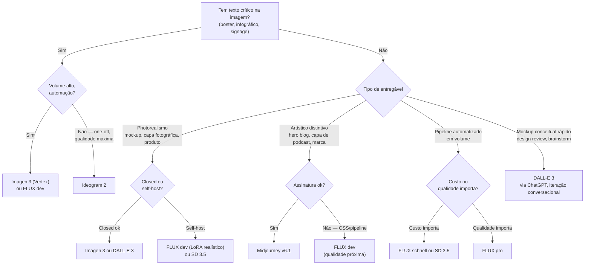

# 03 - Modelos de imagem 2026 — DALL-E, Imagen, Midjourney, FLUX, SD

> [!abstract] TL;DR
> Em 2026, seis modelos cobrem 90% dos casos práticos: **DALL-E 3** (OpenAI, integrado com ChatGPT, segue instrução bem), **Imagen 3** (Google, photorealismo + texto), **Midjourney v6.1** (assinatura mensal, qualidade artística, estilo consistente), **FLUX.1** (Black Forest Labs, pro fechado + dev/schnell open-source com qualidade próxima da MJ), **Stable Diffusion 3.5** (Stability AI, open-source, ecossistema de LoRAs e ControlNet) e **Ideogram 2** (especialista em texto-na-imagem). Cada um tem ponto forte e fraco; decisão por entregável segue regra simples (poster com texto → Ideogram/Imagen, photorealístico → DALL-E/Imagen, artístico → Midjourney, OSS self-host → FLUX/SD). Releases novos saem rápido — fonte de verdade pra deploy é doc oficial.

> [!question]- Como saber qual modelo escolher sem testar os seis? Existe regra 80/20?
> Sim. Sem contexto, o default para 2026 é **DALL-E 3 para prototipagem rápida** (disponível via API OpenAI, sem assinatura, segue instrução bem), **Midjourney v6.1 para qualidade artística final** (quando estilo importa e assinatura está disponível), e **Imagen 3 via Vertex AI para produção em volume** (SLA, photorealismo, texto renderizado). FLUX.1 [dev] entra quando o requisito é OSS ou self-host. A regra 80/20: se você não tem requisito de auto-hospedagem, orçamento apertado por imagem, ou texto crítico na imagem, DALL-E 3 ou Midjourney cobrem a maioria dos casos. Adicione os outros quando esses falharem.

> [!warning] Estado 2025-2026, sujeito a mudança — atualizações pontuais já cravadas
> Esta nota reflete o landscape de fim de 2025 / início de 2026 como base — Midjourney v6.1 atual com v7 rumored, Imagen 3 atual, FLUX.1 família estável — com três atualizações pontuais registradas: **Imagen 4** já foi lançado em 2025 (Google I/O de maio/2025, GA na Gemini API em junho/2025; esta nota ainda referenciava "quando disponível" na seção sobre Ideogram, corrigido abaixo); Black Forest Labs lançou **FLUX.1.1 Pro Ultra**, variante mais recente da linha FLUX.1 [pro]; e a Midjourney lançou **API web oficial em 2025**, o que muda a armadilha "pipeline via Discord bot" descrita mais adiante. Fora esses três pontos, o restante da nota segue como landscape de referência — provider lança versão nova a cada poucos meses, e antes de deploy vale sempre validar capabilities atuais no doc oficial.

## Por que tantos modelos existem — e o custo de escolher errado

Se gerar imagem fosse um problema já resolvido, existiria um modelo só. Em vez disso, seis providers competem com arquiteturas e prioridades diferentes — porque otimizar um eixo degrada outro: fidelidade fotográfica custa em estilo artístico, controle fino custa em velocidade, texto legível na imagem custa em generalidade fotográfica. Cada modelo é uma aposta de produto, não uma versão melhor do concorrente.

> [!question]- Por que não existe "o melhor modelo de imagem", ponto final?
> Porque treinar pra seguir instrução textual ao pé da letra (DALL-E 3) tende a produzir resultado mais "ilustrativo" que fotorealista puro. Treinar pra estética reconhecível e marcante (Midjourney) sacrifica previsibilidade — o mesmo prompt gera variações estilísticas maiores entre gerações. Treinar pra renderizar texto legível (Ideogram) reduz a prioridade dada a fotorealismo. Não é falha de engenharia — é escolha de trade-off.

O custo real de escolher o modelo errado não aparece no preço por imagem — aparece no retrabalho. Um time que escolhe Midjourney pra gerar posters com tipografia legível descobre, depois de dezenas de tentativas, que texto na imagem nunca foi o forte desse modelo. Um time que escolhe DALL-E 3 pra hero fotorealístico de produto descobre que o resultado sai "ilustrado demais" pra um catálogo de e-commerce. Em ambos os casos, o erro não foi técnico — foi pular a pergunta "qual é o entregável, e qual modelo foi desenhado pra esse tipo de entregável" antes de gerar a primeira imagem.

Esta nota existe pra encurtar esse ciclo: mapear o que cada modelo faz bem, o que faz mal, e uma regra de decisão por tipo de entregável — a tabela abaixo e o decision tree logo depois dela.

## Tabela comparativa

| Modelo | Provider | Open weights | Custo | Best for | Worst at | Notas |
|--------|----------|--------------|-------|----------|----------|-------|
| **DALL-E 3** | OpenAI | Fechado | API por imagem (~$0.04-0.08 standard/HD) | Segue instruções específicas, texto razoável, integração com ChatGPT | Photorealismo extremo, estilo artístico consistente | Disponível via API e ChatGPT; bom default pra quem está em fluxo OpenAI |
| **Imagen 3** | Google | Fechado | API por imagem via Vertex AI | Photorealismo, renderização de texto, qualidade fotográfica | Estilos artísticos exóticos | Acessível via Gemini API e Vertex AI; alguns modos exigem allowlist |
| **Midjourney v6.1** | Midjourney | Fechado | Assinatura ($10-120/mês) | Qualidade artística, estilo consistente via `--sref`, controle fino | API oficial limitada (Discord-first, web app maduro) | Padrão de fato pra trabalho artístico/branded; v7 rumored mas tratá-lo como especulativo |
| **FLUX.1 [pro]** | Black Forest Labs | Fechado | API (~$0.05/imagem) | Qualidade próxima da MJ, prompt adherence forte | Estilo artístico distintivo da MJ | Top-tier comercial open-ish; via fal.ai, Replicate, BFL API |
| **FLUX.1 [dev]** | Black Forest Labs | **Aberto** (non-commercial) | Self-host (compute próprio) ou ~$0.02-0.03 hosted | Customização via LoRA, controle, OSS responsável | Photorealismo extremo | Pode rodar em GPU consumer (24GB VRAM ideal); base pra fine-tunes |
| **FLUX.1 [schnell]** | Black Forest Labs | **Aberto** (Apache 2.0) | Self-host barato ou ~$0.003/imagem | Velocidade (4 steps), iteração rápida, comercial | Qualidade abaixo de dev/pro | Boa pra prototipagem em volume |
| **Stable Diffusion 3.5 Large** | Stability AI | **Aberto** | Self-host (compute) ou hosted | Customização extrema (LoRAs, ControlNet, IP-Adapter), comunidade enorme | Qualidade base abaixo de FLUX dev | Padrão de fato pra OSS; ecossistema vasto em Civitai/HuggingFace |
| **Ideogram 2** | Ideogram | Fechado | Web app + API | **Texto-na-imagem** (posters, signs, letras corretas) | Imagens sem texto (não é vantagem) | Especialista; ideal pra poster, infográfico, asset com tipografia |

## Forças e fraquezas por modelo

### DALL-E 3 (OpenAI)
**Forte:** segue instruções específicas literalmente — "logo no canto superior direito, texto centralizado no meio, paleta dark mode" funciona melhor que na média. Texto razoável. Integração com ChatGPT facilita iteração conversacional. Edit mode (inpainting) integrado.
**Fraco:** photorealismo extremo (vence Imagen). Estilo artístico marcante (vence Midjourney). Aspect ratios limitados (1:1, 16:9, 9:16, sem 4:5 nativo em alguns endpoints).

### Imagen 3 (Google)
**Forte:** photorealismo e fidelidade fotográfica. Renderização de texto está entre as melhores. Acesso via Vertex AI permite uso enterprise com SLA.
**Fraco:** estilos artísticos não-fotográficos saem mais genéricos. Filtros de segurança agressivos podem bloquear prompts inofensivos. Disponibilidade regional irregular.

### Midjourney v6.1
**Forte:** qualidade artística que vira marca registrada. `--sref <url>` e `--cref` permitem consistência de estilo e personagem entre gerações. Comunidade enorme com prompts/estilos compartilháveis. Controle fino (`--ar`, `--stylize`, `--chaos`, `--weird`).
**Fraco:** API oficial limitada — uso em pipeline automatizado historicamente passou por Discord bots ou terceiros não-oficiais. Texto na imagem é fraco (melhorou em v6 mas ainda atrás de Ideogram). Assinatura mensal, não pay-per-use.

### FLUX.1 [pro/dev/schnell]
**Forte:** prompt adherence (segue instrução) considerada melhor que MJ em muitos benchmarks. Versão `[dev]` é aberta (non-commercial) e roda em GPU consumer com VRAM razoável. Schnell é a versão rápida (4 steps) pra iteração. Já existe modo edição (FLUX.1 Tools — Fill/Depth/Canny/Redux).
**Fraco:** estilo artístico distintivo da MJ não está aí. Texto em imagem melhorou mas ainda inferior a Ideogram. Documentação oficial ainda em maturação.

### Stable Diffusion 3.5
**Forte:** ecossistema. LoRAs pra praticamente qualquer estilo. ControlNet pra controle de pose/edge/depth. IP-Adapter pra reference image. Ferramentas como Automatic1111, ComfyUI, InvokeAI dão controle granular. Comunidade Civitai.
**Fraco:** qualidade base sem fine-tunes está atrás de FLUX dev. Curva de aprendizado alta (modelos, samplers, schedulers, CFG, LoRAs). Para hosted hands-off, não é o default — vai pra FLUX ou Imagen.

### Ideogram 2
**Forte:** texto na imagem é o caso de uso. Posters, signs, lettering, infográficos com tipografia legível. Em 2026, ainda lidera essa subcategoria, com Imagen 4 (já lançado em 2025) e FLUX dev encostando.
**Fraco:** fora do caso "texto na imagem", é mediano. Não é escolha pra hero artístico ou mockup fotorealista.

**Quando usar Ideogram vs Imagen 3 pra texto:** Ideogram tem melhor controle tipográfico (fontes específicas, kerning, caixa-alta/baixa) e gera texto mais legível em corpo pequeno. Imagen 3 tem melhor photorealismo ao redor do texto (produto com label, embalagem com nome de marca) mas o texto em si é menos preciso em estilos especiais. Para texto simples e legível em layout limpo → Ideogram. Para texto como elemento de produto fotorealístico → Imagen 3.

## Decision tree por entregável

Atalho mental pra decidir, mesmo sem benchmark próprio:



## Caso prático: escolhendo modelo por um entregável real

Entregável: poster de divulgação pra um workshop interno de Docker, com título e data legíveis — "Docker na Prática — 15 de Julho" — e uma ilustração técnica de containers em camadas, formato vertical pra impressão A4.

**Passo 1 — decision tree:** tem texto crítico na imagem? Sim — o título e a data precisam sair legíveis, sem erro de ortografia nem letras deformadas. É um one-off (um único poster, não uma série automatizada), e qualidade tipográfica importa mais que custo por imagem. Isso aponta direto pra **Ideogram 2** — a tabela comparativa marca "texto-na-imagem" como o forte específico desse modelo, e nenhum dos outros cinco compete nesse eixo.

**Passo 2 — prompt enviado** (vocabulário adaptado ao forte de Ideogram, tipografia):

> "Poster vertical A4 para workshop técnico. Título grande no topo: 'DOCKER NA PRÁTICA'. Subtítulo abaixo: '15 de Julho'. Ilustração central: containers empilhados em camadas, estilo flat design, paleta azul e branco. Espaço em branco nas margens pra respiro visual. Tipografia sans-serif bold, alto contraste, legível a distância."

**Passo 3 — resultado esperado:** título e subtítulo renderizados sem erro de caractere — o ponto forte de Ideogram sobre os outros cinco modelos — com a ilustração de containers em estilo consistente com o brief. Se o mesmo prompt fosse enviado a Midjourney em vez de Ideogram, a chance de o título sair com letras deformadas ou trocadas seria maior: é exatamente a lacuna que a tabela comparativa e a seção "Forças e fraquezas" descrevem pra esse modelo.

Esse é o padrão do caso prático: o entregável define o critério dominante (aqui, texto legível), o critério aponta pro decision tree, e o decision tree aponta pro modelo — nunca o contrário.

## Modos de edição: além do "text-to-image"

Geração from-scratch é só uma feature; produção real usa muito edição:

- **Inpaint (mask + new content):** pinte máscara sobre região, peça novo conteúdo só ali. DALL-E (Edit mode), FLUX.1 Fill, SD Inpaint via ControlNet.
- **Outpaint (expand canvas):** estende borda da imagem. DALL-E Edit, FLUX, SD.
- **Image-to-image (i2i):** imagem base + prompt → variação. Praticamente todos os modelos.
- **ControlNet (SD/FLUX):** controla pose, edge, depth, segmentação. Forte na pipeline de produção, especialmente pra mockups com layout exato.
- **Reference image (`--cref` em MJ, IP-Adapter em SD, Redux em FLUX):** preserva personagem ou estilo entre gerações.

Modos de edição merecem nota própria; nota [[06 - Iteração visual — controlled changes]] cobre o essencial pra controle de iteração.

Ponto prático: a maioria dos projetos usa geração (text-to-image) para rascunho e edição (inpaint/outpaint/i2i) para refinamento. Planejar o pipeline de edição junto com a escolha do modelo evita retrabalho — nem todo modelo que gera bem também edita bem (DALL-E 3 edita via web app, menos via API; FLUX.1 Tools tem boa cobertura de edição via API).

## Código — chamando os modelos via API

Três providers com API direta e padrão de chamada diferente:

### OpenAI — DALL-E 3

```python
from openai import OpenAI

client = OpenAI()

response = client.images.generate(
    model="dall-e-3",
    prompt=(
        "Hero image para post de blog sobre DevOps. "
        "Fundo escuro, paleta azul e ciano, estilo minimalista. "
        "Servidor e engrenagens integrados em visual clean. "
        "Sem texto. Formato 16:9."
    ),
    n=1,
    size="1792x1024",   # 16:9 equivalente
    quality="hd",       # ou "standard"
    response_format="url",  # ou "b64_json"
)

print(response.data[0].url)
print(response.data[0].revised_prompt)  # prompt interno que o DALL-E realmente usou
```

DALL-E 3 revisa o prompt antes de gerar — `revised_prompt` mostra o que foi realmente enviado pro gerador.

### Google — Imagen 3 via Gemini API

```python
from google import genai
from google.genai import types
from pathlib import Path

client = genai.Client()

response = client.models.generate_images(
    model="imagen-3.0-generate-002",
    prompt=(
        "Fotografia de produto: embalagem de skincare premium, "
        "fundo branco, iluminação de estúdio suave, reflexo sutil no balcão. "
        "Sem texto na imagem."
    ),
    config=types.GenerateImagesConfig(
        number_of_images=2,
        aspect_ratio="1:1",      # "1:1", "3:4", "4:3", "9:16", "16:9"
        safety_filter_level="BLOCK_MEDIUM_AND_ABOVE",
    ),
)

for i, img in enumerate(response.generated_images):
    Path(f"produto_{i}.png").write_bytes(img.image.image_bytes)
```

### Black Forest Labs — FLUX.1 Pro via API

```python
import anthropic  # só um placeholder; FLUX usa REST direto ou via fal.ai
import requests, time, base64

# FLUX.1 [pro] — BFL API
headers = {"x-key": "SUA_CHAVE_BFL", "Content-Type": "application/json"}

# 1. submit task
resp = requests.post(
    "https://api.bfl.ml/v1/flux-pro-1.1",
    json={
        "prompt": "Ilustração vetorial minimalista para capa de podcast de tecnologia. "
                  "Fundo preto, linhas neon azul e roxo, formas geométricas. Sem texto.",
        "width": 1440, "height": 1440,
        "steps": 25, "guidance": 3.5,
    },
    headers=headers,
)
task_id = resp.json()["id"]

# 2. poll result
while True:
    result = requests.get(
        "https://api.bfl.ml/v1/get_result",
        params={"id": task_id},
        headers=headers,
    ).json()
    if result["status"] == "Ready":
        print(result["result"]["sample"])  # URL da imagem
        break
    time.sleep(2)
```

## Custo e escalabilidade

| Modelo | Custo por imagem | Latência típica | Self-host? |
|---|---|---|---|
| DALL-E 3 standard | ~$0.040 | 5-10s | Não |
| DALL-E 3 HD | ~$0.080 | 8-15s | Não |
| Imagen 3 (Vertex AI) | ~$0.02-0.04 | 3-7s | Não |
| Midjourney | ~$0.03-0.10 (assinatura) | 10-30s | Não |
| FLUX.1 [pro] | ~$0.05 | 5-10s | Não |
| FLUX.1 [schnell] hosted | ~$0.003 | 2-4s | Sim (Apache 2.0) |
| SD 3.5 Large (A100) | ~$0.003-0.01 | 2-5s | Sim |

Para pipeline em volume (10k+ imagens/mês), FLUX.1 [schnell] ou SD 3.5 em self-host são as opções de menor custo. Para one-off ou volume menor, o custo por-imagem é secundário à qualidade e à conveniência.

### Hosted intermediário — fal.ai e Replicate

Para usar FLUX ou SD sem gerenciar infraestrutura própria, fal.ai e Replicate oferecem hosted inference com API REST simples. fal.ai tem latência baixa (cold-start rápido em FLUX [schnell]: ~1-2s) e suporte a webhook. Replicate tem mais modelos disponíveis e boa documentação. Ambos cobram por segundo de GPU — menos que self-host em baixo volume, mais que self-host em alto volume. Ponto de crossover típico: acima de 5k-10k imagens/mês, self-host em GPU spot (A100 ou L40S) se torna mais barato do que fal.ai.

## Armadilhas comuns

> [!warning] Testar apenas um modelo e tratar como ground truth — cada modelo tem pontos cegos diferentes
> DALL-E 3 segue instrução textual bem mas falha em fotorealismo extremo. Midjourney é artístico mas fraco em texto. Ideogram é especialista em texto mas mediano em todo o resto. Decidir o modelo de produção sem testar 5-10 prompts representativos do caso de uso real leva a usar o modelo errado com resultado decepcionante. O processo correto: monte um mini-benchmark (5 prompts típicos do entregável, 1-2 gerações por modelo), avalie nos critérios que importam, então decide. Custo total de 10 testes: menos de $2 em APIs, mas elimina meses de retrabalho.

> [!warning] Usar wrapper de Discord bot não-oficial pra Midjourney quando já existe API web oficial
> Até a Midjourney lançar API própria, a comunidade construía wrappers usando Discord bot ou APIs de terceiros — sem SLA, quebrando a qualquer update da MJ, e violando termos de uso. Em 2025, a Midjourney lançou **API web oficial**, reduzindo a necessidade desses wrappers pra pipeline automatizado. Ainda assim, tutoriais e integrações antigas que ensinam o caminho via Discord bot seguem circulando — antes de montar um pipeline novo, confirme no doc oficial da Midjourney se o caso de uso é coberto pela API web atual (limites e pricing específicos: a confirmar no doc oficial) e prefira esse caminho a wrappers de terceiros. Para as demais opções de pipeline automatizado, DALL-E 3 (OpenAI API), Imagen 3 (Vertex AI), FLUX.1 (BFL API ou fal.ai) e SD 3.5 (self-host) seguem como alternativas diretas.

> [!warning] Ignorar o `revised_prompt` do DALL-E 3 e achar que o prompt que você mandou é o que foi usado
> DALL-E 3 expande e reinterpreta o prompt antes de gerar — o campo `revised_prompt` na resposta mostra o que o gerador realmente recebeu. Muitas vezes, o modelo adiciona descrições de personagem, estilo, iluminação que você não pediu — e que explicam por que o resultado divergiu do esperado. Sempre leia o `revised_prompt`. Se a expansão automática está causando desvio, especifique: "Não expanda este prompt. Siga exatamente: [prompt]." Isso reduz a liberdade criativa mas aumenta fidelidade.

## Como explicar em inglês

**Interview quote:** *"In 2026, the image model landscape has clear niches: DALL-E 3 for instruction-following and prototyping, Midjourney for artistic quality, Imagen 3 for photorealism and text rendering, FLUX for OSS pipelines, and Ideogram for text-in-image. Picking the wrong model for the deliverable type is the most common mistake — a poster with typography should go to Ideogram, not Midjourney."*

| Português | Inglês |
|---|---|
| Geração de imagem text-to-image | Text-to-image generation |
| Photorealismo | Photorealism |
| Texto embutido na imagem | Text-in-image / embedded text |
| Auto-hospedagem / self-host | Self-hosting |
| Edição inpainting | Inpainting (masked region edit) |
| LoRA / fine-tune de estilo | LoRA / style fine-tune |
| Consistência de estilo entre gerações | Style consistency across generations |
| Parâmetro de aspect ratio | Aspect ratio parameter |
| Revisão automática de prompt | Automatic prompt revision |

## O que vem a seguir

Com o mapa de modelos em mãos, a nota 04 entra no que determina a qualidade dentro de qualquer modelo: **a anatomia de um prompt visual** — como canvas, composição e estilo se traduzem em tokens que o modelo entende. A mesma ênfase sobre "deliverable-first" da nota 02 se aplica aqui: não é "escreva um prompt bonito", é "especifique o entregável com precisão suficiente para que o modelo saiba o que fazer".

Entender o landscape de modelos (esta nota) antes de aprender a anatomia do prompt (nota 04) importa porque o vocabulário de composição é parcialmente modelo-específico: parâmetros `--ar`, `--stylize`, `--chaos` são Midjourney; `guidance_scale` e `num_inference_steps` são SD/FLUX; `quality` e `size` são DALL-E. O framework é o mesmo — o dialeto muda. Nota 04 ensina o framework; você aplica ao modelo que escolheu aqui.

Um erro comum é estudar o prompt antes de decidir o modelo — e depois descobrir que o modelo certo usa parâmetros completamente diferentes. Ordem recomendada: entregável (nota 02) → modelo (esta nota) → prompt (nota 04).

## Critérios por contexto de uso

Contexto de uso muda a decisão, mesmo para o mesmo tipo de entregável:

| Contexto | Critério dominante | Modelo preferido |
|---|---|---|
| Startup sem design system | Iteração rápida, custo baixo | DALL-E 3 (via ChatGPT) |
| Agência criativa | Qualidade artística, estilo consistente | Midjourney v6.1 |
| Produto SaaS B2B | Disponibilidade de API, SLA, compliance | Imagen 3 (Vertex AI) |
| Pipeline de conteúdo | Custo por volume, velocidade | FLUX.1 [schnell] hosted |
| Empresa com requisito OSS | Self-host, licença comercial | FLUX.1 [schnell] (Apache 2.0) |
| Pesquisa / experimento | Controle total, fine-tune | SD 3.5 + ControlNet |
| Asset com tipografia | Texto legível na imagem | Ideogram 2 |
| Produto físico (e-commerce) | Photorealismo de produto | Imagen 3 ou DALL-E 3 HD |

Nenhum modelo domina todos os contextos — a tabela acima é o atalho pra chegar ao certo sem testar os seis.

Um critério frequentemente esquecido é **compliance e data residency**: Vertex AI (Imagen 3) oferece data residency configurável por região, essencial pra projetos regulados por LGPD ou GDPR que não podem enviar dados de usuários pra servidores fora de regiões específicas. DALL-E 3 e Midjourney não têm equivalente. Para projetos enterprise com requisito de compliance, Vertex AI é muitas vezes a única opção viável, independente de preferência artística.

## Fontes

- **OpenAI** — *Image generation guide* ([docs](https://platform.openai.com/docs/guides/images)). DALL-E 3 capabilities e edit mode.
- **Google** — *Imagen on Vertex AI* ([docs](https://cloud.google.com/vertex-ai/generative-ai/docs/image/overview)). Imagen 3 e text rendering.
- **Midjourney** — *Documentation* ([docs](https://docs.midjourney.com/)). Parâmetros, `--sref`, `--cref`, `--ar`.
- **Black Forest Labs** — *FLUX.1 docs* ([docs](https://docs.bfl.ai/)). FLUX família pro/dev/schnell e FLUX.1 Tools.
- **Stability AI** — *Stable Diffusion 3.5* ([docs](https://stability.ai/stable-image)). SD 3.5 Large/Medium.
- **Ideogram** — *Docs* ([docs](https://docs.ideogram.ai/)). Texto-na-imagem.
- **fal.ai** — [fal.ai](https://fal.ai/). Hosted inference pra FLUX e SD com API REST simples.

## Veja também

- [[01 - Image prompting como engenharia]] — mentalidade e brief antes de escolher modelo
- [[02 - Deliverable-first, não scene-first]] — decisão de modelo segue decisão de entregável
- [[04 - Anatomia de um prompt visual — canvas, composição, estilo]] — vocabulário comum aos modelos
- [[05 - Templates por entregável — poster, infográfico, mockup, thumbnail]] — modelo recomendado por entregável
- [[06 - Iteração visual — controlled changes]] — inpainting, image-to-image, ControlNet
- [[07 - Geração de diagramas e ilustrações técnicas]] — quando geração não é a solução certa
- [[Dicionário de IA#Inpainting|Dicionário: Inpainting]]
- [[Dicionário de IA#LoRA|Dicionário: LoRA]]
- [[Dicionário de IA#ControlNet|Dicionário: ControlNet]]
- [[Dicionário de IA#FLUX|Dicionário: FLUX]]
