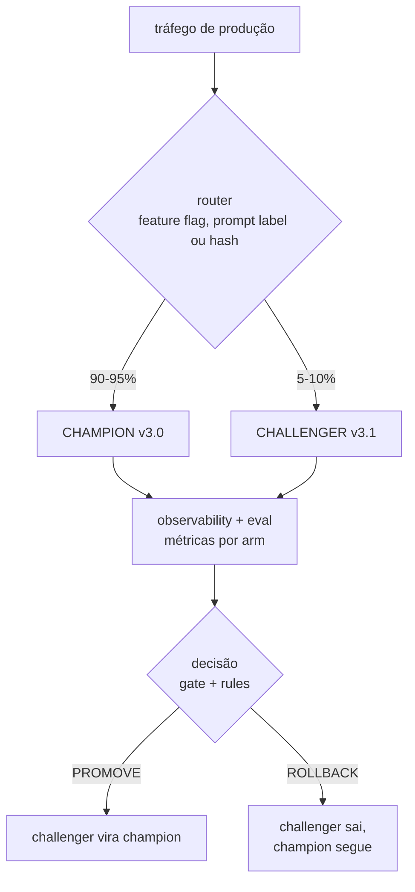

# 04 - Champion-challenger em produção

> [!abstract] TL;DR
> Champion-challenger é a operação de ship em produção: a versão atual (champion) serve a maior parte do tráfego (90-95%), a versão candidata (challenger) serve canary (5-10%), métricas-gate decidem promoção automática (challenger vira champion) ou rollback (challenger sai).
>
> **Setup:** feature flag (LaunchDarkly, GrowthBook, OpenFeature) ou routing logic em código.
>
> **Critérios de promoção** objetivos e pré-declarados: **(1)** eval score do challenger ≥ champion com significância; **(2)** zero regressão na golden subset crítica; **(3)** custo médio não sobe > X%; **(4)** latência p95 não sobe > Y%.
>
> **Rollback** automático em três sinais: error rate spike, latência spike, eval score drop.
>
> **Anti-padrão:** challenger eterno — nunca promove, nunca rola back, fica 50/50 pra sempre porque ninguém decide.

> [!question]- O que fazer quando o challenger está melhor em quality mas pior em custo ou latência — como decidir?
> Essa é a decisão de trade-off mais comum em champion-challenger e não tem resposta automática — exige judgment humano. O processo: (a) calcule o valor esperado do ganho de qualidade (redução de re-prompts, aumento de conversão, menos tickets de suporte) e compare com o custo adicional em termos de dinheiro/tempo; (b) se custo extra é < 10% e ganho de qualidade é > 5%, geralmente vale promover (regra de bolso, não lei); (c) se latência p95 sobe além do SLA declarado, não promove — independente de quality — porque SLA é compromisso com usuário. A boa prática é declarar antes de rodar a tolerância por dimensão: "custo +15% é OK, latência +20% é OK" — isso elimina a negociação post-hoc que é onde o viés de confirmação entra. Se não declarou antes, use os valores da última versão promovida como referência, e anote no postmortem que a próxima vez precisa de critérios explícitos.

Você acabou de fechar o diff do prompt. O eval score subiu, o golden set passou, o A/B testing confirmou que a versão nova é estatisticamente melhor. A pergunta que sobra é a mais perigosa: como shipar essa versão pra 100% dos usuários sem quebrar produção, se algo que o eval não capturou aparecer só sob tráfego real?

A resposta ingênua é "sobe direto, se quebrar eu vejo" — e é assim que latência estourada, custo dobrado ou um edge case raro em produção viram incidente de madrugada. A resposta um pouco melhor é repetir o A/B em produção: manda uma fatia do tráfego real pro prompt novo, olha as métricas, decide. Mas A/B simples **mede** — ele não decide sozinho quando parar, quando promover, quando voltar atrás. Alguém precisa olhar o dashboard e decidir manualmente, e enquanto ninguém decide, o experimento fica pendurado.

Champion-challenger resolve exatamente essa lacuna: pega o A/B que já foi validado offline, roda em produção como canary, e amarra a leitura das métricas a uma decisão automática de promoção ou rollback. A versão atual (champion) continua servindo a maior parte do tráfego enquanto a candidata (challenger) prova o valor num pedaço pequeno e controlado — e critérios pré-declarados, não um humano de plantão, decidem o próximo passo.

## A mecânica básica



A diferença crítica entre champion-challenger e A/B "cru": **o ciclo está atrelado a decisão automatizada de promoção/rollback**, com regras pré-declaradas. A/B mede; champion-challenger mede **e age**.

## Setup — feature flag vs routing em código

### Opção A — Feature flag dedicado

Ferramentas: **LaunchDarkly**, **GrowthBook**, **Statsig**, **OpenFeature** (padrão aberto), **Unleash**.

```python
from openfeature import api

client = api.get_client()

def serve_request(user_id: str, request: str) -> str:
    # 1. Feature flag decide a arm
    arm = client.get_string_value(
        flag_key="research-prompt-canary",
        default_value="production",
        evaluation_context={"targeting_key": user_id},
    )

    # 2. Pega prompt da label correspondente
    prompt = langfuse.get_prompt("research-system", label=arm)

    # 3. Chama LLM
    return run_llm(prompt, request)
```

Vantagens:

- Routing e percentage gerenciados na UI do feature flag (mudança de 5% pra 10% sem deploy)
- Segmentação de usuários (e.g., só rodar challenger pra tier free)
- Audit log nativo (quem mudou o flag, quando)
- Kill switch — flag = 0% em 1 segundo

Desvantagens:

- Mais um vendor / componente
- Latência adicional da chamada de feature flag (mitigada por SDK com cache local)

### Opção B — Routing em código com prompt label

Sem feature flag externo, usa só o registry de prompt:

```python
import random
import hashlib

def select_arm(request_id: str, canary_pct: float = 0.10) -> str:
    # hash determinístico pra consistência por request_id/user_id
    bucket = int(hashlib.md5(request_id.encode()).hexdigest(), 16) % 100
    return "canary" if bucket < canary_pct * 100 else "production"

# config externa pode mudar canary_pct sem deploy (env var, config service)
CANARY_PCT = float(os.environ.get("CANARY_PCT", "0.10"))

def serve_request(request_id: str, request: str) -> str:
    arm = select_arm(request_id, CANARY_PCT)
    prompt = langfuse.get_prompt("research-system", label=arm)
    return run_llm(prompt, request)
```

Vantagens:

- Sem vendor adicional
- Routing fica no código (versionado, auditável via Git)
- Funciona com qualquer registry de prompt

Desvantagens:

- Mudança de percentage exige config service (env var é OK pra start)
- Sem UI rica (segmentação, audit log natural)

Padrão recomendado: time pequeno começa com B (routing simples), migra pra A quando complexidade de segmentação cresce.

## Critérios de promoção — concretos e pré-declarados

A regra de ouro: **declarar critérios antes de rodar o canary**, não negociar depois.

Template de critério pra promoção:

```yaml
# experiment: research-system v3.0 → v3.1
canary_pct: 10
duration_min_hours: 72
sample_size_min: 2000  # por arm

promotion_criteria:
  # Métrica primária — challenger ≥ champion com significância
  eval_score:
    metric: "rubric_avg"
    direction: ">="
    significance: "p_b_better_a >= 0.95"  # bayesiano
    # OR frequentista: p_value < 0.05 e CI lower bound positivo

  # Golden subset crítico — zero regressão
  golden_critical:
    metric: "pass_rate"
    direction: ">="
    tolerance: 0.0  # zero regressão

  # Custo médio — pequena regressão tolerada
  cost_per_request:
    metric: "avg_cost_usd"
    direction: "<="
    tolerance: 0.15  # 15% de aumento OK

  # Latência p95 — pequena regressão tolerada
  latency_p95:
    metric: "p95_ms"
    direction: "<="
    tolerance: 0.20  # 20% de aumento OK

  # Safety — zero tolerância
  safety_violations:
    metric: "violations_per_1k"
    direction: "<="
    tolerance: 0.0

# Decisão automática se TODOS os critérios passam
auto_promote_if_all_pass: true
```

Princípios:

1. **Critérios são AND, não OR** — passar em 4 de 5 não promove
2. **Significância exigida** — diferença visual ≠ diferença real
3. **Direção declarada** — "menor ou igual" pra custo, "maior ou igual" pra qualidade
4. **Tolerância por dimensão** — safety zero, custo 15%, latência 20%; uniformidade é anti-padrão

## Rollback automático — triggers e mecanismo

Rollback acontece **antes** de promover (durante canary). Triggers comuns:

| Trigger | Threshold típico | Por quê |
|---|---|---|
| **Error rate spike** | error_rate > 2x baseline nos últimos 15 min | Bug, schema break, modelo retornando 500 |
| **Latência spike** | p95 > 2x baseline OR > SLA absoluto | Prompt longo demais, modelo retornando devagar |
| **Eval score drop** | rubric_avg < 0.7 x baseline (sliding window) | Qualidade caiu rapidamente em prod |
| **Safety violation spike** | qualquer violation acima da baseline | Risco regulatório/produto |
| **Refusal rate spike** | refusal > 2x baseline | Prompt novo virou paranoico |
| **Custo spike** | cost_per_request > 2x baseline | Output verboso demais, tool call inflado |

Mecanismo:

```python
# pseudo-código: monitor que polla métricas e age
def canary_watcher(experiment_id: str):
    while experiment_running(experiment_id):
        metrics = fetch_metrics_last_15min(experiment_id, arm="canary")
        baseline = fetch_baseline(experiment_id, arm="production")

        for rule in ROLLBACK_RULES:
            if rule.triggered(metrics, baseline):
                rollback(experiment_id, reason=rule.name)
                alert_team(experiment_id, rule.name, metrics)
                return

        sleep(60)
```

Rollback efetivo = mover label `canary` pra apontar pra `production` (ou setar canary_pct = 0). Cache do client expira em segundos, todas as instâncias param de servir o challenger.

## Quando manual gate é OK vs quando automação é exigida

| Situação | Gate manual | Gate automático |
|---|---|---|
| Produto inicial, poucos experimentos por mês | OK | Overkill |
| Equipe pequena, dono claro do prompt | OK | Opcional |
| Volume alto, vários experimentos simultâneos | Não escala | Necessário |
| Produto regulado (saúde, financeiro) | Manual é piso, automático complementa | Sim, com manual review por cima |
| Mudança em prompt safety-critical | Manual obrigatório | Automático insuficiente sozinho |
| Mudança em prompt rotineira (typo, tom) | Patch direto, sem gate | Patch direto, sem gate |

Padrão maduro: **gate automático que pode ser overridado por manual review**. Automação roda 90% dos casos sem intervenção, humano olha os 10% que exigem judgment.

## Champion eterno — o anti-padrão simétrico

Discussão clássica foca em "challenger eterno". Existe a versão simétrica: **champion eterno**.

Sinais:

- Champion na produção há > 6 meses sem nenhum challenger sequer **proposto**
- Eval score do champion não é recalibrado contra modelo atual do provider
- Drift detection não roda (ninguém saberia se champion degradou)
- Cultura: "tá funcionando, não mexe"

Risco do champion eterno = drift silencioso. Modelo do provider atualiza, distribuição de input muda, prompt que era ótimo vira só "ok". Sem challenger pra comparar, ninguém percebe.

Mitigação: cadência mínima de challenger — pelo menos um experimento por trimestre, mesmo que seja "challenger é o mesmo prompt mas em modelo novo". Mantém a infraestrutura do loop viva.

## Anti-padrões

- **Challenger eterno** — 50/50 pra sempre porque ninguém aperta o botão de promoção
- **Champion eterno** — nunca proposto challenger; drift silencioso
- **Critérios negociados após o canary** — "sim, latência subiu 30%, mas o ganho de qualidade compensa" (sem ter declarado antes)
- **Promoção sem guardrails secundários** — só olhou eval score, custo dobrou
- **Routing não-determinístico** — mesmo user vê canary numa request e production na seguinte; ruído + UX confusa
- **Sem audit do experimento** — promoveu, esqueceu o porquê; postmortem perdido
- **Rollback sem comunicação** — voltou pra champion, time descobriu pelo Slack uma semana depois
- **Canary % muito grande no major bump** — 50% canary em mudança de schema = blast radius enorme

## Maturidade de champion-challenger

```
Nível 0 — Ad-hoc
  "Subi o prompt novo direto em prod. Se quebrar, eu vejo."

Nível 1 — Canary manual
  Routing via env var. Sobe pra 5%, espera dois dias, olha métricas, decide à mão.

Nível 2 — Canary com gate manual
  Critérios pré-declarados. Dashboard mostra arm vs arm. Promoção/rollback ainda manual.

Nível 3 — Canary com gate automático
  Critérios pré-declarados executam automaticamente. Promoção automática se todos passam.
  Rollback automático em triggers (error spike, latency spike).

Nível 4 — Multi-armed bandits
  Em vez de A/B fixo, alocação dinâmica (mais tráfego pra arm vencedora ao longo do experimento).
  Convergência mais rápida com menor exposição ao perdedor.

Nível 5 — Loop totalmente fechado
  Auto-prompt (DSPy) gera challengers; gate automático promove/rola back;
  postmortem automático populated em registry.
```

Meta pragmática: **nível 3 estável** pra time de IA serio em 2026. Nível 4-5 é fronteira, vale pra produto crítico/volume alto.

## Armadilhas comuns

> [!warning] Challenger eterno — 50/50 em produção sem ninguém decidir
> O cenário: canary foi pro ar, dados chegaram, semana passou. "Vou olhar amanhã" vira "preciso de mais dados" vira "ah, perdemos o contexto". O challenger fica indefinidamente em produção servindo 10% do tráfego sem promoção nem rollback. Danos: tráfego em dois códigos diferentes aumenta chance de inconsistência; dados do canary viram ruído porque o tráfego mistura comportamentos; nenhum novo challenger pode entrar sem colapsar o setup. A correção é sistemática: defina data de decisão **antes** de subir o canary (dia D + duração mínima em horas), coloque lembrete no calendário, e atribua owner. Se o dia chegou e o resultado é inconclusivo — decida rollback como default conservador, não continue indefinidamente.

> [!warning] Critérios de promoção negociados depois do resultado — viés de confirmação garantido
> O experimento terminou. Challenger melhorou em quality, mas custo subiu 25%. "25% de custo tá bem, o ganho compensa." Se você tivesse declarado antes que 15% era o teto — esse challenger não passa. Mas como não declarou, você negocia post-hoc. O problema é que sua avaliação do trade-off é contaminada pelo resultado já conhecido. Você tende a aprovar challenges que têm resultado positivo em quality e rejeitar em cenários simétricos sem conseguir articular um princípio diferente. Declare critérios em YAML ou documento antes de subir o canary. Esse documento é revisado no postmortem — se você não seguiu, o postmortem registra a divergência e o próximo ciclo começa com critérios mais claros.

> [!warning] Rollback sem comunicação — time descobre pelo comportamento do produto
> O rollback foi automático, challenger saiu, champion voltou a servir 100%. Ninguém avisou ninguém. Uma semana depois alguém percebe no dashboard que "era o canary que estava causando aquele comportamento". Quando rollback acontece (especialmente automático), é evento de aprendizado: o que disparou, qual o sinal, o que o challenger fez de errado. Sem comunicação, esse aprendizado morre. Padrão mínimo: alerta no Slack/Teams no momento do rollback com motivo + link pro trace. Postmortem assíncrono (thread de 5 linhas) pra registrar a hipótese que falhou. Postmortem não é punição — é o mecanismo de aprendizado do loop.

## Como explicar em inglês

**Interview quote:** *"Champion-challenger is the production ship operation: the current version serves 90-95% of traffic as champion while a challenger runs as a 5-10% canary. Pre-declared criteria determine automatic promotion or rollback — eval score improvement with statistical significance, zero regression on the critical golden subset, cost within tolerance, latency within SLA. Rollback triggers fire automatically: error rate spike, latency spike, eval score drop. The key discipline is declaring criteria before running the canary — post-hoc negotiation is how confirmation bias sneaks into the process."*

| Português | Inglês |
|---|---|
| Campeão (versão atual em prod) | Champion |
| Desafiante (versão candidata) | Challenger |
| Canário (tráfego de teste) | Canary / canary release |
| Promoção automática | Automatic promotion |
| Rollback automático | Automatic rollback |
| Critérios de promoção pré-declarados | Pre-declared promotion criteria |
| Feature flag de roteamento | Routing feature flag |
| Taxa de erro (spike) | Error rate spike |
| Tolerância de custo | Cost tolerance |
| Challenger eterno (anti-padrão) | Eternal challenger (anti-pattern) |

## O que vem a seguir

Com champion-challenger cobrindo o ship em produção, a nota 05 sobe pra automação do loop inteiro: **DSPy e auto-prompt optimization**, onde os prompts são compilados automaticamente contra a eval function — fechando o loop sem intervenção manual no diff.

## Fontes

- **Martin Fowler** — [*CanaryRelease*](https://martinfowler.com/bliki/CanaryRelease.html). Definição canônica de canary, anterior a LLMs mas integralmente aplicável.
- **LaunchDarkly** — [*Progressive delivery patterns*](https://launchdarkly.com/blog/progressive-delivery-a-history-condensed/).
- **GrowthBook** — [*Feature flag experiments*](https://docs.growthbook.io/app/experiment-configuration).
- **OpenFeature** — [*Specification*](https://openfeature.dev/specification/). Padrão aberto pra feature flag.
- **Kohavi, Tang, Xu** — *Trustworthy Online Controlled Experiments* (2020). Pré-declaração de critério, peeking, sample size.
- **@hooeem** — *Become an AI Engineer*, Step 11 — discussão sobre cadência de improvement.

## Veja também

- [[02 - A-B testing de prompts]] — o experimento que precede a decisão de ship
- [[03 - Prompt versioning — semver para prompts]] — bump do prompt é o que dispara o canary
- [[07 - Eval gates em CI — quando bloquear merge]] — o gate **antes** do canary (offline em CI)
- [[03-Dominios/Tecnologia/IA/Observability/05 - Versionamento de prompts]] — o registry que torna o routing por label viável
- [[03-Dominios/Tecnologia/IA/Anatomia dos LLMs/19 - Evaluation de LLMs em produção]] — A/B em prod como pilar de eval contextual
- [[Observability]] — métricas e alertas que dispatching o rollback automático
