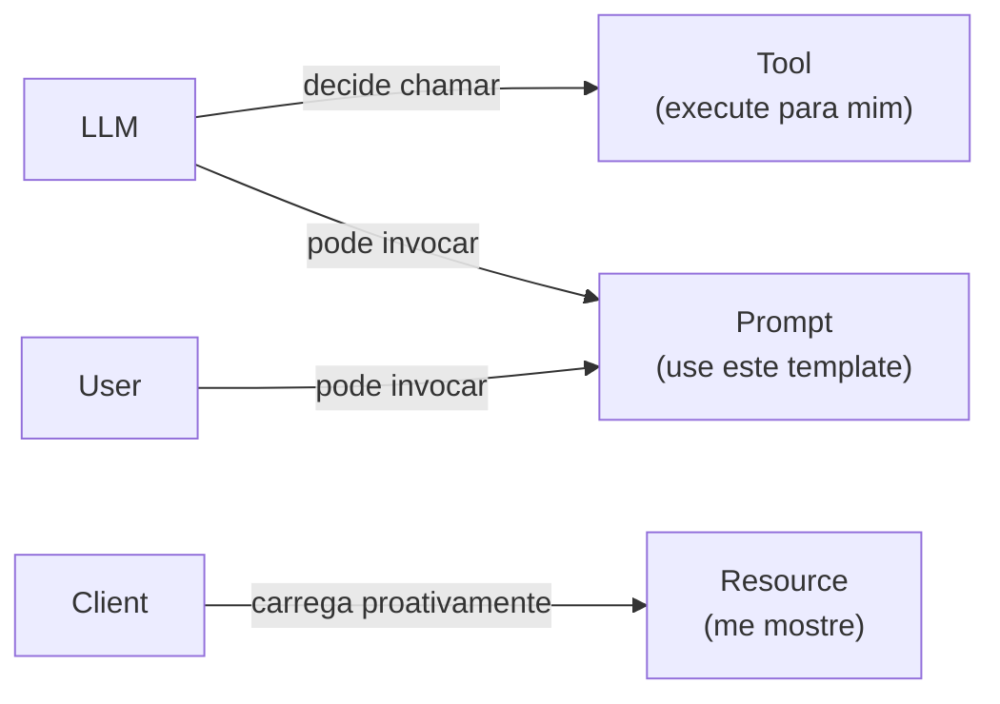

# Os três primitivos — Tools, Resources, Prompts

> [!abstract] TL;DR
> [[Dicionário de IA#MCP (Model Context Protocol)|MCP]] define **três tipos** de capability que servers expõem: **[[Dicionário de IA#tools (MCP)|Tools]]** (funções executáveis com side-effects, query_db, send_email), **[[Dicionário de IA#resources (MCP)|Resources]]** (dados leitáveis estáticos ou dinâmicos, files, schemas), e **[[Dicionário de IA#prompts (MCP)|Prompts]]** (templates parametrizáveis para tarefas comuns). Cada primitivo tem semântica diferente — confundir os três é o erro de design mais comum. **Tools modificam, Resources informam, Prompts parametrizam.**

> [!question]- Por que três primitivos e não um único conceito de "ferramenta"?
> Porque "ferramenta" é uma abstração vaga que mistura três comportamentos com custos e semânticas diferentes. Tools têm side-effects e precisam ser invocadas ativamente pelo LLM — cada chamada consome orçamento e tempo. Resources são read-only e podem ser carregados pelo client proativamente, antes de o LLM precisar — o schema do banco de dados não precisa ser uma tool call custosa se o client pode pré-carregar como Resource. Prompts não executam nada: são templates que alavancam expertise já escrita. Usar só tools para tudo é como usar HTTP POST para tudo — funciona, mas ignora a semântica de GET e HEAD que existe por razões válidas.

Imagine um server MCP que expõe **tudo** como Tool: o schema do banco vira `get_schema()`, o arquivo de configuração vira `read_config()`, até o template de code review vira `run_code_review()`. Funciona — mas a cada turno o LLM precisa "gastar" uma decisão e uma chamada só para enxergar dados que já estavam ali, paradinhos, esperando. O client poderia ter pré-carregado o schema no contexto antes mesmo da primeira pergunta do usuário; em vez disso, ele fica refém do LLM "lembrar" de chamar a tool certa. O resultado é previsível: mais latência, mais tokens de tool-call queimados, e um LLM que erra a escolha entre `get_schema`, `fetch_schema` e `schema_info` porque os três parecem a mesma coisa. Esse é o erro de design mais comum em MCP — e a raiz dele é não separar os três primitivos que o protocolo já oferece prontos.

## A tríade

```
TOOLS                RESOURCES              PROMPTS
─────                ─────────              ───────
Funções executáveis  Dados leitáveis        Templates
com side-effects     estáticos/dinâmicos    parametrizáveis

query_db(sql)        file://path/doc.md     "Explain this code"
send_email(to, ..)   schema://table/users   "Summarize {input}"
write_file(...)      git://commits/HEAD     "Refactor for {style}"
```



A regra simples:

- **Tool** = "execute para mim"
- **Resource** = "me mostre"
- **Prompt** = "use este template"

## Tools — funções executáveis

```python
@server.tool()
def query_database(sql: str) -> list[dict]:
    """Run SELECT query on production database."""
    return db.execute(sql)

@server.tool()
def send_slack_message(channel: str, message: str) -> bool:
    """Send message to Slack channel."""
    return slack.post(channel, message)
```

**Características:**
- Pode ter **side-effects** (mudar estado)
- [[Dicionário de IA#LLM (Large Language Model)|LLM]] **chama explicitamente**: "preciso enviar mensagem"
- Schema de input/output
- Tipicamente requer auth/permission

**Quando usar Tool:**
- Ação que muda o mundo (write, delete, send)
- Computação que requer compute (call API, run query)
- Descoberta dinâmica ("liste todos os arquivos modificados hoje")

## Resources — dados leitáveis

```python
@server.resource("file://{path}")
async def read_file(path: str) -> str:
    """Read file from filesystem."""
    return open(path).read()

@server.resource("schema://table/{table_name}")
async def db_schema(table_name: str) -> dict:
    """Get database schema for table."""
    return introspect(table_name)
```

**Características:**
- **Read-only** (sem side-effects)
- LLM **navega** ou client puxa proativamente
- URI-based (parecido com URL)
- Pode ser **subscribed** (notify on change)

**Quando usar Resource:**
- Dado estático ou semi-estático
- Browseable / discoverable
- Cliente quer carregar antecipadamente
- Read sem necessidade de "tool call"

**Diferença operacional:** o cliente pode **carregar Resources no contexto** sem pedir ao LLM. Tools precisam ser invocadas pelo LLM.

## Prompts — templates parametrizáveis

```python
@server.prompt()
def explain_code(language: str, code: str) -> list[Message]:
    """Explain code in plain English."""
    return [
        Message(role="system", content=f"You are an expert {language} developer."),
        Message(role="user", content=f"Explain this code:\n\n{code}")
    ]

@server.prompt()
def code_review(diff: str, focus: str = "security") -> list[Message]:
    """Generate code review with focus on specific concern."""
    return [...]
```

**Características:**
- **Templates pré-fabricados** que retornam mensagens
- Reutilizam expertise (alguém escreveu o prompt bem)
- LLM ou usuário invoca: "use the code-review prompt"
- Parametrizáveis com inputs

**Quando usar Prompt:**
- Tarefa recorrente que tem prompt-padrão bom
- Onboarding de usuários menos técnicos
- Compartilhar best practices via MCP server

## Tabela comparativa

| | Tools | Resources | Prompts |
|---|---|---|---|
| **Modifica estado?** | Sim | Não | Não |
| **Quem invoca?** | LLM decide | Client puxa ou LLM | LLM ou user |
| **Auth?** | Tipicamente requer | Pode requerer | Geralmente não |
| **Schema?** | Input + output | URI pattern | Argumentos |
| **Quando carregar?** | Sob demanda (decisão LLM) | Pode ser proativo | Sob demanda |
| **Custo típico** | Variável (chamadas externas) | Baixo (read) | Mínimo |

## Anti-pattern clássico — confundir os três

### Tool quando deveria ser Resource

```python
# Anti-pattern
@server.tool()
def get_user_schema():
    """Get schema of users table."""
    return schema_users

# Melhor
@server.resource("schema://users")
def users_schema():
    return schema_users
```

Por quê: schema é **read-only, navegável**. LLM não deveria precisar "decidir chamar" — client carrega proativamente.

### Resource quando deveria ser Tool

```python
# Anti-pattern
@server.resource("query://users-active")
def active_users_resource():
    """All currently active users."""  # Mas... se "agora" é dinâmico?
    return db.query("SELECT * WHERE active = true")
```

Por quê: query custosa que muda o tempo todo. Melhor como Tool com parâmetros.

### Tool quando deveria ser Prompt

```python
# Anti-pattern
@server.tool()
def explain_code(code: str) -> str:
    """Explain code."""
    response = llm.complete(f"Explain: {code}")
    return response

# Melhor — Prompt
@server.prompt()
def explain_code_prompt(code: str) -> list[Message]:
    """Returns prompt for code explanation."""
    return [Message(role="user", content=f"Explain: {code}")]
```

Por quê: tool ABRE outra LLM call. Prompt é **template** que o **client/LLM atual** usa. Mais barato, mais flexível.

## Discovery flow

Quando client conecta a server:

```
1. Client → Server: "list_tools()"
   Server → Client: [tool schemas]

2. Client → Server: "list_resources()"
   Server → Client: [resource URIs]

3. Client → Server: "list_prompts()"
   Server → Client: [prompt templates]

4. LLM decide o que usar baseado em:
   - User question
   - Tool descriptions
   - Resource URIs visíveis
```

Cliente bom **não floda LLM com todos** — filtra por relevância antes de incluir no contexto.

## Combinando os três — exemplo real

GitHub MCP server expõe:

**Tools:**
- `create_issue(title, body)`
- `merge_pr(pr_number)`
- `add_comment(pr, text)`

**Resources:**
- `repo://owner/repo/files/{path}` — ler arquivo
- `repo://owner/repo/issues/{number}` — ler issue
- `repo://owner/repo/prs/{number}` — ler PR

**Prompts:**
- `review-pr` — template de code review com checklist
- `triage-issue` — template para classificar issue

LLM combina: "leia o PR (resource) → use prompt review-pr → comenta (tool)".

## Métricas

| Métrica | Alvo |
|---|---|
| **Tools por server** | <20 (mais que isso vira confuso) |
| **Resources por server** | Variável, mas agrupados logicamente |
| **Prompts por server** | <10 (templates bem trabalhados) |
| **Discovery latency** | <100ms |

## Anti-patterns

- **Tudo é tool** — ignora resources e prompts
- **Tools com nomes ambíguos** — `query`, `find`, `get`
- **Resources sem URI scheme claro** — descoberta confusa
- **Prompts sem documentação** — usuário não sabe quando usar
- **Tool fazendo read** — deveria ser resource
- **Resource fazendo computação cara** — deveria ser tool

## Armadilhas comuns

> [!warning] Implementar tudo como Tool
> O anti-pattern mais frequente em MCP: usar Tool para tudo, ignorando Resources e Prompts. Resultado: o LLM precisa "decidir chamar" uma tool para buscar dados que o client poderia carregar proativamente, desperdiçando tool-call budget e adicionando latência. Schemas de banco de dados, configurações de ambiente e documentação de referência são candidatos naturais a Resources — read-only, estáticos, navegáveis pelo client sem envolver o LLM.

> [!warning] Nomes ambíguos em Tools
> Tools com nomes como `query`, `find`, `get`, `process` são problemas esperando acontecer. O LLM escolhe a tool baseado na descrição e no nome. Nomes ambíguos levam a chamadas erradas, comportamento imprevisível e dificuldade de debug. Use nomes que codificam o domínio e a ação: `search_jira_issues`, `query_postgres_readonly`, `send_slack_message`. A regra: ao ver o nome sem a descrição, deve ser óbvio o que a tool faz.

> [!warning] Prompt como Tool (chamada de LLM dentro de Tool)
> Implementar uma tool que internamente chama outro LLM para gerar uma resposta e retorna a resposta é um anti-pattern clássico. Você está dobrando o custo de inferência sem ganho real — o LLM cliente poderia usar um Prompt MCP (template) com o mesmo resultado, sem a chamada extra. Tools executam código e retornam dados; não são wrappers de LLMs. Se o objetivo é parametrizar um comportamento textual, use Prompt.

## Como explicar em inglês

MCP organizes server capabilities into three primitives with distinct semantics: Tools, Resources, and Prompts. Understanding which to use isn't just good design — it directly affects performance, security posture, and how well the LLM can reason about what's available.

Tools are executable functions with potential side-effects. The LLM actively decides to call them when it needs something done — run a query, send a message, create a record. Resources are read-only data exposed via URI patterns, similar to files or URLs. Clients can load them proactively into context without the LLM needing to "decide" to call anything. Prompts are parametrized message templates — they encode expert-written prompt patterns that users or LLMs can invoke by name.

**In a technical interview**, you might say:

> "The three-primitive model maps directly to what you want to happen at runtime. Tools are active — the LLM spends a token budget deciding to call them and waits for results. Resources are passive — the client can preload a database schema or configuration file before the conversation even starts. Prompts are templates — they're reusable, shareable patterns that avoid reinventing the same prompt in every conversation. Mixing them up is expensive: a schema exposed as a Tool gets called on demand instead of being preloaded; a prompt implemented as a Tool triggers a second LLM call unnecessarily."

| PT | EN |
|----|-----|
| Ferramenta | Tool |
| Recurso | Resource |
| Modelo de mensagem | Prompt template |
| Efeito colateral | Side-effect |
| Pré-carregamento | Preloading |
| Descoberta | Discovery |
| Semântica | Semantics |
| Invocação | Invocation |
| Esquema de entrada | Input schema |
| Operação destrutiva | Destructive operation |

## O que vem a seguir

Os três primitivos definem **o que** um server expõe. A próxima questão é **como** client e server se conectam: qual protocolo de transporte, como funciona o lifecycle de uma sessão, e como o client descobre as capabilities do server na prática. Sem entender a arquitetura, é difícil raciocinar sobre performance, multi-user, e por que stdio e HTTP+SSE têm trade-offs tão diferentes.

A nota seguinte mapeia o modelo cliente-servidor completo, incluindo os três transports e o diagrama de sequência de uma sessão real.

- [[03 - Arquitetura cliente-servidor]] — como client e server se conectam na prática

## Veja também

- [[01 - O que é MCP e por que importa]]
- [[03 - Arquitetura cliente-servidor]]
- [[05 - Construindo um MCP server local]]
- [[Anatomia de Agents|03 - Tool design — princípios e categorias]]

## Referências

- **MCP Spec** — *Tools, Resources, Prompts sections* — [modelcontextprotocol.io/docs/concepts/tools](https://modelcontextprotocol.io/docs/concepts/tools)
- **Anthropic** — *Building MCP servers tutorial* (2025) — [docs.anthropic.com](https://docs.anthropic.com)
- **Awesome MCP Servers** — examples canônicos — [github.com/punkpeye/awesome-mcp-servers](https://github.com/punkpeye/awesome-mcp-servers)


