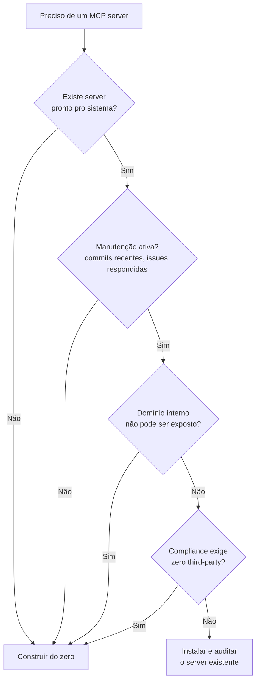

# MCP servers oficiais e populares

Você precisa que seu agente leia issues do GitHub, consulte uma tabela no Postgres e responda no canal certo do Slack. A tentação é escrever três servers MCP do zero — mas antes de abrir o editor, vale checar se alguém já resolveu exatamente isso. Na prática, quase sempre alguém já resolveu: o ecossistema MCP em 2026 tem milhares de servers catalogados, com opções oficiais e de comunidade para os sistemas mais comuns. Este capítulo mapeia onde procurar, o que existe por categoria, e como decidir entre instalar um server pronto ou construir o seu.

> [!abstract] TL;DR
> Em 2026, o ecossistema [[Dicionário de IA#MCP (Model Context Protocol)|MCP]] tem **milhares de servers** disponíveis. Antes de criar próprio, **busque no Awesome MCP Servers** — chance alta de já existir. Categorias principais: filesystem/git, databases, dev tools (GitHub, Linear, Jira), comunicação (Slack, email), browsers (Playwright), busca (web, docs), observabilidade (Sentry, Datadog), AI (Anthropic, OpenAI, Hugging Face). Reuso vence build em 90% dos casos.

> [!question]- Como escolher entre implementar um MCP server próprio ou usar um pronto?
> A heurística é simples: busque primeiro, construa como último recurso. Servidores existentes com manutenção ativa cobrem ≥80% dos casos comuns — GitHub, Postgres, Slack, filesystem, Playwright. Construir do zero faz sentido em três casos: (1) o domínio é interno e não pode ser exposto (API de RH, dados financeiros proprietários), (2) os servers disponíveis têm qualidade ruim ou estão abandonados, (3) compliance exige zero dependência third-party. Em qualquer outro caso, instalar e auditar um server com 500+ stars e commits recentes é meses de trabalho economizados.

## Onde achar

| Recurso | Conteúdo |
|---|---|
| **[awesome-mcp-servers](https://github.com/punkpeye/awesome-mcp-servers)** | Catálogo curated mais conhecido |
| **[modelcontextprotocol/servers](https://github.com/modelcontextprotocol/servers)** | Servers oficiais Anthropic |
| **[mcp.so](https://mcp.so)** | Marketplace web (search + reviews) |
| **[smithery.ai](https://smithery.ai)** | Discovery + install via CLI |
| **glama.ai/mcp/servers** | Browse + monitoring |

## Categorias principais (2026)

> [!warning] Esta lista caduca rápido
> Packages, URLs e status de manutenção de servers MCP mudam com frequência — um server "oficial" hoje pode ser descontinuado amanhã, e novos entrantes surgem toda semana. Trate os nomes abaixo como um mapa de categorias, não como um catálogo definitivo: antes de instalar qualquer um, confira o repositório atual em [awesome-mcp-servers](https://github.com/punkpeye/awesome-mcp-servers) ou [mcp.so](https://mcp.so) para status de manutenção real.

### Filesystem e Git

| Server | Funcionalidades |
|---|---|
| **server-filesystem** (oficial) | read_file, write_file, list_dir, search |
| **server-git** (oficial) | log, diff, blame, status |
| **server-github** (oficial) | issues, PRs, releases, files via API |
| **server-gitlab** | similar para GitLab |

### Databases

| Server | DB |
|---|---|
| **server-postgres** (oficial) | PostgreSQL — read-only por padrão |
| **server-sqlite** (oficial) | SQLite local |
| **mcp-mongodb** | MongoDB |
| **mcp-redis** | Redis |
| **mcp-snowflake** | Snowflake |

> [!warning] DB MCP é vetor de ataque
> Sempre **read-only por default**. Tool de write requer extra permission. Ver [[07 - Segurança em MCP]].

### Dev tools

| Server | Forte em |
|---|---|
| **server-github** | Issues, PRs, code search |
| **mcp-jira** | Issues, sprints, workflows |
| **mcp-linear** | Issues, projects |
| **server-sentry** | Errors, traces, releases |
| **mcp-datadog** | Metrics, logs, alerts |
| **mcp-grafana** | Dashboards, alerts |
| **mcp-pagerduty** | Incidents, oncall |

### Comunicação

| Server | Tipo |
|---|---|
| **mcp-slack** | Mensagens, channels, files |
| **mcp-discord** | Discord servers |
| **mcp-email** | IMAP/SMTP |
| **mcp-google-workspace** | Gmail, Calendar, Drive |
| **mcp-notion** | Pages, databases |
| **mcp-confluence** | Pages, search |

### Browser e web

| Server | Capacidade |
|---|---|
| **mcp-playwright** | Browser automation full |
| **mcp-puppeteer** | Headless Chrome |
| **mcp-fetch** | HTTP fetch básico |
| **mcp-brave-search** | Web search via Brave API |

### Observabilidade e cloud

| Server | Cobertura |
|---|---|
| **mcp-aws** | AWS services via SDK |
| **mcp-gcp** | Google Cloud |
| **mcp-kubernetes** | K8s clusters |
| **mcp-terraform** | Infra-as-code |
| **mcp-cloudflare** | Cloudflare APIs |

### AI e ML

| Server | Funcionalidades |
|---|---|
| **mcp-huggingface** | Models, datasets browse |
| **mcp-langfuse** | LLM traces, evals |
| **mcp-perplexity** | Web search com IA |

### Productivity

| Server | Uso |
|---|---|
| **mcp-obsidian** | Vault Obsidian (este Codex usa!) |
| **mcp-todoist** | Tasks |
| **mcp-calendar** | Calendar via CalDAV |

### Especializados

- **mcp-figma** — design files
- **mcp-stripe** — payments
- **mcp-shopify** — e-commerce
- **mcp-twilio** — SMS, calls
- **mcp-anthropic** — Anthropic API direto

## Servers que vale instalar (defaults sensatos)

Para **dev fullstack** usando [[Dicionário de IA#Claude Code|Claude Code]]/Cursor:

```json
{
  "mcpServers": {
    "filesystem": { "command": "npx", "args": ["-y", "@modelcontextprotocol/server-filesystem", "/home/user/projects"] },
    "git": { "command": "npx", "args": ["-y", "@modelcontextprotocol/server-git"] },
    "github": { "command": "npx", "args": ["-y", "@modelcontextprotocol/server-github"], "env": { "GITHUB_PERSONAL_ACCESS_TOKEN": "${TOKEN}" } },
    "postgres": { "command": "npx", "args": ["-y", "@modelcontextprotocol/server-postgres", "postgresql://localhost/dev"] },
    "fetch": { "command": "npx", "args": ["-y", "@modelcontextprotocol/server-fetch"] }
  }
}
```

Stack mínima cobre 80% das necessidades.

## Como avaliar um MCP server

Antes de instalar:

| Critério | Sinal positivo |
|---|---|
| **Manutenção** | Commits recentes, issues respondidas |
| **Estrelas/forks** | >100 stars indica adoção |
| **Documentação** | README com setup, examples |
| **Schema rigoroso** | Tools com input_schema completo |
| **Auth handling** | Não pede credentials no código |
| **License** | MIT, Apache 2 (compatible) |
| **Test suite** | Tem testes |
| **Provider** | Oficial > comunidade > anonymous |

## Riscos de servers third-party

> [!danger] MCP é vetor de ataque
> Server third-party tem **acesso ao agent**. Risco real:
>
> - Server malicioso lê seus arquivos
> - Server faz [[Dicionário de IA#prompt injection|prompt injection]]
> - Server exfiltra credentials
> - Server reporta atividade
>
> **Audite** antes de instalar — leia código, valide reputação. Server oficial Anthropic > comunidade conhecida > random repo.

Detalhes em [[07 - Segurança em MCP]].

## Quando instalar vs construir



### Instalar quando

✅ Server existe com manutenção ativa ✅ Cobertura ≥80% das suas tools ✅ Provider confiável

### Construir quando

❌ Servers existentes não cobrem domain interno ❌ Lógica acopla a APIs internas que não pode expor ❌ Server existente tem qualidade ruim ❌ Compliance exige zero third-party

Detalhes em [[05 - Construindo um MCP server local]].

## Casos do Codex Technomanticus

Stack pessoal possível:

- **mcp-obsidian** — acessar este vault de qualquer client
- **mcp-github** — gerenciar repos público + apocrypha
- **mcp-fetch** — buscar artigos para fichamento (skill /glosa)
- **mcp-langfuse** — observability dos próprios agents

## Desinstalando

```bash
# Remover do config
# Editar ~/.config/claude/claude_desktop_config.json
# Remover entry "mcpServers" : {...}
# Reiniciar client
```

Servers MCP **não persistem dados fora do disco** (geralmente). Mas verifique TOS/code antes.

## Métricas

| Métrica | Alvo |
|---|---|
| **Servers ativos por client** | 5-15 |
| **Tools por server** | <20 |
| **Latência tool call (local stdio)** | <100ms |
| **Latência tool call (remoto)** | <1s |

## Anti-patterns

- **Instalar tudo do Awesome** — dezenas de servers = LLM confuso
- **Sem audit de servers third-party** — surface de ataque grande
- **Server abandonado em produção** — bug não corrige
- **Reinventar Postgres MCP** — oficial cobre 95% dos casos
- **Client com 50 tools de 10 servers** — context rot na descoberta

## Armadilhas comuns

> [!warning] Instalar tudo do Awesome MCP Servers
> A lista tem mais de 3000 entradas. Instalar dezenas de servers no mesmo client significa que o LLM recebe centenas de definições de tools no contexto inicial — um problema de "context rot" que degrada a qualidade das decisões. A pergunta certa não é "quais servers existem?" mas "quais tools eu realmente preciso neste workflow?". Um conjunto curado de 5-10 servers bem escolhidos supera 30 servers instalados por impulso.

> [!warning] Instalar `npx -y` sem ler o código
> `npx -y` faz download e executa o pacote sem confirmação. Para servers de terceiros, isso é equivalente a `curl URL | bash` — você está executando código arbitrário no seu ambiente com as permissões do seu usuário. Antes de instalar qualquer server que não seja oficial da Anthropic, verifique o repositório, leia o código dos handlers, e confirme quais env vars são lidas. Ataques de typosquatting em packages NPM/PyPI são documentados e MCP é vetor atrativo.

> [!warning] Usar server abandonado em produção
> Server com último commit há 8 meses e issues abertas sem resposta é servidor que não recebe updates de segurança e pode quebrar com mudanças de API do sistema integrado. Em produção, prefira servidores com histórico de manutenção ativa. Se depender de um server abandonado for inevitável, faça fork e assuma a manutenção — ou construa um próprio.

## Como explicar em inglês

The MCP ecosystem in 2026 has over 3,000 available servers across categories like databases, developer tools, communication platforms, browser automation, cloud infrastructure, and productivity apps. Before writing a server from scratch, the first step is always to search Awesome MCP Servers, mcp.so, or smithery.ai — the probability that a maintained, well-reviewed server already exists for common systems (GitHub, Postgres, Slack, Jira) is very high.

Evaluating a server for production use follows the same due diligence as any open source dependency: check recency of commits, number of stars and active issues, whether the README has clear setup examples, whether tool schemas are complete and typed, and whether the license is permissive. The source hierarchy matters for trust: official Anthropic servers sit at the top, followed by well-known community projects, with anonymous repositories at the bottom.

**In a technical interview**, you might say:

> "My default is: search before build. Awesome MCP Servers has thousands of entries, and for common systems — Postgres, GitHub, Slack, Playwright — there are official or high-quality community servers with active maintenance. I evaluate them like any dependency: recency, stars, code quality, license, typed schemas. When I do build a server, it's because the domain is internal and can't be exposed, or because compliance rules out third-party code. Installing 30 servers is never the answer — I keep it curated to what the workflow actually needs."

| PT | EN |
|----|-----|
| Servidor oficial | Official server |
| Servidor da comunidade | Community server |
| Auditoria de código | Code audit |
| Fixação de versão | Version pinning |
| Cadeia de fornecimento | Supply chain |
| Ataque de typosquatting | Typosquatting attack |
| Dependência terceira | Third-party dependency |
| Catálogo | Catalog / Registry |
| Manutenção ativa | Active maintenance |
| Ecossistema | Ecosystem |

## O que vem a seguir

Quando nenhum server existente cobre o seu domínio — ou quando a qualidade dos disponíveis não satisfaz — o próximo passo é construir o próprio. Isso é mais simples do que parece: o SDK Python do MCP reduz o trabalho básico a decorators e type hints. O desafio real está no design das tools, nos schemas, e nos erros informativos.

A próxima nota cobre o ciclo completo de desenvolvimento de um MCP server local, do hello world ao packaging para distribuição.

- [[05 - Construindo um MCP server local]] — tutorial completo de criação de server próprio

## Veja também

- [[01 - O que é MCP e por que importa]]
- [[05 - Construindo um MCP server local]]
- [[07 - Segurança em MCP]]
- [[08 - Ecossistema 2026 — clients e integrações]]

## Referências

- **Awesome MCP Servers** — [github.com/punkpeye/awesome-mcp-servers](https://github.com/punkpeye/awesome-mcp-servers)
- **MCP oficial** — [github.com/modelcontextprotocol/servers](https://github.com/modelcontextprotocol/servers)
- **mcp.so** — [mcp.so](https://mcp.so) — marketplace
- **smithery.ai** — [smithery.ai](https://smithery.ai) — discovery + install
- **Anthropic** — *MCP server directory* (2026)


