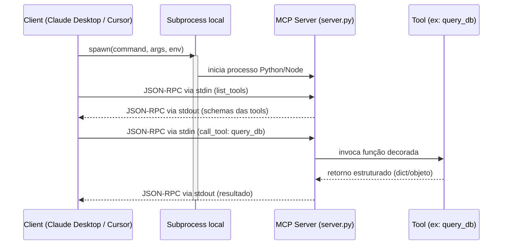

# Construindo um MCP server local

> [!abstract] TL;DR
> Construir [[Dicionário de IA#MCP server|MCP server]] é simples: [[Dicionário de IA#SDK|SDK]] Python ou TypeScript + decorators + ~50 linhas de código. Use stdio (subprocess local) para começar — o client sobe o server como processo filho e troca mensagens JSON-RPC pela entrada/saída padrão, sem rede, sem porta, sem deploy. Defina tools com schema Pydantic/Zod, retorne tipos estruturados, escreva descrições claras (60% do trabalho — ver [[Anatomia de Agents|03 - Tool design — princípios e categorias]]): é a descrição que o LLM lê para decidir quando chamar a tool, com quais parâmetros, e quando não chamar. Teste com **MCP Inspector** antes de plugar em client real — ele mostra o JSON-RPC bruto e permite invocar tools manualmente, o que corta o ciclo de debug de minutos para segundos. Para algo public, considere semver, docs, examples. Para algo interno, basta o essencial.

> [!question]- Por que MCP server local e não só um wrapper de API com requests diretos?
> Um wrapper de API resolve um problema de um sistema específico; um MCP server local resolve o problema de qualquer client. Com requests diretos, cada tool call precisa ser reimplementada em cada app que usa o LLM. Com MCP, você implementa uma vez e Claude Desktop, Cursor e qualquer client futuro consomem automaticamente via discovery. Além disso, o servidor local roda com stdio — zero rede, auth implícita pelo SO, latência de 1-5ms, sem nada para fazer deploy. É menos trabalho que um wrapper de API, não mais.

Imagine que você tem um banco de dados interno ou uma API corporativa que três ferramentas diferentes precisam consultar: Claude Desktop, Cursor e um script de automação. Sem MCP, você reimplementa a integração três vezes — uma por client, cada uma com sua própria forma de autenticar, formatar erros e limitar o volume de dados retornado. Com um MCP server local, você escreve a integração uma única vez: um processo Python ou Node que expõe `query_db`, `list_tables` e `get_schema` como tools, valida cada chamada e retorna output compacto. Qualquer client que fale o protocolo MCP passa a enxergar essas capacidades automaticamente, via stdio, sem tocar em rede nem gerenciar deploy. É esse ganho — escrever a integração uma vez e reusar em qualquer client — que justifica as poucas linhas de setup abaixo.

## Setup mínimo (Python)

```bash
# Install SDK
pip install mcp
# ou
uv add mcp
```

## Hello world

```python
# server.py
from mcp.server.fastmcp import FastMCP

mcp = FastMCP("my-server")

@mcp.tool()
def add(a: int, b: int) -> int:
    """Add two numbers."""
    return a + b

@mcp.tool()
def greet(name: str) -> str:
    """Greet a person by name."""
    return f"Hello, {name}!"

if __name__ == "__main__":
    mcp.run()  # default: stdio
```

Pronto. Tem MCP server funcional.

## Configurar no client

```json
{
  "mcpServers": {
    "my-server": {
      "command": "python",
      "args": ["/path/to/server.py"]
    }
  }
}
```

Restart client → tools `add` e `greet` aparecem disponíveis.



Todo o tráfego passa por stdin/stdout do subprocess — sem rede, sem porta, sem TLS. É por isso que a latência fica na casa de 1-5ms e não há nada para fazer deploy: o "servidor" é só um processo filho que o client já sabe iniciar e encerrar.

## Adicionando resources

```python
@mcp.resource("file://{path}")
def read_file(path: str) -> str:
    """Read file from filesystem."""
    with open(path) as f:
        return f.read()

@mcp.resource("config://settings")
def get_settings() -> dict:
    """Application settings."""
    return {"theme": "dark", "lang": "pt-br"}
```

URI patterns: `{path}` é capturado como argumento.

## Adicionando prompts

```python
from mcp.types import Message

@mcp.prompt()
def explain_code(language: str, code: str) -> list[Message]:
    """Explain code in plain English."""
    return [
        Message(role="system", content=f"You are an expert {language} dev."),
        Message(role="user", content=f"Explain this code:\n\n{code}")
    ]
```

## Schemas tipados

Pydantic é amigo:

```python
from pydantic import BaseModel, Field
from typing import Literal

class QueryParams(BaseModel):
    sql: str = Field(..., description="SQL query (SELECT only)")
    limit: int = Field(default=100, ge=1, le=1000)
    format: Literal["json", "csv"] = "json"

@mcp.tool()
def query_db(params: QueryParams) -> dict:
    """Run read-only SQL query against the database."""
    if not params.sql.strip().upper().startswith("SELECT"):
        raise ValueError("Only SELECT queries allowed")
    rows = db.execute(params.sql, limit=params.limit)
    return {"rows": rows, "format": params.format}
```

Schema é auto-gerado pelo SDK a partir dos type hints + Pydantic.

## TypeScript (alternativa)

```bash
npm install @modelcontextprotocol/sdk
```

```typescript
import { McpServer } from "@modelcontextprotocol/sdk/server/mcp.js";
import { StdioServerTransport } from "@modelcontextprotocol/sdk/server/stdio.js";
import { z } from "zod";

const server = new McpServer({
  name: "my-server",
  version: "1.0.0"
});

server.tool(
  "add",
  { a: z.number(), b: z.number() },
  async ({ a, b }) => ({
    content: [{ type: "text", text: String(a + b) }]
  })
);

const transport = new StdioServerTransport();
await server.connect(transport);
```

API similar, mais verbose. Use Python se tem opção.

## Tool design — o que importa

Tool design é **60% do trabalho** (ver [[Anatomia de Agents|03 - Tool design — princípios e categorias]]).

### Bom

```python
@mcp.tool()
def search_jira_issues(
    query: str = Field(description="JQL or free text query"),
    project: str = Field(description="Project key (e.g. PROJ)"),
    status: Literal["open", "in_progress", "done"] = None,
    limit: int = 20
) -> list[Issue]:
    """
    Search Jira issues matching criteria.

    Use when user asks about specific tickets, bugs, or tasks.
    Returns issues with id, title, status, assignee, priority.

    Do NOT use for creating issues (use create_issue instead).
    """
    return jira.search(query, project, status, limit)
```

### Ruim

```python
@mcp.tool()
def search(query: str) -> list:
    """Search."""
    return jira.search(query)
```

Diferença: o segundo deixa o LLM adivinhando.

## Erros informativos

```python
@mcp.tool()
def query_db(sql: str) -> dict:
    """Run SQL query."""
    if "DROP" in sql.upper():
        raise ValueError(
            "DROP statements forbidden. Use migration_tool for schema changes."
        )
    try:
        return db.execute(sql)
    except DatabaseError as e:
        raise ValueError(
            f"Query failed: {e}. Check table name with list_tables() first."
        )
```

Erros viram **feedback** que o agent usa para auto-correção.

## Output compacto

```python
# Errado
@mcp.tool()
def get_logs(service: str) -> str:
    return open(f"/var/log/{service}.log").read()  # 100MB

# Certo
@mcp.tool()
def get_logs(
    service: str,
    lines: int = 100,
    level: Literal["error", "warn", "info"] = None
) -> dict:
    """Get recent logs from service."""
    logs = read_log(service, tail=lines, filter_level=level)
    return {"lines": logs, "total_count": len(logs), "service": service}
```

Compactação evita context rot.

## Testando com MCP Inspector

```bash
# Roda inspector + conecta ao seu server
npx @modelcontextprotocol/inspector python server.py
```

UI web em http://localhost:5173:

- Lista tools/resources/prompts
- Permite invocar manualmente
- Mostra request/response raw
- Valida schemas

**Sempre teste no Inspector antes de plugar em client.**

## Logging e debugging

```python
import logging
logging.basicConfig(level=logging.INFO, format="[%(asctime)s] %(message)s")
logger = logging.getLogger("my-mcp-server")

@mcp.tool()
def query_db(sql: str) -> dict:
    logger.info(f"Tool called: query_db, sql={sql[:100]}")
    result = db.execute(sql)
    logger.info(f"Returned {len(result)} rows")
    return result
```

Logs vão para stderr (não interferem em stdio do JSON-RPC). Em produção, redirecionar para arquivo ou Loki.

## Dependências externas

```python
# Use env vars para credentials
import os
DB_URL = os.environ["DATABASE_URL"]

# OU passar via args do client
import sys
DB_URL = sys.argv[1] if len(sys.argv) > 1 else os.environ.get("DATABASE_URL")
```

No client config:

```json
{
  "mcpServers": {
    "my-db": {
      "command": "python",
      "args": ["server.py"],
      "env": {
        "DATABASE_URL": "${DB_URL}"
      }
    }
  }
}
```

## Empacotamento

### Para uso pessoal/projeto

Server local, roda direto. Sem packaging.

### Para distribuir

```bash
# Python — uvx
# pyproject.toml com entry_points
[project.scripts]
my-mcp-server = "my_package.server:main"

# Usuários:
uvx my-mcp-server
```

```bash
# TypeScript — npx
# package.json com bin
{
  "bin": {
    "my-mcp-server": "./dist/server.js"
  }
}

# Usuários:
npx my-mcp-server
```

Convenção em 2026: distribuir via `uvx` (Python) ou `npx` (TS) — sem install global.

## Versionamento

```python
mcp = FastMCP("my-server", version="1.2.0")
```

Semver:
- **Major** — breaking change em tool signatures
- **Minor** — adiciona tool/resource/prompt
- **Patch** — fix interno

Documente changes em CHANGELOG.

## Anti-patterns

- **Tools sem descrição** — agent escolhe errado
- **Output bruto** — context rot
- **Sem tipo no input** — Pydantic estrutura, schema auto
- **Credentials em código** — env vars sempre
- **Sem testes via Inspector** — bugs descobertos só em prod
- **Server gigante (50+ tools)** — divida em servers especializados
- **Side effects sem confirmação** — ações destrutivas precisam ser explícitas

## Armadilhas comuns

> [!warning] Descriptions genéricas em tools
> A descrição da tool é o que o LLM usa para decidir quando chamá-la. "Search." ou "Query data." são inúteis — o modelo não sabe o que esperar, em qual contexto usar, quais parâmetros passar, e quando *não* usar. Uma boa descrição responde a quatro perguntas: o que a tool faz, quando usá-la, o que ela retorna, e quando *não* usá-la. Esse investimento de 5 minutos por tool é o que separa um server que funciona de um que frustra o usuário com escolhas erradas.

> [!warning] Retornar output bruto (HTML, JSON gigante, log completo)
> Tool que retorna 100MB de log ou uma página HTML inteira causa context rot — o LLM gasta tokens lendo ruído em vez de informação. Sempre filtre, pagine e estruture o output: `tail=100` para logs, `limit=50` para queries, snippets para HTML. O modelo consegue pedir mais dados se precisar — não consiga "devolver menos" se já inundou o contexto.

> [!warning] Side-effects sem validação de entrada
> Tool que aceita `sql: str` e passa direto para o banco de dados sem validar é um acidente esperando acontecer. O LLM pode passar `DROP TABLE users` não por intenção maliciosa, mas porque foi enganado via prompt injection ou simplesmente gerou código errado. Valide: prefixo SELECT-only para queries, path allowlist para filesystem, regex de formato para inputs críticos. Erros devem ser informativos — o modelo usa a mensagem de erro para auto-corrigir.

## Métricas

| Métrica | Alvo |
|---|---|
| **Tools por server** | 5-15 |
| **Latência [[Dicionário de IA#tool call\|tool call]]** | <100ms (local) |
| **Tokens em tool description** | 50-300 |
| **Tokens em output médio** | <2K |
| **% testes passando antes de release** | 100% |

## Como explicar em inglês

Building a local MCP server is fundamentally a two-step process: define your tools with typed schemas and clear descriptions, then wire up the transport. The FastMCP Python SDK reduces this to decorators — `@mcp.tool()`, `@mcp.resource()`, `@mcp.prompt()` — and Pydantic models handle schema generation automatically. A working server that exposes two or three tools can be written in under 50 lines.

The investment that actually matters is tool design: the name, the description, the input schema, and the error messages. These are what the LLM uses to decide when to call the tool and how to interpret results. A tool named `search` with description `Search.` will be called incorrectly far more often than `search_internal_docs` with a four-sentence description of purpose, parameters, return format, and when *not* to use it.

**In a technical interview**, you might say:

> "Building an MCP server locally is straightforward — FastMCP, a few Pydantic models, and stdio transport. The code is almost trivial. The real work is tool design: descriptions that tell the LLM when to call, when not to, what it gets back, and how to handle failures. I always test with MCP Inspector before plugging into a real client — it lets me invoke tools manually and see the raw JSON-RPC, which makes debugging orders of magnitude faster. For distribution, uvx for Python packages and npx for TypeScript are the 2026 conventions — no global installs needed."

| PT | EN |
|----|-----|
| Decorador | Decorator |
| Tipo de entrada | Input type |
| Tipo de saída | Output type |
| Esquema tipado | Typed schema |
| Mensagem de erro informativa | Informative error message |
| Empacotamento | Packaging |
| Versionamento semântico | Semantic versioning |
| Saída compacta | Compact output |
| Efeito colateral | Side-effect |
| Modo de transporte | Transport mode |

## O que vem a seguir

Um MCP server local via stdio resolve o caso de um único usuário. Quando o servidor precisa ser compartilhado entre um time — com auth centralizada, rate limiting, audit log e deploy independente — stdio não é mais suficiente. O próximo passo é entender HTTP+SSE: como transformar o server local em microserviço e o que muda na arquitetura quando múltiplos users acessam o mesmo servidor.

- [[06 - MCP remoto — HTTP + SSE para times]] — como escalar o server para uso compartilhado em equipe

## Veja também

- [[01 - O que é MCP e por que importa]]
- [[02 - Os três primitivos — Tools, Resources, Prompts]]
- [[03 - Arquitetura cliente-servidor]]
- [[06 - MCP remoto — HTTP + SSE para times]]
- [[07 - Segurança em MCP]]
- [[Anatomia de Agents|03 - Tool design — princípios e categorias]]

## Referências

- **MCP Python SDK** — [github.com/modelcontextprotocol/python-sdk](https://github.com/modelcontextprotocol/python-sdk)
- **MCP TypeScript SDK** — [github.com/modelcontextprotocol/typescript-sdk](https://github.com/modelcontextprotocol/typescript-sdk)
- **MCP Inspector** — [github.com/modelcontextprotocol/inspector](https://github.com/modelcontextprotocol/inspector)
- **Anthropic tutorial** — [Building MCP servers](https://modelcontextprotocol.io/quickstart/server) (2025)
