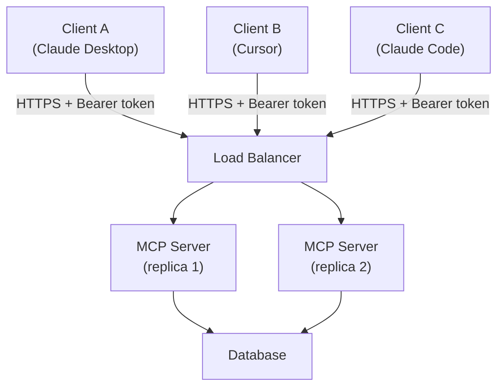

# MCP remoto — HTTP + SSE para times

> [!abstract] TL;DR
> [[Dicionário de IA#transport (stdio, SSE, HTTP)|stdio]] é simples mas **single-user**. Para times compartilharem [[Dicionário de IA#MCP server|MCP server]], use **HTTP + SSE** (Server-Sent Events). Setup: server roda como serviço (Docker, K8s, ou managed), client conecta via URL com auth. Adiciona overhead de TLS, auth, deployment, mas habilita: server compartilhado, rate limit centralizado, audit log unificado, atualizações sem update no client. Em 2026, padrão para servers internos enterprise.

> [!question]- Quais os riscos de expor MCP remotamente que não existem no local?
> Stdio herda a identidade do usuário que executou o client — o sistema operacional faz a "auth". HTTP+SSE abre uma porta de rede, e com ela vêm todos os vetores de ataque de rede: tokens mal gerenciados, interceptação sem TLS, brute force em endpoints, SSRF se o server fizer requisições baseadas em input do usuário, e a superfície de supply chain fica mais visível (servidor acessível por URL pode ser alvo de bots). Além disso, um server HTTP+SSE que loga mal se torna um ponto cego de auditoria — em stdio, cada user tem seu processo; em HTTP, uma action mal logada é uma action que parece não ter acontecido.

Imagine um time de cinco pessoas usando o mesmo [[Dicionário de IA#MCP server|MCP server]] de acesso ao banco de produção. Com stdio, cada dev spawna seu próprio subprocesso local — cinco processos, cada um com sua própria conexão ao banco, seu próprio cache, sua própria versão do código do server. Um deploy de correção precisa ser repetido cinco vezes (um `git pull` por máquina). Um bug de permissão vira cinco tickets separados, porque não há um único lugar que loga "quem fez o quê". É exatamente esse cenário — o mesmo servidor de banco compartilhado por um time inteiro — que empurra a decisão de stdio para HTTP+SSE: em vez de cinco processos soltos, um único server rodando como serviço, com auth, rate limit e audit log centralizados.

## Quando partir para HTTP+SSE

Sinais que indicam migrar de stdio:

- Múltiplos devs precisam do **mesmo server** (cada um spawnando subprocess é desperdício)
- Server precisa de **state persistente** entre sessões
- Auth/permissão **centralizada** (não cada user com creds próprias)
- Audit log **unificado** (compliance)
- Server tem **APIs caras** (rate limit compartilhado faz sentido)
- Update do server **sem update no client** (deploy server, todos pegam)

## Arquitetura



Server vira **microserviço** como qualquer outro.

## Setup mínimo (Python)

```python
# server.py
from mcp.server.fastmcp import FastMCP
from mcp.server.sse import SseServerTransport
import asyncio
from starlette.applications import Starlette
from starlette.routing import Mount, Route

mcp = FastMCP("team-mcp-server")

@mcp.tool()
def query_db(sql: str) -> dict:
    """Query the database."""
    return db.execute(sql)

# Setup HTTP+SSE transport
transport = SseServerTransport("/messages")

async def handle_sse(request):
    async with transport.connect_sse(request.scope, request.receive, request._send) as streams:
        await mcp._mcp_server.run(streams[0], streams[1], mcp._mcp_server.create_initialization_options())

app = Starlette(routes=[
    Route("/sse", endpoint=handle_sse),
    Mount("/messages", app=transport.handle_post_message),
])

# Run with uvicorn
# uvicorn server:app --host 0.0.0.0 --port 8000
```

## Configuração no client

```json
{
  "mcpServers": {
    "team-server": {
      "url": "https://mcp.empresa.com/sse",
      "headers": {
        "Authorization": "Bearer ${MCP_TOKEN}"
      }
    }
  }
}
```

Client conecta via URL em vez de spawn de processo.

> [!example]- O que acontece sem o header `Authorization`
> ```
> $ curl -N https://mcp.empresa.com/sse
> HTTP/1.1 401 Unauthorized
> {"error": "missing_authorization_header"}
> ```
> Sem o `Bearer ${MCP_TOKEN}` no header, o server rejeita a conexão SSE antes mesmo de abrir o stream — não há "modo degradado" ou fallback silencioso. Isso é intencional: um MCP server remoto que aceitasse conexões sem token estaria expondo tools (e o banco por trás delas) pra qualquer cliente na rede.

## Auth — onde realmente importa

stdio assume que processo filho herda permissão do user. HTTP+SSE precisa **auth explícita**.

### Opção 1 — Bearer token (mais comum)

```python
from starlette.middleware.authentication import AuthenticationMiddleware
from starlette.authentication import (
    AuthenticationBackend, BaseUser, AuthCredentials
)

class BearerAuthBackend(AuthenticationBackend):
    async def authenticate(self, request):
        auth = request.headers.get("Authorization", "")
        if not auth.startswith("Bearer "):
            return None
        token = auth[7:]
        user = await validate_token(token)
        if not user:
            return None
        return AuthCredentials(["authenticated"]), user

app.add_middleware(AuthenticationMiddleware, backend=BearerAuthBackend())
```

Tokens podem ter scopes:

```python
@mcp.tool()
async def admin_action(request, ...):
    if "admin" not in request.user.scopes:
        raise PermissionError("Admin scope required")
    ...
```

### Opção 2 — OAuth 2.1 (enterprise)

MCP spec define OAuth flow. Mais setup, mas integra com SSO existente.

```
1. Client redirect → Auth server (Keycloak, Auth0, Okta)
2. User autentica
3. Auth server → Client com authorization code
4. Client → MCP server com code → access token
5. Client usa access token em chamadas MCP
```

Use OAuth quando:
- Auth corporativa existe (SSO)
- Compliance exige
- Multi-tenant com permissões fine-grained

### Opção 3 — mTLS (alta segurança)

Client e server apresentam certs. Comum em internal-only services.

## Rate limiting

```python
from slowapi import Limiter
from slowapi.util import get_remote_address

limiter = Limiter(key_func=lambda r: r.user.id)  # per user

@mcp.tool()
@limiter.limit("100/minute")
async def expensive_tool(...):
    ...
```

Importante para servers que falam com APIs externas pagas.

## Deploy patterns

### Docker simples

```dockerfile
FROM python:3.12-slim
WORKDIR /app
COPY requirements.txt .
RUN pip install -r requirements.txt
COPY server.py .
EXPOSE 8000
CMD ["uvicorn", "server:app", "--host", "0.0.0.0", "--port", "8000"]
```

```bash
docker build -t my-mcp-server .
docker run -p 8000:8000 -e DATABASE_URL=... my-mcp-server
```

### Kubernetes (production)

```yaml
apiVersion: apps/v1
kind: Deployment
metadata:
  name: mcp-server
spec:
  replicas: 3
  selector:
    matchLabels:
      app: mcp-server
  template:
    metadata:
      labels:
        app: mcp-server
    spec:
      containers:
      - name: server
        image: registry/mcp-server:1.2.0
        ports:
        - containerPort: 8000
        env:
        - name: DATABASE_URL
          valueFrom:
            secretKeyRef:
              name: mcp-secrets
              key: database_url
```

Health checks, autoscaling, etc — como qualquer microserviço.

### Managed (Cloudflare Workers, Vercel, Fly.io)

Cloudflare Workers tem suporte nativo a MCP em 2026:

```javascript
import { McpAgent } from "@cloudflare/mcp-agent";

export default new McpAgent({
  name: "team-server",
  tools: { ... },
}).asWorker();
```

Outros: Smithery (managed MCP), Anthropic-hosted (em beta).

## Observabilidade

```python
import logging
import time

@mcp.tool()
async def query_db(request, sql: str):
    start = time.time()
    user_id = request.user.id

    try:
        result = await db.execute(sql)
        log_event("tool_call", {
            "tool": "query_db",
            "user": user_id,
            "duration_ms": (time.time() - start) * 1000,
            "rows": len(result),
            "success": True
        })
        return result
    except Exception as e:
        log_event("tool_call", {
            "tool": "query_db",
            "user": user_id,
            "duration_ms": (time.time() - start) * 1000,
            "error": str(e),
            "success": False
        })
        raise
```

Métricas a tracar:
- Tool calls / minuto (per tool, per user)
- Latência p50, p95, p99
- Error rate
- Cost (se tool chama APIs pagas)

## Quando NÃO migrar para HTTP+SSE

❌ Single user (stdio basta)
❌ Server com tools que precisam de fs local (filesystem MCP)
❌ Latência crítica <50ms (overhead de rede)
❌ Time pequeno sem ops capability

## Custo

Server HTTP+SSE rodando 24/7 em produção:

| Setup | Custo/mês |
|---|---|
| Fly.io / Railway pequeno | $10-50 |
| Cloudflare Workers | $0-20 (free tier generoso) |
| K8s self-hosted | $30-100 (compute) + ops |
| Managed (Smithery, Anthropic) | $50-200 |

stdio: $0 (roda no machine do user).

## Armadilhas comuns

> [!warning] Server sem health check e sem alertas
> Um MCP server HTTP que falha silenciosamente é pior do que não ter o servidor: os clients continuam tentando conectar, os usuários veem erros opacos ("tool call failed"), e sem alertas ninguém sabe se o server caiu há 5 minutos ou 5 horas. Health check endpoint (`/health`) + monitoramento com alerta automático (Sentry, PagerDuty) não é overkill — é operação básica de qualquer serviço que impacta o trabalho de um time.

> [!warning] Sem separação entre dev e prod
> Um server que serve tanto ambiente de desenvolvimento quanto produção é um acidente esperando acontecer. Um dev testando uma tool destrutiva (`delete_record`) em produção por engano, ou um deploy de staging que sobrescreve dados de produção. Mantenha servidores separados com configs separadas, mesmo que sejam deploys do mesmo código. O custo de um segundo servidor é trivial comparado ao custo de um incidente de produção.

> [!warning] Audit log apenas em caso de erro
> Logar só falhas significa que você sabe o que quebrou, mas não o que funcionou. Em compliance, a pergunta não é só "o que deu errado?" mas "o que foi feito?". Tool calls bem-sucedidas — especialmente as destrutivas — precisam de registro completo: quem chamou, quando, com quais argumentos, e qual foi o resultado. Um audit log com gaps é inutilizável para compliance e dificulta debugging de comportamentos inesperados que não geraram erros explícitos.

## Anti-patterns

- **HTTP+SSE para single user** — overengineering
- **Sem auth** — server é gateway pra dados internos
- **Sem rate limit** — abuse mata budget de APIs externas
- **Server stateful sem persistência** — restart perde tudo
- **Sem health checks** — restarts silenciosos quebram clients
- **Mesmo server para dev e prod** — accidents irrecuperáveis
- **Audit log apenas em error** — ações bem-sucedidas também precisam tracking

## Métricas

| Métrica | Alvo |
|---|---|
| **Latência p95 tool call** | <500ms |
| **Uptime** | >99.9% |
| **Auth failure rate** | <1% |
| **Rate limit triggers/dia** | <5% das chamadas |
| **Custo por tool call** | <$0.001 |

## Como explicar em inglês

HTTP+SSE transport turns an MCP server from a local subprocess into a shared microservice. The server runs independently — in Docker, Kubernetes, Fly.io, or a managed platform like Smithery — and clients connect via HTTPS with a bearer token or OAuth 2.1. This enables three things that stdio cannot provide: multiple users sharing a single server instance, centralized auth and rate limiting, and server updates that don't require updating client configurations.

The architecture is similar to any REST API service: a load balancer distributes traffic across server replicas, each replica connects to shared state (a database), and structured logs flow to an observability backend. The difference is that instead of REST endpoints, the server exposes MCP tools via JSON-RPC over SSE — the client sends requests via HTTP POST and receives streaming responses via Server-Sent Events. This asymmetric pattern (POST for requests, SSE for responses) is what enables streaming tool results without full WebSocket complexity.

**In a technical interview**, you might say:

> "HTTP+SSE is the answer when you need to share an MCP server across a team. The server becomes a standalone microservice with bearer token or OAuth 2.1 auth, rate limiting per user, centralized audit logging, and independent deployability. The tradeoff vs stdio is real: you add 30-100ms of network latency, you need TLS, and you need to operate a service. The migration from stdio is low-friction — FastMCP supports both transports, you just change the startup code. The moment you have two developers who need the same MCP capabilities, the shared server pays for itself in eliminated duplication."

| PT | EN |
|----|-----|
| Servidor remoto | Remote server |
| Token de acesso | Bearer token |
| Limitação de taxa | Rate limiting |
| Balanceador de carga | Load balancer |
| Implantação | Deployment |
| Registro de auditoria | Audit log |
| Microserviço | Microservice |
| Fluxo OAuth | OAuth flow |
| Checagem de saúde | Health check |
| Estado persistente | Persistent state |

## O que vem a seguir

Expor um MCP server remotamente levanta uma questão imediata: quais são os riscos de segurança específicos de MCP que não existem em APIs REST tradicionais? Prompt injection via tool output, supply chain attacks via servidores de terceiros, e credentials exfiltradas via tool params são vetores que não existiam no mundo de APIs sem LLMs. A próxima nota mapeia esses riscos com defesas concretas em camadas.

- [[07 - Segurança em MCP]] — threat model completo e defesas em profundidade

## Veja também

- [[03 - Arquitetura cliente-servidor]]
- [[05 - Construindo um MCP server local]]
- [[07 - Segurança em MCP]]
- [[Segurança e Guardrails|06 - Permissões e sandboxing]]
- [[Segurança e Guardrails|11 - Governance as architecture — EU AI Act, GDPR, licenças]]

## Referências

- **MCP Spec** — [Transports section (HTTP+SSE)](https://modelcontextprotocol.io/specification/2025-06-18/basic/transports) (modelcontextprotocol.io)
- **Cloudflare** — [MCP on Cloudflare Workers](https://developers.cloudflare.com/agents/guides/remote-mcp-server/) (2025)
- **Smithery.ai** — [managed MCP hosting](https://smithery.ai/)
- **Anthropic** — *Hosted MCP servers (beta)* (2026)
